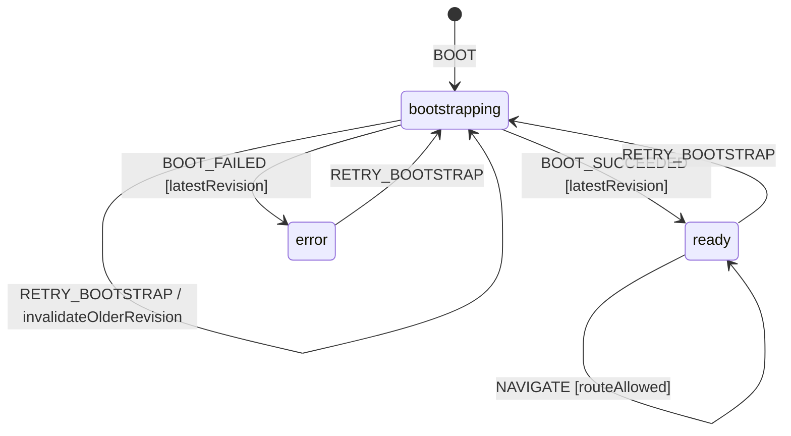
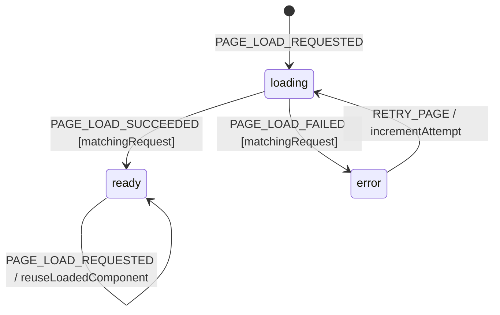
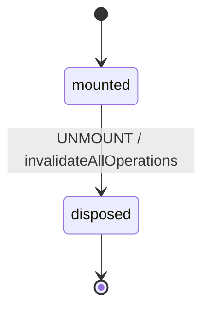

# App Shell Workflow Model

Authoritative behavior for side-panel bootstrap, navigation, premium routing,
and lazy page loading. This model complements `launch-performance.model.md`:
that document owns timing budgets; this document owns state and recovery.

## Scope and decisions

The shell decides which page can be shown and whether its local extension
chunk is available. It does not decide page business state, perform connector
I/O, or read IndexedDB/cookies directly. All persisted reads go through a
facade and the service-worker messaging bridge.

Bootstrap and page loading are independent machines. A page chunk can fail
without corrupting bootstrap, and a bootstrap retry does not implicitly retry
every failed page. Page components remain responsible for their own render
boundaries once a chunk has loaded.

## State vocabulary and context

```ts
type Page = 'feed' | 'profile' | 'cv' | 'applications' | 'tjm' | 'settings' | 'onboarding';

type AppBootStatus = 'bootstrapping' | 'ready' | 'error';
type PageLoadStatus = 'loading' | 'ready' | 'error';
type AppShellLifecycle = 'mounted' | 'disposed';

interface PageLoadSnapshot {
  status: PageLoadStatus;
  requestId: string;
  attempt: number;
  error: string | null;
}

interface AppShellContext {
  lifecycle: AppShellLifecycle;
  bootStatus: AppBootStatus;
  bootstrapRevision: number;
  currentPage: Page;
  previousPageIndex: number;
  hasCompletedOnboarding: boolean;
  profilePresent: boolean;
  firstScanDone: boolean;
  onboardingCompleted: boolean;
  premiumAccessible: boolean;
  connection: 'online' | 'offline';
  pages: Partial<Record<Page, PageLoadSnapshot>>;
  bootError: string | null;
}
```

Absence from `pages` means a chunk has not been requested. Once requested,
the only page-load statuses are exactly `loading`, `ready`, and `error`.
`disposed` belongs only to `AppShellLifecycle`; it is never an alias for an
app-bootstrap or page-load status.

## Events

```ts
type AppShellEvent =
  | { type: 'BOOT' }
  | {
      type: 'BOOT_SUCCEEDED';
      revision: number;
      profilePresent: boolean;
      firstScanDone: boolean;
      onboardingCompleted: boolean;
    }
  | { type: 'BOOT_FAILED'; revision: number; error: string }
  | { type: 'RETRY_BOOTSTRAP' }
  | { type: 'NAVIGATE'; page: Page }
  | { type: 'PAGE_LOAD_REQUESTED'; page: Page; requestId: string }
  | { type: 'PAGE_LOAD_SUCCEEDED'; page: Page; requestId: string }
  | { type: 'PAGE_LOAD_FAILED'; page: Page; requestId: string; error: string }
  | { type: 'RETRY_PAGE'; page: Page; requestId: string }
  | { type: 'PROFILE_UPDATED' }
  | { type: 'PREMIUM_CHANGED'; accessible: boolean }
  | { type: 'NETWORK_CHANGED'; online: boolean }
  | { type: 'SERVICE_WORKER_RESTARTED' }
  | { type: 'UNMOUNT' };
```

All request/revision identifiers are created by the Shell. Time and IDs are
never created in Core transition logic.

## Statecharts







Lifecycle is orthogonal to bootstrap and per-page loading. `UNMOUNT` moves the
instance to `disposed`, invalidates every revision/request ID, and prevents all
later events from reaching either nested machine.

## Guards

| Guard             | Rule                                                                                                                                           |
| ----------------- | ---------------------------------------------------------------------------------------------------------------------------------------------- |
| `latestRevision`  | Event revision equals `bootstrapRevision`; older async results are discarded.                                                                  |
| `routeAllowed`    | Bootstrap is `ready`, the page is known, and onboarding routing is respected. A locked premium route is allowed so its explanation can render. |
| `canImportPage`   | Page is not premium-gated, or `premiumAccessible` is true. A denied page stays routed but its protected chunk is not imported.                 |
| `matchingRequest` | Page and `requestId` match the page's current load snapshot.                                                                                   |
| `needsOnboarding` | No profile, no completed first scan, and no persisted onboarding completion.                                                                   |
| `canRetryPage`    | The requested page exists and its current status is `error`.                                                                                   |

The initial route is `onboarding` only when `needsOnboarding`; otherwise it is
`feed`. A premium-denied `cv`, `applications`, or `tjm` navigation is accepted
only to render the deterministic lock surface; `canImportPage` prevents the
protected page import.

## Transition tables

### Bootstrap and navigation

| From                | Event                      | Guard            | To                   | Effects                                                                             |
| ------------------- | -------------------------- | ---------------- | -------------------- | ----------------------------------------------------------------------------------- |
| `bootstrapping`     | `BOOT_SUCCEEDED`           | `latestRevision` | `ready`              | Commit flags, choose initial route, clear error.                                    |
| `bootstrapping`     | `BOOT_FAILED`              | `latestRevision` | `error`              | Keep static shell visible and store typed error.                                    |
| `bootstrapping`     | `RETRY_BOOTSTRAP`          | —                | `bootstrapping`      | Increment revision and start one replacement read.                                  |
| `error`             | `RETRY_BOOTSTRAP`          | —                | `bootstrapping`      | Clear error, increment revision, read again.                                        |
| `ready`             | `NAVIGATE`                 | `routeAllowed`   | `ready`              | Update page and direction; request chunk if absent.                                 |
| `ready`             | `PROFILE_UPDATED`          | —                | `ready`              | Mark onboarding complete; keep the user's current valid page.                       |
| `ready`             | `PREMIUM_CHANGED`          | —                | `ready`              | Recompute access; keep route and render lock instead of protected page when denied. |
| any while `mounted` | `NETWORK_CHANGED`          | —                | same                 | Project connectivity only; local shell remains usable.                              |
| any while `mounted` | `SERVICE_WORKER_RESTARTED` | —                | same                 | Reconnect bridge; re-bootstrap only if local reads cannot be confirmed.             |
| lifecycle `mounted` | `UNMOUNT`                  | —                | lifecycle `disposed` | Invalidate revisions/request IDs and unsubscribe listeners.                         |

### Per-page loader

| From      | Event                 | Guard                          | To        | Effects                                                             |
| --------- | --------------------- | ------------------------------ | --------- | ------------------------------------------------------------------- |
| absent    | `PAGE_LOAD_REQUESTED` | route allowed, `canImportPage` | `loading` | Create snapshot and run one dynamic import.                         |
| `loading` | duplicate request     | same page/request              | `loading` | Reuse the in-flight promise.                                        |
| `loading` | `PAGE_LOAD_SUCCEEDED` | `matchingRequest`              | `ready`   | Store component and emit page-loaded mark.                          |
| `loading` | `PAGE_LOAD_FAILED`    | `matchingRequest`              | `error`   | Store safe error and show retry surface, never an endless skeleton. |
| `error`   | `RETRY_PAGE`          | `canRetryPage`                 | `loading` | New request ID, increment attempt, rerun import.                    |
| `ready`   | navigation to page    | —                              | `ready`   | Reuse the already loaded component.                                 |

## Side effects and ownership

- **Side panel Shell:** calls `getProfile`, `getFirstScanDone`, and
  `getOnboardingCompleted` through facades; owns dynamic imports, subscriptions,
  performance marks, and Svelte render projection.
- **Service worker Shell:** owns persisted profile/flag reads and sends typed
  responses. Restarting it cannot choose a route; it only supplies facts.
- **Core:** contains pure route, guard, and transition decisions. It imports no
  Shell module and receives revisions, flags, and premium access as inputs.
- **UI:** renders `bootstrapping`, `error`, the selected page, or a premium lock.
  It emits events but never mutates the machine context directly.

The public recovery contract consumed by the shell is
`retryBootstrap(): Promise<void>` plus `retryPage(page): void`. The per-page
status projection is `Partial<Record<Page, PageLoadStatus>>`.

## Persistence boundary

`UserProfile` remains in IndexedDB; `first_scan_done` and
`onboarding_completed` remain in `chrome.storage.local`. The service worker is
the only persistence owner. Page component values, current navigation, errors,
request IDs, and in-flight imports are ephemeral and are rebuilt on side-panel
open. The persisted facts win after a panel or worker restart.

## Permissions and offline behavior

Rendering the shell and importing packaged chunks require no optional host
permission. Feature-specific permission refusal is projected inside that
feature and cannot crash the shell. Bootstrap uses local persistence and must
work offline. Offline network-dependent pages may show their own degraded state;
the shell remains `ready` and all local pages remain navigable.

## Retry, cancellation, concurrency, and restart

- `retryBootstrap()` replaces the active revision; late results from older
  revisions are ignored.
- `retryPage(page)` exists only for `error` and creates a fresh request ID.
- `UNMOUNT` is cancellation: it invalidates all outstanding results and causes
  no persistence.
- Concurrent bootstrap attempts collapse to the latest revision. Concurrent
  imports for one page share one promise; different page imports may run in
  parallel.
- A service-worker restart triggers bridge reconnection. It does not reset a
  ready page or fabricate bootstrap success. If a message was lost, the shell
  repeats the idempotent local read.

## Terminal states and re-entry

The app shell is long-lived and has no permanent terminal state. `ready` and
`error` are settled states; both permit explicit recovery. A page's `ready` is
stable until panel unmount, while `error` re-enters `loading` only through
`RETRY_PAGE`. `disposed` is terminal for the unmounted instance; a new panel
creates a new machine and new operation IDs.

## Forbidden transitions

- `BOOT_SUCCEEDED` or `BOOT_FAILED` from an older revision must not mutate state.
- `NAVIGATE` during `bootstrapping`/`error` or to an unknown page is rejected;
  a premium-locked route may render its lock explanation but must not load the
  protected component.
- A stale page success/failure must not replace the current page request.
- A rejected dynamic import must not leave the page in `loading`.
- `PROFILE_UPDATED` must not silently mark a failed persistence attempt as
  successful.
- No event is accepted after lifecycle `disposed`; every late result is
  discarded.
- No implicit transition may be derived from copy, rendered text, or a toast.

## Invariants

1. Exactly one `AppBootStatus` is authoritative at a time.
2. UI success is rendered only from confirmed `ready` states.
3. Initial routing is a pure function of persisted facts.
4. Page imports are packaged local code; network status cannot gate them.
5. Every async result carries a matching revision/request ID.
6. The side panel never reads IndexedDB or cookies directly.
7. An LLM never decides a transition; model events and deterministic guards do.
8. Shell calls Core; Core never imports Shell or creates time/IDs.
9. Lifecycle, bootstrap, and page-load states have distinct typed ownership;
   `disposed` can never appear in an `AppBootStatus` or `PageLoadStatus`.

## Review checklist

- [x] Nominal boot, initial routing, navigation, and cached page reuse are explicit.
- [x] Bootstrap and chunk failures have visible, retryable error states.
- [x] Permission refusal is contained by the owning feature.
- [x] Offline bootstrap and local navigation remain available.
- [x] Duplicate bootstrap/import requests and stale results are deterministic.
- [x] Unmount cancellation invalidates in-flight results.
- [x] Service-worker restart reconnects or rereads without fabricated success.
- [x] Settled-state re-entry requires a named retry or new panel instance.
