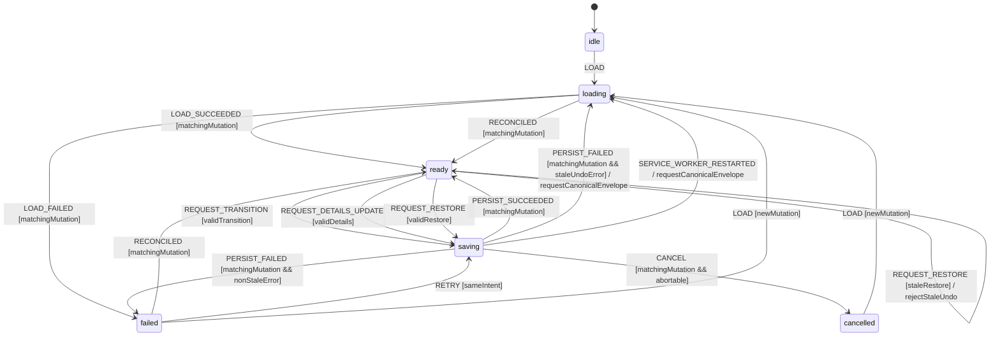

# Application Tracking Workflow Model

Authoritative domain and persistence model for moving a mission through the
application pipeline, editing follow-up details, and restoring a confirmed
previous record through Undo.

## Scope and decisions

The domain pipeline is pure and canonical in `@pulse/domain`. Persistence is a
separate transaction machine. A valid candidate transition is not user-visible
success until IndexedDB confirms the write. The service worker must return a
typed application error on failure; it must never synthesize a default tracking
record as a success response.

Task 5 delivers the truthful acknowledgement slice of this model: strict
success/failure bridge variants, deterministic error mapping, response identity
validation, preservation of the last confirmed UI state, and success/Undo
effects only after persistence acknowledgement. The revision, mutation-ID,
compare-and-swap, per-mission actor, cancellation, and restart-reconciliation
parts remain reviewed target behavior and are explicitly reserved below. A
reserved capability must not be inferred from the Task 5 wire contract.

## Task 5 error and bridge contract

```ts
type ApplicationTrackingIntent = 'load' | 'transition' | 'details' | 'restore';

type Task5ApplicationTrackingErrorCode =
  | 'LOAD_FAILED'
  | 'PERSIST_FAILED'
  | 'INVALID_TRANSITION'
  | 'INVALID_DETAILS'
  | 'INVALID_RESTORE'
  | 'TRANSPORT_ERROR'
  | 'PROTOCOL_ERROR';

type ReservedApplicationTrackingErrorCode =
  'STALE_UNDO' | 'APPLICATION_BUSY' | 'CANCELLED' | 'WORKER_RESTARTED';

type ApplicationTrackingErrorCode =
  Task5ApplicationTrackingErrorCode | ReservedApplicationTrackingErrorCode;

/** Plain structured-clone-safe data carried across runtime messaging. */
interface SerializedApplicationTrackingError {
  version: 1;
  /** Wire v1 accepts Task 5 codes only; every reserved code is invalid. */
  code: Task5ApplicationTrackingErrorCode;
  intent: ApplicationTrackingIntent;
  missionId: string | null;
  /** Always null in Task 5; reserved for an additive mutation-ID protocol. */
  mutationId: string | null;
  message: string;
  recoverable: boolean;
}

/** UI-local Error reconstructed after strict response validation. */
interface ApplicationTrackingError extends Error {
  readonly name: 'ApplicationTrackingError';
  readonly code: Task5ApplicationTrackingErrorCode;
  readonly intent: ApplicationTrackingIntent;
  readonly missionId: string | null;
  readonly mutationId: string | null;
  readonly recoverable: boolean;
}

/** Conceptual target-actor error; reserved codes require a later model review. */
interface TargetApplicationTrackingError extends Error {
  readonly code: ApplicationTrackingErrorCode;
  readonly intent: ApplicationTrackingIntent;
  readonly missionId: string | null;
  readonly mutationId: string;
}

type TrackingFailureMessage = {
  type: 'TRACKING_FAILED';
  payload: SerializedApplicationTrackingError;
};

type TrackingSuccessMessage =
  | { type: 'TRACKINGS_RESULT'; payload: MissionTracking[] }
  | { type: 'TRACKING_UPDATED'; payload: MissionTracking }
  | {
      type: 'TRACKING_RESTORED';
      payload: { missionId: string; tracking: MissionTracking | null };
    };
```

`TRACKING_FAILED` is the only recognized tracking-command failure response. It
contains no raw exception, stack, DOM exception, arbitrary context, timestamp,
or user-controlled tracking content. A malformed untrusted request may still be
rejected by the global bridge boundary; when a caller receives no valid tracking
variant, it constructs a local `PROTOCOL_ERROR` or `TRANSPORT_ERROR` and never
infers success.

`recoverable` is a pure function of `code`. It means that the listed explicit
recovery action may succeed; it never authorizes automatic mutation replay.

```ts
const TASK5_APPLICATION_TRACKING_RECOVERABLE = {
  LOAD_FAILED: true,
  PERSIST_FAILED: true,
  INVALID_TRANSITION: false,
  INVALID_DETAILS: false,
  INVALID_RESTORE: false,
  TRANSPORT_ERROR: true,
  PROTOCOL_ERROR: true,
} as const satisfies Record<Task5ApplicationTrackingErrorCode, boolean>;
```

| Intent       | Condition                                            | Code                 | Recoverable | Stable user message                                                                  | Required recovery                                                |
| ------------ | ---------------------------------------------------- | -------------------- | ----------- | ------------------------------------------------------------------------------------ | ---------------------------------------------------------------- |
| `load`       | IndexedDB query/normalization rejects                | `LOAD_FAILED`        | yes         | `Impossible de charger le suivi des candidatures.`                                   | Explicit Load; keep the last confirmed collection until success. |
| `transition` | Domain transition guard rejects                      | `INVALID_TRANSITION` | no          | `Ce changement de statut n’est pas autorisé.`                                        | Choose an enumerated target; never persist.                      |
| `details`    | Date/details validation rejects                      | `INVALID_DETAILS`    | no          | `Les détails de suivi sont invalides.`                                               | Correct the explicit input; never persist.                       |
| `restore`    | Snapshot is invalid or belongs to another mission    | `INVALID_RESTORE`    | no          | `Cette annulation n’est pas valide.`                                                 | Discard the invalid Undo request; never persist.                 |
| `transition` | Required mutation read/write rejects                 | `PERSIST_FAILED`     | yes         | `Impossible d’enregistrer le nouveau statut.`                                        | Keep previous; a new explicit attempt rereads canonical state.   |
| `details`    | Required mutation read/write rejects                 | `PERSIST_FAILED`     | yes         | `Impossible d’enregistrer les détails de suivi.`                                     | Keep previous; a new explicit attempt rereads canonical state.   |
| `restore`    | Required restore put/delete rejects                  | `PERSIST_FAILED`     | yes         | `Impossible d’annuler la modification.`                                              | Keep current; a new Undo must be revalidated.                    |
| any          | Runtime send rejects/disconnects/no response         | `TRANSPORT_ERROR`    | yes         | `La confirmation du suivi n’a pas été reçue. Rechargez le suivi avant de réessayer.` | Preserve previous, then explicitly Load; never replay blindly.   |
| any          | Type/payload/version/identity does not match request | `PROTOCOL_ERROR`     | yes         | `La réponse du suivi est invalide. Rechargez le suivi avant de réessayer.`           | Preserve previous, then explicitly Load; never infer success.    |

The reserved target codes are not part of serialized wire version 1. A v1
`TRACKING_FAILED` carrying `STALE_UNDO`, `APPLICATION_BUSY`, `CANCELLED`, or
`WORKER_RESTARTED` is invalid and becomes a local `PROTOCOL_ERROR`. A future
reviewed protocol version must define their exact intent, message,
recoverability, identity, and persistence semantics before accepting them.

Additional deterministic rules:

- A mutation-side `getTracking` failure is `PERSIST_FAILED`, not
  `LOAD_FAILED`, because it occurred while preparing a mutation intent.
- Unknown storage exceptions normalize to `LOAD_FAILED` for `load` and
  `PERSIST_FAILED` for mutation intents. Their raw messages never cross the
  bridge.
- `TRANSPORT_ERROR` and `PROTOCOL_ERROR` are normally UI-local. The service
  worker sends them only if it can deterministically identify the condition
  before response delivery.
- A code used with a forbidden intent, a mismatched `recoverable`, or a
  non-null Task 5 `mutationId` makes the entire response a local
  `PROTOCOL_ERROR`.

## Domain states

```ts
type ApplicationStatus =
  | 'detected'
  | 'selected'
  | 'application_prepared'
  | 'applied'
  | 'interview'
  | 'offer'
  | 'accepted'
  | 'rejected'
  | 'archived';
```

Allowed transitions are exact:

| From                   | Allowed targets                               |
| ---------------------- | --------------------------------------------- |
| `detected`             | `selected`, `archived`                        |
| `selected`             | `application_prepared`, `applied`, `archived` |
| `application_prepared` | `applied`, `archived`                         |
| `applied`              | `interview`, `offer`, `rejected`, `archived`  |
| `interview`            | `offer`, `rejected`, `archived`               |
| `offer`                | `accepted`, `rejected`, `archived`            |
| `accepted`             | `archived`                                    |
| `rejected`             | `archived`                                    |
| `archived`             | `detected`                                    |

`accepted`, `rejected`, and `archived` terminate follow-up scheduling and
therefore force `nextActionAt = null`. They are settled business outcomes, not
all permanently absorbing: accepted/rejected may be archived, and archived may
be deliberately reopened to detected.

## Reserved target operation states and context

This section specifies the intended post-Task-5 actor. Its envelopes,
revision/mutation IDs, compare-and-swap, cancellation, concurrency, and restart
behavior are not implemented by Task 5. They remain design constraints for a
dedicated readiness task and cannot be used as current release evidence.

```ts
type TrackingMutationState = 'idle' | 'loading' | 'ready' | 'saving' | 'failed' | 'cancelled';

interface PersistedTrackingEnvelope {
  missionId: string;
  tracking: MissionTracking | null;
  revision: number;
  lastMutationId: string | null;
}

interface TrackingUndoEntry {
  missionId: string;
  previous: MissionTracking | null;
  expectedCurrentRevision: number;
  expectedCurrentMutationId: string;
}

interface TrackingMutationContext {
  state: TrackingMutationState;
  missionId: string | null;
  mutationId: string | null;
  previous: MissionTracking | null;
  candidate: MissionTracking | null;
  confirmed: MissionTracking | null;
  confirmedRevision: number;
  confirmedMutationId: string | null;
  intent: Exclude<ApplicationTrackingIntent, 'load'> | null;
  online: boolean;
  error: TargetApplicationTrackingError | null;
}
```

The UI collection contains only confirmed envelopes. `candidate` may be
previewed with a saving indicator, but cannot replace canonical state. An Undo
entry is created only from a successful envelope and therefore names the exact
revision/mutation that it is allowed to replace.

Mutation methods (`transitionStatus`, `updateNextActionAt`, and
`restoreTracking`) resolve with the confirmed record/delete only after
persistence. They reject with a typed `ApplicationTrackingError`; callers must
not interpret a resolved fallback record as success.

For the Task 5 slice, `mutationId` on the wire is always `null`. This reserved
field makes a later protocol additive; it is not evidence that Task 5 provides
deduplication, serialization, cancellation, or restart reconciliation.

## Reserved target events

```ts
type ApplicationTrackingEvent =
  | { type: 'LOAD'; mutationId: string }
  | { type: 'LOAD_SUCCEEDED'; mutationId: string; records: readonly PersistedTrackingEnvelope[] }
  | { type: 'LOAD_FAILED'; mutationId: string; error: TargetApplicationTrackingError }
  | {
      type: 'REQUEST_TRANSITION';
      missionId: string;
      to: ApplicationStatus;
      note: string | null;
      at: number;
      mutationId: string;
    }
  | {
      type: 'REQUEST_DETAILS_UPDATE';
      missionId: string;
      nextActionAt: string | null;
      mutationId: string;
    }
  | {
      type: 'REQUEST_RESTORE';
      missionId: string;
      previous: MissionTracking | null;
      expectedCurrentRevision: number;
      expectedCurrentMutationId: string;
      mutationId: string;
    }
  | {
      type: 'PERSIST_SUCCEEDED';
      mutationId: string;
      tracking: MissionTracking | null;
      revision: number;
      lastMutationId: string;
    }
  | { type: 'PERSIST_FAILED'; mutationId: string; error: TargetApplicationTrackingError }
  | { type: 'RETRY'; mutationId: string }
  | { type: 'CANCEL'; mutationId: string }
  | { type: 'NETWORK_CHANGED'; online: boolean }
  | { type: 'SERVICE_WORKER_RESTARTED' }
  | {
      type: 'RECONCILED';
      mutationId: string;
      tracking: MissionTracking | null;
      revision: number;
      lastMutationId: string | null;
    };
```

## Task 5 command settlement and response identity

The four current commands settle exactly as follows:

```text
GET_TRACKINGS
  query succeeds  -> TRACKINGS_RESULT(real normalized records)
  query rejects   -> TRACKING_FAILED(LOAD_FAILED, load, missionId null)

UPDATE_TRACKING
  guard rejects   -> TRACKING_FAILED(INVALID_TRANSITION, transition, requested missionId)
  commit succeeds -> TRACKING_UPDATED(exact confirmed record)
  read/write fails -> TRACKING_FAILED(PERSIST_FAILED, transition, requested missionId)

UPDATE_TRACKING_DETAILS
  guard rejects   -> TRACKING_FAILED(INVALID_DETAILS, details, requested missionId)
  commit succeeds -> TRACKING_UPDATED(exact confirmed record)
  read/write fails -> TRACKING_FAILED(PERSIST_FAILED, details, requested missionId)

RESTORE_TRACKING
  guard rejects   -> TRACKING_FAILED(INVALID_RESTORE, restore, requested missionId)
  commit succeeds -> TRACKING_RESTORED({ requested missionId, exact confirmed record or null })
  put/delete fails -> TRACKING_FAILED(PERSIST_FAILED, restore, requested missionId)
```

An actual successful empty query returns `TRACKINGS_RESULT([])` and may replace
the collection. A failed load never synthesizes `[]`; it preserves the exact
last confirmed collection, records the typed error, rejects `loadTrackings()`,
and waits for an explicit Load.

Mission and intent identity are mandatory:

1. `load` requests/failures carry `missionId: null`; mutation
   requests/failures carry the exact non-empty requested mission ID.
2. `TRACKING_UPDATED.missionId` must equal the pending `transition` or `details`
   request mission ID.
3. `TRACKING_RESTORED.payload.missionId` must equal the request mission ID,
   including a confirmed delete whose `tracking` is null. A non-null
   `payload.tracking.missionId` must equal both values. The supplied snapshot
   must otherwise be a complete canonical record; a mismatch is
   `INVALID_RESTORE` before I/O.
4. `TRACKING_FAILED` is accepted only when version, intent, mission ID,
   Task 5 null mutation ID, code/intent pairing, stable message, and derived
   `recoverable` all match the pending call.
5. Any unexpected type, malformed payload, wrong identity, or invalid failure
   field becomes a local `PROTOCOL_ERROR` and cannot mutate confirmed state.
6. No failure response carries a fallback `MissionTracking`; success data and
   error data are disjoint variants.

The Task 5 UI store method contracts are:

```ts
loadTrackings(): Promise<readonly MissionTracking[]>;
transitionStatus(...): Promise<MissionTracking>;
updateNextActionAt(...): Promise<MissionTracking>;
restoreTracking(...): Promise<MissionTracking | null>;
```

Each method validates the response before changing its map. A confirmed
success updates the map and resolves with the confirmed record/delete result.
A remote failure, transport failure, or protocol failure preserves the map
byte-for-byte, stores and rejects with the same typed error, and never resolves
after merely setting an error field. Pages create a success toast and Undo only
after a resolved acknowledgement. Every rejection creates one handled error
outcome; repeated identical error messages remain separate failures.

## Reserved target statechart

The following statechart is not the Task 5 runtime. It is the reviewed target
that the future revision/CAS/concurrency/restart task must refine and implement.



## Reserved target guards

| Guard              | Rule                                                                                                                                                                                                                               |
| ------------------ | ---------------------------------------------------------------------------------------------------------------------------------------------------------------------------------------------------------------------------------- |
| `matchingMutation` | Event mutation ID equals current mutation ID.                                                                                                                                                                                      |
| `validTransition`  | Pure `isValidTransition(from, to)` passes, or a missing record is first created as `detected` and then legally advanced.                                                                                                           |
| `validDetails`     | ISO date is valid or null; terminal candidate always normalizes it to null.                                                                                                                                                        |
| `validRestore`     | Snapshot is null or is a complete record for the same mission, and both expected revision/mutation ID equal the current confirmed envelope. The IndexedDB compare-and-swap repeats this comparison atomically before write/delete. |
| `staleRestore`     | Restore shape is valid but either expected revision or expected mutation ID differs from the confirmed/canonical envelope.                                                                                                         |
| `staleUndoError`   | Atomic compare-and-swap rejected restore with typed `STALE_UNDO`; no write occurred.                                                                                                                                               |
| `nonStaleError`    | Persistence error is any typed error other than `STALE_UNDO`.                                                                                                                                                                      |
| `sameIntent`       | Failed context still holds immutable previous/candidate/intent.                                                                                                                                                                    |
| `abortable`        | IndexedDB transaction has not committed.                                                                                                                                                                                           |

## Reserved target transition table

| From          | Event                    | Guard       | To          | Effects                                                                                                             |
| ------------- | ------------------------ | ----------- | ----------- | ------------------------------------------------------------------------------------------------------------------- |
| `idle`        | `LOAD`                   | —           | `loading`   | Read all tracking records through worker; validate/migrate on read.                                                 |
| `loading`     | `LOAD_SUCCEEDED`         | matching    | `ready`     | Replace collection with confirmed records.                                                                          |
| `loading`     | `LOAD_FAILED`            | matching    | `failed`    | Keep last confirmed collection and show retryable load error.                                                       |
| `ready`       | `REQUEST_TRANSITION`     | valid       | `saving`    | Purely build candidate/history with injected timestamp, then persist.                                               |
| `ready`       | `REQUEST_DETAILS_UPDATE` | valid       | `saving`    | Build complete candidate and persist it.                                                                            |
| `ready`       | `REQUEST_RESTORE`        | valid       | `saving`    | Compare-and-swap the expected envelope, then put previous snapshot or tombstone atomically.                         |
| `ready`       | `REQUEST_RESTORE`        | stale       | `ready`     | Reject `STALE_UNDO`, reread canonical envelope, and perform no write.                                               |
| `saving`      | `PERSIST_SUCCEEDED`      | matching    | `ready`     | Publish confirmed envelope; only now create a success toast/Undo token carrying the resulting revision/mutation ID. |
| `saving`      | `PERSIST_FAILED`         | stale Undo  | `loading`   | Perform no write, request canonical envelope, and expose typed `STALE_UNDO`.                                        |
| `saving`      | `PERSIST_FAILED`         | other error | `failed`    | Retain previous canonical record and retry intent; show typed error.                                                |
| `failed`      | `RETRY`                  | same intent | `saving`    | Use fresh mutation ID and re-read current record before compare/write.                                              |
| `saving`      | `CANCEL`                 | abortable   | `cancelled` | Abort transaction, retain previous, invalidate late response.                                                       |
| saving/failed | `RECONCILED`             | matching    | `ready`     | Replace UI state and revision/token with the canonical envelope; no guessed success/Undo.                           |
| any           | `NETWORK_CHANGED`        | —           | same        | Local tracking remains available; connected sync becomes deferred.                                                  |

An invalid domain transition is rejected before `saving` with a typed
`INVALID_TRANSITION` error. It does not echo the unchanged record as success.

## Side effects and ownership

- **Core/domain:** validates stages, creates candidates/history, normalizes
  terminal follow-up, rating/notes, and receives timestamps/IDs as arguments.
- **Service worker Shell:** reads/writes `mission_tracking` in IndexedDB and
  sends typed success/error bridge responses after transaction completion.
- **UI state:** keeps prior confirmed record while saving/failed; success toast
  and Undo window begin only after `PERSIST_SUCCEEDED`.
- **Reserved connected-dashboard target:** runs after local commit via a durable
  outbox. Task 5 does not implement that outbox. A future remote/network failure
  must be reported separately and cannot falsify local persistence or
  retroactively choose a pipeline state.

## Persistence boundary

In Task 5, the complete `MissionTracking` record is atomic in the IndexedDB
`mission_tracking` store. `currentStatus`, history, generated assets, rating,
notes, and `nextActionAt` commit together. A success response is sent only after
the corresponding put/delete transaction resolves; a failed transaction sends
only `TRACKING_FAILED`.

The target workflow extends this record to a persisted envelope containing a
monotonic revision and last mutation ID. Its delete retains a tombstone or
separate monotonic metadata so delete/recreate cannot make an old Undo token
valid again. That envelope, idempotency record, and compare-and-swap behavior
are reserved after Task 5 and must not be claimed by the current store.

UI candidate/previous/error state is ephemeral. Task 5 may create Undo only
after the confirmed write and keeps the confirmed pre-mutation snapshot. The
target workflow additionally binds that snapshot to the expected post-commit
revision/mutation ID. On panel reload, IndexedDB is canonical. Until the future
restart/reconciliation protocol exists, a transport-uncertain Task 5 mutation
requires an explicit canonical Load and is never replayed automatically.

## Permissions and offline behavior

Tracking needs no host, cookies, notification, clipboard, or network
permission. IndexedDB access stays inside the service worker. Storage denial,
quota, abort, corruption, or validation failure maps to `PERSIST_FAILED` or
`LOAD_FAILED` and remains visible.

Task 5 tracking is local-only, so offline does not block local transitions. In
the reserved target, optional connected sync is queued after local commit via a
durable outbox and retried independently; that future remote outcome cannot
produce a false local failure or success.

## Retry, cancellation, concurrency, and restart

- Task 5 retry is a fresh explicit command invocation, not the reserved actor's
  `RETRY` state/event. It rereads the canonical record and revalidates the
  intent; transport/protocol uncertainty first requires Load. No mutation is
  automatically replayed.
- Reserved target behavior: restore retry is allowed only while its expected
  revision/mutation ID matches; otherwise `STALE_UNDO` refreshes canonical
  state and writes nothing.
- Reserved target behavior: cancellation before commit aborts and preserves
  `previous`; after commit it is forbidden.
- Reserved target behavior: same-mission mutations are serialized and a
  concurrent request returns `APPLICATION_BUSY`; duplicate mutation IDs are
  idempotent.
- Reserved target behavior: worker restart during saving reconciles the
  canonical envelope before any success/Undo is shown.

## Terminal states and re-entry

In Task 5, `failed` is a settled UI outcome and re-enters only through explicit
Load or a new validated user intent. In the target actor, `cancelled` is
terminal and a new Load/intent creates a new mutation ID. Domain statuses
`accepted`, `rejected`, and `archived` are follow-up terminal as described
above; only their enumerated transitions permit re-entry.

## Forbidden transitions

### Task 5 forbidden transitions

- Any stage change absent from the canonical transition table.
- UI collection update, success toast, or Undo entry before persistence ack.
- Fallback `TRACKING_UPDATED`/`TRACKING_RESTORED` payload after storage failure.
- Terminal follow-up status with a non-null `nextActionAt`.
- `TRACKINGS_RESULT([])` synthesized by any read/normalization failure.
- A tracking method that sets an error but resolves, or a page that creates a
  success toast/Undo after a rejected or invalid acknowledgement.
- Automatic replay after transport/protocol uncertainty.
- An implicit transition derived from an AI-generated asset, note, or toast;
  asset generation may emit an explicit deterministic preparation event only.

### Reserved target forbidden transitions

- Retry, cancel, or response for a stale mutation ID.
- Restore whose expected revision/mutation ID differs from the canonical
  envelope, even when its snapshot is structurally valid.
- Concurrent mutation of the same mission without serialization/busy error.

These three transitions are target constraints, not Task 5 release evidence.

## Invariants

### Reserved target invariants

The following invariants constrain the future envelope/actor task. Their model
coverage is reviewed, but they are not implemented or verified by Task 5.

1. Domain transitions equal `APPLICATION_TRANSITIONS`; UI cannot broaden them.
2. `currentStatus` equals the last history target after every confirmed write.
3. Every history timestamp/client mutation ID is injected by Shell and unique.
4. Confirmed UI state never gets ahead of IndexedDB.
5. Persistence failure preserves the exact previous record and exposes error.
6. Terminal follow-up statuses clear `nextActionAt` atomically.
7. Undo restores a confirmed snapshot only by compare-and-swap against the
   exact revision/mutation it follows and is itself a persisted mutation.
8. Confirmed history is non-empty, begins with `null -> detected`, forms a
   valid contiguous chain, has monotonic injected timestamps, and ends at
   `currentStatus`.
9. `generatedAssetIds` contains no duplicate ID.
10. An LLM never decides a transition; generated content can only be an input
    to an explicit, guarded user/system event.
11. Core is pure; bridge, storage, clock, outbox, and toasts are Shell effects.
12. Revisions are monotonic across delete/recreate, so a stale Undo token can
    never become valid again.

### Task 5 invariants

1. Domain transitions equal `APPLICATION_TRANSITIONS`; UI cannot broaden them.
2. `currentStatus` equals the last history target after every confirmed write.
3. Core remains pure; bridge, storage, clock, and toasts are Shell/UI effects.
4. `TRACKINGS_RESULT([])` proves a successful empty read; no error path may
   synthesize it.
5. A success response follows the corresponding completed local transaction
   and contains the exact confirmed mission identity.
6. Every accepted failure matches the exact request intent and mission
   identity; a mismatch is a protocol failure and cannot mutate UI.
7. `recoverable` is a pure function of the code and never means automatic
   mutation replay.
8. Transport/protocol uncertainty preserves previous UI state and requires a
   canonical Load before retry.
9. Every failed store operation rejects with a typed error; setting an error
   field and resolving is forbidden.
10. Success toast and Undo creation are downstream only of a resolved,
    identity-checked persistence acknowledgement.
11. Restore failure preserves the current confirmed record and never returns a
    reread record under `TRACKING_RESTORED`; confirmed delete success still
    carries the exact mission ID.

## Task 5 implementation boundary

Task 5 includes:

- the complete serialized/local error types, deterministic code matrix, and
  strict `TRACKING_FAILED` schema;
- truthful Load, transition, details, and restore failure variants;
- deterministic domain/input/identity guards before persistence;
- typed store rejection, exact previous-state preservation, success/failure
  response validation, and safe transport/protocol handling;
- success/error/Undo ordering in Applications and Feed;
- development-stub parity and behavioral tests for the same contract.

Task 5 does not implement or verify:

- persisted revision/last-mutation envelopes, tombstones, mutation IDs, or
  duplicate-delivery idempotency;
- compare-and-swap restore and stale Undo beyond same-mission structural
  validation;
- per-mission actors, serialization, `APPLICATION_BUSY`, explicit mutation
  cancellation/retry states, or transaction abort;
- worker-restart checkpoints/reconciliation or a durable remote-sync outbox.

The reserved codes remain names in the target model, but wire version 1 rejects
them. Task 5 may emit, construct, or accept only `LOAD_FAILED`,
`PERSIST_FAILED`, `INVALID_TRANSITION`, `INVALID_DETAILS`, `INVALID_RESTORE`,
`TRANSPORT_ERROR`, and `PROTOCOL_ERROR`. A dedicated production-readiness task
must refine and implement the target actor before the release can claim
revision/CAS/concurrency/restart/outbox guarantees; no Task 5 test may pretend
they exist.

## Review checklist

### Task 5 gate decisions

- [x] `TRACKING_FAILED` is the single additive failure variant; wire v1 accepts
      only the seven Task 5 codes with exact structured-clone-safe fields.
- [x] Recoverable means recovery through the listed explicit action and never
      automatic replay.
- [x] Truthful failed Load is included; successful empty and failed collection
      reads are distinguishable.
- [x] Restore success always carries request mission identity, including a
      confirmed delete.
- [x] Revision/CAS/concurrency/restart/outbox work is an explicit separate
      production-readiness task and remains open.

### Reserved target design coverage (not implementation evidence)

- [x] Nominal load, create, legal transition, details update, restore, and reopen are explicit.
- [x] Invalid transition, storage failure, quota/validation error, and typed retry are covered.
- [x] Offline local behavior and deferred remote sync are separated.
- [x] Cancellation before/after commit and late responses are deterministic.
- [x] Same-mission concurrency and duplicate delivery are defined.
- [x] Service-worker restart reconciles instead of fabricating success.
- [x] Follow-up terminal states and their explicit re-entry paths are documented.
- [x] Task 5 implementation and reserved future capabilities are separated, so
      revision/CAS/concurrency/restart behavior cannot be falsely claimed.
