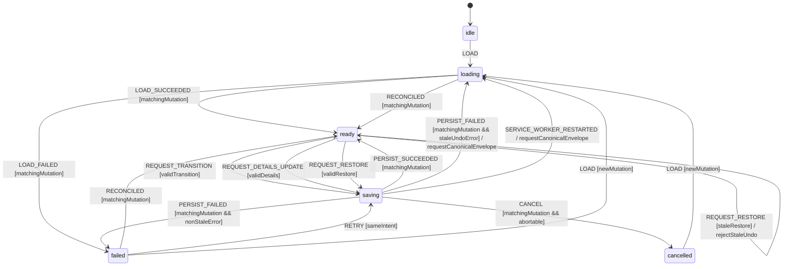

# Application Tracking Workflow Model

Authoritative domain and persistence model for moving a mission through the
application pipeline, editing follow-up details, and restoring a confirmed
previous record through Undo.

## Scope and decisions

The domain pipeline is pure and canonical in `@pulse/domain`. Persistence is a
separate transaction machine. A valid candidate transition is not user-visible
success until IndexedDB confirms the write. The service worker must return a
typed application error on failure; it must never synthesize a default tracking
record as a success response.

## Domain states

```ts
type ApplicationStatus =
  | 'detected'
  | 'selected'
  | 'application_prepared'
  | 'applied'
  | 'interview'
  | 'offer'
  | 'accepted'
  | 'rejected'
  | 'archived';
```

Allowed transitions are exact:

| From                   | Allowed targets                               |
| ---------------------- | --------------------------------------------- |
| `detected`             | `selected`, `archived`                        |
| `selected`             | `application_prepared`, `applied`, `archived` |
| `application_prepared` | `applied`, `archived`                         |
| `applied`              | `interview`, `offer`, `rejected`, `archived`  |
| `interview`            | `offer`, `rejected`, `archived`               |
| `offer`                | `accepted`, `rejected`, `archived`            |
| `accepted`             | `archived`                                    |
| `rejected`             | `archived`                                    |
| `archived`             | `detected`                                    |

`accepted`, `rejected`, and `archived` terminate follow-up scheduling and
therefore force `nextActionAt = null`. They are settled business outcomes, not
all permanently absorbing: accepted/rejected may be archived, and archived may
be deliberately reopened to detected.

## Persistence-operation states and context

```ts
type TrackingMutationState = 'idle' | 'loading' | 'ready' | 'saving' | 'failed' | 'cancelled';

interface PersistedTrackingEnvelope {
  missionId: string;
  tracking: MissionTracking | null;
  revision: number;
  lastMutationId: string | null;
}

interface TrackingUndoEntry {
  missionId: string;
  previous: MissionTracking | null;
  expectedCurrentRevision: number;
  expectedCurrentMutationId: string;
}

interface TrackingMutationContext {
  state: TrackingMutationState;
  missionId: string | null;
  mutationId: string | null;
  previous: MissionTracking | null;
  candidate: MissionTracking | null;
  confirmed: MissionTracking | null;
  confirmedRevision: number;
  confirmedMutationId: string | null;
  intent: 'transition' | 'details' | 'restore' | null;
  online: boolean;
  error: ApplicationTrackingError | null;
}
```

The UI collection contains only confirmed envelopes. `candidate` may be
previewed with a saving indicator, but cannot replace canonical state. An Undo
entry is created only from a successful envelope and therefore names the exact
revision/mutation that it is allowed to replace.

Mutation methods (`transitionStatus`, `updateNextActionAt`, and
`restoreTracking`) resolve with the confirmed record/delete only after
persistence. They reject with a typed `ApplicationTrackingError`; callers must
not interpret a resolved fallback record as success.

## Events

```ts
type ApplicationTrackingEvent =
  | { type: 'LOAD'; mutationId: string }
  | { type: 'LOAD_SUCCEEDED'; mutationId: string; records: readonly PersistedTrackingEnvelope[] }
  | { type: 'LOAD_FAILED'; mutationId: string; error: ApplicationTrackingError }
  | {
      type: 'REQUEST_TRANSITION';
      missionId: string;
      to: ApplicationStatus;
      note: string | null;
      at: number;
      mutationId: string;
    }
  | {
      type: 'REQUEST_DETAILS_UPDATE';
      missionId: string;
      nextActionAt: string | null;
      mutationId: string;
    }
  | {
      type: 'REQUEST_RESTORE';
      missionId: string;
      previous: MissionTracking | null;
      expectedCurrentRevision: number;
      expectedCurrentMutationId: string;
      mutationId: string;
    }
  | {
      type: 'PERSIST_SUCCEEDED';
      mutationId: string;
      tracking: MissionTracking | null;
      revision: number;
      lastMutationId: string;
    }
  | { type: 'PERSIST_FAILED'; mutationId: string; error: ApplicationTrackingError }
  | { type: 'RETRY'; mutationId: string }
  | { type: 'CANCEL'; mutationId: string }
  | { type: 'NETWORK_CHANGED'; online: boolean }
  | { type: 'SERVICE_WORKER_RESTARTED' }
  | {
      type: 'RECONCILED';
      mutationId: string;
      tracking: MissionTracking | null;
      revision: number;
      lastMutationId: string | null;
    };
```

## Statechart



## Guards

| Guard              | Rule                                                                                                                                                                                                                               |
| ------------------ | ---------------------------------------------------------------------------------------------------------------------------------------------------------------------------------------------------------------------------------- |
| `matchingMutation` | Event mutation ID equals current mutation ID.                                                                                                                                                                                      |
| `validTransition`  | Pure `isValidTransition(from, to)` passes, or a missing record is first created as `detected` and then legally advanced.                                                                                                           |
| `validDetails`     | ISO date is valid or null; terminal candidate always normalizes it to null.                                                                                                                                                        |
| `validRestore`     | Snapshot is null or is a complete record for the same mission, and both expected revision/mutation ID equal the current confirmed envelope. The IndexedDB compare-and-swap repeats this comparison atomically before write/delete. |
| `staleRestore`     | Restore shape is valid but either expected revision or expected mutation ID differs from the confirmed/canonical envelope.                                                                                                         |
| `staleUndoError`   | Atomic compare-and-swap rejected restore with typed `STALE_UNDO`; no write occurred.                                                                                                                                               |
| `nonStaleError`    | Persistence error is any typed error other than `STALE_UNDO`.                                                                                                                                                                      |
| `sameIntent`       | Failed context still holds immutable previous/candidate/intent.                                                                                                                                                                    |
| `abortable`        | IndexedDB transaction has not committed.                                                                                                                                                                                           |

## Transition table

| From          | Event                    | Guard       | To          | Effects                                                                                                             |
| ------------- | ------------------------ | ----------- | ----------- | ------------------------------------------------------------------------------------------------------------------- |
| `idle`        | `LOAD`                   | —           | `loading`   | Read all tracking records through worker; validate/migrate on read.                                                 |
| `loading`     | `LOAD_SUCCEEDED`         | matching    | `ready`     | Replace collection with confirmed records.                                                                          |
| `loading`     | `LOAD_FAILED`            | matching    | `failed`    | Keep last confirmed collection and show retryable load error.                                                       |
| `ready`       | `REQUEST_TRANSITION`     | valid       | `saving`    | Purely build candidate/history with injected timestamp, then persist.                                               |
| `ready`       | `REQUEST_DETAILS_UPDATE` | valid       | `saving`    | Build complete candidate and persist it.                                                                            |
| `ready`       | `REQUEST_RESTORE`        | valid       | `saving`    | Compare-and-swap the expected envelope, then put previous snapshot or tombstone atomically.                         |
| `ready`       | `REQUEST_RESTORE`        | stale       | `ready`     | Reject `STALE_UNDO`, reread canonical envelope, and perform no write.                                               |
| `saving`      | `PERSIST_SUCCEEDED`      | matching    | `ready`     | Publish confirmed envelope; only now create a success toast/Undo token carrying the resulting revision/mutation ID. |
| `saving`      | `PERSIST_FAILED`         | stale Undo  | `loading`   | Perform no write, request canonical envelope, and expose typed `STALE_UNDO`.                                        |
| `saving`      | `PERSIST_FAILED`         | other error | `failed`    | Retain previous canonical record and retry intent; show typed error.                                                |
| `failed`      | `RETRY`                  | same intent | `saving`    | Use fresh mutation ID and re-read current record before compare/write.                                              |
| `saving`      | `CANCEL`                 | abortable   | `cancelled` | Abort transaction, retain previous, invalidate late response.                                                       |
| saving/failed | `RECONCILED`             | matching    | `ready`     | Replace UI state and revision/token with the canonical envelope; no guessed success/Undo.                           |
| any           | `NETWORK_CHANGED`        | —           | same        | Local tracking remains available; connected sync becomes deferred.                                                  |

An invalid domain transition is rejected before `saving` with a typed
`INVALID_TRANSITION` error. It does not echo the unchanged record as success.

## Side effects and ownership

- **Core/domain:** validates stages, creates candidates/history, normalizes
  terminal follow-up, rating/notes, and receives timestamps/IDs as arguments.
- **Service worker Shell:** reads/writes `mission_tracking` in IndexedDB and
  sends typed success/error bridge responses after transaction completion.
- **UI state:** keeps prior confirmed record while saving/failed; success toast
  and Undo window begin only after `PERSIST_SUCCEEDED`.
- **Connected dashboard sync:** runs after local commit via a durable outbox. A
  remote/network failure is reported separately and cannot falsify local
  persistence or retroactively choose a pipeline state.

## Persistence boundary

Each persisted tracking envelope is atomic in the IndexedDB
`mission_tracking` store. `currentStatus`, history, generated assets, rating,
notes, `nextActionAt`, monotonic revision, and last mutation ID commit together.
A delete retains a tombstone or separate monotonic metadata for the mission;
delete/recreate can therefore never make an old Undo token valid again. The
mutation ID is included in the bridge contract/idempotency record so duplicate
delivery cannot append history twice.

UI candidate/previous/error state is ephemeral. Undo stores the confirmed
pre-mutation snapshot plus the expected post-commit revision/mutation ID only
after commit. On panel reload the database envelope is canonical. On worker
restart an unacknowledged UI mutation is reconciled by reading that envelope;
the UI never guesses whether the write committed.

## Permissions and offline behavior

Tracking needs no host, cookies, notification, clipboard, or network
permission. IndexedDB access stays inside the service worker. Storage denial,
quota, abort, corruption, or validation failure maps to `PERSIST_FAILED` or
`LOAD_FAILED` and remains visible.

Offline does not block local transitions. Optional connected sync is queued
after local commit and retried independently; offline status never produces a
false local failure or success.

## Retry, cancellation, concurrency, and restart

- Retry revalidates the intended change against the latest confirmed record;
  it cannot blindly replay against a stale `previous`.
- Restore retry is allowed only while its expected revision/mutation ID still
  matches. The token is single-use/idempotent; a mismatch returns
  `STALE_UNDO`, refreshes canonical state, and never writes.
- Cancellation before commit aborts and preserves `previous`. After commit,
  cancellation is forbidden; the user must perform a modeled restore/transition.
- Mutations for the same mission are serialized. A concurrent mutation returns
  typed `APPLICATION_BUSY`; different missions may use independent actors.
- Duplicate bridge deliveries with the same mutation ID are idempotent.
- Worker restart during saving causes reconciliation. Until a canonical read
  proves the result, the UI keeps previous state and shows no success/Undo.

## Terminal states and re-entry

For a mutation, `cancelled` is terminal; a new `LOAD`/intent creates a new
mutation ID. `failed` is settled and re-enters only through explicit Retry or
reload. Domain statuses `accepted`, `rejected`, and `archived` are follow-up
terminal as described above; only their enumerated transitions permit re-entry.

## Forbidden transitions

- Any stage change absent from the canonical transition table.
- UI collection update, success toast, or Undo entry before persistence ack.
- Fallback `TRACKING_UPDATED`/`TRACKING_RESTORED` payload after storage failure.
- Terminal follow-up status with a non-null `nextActionAt`.
- Retry/cancel/response for a stale mutation ID.
- Restore whose expected revision/mutation ID differs from the canonical
  envelope, even when its snapshot is structurally valid.
- Concurrent mutation of the same mission without serialization/busy error.
- An implicit transition derived from an AI-generated asset, note, or toast;
  asset generation may emit an explicit deterministic preparation event only.

## Invariants

1. Domain transitions equal `APPLICATION_TRANSITIONS`; UI cannot broaden them.
2. `currentStatus` equals the last history target after every confirmed write.
3. Every history timestamp/client mutation ID is injected by Shell and unique.
4. Confirmed UI state never gets ahead of IndexedDB.
5. Persistence failure preserves the exact previous record and exposes error.
6. Terminal follow-up statuses clear `nextActionAt` atomically.
7. Undo restores a confirmed snapshot only by compare-and-swap against the
   exact revision/mutation it follows and is itself a persisted mutation.
8. Confirmed history is non-empty, begins with `null -> detected`, forms a
   valid contiguous chain, has monotonic injected timestamps, and ends at
   `currentStatus`.
9. `generatedAssetIds` contains no duplicate ID.
10. An LLM never decides a transition; generated content can only be an input
    to an explicit, guarded user/system event.
11. Core is pure; bridge, storage, clock, outbox, and toasts are Shell effects.
12. Revisions are monotonic across delete/recreate, so a stale Undo token can
    never become valid again.

## Review checklist

- [x] Nominal load, create, legal transition, details update, restore, and reopen are explicit.
- [x] Invalid transition, storage failure, quota/validation error, and typed retry are covered.
- [x] Offline local behavior and deferred remote sync are separated.
- [x] Cancellation before/after commit and late responses are deterministic.
- [x] Same-mission concurrency and duplicate delivery are defined.
- [x] Service-worker restart reconciles instead of fabricating success.
- [x] Follow-up terminal states and their explicit re-entry paths are documented.
