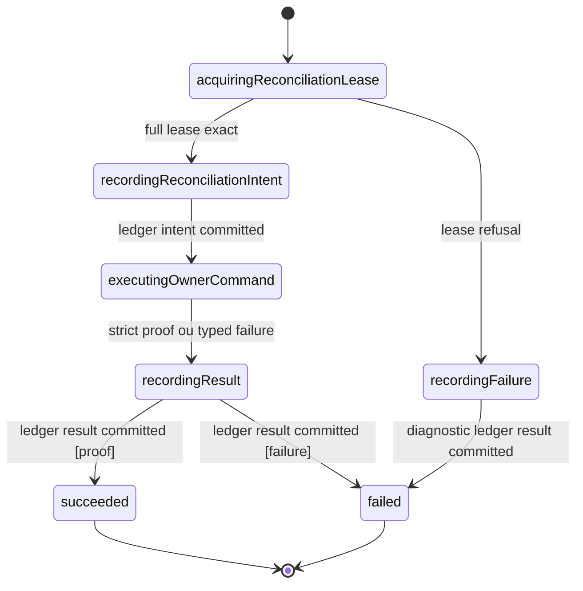
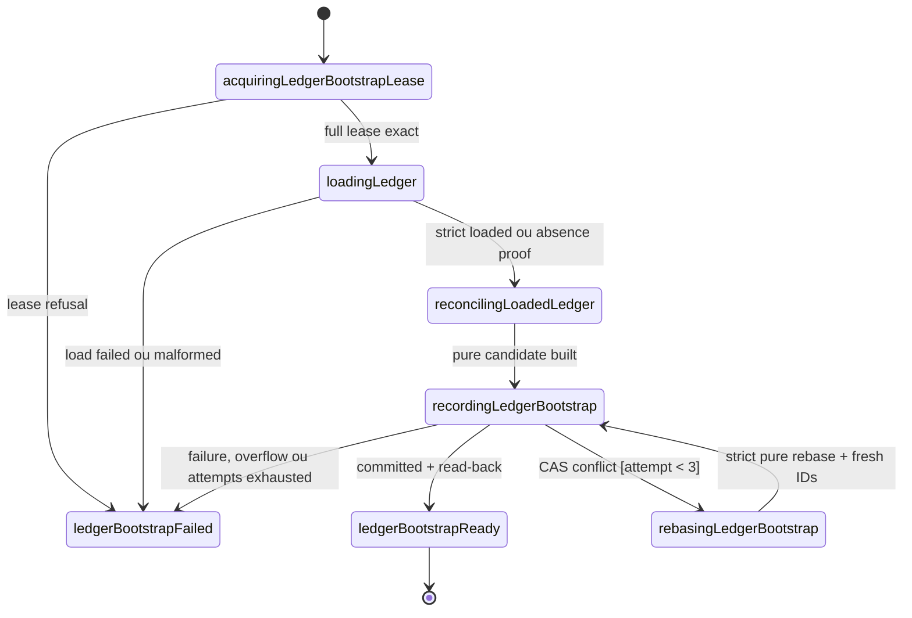
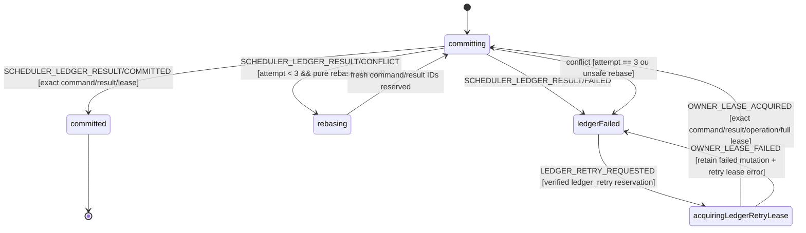
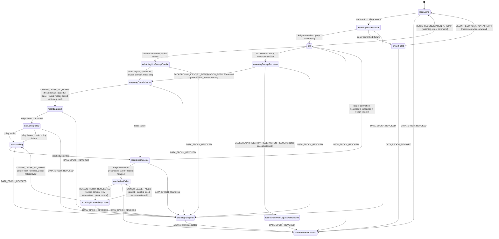
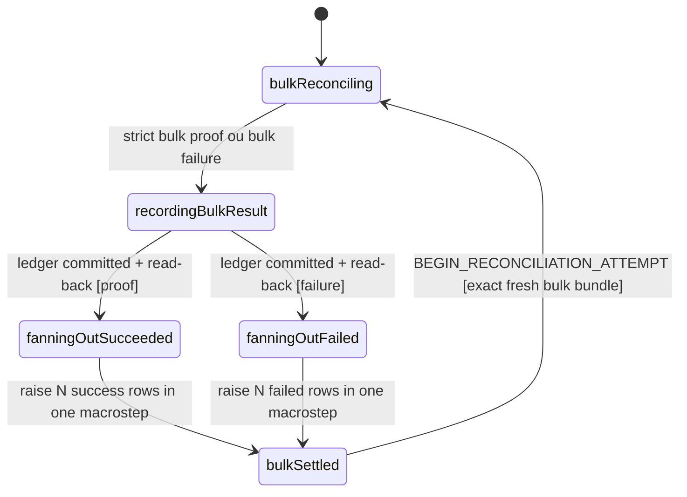
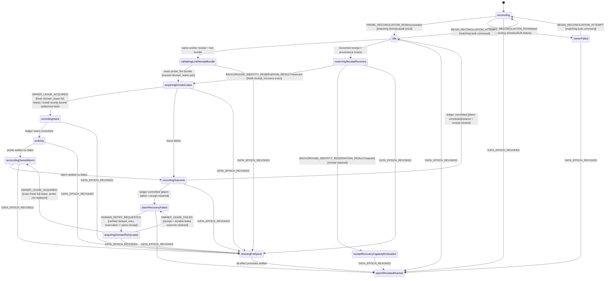
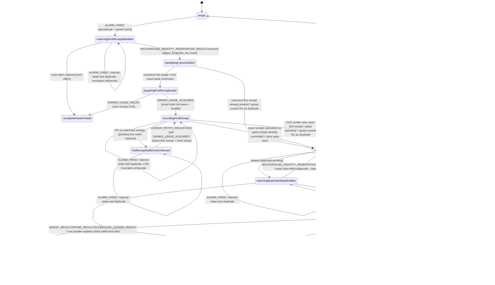

# Background Scheduling and Consent Model

Source de vérité du gate **Model** pour les alarmes Chrome possédées par
MissionPulse, le démarrage du service worker et l'admission des scans
automatiques. Ce modèle compose exactement les autorités existantes :

- `dataset-startup.contract.ts` ouvre l'admission et publie les bootstraps ;
- `dataset-epoch-authority.ts` émet et revalide les leases d'écriture ;
- `settings-persistence.contract.ts` est l'unique writer de `auto-scan` ;
- `onboarding-source.contract.ts` prouve la fin du wizard ;
- `scan-lifecycle.model.md` possède l'admission, l'annulation et les terminaux
  d'un scan ;
- le scheduler digest possède seulement `daily-digest` ;
- le scheduler de probes possède seulement `probe:<connectorId>`.

Les callbacks navigateur et les I/O produisent des signaux typés. Les machines
ci-dessous décident des transitions. Ni texte libre, ni toast, ni LLM ne peut
ouvrir une admission ou fabriquer une preuve.

## Contrats canoniques réutilisés sans projection destructive

Les types suivants sont consommés tels quels ; le modèle background ne les
redéfinit pas et ne retire aucun de leurs champs :

```ts
type CanonicalDependencies = {
  startupEvent: Extract<DatasetStartupEvent, { type: 'START' }>;
  settingsRecovery: StartupSettingsRecoveredV1;
  admission: DatasetAdmissionOpenedProofV1;
  publication: DatasetBootstrapPublicationProofV1;
  lease: DatasetWriteLeaseV1;
  settings: SettingsSnapshotV1;
  onboarding: OnboardingCompletionReadProofV1;
};
```

En particulier, un `DatasetWriteLeaseV1` reste toujours le tuple complet
`{ version, leaseId, operationId, dataEpoch, authorityRevision }`. Aucun
événement background ne le réduit à `leaseId`.

## Namespace et propriété des alarmes

```ts
type MissionPulseAlarm =
  | { kind: 'auto_scan'; name: 'auto-scan' }
  | { kind: 'daily_digest'; name: 'daily-digest' }
  | { kind: 'probe'; name: `probe:${string}`; connectorId: string };
```

| Namespace             | Autorité d'écriture                      | Fire handler                      |
| --------------------- | ---------------------------------------- | --------------------------------- |
| `auto-scan`           | Settings Persistence uniquement          | acteur `auto_scan`                |
| `daily-digest`        | réconciliation et acteur digest          | acteur `daily_digest`             |
| `probe:<connectorId>` | réconciliation et acteur probe de cet ID | acteur keyed `probe[connectorId]` |

`chrome.alarms.clearAll()` est interdit. Un nom inconnu est ignoré. Un nom qui
commence par `probe:` appartient au scheduler de probes pour sa réconciliation,
mais un fire malformed, vide ou exclu ne lance jamais de probe. La
réconciliation peut nettoyer ces seules entrées `probe:*`; elle ne touche pas
les alarmes d'un autre propriétaire.

## Identités et bornes

Toutes les identités sont des UUID v4 lowercase injectés. Elles sont distinctes
au sein d'une commande et fraîches pour le worker courant.

```ts
const MAX_BACKGROUND_OPERATIONS_PER_WORKER = 4096;
const MAX_BACKGROUND_CORRELATION_IDS_PER_WORKER = 32768;
const MAX_PENDING_ONE_SHOT_FIRES_PER_OWNER = 1;
const MAX_BACKGROUND_LEDGER_PROBES = 64;
const MAX_BACKGROUND_ONE_SHOT_RECEIPTS = 65;
const MAX_BACKGROUND_ACTIVE_INTENTS = 66;
const MAX_BACKGROUND_BUSY_SKIPS = 67;
const MAX_BACKGROUND_LEDGER_ENCODED_BYTES = 262144;
const MAX_BOOTSTRAP_ALARM_JOURNAL_ENCODED_BYTES = 65536;
const MAX_DISCOVERED_PROBE_ALARMS_PER_RECONCILIATION = 256;
const MAX_BACKGROUND_LEDGER_CAS_REBASES = 3;
const MAX_BOOTSTRAP_ALARM_INGRESS_ENTRIES = 131;
const MAX_RESET_ALARM_HANDOFF_ENTRIES = 131;
const MAX_BACKGROUND_RESET_CONTROL_LANES_PER_WORKER = 1;
const MAX_BACKGROUND_RESET_CONTROL_ATTEMPTS_PER_WORKER = 4;
const BACKGROUND_SCHEDULING_HANDOFF_KEY = 'missionpulse.backgroundSchedulingHandoff.v1';
const BACKGROUND_SCHEDULING_HANDOFF_PAYLOAD_SCHEMA =
  'missionpulse.backgroundSchedulingHandoff.payload.v1';
const MAX_BACKGROUND_HANDOFF_SLOTS = 131;
const MAX_BACKGROUND_HANDOFF_PAYLOAD_ENCODED_BYTES = 786432;
const MAX_BACKGROUND_HANDOFF_SIDECAR_ENCODED_BYTES = 1048576;
const MAX_BACKGROUND_HANDOFF_CAS_ATTEMPTS_PER_TRANSITION = 3;
const MAX_BACKGROUND_HANDOFF_CAS_TRANSITIONS_PER_CONTROL_ATTEMPT = 132;
const MAX_BACKGROUND_HANDOFF_CAS_BUNDLES = 1584; // 4 attempts * 132 transitions * 3 CAS

interface StartupJoinCorrelationIdsV1 {
  joinCommandId: string;
  resultId: string;
  attemptId: string;
  requestId: string;
  settingsRecoveryRequestId: string;
}

interface StartupJoinIdentityV1 extends StartupJoinCorrelationIdsV1 {
  reservation: BackgroundIdentityReservationProofV1;
}

interface BackgroundSchedulingInput {
  workerEpoch: string;
  includedConnectorIds: readonly string[];
  identityAuthority: BackgroundIdentityAuthorityV1;
  resetControlLane: BackgroundResetControlLaneProofV1;
}

interface OwnerOperationIdentityV1 {
  operationEventId: string;
  alarmEventId: string | null;
  operationId: string;
  workerEpoch: string;
  dataEpoch: string;
  owner: 'auto_scan' | 'daily_digest' | 'probe';
  connectorId: string | null;
}

interface CommandResultIdentityV1 {
  commandId: string;
  resultId: string;
}

type BackgroundIdentityPurpose =
  | 'startup_join'
  | 'bootstrap_journal_load'
  | 'bootstrap_journal_capture'
  | 'bootstrap_journal_drain'
  | 'ledger_bootstrap'
  | 'reconciliation'
  | 'auto_scan_fire'
  | 'digest_fire'
  | 'probe_fire'
  | 'ledger_retry'
  | 'domain_retry'
  | 'receipt_recovery'
  | 'scan_quiescence_retry'
  | 'diagnostic';

type BackgroundIdentityStage =
  | 'startup_join'
  | 'bootstrap_journal_load'
  | 'bootstrap_journal'
  | 'bootstrap_journal_delete'
  | 'lease'
  | 'receipt_lease'
  | 'domain_lease'
  | 'ledger_load'
  | 'ledger_commit'
  | 'reconciliation_intent'
  | 'owner_domain'
  | 'owner_result'
  | 'receipt_commit'
  | 'intent_commit'
  | 'facts_load'
  | 'facts_commit'
  | 'scan_start'
  | 'scan_cancel'
  | 'scan_quiescence'
  | 'outcome_commit'
  | 'ledger_retry'
  | 'domain_retry'
  | 'diagnostic_commit';

interface ReservedBackgroundOperationV1 {
  operationEventId: string;
  operationId: string;
  stages: Readonly<Partial<Record<BackgroundIdentityStage, readonly CommandResultIdentityV1[]>>>;
}

interface BackgroundIdentityReservationRequestV1 {
  version: 1;
  sourceEventId: string;
  workerEpoch: string;
  dataEpoch: string | null;
  purpose: BackgroundIdentityPurpose;
  connectorId: string | null;
  retainedReceiptId: string | null;
  retainedReceiptProvenanceDigest: string | null;
}

interface BackgroundIdentityReservationProofV1 {
  version: 1;
  reservationId: string;
  sourceEventId: string;
  workerEpoch: string;
  dataEpoch: string | null;
  purpose: BackgroundIdentityPurpose;
  connectorId: string | null;
  reconciliationId: string | null;
  captureId: string | null;
  handoffId: string | null;
  receiptId: string | null;
  retainedReceiptProvenanceDigest: string | null;
  skipId: string | null;
  scanOperationId: string | null;
  startupJoin: StartupJoinCorrelationIdsV1 | null;
  proofId: string;
  operations: readonly ReservedBackgroundOperationV1[];
  nonDatasetStages: Readonly<
    Partial<Record<BackgroundIdentityStage, readonly CommandResultIdentityV1[]>>
  >;
  correlationIds: readonly string[];
}

type BackgroundIdentityReservationResultV1 =
  | { kind: 'BACKGROUND_IDENTITIES_RESERVED'; proof: BackgroundIdentityReservationProofV1 }
  | {
      kind: 'BACKGROUND_IDENTITY_RESERVATION_REJECTED';
      error: BackgroundSchedulingErrorV1;
    };

interface BackgroundIdentityAuthorityV1 {
  reserve(request: BackgroundIdentityReservationRequestV1): BackgroundIdentityReservationResultV1;
  verify(proof: BackgroundIdentityReservationProofV1): boolean;
}

type BackgroundResetControlStage =
  | 'journal_at_quiescence_read'
  | 'handoff_checkpoint'
  | 'writer_quiescence'
  | 'handoff_restore'
  | 'handoff_adoption';

interface BackgroundHandoffCasBundleV1 {
  sidecarId: string; // exact fresh ID preallocated by the owning control lane
  transitionIndex: number; // 0 initialize, 1..131 exact slot, 132 cleanup
  controlAttemptIndex: 0 | 1 | 2 | 3 | null; // null only for cleanup
  casAttempt: 0 | 1 | 2;
  commandId: string;
  resultId: string;
  capabilityId: string;
  bundleDigest: string;
  storageKey: typeof BACKGROUND_SCHEDULING_HANDOFF_KEY;
}

interface BackgroundHandoffCasCursorV1 {
  controlAttemptIndex: 0 | 1 | 2 | 3;
  transitionIndex: number; // 1..131 while a frozen slot remains
  casAttempt: 0 | 1 | 2;
}

interface BackgroundHandoffCapabilityManifestEntryV1 {
  kind: 'sidecar_initialize' | 'slot_materialize' | 'sidecar_cleanup';
  controlAttemptIndex: 0 | 1 | 2 | 3 | null;
  transitionIndex: number;
  casAttempt: 0 | 1 | 2;
  commandId: string;
  resultId: string;
  capabilityId: string;
  bundleDigest: string;
}

interface BackgroundHandoffCapabilityManifestV1 {
  version: 1;
  sidecarId: string;
  handoffId: string;
  entries: readonly BackgroundHandoffCapabilityManifestEntryV1[]; // canonical 1584 CAS then 3 cleanup
}

interface BackgroundResetControlAttemptV1<TAttemptIndex extends 0 | 1 | 2 | 3 = 0 | 1 | 2 | 3> {
  attemptIndex: TAttemptIndex;
  stages: Readonly<Record<BackgroundResetControlStage, readonly [CommandResultIdentityV1]>>;
}

interface BackgroundResetControlLaneProofV1 {
  version: 1;
  laneId: string;
  workerEpoch: string;
  handoffId: string;
  sidecarId: string;
  maxAttempts: 4;
  attempts: readonly [
    BackgroundResetControlAttemptV1<0>,
    BackgroundResetControlAttemptV1<1>,
    BackgroundResetControlAttemptV1<2>,
    BackgroundResetControlAttemptV1<3>,
  ];
  handoffCasBundles: readonly BackgroundHandoffCasBundleV1[];
  handoffCleanupBundles: readonly [
    BackgroundHandoffCasBundleV1,
    BackgroundHandoffCasBundleV1,
    BackgroundHandoffCasBundleV1,
  ];
  capabilityManifest: BackgroundHandoffCapabilityManifestV1;
  capabilityManifestDigest: string;
  controlCorrelationIds: readonly string[];
  isolatedFromWorkRegistry: true;
  preallocatedBeforeWorkAdmission: true;
}

interface BoundBackgroundResetControlAttemptV1 {
  version: 1;
  laneId: string;
  attemptIndex: 0 | 1 | 2 | 3;
  reset: ResetCorrelationV1;
  handoffId: string;
  bindingId: string;
  boundOnce: true;
}
```

Pour une reconciliation ou un write diagnostic, `alarmEventId === null` et
`operationEventId` est l'ID frais de cette intention. Pour un fire,
`operationEventId === alarmEventId` et reprend exactement l'ID du callback ; un
résultat ne peut pas rebinder l'un ou l'autre.

Le registre monotone du worker conserve tous les `operationId`, IDs de
commande, IDs de résultat, `alarmEventId` et `reconciliationId` consommés. Il
n'évince et ne recycle rien. Chaque admission réserve atomiquement tous ses IDs
de commande, résultat, compensation, ledger et terminal avant d'émettre le
premier effet. À 4 096 opérations ayant demandé un lease, ou quand les 32 768
corrélations ne peuvent plus contenir cette réservation complète, l'admission
termine respectivement avec `OPERATION_CAPACITY_EXHAUSTED` ou
`CORRELATION_CAPACITY_EXHAUSTED`; aucun sous-ensemble n'est consommé. Seul un
nouveau worker, donc une nouvelle instance de `DatasetEpochAuthority`, rouvre
ces capacités. Ces bornes limitent la contribution background à la map interne
de l'autorité et son propre registre de fraîcheur.

`BackgroundSchedulingInput` accepte de 0 à 64 IDs build-inclus, uniques et
triés. Plus de 64 IDs, un doublon ou un ID non inclus produit l'état terminal
`invalidConfiguration`; la liste n'est jamais tronquée et aucun acteur probe
n'est créé. Chaque map `probes`, inbox probe et outcome probe a exactement cette
même borne. Une réconciliation qui découvre plus de 256 alarmes `probe:*`
termine `PROBE_ALARM_CAPACITY_EXHAUSTED` avant tout cleanup partiel.

`identityAuthority` est une dépendance Shell injectée dans l'implémentation
XState, jamais stockée dans `BackgroundSchedulingContext`. Les tests injectent
une autorité déterministe. `reserve` est l'unique allocation : elle vérifie la
fraîcheur, réserve tout le bundle sous une section critique, puis retourne soit
le proof complet gelé, soit un rejet de capacité sans consommer un seul ID.
`verify` ne réserve rien et sert uniquement aux événements retry qui répètent un
proof déjà réservé.

`retainedReceiptId` est non-null uniquement pour la copie d'un capture
bootstrap, un domain retry ou `receipt_recovery`. Pour `receipt_recovery`,
`retainedReceiptProvenanceDigest` est également non-null et égal au digest de la
provenance durable ; les deux champs sont null pour tous les autres purposes.
L'autorité les enregistre dans le bundle sans en allouer d'autres ; une collision
ou un digest croisé rejette toute la réservation. Pour un fire opérationnel neuf,
le receipt est alloué dans le bundle. `handoffId` est toujours null dans cette
autorité de travail.

La lane `resetControlLane` est préallouée et vérifiée avant toute admission de
travail. Elle contient exactement un `handoffId`, un `sidecarId` frais et quatre attempts ordonnés,
chacun avec les paires exactes de lecture journal, checkpoint durable,
quiescence, restore et adoption. Elle contient exactement 1 584 bundles CAS :
pour chacun des quatre attempts, trois CAS pour l'initialisation et trois CAS
pour chacune des 131 matérialisations de slot, plus trois bundles cleanup
distincts. Chaque tuple `(controlAttemptIndex,transitionIndex,casAttempt)` est
unique, ordonné et lié à la clé
locale littérale et au même `sidecarId`. Les trois bundles cleanup portent eux
aussi cet ID exact. `sidecarId` est distinct du worker, de la lane, du handoff,
des quatre attempts/bindings et de toutes leurs corrélations ; il n'est jamais
alloué au premier write. La lane fige aussi un manifest canonique de 1 587
entrées dans l'ordre `(controlAttempt 0..3, transition 0..131, casAttempt 0..2)`,
soit 1 584 init/slots puis trois
cleanup. Chaque entrée porte command/result/capability IDs et un digest recalculé
sur sidecar/handoff/kind/index/attempt/IDs ; le manifest a son digest SHA-256.
Ses IDs vivent dans un registre Reset séparé :
ils ne comptent ni parmi les 4 096 opérations ni parmi les 32 768 corrélations de
travail et aucune réservation background ne peut les consommer. Un worker ne
peut avoir qu'une lane et un seul attempt Reset actif. `DATA_EPOCH_REVOKED` lie
atomiquement le premier attempt libre au reset exact ; un retry utilise
strictement l'attempt suivant. Après trois échecs CAS sur une transition, le
curseur reprend la même transition avec le bundle de l'attempt de contrôle
suivant. Après quatre attempts, un worker neuf reçoit une
lane neuve et restaure le checkpoint durable du même Reset avant de poursuivre ;
l'épuisement de la lane ne permet jamais le clear sans preuve.

Les 131 slots sont normatifs : digest first + 64 probe first + digest duplicate

- 64 probe duplicate + auto-scan. La cible complète, son digest,
  `materializationCursor` et le `casCursor` du prochain bundle one-shot sont
  durables dès l'initialisation du sidecar. Avant une consommation, le sidecar
  relu nomme exactement le bundle courant. Après un résultat CAS définitif, le
  même checkpoint durable nomme le bundle suivant avant toute nouvelle
  tentative ; un résultat inconnu doit d'abord être résolu par ses IDs et ne
  permet ni réutilisation ni saut. Un slot durable est matérialisé une fois. Un callback qui retrouve
  son slot present est coalescé vers
  ce receipt canonique et ne modifie pas le sidecar, n'alloue aucun ID et ne
  consomme aucun bundle. Une CAS conflict/failure consomme son bundle et essaie le
  bundle frais suivant, au plus trois fois. Épuisement ou write/read-back failure
  avant `chrome.storage.session.clear()` laisse Reset avant clear et n'efface
  rien ; aucun fallback raw n'existe.

Le `BootstrapWriterResetIdentityV1` lié voyage dans `DATA_EPOCH_REVOKED`. Le
scheduler ne réserve rien à la réception : il vérifie lane, attempt et binding.
Cette voie reste donc admissible depuis `identityCapacityExhausted`; l'épuisement
des opérations/corrélations background interdit de nouveaux travaux, jamais la
quiescence Reset. Un événement sans lane/binding exact est invalide et Reset
conserve son état avant clear.

Le validateur de réservation impose les formes exactes suivantes ; aucun stage
supplémentaire ou manquant n'est accepté :

| Purpose                     | Opérations réservées | Stages exacts                                                                                                            | IDs hors opération                                 |
| --------------------------- | -------------------- | ------------------------------------------------------------------------------------------------------------------------ | -------------------------------------------------- |
| `startup_join`              | 0                    | `startup_join` dans `nonDatasetStages`                                                                                   | attempt/request/recovery IDs du join               |
| `bootstrap_journal_load`    | 0                    | `bootstrap_journal_load` dans `nonDatasetStages`                                                                         | `proofId`                                          |
| `bootstrap_journal_capture` | 0                    | `bootstrap_journal` dans `nonDatasetStages`                                                                              | `captureId`, `receiptId`, `skipId`, `proofId`      |
| `bootstrap_journal_drain`   | 1                    | `lease`, `ledger_commit`; `bootstrap_journal_delete` dans `nonDatasetStages`                                             | retained receipt IDs, `proofId`                    |
| `ledger_bootstrap`          | 1                    | `lease`, `ledger_load`, `ledger_commit`                                                                                  | `proofId`                                          |
| `reconciliation`            | 3                    | pour auto/digest/probes : `lease`, `reconciliation_intent`, `owner_domain`, `owner_result`                               | `reconciliationId`, `proofId`                      |
| `auto_scan_fire`            | 1                    | `lease`, `intent_commit`, `facts_load`, `facts_commit`, `scan_start`, `scan_cancel`, `scan_quiescence`, `outcome_commit` | `scanOperationId`, `proofId`                       |
| `digest_fire`               | 1                    | `receipt_lease`, `receipt_commit`, `domain_lease`, `intent_commit`, `owner_domain`, `outcome_commit`                     | `receiptId`, `proofId`                             |
| `probe_fire`                | 1                    | `receipt_lease`, `receipt_commit`, `domain_lease`, `intent_commit`, `owner_domain`, `outcome_commit`                     | `receiptId`, `proofId`                             |
| `ledger_retry`              | 1                    | `lease`, `ledger_retry`                                                                                                  | `proofId`                                          |
| `domain_retry`              | 1                    | `lease`, `domain_retry`                                                                                                  | `receiptId`, `proofId`                             |
| `receipt_recovery`          | 1                    | `domain_lease`, `intent_commit`, `owner_domain`, `outcome_commit`                                                        | retained `receiptId`, provenance digest, `proofId` |
| `scan_quiescence_retry`     | 0                    | `scan_quiescence` dans `nonDatasetStages`                                                                                | `proofId`                                          |
| `diagnostic`                | 1                    | `lease`, `diagnostic_commit`                                                                                             | `skipId` ou aucun selon le diagnostic              |

La forme `receipt_recovery` est atomique et fermée : son receipt retenu existe
dans `oneShotInbox`, son provenance digest est exact, l'owner/connecteur du proof
égale celui de la provenance et les quatre stages appartiennent à la même
opération fraîche du worker courant. Un stage `receipt_commit` ou
`receipt_lease`, un nouveau
`receiptId`, l'absence du digest ou la réutilisation d'un ID historique rejette
tout le bundle sans consommation partielle.

Chaque stage non-CAS contient exactement une paire. Pour un fire neuf,
`receipt_lease` et `domain_lease` sont deux paires distinctes de la même
opération : la première est consommée avant la CAS receipt, la seconde seulement
après `receiptReady`. Même dans le même worker, une paire consommée ne peut
jamais être réutilisée pour le domaine. Les stages
`bootstrap_journal`, `bootstrap_journal_delete`, `ledger_commit`,
`reconciliation_intent`, `owner_result`, `receipt_commit`, `intent_commit`,
`facts_commit`, `outcome_commit`, `ledger_retry` et `diagnostic_commit`
contiennent exactement trois paires ordonnées pour `casAttempt 0|1|2`. Une
réservation n'alloue donc jamais un ID supplémentaire après un conflit.

Les paires `startup_join`, `bootstrap_journal_load`, `bootstrap_journal` et
`bootstrap_journal_delete` vivent dans
`nonDatasetStages` parce qu'elles ne portent aucune opération dataset. Le drain
reste néanmoins un bundle unique : sa partie ledger porte une opération et son
delete session est corrélé dans la même réservation atomique. Pour tous les
purposes, chaque paire de stage apparaît aussi dans `correlationIds`, avec les
IDs hors opération. Le nombre d'opérations et l'ensemble exact de corrélations
sont donc calculables avant le premier effet et vérifiables par les tests de
capacité.

| Registre / collection                     | Borne          | Admission terminale                            |
| ----------------------------------------- | -------------- | ---------------------------------------------- |
| operations ayant demandé un lease         | 4 096          | `OPERATION_CAPACITY_EXHAUSTED`                 |
| corrélations consommées/réservées         | 32 768         | `CORRELATION_CAPACITY_EXHAUSTED`               |
| connecteurs / actors / outcomes probe     | 64             | `INVALID_CONFIGURATION` avant création         |
| alarmes `probe:*` découvertes par attempt | 256            | `PROBE_ALARM_CAPACITY_EXHAUSTED`, zéro cleanup |
| reconciliation durable                    | 1              | remplacement de `latestReconciliation`         |
| receipt one-shot par namespace/connector  | 1              | busy skip, aucune éviction                     |
| receipts one-shot totaux                  | 65             | digest + 64 probes, aucun 66e receipt          |
| intents actifs / recovered IDs            | 66             | auto + digest + 64 probes                      |
| derniers busy skips                       | 67             | coordination + auto + digest + 64 probes       |
| résultats de reconciliation               | 3              | auto + digest + bulk probes                    |
| ledger JSON encodé                        | 262 144 octets | `LEDGER_CAPACITY_EXHAUSTED`, aucun commit      |
| journal bootstrap encodé                  | 65 536 octets  | capture refusée, aucun effet domaine           |
| ingress bootstrap coalescent              | 131 entrées    | structure fixe, aucune croissance              |
| handoff Reset coalescent                  | 131 entrées    | structure fixe, aucune croissance              |
| rebase CAS d'une intention                | 3              | `LEDGER_CAS_RETRY_EXHAUSTED`                   |
| erreurs retenues par actor                | 2              | refus de nouvelle admission, aucune éviction   |

## Erreurs fermées

```ts
type BackgroundSchedulingPhase =
  | 'capture'
  | 'configuration'
  | 'startup_join'
  | 'reconciliation'
  | 'lease'
  | 'ledger_bootstrap'
  | 'ledger'
  | 'bootstrap_journal'
  | 'bootstrap_writer_quiescence'
  | 'one_shot_inbox'
  | 'facts'
  | 'scan_start'
  | 'scan_runtime'
  | 'scan_quiescence'
  | 'digest_policy'
  | 'digest_reschedule'
  | 'probe_execution'
  | 'probe_alarm';

type BackgroundSchedulingErrorCode =
  | 'INVALID_PROTOCOL'
  | 'INVALID_CONFIGURATION'
  | 'OPERATION_CAPACITY_EXHAUSTED'
  | 'CORRELATION_CAPACITY_EXHAUSTED'
  | 'PROBE_ALARM_CAPACITY_EXHAUSTED'
  | 'STARTUP_JOIN_FAILED'
  | 'OWNER_RECONCILIATION_FAILED'
  | 'DATASET_LEASE_REJECTED'
  | 'LEDGER_LOAD_FAILED'
  | 'LEDGER_COMMIT_FAILED'
  | 'LEDGER_CAS_RETRY_EXHAUSTED'
  | 'LEDGER_CAPACITY_EXHAUSTED'
  | 'LEDGER_REVISION_EXHAUSTED'
  | 'BOOTSTRAP_JOURNAL_LOAD_FAILED'
  | 'BOOTSTRAP_JOURNAL_CAPTURE_FAILED'
  | 'BOOTSTRAP_JOURNAL_DRAIN_FAILED'
  | 'BOOTSTRAP_WRITER_QUIESCENCE_FAILED'
  | 'ONE_SHOT_RECEIPT_FAILED'
  | 'FACTS_LOAD_FAILED'
  | 'SCAN_START_FAILED'
  | 'SCAN_RUNTIME_FAILED'
  | 'SCAN_QUIESCENCE_FAILED'
  | 'DIGEST_POLICY_FAILED'
  | 'DIGEST_RESCHEDULE_FAILED'
  | 'PROBE_EXECUTION_FAILED'
  | 'PROBE_ALARM_FAILED';

interface BackgroundSchedulingErrorV1 {
  version: 1;
  code: BackgroundSchedulingErrorCode;
  phase: BackgroundSchedulingPhase;
  retryable: boolean;
  owner: 'startup' | 'auto_scan' | 'daily_digest' | 'probe';
  connectorId: string | null;
  correlationId: string;
}
```

La matrice code/phase/retry est fermée :

| Code                                 | Phase exacte                  | Retry |
| ------------------------------------ | ----------------------------- | ----- |
| `INVALID_PROTOCOL`                   | `capture`                     | non   |
| `INVALID_CONFIGURATION`              | `configuration`               | non   |
| `OPERATION_CAPACITY_EXHAUSTED`       | `lease`                       | non   |
| `CORRELATION_CAPACITY_EXHAUSTED`     | `capture`                     | non   |
| `PROBE_ALARM_CAPACITY_EXHAUSTED`     | `reconciliation`              | non   |
| `STARTUP_JOIN_FAILED`                | `startup_join`                | oui   |
| `OWNER_RECONCILIATION_FAILED`        | `reconciliation`              | oui   |
| `DATASET_LEASE_REJECTED`             | `lease`                       | oui   |
| `LEDGER_LOAD_FAILED`                 | `ledger_bootstrap`            | oui   |
| `LEDGER_COMMIT_FAILED`               | `ledger`                      | oui   |
| `LEDGER_CAS_RETRY_EXHAUSTED`         | `ledger`                      | non   |
| `LEDGER_CAPACITY_EXHAUSTED`          | `ledger`                      | non   |
| `LEDGER_REVISION_EXHAUSTED`          | `ledger`                      | non   |
| `BOOTSTRAP_JOURNAL_LOAD_FAILED`      | `bootstrap_journal`           | oui   |
| `BOOTSTRAP_JOURNAL_CAPTURE_FAILED`   | `bootstrap_journal`           | oui   |
| `BOOTSTRAP_JOURNAL_DRAIN_FAILED`     | `bootstrap_journal`           | oui   |
| `BOOTSTRAP_WRITER_QUIESCENCE_FAILED` | `bootstrap_writer_quiescence` | oui   |
| `ONE_SHOT_RECEIPT_FAILED`            | `one_shot_inbox`              | oui   |
| `FACTS_LOAD_FAILED`                  | `facts`                       | oui   |
| `SCAN_START_FAILED`                  | `scan_start`                  | oui   |
| `SCAN_RUNTIME_FAILED`                | `scan_runtime`                | oui   |
| `SCAN_QUIESCENCE_FAILED`             | `scan_quiescence`             | oui   |
| `DIGEST_POLICY_FAILED`               | `digest_policy`               | oui   |
| `DIGEST_RESCHEDULE_FAILED`           | `digest_reschedule`           | oui   |
| `PROBE_EXECUTION_FAILED`             | `probe_execution`             | oui   |
| `PROBE_ALARM_FAILED`                 | `probe_alarm`                 | oui   |

Une cause canonique (`DatasetStartupErrorV1`, `SettingsPersistenceError` ou
erreur Scan Lifecycle) est conservée dans le résultat discriminé qui la porte ;
elle n'est jamais réduite à un message.

`connectorId` est non-null exactement pour un acteur probe keyed. Il est null
pour startup, auto, digest et la réconciliation bulk des probes. Une erreur
`owner:'probe'` bulk ne peut donc pas être réutilisée comme settlement d'un
connecteur particulier.

## Jointure exacte avec Dataset Startup

L'entrée `WORKER_STARTED` fournit une identité `StartupJoinIdentityV1`. Elle
est acceptée seulement si son proof `startup_join` vérifié se projette exactement
sur les cinq IDs et le worker courant, puis émet exactement une commande
immuable :

```ts
interface JoinDatasetStartupCommandV1 {
  version: 1;
  type: 'JOIN_DATASET_STARTUP';
  commandId: string;
  resultId: string;
  workerEpoch: string;
  includedConnectorIds: readonly string[];
  event: Extract<DatasetStartupEvent, { type: 'START' }>;
}
```

`event` reprend exactement `attemptId`, `requestId`,
`settingsRecoveryRequestId` et `workerEpoch` de l'identité. La commande rejoint
l'acteur Dataset Startup partagé ; elle n'en crée pas un second et n'ouvre pas
directement la base ou l'admission.

Le seul résultat ready accepté est la projection complète suivante :

```ts
interface DatasetStartupReadyForBackgroundV1 {
  version: 1;
  kind: 'DATASET_STARTUP_READY_FOR_BACKGROUND';
  joinCommandId: string;
  resultId: string;
  attemptId: string;
  requestId: string;
  settingsRecoveryRequestId: string;
  workerEpoch: string;
  dataEpoch: string;
  includedConnectorIds: readonly string[];
  settingsRecoveryProof: StartupSettingsRecoveredV1;
  admissionProof: DatasetAdmissionOpenedProofV1;
  publicationProof: DatasetBootstrapPublicationProofV1;
}

type DatasetStartupFailedForBackgroundV1 =
  | {
      version: 1;
      kind: 'DATASET_STARTUP_FAILED_BEFORE_ADMISSION';
      joinCommandId: string;
      resultId: string;
      attemptId: string;
      requestId: string;
      settingsRecoveryRequestId: string;
      workerEpoch: string;
      error: DatasetStartupErrorV1;
      failureFenceProof: null;
    }
  | {
      version: 1;
      kind: 'DATASET_STARTUP_FAILED_AND_FENCED';
      joinCommandId: string;
      resultId: string;
      attemptId: string;
      requestId: string;
      settingsRecoveryRequestId: string;
      workerEpoch: string;
      error: DatasetStartupErrorV1;
      failureFenceProof: DatasetStartupFailureFenceProofV1;
    };
```

Le validateur exige simultanément :

1. tous les IDs, dont le `resultId` attendu, et le worker égaux à la commande
   en vol ;
2. `settingsRecoveryProof` égal à l'attempt, au worker, au data epoch et au
   `settingsRecoveryRequestId` attendus ;
3. son `snapshot` strict, `journal === null`, `resetJournalAbsent === true` et
   son `AutoScanAlarmProofV1` exact ;
4. `admissionProof` égal au même attempt/worker/epoch, `admission === 'open'`,
   et une `authorityRevision` safe positive ;
5. `publicationProof.admissionProofId === admissionProof.proofId`, avec le même
   attempt/worker/epoch, et exactement un bootstrap
   `{ requestId, workerEpoch, dataEpoch }` pour cette jointure ;
6. le set ordonné canonique `includedConnectorIds` égal à celui de la commande.

`STARTUP_FAILED` est également lié à `joinCommandId`, au `resultId` attendu,
`attemptId`, `requestId`, `settingsRecoveryRequestId` et `workerEpoch`. Sa branche est exacte : échec
avant ouverture avec `DatasetStartupErrorV1`, ou échec après ouverture avec le
même error et un `DatasetStartupFailureFenceProofV1` prouvant admission fermée,
zéro lease actif et révision suivante. Un résultat stale ne change rien.

Le proof Settings validé par Dataset Startup initialise l'owner `auto_scan` par
**adoption**. Il n'y a pas de deuxième recovery ni de deuxième writer d'alarme.
Une réparation ultérieure émet un `LOAD` frais vers l'unique coordinateur
Settings et attend son `LOAD_SUCCEEDED` exact (`requestId`,
`commandId === settings/load/{requestId}`, snapshot strict). Le background ne
crée, remplace ou clear jamais `auto-scan` lui-même.

`INSTALL_OBSERVED` porte sa raison et une nouvelle `StartupJoinIdentityV1`. Il
demande cette même jointure sérialisée, sans détecter de session, sans choisir
de source, sans créer de profil et sans démarrer de scan. Un événement install
dupliqué avec les mêmes IDs est un replay no-op.

## Commandes et preuves de réconciliation

Une tentative possède un `reconciliationId` frais et trois commandes
immuables. Un owner ne se settle qu'une fois, tant que sa commande exacte est
son état `reconciling`. Un résultat dupliqué, croisé ou tardif est consommé
comme no-op et ne remplace jamais un résultat déjà settled.

Un résultat valide passe d'abord par `recordingReconciliation`. Le résultat est
ajouté au `DurableReconciliationV1` par CAS sous son lease (l'adoption auto
utilise un lease de ledger frais, pas un writer d'alarme). L'owner devient
`idle` ou `ownerFailed` seulement après le read-back
`SchedulerLedgerCommitProofV1`. La coordination ne compte donc jamais un
settlement seulement présent en mémoire.

```ts
type OwnerReconciliationCommandV1 =
  | {
      version: 1;
      type: 'ADOPT_STARTUP_SETTINGS_PROOF';
      commandId: string;
      resultId: string;
      reconciliationId: string;
      workerEpoch: string;
      dataEpoch: string;
      startupJoinCommandId: string;
      identity: OwnerOperationIdentityV1;
      lease: DatasetWriteLeaseV1;
      settingsRecoveryProof: StartupSettingsRecoveredV1;
    }
  | {
      version: 1;
      type: 'RECOVER_SETTINGS_THROUGH_COORDINATOR';
      commandId: string;
      resultId: string;
      reconciliationId: string;
      identity: OwnerOperationIdentityV1;
      lease: DatasetWriteLeaseV1;
      settingsLoadRequestId: string;
      expectedSettingsCommandId: string;
    }
  | {
      version: 1;
      type: 'RECONCILE_DAILY_DIGEST';
      commandId: string;
      resultId: string;
      reconciliationId: string;
      identity: OwnerOperationIdentityV1;
      lease: DatasetWriteLeaseV1;
      nowMs: number;
      timeZone: string;
      expectedWhenMs: number | null;
      expectedReceiptId: string | null;
    }
  | {
      version: 1;
      type: 'RECONCILE_PROBE_ALARMS';
      commandId: string;
      resultId: string;
      reconciliationId: string;
      identity: OwnerOperationIdentityV1;
      lease: DatasetWriteLeaseV1;
      nowMs: number;
      probeIntervalMs: number;
      includedConnectorIds: readonly string[];
      expectedReceiptIdsByConnector: Readonly<Record<string, string>>;
    };

interface ReconciliationIdentityBundleV1 {
  version: 1;
  reservation: BackgroundIdentityReservationProofV1;
  reconciliationId: string;
  workerEpoch: string;
  dataEpoch: string;
  autoScan:
    | {
        kind: 'startup_adoption';
        commandId: string;
        resultId: string;
        startupJoinCommandId: string;
        operationEventId: string;
        operationId: string;
        leaseCommandId: string;
        leaseResultId: string;
      }
    | {
        kind: 'settings_recovery';
        commandId: string;
        resultId: string;
        operationEventId: string;
        operationId: string;
        leaseCommandId: string;
        leaseResultId: string;
        settingsLoadRequestId: string;
      };
  dailyDigest: {
    commandId: string;
    resultId: string;
    operationEventId: string;
    operationId: string;
    leaseCommandId: string;
    leaseResultId: string;
  };
  probes: {
    commandId: string;
    resultId: string;
    operationEventId: string;
    operationId: string;
    leaseCommandId: string;
    leaseResultId: string;
  };
}

interface ReconcileRetryRequestedV1 {
  type: 'RECONCILE_RETRY_REQUESTED';
  requestId: string;
  expectedBusySkipId: string;
  workerEpoch: string;
  dataEpoch: string;
  currentReconciliationId: string;
  next: ReconciliationIdentityBundleV1;
}

interface BeginReconciliationAttemptV1 {
  type: 'BEGIN_RECONCILIATION_ATTEMPT';
  sourceRequestId: string;
  previousReconciliationId: string | null;
  next: ReconciliationIdentityBundleV1;
}

interface LedgerRetryIdentityV1 {
  requestId: string;
  expectedFailedCommandId: string;
  operationEventId: string;
  operationId: string;
  leaseCommandId: string;
  leaseResultId: string;
  ledgerCommandId: string;
  ledgerResultId: string;
}

interface LedgerRetryRequestedV1 {
  type: 'LEDGER_RETRY_REQUESTED';
  workerEpoch: string;
  dataEpoch: string;
  purpose: 'bootstrap' | 'reconciliation' | 'intent' | 'facts' | 'outcome' | 'receipt' | 'skip';
  reservation: BackgroundIdentityReservationProofV1;
  identities: LedgerRetryIdentityV1;
}

interface DomainRetryRequestedV1 {
  type: 'DOMAIN_RETRY_REQUESTED';
  requestId: string;
  workerEpoch: string;
  dataEpoch: string;
  owner: 'daily_digest' | 'probe';
  connectorId: string | null;
  receiptId: string;
  failedOutcomeCommandId: string;
  reservation: BackgroundIdentityReservationProofV1;
  operationEventId: string;
  operationId: string;
  leaseCommandId: string;
  leaseResultId: string;
  commandId: string;
  resultId: string;
}

interface BootstrapCaptureRetryRequestedV1 {
  type: 'BOOTSTRAP_CAPTURE_RETRY_REQUESTED';
  requestId: string;
  workerEpoch: string;
  expectedFailedCommandId: string;
  reservation: BackgroundIdentityReservationProofV1;
}

interface BootstrapJournalLoadRetryRequestedV1 {
  type: 'BOOTSTRAP_JOURNAL_LOAD_RETRY_REQUESTED';
  requestId: string;
  workerEpoch: string;
  expectedFailedCommandId: string;
  expectedFailedResultId: string;
  reservation: BackgroundIdentityReservationProofV1;
}

interface BootstrapDrainRetryRequestedV1 {
  type: 'BOOTSTRAP_ALARM_DRAIN_RETRY_REQUESTED';
  requestId: string;
  workerEpoch: string;
  dataEpoch: string;
  expectedFailedCommandId: string;
  expectedFailedResultId: string;
  expectedJournalRevision: number;
  reservation: BackgroundIdentityReservationProofV1;
}

interface BootstrapWriterQuiescenceRetryRequestedV1 {
  type: 'BOOTSTRAP_WRITER_QUIESCENCE_RETRY_REQUESTED';
  requestId: string;
  reset: ResetCorrelationV1;
  expectedFailedCommandId: string;
  expectedFailedResultId: string;
  lane: BackgroundResetControlLaneProofV1;
  nextAttempt: BackgroundResetControlAttemptV1;
  binding: BoundBackgroundResetControlAttemptV1;
}
```

L'heure, le fuseau et les délais sont injectés. `expectedWhenMs` est calculé
par le Core avant l'effet et doit représenter le prochain 09:00 local strictement
postérieur à `nowMs`.

Les retries bootstrap sont volontairement disjoints. Un load échoué n'accepte
que `BOOTSTRAP_JOURNAL_LOAD_RETRY_REQUESTED` avec une réservation
`bootstrap_journal_load`; une capture échouée n'accepte que le retry capture
existant ; un drain échoué n'accepte que
`BOOTSTRAP_ALARM_DRAIN_RETRY_REQUESTED` avec une réservation
`bootstrap_journal_drain`, une opération dataset et un lease frais. Aucun de ces
événements ne peut être projeté en `LEDGER_RETRY_REQUESTED`. Le retry de
quiescence writer conserve le même Reset/handoff et présente l'attempt suivant,
déjà préalloué dans la lane Reset isolée, avec un binding frais au même Reset.
Il ne réserve aucun ID de travail et n'autorise jamais une reprise des writes
session.

```ts
type AlarmReadBackV1 =
  | { name: string; exists: false }
  | {
      name: string;
      exists: true;
      scheduledTime: number;
      periodInMinutes: null;
    };

interface DigestReconciliationProofV1 {
  kind: 'DIGEST_RECONCILIATION_PROVED';
  commandId: string;
  reconciliationId: string;
  identity: OwnerOperationIdentityV1;
  lease: DatasetWriteLeaseV1;
  nowMs: number;
  timeZone: string;
  expectedWhenMs: number | null;
  expectedReceiptId: string | null;
  readBack: AlarmReadBackV1;
  proofId: string;
}

interface ProbeAlarmExpectationV1 {
  connectorId: string;
  healthSnapshot: ConnectorHealthSnapshot;
  expected:
    | { kind: 'scheduled'; expectedWhenMs: number }
    | { kind: 'receipt_pending'; receiptId: string }
    | { kind: 'absent' };
  readBack: AlarmReadBackV1;
}

interface ProbeReconciliationProofV1 {
  kind: 'PROBE_RECONCILIATION_PROVED';
  commandId: string;
  reconciliationId: string;
  identity: OwnerOperationIdentityV1;
  lease: DatasetWriteLeaseV1;
  nowMs: number;
  probeIntervalMs: number;
  includedConnectorIds: readonly string[];
  expectations: readonly ProbeAlarmExpectationV1[];
  discoveredUnexpectedProbeNames: readonly string[];
  clearedUnexpectedProbeNames: readonly string[];
  cleanupReadBackAbsent: readonly string[];
  proofId: string;
}

interface ProbeReconciliationRowV1 {
  type: 'PROBE_RECONCILIATION_ROW';
  reconciliationId: string;
  bulkCommandId: string;
  bulkResultId: string;
  connectorId: string;
  rowIndex: number;
  rowCount: number;
  result:
    | {
        kind: 'PROBE_RECONCILIATION_ROW_SUCCEEDED';
        bulkProofId: string;
        expectation: ProbeAlarmExpectationV1;
      }
    | {
        kind: 'PROBE_RECONCILIATION_ROW_FAILED';
        error: BackgroundSchedulingErrorV1;
      };
}

type AutoScanReconciliationProofV1 =
  | {
      kind: 'AUTO_SCAN_STARTUP_PROOF_ADOPTED';
      commandId: string;
      resultId: string;
      reconciliationId: string;
      startupJoinCommandId: string;
      identity: OwnerOperationIdentityV1;
      lease: DatasetWriteLeaseV1;
      settingsRecoveryProof: StartupSettingsRecoveredV1;
    }
  | {
      kind: 'AUTO_SCAN_SETTINGS_RECOVERED';
      commandId: string;
      resultId: string;
      reconciliationId: string;
      identity: OwnerOperationIdentityV1;
      lease: DatasetWriteLeaseV1;
      settingsSnapshot: SettingsSnapshotV1;
    };

type OwnerReconciliationResultV1 =
  | {
      version: 1;
      kind: 'OWNER_RECONCILIATION_SUCCEEDED';
      owner: 'auto_scan';
      commandId: string;
      resultId: string;
      reconciliationId: string;
      proof: AutoScanReconciliationProofV1;
    }
  | {
      version: 1;
      kind: 'OWNER_RECONCILIATION_SUCCEEDED';
      owner: 'daily_digest';
      commandId: string;
      resultId: string;
      reconciliationId: string;
      proof: DigestReconciliationProofV1;
    }
  | {
      version: 1;
      kind: 'OWNER_RECONCILIATION_SUCCEEDED';
      owner: 'probes';
      commandId: string;
      resultId: string;
      reconciliationId: string;
      proof: ProbeReconciliationProofV1;
    }
  | {
      version: 1;
      kind: 'OWNER_RECONCILIATION_ADOPTION_FAILED';
      owner: 'auto_scan';
      commandId: string;
      resultId: string;
      reconciliationId: string;
      startupJoinCommandId: string;
      identity: OwnerOperationIdentityV1;
      lease: DatasetWriteLeaseV1;
      error: BackgroundSchedulingErrorV1;
    }
  | {
      version: 1;
      kind: 'OWNER_RECONCILIATION_FAILED';
      owner: 'auto_scan';
      commandId: string;
      resultId: string;
      reconciliationId: string;
      identity: OwnerOperationIdentityV1;
      lease: DatasetWriteLeaseV1;
      cause: AutoScanFailureCauseV1;
    }
  | {
      version: 1;
      kind: 'OWNER_RECONCILIATION_FAILED';
      owner: 'daily_digest' | 'probes';
      commandId: string;
      resultId: string;
      reconciliationId: string;
      identity: OwnerOperationIdentityV1;
      lease: DatasetWriteLeaseV1;
      error: BackgroundSchedulingErrorV1;
    }
  | {
      version: 1;
      kind: 'OWNER_RECONCILIATION_LEASE_FAILED';
      owner: 'auto_scan' | 'daily_digest' | 'probes';
      commandId: string;
      resultId: string;
      reconciliationId: string;
      identity: OwnerOperationIdentityV1;
      scope: DatasetMutationScopeV2;
      error: BackgroundSchedulingErrorV1;
    };
```

`ReconcileRetryRequestedV1` est accepté seulement si son worker/epoch/current
attempt matchent, si coordination est globalement ready/degraded, si auto et
digest sont `idle|ownerFailed`, si chaque probe keyed est
`idle|ownerFailed`, si aucun startup/reset/ledger retry n'est pending, et si la
réservation `next.reservation` est déjà vérifiée par `identityAuthority`, de
purpose `reconciliation`, liée au request/worker/epoch et se projette exactement
sur tous les champs du bundle. Une seule guard pure
vérifie ce produit d'états. En cas de succès, XState raise exactement un
`BeginReconciliationAttemptV1` dans le même macrostep : coordination, auto,
digest et le supervisor des N probes prennent tous leur transition vers
`reconciling`. En cas d'échec, aucune région ne bouge et un
`retry_regions_not_settled` lié à `expectedBusySkipId` est conservé. Il
n'existe pas de retry partiel.

La tentative initiale n'invente pas son bundle dans une action. Après le flush
bootstrap, `reservingInitialReconciliation` invoque `identityAuthority.reserve`
avec le proof de bootstrap comme `sourceEventId`. Seul
`BACKGROUND_IDENTITIES_RESERVED/reconciliation` permet de construire la
projection `ReconciliationIdentityBundleV1` puis de raise
`BEGIN_RECONCILIATION_ATTEMPT`. Un rejet de capacité va à
`identityCapacityExhausted`, sans owner effect ni sous-réservation.

Sans receipt digest, un proof réussi exige `expectedReceiptId === null`, un
`expectedWhenMs` safe, le read-back présent de `daily-digest` à cette heure et
aucune période. Avec receipt durable, il exige son ID exact,
`expectedWhenMs === null` et le read-back absent : l'alarme consommée n'est pas
recréée avant traitement du receipt. Un proof probes contient exactement un
snapshot et une expectation par ID inclus : un receipt exact implique
`receipt_pending` + absence ; sinon circuit `open` implique le one-shot
`nowMs + probeIntervalMs`, et `closed|half-open` implique absence. Les trois
listes de cleanup sont des sets triés identiques couvrant chaque nom `probe:*`
malformed ou exclu découvert, et leurs read-backs prouvent l'absence. Aucun nom
hors `probe:*` ne peut apparaître.

Le résultat auto est soit l'adoption exacte du proof startup, soit un strict
`SettingsSnapshotV1` renvoyé par le coordinateur unique. Les échecs de chaque
commande forment une autre branche discriminée avec
`BackgroundSchedulingErrorV1`; une branche failure ne peut porter de proof.

La reconciliation probes est volontairement **bulk et atomique**. Le supervisor
est le seul owner du command, du lease et du résultat `probes`. Un proof réussi
doit couvrir exactement les N IDs inclus, triés, sans duplicate ; après commit
et read-back du résultat bulk, le supervisor raise dans un seul macrostep N
`PROBE_RECONCILIATION_ROW_SUCCEEDED`, chacun lié à son index, son expectation et
au même `bulkProofId`. Une failure bulk raise exactement N rows failed portant
la même erreur ; aucune row succeeded n'est émise. Chaque acteur keyed accepte
une seule row correspondant à son propre ID et au reconciliation courant.

Ainsi l'indépendance keyed commence **après** ce fan-out durable : fires, probes,
alarm recovery et domain retries progressent ensuite séparément. Une lecture,
validation ou mutation d'alarme invalide pour un seul connector fait échouer le
bulk entier et met les N readiness actors en `ownerFailed` jusqu'au retry bulk ;
elle ne crée jamais un mélange implicite ready/failed.

Les owners auto/digest et le supervisor bulk probes invoquent la même
sous-machine de protocole `reconciling`; les acteurs probe keyed ne l'invoquent
pas une seconde fois et consomment seulement le fan-out interne durable décrit
ci-dessus. Les phases ne sont pas stockées en contexte :



L'adoption startup ne réécrit pas l'alarme : elle saute seulement
`executingOwnerCommand`, mais acquiert tout de même un lease distinct pour
persister son résultat de réconciliation. Digest et probes ne peuvent produire
leur proof avant `executingOwnerCommand`.

## Lease canonique et absence de release fictif

Avant tout owner effect autre que l'adoption startup, l'acteur alloue un
`operationId` immuable et émet :

```ts
interface AcquireOwnerLeaseCommandV1 {
  type: 'ACQUIRE_OWNER_LEASE';
  commandId: string;
  resultId: string;
  identity: OwnerOperationIdentityV1;
  scope: DatasetMutationScopeV2; // version 2, même operationId/dataEpoch
}
```

Le seul succès est le `DatasetWriteLeaseV1` exact produit par
`DatasetEpochAuthority.issueLease(scope)`. Chaque commande et chaque résultat
ultérieur répète l'identité owner et ce lease entier. Toute écriture durable
**dataset-scoped** (ledger background, health, seen/history/cache,
Settings/Onboarding quand elle est dans la portée de l'opération) passe par
`authority.commit(lease, operationId, durableEffect)`. L'autorité revalide donc
lease, opération, epoch et révision au moment du commit. Le journal bootstrap
sans donnée métier et sans `dataEpoch` est l'unique exception, possédée par son
writer session borné décrit ci-dessous ; il ne peut exécuter aucun domaine
effect.

Il n'existe **aucune** action `releaseLease`. Après un terminal durable, l'acteur
efface seulement son identité active. Le binding de l'autorité reste dans son
registre monotone borné jusqu'à révocation ou fin du worker. Une transition ne
prétend jamais qu'un slot vidé a supprimé ce binding.

## Ledger durable des intentions, faits, réconciliations et outcomes

La vérité diagnostique n'est pas déduite des logs. Un unique record V1, écrit
par CAS sous lease et relu après chaque commit, conserve :

```ts
interface LoadBackgroundLedgerCommandV1 {
  type: 'LOAD_BACKGROUND_SCHEDULING_LEDGER';
  commandId: string;
  resultId: string;
  identity: OwnerOperationIdentityV1;
  lease: DatasetWriteLeaseV1;
  storageKey: 'missionpulse.backgroundScheduling.v1';
  startup: DatasetStartupReadyForBackgroundV1;
}

interface BackgroundLedgerAbsentProofV1 {
  version: 1;
  dataEpoch: string;
  commandId: string;
  resultId: string;
  storageKey: 'missionpulse.backgroundScheduling.v1';
  proofId: string;
  absenceReadBackVerified: true;
}

type BackgroundLedgerLoadResultV1 =
  | {
      kind: 'BACKGROUND_LEDGER_LOADED';
      commandId: string;
      resultId: string;
      identity: OwnerOperationIdentityV1;
      lease: DatasetWriteLeaseV1;
      ledger: BackgroundSchedulingLedgerV1;
    }
  | {
      kind: 'BACKGROUND_LEDGER_ABSENT';
      commandId: string;
      resultId: string;
      identity: OwnerOperationIdentityV1;
      lease: DatasetWriteLeaseV1;
      proof: BackgroundLedgerAbsentProofV1;
    }
  | {
      kind: 'BACKGROUND_LEDGER_LOAD_FAILED';
      commandId: string;
      resultId: string;
      identity: OwnerOperationIdentityV1;
      lease: DatasetWriteLeaseV1;
      error: BackgroundSchedulingErrorV1;
    };

interface DurableOwnerIntentV1 {
  version: 1;
  workerEpoch: string;
  identity: OwnerOperationIdentityV1;
  lease: DatasetWriteLeaseV1;
  commandId: string;
  commandKind: 'reconciliation' | 'auto_scan' | 'digest' | 'probe';
  facts: AutoScanFactsProofV1 | null;
  intentDigest: string;
}

interface DurableReconciliationV1 {
  version: 1;
  reconciliationId: string;
  workerEpoch: string;
  dataEpoch: string;
  commands: Readonly<Record<'auto_scan' | 'daily_digest' | 'probes', OwnerReconciliationCommandV1>>;
  results: Readonly<
    Partial<Record<'auto_scan' | 'daily_digest' | 'probes', OwnerReconciliationResultV1>>
  >;
}

interface BootstrapOneShotCaptureV1 {
  version: 1;
  captureId: string;
  receiptId: string;
  skipId: string;
  alarmEventId: string;
  name: 'daily-digest' | `probe:${string}`;
  owner: 'daily_digest' | 'probe';
  connectorId: string | null;
  firedAtMs: number;
  capturedByWorkerEpoch: string;
}

interface BootstrapAutoScanSkipV1 {
  version: 1;
  captureId: string;
  skipId: string;
  alarmEventId: string;
  name: 'auto-scan';
  firedAtMs: number;
  capturedByWorkerEpoch: string;
  reason: 'startup_join_pending';
}

interface BootstrapAlarmJournalV1 {
  version: 1;
  storageArea: 'chrome.storage.session';
  storageKey: 'missionpulse.backgroundScheduling.bootstrapInbox.v1';
  journalRevision: number;
  oneShots: {
    digest: BootstrapOneShotCaptureV1 | null;
    probes: Readonly<Record<string, BootstrapOneShotCaptureV1>>;
  };
  lastDuplicateSkips: {
    digest: BootstrapOneShotCaptureV1 | null;
    probes: Readonly<Record<string, BootstrapOneShotCaptureV1>>;
  };
  lastAutoScanSkip: BootstrapAutoScanSkipV1 | null;
}

interface AlarmFiredV1 {
  type: 'ALARM_FIRED';
  workerEpoch: string;
  alarmEventId: string;
  name: string;
  firedAtMs: number;
  mailboxSequence: number;
}

interface ResetHandoffClosedAlarmDispositionV1 {
  version: 1;
  kind: 'RESET_HANDOFF_CLOSED';
  reset: ResetCorrelationV1;
  handoffId: string;
  sidecarId: string;
  alarmEventId: string;
  name: string;
  firedAtMs: number;
  mailboxSequence: number; // >= durable closedAtMailboxSequence
  disposition: 'rejected_reset_in_progress';
  retryOwnership: 'next_epoch_reconciliation';
  idAllocated: false;
  durableWritePerformed: false;
}

interface BootstrapAlarmIngressBufferV1 {
  version: 1;
  sequence: number;
  firstPending: {
    digest: AlarmFiredV1 | null;
    probes: Readonly<Record<string, AlarmFiredV1>>;
  };
  lastDuplicatePending: {
    digest: AlarmFiredV1 | null;
    probes: Readonly<Record<string, AlarmFiredV1>>;
  };
  lastAutoScanPending: AlarmFiredV1 | null;
  encodedEntryCount: number;
}

interface BootstrapResetAlarmHandoffV1 {
  version: 1;
  handoffId: string;
  reset: ResetCorrelationV1;
  handoffRevision: number;
  buffer: BootstrapAlarmIngressBufferV1;
  writerTransfer: BootstrapResetWriterTransferV1 | null;
  durableCheckpoint: DatasetResetHandoffCheckpointV1 | null;
  accepting: boolean;
  closedAtMailboxSequence: number | null;
  lateCallbackPolicy: 'accept_into_handoff' | 'reject_reset_in_progress';
}

interface BootstrapResetCaptureTransferV1 {
  command: CaptureBootstrapAlarmCommandV1;
  event: AlarmFiredV1;
  settlement: BootstrapAlarmCaptureResultV1;
}

interface BootstrapResetDrainTransferV1 {
  command: FinalizeBootstrapAlarmDrainCommandV1;
  sourceJournalSnapshot: BootstrapAlarmJournalV1;
  settlement: FinalizeBootstrapAlarmDrainResultV1;
  unresolvedProjection: BootstrapAlarmIngressBufferV1;
}

interface BootstrapResetWriterTransferV1 {
  version: 1;
  sourceWriterWorkerEpoch: string;
  ingressAtRevocation: BootstrapAlarmIngressBufferV1;
  activeCaptureAtRevocation: BootstrapResetCaptureTransferV1 | null;
  activeDrainAtRevocation: BootstrapResetDrainTransferV1 | null;
  journalAtQuiescence: BootstrapJournalAtQuiescenceProofV1;
  coalescedHandoffBuffer: BootstrapAlarmIngressBufferV1;
  handoffRevision: number;
  transferDigest: string;
  complete: true;
}

interface LoadBootstrapAlarmJournalCommandV1 {
  type: 'LOAD_BOOTSTRAP_ALARM_JOURNAL';
  reservation: BackgroundIdentityReservationProofV1;
  commandId: string;
  resultId: string;
  storageArea: 'chrome.storage.session';
  storageKey: 'missionpulse.backgroundScheduling.bootstrapInbox.v1';
}

type BootstrapAlarmJournalLoadResultV1 =
  | {
      kind: 'BOOTSTRAP_ALARM_JOURNAL_LOADED';
      commandId: string;
      resultId: string;
      journal: BootstrapAlarmJournalV1;
      readBackVerified: true;
    }
  | {
      kind: 'BOOTSTRAP_ALARM_JOURNAL_ABSENT';
      commandId: string;
      resultId: string;
      journalRevision: null;
      absenceReadBackVerified: true;
    }
  | {
      kind: 'BOOTSTRAP_ALARM_JOURNAL_LOAD_FAILED';
      commandId: string;
      resultId: string;
      error: BackgroundSchedulingErrorV1;
    };

interface CaptureBootstrapAlarmCommandV1 {
  type: 'CAPTURE_BOOTSTRAP_ALARM';
  reservation: BackgroundIdentityReservationProofV1;
  commandId: string;
  resultId: string;
  expectedJournalRevision: number | null;
  event: AlarmFiredV1;
}

type BootstrapAlarmCaptureResultV1 =
  | {
      kind: 'BOOTSTRAP_ALARM_CAPTURED';
      commandId: string;
      resultId: string;
      reservation: BackgroundIdentityReservationProofV1;
      journal: BootstrapAlarmJournalV1;
      retainedCaptureId: string;
      proofId: string;
      readBackVerified: true;
    }
  | {
      kind: 'BOOTSTRAP_ALARM_CAPTURE_FAILED';
      commandId: string;
      resultId: string;
      reservation: BackgroundIdentityReservationProofV1;
      error: BackgroundSchedulingErrorV1;
    };

interface BootstrapJournalDeleteProofV1 {
  version: 1;
  captureId: string;
  receiptId: string | null;
  previousJournalRevision: number;
  settledJournalRevision: number;
  proofId: string;
  readBackVerified: true;
}

interface FinalizeBootstrapAlarmDrainCommandV1 {
  type: 'FINALIZE_BOOTSTRAP_ALARM_DRAIN';
  reservation: BackgroundIdentityReservationProofV1;
  commandId: string;
  resultId: string;
  workerEpoch: string;
  dataEpoch: string;
  expectedCaptureIds: readonly string[];
  expectedJournalRevision: number;
  finalLedgerProof: SchedulerLedgerCommitProofV1;
}

type FinalizeBootstrapAlarmDrainResultV1 =
  | {
      kind: 'BOOTSTRAP_ALARM_DRAIN_FINALIZED';
      commandId: string;
      resultId: string;
      deleteProofs: readonly BootstrapJournalDeleteProofV1[];
      journal: BootstrapAlarmJournalV1;
      readBackVerified: true;
    }
  | {
      kind: 'BOOTSTRAP_ALARM_DRAIN_FAILED';
      commandId: string;
      resultId: string;
      error: BackgroundSchedulingErrorV1;
    };

interface OneShotReceiptProvenanceV1 {
  source: 'operational_first_receipt' | 'bootstrap_journal_drain';
  reservation: BackgroundIdentityReservationProofV1;
  identity: OwnerOperationIdentityV1;
  receiptLeaseAcquisition: {
    stage: 'receipt_lease' | 'lease';
    commandId: string;
    resultId: string;
    lease: DatasetWriteLeaseV1;
  };
  receiptCommit: CommandResultIdentityV1;
  bootstrapCapture: BootstrapOneShotCaptureV1 | null;
  bundleDigest: string;
}

interface OneShotFireReceiptV1 {
  version: 1;
  receiptId: string;
  fire: PendingAlarmFireV1;
  dataEpoch: string;
  capturedByWorkerEpoch: string;
  provenance: OneShotReceiptProvenanceV1;
}

interface OneShotDomainSettlementLatchV1 {
  version: 1;
  receiptId: string;
  receiptProvenanceDigest: string;
  operationId: string;
  commandId: string;
  resultId: string;
  owner: 'daily_digest' | 'probe';
  connectorId: string | null;
  status: 'awaiting_domain' | 'awaiting_outcome_commit';
}

type DuplicateSkipDiagnosticV1 =
  | {
      kind: 'DUPLICATE_SKIP_COMMITTED';
      skip: BackgroundBusySkipV1;
      authoritative: false;
    }
  | {
      kind:
        | 'DUPLICATE_SKIP_RESERVATION_REJECTED'
        | 'DUPLICATE_SKIP_LEASE_FAILED'
        | 'DUPLICATE_SKIP_COMMIT_FAILED';
      fire: PendingAlarmFireV1;
      error: BackgroundSchedulingErrorV1;
      authoritative: false;
    };

interface PreOperationalReceiptFlushProofV1 {
  version: 1;
  kind: 'PREOP_EMPTY_JOURNAL_FLUSHED' | 'PREOP_CAPTURED_JOURNAL_FLUSHED';
  workerEpoch: string;
  dataEpoch: string;
  bootstrapJournalRevision: number;
  mailboxBarrierSequence: number;
  drainCommandId: string | null;
  drainResultId: string | null;
  receiptIds: readonly string[];
  deleteProofs: readonly BootstrapJournalDeleteProofV1[];
  finalLedgerProof: SchedulerLedgerCommitProofV1;
  bootstrapIngressReadBackEmptyAtMailboxBarrier: true;
  bootstrapJournalReadBackEmptyAtMailboxBarrier: true;
  activeSessionWriteAtMailboxBarrier: null;
  proofId: string;
}

interface BackgroundBusySkipV1 {
  version: 1;
  kind: 'BACKGROUND_BUSY_SKIP';
  skipId: string;
  workerEpoch: string;
  dataEpoch: string;
  owner: 'auto_scan' | 'daily_digest' | 'probe' | 'coordination';
  connectorId: string | null;
  alarmEventId: string | null;
  reason:
    | 'owner_active'
    | 'pending_fire_occupied'
    | 'owner_not_ready'
    | 'retry_regions_not_settled'
    | 'startup_join_pending';
}

interface BackgroundSchedulingLedgerV1 {
  version: 1;
  storageKey: 'missionpulse.backgroundScheduling.v1';
  dataEpoch: string;
  ledgerRevision: number;
  startup: {
    attemptId: string;
    requestId: string;
    settingsRecoveryRequestId: string;
    admissionProofId: string;
    authorityRevision: number;
  };
  latestReconciliation: DurableReconciliationV1 | null;
  oneShotInbox: {
    digest: OneShotFireReceiptV1 | null;
    probes: Readonly<Record<string, OneShotFireReceiptV1>>;
  };
  activeIntents: {
    autoScan: DurableOwnerIntentV1 | null;
    digest: DurableOwnerIntentV1 | null;
    probes: Readonly<Record<string, DurableOwnerIntentV1>>;
  };
  lastOutcomes: {
    autoScan: AutoScanOutcomeV1 | null;
    digest: DigestOutcomeV1 | null;
    probes: Readonly<Record<string, ProbeOutcomeV1>>;
  };
  lastBusySkips: {
    autoScan: BackgroundBusySkipV1 | null;
    digest: BackgroundBusySkipV1 | null;
    probes: Readonly<Record<string, BackgroundBusySkipV1>>;
    coordination: BackgroundBusySkipV1 | null;
  };
}
```

`BootstrapAlarmJournalV1` est l'unique exception pré-dataset au commit gate. Il
ne contient ni donnée métier, ni `dataEpoch`, ni Settings : seulement les
callbacks d'alarme nécessaires pour ne pas perdre un one-shot avant
l'installation de l'epoch. Il est possédé par un acteur `bootstrapInbox`,
persisté dans `chrome.storage.session`, borné aux 65 slots digest/probes, à un
dernier doublon par slot et à un skip auto-scan. Son writer est FIFO, CAS par
`journalRevision`, read-back obligatoire et refuse tout candidat supérieur à
65 536 octets. Il survit donc à un restart du service worker dans la session ;
un restart complet de Chrome peut encore perdre la fenêtre antérieure au write,
que la reconciliation des alarmes répare sans délai garanti.

Devant ce writer se trouve un `BootstrapAlarmIngressBufferV1` coalescent et
borné. Pour chacun des 65 slots one-shot, il conserve exactement le premier fire
en attente et le dernier doublon en attente ; il conserve aussi le dernier skip
auto-scan, soit au plus `65 + 65 + 1 = 131` entrées. Remplacer le dernier doublon
ou le dernier auto-skip est la sémantique diagnostique déclarée, pas une perte
d'intention domaine : le premier one-shot du slot n'est jamais remplacé. Un nom
malformed/exclu ne rentre pas dans le buffer. `encodedEntryCount` doit être égal
à la cardinalité réelle et ne peut dépasser 131.

À son entrée, l'acteur réserve exactement un bundle
`bootstrap_journal_load` lié au `workerEpoch`, émet
`LOAD_BOOTSTRAP_ALARM_JOURNAL` et exige loaded strict ou absence read-back. Sur
absence il installe en mémoire la révision initiale vide. Structure malformed,
dépassement de borne ou I/O failure vont exclusivement à `loadFailed` ; les
fires déjà reçus restent dans l'ingress et seul un
`BOOTSTRAP_JOURNAL_LOAD_RETRY_REQUESTED` frais peut relancer le load.

L'acteur `bootstrapInbox` existe en région orthogonale dès `validatingInput` et
jusqu'à `disposed`. Tant que le writer n'est pas révoqué, **tout**
`ALARM_FIRED` admis dans `loadingBootstrapJournal`, `reservingCapture`,
`capturing`, `ready`, `reservingDrain`, `draining`, `loadFailed`,
`captureFailed` ou `drainFailed` exécute une action interne targetless
`enqueueBootstrapIngress`. Cette action ne sort pas de l'état, ne réentre pas
l'état et ne cancelle donc jamais l'invocation load/CAS/drain en vol. Dès que
l'invocation courante settle, le serializer traite le premier ingress avant de
retester le drain. Un fire reçu pendant `draining` est ainsi capturé au tour
suivant ; il ne peut pas être masqué par le read-back vide du snapshot drainé.

Le writer ne possède qu'une invocation à la fois : load, puis captures FIFO,
puis drain. Un slot one-shot vide reçoit le premier capture ; un slot occupé
garde le premier et remplace uniquement son `lastDuplicateSkips` borné. Un fire
`auto-scan` pré-opérationnel remplace `lastAutoScanSkip` et ne démarre jamais de
scan. Une capture failure va exclusivement à `captureFailed` et conserve
l'ingress suivant. Un drain failure va exclusivement à `drainFailed`, conserve
le snapshot journal/ledger canonique et l'ingress suivant ; son retry
`bootstrap_journal_drain` acquiert un nouveau full lease avant toute copie ou
suppression. Load, capture et drain ne partagent donc ni état failure ni type de
retry.

La révocation prend un snapshot **avant** de pouvoir observer le settlement de
l'invocation courante. Elle clone l'ingress coalescent complet, l'éventuel
`activeCaptureCommand.event`, et, pour un drain actif, le journal source exact et
la commande de drain entière. Load, capture et drain déjà dispatchés sont ensuite
laissés jusqu'à leur settlement réel. Le résultat est joint à ce snapshot dans
`BootstrapResetWriterTransferV1` : un capture actif conserve toujours son event,
et un drain actif calcule une `unresolvedProjection` contenant chaque intention
du snapshot qui n'est pas prouvée durable puis supprimée par son résultat exact.
Cette projection, l'event de capture et l'ingress initial sont fusionnés par les
mêmes règles first/last coalescentes dans `resetHandoff.buffer`; un même
`alarmEventId` ne crée jamais deux intentions domaine.

`resetHandoff.writerTransfer` reste null tant qu'un load/CAS/drain observé au
moment de la révocation n'a pas settlé. Le writer émet ensuite
`READ_BOOTSTRAP_JOURNAL_AT_QUIESCENCE` avec la paire de sa lane Reset. La lecture
doit produire exactement une preuve discriminée : journal présent avec objet
strict et `readBackVerified:true`, ou journal absent avec révision null et
`absenceReadBackVerified:true`. Null, valeur inconnue, snapshot mémoire, timeout
et I/O failure ne prouvent jamais l'absence. Une failure va exclusivement à
`writerQuiescenceFailed`; le clear reste interdit et un attempt Reset frais doit
relire le journal.

Après cette lecture, la seule forme non-null de `writerTransfer` porte
`complete:true` et la preuve journal discriminée. Le scheduler traite ensuite
un marqueur `FREEZE_RESET_HANDOFF` dans la même mailbox que `ALARM_FIRED`.
Chaque callback ordonné avant ce marqueur est réduit dans l'un des 131 slots ;
le marqueur bascule irréversiblement `handoffClosed:true` et
`lateCallbackPolicy:'reject_reset_in_progress'`. Chaque callback ordonné après
reçoit un terminal `RESET_HANDOFF_CLOSED` sans ID ni write. Cette occurrence E1
est explicitement annulée par Reset et la reconciliation E2 réinstalle son
prochain schedule : aucun callback n'est silencieusement perdu ou laissé sans
disposition.
Chaque slot persiste sa séquence mailbox unique, strictement inférieure à la
séquence de fermeture ; chaque terminal tardif porte une séquence supérieure ou
égale. Le parseur refuse donc une classification temporelle forgée.

Le handoff fermé et le transfert sont projetés dans un payload objet canonique
fermé, puis persistés dans le sidecar local exact et borné
`missionpulse.backgroundSchedulingHandoff.v1`, distinct de
`chrome.storage.session`. Le reset journal ne contient jamais le payload : il
référence uniquement son `sidecarId`, `handoffId`, `payloadDigest`, révision,
compte de slots et taille via `BackgroundSchedulingHandoffReferenceV1`. Il
n'existe donc ni champ implicite ni import circulaire entre les contrats. La
commande de quiescence n'est émise qu'après la fermeture mailbox définitive,
la CAS et le read-back exacts du sidecar puis le checkpoint `quiesced` du reset
journal portant cette référence. Après ce checkpoint, aucune transition CAS de
slot n'est encore admissible et la référence reste donc immuable jusqu'au
cleanup.
Un succès tardif de capture peut donc écrire l'ancien
journal seulement avant la barrière, alors que son event est déjà possédé par le
handoff ; un succès tardif de drain est réduit par son snapshot et ses delete
proofs. Aucun write session ne peut réussir après le proof de quiescence puis
être effacé par Reset sans avoir son intention dans le transfert authentifié et
checkpointé.

`BACKGROUND_SCHEDULING_HANDOFF_CHECKPOINTED` transporte la provenance figée,
pas seulement la référence : `laneId`, `attemptIndex`, `sourceWorkerEpoch`,
`sidecarId`, `handoffId`, le manifest canonique complet de 1 587 entrées, son
digest, le digest de la cible figée et la séquence du marqueur. Le parseur
reconstruit l'ordre exact 1 584 init/slots puis 3 cleanup, recalcule chaque `bundleDigest`, le
digest du manifest et celui du payload, puis lie tous les champs au sidecar et à
la référence. Surtout, il compare ces valeurs aux attentes lane/attempt/worker
retenues dans le contexte depuis la preuve exacte `acquireResetFence`; il ne les
déduit jamais du proof candidat. Même avec le même reset et le même epoch, une
provenance entièrement auto-cohérente issue d'une autre lane, d'un autre attempt
ou d'un autre worker est refusée.

Le sidecar conserve au plus les 131 slots coalescés, le reset/handoff, les deux
révisions, le transfert, leurs digests et le proof de read-back. Le parseur
reconstruit l'objet canonique avec clés ordonnées, refuse toute valeur non JSON,
clé/symbole/accessor supplémentaire, prototype custom, tableau sparse, nombre
non sûr ou chaîne hors borne, puis recalcule SHA-256 sur le payload, le transfert
et la preuve journal. La cible complète, `frozenTargetDigest`,
`materializationCursor` et le
`casCursor { controlAttemptIndex, transitionIndex, casAttempt }` sont persistés
avant la première CAS de slot. Après crash, seuls le préfixe exact déjà
matérialisé et le prochain bundle durable sont repris ; un bundle consommé ne
redevient jamais courant. Il redérive
aussi bitmap et popcount depuis les 131 slots et impose
`checkpointRevision === slotCount === popcount` à la référence finale.
Tout digest, identité, révision, slot ou payload croisé est rejeté. La taille
UTF-8 canonique du payload est bornée séparément à 786 432 octets et celle du
sidecar canonique complet, calculée avant comparaison avec
`reference.sidecarEncodedBytes`, à 1 048 576 octets. La clé est dans
l'allowlist fermée du clear local, exactement avec
`missionpulse.localDataReset.v1`; toute autre clé est supprimée. Il reste présent
après adoption et n'est supprimé, avec preuve d'absence relue et checkpoint
`handoff_cleared`, qu'avant le clear du reset journal. Un restart entre
`chrome.storage.session.clear()` et cette adoption exécute
`RESTORE_BOOTSTRAP_RESET_HANDOFF`, restitue exactement buffer et digests, puis
reprend l'adoption depuis le sidecar ; il ne dépend d'aucune donnée session déjà
effacée. Une failure avant le clear bloque Reset sans effacer session/local ; une
failure après le clear conserve le sidecar jusqu'à adoption.

La référence durable conserve aussi `sourceControlLaneId`,
`sourceControlLaneAttemptIndex`, `sourceWorkerEpoch`, le digest du manifest et le
tuple exact des trois entrées cleanup. Après tout restart en `handoff_adopted`
ou `handoff_cleared`, le worker courant doit être distinct du
`sourceWorkerEpoch`; l'égalité échoue avant acquisition de fence. En
`handoff_adopted`, l'autorité émet un command-result corrélé et un receipt exact de lane de
remplacement. Ce receipt invalide le worker source et contient trois tokens
cleanup frais, chacun lié au worker et à la lane de remplacement, au receipt,
au command/result et au bundle source durable. Le parseur accepte uniquement les
objets exacts émis par l'autorité ; une copie DTO, un token de l'ancien worker ou
un receipt auto-déclaré est refusé. Chacun des
attempts 0, 1 et 2 peut conclure par `removed` ou `already_absent`, puis le
checkpoint `handoff_cleared` reste idempotent. Après un crash déjà en
`handoff_cleared`, aucun delete ni token ne rejoue : la machine prouve la phase
durable et passe directement au clear du journal. Un token objet de l'ancien
worker reste invalide dans tous les cas.

`identityCapacityExhausted` est l'unique terminal sans nouvelle capture possible
pour le worker courant : aucun ID ne peut légalement être réservé, aucun domaine
effect ne part et le prochain worker réparera les one-shots par reconciliation.
Il n'est toutefois pas terminal vis-à-vis de Reset : il accepte le
`DATA_EPOCH_REVOKED` exact et son `BootstrapWriterResetIdentityV1` lié à la lane
préallouée, ouvre le handoff et rejoint la même quiescence writer. Cette
validation ne réserve aucun nouvel ID background et ne peut donc pas être
bloquée par la capacité épuisée.

Après `LedgerBootstrapReadyProofV1`, le drain est copy-then-delete et
idempotent : il copie chaque capture dans `oneShotInbox` avec le même
`receiptId` et une provenance `bootstrap_journal_drain` contenant le capture,
le bundle et le full lease exacts, commit/read-back le ledger sous lease, puis supprime
conditionnellement le seul `captureId` copié du journal bootstrap. Si le worker
tombe entre les deux writes, le restart constate le même receipt des deux côtés,
ne le duplique pas et termine seulement le delete. Les skips auto/duplicates
sont de même convertis en `BackgroundBusySkipV1` du nouvel epoch avant delete.

Le `PREOP_RECEIPTS_FLUSHED` est une barrière de mailbox totale. Si le journal
chargé est déjà vide et l'ingress vide, l'acteur produit explicitement
`PREOP_EMPTY_JOURNAL_FLUSHED` avec `drainCommandId/resultId:null`, listes receipt
et delete vides, et le `ledgerCommitProof` du bootstrap comme
`finalLedgerProof`. Sinon il produit `PREOP_CAPTURED_JOURNAL_FLUSHED` seulement
après copy/read-back/delete. Dans les deux branches, tout `ALARM_FIRED` ordonné
avant `mailboxBarrierSequence` est settled, l'ingress et le journal relus vides,
et aucune invocation session n'est active. Un ingress arrivé pendant le drain
force capture puis un nouveau drain ; il invalide le proof du snapshot précédent.

Le validateur du proof impose le produit fermé : la branche `empty` a les deux
IDs drain à null et les deux listes exactement vides ; la branche `captured` a
des IDs non-null égaux au dernier drain finalized, au moins un receipt/delete et
le même `finalLedgerProof`. Aucune branche intermédiaire « journal vide donc pas
de résultat » n'existe.

Entre cette barrière et l'entrée effective dans `operational`, un nouveau fire
invalide le flush et fait revenir le lifecycle à
`flushingPreOperationalReceipts`; une réservation initiale déjà consommée est
abandonnée comme stale sans owner effect. Ainsi journal vide, journal non vide,
load failure, capture failure et drain failure possèdent chacun une sortie
explicite : proof, retry corrélé ou terminal typé, jamais un startup suspendu
dans un état sans événement admissible.

`DurableReconciliationV1` conserve le `reconciliationId`, les trois commandes,
leurs stricts résultats/proofs et leurs erreurs indépendantes. Un
`DurableOwnerIntentV1` conserve l'identité owner, le lease complet, la commande
en vol et, pour auto-scan, le facts proof strict dès qu'il est acquis.

`latestReconciliation` signifie littéralement **un seul** record : le démarrage
d'une tentative fraîche remplace atomiquement la précédente. Aucun historique
de reconciliation n'est promis ni conservé. Les late results du même worker
sont bloqués par le registre monotone ; ceux d'un ancien worker par
`workerEpoch`. Les maps inbox, outcomes et busy skips contiennent au plus les
64 clés build-incluses et une seule valeur par clé.

Avant le premier domaine effect, l'acteur persiste son intent. Après lecture de
faits, il persiste leur proof avant de dispatcher le scan. Au settlement, une
seule CAS retire l'intent et remplace le dernier outcome du même owner. Le slot
ne retourne à `idle` qu'après `SchedulerLedgerCommitProofV1` exact et read-back.
Le ledger contient au plus un auto, un digest et un résultat par connecteur
build-inclus, avec un maximum de 64 probes. Une nouvelle preuve remplace
seulement la même clé ; elle n'écrase jamais un autre owner.

Si le lease de domaine lui-même est refusé, aucun intent et aucun domaine
effect n'a commencé. L'acteur alloue une opération distincte de diagnostic,
acquiert son propre full lease et persiste l'outcome `*_lease_failed`. Si ce
second lease échoue aussi, l'acteur reste `recordingOutcome` avec les deux
erreurs typées et ne prétend pas avoir produit un outcome durable ; un retry ou
restart refait la réconciliation. Le lease de diagnostic n'est jamais présenté
comme le lease de domaine refusé.

```ts
interface SchedulerLedgerCommitProofV1 {
  version: 1;
  dataEpoch: string;
  operationId: string;
  lease: DatasetWriteLeaseV1;
  commandId: string;
  resultId: string;
  previousRevision: number | null;
  settledRevision: number;
  ledgerDigest: string;
  proofId: string;
  readBackVerified: true;
}

interface SchedulerLedgerConflictV1 {
  version: 1;
  dataEpoch: string;
  commandId: string;
  resultId: string;
  identity: OwnerOperationIdentityV1;
  lease: DatasetWriteLeaseV1;
  attemptedRevision: number | null;
  canonicalLedger: BackgroundSchedulingLedgerV1;
  canonicalDigest: string;
  proofId: string;
  readBackVerified: true;
}

type SchedulerLedgerResultV1 =
  | {
      kind: 'SCHEDULER_LEDGER_COMMITTED';
      proof: SchedulerLedgerCommitProofV1;
    }
  | {
      kind: 'SCHEDULER_LEDGER_CONFLICT';
      conflict: SchedulerLedgerConflictV1;
    }
  | {
      kind: 'SCHEDULER_LEDGER_FAILED';
      commandId: string;
      resultId: string;
      identity: OwnerOperationIdentityV1;
      lease: DatasetWriteLeaseV1;
      error: BackgroundSchedulingErrorV1;
    };

interface LedgerBootstrapReadyProofV1 {
  version: 1;
  workerEpoch: string;
  dataEpoch: string;
  startupJoinCommandId: string;
  loadCommandId: string;
  loadResultId: string;
  ledgerCommitProof: SchedulerLedgerCommitProofV1;
  recoveredOldWorkerIntentIds: readonly string[];
  proofId: string;
}
```

### Bootstrap et CAS du ledger

`DATASET_STARTUP_READY` n'entre jamais directement dans `operational`. Le
superviseur acquiert un lease frais, émet `LOAD_BACKGROUND_SCHEDULING_LEDGER`,
valide le result exact, puis :

- sur absence prouvée, construit la revision 0 avec les références startup et
  toutes les maps vides ;
- sur ledger strict du même epoch, remplace les références startup, conserve
  inbox/outcomes/skips, et transforme chaque intent d'un ancien worker en
  `*_outcome_unknown` sans réutiliser son lease ;
- les clés probe valides mais désormais build-exclues sont retirées
  atomiquement du candidat après classification de leur intent ; leurs alarmes
  seront nettoyées par le proof bulk, jamais par le bootstrap ledger ;
- sur ledger d'un autre epoch, structure malformed, cardinalité dépassée ou
  intent prétendument actif du worker neuf, échoue fail-closed ;
- persiste le candidat et exige son read-back avant d'émettre
  `LedgerBootstrapReadyProofV1`.



Les révisions sont des entiers safe monotones. La création sur absence exige
`previousRevision === null && settledRevision === 0`; toute mise à jour exige
`previousRevision !== null && settledRevision === previousRevision + 1`. Un conflit CAS ne compte pas comme
succès. Le candidat est encodé canoniquement avant dispatch et ne dépasse jamais
262 144 octets ; au-delà, `LEDGER_CAPACITY_EXHAUSTED` termine avant I/O. Un
conflit porte le ledger canonique strict du même epoch ; le Core ne rebase
que si l'intention attendue est encore applicable et qu'aucun owner étranger
n'est écrasé. Chaque rebase consomme de nouveaux command/result IDs. Après
exactement trois conflits, `LEDGER_CAS_RETRY_EXHAUSTED` est terminal pour cette
intention. Quota, read-back différent et I/O produisent
`SCHEDULER_LEDGER_FAILED`; `Number.MAX_SAFE_INTEGER` produit
`LEDGER_REVISION_EXHAUSTED`. Aucune branche ne devient ready/idle par défaut.
Une failure retryable exige `LEDGER_RETRY_REQUESTED` exact, avec IDs et
réservation de capacité frais. `LEDGER_CAS_RETRY_EXHAUSTED`,
`LEDGER_REVISION_EXHAUSTED` et `LEDGER_CAPACITY_EXHAUSTED` refusent ce retry et
restent terminaux pour le worker courant.

Après restart, tout intent d'un ancien `workerEpoch` devient un outcome typé
`outcome_unknown` pendant ce bootstrap sous un nouveau lease. Une différence de
`dataEpoch` est laissée à la procédure Reset et ne peut pas être adoptée dans le
nouvel epoch. `operational` est inaccessible avant `ledgerBootstrapReady`.
Vide ou non, le journal bootstrap doit aussi avoir produit son
`PreOperationalReceiptFlushProofV1`; la branche non vide exige en plus les
read-backs de tous les receipts et les deletes conditionnels de leurs captures.

Chaque état `recordingReconciliation|recordingIntent|recordingFacts|
recordingOutcome|recordingFirstReceipt|recordingDuplicateBusySkip` invoque la même
sous-machine typée :



Le parent ne prend sa transition `idle|ownerFailed|loadingFacts|startingScan`
qu'après le final `committed`. `ledgerFailed` conserve le résultat failure ou
conflict exact ; il n'est assimilé ni à un outcome domaine, ni à un succès.
Le retry ne réutilise jamais le lease de l'opération échouée : sa réservation
`ledger_retry` fournit une nouvelle opération, la paire lease command/result et
la paire ledger command/result. `committing` ne peut être rejoint qu'après
`OWNER_LEASE_ACQUIRED` et la validation du tuple complet. Un refusal de ce lease
ne lance aucune CAS et peut seulement recevoir un nouveau retry frais ou une
révocation/restart.

## Outcomes discriminés

```ts
interface ScanStartedV1 {
  type: 'SCAN_STARTED';
  payload: { operationId: string };
}

interface ScanStartRejectedV1 {
  type: 'SCAN_START_REJECTED';
  payload: { operationId: string; code: string; message: string };
}

interface ScanBusyV1 {
  type: 'SCAN_BUSY';
  payload: { operationId: string; activeOperationId: string };
}

interface ScanCompleteV1 {
  type: 'SCAN_COMPLETE';
  payload: { operationId: string; missions: readonly Mission[] };
}

interface ScanErrorV1 {
  type: 'SCAN_ERROR';
  payload: { operationId: string; code: string; message: string };
}

interface ScanCancelledV1 {
  type: 'SCAN_CANCELLED';
  payload: { operationId: string };
}

interface ScanCancelRequestedV1 {
  type: 'SCAN_CANCEL_REQUESTED';
  payload: { operationId: string };
}

interface ScanCancelRejectedV1 {
  type: 'SCAN_CANCEL_REJECTED';
  payload: { operationId: string; code: string; message: string };
}

interface ResetCorrelationV1 {
  resetId: string;
  workerEpoch: string;
  revokedDataEpoch: string;
}

interface ReadBootstrapJournalAtQuiescenceCommandV1 {
  type: 'READ_BOOTSTRAP_JOURNAL_AT_QUIESCENCE';
  laneId: string;
  attemptIndex: 0 | 1 | 2 | 3;
  commandId: string;
  resultId: string;
  reset: ResetCorrelationV1;
  handoffId: string;
  storageArea: 'chrome.storage.session';
  storageKey: 'missionpulse.backgroundScheduling.bootstrapInbox.v1';
}

type BootstrapJournalAtQuiescenceProofV1 =
  | {
      version: 1;
      kind: 'BOOTSTRAP_JOURNAL_PRESENT_AT_QUIESCENCE';
      commandId: string;
      resultId: string;
      reset: ResetCorrelationV1;
      handoffId: string;
      journal: BootstrapAlarmJournalV1;
      proofId: string;
      readBackVerified: true;
    }
  | {
      version: 1;
      kind: 'BOOTSTRAP_JOURNAL_ABSENT_AT_QUIESCENCE';
      commandId: string;
      resultId: string;
      reset: ResetCorrelationV1;
      handoffId: string;
      journalRevision: null;
      proofId: string;
      absenceReadBackVerified: true;
    };

type BootstrapJournalAtQuiescenceResultV1 =
  | { kind: 'BOOTSTRAP_JOURNAL_AT_QUIESCENCE_READ'; proof: BootstrapJournalAtQuiescenceProofV1 }
  | {
      kind: 'BOOTSTRAP_JOURNAL_AT_QUIESCENCE_READ_FAILED';
      commandId: string;
      resultId: string;
      reset: ResetCorrelationV1;
      handoffId: string;
      error: BackgroundSchedulingErrorV1;
    };

interface BackgroundSchedulingHandoffReferenceV1 {
  schemaVersion: 1;
  storageKey: typeof BACKGROUND_SCHEDULING_HANDOFF_KEY;
  sidecarId: string;
  handoffId: string;
  resetId: string;
  checkpointRevision: number; // exact absent->present count from 0, therefore slotCount
  slotCount: number;
  payloadDigest: string;
  sourceControlLaneId: string;
  sourceControlLaneAttemptIndex: 0 | 1 | 2 | 3;
  sourceWorkerEpoch: string;
  capabilityManifestDigest: string;
  cleanupRecovery: {
    version: 1;
    manifestDigest: string;
    bundles: readonly [
      BackgroundHandoffCapabilityManifestEntryV1,
      BackgroundHandoffCapabilityManifestEntryV1,
      BackgroundHandoffCapabilityManifestEntryV1,
    ];
  };
  sidecarEncodedBytes: number;
}

interface BackgroundSchedulingHandoffWorkerBoundCleanupTokenV1 {
  version: 1;
  kind: 'BACKGROUND_HANDOFF_WORKER_BOUND_CLEANUP_TOKEN';
  tokenId: string;
  resetId: string;
  sidecarId: string;
  handoffId: string;
  capabilityManifestDigest: string;
  sourceCapabilityId: string;
  sourceBundleDigest: string;
  cleanupCasAttempt: 0 | 1 | 2;
  laneId: string;
  workerEpoch: string;
  issuanceReceiptId: string;
  issuanceCommandId: string;
  issuanceResultId: string;
}

interface BackgroundSchedulingHandoffReplacementLaneReceiptV1 {
  version: 1;
  kind: 'BACKGROUND_HANDOFF_REPLACEMENT_LANE_ISSUED';
  receiptId: string;
  commandId: string;
  resultId: string;
  resetId: string;
  sourceLaneId: string;
  sourceWorkerEpoch: string;
  replacementLaneId: string;
  replacementWorkerEpoch: string;
  sidecarId: string;
  handoffId: string;
  capabilityManifestDigest: string;
  previousAuthorityRevision: number;
  authorityRevision: number;
  sourceWorkerTokensInvalidated: true;
  commandResultReadBackVerified: true;
  cleanupTokens: readonly [
    BackgroundSchedulingHandoffWorkerBoundCleanupTokenV1,
    BackgroundSchedulingHandoffWorkerBoundCleanupTokenV1,
    BackgroundSchedulingHandoffWorkerBoundCleanupTokenV1,
  ];
}

interface BackgroundSchedulingHandoffCleanupExecutionProofV1 {
  version: 1;
  disposition: 'removed' | 'already_absent';
  executionLaneId: string;
  executingWorkerEpoch: string;
  cleanupCasAttempt: 0 | 1 | 2;
  cleanupCapabilityId: string;
  cleanupBundleDigest: string;
  replacementLaneReceipt: BackgroundSchedulingHandoffReplacementLaneReceiptV1 | null;
  cleanupToken: BackgroundSchedulingHandoffWorkerBoundCleanupTokenV1 | null;
}

type BackgroundSchedulingHandoffJournalAtQuiescenceV1 =
  | {
      version: 1;
      kind: 'present';
      journalRevision: number;
      proofId: string;
      readBackVerified: true;
    }
  | {
      version: 1;
      kind: 'absent';
      journalRevision: null;
      proofId: string;
      absenceReadBackVerified: true;
    };

interface BackgroundSchedulingHandoffWriterTransferV1 {
  version: 1;
  sourceWriterWorkerEpoch: string;
  handoffRevision: number;
  writerRevoked: true;
  activeLoadCommandId: null;
  activeCaptureCommandId: null;
  activeDrainCommandId: null;
  journalAtQuiescence: BackgroundSchedulingHandoffJournalAtQuiescenceV1;
  complete: true;
}

type BackgroundSchedulingHandoffSlotKind =
  'digest_first' | 'probe_first' | 'digest_duplicate' | 'probe_duplicate' | 'auto_scan';

interface BackgroundSchedulingHandoffAlarmSlotV1 {
  version: 1;
  slotIndex: number;
  slotKind: BackgroundSchedulingHandoffSlotKind;
  alarmEventId: string;
  name: 'daily-digest' | 'auto-scan' | `probe:${string}`;
  connectorId: string | null;
  firedAtMs: number;
  mailboxSequence: number; // unique and < closedAtMailboxSequence
  sourceWorkerEpoch: string;
}

interface BackgroundSchedulingHandoffPayloadV1 {
  schemaVersion: 1;
  payloadSchema: typeof BACKGROUND_SCHEDULING_HANDOFF_PAYLOAD_SCHEMA;
  sidecarId: string;
  handoffId: string;
  resetId: string;
  previousDataEpoch: string | null;
  sourceWorkerEpoch: string;
  checkpointRevision: number; // equals popcount(slotBitmap)
  handoffClosed: true;
  closedAtMailboxSequence: number;
  lateCallbackPolicy: 'reject_reset_in_progress';
  controlLaneId: string;
  controlLaneAttemptIndex: 0 | 1 | 2 | 3;
  capabilityManifest: BackgroundHandoffCapabilityManifestV1;
  capabilityManifestDigest: string;
  connectorOrder: readonly string[]; // unique, sorted, 0..64
  frozenTargetDigest: string;
  targetSlots: readonly (BackgroundSchedulingHandoffAlarmSlotV1 | null)[]; // durable before CAS
  materializationCursor: number; // exact durable prefix, 0..131
  casCursor: BackgroundHandoffCasCursorV1 | null; // exact next one-shot bundle; null only complete/exhausted
  slots: readonly (BackgroundSchedulingHandoffAlarmSlotV1 | null)[]; // exact dense length 131
  writerTransfer: BackgroundSchedulingHandoffWriterTransferV1;
}

interface BackgroundSchedulingHandoffSidecarV1 {
  schemaVersion: 1;
  storageKey: typeof BACKGROUND_SCHEDULING_HANDOFF_KEY;
  payloadSchema: typeof BACKGROUND_SCHEDULING_HANDOFF_PAYLOAD_SCHEMA;
  sidecarId: string;
  handoffId: string;
  resetId: string;
  previousDataEpoch: string | null;
  sourceWorkerEpoch: string;
  checkpointRevision: number; // equals payload checkpointRevision and slotCount
  slotBitmap: string; // exactly 131 ASCII bits
  slotCount: number; // popcount(slotBitmap), 0..131
  writerTransferDigest: string;
  journalAtQuiescenceDigest: string;
  payloadDigest: string;
  payloadEncodedBytes: number; // exact canonical payload UTF-8 bytes, 1..786432
  payload: BackgroundSchedulingHandoffPayloadV1;
}

interface DatasetResetHandoffCheckpointV1 {
  version: 1;
  storageArea: 'chrome.storage.local';
  storageKey: typeof BACKGROUND_SCHEDULING_HANDOFF_KEY;
  reset: ResetCorrelationV1;
  handoffId: string;
  reference: BackgroundSchedulingHandoffReferenceV1;
  sidecar: BackgroundSchedulingHandoffSidecarV1;
  casBundle: BackgroundHandoffCasBundleV1;
  commandId: string;
  resultId: string;
  resetAuthorityRevision: number;
  proofId: string;
  readBackVerified: true;
}

interface CheckpointBootstrapResetHandoffCommandV1 {
  type: 'CHECKPOINT_BOOTSTRAP_RESET_HANDOFF';
  laneId: string;
  attemptIndex: 0 | 1 | 2 | 3;
  commandId: string;
  resultId: string;
  reset: ResetCorrelationV1;
  handoffId: string;
  expectedResetAuthorityRevision: number;
  expectedCheckpointRevision: number | null;
  targetSlotIndex: number | null;
  casBundle: BackgroundHandoffCasBundleV1;
  buffer: BootstrapAlarmIngressBufferV1;
  writerTransfer: BootstrapResetWriterTransferV1;
  sidecar: BackgroundSchedulingHandoffSidecarV1;
}

type DatasetResetHandoffCheckpointResultV1 =
  | { kind: 'RESET_HANDOFF_CHECKPOINTED'; checkpoint: DatasetResetHandoffCheckpointV1 }
  | {
      kind: 'RESET_HANDOFF_CHECKPOINT_FAILED';
      commandId: string;
      resultId: string;
      reset: ResetCorrelationV1;
      handoffId: string;
      error: BackgroundSchedulingErrorV1;
    };

interface BackgroundSchedulingHandoffCheckpointedForResetV1 {
  version: 1;
  kind: 'BACKGROUND_SCHEDULING_HANDOFF_CHECKPOINTED';
  resetId: string;
  previousDataEpoch: string | null;
  reference: BackgroundSchedulingHandoffReferenceV1;
  sidecar: BackgroundSchedulingHandoffSidecarV1;
  frozenProvenance: {
    version: 1;
    laneId: string;
    attemptIndex: 0 | 1 | 2 | 3;
    sourceWorkerEpoch: string;
    sidecarId: string;
    handoffId: string;
    capabilityManifest: BackgroundHandoffCapabilityManifestV1;
    capabilityManifestDigest: string;
    frozenTargetDigest: string;
    frozenAtMailboxSequence: number;
  };
  sidecarIdPreallocatedBeforeWorkAdmission: true;
  readBackVerified: true;
}

interface RestoreBootstrapResetHandoffCommandV1 {
  type: 'RESTORE_BOOTSTRAP_RESET_HANDOFF';
  laneId: string;
  attemptIndex: 0 | 1 | 2 | 3;
  commandId: string;
  resultId: string;
  reset: ResetCorrelationV1;
  handoffId: string;
  reference: BackgroundSchedulingHandoffReferenceV1;
}

interface BootstrapResetHandoffRestoreProofV1 {
  version: 1;
  reset: ResetCorrelationV1;
  handoffId: string;
  reference: BackgroundSchedulingHandoffReferenceV1;
  sourceCheckpointRevision: number;
  restoredEntryCount: number;
  restoredBuffer: BootstrapAlarmIngressBufferV1;
  restoredWriterTransferDigest: string;
  commandId: string;
  resultId: string;
  resetAuthorityRevision: number;
  readBackVerified: true;
}

type BootstrapResetHandoffRestoreResultV1 =
  | { kind: 'RESET_HANDOFF_RESTORED'; proof: BootstrapResetHandoffRestoreProofV1 }
  | {
      kind: 'RESET_HANDOFF_RESTORE_FAILED';
      commandId: string;
      resultId: string;
      reset: ResetCorrelationV1;
      handoffId: string;
      error: BackgroundSchedulingErrorV1;
    };

interface BootstrapWriterResetIdentityV1 {
  lane: BackgroundResetControlLaneProofV1;
  attempt: BackgroundResetControlAttemptV1;
  binding: BoundBackgroundResetControlAttemptV1;
  commandId: string;
  resultId: string;
  handoffId: string;
}

interface QuiesceBootstrapSessionWriterCommandV1 {
  type: 'QUIESCE_BOOTSTRAP_SESSION_WRITER_FOR_RESET';
  laneId: string;
  attemptIndex: 0 | 1 | 2 | 3;
  bindingId: string;
  commandId: string;
  resultId: string;
  reset: ResetCorrelationV1;
  handoffId: string;
  writerWorkerEpoch: string;
}

interface BootstrapSessionWriterQuiescenceProofV1 {
  version: 1;
  laneId: string;
  attemptIndex: 0 | 1 | 2 | 3;
  bindingId: string;
  commandId: string;
  resultId: string;
  reset: ResetCorrelationV1;
  handoffId: string;
  writerWorkerEpoch: string;
  writerRevoked: true;
  activeLoadCommandId: null;
  activeCaptureCommandId: null;
  activeDrainCommandId: null;
  activeQuiescenceJournalReadCommandId: null;
  activeResetCheckpointCommandId: null;
  sessionWriterActive: false;
  handoffAccepting: false;
  handoffClosed: true;
  closedAtMailboxSequence: number;
  lateCallbackPolicy: 'reject_reset_in_progress';
  queuedIngressTransferredToHandoff: true;
  writerTransfer: BootstrapResetWriterTransferV1;
  writerTransferDigest: string;
  resetHandoffCheckpoint: DatasetResetHandoffCheckpointV1;
}

type BootstrapSessionWriterQuiescenceResultV1 =
  | {
      kind: 'BOOTSTRAP_SESSION_WRITER_QUIESCED';
      proof: BootstrapSessionWriterQuiescenceProofV1;
    }
  | {
      kind: 'BOOTSTRAP_SESSION_WRITER_QUIESCENCE_FAILED';
      commandId: string;
      resultId: string;
      reset: ResetCorrelationV1;
      handoffId: string;
      error: BackgroundSchedulingErrorV1;
    };

interface ResetSessionClearedForBackgroundV1 {
  version: 1;
  reset: ResetCorrelationV1;
  bootstrapWriterQuiescenceCommandId: string;
  bootstrapWriterQuiescenceResultId: string;
  handoffId: string;
  resetHandoffCheckpointCommandId: string;
  resetHandoffCheckpointResultId: string;
  handoffReference: BackgroundSchedulingHandoffReferenceV1;
  sidecarReadBackAfterSessionClear: BackgroundSchedulingHandoffSidecarV1;
  storageArea: 'chrome.storage.session';
  sessionClearCommandId: string;
  sessionClearResultId: string;
  sessionClearReadBackVerified: true;
}

interface BootstrapResetHandoffAdoptionProofV1 {
  version: 1;
  reset: ResetCorrelationV1;
  handoffId: string;
  sourceHandoffRevision: number;
  adoptedAtMailboxSequence: number;
  sourceHandoffClosed: true;
  pendingEventsMovedToBootstrapIngress: true;
  writerTransferDigest: string;
  sourceSidecarReference: BackgroundSchedulingHandoffReferenceV1;
  restoreProof: BootstrapResetHandoffRestoreProofV1 | null;
  transferredJournalIntentCount: number;
  postBarrierRoute: 'bootstrap_ingress';
  adoptionReadBackVerified: true;
  sidecarStillPresent: true;
}

interface BackgroundSchedulingHandoffAdoptedForResetV1 {
  version: 1;
  kind: 'BACKGROUND_SCHEDULING_HANDOFF_ADOPTED';
  resetId: string;
  reference: BackgroundSchedulingHandoffReferenceV1;
  adoptingWorkerEpoch: string;
  adoptedSlotCount: number;
  adoptionReadBackVerified: true;
  sidecarStillPresent: true;
  journalCheckpointReadBackVerified: true;
}

type RevokedScanTerminalBufferV1 =
  | {
      kind: 'REVOKED_SCAN_NOT_ACCEPTED';
      reset: ResetCorrelationV1;
      identity: OwnerOperationIdentityV1;
      lease: DatasetWriteLeaseV1;
      result: ScanStartRejectedV1 | ScanBusyV1;
      quiescent: true;
    }
  | {
      kind: 'REVOKED_SCAN_START_FAILED';
      reset: ResetCorrelationV1;
      identity: OwnerOperationIdentityV1;
      lease: DatasetWriteLeaseV1;
      scanOperationId: string;
      error: BackgroundSchedulingErrorV1;
      quiescent: true;
    }
  | {
      kind: 'REVOKED_SCAN_ACCEPTED_TERMINAL';
      reset: ResetCorrelationV1;
      identity: OwnerOperationIdentityV1;
      lease: DatasetWriteLeaseV1;
      start: ScanStartedV1;
      terminal: ScanCompleteV1 | ScanErrorV1 | ScanCancelledV1;
      quiescent: true;
    };

interface ScanQuiescenceProofV1 {
  version: 1;
  commandId: string;
  resultId: string;
  scanOperationId: string;
  reset: ResetCorrelationV1 | null;
  checkpointOperationId: string;
  scannerActive: false;
  transactionActive: false;
  result: ScanCompleteV1 | ScanErrorV1 | ScanCancelledV1;
  proofId: string;
}

type DurableScanTerminalV1 =
  | {
      kind: 'completed';
      missionCount: number;
      orderedMissionIdsDigest: string;
    }
  | { kind: 'failed'; code: string }
  | { kind: 'cancelled' };

type AutoScanFailureCauseV1 =
  | { kind: 'background'; error: BackgroundSchedulingErrorV1 }
  | { kind: 'settings'; error: SettingsPersistenceError };

type AutoScanOutcomeV1 =
  | {
      kind: 'no_enabled_connectors';
      identity: OwnerOperationIdentityV1;
      lease: DatasetWriteLeaseV1;
    }
  | {
      kind: 'authorization_rejected';
      identity: OwnerOperationIdentityV1;
      lease: DatasetWriteLeaseV1;
      reason:
        | 'onboarding_incomplete'
        | 'auto_scan_disabled'
        | 'connector_set_invalid'
        | 'settings_proof_invalid';
    }
  | {
      kind: 'start_rejected';
      identity: OwnerOperationIdentityV1;
      lease: DatasetWriteLeaseV1;
      scanOperationId: string;
      rejection: ScanStartRejectedV1;
    }
  | {
      kind: 'busy';
      identity: OwnerOperationIdentityV1;
      lease: DatasetWriteLeaseV1;
      scanOperationId: string;
      response: ScanBusyV1;
    }
  | {
      kind: 'start_failed';
      identity: OwnerOperationIdentityV1;
      lease: DatasetWriteLeaseV1;
      scanOperationId: string;
      error: BackgroundSchedulingErrorV1;
    }
  | {
      kind: 'accepted_terminal';
      identity: OwnerOperationIdentityV1;
      lease: DatasetWriteLeaseV1;
      scanOperationId: string;
      start: ScanStartedV1;
      terminal: DurableScanTerminalV1;
    }
  | {
      kind: 'lease_failed';
      identity: OwnerOperationIdentityV1;
      scope: DatasetMutationScopeV2;
      error: BackgroundSchedulingErrorV1;
    }
  | {
      kind: 'facts_failed' | 'outcome_unknown';
      identity: OwnerOperationIdentityV1;
      lease: DatasetWriteLeaseV1;
      cause: AutoScanFailureCauseV1;
    };

type DigestPolicyResultV1 =
  | { kind: 'sent'; missionIds: readonly string[] }
  | { kind: 'skipped'; reason: 'disabled' | 'muted' | 'no_candidate' }
  | { kind: 'failed'; error: BackgroundSchedulingErrorV1 };

type DigestRescheduleResultV1 =
  | { kind: 'scheduled'; expectedWhenMs: number; readBack: AlarmReadBackV1 }
  | { kind: 'failed'; error: BackgroundSchedulingErrorV1 };

type DigestOutcomeV1 =
  | {
      kind: 'digest_settled';
      identity: OwnerOperationIdentityV1;
      lease: DatasetWriteLeaseV1;
      receiptId: string;
      policy: DigestPolicyResultV1;
      reschedule: DigestRescheduleResultV1;
    }
  | {
      kind: 'digest_lease_failed';
      identity: OwnerOperationIdentityV1;
      scope: DatasetMutationScopeV2;
      receiptId: string;
      error: BackgroundSchedulingErrorV1;
    }
  | {
      kind: 'digest_outcome_unknown';
      identity: OwnerOperationIdentityV1;
      lease: DatasetWriteLeaseV1;
      receiptId: string;
      error: BackgroundSchedulingErrorV1;
    };

type ProbeExecutionResultV1 =
  | { kind: 'closed' | 'open'; snapshot: ConnectorHealthSnapshot }
  | { kind: 'failed'; error: BackgroundSchedulingErrorV1 };

type ProbeAlarmResultV1 =
  | { kind: 'scheduled'; expectedWhenMs: number; readBack: AlarmReadBackV1 }
  | { kind: 'cleared'; readBack: Extract<AlarmReadBackV1, { exists: false }> }
  | { kind: 'failed'; error: BackgroundSchedulingErrorV1 };

type ProbeOutcomeV1 =
  | {
      kind: 'probe_settled';
      identity: OwnerOperationIdentityV1;
      lease: DatasetWriteLeaseV1;
      connectorId: string;
      receiptId: string;
      probe: ProbeExecutionResultV1;
      alarm: ProbeAlarmResultV1;
    }
  | {
      kind: 'probe_lease_failed';
      identity: OwnerOperationIdentityV1;
      scope: DatasetMutationScopeV2;
      connectorId: string;
      receiptId: string;
      error: BackgroundSchedulingErrorV1;
    }
  | {
      kind: 'probe_outcome_unknown';
      identity: OwnerOperationIdentityV1;
      lease: DatasetWriteLeaseV1;
      connectorId: string;
      receiptId: string;
      error: BackgroundSchedulingErrorV1;
    };
```

Les erreurs digest policy/reschedule et probe execution/alarm sont réellement
indépendantes : les deux axes peuvent échouer simultanément avec deux erreurs.
Le remplacement durable suit la clé owner/connector et conserve cette vérité
au restart. Le ledger ne copie jamais les missions : un completion conserve le
count safe et le digest borné des IDs ordonnés. Un digest conserve au plus les
trois IDs effectivement notifiés. Chaque snapshot health respecte la fenêtre
canonique maximale de 100 latences.

Un `DigestRescheduleResultV1/scheduled` exige le read-back présent de
`daily-digest` à `expectedWhenMs`, sans période. Un
`ProbeAlarmResultV1/scheduled` exige le nom du connector, le read-back présent
à l'heure attendue et sans période ; `cleared` exige le même nom absent. Ces
conditions sont des validateurs de frontière, pas des conventions Shell.

La réduction des résultats est exhaustive :

| Signal ou failure                                      | Vérité conservée                                                                              |
| ------------------------------------------------------ | --------------------------------------------------------------------------------------------- |
| lease domaine refusé                                   | `*_lease_failed`, plus l'erreur du lease diagnostic si celui-ci échoue                        |
| facts auto background / Settings                       | `facts_failed.cause` sans perdre `SettingsPersistenceError`                                   |
| autorisation false / aucun connecteur                  | `authorization_rejected` / `no_enabled_connectors`                                            |
| scan start rejected / busy / dispatch failed           | `start_rejected` / `busy` / `start_failed`, jamais runtime error                              |
| scan accepté complete / error / cancelled              | `accepted_terminal` avec terminal distinct                                                    |
| observation runtime / cancel / quiescence failure      | intent conservé + recovery fail-closed, aucun terminal inventé                                |
| digest policy et reschedule, y compris double failure  | les deux axes de `DigestOutcomeV1`                                                            |
| probe execution et alarm, y compris double failure     | les deux axes de `ProbeOutcomeV1`                                                             |
| duplicate fire, pending plein ou retry non synchronisé | `BackgroundBusySkipV1` si le diagnostic commit ; sinon diagnostic best-effort non autoritatif |
| CAS conflict / I/O / quota / read-back / overflow      | `SchedulerLedgerResultV1` puis `ledgerFailed` si le rebase borné ne peut réussir              |
| terminal après révocation                              | `RevokedScanTerminalBufferV1`, sans write sous lease révoqué                                  |

Un busy skip est persisté par une opération diagnostic distincte. Pour le
doublon d'un receipt one-shot déjà canonique, réservation rejetée, lease refusé
ou commit échoué sont terminaux pour cette seule tentative diagnostique : ils
sont totalisés dans `DuplicateSkipDiagnosticV1/authoritative:false`, puis la
région retourne à `receiptReady`. Ils ne passent pas par une sous-machine
`ledgerFailed`, ne retiennent pas l'owner et ne peuvent ni retirer ni remplacer
le receipt. Un événement malformed ou stale n'a jamais été admis : il produit
`INVALID_PROTOCOL` à la frontière ou un replay no-op, pas un outcome domaine
inventé.

## Faits canoniques d'un auto-scan

Après acquisition du lease et persistance de l'intent, l'acteur émet une
commande immuable :

```ts
interface LoadAutoScanFactsCommandV1 {
  type: 'LOAD_AUTO_SCAN_FACTS';
  commandId: string;
  resultId: string;
  identity: OwnerOperationIdentityV1;
  lease: DatasetWriteLeaseV1;
  factsRequestId: string;
  settingsLoadRequestId: string;
  expectedSettingsCommandId: string;
  onboardingReadRequestId: string;
  expectedOnboardingCommandId: string;
}

interface AutoScanFactsProofV1 {
  version: 1;
  kind: 'AUTO_SCAN_FACTS_PROVED';
  commandId: string;
  identity: OwnerOperationIdentityV1;
  lease: DatasetWriteLeaseV1;
  factsRequestId: string;
  settingsSnapshot: SettingsSnapshotV1;
  onboardingCompletionProof: OnboardingCompletionReadProofV1;
  proofId: string;
}

type AutoScanFactsResultV1 =
  | {
      kind: 'AUTO_SCAN_FACTS_SUCCEEDED';
      resultId: string;
      proof: AutoScanFactsProofV1;
    }
  | {
      kind: 'AUTO_SCAN_FACTS_FAILED';
      resultId: string;
      commandId: string;
      identity: OwnerOperationIdentityV1;
      lease: DatasetWriteLeaseV1;
      cause: AutoScanFailureCauseV1;
    };

type AutoScanStartResultV1 =
  | {
      kind: 'AUTO_SCAN_STARTED';
      commandId: string;
      resultId: string;
      identity: OwnerOperationIdentityV1;
      lease: DatasetWriteLeaseV1;
      scanOperationId: string;
      response: ScanStartedV1;
    }
  | {
      kind: 'AUTO_SCAN_START_REJECTED';
      commandId: string;
      resultId: string;
      identity: OwnerOperationIdentityV1;
      lease: DatasetWriteLeaseV1;
      scanOperationId: string;
      response: ScanStartRejectedV1;
    }
  | {
      kind: 'AUTO_SCAN_BUSY';
      commandId: string;
      resultId: string;
      identity: OwnerOperationIdentityV1;
      lease: DatasetWriteLeaseV1;
      scanOperationId: string;
      response: ScanBusyV1;
    }
  | {
      kind: 'AUTO_SCAN_START_FAILED';
      commandId: string;
      resultId: string;
      identity: OwnerOperationIdentityV1;
      lease: DatasetWriteLeaseV1;
      scanOperationId: string;
      error: BackgroundSchedulingErrorV1;
    };

interface AutoScanTerminalResultV1 {
  kind: 'AUTO_SCAN_ACCEPTED_TERMINAL';
  commandId: string;
  resultId: string;
  identity: OwnerOperationIdentityV1;
  lease: DatasetWriteLeaseV1;
  scanOperationId: string;
  result: ScanCompleteV1 | ScanErrorV1 | ScanCancelledV1;
}

interface AutoScanRuntimeObservationFailedV1 {
  kind: 'AUTO_SCAN_RUNTIME_OBSERVATION_FAILED';
  commandId: string;
  resultId: string;
  identity: OwnerOperationIdentityV1;
  lease: DatasetWriteLeaseV1;
  scanOperationId: string;
  start: ScanStartedV1;
  error: BackgroundSchedulingErrorV1;
}

type AutoScanCancelResultV1 =
  | {
      kind: 'AUTO_SCAN_CANCEL_ACKNOWLEDGED';
      commandId: string;
      resultId: string;
      identity: OwnerOperationIdentityV1;
      lease: DatasetWriteLeaseV1;
      scanOperationId: string;
      reset: ResetCorrelationV1;
      result: ScanCancelRequestedV1;
    }
  | {
      kind: 'AUTO_SCAN_CANCEL_REJECTED';
      commandId: string;
      resultId: string;
      identity: OwnerOperationIdentityV1;
      lease: DatasetWriteLeaseV1;
      scanOperationId: string;
      reset: ResetCorrelationV1;
      result: ScanCancelRejectedV1;
    }
  | {
      kind: 'AUTO_SCAN_CANCEL_FAILED';
      commandId: string;
      resultId: string;
      identity: OwnerOperationIdentityV1;
      lease: DatasetWriteLeaseV1;
      scanOperationId: string;
      reset: ResetCorrelationV1;
      error: BackgroundSchedulingErrorV1;
    };

interface RecoverAlarmScanQuiescenceCommandV1 {
  type: 'RECOVER_ALARM_SCAN_QUIESCENCE';
  commandId: string;
  resultId: string;
  identity: OwnerOperationIdentityV1;
  lease: DatasetWriteLeaseV1;
  scanOperationId: string;
  reset: ResetCorrelationV1 | null;
  reason: 'runtime_observation_failed' | 'cancel_rejected' | 'cancel_failed';
}

type AutoScanQuiescenceResultV1 =
  | {
      kind: 'AUTO_SCAN_QUIESCENCE_PROVED';
      commandId: string;
      resultId: string;
      identity: OwnerOperationIdentityV1;
      lease: DatasetWriteLeaseV1;
      proof: ScanQuiescenceProofV1;
    }
  | {
      kind: 'AUTO_SCAN_QUIESCENCE_FAILED';
      commandId: string;
      resultId: string;
      identity: OwnerOperationIdentityV1;
      lease: DatasetWriteLeaseV1;
      scanOperationId: string;
      reset: ResetCorrelationV1 | null;
      error: BackgroundSchedulingErrorV1;
    };

interface ScanQuiescenceRetryRequestedV1 {
  type: 'SCAN_QUIESCENCE_RETRY_REQUESTED';
  requestId: string;
  workerEpoch: string;
  dataEpoch: string;
  scanOperationId: string;
  reset: ResetCorrelationV1 | null;
  reservation: BackgroundIdentityReservationProofV1;
}

interface DigestSettlementV1 {
  kind: 'DIGEST_SETTLEMENT';
  commandId: string;
  resultId: string;
  identity: OwnerOperationIdentityV1;
  lease: DatasetWriteLeaseV1;
  outcome: Extract<DigestOutcomeV1, { kind: 'digest_settled' }>;
}

interface ProbeSettlementV1 {
  kind: 'PROBE_SETTLEMENT';
  commandId: string;
  resultId: string;
  identity: OwnerOperationIdentityV1;
  lease: DatasetWriteLeaseV1;
  connectorId: string;
  outcome: Extract<ProbeOutcomeV1, { kind: 'probe_settled' }>;
}
```

Le résultat est lu sous le commit gate du lease. Le snapshot Settings doit
porter le `settingsLoadRequestId`, le `settings/load/{requestId}` exact,
`resetJournalAbsent:true`, `envelope.journal:null`, et un alarm proof lié au
même epoch/revision/generation/digest/request/command. La preuve Onboarding doit
porter le même epoch, son request/command attendu et le booléen durable. Aucun
scalaire `autoScan`, revision, generation ou liste de connecteurs n'existe à
côté : ils sont dérivés de `settingsSnapshot.envelope.settings`.

```ts
automaticScanConsentAuthorized =
  autoActor.matches('loadingFacts') &&
  currentAutoReconciliation.kind === 'OWNER_RECONCILIATION_SUCCEEDED' &&
  currentAutoReconciliation.owner === 'auto_scan' &&
  currentAutoReconciliation.reconciliationId === activeReconciliationId &&
  sameOwnerIdentity(facts.identity, activeIdentity) &&
  sameLeaseTuple(facts.lease, activeLease) &&
  strictSettingsSnapshot(facts.settingsSnapshot) &&
  facts.settingsSnapshot.dataEpoch === installedDataEpoch &&
  facts.onboardingCompletionProof.dataEpoch === installedDataEpoch &&
  facts.onboardingCompletionProof.onboardingCompleted === true &&
  facts.settingsSnapshot.envelope.settings.autoScan === true &&
  enabledConnectorIds are unique and all build-included;

dispatchAlarmScan = automaticScanConsentAuthorized && enabledConnectorIds.length > 0;
authorizedNoEnabledConnector =
  automaticScanConsentAuthorized && enabledConnectorIds.length === 0;
```

Un owner auto en échec de réconciliation ne route pas son fire, même si la
coordination globale est `degraded`. Une liste vide est un outcome
`no_enabled_connectors`, jamais « tous les connecteurs ».

Les autres commandes Shell sont également fermées :

```ts
interface PendingAlarmFireV1 {
  version: 1;
  workerEpoch: string;
  alarmEventId: string;
  name: 'daily-digest' | `probe:${string}`;
  owner: 'daily_digest' | 'probe';
  connectorId: string | null;
  firedAtMs: number;
}

interface PersistSchedulerLedgerCommandV1 {
  type: 'PERSIST_SCHEDULER_LEDGER';
  commandId: string;
  resultId: string;
  identity: OwnerOperationIdentityV1;
  lease: DatasetWriteLeaseV1;
  purpose: 'bootstrap' | 'reconciliation' | 'intent' | 'facts' | 'outcome' | 'receipt' | 'skip';
  casAttempt: 0 | 1 | 2;
  expectedRevision: number | null;
  expectedLedgerDigest: string | null;
  candidate: BackgroundSchedulingLedgerV1;
}

interface DispatchAlarmScanCommandV1 {
  type: 'DISPATCH_ALARM_SCAN';
  commandId: string;
  resultId: string;
  identity: OwnerOperationIdentityV1;
  lease: DatasetWriteLeaseV1;
  scanOperationId: string;
  trigger: 'alarm';
  connectorIds: readonly string[];
}

interface CancelAlarmScanCommandV1 {
  type: 'CANCEL_ALARM_SCAN_FOR_EPOCH_REVOCATION';
  commandId: string;
  resultId: string;
  identity: OwnerOperationIdentityV1;
  lease: DatasetWriteLeaseV1;
  scanOperationId: string;
  reset: ResetCorrelationV1;
}

interface RunDigestCommandV1 {
  type: 'RUN_DAILY_DIGEST_AND_RESCHEDULE';
  commandId: string;
  resultId: string;
  identity: OwnerOperationIdentityV1;
  lease: DatasetWriteLeaseV1;
  receiptId: string;
  nowMs: number;
  timeZone: string;
  expectedNextWhenMs: number;
}

interface RunProbeCommandV1 {
  type: 'RUN_CONNECTOR_PROBE_AND_RECONCILE_ALARM';
  commandId: string;
  resultId: string;
  identity: OwnerOperationIdentityV1;
  lease: DatasetWriteLeaseV1;
  connectorId: string;
  receiptId: string;
  nowMs: number;
  probeIntervalMs: number;
}

type RetryOneShotAxisCommandV1 =
  | {
      type: 'RETRY_DIGEST_RESCHEDULE_ONLY';
      commandId: string;
      resultId: string;
      identity: OwnerOperationIdentityV1;
      lease: DatasetWriteLeaseV1;
      receiptId: string;
      retainedPolicy: DigestPolicyResultV1;
      expectedNextWhenMs: number;
    }
  | {
      type: 'RETRY_PROBE_ALARM_ONLY';
      commandId: string;
      resultId: string;
      identity: OwnerOperationIdentityV1;
      lease: DatasetWriteLeaseV1;
      receiptId: string;
      connectorId: string;
      retainedProbe: ProbeExecutionResultV1;
      expectedAlarm: { kind: 'scheduled'; expectedWhenMs: number } | { kind: 'absent' };
    };

type BackgroundSchedulingCommandV1 =
  | JoinDatasetStartupCommandV1
  | LoadBootstrapAlarmJournalCommandV1
  | CaptureBootstrapAlarmCommandV1
  | FinalizeBootstrapAlarmDrainCommandV1
  | ReadBootstrapJournalAtQuiescenceCommandV1
  | CheckpointBootstrapResetHandoffCommandV1
  | RestoreBootstrapResetHandoffCommandV1
  | QuiesceBootstrapSessionWriterCommandV1
  | LoadBackgroundLedgerCommandV1
  | OwnerReconciliationCommandV1
  | AcquireOwnerLeaseCommandV1
  | PersistSchedulerLedgerCommandV1
  | LoadAutoScanFactsCommandV1
  | DispatchAlarmScanCommandV1
  | CancelAlarmScanCommandV1
  | RecoverAlarmScanQuiescenceCommandV1
  | RunDigestCommandV1
  | RunProbeCommandV1
  | RetryOneShotAxisCommandV1;
```

## Événements externes

```ts
type BackgroundSchedulingEvent =
  | { type: 'WORKER_STARTED'; workerEpoch: string; join: StartupJoinIdentityV1 }
  | {
      type: 'STARTUP_REJOIN_REQUESTED';
      reset: ResetCorrelationV1;
      join: StartupJoinIdentityV1;
      writerQuiescence: BootstrapSessionWriterQuiescenceProofV1;
      sessionCleared: ResetSessionClearedForBackgroundV1;
      handoffCheckpoint: DatasetResetHandoffCheckpointV1;
      handoffRestore: BootstrapResetHandoffRestoreProofV1 | null;
    }
  | {
      type: 'DATASET_STARTUP_READY';
      result: DatasetStartupReadyForBackgroundV1;
    }
  | { type: 'DATASET_STARTUP_FAILED'; result: DatasetStartupFailedForBackgroundV1 }
  | {
      type: 'INSTALL_OBSERVED';
      workerEpoch: string;
      reason: 'install' | 'update' | 'chrome_update' | 'shared_module_update';
      join: StartupJoinIdentityV1;
    }
  | ReconcileRetryRequestedV1
  | LedgerRetryRequestedV1
  | DomainRetryRequestedV1
  | BootstrapJournalLoadRetryRequestedV1
  | BootstrapCaptureRetryRequestedV1
  | BootstrapDrainRetryRequestedV1
  | BootstrapWriterQuiescenceRetryRequestedV1
  | ScanQuiescenceRetryRequestedV1
  | { type: 'OWNER_RECONCILIATION_RESULT'; result: OwnerReconciliationResultV1 }
  | AlarmFiredV1
  | { type: 'BOOTSTRAP_ALARM_JOURNAL_LOAD_RESULT'; result: BootstrapAlarmJournalLoadResultV1 }
  | { type: 'BOOTSTRAP_ALARM_CAPTURE_RESULT'; result: BootstrapAlarmCaptureResultV1 }
  | { type: 'BOOTSTRAP_ALARM_DRAIN_RESULT'; result: FinalizeBootstrapAlarmDrainResultV1 }
  | {
      type: 'BOOTSTRAP_JOURNAL_AT_QUIESCENCE_RESULT';
      result: BootstrapJournalAtQuiescenceResultV1;
    }
  | {
      type: 'BOOTSTRAP_RESET_HANDOFF_CHECKPOINT_RESULT';
      result: DatasetResetHandoffCheckpointResultV1;
    }
  | {
      type: 'BOOTSTRAP_RESET_HANDOFF_RESTORE_RESULT';
      result: BootstrapResetHandoffRestoreResultV1;
    }
  | {
      type: 'BOOTSTRAP_SESSION_WRITER_QUIESCENCE_RESULT';
      result: BootstrapSessionWriterQuiescenceResultV1;
    }
  | {
      type: 'OWNER_LEASE_ACQUIRED';
      commandId: string;
      resultId: string;
      lease: DatasetWriteLeaseV1;
    }
  | {
      type: 'OWNER_LEASE_FAILED';
      commandId: string;
      resultId: string;
      scope: DatasetMutationScopeV2;
      error: BackgroundSchedulingErrorV1;
    }
  | { type: 'BACKGROUND_LEDGER_LOAD_RESULT'; result: BackgroundLedgerLoadResultV1 }
  | { type: 'SCHEDULER_LEDGER_RESULT'; result: SchedulerLedgerResultV1 }
  | { type: 'LEDGER_BOOTSTRAP_READY'; proof: LedgerBootstrapReadyProofV1 }
  | { type: 'PREOP_RECEIPTS_FLUSHED'; proof: PreOperationalReceiptFlushProofV1 }
  | { type: 'AUTO_SCAN_FACTS_RESULT'; result: AutoScanFactsResultV1 }
  | { type: 'AUTO_SCAN_START_RESULT'; result: AutoScanStartResultV1 }
  | { type: 'AUTO_SCAN_TERMINAL'; result: AutoScanTerminalResultV1 }
  | { type: 'AUTO_SCAN_RUNTIME_FAILED'; result: AutoScanRuntimeObservationFailedV1 }
  | { type: 'SCAN_CANCEL_RESULT'; result: AutoScanCancelResultV1 }
  | { type: 'AUTO_SCAN_QUIESCENCE_RESULT'; result: AutoScanQuiescenceResultV1 }
  | { type: 'DIGEST_RESULT'; result: DigestSettlementV1 }
  | { type: 'PROBE_RESULT'; result: ProbeSettlementV1 }
  | {
      type: 'DATA_EPOCH_REVOKED';
      reset: ResetCorrelationV1;
      bootstrapWriterReset: BootstrapWriterResetIdentityV1;
    }
  | { type: 'WORKER_DISPOSED'; workerEpoch: string };

type BackgroundSchedulingInternalEvent =
  | BeginReconciliationAttemptV1
  | {
      type: 'PREOP_RECEIPTS_FLUSH_FAILED';
      stage: 'load' | 'capture' | 'drain';
      commandId: string;
      resultId: string;
      error: BackgroundSchedulingErrorV1;
    }
  | {
      type: 'BOOTSTRAP_RESET_HANDOFF_ADOPTED';
      proof: BootstrapResetHandoffAdoptionProofV1;
    }
  | {
      type: 'BACKGROUND_IDENTITY_RESERVATION_RESULT';
      result: BackgroundIdentityReservationResultV1;
    }
  | ProbeReconciliationRowV1;
```

Les aliases Scan nommés ci-dessus sont les projections typées exactes des
réponses/broadcasts de `scan-lifecycle.model.md`, toutes liées au même
`scanOperationId`. `AutoScanStartResultV1` conserve exactement
`SCAN_STARTED | SCAN_START_REJECTED | SCAN_BUSY`, plus une branche technique
distincte `AUTO_SCAN_START_FAILED`; aucune branche ne peut être convertie en une
autre. `AutoScanTerminalResultV1` n'accepte que
`SCAN_COMPLETE | SCAN_ERROR | SCAN_CANCELLED` après `SCAN_STARTED`.
`AUTO_SCAN_RUNTIME_FAILED` signifie uniquement que l'observation Shell du
terminal canonique a échoué ; il ne fabrique pas `SCAN_ERROR` et déclenche une
requête de quiescence vers Scan Lifecycle. `SCAN_CANCEL_RESULT` distingue ack,
rejection canonique et failure technique. `BEGIN_RECONCILIATION_ATTEMPT`,
`PREOP_RECEIPTS_FLUSH_FAILED`, `BOOTSTRAP_RESET_HANDOFF_ADOPTED`,
`BACKGROUND_IDENTITY_RESERVATION_RESULT` et `PROBE_RECONCILIATION_ROW` sont
internes et ne traversent jamais la capture Shell ; une entrée externe portant
un de ces types est `INVALID_PROTOCOL`.

`ScanQuiescenceProofV1` est validé contre le `SCAN_STARTED` déjà conservé. Son
résultat est nécessairement un terminal canonique, operation/checkpoint IDs
matchent, `scannerActive` et `transactionActive` sont faux et le reset est
exactement null ou égal à celui en vol. Un proof ne peut donc pas transformer
une erreur de transport en terminal ni libérer le join Reset sans quiescence.

Chaque entrée `unknown` est capturée récursivement sans getter, symbole,
prototype exotique, tableau sparse ou taille hors borne, puis validée et gelée
avant XState. Un événement malformed, stale, cross-worker, cross-epoch,
cross-command, cross-operation ou cross-lease est un no-op et ne libère aucun
acteur courant.

Le routing est total : avant `operational` et avant toute révocation,
`bootstrapInbox` capture les one-shots et le skip auto sans exiger de
`dataEpoch`; après révocation et jusqu'à la réadoption il les place dans le
handoff Reset sans write session. Après `operational`,
`auto-scan` sans proof auto courant produit un skip fail-closed (l'alarme
périodique reste possédée par Settings), digest/probe sans readiness owner
journalise leur unique receipt, un receipt/owner déjà actif produit un busy
skip, et un owner ready ne demande son lease domaine qu'après receipt read-back.
Tout nom unknown/malformed/exclu est un no-op sans effet de domaine.

## Hiérarchie XState

Les phases existent exclusivement dans les états XState. Aucun champ `phase`
ou `SchedulerState` n'est stocké dans les contextes.
`loadingFacts` est l'unique identifiant de l'état auto correspondant ;
`loading_facts` n'existe ni dans les guards, ni dans les snapshots.

```ts
interface BackgroundSchedulingContext {
  workerEpoch: string | null;
  startupJoin: JoinDatasetStartupCommandV1 | null;
  pendingStartupJoin: JoinDatasetStartupCommandV1 | null;
  startupAuthority: DatasetStartupReadyForBackgroundV1 | null;
  ledgerLoadCommand: LoadBackgroundLedgerCommandV1 | null;
  ledgerBootstrapProof: LedgerBootstrapReadyProofV1 | null;
  ledgerError: BackgroundSchedulingErrorV1 | null;
  bootstrapInbox: {
    journal: BootstrapAlarmJournalV1 | null;
    ingress: BootstrapAlarmIngressBufferV1;
    resetHandoff: BootstrapResetAlarmHandoffV1 | null;
    flushRequested: boolean;
    writerRevocationRequested: ResetCorrelationV1 | null;
    activeLoadCommand: LoadBootstrapAlarmJournalCommandV1 | null;
    activeCaptureCommand: CaptureBootstrapAlarmCommandV1 | null;
    activeDrainCommand: FinalizeBootstrapAlarmDrainCommandV1 | null;
    activeQuiescenceJournalRead: ReadBootstrapJournalAtQuiescenceCommandV1 | null;
    activeResetCheckpoint: CheckpointBootstrapResetHandoffCommandV1 | null;
    activeResetRestore: RestoreBootstrapResetHandoffCommandV1 | null;
    durableResetCheckpoint: DatasetResetHandoffCheckpointV1 | null;
    lastFinalizedDrain: Extract<
      FinalizeBootstrapAlarmDrainResultV1,
      { kind: 'BOOTSTRAP_ALARM_DRAIN_FINALIZED' }
    > | null;
    writerQuiescenceProof: BootstrapSessionWriterQuiescenceProofV1 | null;
    lastError: BackgroundSchedulingErrorV1 | null;
  };
  includedConnectorIds: readonly string[];
  activeReconciliation: ReconciliationIdentityBundleV1 | null;
  reconciliationResults: Readonly<
    Partial<Record<'auto_scan' | 'daily_digest' | 'probes', OwnerReconciliationResultV1>>
  >;
  ledger: BackgroundSchedulingLedgerV1 | null;
  consumedCorrelationIds: readonly string[];
}

interface OwnerActorContext {
  identityReservation: BackgroundIdentityReservationProofV1 | null;
  identity: OwnerOperationIdentityV1 | null;
  lease: DatasetWriteLeaseV1 | null;
  command: BackgroundSchedulingCommandV1 | null;
  facts: AutoScanFactsProofV1 | null;
  pendingFire: PendingAlarmFireV1 | null;
  pendingReceipt: OneShotFireReceiptV1 | null;
  pendingDuplicateFire: PendingAlarmFireV1 | null;
  activeFirstReceiptCommit: PersistSchedulerLedgerCommandV1 | null;
  activeDuplicateSkipCommit: PersistSchedulerLedgerCommandV1 | null;
  lastDuplicateSkipDiagnostic: DuplicateSkipDiagnosticV1 | null;
  domainSettlementLatch: OneShotDomainSettlementLatchV1 | null;
  revokedTerminalBuffer: RevokedScanTerminalBufferV1 | null;
  quiescenceProof: ScanQuiescenceProofV1 | null;
  runtimeObservationError: BackgroundSchedulingErrorV1 | null;
  errors: readonly (BackgroundSchedulingErrorV1 | SettingsPersistenceError)[];
}
```

`errors` contient au plus deux entrées : l'erreur domaine/lease puis, si
nécessaire, l'erreur du write diagnostic. Une troisième admission est terminale
`CORRELATION_CAPACITY_EXHAUSTED`; aucune erreur existante n'est évincée.

```mermaid
stateDiagram-v2
  state bootstrapInbox {
    [*] --> loadingBootstrapJournal
    loadingBootstrapJournal --> ready: strict journal loaded ou absence proof
    loadingBootstrapJournal --> loadFailed: load failure / emit PREOP_RECEIPTS_FLUSH_FAILED si flush demandé
    loadFailed --> loadingBootstrapJournal: BOOTSTRAP_JOURNAL_LOAD_RETRY_REQUESTED [fresh exact load reservation]
    ready --> reservingCapture: always [writer actif && ingress non-vide]
    reservingCapture --> capturing: BACKGROUND_IDENTITY_RESERVATION_RESULT/reserved [capture exact]
    reservingCapture --> captureFailed: reservation rejected
    capturing --> ready: BOOTSTRAP_ALARM_CAPTURE_RESULT/captured [CAS + read-back]
    capturing --> captureFailed: BOOTSTRAP_ALARM_CAPTURE_RESULT/failed / emit PREOP_RECEIPTS_FLUSH_FAILED si flush demandé
    captureFailed --> reservingCapture: BOOTSTRAP_CAPTURE_RETRY_REQUESTED [same failed event + fresh exact reservation]
    ready --> provingFlush: always [flush demandé && journal vide && ingress vide]
    provingFlush --> ready: raise PREOP_RECEIPTS_FLUSHED/empty|captured [mailbox barrier + no active writer] / clear flushRequested
    ready --> reservingDrain: always [flush demandé && journal non-vide && ingress vide]
    reservingDrain --> draining: BACKGROUND_IDENTITY_RESERVATION_RESULT/reserved [drain exact + fresh lease]
    reservingDrain --> drainFailed: reservation rejected
    draining --> ready: BOOTSTRAP_ALARM_DRAIN_RESULT/finalized [copy/read-back/delete; ingress re-évalué]
    draining --> drainFailed: BOOTSTRAP_ALARM_DRAIN_RESULT/failed / emit PREOP_RECEIPTS_FLUSH_FAILED
    drainFailed --> reservingDrain: BOOTSTRAP_ALARM_DRAIN_RETRY_REQUESTED [same snapshot + fresh exact reservation]
    loadingBootstrapJournal --> loadingBootstrapJournal: ALARM_FIRED / internal enqueue ingress|handoff, invocation préservée
    reservingCapture --> reservingCapture: ALARM_FIRED / internal enqueue ingress|handoff, invocation préservée
    capturing --> capturing: ALARM_FIRED / internal enqueue ingress|handoff, invocation préservée
    reservingDrain --> reservingDrain: ALARM_FIRED / internal enqueue ingress|handoff, invocation préservée
    draining --> draining: ALARM_FIRED / internal enqueue ingress|handoff, invocation préservée
    loadFailed --> loadFailed: ALARM_FIRED / internal enqueue ingress|handoff
    captureFailed --> captureFailed: ALARM_FIRED / internal enqueue ingress|handoff
    drainFailed --> drainFailed: ALARM_FIRED / internal enqueue ingress|handoff
    ready --> ready: ALARM_FIRED [lifecycle non-operational] / internal enqueue ingress|handoff
    ready --> readingJournalAtQuiescence: DATA_EPOCH_REVOKED / revoke writer + snapshot ingress + open handoff
    loadFailed --> readingJournalAtQuiescence: DATA_EPOCH_REVOKED / revoke writer + snapshot ingress + open handoff
    captureFailed --> readingJournalAtQuiescence: DATA_EPOCH_REVOKED / revoke writer + snapshot ingress + failed event + open handoff
    drainFailed --> readingJournalAtQuiescence: DATA_EPOCH_REVOKED / revoke writer + snapshot ingress/journal/drain intent + open handoff
    loadingBootstrapJournal --> loadingBootstrapJournal: DATA_EPOCH_REVOKED / internal revoke + snapshot ingress + open handoff, await load settlement
    reservingCapture --> reservingCapture: DATA_EPOCH_REVOKED / internal revoke + snapshot ingress/event + open handoff, await reservation settlement
    capturing --> capturing: DATA_EPOCH_REVOKED / internal revoke + snapshot ingress/activeCaptureCommand.event + open handoff, await CAS settlement
    reservingDrain --> reservingDrain: DATA_EPOCH_REVOKED / internal revoke + snapshot ingress/journal/drain intent + open handoff, await reservation settlement
    draining --> draining: DATA_EPOCH_REVOKED / internal revoke + snapshot ingress/journal/active drain + open handoff, await drain settlement
    loadingBootstrapJournal --> readingJournalAtQuiescence: load settles [writer revoked]
    reservingCapture --> readingJournalAtQuiescence: reservation settles [writer revoked, zero capture dispatch]
    capturing --> readingJournalAtQuiescence: capture settles [writer revoked, zero next dispatch]
    reservingDrain --> readingJournalAtQuiescence: reservation settles [writer revoked, zero drain dispatch]
    draining --> readingJournalAtQuiescence: drain settles [writer revoked, zero next dispatch]
    readingJournalAtQuiescence --> freezingResetHandoff: BOOTSTRAP_JOURNAL_AT_QUIESCENCE_RESULT/read [present|absent strict proof] / enqueue mailbox FREEZE_RESET_HANDOFF
    readingJournalAtQuiescence --> writerQuiescenceReadFailed: BOOTSTRAP_JOURNAL_AT_QUIESCENCE_RESULT/failed [no proof, clear forbidden]
    readingJournalAtQuiescence --> readingJournalAtQuiescence: ALARM_FIRED / internal enqueue handoff, zero session write
    freezingResetHandoff --> freezingResetHandoff: ALARM_FIRED [ordered before freeze marker] / coalesce immutable target candidate
    freezingResetHandoff --> checkpointingResetHandoff: FREEZE_RESET_HANDOFF [mailbox total order] / accepting=false, freeze canonical 131-slot payload
    checkpointingResetHandoff --> checkpointingResetHandoff: NEXT_FROZEN_HANDOFF_CAS [initialization or frozen target slot still absent] / consume only next exact preallocated manifest entry; absent->present increments revision once
    checkpointingResetHandoff --> provingWriterQuiescence: BOOTSTRAP_RESET_HANDOFF_CHECKPOINT_RESULT/checkpointed [fresh control-lane CAS bundle + exact sidecar read-back]
    checkpointingResetHandoff --> frozenCheckpointFailed: BOOTSTRAP_RESET_HANDOFF_CHECKPOINT_RESULT/failed [frozen payload retained; before clear, erase nothing]
    checkpointingResetHandoff --> checkpointingResetHandoff: ALARM_FIRED / emit RESET_HANDOFF_CLOSED, zero ID/write
    provingWriterQuiescence --> provingWriterQuiescence: ALARM_FIRED / emit RESET_HANDOFF_CLOSED, zero ID/write
    provingWriterQuiescence --> resetHandoffFrozen: BOOTSTRAP_SESSION_WRITER_QUIESCENCE_RESULT/quiesced [zero active session command + frozen durable checkpoint]
    provingWriterQuiescence --> frozenCheckpointFailed: BOOTSTRAP_SESSION_WRITER_QUIESCENCE_RESULT/failed [frozen payload retained]
    writerQuiescenceReadFailed --> readingJournalAtQuiescence: BOOTSTRAP_WRITER_QUIESCENCE_RETRY_REQUESTED [same open handoff + next control-lane attempt]
    writerQuiescenceReadFailed --> writerQuiescenceReadFailed: ALARM_FIRED / internal enqueue open handoff, zero session write
    frozenCheckpointFailed --> checkpointingResetHandoff: BOOTSTRAP_WRITER_QUIESCENCE_RETRY_REQUESTED [same frozen payload + next control-lane attempt]
    frozenCheckpointFailed --> frozenCheckpointFailed: ALARM_FIRED / emit RESET_HANDOFF_CLOSED, zero ID/write
    resetHandoffFrozen --> resetHandoffFrozen: ALARM_FIRED / emit RESET_HANDOFF_CLOSED, zero ID/write
    resetHandoffFrozen --> restoringResetHandoff: worker restart after clear / emit RESTORE_BOOTSTRAP_RESET_HANDOFF
    restoringResetHandoff --> resetHandoffFrozen: BOOTSTRAP_RESET_HANDOFF_RESTORE_RESULT/restored [exact canonical payload + 131 slots + recomputed digests]
    restoringResetHandoff --> frozenCheckpointFailed: BOOTSTRAP_RESET_HANDOFF_RESTORE_RESULT/failed [checkpoint retained]
    resetHandoffFrozen --> adoptingResetHandoff: STARTUP_REJOIN_REQUESTED [exact writer/checkpoint/clear/restore proofs]
    adoptingResetHandoff --> loadingBootstrapJournal: atomic move sidecar vers ingress + adoption read-back, sidecar retained / raise BOOTSTRAP_RESET_HANDOFF_ADOPTED
    ready --> ready: lifecycle operational / route later fires to owner inbox
  }

  [*] --> validatingInput
  validatingInput --> booting: input valid
  validatingInput --> invalidConfiguration: invalid, duplicate or >64 connectors
  booting --> joiningStartup: WORKER_STARTED / emit JOIN_DATASET_STARTUP
  joiningStartup --> bootstrappingLedger: DATASET_STARTUP_READY [exactProofSet]
  bootstrappingLedger --> flushingPreOperationalReceipts: LEDGER_BOOTSTRAP_READY [exact proof]
  flushingPreOperationalReceipts --> reservingInitialReconciliation: PREOP_RECEIPTS_FLUSHED [journal barrier empty + receipt/delete read-backs]
  reservingInitialReconciliation --> operational: BACKGROUND_IDENTITY_RESERVATION_RESULT/reserved [exact reconciliation bundle] / raise BEGIN_RECONCILIATION_ATTEMPT
  reservingInitialReconciliation --> identityCapacityExhausted: reservation rejected
  reservingInitialReconciliation --> flushingPreOperationalReceipts: ALARM_FIRED [owned pre-op] / invalidate flush + stale reserved bundle
  flushingPreOperationalReceipts --> preOperationalFlushFailed: PREOP_RECEIPTS_FLUSH_FAILED [load|capture|drain exact]
  preOperationalFlushFailed --> flushingPreOperationalReceipts: BOOTSTRAP_JOURNAL_LOAD_RETRY_REQUESTED [matching load failure]
  preOperationalFlushFailed --> flushingPreOperationalReceipts: BOOTSTRAP_CAPTURE_RETRY_REQUESTED [matching capture failure]
  preOperationalFlushFailed --> flushingPreOperationalReceipts: BOOTSTRAP_ALARM_DRAIN_RETRY_REQUESTED [matching drain failure]
  bootstrappingLedger --> ledgerBootstrapFailed: ledger load/commit terminal failure
  ledgerBootstrapFailed --> acquiringLedgerBootstrapRetryLease: LEDGER_RETRY_REQUESTED [verified ledger_retry reservation]
  acquiringLedgerBootstrapRetryLease --> bootstrappingLedger: OWNER_LEASE_ACQUIRED [exact fresh full lease]
  acquiringLedgerBootstrapRetryLease --> ledgerBootstrapFailed: OWNER_LEASE_FAILED [retain bootstrap failure]
  bootstrappingLedger --> awaitingBootstrapWriterQuiescenceForReset: DATA_EPOCH_REVOKED [exact reset]
  flushingPreOperationalReceipts --> awaitingBootstrapWriterQuiescenceForReset: DATA_EPOCH_REVOKED [exact reset]
  preOperationalFlushFailed --> awaitingBootstrapWriterQuiescenceForReset: DATA_EPOCH_REVOKED [exact reset]
  reservingInitialReconciliation --> awaitingBootstrapWriterQuiescenceForReset: DATA_EPOCH_REVOKED [exact reset]
  acquiringLedgerBootstrapRetryLease --> awaitingBootstrapWriterQuiescenceForReset: DATA_EPOCH_REVOKED [exact reset]
  ledgerBootstrapFailed --> awaitingBootstrapWriterQuiescenceForReset: DATA_EPOCH_REVOKED [exact reset]
  identityCapacityExhausted --> awaitingBootstrapWriterQuiescenceForReset: DATA_EPOCH_REVOKED [exact isolated control-lane binding; no work allocation]
  awaitingBootstrapWriterQuiescenceForReset --> preOperationalRevoking: BOOTSTRAP_SESSION_WRITER_QUIESCENCE_RESULT/quiesced [zero active session command]
  preOperationalRevoking --> preOperationalEpochRevoked: all ledger promises settled, writer déjà quiescent
  preOperationalEpochRevoked --> adoptingBootstrapHandoffAfterReset: STARTUP_REJOIN_REQUESTED [same reset + writer proof + session clear proof + fresh join]
  adoptingBootstrapHandoffAfterReset --> joiningStartup: BOOTSTRAP_RESET_HANDOFF_ADOPTED [same reset/handoff]
  joiningStartup --> startupFailed: DATASET_STARTUP_FAILED [exactJoin]
  startupFailed --> joiningStartup: WORKER_STARTED ou INSTALL_OBSERVED [freshJoin]
  operational --> joiningStartup: INSTALL_OBSERVED [allOwnersIdle && inboxEmpty && freshJoin]
  operational --> operational: INSTALL_OBSERVED [ownerActive] / retainPendingStartupJoin
  operational --> joiningStartup: owners become idle [pendingStartupJoin && inboxEmpty]
  operational --> adoptingBootstrapHandoffAfterReset: STARTUP_REJOIN_REQUESTED [owners quiescent + exact reset/writer/session proofs + freshJoin]
  invalidConfiguration --> disposed: WORKER_DISPOSED
  booting --> disposed: WORKER_DISPOSED
  joiningStartup --> disposed: WORKER_DISPOSED
  bootstrappingLedger --> disposed: WORKER_DISPOSED
  flushingPreOperationalReceipts --> disposed: WORKER_DISPOSED
  preOperationalFlushFailed --> disposed: WORKER_DISPOSED
  reservingInitialReconciliation --> disposed: WORKER_DISPOSED
  acquiringLedgerBootstrapRetryLease --> disposed: WORKER_DISPOSED
  identityCapacityExhausted --> disposed: WORKER_DISPOSED
  ledgerBootstrapFailed --> disposed: WORKER_DISPOSED
  awaitingBootstrapWriterQuiescenceForReset --> disposed: WORKER_DISPOSED
  preOperationalRevoking --> disposed: WORKER_DISPOSED
  preOperationalEpochRevoked --> disposed: WORKER_DISPOSED
  adoptingBootstrapHandoffAfterReset --> disposed: WORKER_DISPOSED
  startupFailed --> disposed: WORKER_DISPOSED
  operational --> disposed: WORKER_DISPOSED

  state operational {
    state coordination {
      [*] --> reconcilingOwners
      reconcilingOwners --> globallyReady: all three proofs succeeded
      reconcilingOwners --> globallyDegraded: all settled, at least one failed
      globallyReady --> reconcilingOwners: BEGIN_RECONCILIATION_ATTEMPT [exact synchronized bundle]
      globallyDegraded --> reconcilingOwners: BEGIN_RECONCILIATION_ATTEMPT [exact synchronized bundle]
      reconcilingOwners --> revokingOwners: DATA_EPOCH_REVOKED
      globallyReady --> revokingOwners: DATA_EPOCH_REVOKED
      globallyDegraded --> revokingOwners: DATA_EPOCH_REVOKED
      revokingOwners --> revokingOwners: retain until every child quiescent
    }
    --
    state autoRegion {
      [*] --> autoActor
    }
    --
    state digestRegion {
      [*] --> digestActor
    }
    --
    state probeRegion {
      [*] --> keyedProbeSupervisor
    }
  }
```

`checkpointingResetHandoff` est une sous-machine CAS fermée. Initialisation et
chaque avancée du curseur exigent le prochain bundle frais de l'attempt de
contrôle, la révision attendue, la clé littérale, le même
reset/handoff/sidecar préalloué et un read-back complet. La cible complète, son
digest, `materializationCursor:0` et le premier `casCursor` de slot sont durables
dès l'initialisation. Chaque consommation part du curseur relu. Son résultat
définitif persiste atomiquement soit le slot et la transition suivante, soit le
même slot avec le prochain `casAttempt`; ce nouveau curseur est relu avant toute
émission. Un crash avant résultat résout les IDs du bundle courant, un crash
après résultat reprend le curseur suivant. Le
marqueur mailbox ferme les allocations et mutations **externes**, pas
l'exécution interne déjà réservée : `NEXT_FROZEN_HANDOFF_CAS` consomme seulement
l'entrée exacte du manifest 1 584 pour matérialiser le prochain slot de la
cible. Il ne peut ni allouer, ni écrire hors cible, ni changer
lane/attempt/manifest. Un callback ultérieur ne peut donc rendre la référence
Reset obsolète. Un conflit relit : un curseur déjà avancé est un succès
idempotent sans nouvelle allocation ; sinon la CAS suivante est consommée.
Après trois échecs, la même transition reprend avec l'attempt de contrôle
suivant, jusqu'à quatre attempts. L'initialisation est à révision 0 ; chaque slot
présent matérialisé l'incrémente une fois. Ainsi
`checkpointRevision === popcount(slotBitmap) === slotCount`, y compris 0, 1 et 131. Après le douzième échec d'une transition, elle reste en failure avant clear.
Elle ne met jamais à jour un slot déjà présent pour un doublon. Après la fermeture, tout
`ALARM_FIRED` reçoit le terminal fermé et ne consomme aucun bundle. Une fois le
target complet relu et sa référence exposée, aucune transition de slot ne reste
admissible. Après clear, restore/adoption lisent le sidecar local ; l'adoption ne
le supprime pas. Le cleanup distinct, après proof d'adoption, consomme son bundle
capability frais, relit l'absence, checkpoint `handoff_cleared` dans le reset
journal, puis seulement autorise le clear du reset journal.

`bootstrapInbox` et le lifecycle sont deux régions orthogonales du scheduler
racine ; le diagramme juxtapose leurs transitions pour rester lisible. La région
inbox reçoit donc les callbacks même quand le lifecycle est failed ou en train
de flusher. À `DATA_EPOCH_REVOKED`, elle ne capture toutefois plus dans
`chrome.storage.session` : l'événement révoque d'abord le writer, ouvre le
handoff Reset et laisse toute invocation déjà dispatchée settle sans quitter son
état invoquant. Les callbacks suivants sont coalescés dans ce handoff jusqu'au
marqueur mailbox de fermeture. Après ce marqueur, y compris pendant
`preOperationalRevoking`, `preOperationalEpochRevoked` et la fenêtre de
`chrome.storage.session.clear()`, ils reçoivent la disposition terminale fermée
et leur prochain schedule appartient à la reconciliation E2. `disposed` est le seul join qui arrête à la
fois lifecycle et routing des callbacks.

`BootstrapSessionWriterQuiescenceProofV1` est l'unique autorisation donnée à
Reset pour exécuter `chrome.storage.session.clear()`. Il exige le command/result
`writer_quiescence` exact de la lane Reset, le même reset/handoff, le writer
révoqué, les commandes load/capture/drain/read/checkpoint actives à null, le
handoff fermé et non-acceptant à une séquence mailbox sûre, la politique tardive
fermée, la preuve journal présent|absent et un
`writerTransfer` complet dont digest et révision égalent ceux du checkpoint
durable courant. Ce
transfert prouve l'inclusion de l'ingress à la révocation, de l'event de capture
actif et du snapshot/intention de drain actif, après réduction de leurs
settlements. Une cancellation de Promise, un timeout, des IDs actifs simplement
mis à null ou le seul flag `writerRevocationRequested` ne constitue pas ce
proof. Une lecture journal failed ne peut donc jamais atteindre le clear. Sur
failure, le writer reste révoqué et seul l'attempt suivant de la lane peut
relire, recheckpoint puis produire un nouveau résultat.

Le `DATA_EPOCH_REVOKED` exact porte `BootstrapWriterResetIdentityV1`. La machine
vérifie sa lane, son attempt et son binding one-shot puis construit
`QUIESCE_BOOTSTRAP_SESSION_WRITER_FOR_RESET`, mais ne l'émet vers le sous-acteur
qu'après le settlement réel de l'éventuelle load/CAS/drain, la lecture journal
stricte et le checkpoint Reset durable. Cette commande est une barrière de
lecture/ownership sans write session ; son résultat réussi est relayé au
coordinateur Reset. Tout mismatch reset, worker, lane, attempt, binding,
command, result, checkpoint ou handoff est stale et ne peut autoriser le clear.

`STARTUP_REJOIN_REQUESTED` répète ce proof et un
`ResetSessionClearedForBackgroundV1` strict. Le handoff est déjà définitivement
fermé avant son checkpoint. Le macrostep vérifie la même référence sidecar, son payload digest et le
`writerTransferDigest`, projette les
intentions journal non durables, puis déplace atomiquement ses 131 slots maximum
dans le nouvel ingress et bascule la route post-barrière vers cet ingress. Si le
worker a redémarré après clear, un `BootstrapResetHandoffRestoreProofV1` exact est
obligatoire ; sinon ce champ est strictement null. Un fire ordonné avant le
marqueur de fermeture est donc dans le handoff adopté ; un fire ordonné après a
déjà son terminal Reset et sera reschedulé en E2. Aucun état
`preOperationalRevoking|preOperationalEpochRevoked` n'émet
`CAPTURE_BOOTSTRAP_ALARM`, et aucun callback ne tombe entre clear et réadoption.
Le handoff et sa projection partagent la borne 131 : ils sont
fusionnés coalescemment, jamais concaténés sans borne.

Le payload canonique fermé vit hors `chrome.storage.session` dans le sidecar
local ; le reset journal ne porte que sa référence id/digest. Avant le checkpoint
final, chaque slot cible absent->present incrémente la révision par CAS et doit
être relu ; un slot déjà present ne mute rien. Après le checkpoint, aucune
mutation de slot n'est légale. L'adoption reparse le payload, recalcule les trois
digests, bitmap/count et taille, puis compare référence et restored count,
déplace exactement les slots puis relit le nouvel ingress. Elle marque le
handoff adopté mais pas supprimé. Seul le cleanup séparé relit l'absence du
sidecar et checkpoint cette absence dans le reset journal. Un crash à chaque
frontière reprend donc le même record sans payload circulaire.

Le state lifecycle `identityCapacityExhausted` n'absorbe pas la révocation. Il
rejoint `awaitingBootstrapWriterQuiescenceForReset` avec l'identité de quiescence
déjà portée par la lane de `DATA_EPOCH_REVOKED`; aucune nouvelle réservation background
n'est tentée. Il attend le même transfert/proof writer et peut donc atteindre le
handoff/adoption comme les autres états pré-opérationnels. L'épuisement d'une
capacité de travail ne possède aucune autorité pour bloquer Reset.

`LEDGER_BOOTSTRAP_READY` est aussi une action interne targetless dans chaque
état inbox non révoqué : elle mémorise `flushRequested` sans annuler load,
capture ou drain. Dès que le serializer redevient stable, une transition
`always` choisit exhaustivement ingress à capturer, journal à drainer, ou proof
vide à émettre. Si l'état courant est failed, le même flag provoque
`PREOP_RECEIPTS_FLUSH_FAILED`; le lifecycle attend alors le retry spécialisé et
ne reste jamais suspendu sur un événement déjà consommé.

La région `coordination` est `reconciling`, puis `ready` si les trois résultats
sont succeeded ou `degraded` dès qu'ils sont tous settled avec au moins un
failure. Elle ne décide pas la readiness d'un owner : chaque owner route dès sa
propre preuve succeeded. Un retry reçoit un bundle entièrement frais et remet
les trois owners en `reconciling`; ainsi chaque proof succeeded appartient
toujours au `reconciliationId` courant. À l'entrée `operational`, la machine
possède déjà le bundle réservé et raise le même
`BEGIN_RECONCILIATION_ATTEMPT` initial vers les quatre régions.
Le ledger ne garde que `latestReconciliation`; la tentative précédente est
remplacée, pas historisée, et n'autorise plus un fire.

### Acteur auto-scan

```mermaid
stateDiagram-v2
  [*] --> reconciling
  reconciling --> recordingReconciliation: proof ou failure exacte
  recordingReconciliation --> idle: ledger committed [proof succeeded]
  recordingReconciliation --> ownerFailed: ledger committed [failure]
  ownerFailed --> reconciling: BEGIN_RECONCILIATION_ATTEMPT [matching owner command]
  idle --> reconciling: BEGIN_RECONCILIATION_ATTEMPT [matching owner command]
  idle --> reservingAutoFireIdentities: fire [empty]
  reservingAutoFireIdentities --> acquiringLease: BACKGROUND_IDENTITY_RESERVATION_RESULT/reserved [auto_scan_fire exact]
  reservingAutoFireIdentities --> ownerCapacityExhausted: reservation rejected
  acquiringLease --> recordingIntent: lease exact
  acquiringLease --> recordingOutcome: lease failure
  recordingIntent --> loadingFacts: ledger intent committed
  loadingFacts --> recordingFacts: facts proof exact
  loadingFacts --> recordingOutcome: facts failure ou autorisation refusée
  recordingFacts --> startingScan: facts ledger committed [authorized]
  recordingFacts --> recordingOutcome: no enabled connectors
  startingScan --> recordingOutcome: SCAN_START_REJECTED ou SCAN_BUSY ou AUTO_SCAN_START_FAILED
  startingScan --> scanning: SCAN_STARTED
  startingScan --> awaitingRevokedStart: DATA_EPOCH_REVOKED
  scanning --> recordingOutcome: terminal canonique
  scanning --> recoveringScanQuiescence: AUTO_SCAN_RUNTIME_FAILED / emit RECOVER_ALARM_SCAN_QUIESCENCE
  scanning --> cancellingForEpoch: DATA_EPOCH_REVOKED / emit CANCEL
  awaitingRevokedStart --> epochRevokedScanQuiescent: START_REJECTED ou BUSY / buffer
  awaitingRevokedStart --> epochRevokedScanQuiescent: AUTO_SCAN_START_FAILED / buffer fail-closed non-accepted
  awaitingRevokedStart --> cancellingForEpoch: SCAN_STARTED / emit CANCEL
  cancellingForEpoch --> awaitingQuiescence: SCAN_CANCEL_RESULT/acknowledged
  cancellingForEpoch --> recoveringScanQuiescence: SCAN_CANCEL_RESULT/rejected|failed / emit RECOVER_ALARM_SCAN_QUIESCENCE
  cancellingForEpoch --> epochRevokedScanQuiescent: terminal canonique avant cancel ack / buffer
  awaitingQuiescence --> epochRevokedScanQuiescent: terminal canonique / buffer
  awaitingQuiescence --> recoveringScanQuiescence: AUTO_SCAN_RUNTIME_FAILED / emit RECOVER_ALARM_SCAN_QUIESCENCE
  recoveringScanQuiescence --> recordingOutcome: AUTO_SCAN_QUIESCENCE_RESULT/proved [reset null + terminal canonique]
  recoveringScanQuiescence --> epochRevokedScanQuiescent: AUTO_SCAN_QUIESCENCE_RESULT/proved [matching reset] / buffer
  recoveringScanQuiescence --> scanQuiescenceFailed: AUTO_SCAN_QUIESCENCE_RESULT/failed [reset null]
  recoveringScanQuiescence --> epochRevokedScanQuiescenceFailed: AUTO_SCAN_QUIESCENCE_RESULT/failed [matching reset]
  recoveringScanQuiescence --> recordingOutcome: terminal canonique [reset null]
  recoveringScanQuiescence --> epochRevokedScanQuiescent: terminal canonique [matching reset] / buffer
  scanQuiescenceFailed --> recoveringScanQuiescence: SCAN_QUIESCENCE_RETRY_REQUESTED [verified exact reservation]
  scanQuiescenceFailed --> epochRevokedScanQuiescenceFailed: DATA_EPOCH_REVOKED [matching operation]
  epochRevokedScanQuiescenceFailed --> recoveringScanQuiescence: SCAN_QUIESCENCE_RETRY_REQUESTED [same reset + verified exact reservation]
  epochRevokedScanQuiescenceFailed --> epochRevokedScanQuiescent: terminal canonique / buffer
  epochRevokedScanQuiescent --> epochRevokedScanQuiescent: late cancel ack ou duplicate terminal / no-op
  recordingOutcome --> idle: ledger outcome committed
  reconciling --> epochRevokedDrained: DATA_EPOCH_REVOKED
  recordingReconciliation --> drainingForEpoch: DATA_EPOCH_REVOKED
  ownerFailed --> epochRevokedDrained: DATA_EPOCH_REVOKED
  ownerCapacityExhausted --> epochRevokedDrained: DATA_EPOCH_REVOKED
  idle --> epochRevokedDrained: DATA_EPOCH_REVOKED
  reservingAutoFireIdentities --> drainingForEpoch: DATA_EPOCH_REVOKED
  acquiringLease --> drainingForEpoch: DATA_EPOCH_REVOKED
  recordingIntent --> drainingForEpoch: DATA_EPOCH_REVOKED
  loadingFacts --> drainingForEpoch: DATA_EPOCH_REVOKED
  recordingFacts --> drainingForEpoch: DATA_EPOCH_REVOKED
  recordingOutcome --> drainingTerminalForEpoch: DATA_EPOCH_REVOKED [scan terminal|start rejection|busy already known] / buffer
  recordingOutcome --> drainingForEpoch: DATA_EPOCH_REVOKED [no scan settlement]
  drainingTerminalForEpoch --> epochRevokedScanQuiescent: in-flight ledger promise settled without new commit
  drainingForEpoch --> epochRevokedDrained: all non-scan promises settled
```



`SCAN_START_REJECTED` termine seulement l'intention background
`start_rejected`; aucun runtime terminal n'est inventé. `SCAN_BUSY` produit
`busy`. `AUTO_SCAN_START_FAILED` exige l'erreur `SCAN_START_FAILED/scan_start`
et produit `start_failed`. `SCAN_ERROR` n'est valide qu'après `SCAN_STARTED`.
Une erreur d'observation runtime exige `SCAN_RUNTIME_FAILED/scan_runtime` et
conserve l'intent ; seule une réponse canonique ou un
`ScanQuiescenceProofV1` peut ensuite produire le terminal.

Un cancel rejected/failed et un recovery failure exigent respectivement leur
résultat exact et `SCAN_QUIESCENCE_FAILED/scan_quiescence`. Ils ne prouvent
jamais la quiescence. `epochRevokedScanQuiescenceFailed` bloque explicitement le
join Reset jusqu'à un terminal canonique ou un proof de quiescence obtenu par
retry frais. Après révocation, `epochRevokedScanQuiescent` et
`epochRevokedDrained` restent les seuls joins autorisés vers le prochain
Startup ; ils n'émettent aucun write sous l'ancien lease.

### Acteur digest



`rescheduling` est un chemin `finally` obligatoire. Une exception de policy ne
saute jamais la tentative de schedule et les deux résultats restent distincts.
Le retry de `rescheduleFailed` réutilise le `DigestPolicyResultV1` durable et
remplace seulement `reschedule`; il ne peut pas produire un second envoi. Sa
réservation `domain_retry` est liée au receipt et au failed outcome exacts ; le
nouveau command domaine ne peut être émis qu'après le succès corrélé de sa paire
lease command/result.

### Template d'acteur probe keyed

Un acteur est créé pour chaque ID exact de `includedConnectorIds`; aucun autre
ID ne peut être spawné. Le supervisor bulk possède la sous-machine suivante :



Chaque acteur keyed consomme ensuite une seule row interne :



Les acteurs keyed progressent indépendamment. Un probe lent ou failed ne bloque
ni le digest, ni auto-scan, ni un autre connecteur.
Le retry de `alarmRecoveryFailed` réutilise le `ProbeExecutionResultV1` durable
et remplace seulement `alarm`; il ne relance pas le probe. Comme pour digest,
le receipt et le failed outcome restent la base durable si l'acquisition du
lease retry échoue ou si l'epoch est révoqué avant le command domaine.

## One-shots : inbox durable et limite de garantie explicite

`daily-digest` et `probe:*` sont one-shot. Une fois le ledger bootstrappé, un
callback valide ne lance aucun domaine effect avant d'avoir persisté et relu un
`OneShotFireReceiptV1` dans `oneShotInbox` sous un full lease frais :

Le bundle `digest_fire|probe_fire` réservé ne donne pas à lui seul l'autorité
d'écrire. Si le slot canonique est vide, l'acteur passe obligatoirement par
`acquiringFirstReceiptLease` et attend un `OWNER_LEASE_ACQUIRED` dont
command/result/opération et les cinq champs du full lease correspondent au stage
`receipt_lease` réservé. Ce lease frais est installé avant la première CAS
`receipt_commit`. Un rejet ou un mismatch n'émet aucune CAS et ne crée aucun
receipt.

Le receipt durable porte `OneShotReceiptProvenanceV1` : proof de réservation
complet, identité owner, résultat exact d'acquisition du `receipt_lease`, paire CAS
effectivement utilisée et digest du bundle. La source
`operational_first_receipt` exige un bundle `digest_fire|probe_fire` et
`bootstrapCapture:null`; la source `bootstrap_journal_drain` exige le bundle de
drain et le `BootstrapOneShotCaptureV1` exact copié. Le validateur relie receipt,
fire, owner/connector, worker/epoch, opération, lease et tous les stages
réservés. Les deux formes contiennent ainsi les données suffisantes pour
reconstruire et réserver une nouvelle intention domaine après restart sans
mémoire volatile. Dans le même worker, la paire `receipt_lease` consommée est
interdite au domaine : l'acteur utilise la paire distincte `domain_lease` du
bundle. Le nouveau worker ne réutilise jamais le lease historique : il rehydrate
cette provenance, réserve `receipt_recovery`, puis obtient son `domain_lease`
frais avant le premier effet domaine. Une provenance incomplète ou croisée rend
le ledger malformed et interdit `receiptReady`.

Après restart, la provenance ne donne encore aucune autorité d'effet. L'acteur
doit réserver atomiquement un purpose `receipt_recovery` frais lié au
`receiptId`, à `provenance.bundleDigest`, à l'owner/connecteur et au nouvel
`workerEpoch`. Sa forme exacte contient une opération avec `domain_lease`,
`intent_commit`, `owner_domain` et `outcome_commit`, sans `receipt_commit` ni
nouveau receipt. Seulement après ce proof peut-il émettre la commande de lease
et attendre `OWNER_LEASE_ACQUIRED`. Les statecharts n'ont donc aucun arc direct
`idle -> acquiringDomainLease` : un receipt same-worker valide d'abord son bundle live,
un receipt recovered passe toujours par `reservingReceiptRecovery`.

Chaque actor digest/probe possède deux régions orthogonales : `readiness`
(`reconciling|idle|ownerFailed|epochRevoked*`) et `fireInbox`
(`empty|reservingFirstReceiptIdentities|recordingFirstReceipt|receiptReady|firstReceiptSettlementUnknown|reservingDuplicateSkipIdentities|acquiringDuplicateSkipLease|recordingDuplicateBusySkip`).
Un callback peut donc être reçu et journalisé pendant la reconciliation sans
forcer une transition illégale de la région readiness. Le domaine démarre
seulement sur le produit `readiness.idle && durableReceiptPresent` après
validation/réservation du bundle d'exécution.



Les règles sont exactes :

1. l'inbox contient au plus un receipt digest et un par connecteur inclus ; un
   doublon conserve le premier et produit `BackgroundBusySkipV1` via une
   réservation `diagnostic` distincte. `pendingDuplicateFire` est un slot borné
   qui conserve le dernier doublon pendant que le premier se settle. Réservation
   rejetée, lease refusé et commit diagnostic échoué sont chacun totalisés dans
   `lastDuplicateSkipDiagnostic` avec `authoritative:false`, puis reviennent
   immédiatement à `receiptReady`. Ils ne bloquent ni le receipt canonique ni le
   démarrage/retry domaine, ne lancent aucun diagnostic récursif et ne détiennent
   aucune autorité de suppression ;
2. les callbacks domaine et ledger sont capturés au niveau racine de l'acteur,
   dans chacun des trois sous-états diagnostic. Ils mettent à jour
   `domainSettlementLatch`, lié exactement au receipt, à son digest de
   provenance, à l'opération et à la paire outcome. Le diagnostic ne peut ni
   consommer ni réinitialiser ce latch. Un commit outcome qui supprime le receipt
   transitionne l'inbox vers `empty` depuis n'importe quel sous-état et rend le
   diagnostic tardif non autoritatif ; un outcome qui retient le receipt revient
   à `receiptReady`. Receipt deletion et settlement sont donc une seule décision
   corrélée et aucun résultat domaine n'est perdu pendant le diagnostic ;
3. `recordingFirstReceipt` reste l'état invoquant jusqu'au settlement exact de
   sa CAS. `ALARM_FIRED` y est une transition interne targetless : elle ne quitte
   pas l'état, n'annule pas la Promise et ne réutilise ni command/result/lease du
   premier receipt. Un résultat ambigu conserve le premier event/receipt ID dans
   `firstReceiptSettlementUnknown` jusqu'au read-back ou retry ;
4. un conflict qui relit le même receipt est un succès idempotent. Un conflict
   qui relit un autre receipt adopte ce receipt canonique et classe le candidat
   comme doublon ; il n'écrit jamais un second receipt. Un failure diagnostic
   n'efface ni ne rétrograde le premier receipt. Ces branches excluent un receipt
   durable « fantôme » après cancellation locale ;
5. un premier receipt neuf ne peut entrer dans `recordingFirstReceipt` sans le
   `OWNER_LEASE_ACQUIRED` exact et frais. Son record durable conserve le bundle et
   sa provenance complète ; un restart peut donc reconstruire l'intention, mais
   doit acquérir un nouveau lease avant tout effet ;
6. le receipt est supprimé uniquement dans la même CAS que l'outcome durable
   `digest_settled|probe_settled` **et** un read-back reschedule/clear réussi.
   Reschedule/alarm failed, `*_lease_failed` et `*_outcome_unknown` le
   conservent ; leur retry reprend seulement l'axe non settled et ne renvoie ni
   notification ni probe ;
7. un restart charge l'inbox **avant** `operational` : chaque receipt est
   remis au bon acteur, tandis que chaque one-shot attendu sans receipt est
   relu/recréé par sa reconciliation ;
8. un fire dans un état non opérationnel antérieur à Reset passe par le journal
   bootstrap sans `dataEpoch`. Après `ledgerBootstrapReady`, chaque capture
   réserve son bundle dataset complet, est copiée avec le même `receiptId`, puis
   supprimée conditionnellement seulement après les read-backs ledger/journal ;
   après révocation il passe exclusivement par le handoff Reset ;
9. si cet owner est ready alors qu'un autre se réconcilie, son receipt est
   routé sans attendre la readiness globale ;
10. `ONE_SHOT_RECEIPT_FAILED` laisse le receipt dans son autorité durable —
    journal bootstrap avant copie, ledger après copie — et l'owner fail-closed ;
    un retry ledger avec acquisition de lease fraîche est obligatoire.

La garantie est volontairement précise, pas absolue : Chrome ne fournit pas de
transaction atomique entre la consommation de l'alarme et notre premier write.
Un crash du worker **avant** le commit bootstrap peut donc perdre ce callback.
Après ce commit, un restart du worker dans la même session reprend la capture ;
un restart complet de Chrome avant copie ledger peut encore perdre
`chrome.storage.session`, puis la reconciliation répare l'alarme absente sans
délai garanti. Après `SchedulerLedgerCommitProofV1` du receipt, aucun restart ni
ordre de reconciliation ne peut perdre l'intention. Aucune étape ne promet
exactly-once pour l'effet domaine.

## Révocation d'epoch et quiescence Scan

`DATA_EPOCH_REVOKED` invalide tous les leases pour les commits, mais ne supprime
pas silencieusement un scan accepté :

- avant `SCAN_STARTED`, l'acteur mémorise la révocation et attend la réponse de
  start ; rejection/busy est bufferisé dans `RevokedScanTerminalBufferV1`,
  acceptance émet immédiatement le `CANCEL` Scan Lifecycle exact ;
- après `SCAN_STARTED`, il émet un seul `CANCEL` corrélé, attend
  `SCAN_CANCEL_RESULT`, puis le terminal canonique. Une rejection ou failure
  passe obligatoirement par `RECOVER_ALARM_SCAN_QUIESCENCE` ;
- `CancelAlarmScanCommandV1`, chaque branche `AutoScanCancelResultV1` et la
  commande de quiescence répètent le full lease révoqué et le même
  `ResetCorrelationV1`. Ce tuple est une corrélation en lecture seule :
  `reset.workerEpoch === identity.workerEpoch`,
  `reset.revokedDataEpoch === identity.dataEpoch === lease.dataEpoch` et
  `lease.operationId === identity.operationId`; il ne peut jamais être passé à
  `authority.commit` ;
- `SCAN_CANCELLED` n'est accepté qu'après la preuve de quiescence du scanner et
  de la transaction définie par Scan Lifecycle ;
- un `SCAN_COMPLETE` ou `SCAN_ERROR` concurrent reste la vérité canonique si le
  lifecycle l'a linéarisé avant l'annulation. Le terminal est bufferisé qu'il
  arrive avant ou après le cancel ack ; un ack tardif devient no-op ;
- aucun terminal, busy, rejection ou erreur post-révocation n'entre dans
  `recordingOutcome`. L'ancien ledger intent reste durable et sera classé
  `outcome_unknown` par l'autorité de cleanup/reset ; aucun résultat de
  l'ancien lease ne commit dans le nouvel epoch ;
- Startup ne publie pas le bootstrap du nouvel epoch avant que sa propre gate
  de recovery Scan ait réduit le checkpoint et prouvé cette quiescence.
- `SCAN_QUIESCENCE_FAILED` conserve l'erreur dans
  `epochRevokedScanQuiescenceFailed`; ni timeout, ni cancel rejection, ni restart
  ne transforme cette erreur en proof. Seul un terminal canonique ou un
  `ScanQuiescenceProofV1` strict ouvre le join.

`STARTUP_REJOIN_REQUESTED` doit répéter exactement le `resetId`, le worker et
l'epoch révoqué, le proof de quiescence du writer bootstrap, le `handoffId` et
le proof strict du clear session qui cite ce même command/result de quiescence.
Il n'est accepté que lorsque auto est
`epochRevokedDrained` ou `epochRevokedScanQuiescent`, digest et les N actors
probe sont tous `epochRevokedDrained`, et la coordination est
`revokingOwners`. Le buffer Scan sert seulement de join de quiescence ; il n'est
pas réécrit sous un lease révoqué. Le handoff alarm, lui, est adopté atomiquement
dans le nouvel ingress avant de rejoindre Dataset Startup.

Si la révocation survient dans `bootstrappingLedger`, un retry de lease,
`flushingPreOperationalReceipts`, la réservation initiale ou
`identityCapacityExhausted`, le superviseur entre
`awaitingBootstrapWriterQuiescenceForReset`, attend le proof writer, puis entre
seulement dans `preOperationalRevoking` pour finir les autres promises déjà
lancées sans en émettre de nouvelles. Depuis la capacité épuisée, l'identité
Reset est celle déjà fournie par l'événement et aucune allocation de travail
n'est requise.
Les captures sans `dataEpoch` déjà committées dans le journal bootstrap ne sont
pas des writes de l'epoch révoqué : elles restent bornées et seront copiées sous
le lease du prochain epoch. Le writer session est néanmoins révoqué au même
événement : l'ingress, `activeCaptureCommand.event` et le snapshot/intention du
drain actif sont transférés avant qu'une load/CAS/drain déjà dispatchée settle.
Chaque invocation doit ensuite settle avant le proof, et aucune suivante n'est
émise. Tous les fires post-révocation vont au handoff coalescent, jamais au
journal session. Reset ne peut donc exécuter
`chrome.storage.session.clear()` ni publier le nouvel epoch avant ce proof.
Par construction, `preOperationalRevoking` et `preOperationalEpochRevoked` ont
toujours `activeLoadCommandId`, `activeCaptureCommandId` et
`activeDrainCommandId` à null.

Digest/probe interrompus ne peuvent plus commit après révocation. Leur intent
reste attaché à l'ancien epoch et relève du cleanup Reset ; le ledger du nouvel
epoch ne l'adopte pas. Seul un restart **du même epoch** transforme un intent
d'ancien worker en `outcome_unknown`. Aucune alarme d'un autre owner n'est
touchée.

## Retry, restart et install

- Un retry fournit un nouveau `reconciliationId`, de nouveaux operation/command/
  proof IDs et un lease frais. L'ancien résultat ne peut matcher aucun acteur.
- `DomainRetryRequestedV1` exige le receipt et le failed outcome exacts dans le
  ledger, tous ses nouveaux IDs frais, digest avec `connectorId:null` ou probe
  avec l'ID inclus exact. Il reprend exclusivement reschedule ou alarm ; toute
  tentative de rejouer policy/probe est `INVALID_PROTOCOL`.
- Aucun retry ledger ou domaine ne saute l'acquisition : sa réservation exacte
  est vérifiée, son nouveau lease command/result se settle, puis seulement le
  command retry portant le full lease est émis. Un lease refusal conserve la
  base durable précédente et n'est jamais traité comme un retry réussi.
- Les champs plats de `LedgerRetryIdentityV1` et `DomainRetryRequestedV1` doivent
  être la projection exacte de leur proof `ledger_retry|domain_retry` ; un ID
  correct mais non issu de ce proof est stale et ne transitionne rien.
- Un owner succeeded ne redevient pas failed par replay. Un owner failed ne
  devient ready que par un proof réussi de sa commande courante.
- Au restart, un nouveau worker vide seulement ses acteurs et registres
  in-memory, recharge d'abord le journal bootstrap session, rejoint Dataset
  Startup, rehydrate le ledger du même epoch, clôture les intents de l'ancien
  worker comme `outcome_unknown`, draine les captures idempotemment, puis
  réconcilie les trois namespaces.
- Les Settings facts ne sont jamais pris d'un cache background : ils viennent
  toujours du snapshot strict de l'unique coordinateur.
- Fresh install et les quatre update reasons n'effectuent aucune session
  detection, sélection de source, mutation de profil ou scan.

## Contrat first-scan

Le premier scan passe `profileOverride` et `connectorIdsOverride` comme inputs
immuables de l'opération Scan Lifecycle. Il ne persiste pas de Settings
temporaires. Un éventuel adapter legacy doit capturer la valeur complète et la
restaurer dans `finally` après succès, failure, cancel, throw ou abort ; un
échec de restore est typé et interdit un faux succès.

## Transitions interdites

- Installer un epoch avec un événement qui ne porte pas les trois proofs
  Dataset Startup corrélés.
- Entrer `operational` avant le load/reconcile/read-back du ledger, le drain
  copy-then-delete du journal bootstrap et la réservation initiale prouvée.
- Lancer une deuxième machine de recovery/écriture de `auto-scan`.
- Réduire un lease à son ID, changer son operation ID ou inventer un release.
- Autoriser auto-scan depuis `degraded` quand l'owner auto courant a failed.
- Déduire le consentement d'une alarme, d'une session ou de scalaires Settings
  recopiés.
- Ignorer un fire digest/probe one-shot pendant startup/reconciliation.
- Ignorer ou dropper un fire reçu pendant load, réservation, capture ou drain ;
  ces événements doivent rester des actions internes dans l'ingress borné.
- Effacer un capture bootstrap avant le read-back de son receipt ledger, ou
  laisser une capture ordonnée avant la barrière échapper au drain.
- Considérer un journal bootstrap vide comme un wait implicite, ou retenter un
  load/capture/drain avec le type de retry d'un autre stage.
- Appeler `chrome.storage.session.clear()` avant
  `BootstrapSessionWriterQuiescenceProofV1`, capturer dans le journal après
  révocation, produire ce proof avant transfert de l'ingress/
  `activeCaptureCommand.event`/snapshot-intention de drain, ou fermer le handoff
  sans adoption atomique de ses fires.
- Interpréter null, cache mémoire ou I/O failure comme journal absent à la
  quiescence, ou clear avant la preuve present|absent et le checkpoint Reset
  durable relu.
- Stocker l'unique handoff dans `chrome.storage.session`, omettre la référence
  id/digest du reset journal, utiliser une clé locale autre que
  `missionpulse.backgroundSchedulingHandoff.v1`, supprimer le sidecar avant
  adoption + cleanup read-back, ou restaurer un autre buffer/digest après restart.
- Lancer `session.clear` après failure/épuisement d'une CAS sidecar, mettre à
  jour un slot déjà present, allouer un ID pour un doublon ou dépasser les trois
  bundles frais d'une transition.
- Effacer un receipt sur lease failure, outcome unknown ou reschedule failure.
- Écrire la première CAS receipt avant `OWNER_LEASE_ACQUIRED`, ou persister un
  receipt qui ne porte pas son bundle/provenance reconstructible exact.
- Utiliser la paire `receipt_lease` pour `intent_commit|owner_domain|outcome_commit`,
  omettre `domain_lease` du fire bundle, ou réutiliser une paire consommée dans
  le même worker.
- Passer un receipt recovered directement de `idle` à l'acquisition de lease,
  ou réserver `receipt_recovery` sans receipt/provenance/stages domaine-outcome
  exacts et frais.
- Quitter/réentrer `recordingFirstReceipt` sur un doublon, annuler son invocation
  CAS, ou écrire le busy skip du doublon avec les IDs/le lease du premier receipt.
- Laisser un rejet de réservation, un lease failure ou un commit failure du busy
  skip doublon quitter l'owner dans un état autre que `receiptReady`, ou donner à
  ce diagnostic best-effort une autorité sur le receipt canonique.
- Perdre/ignorer un settlement domaine pendant un sous-état diagnostic, ou
  supprimer le receipt avec un outcome qui ne matche pas son latch exact.
- Transformer `SCAN_START_REJECTED` en `SCAN_ERROR` ou `SCAN_BUSY`.
- Transformer une failure start/runtime/cancel/quiescence en terminal Scan, ou
  ouvrir le join Reset depuis `epochRevokedScanQuiescenceFailed`.
- Vider un slot scan accepté sur reset avant qu'un terminal canonique prouve la
  quiescence.
- Écrire outcome, skip ou diagnostic sous un lease déjà révoqué.
- Retenter un CAS plus de trois fois, évincer une corrélation ou tronquer une
  liste de probes pour contourner une capacité.
- Faire transitionner seulement une partie des régions sur un retry.
- Émettre un command ledger/domain retry avant le succès exact de son nouveau
  full lease.
- Allouer un ID hors `identityAuthority`, accepter une réservation partielle ou
  construire le bundle de reconciliation initial dans une action XState.
- Absorber `DATA_EPOCH_REVOKED` dans `identityCapacityExhausted` ou demander une
  nouvelle réservation de travail avant d'ouvrir sa quiescence/handoff Reset.
- Compter/consommer les IDs de la lane Reset parmi les 32 768 IDs de travail, ou
  créer cette lane seulement après épuisement de capacité.
- Fan-out une partie des probes en success quand le résultat bulk a failed, ou
  laisser un acteur keyed consommer la row d'un autre connector.
- Écraser l'erreur policy par l'erreur reschedule, ou l'erreur probe par
  l'erreur alarm.
- Laisser un result replayé settle un owner ou connector différent.
- Toucher une alarme hors de son namespace ou appeler `clearAll()`.
- Stocker une phase d'acteur dans le contexte.
- Faire décider une transition par texte libre, toast ou LLM.

## Invariants

1. Chaque nom d'alarme a une autorité unique.
2. Readiness globale et readiness par owner sont distinctes ; seul le proof de
   l'owner ouvre son fire handler.
3. La jointure startup conserve attempt, request, recovery, admission,
   publication et authority revision.
4. Chaque owner effect conserve le full `DatasetWriteLeaseV1` et chaque write
   durable dataset-scoped passe le commit gate central ; seul le journal
   bootstrap sans data métier/epoch utilise son writer session borné.
5. L'autorité ne fournit aucun release ; son registre est borné par admission.
6. Auto-scan exige Settings settled et Onboarding completion du même epoch.
7. Après commit bootstrap, un fire one-shot survit au restart du worker dans la
   session ; après copie/read-back ledger, il survit à tout restart. Avant le
   premier commit, seule la réparation est garantie, sans délai ni exactly-once.
8. Chaque reconciliation command se settle une fois par un proof exact.
9. Outcomes et erreurs indépendantes survivent au clear d'un acteur et au
   restart via le ledger borné.
10. Scan start rejection, busy, start failure et terminal accepté restent quatre
    vérités différentes ; runtime/cancel/quiescence failures ne sont pas des
    terminaux.
11. Reset interdit les commits tardifs, attend la quiescence d'un scan accepté
    et celle du writer bootstrap session avant son clear ; cette dernière exige
    le transfert authentifié de l'ingress, de l'event de capture actif et du
    snapshot/intention de drain actif, une lecture journal present|absent stricte
    et un checkpoint hors session relu.
12. Fresh install n'implique jamais consentement ni premier scan.
13. Les phases n'ont qu'une autorité : les états XState.
14. `operational` exige Startup, ledger bootstrap et flush pré-op tous prouvés,
    y compris la branche explicite du journal vide.
15. Un retry reconciliation transitionne les quatre régions dans un macrostep
    ou n'en transitionne aucune.
16. Chaque registre a une borne et une admission terminale sans éviction.
17. Chaque bundle d'identités de travail est réservé atomiquement par l'autorité
    injectée avant le premier effet ; la lane Reset unique est préallouée dans un
    registre isolé avant ces admissions.
18. Le résultat probes bulk se fan-out all-success ou all-failed après son commit
    durable ; l'indépendance keyed commence après ce macrostep.
19. Tout fire admis pendant load/capture/drain est ordonné dans l'ingress
    coalescent borné ; aucune de ces entrées n'annule l'invocation en vol.
20. Avec `flushRequested`, l'inbox produit exactement un proof de flush, un
    failure typé avec retry spécialisé, ou un terminal de capacité ; aucun état
    stable ne reste sans transition admissible.
21. Après `DATA_EPOCH_REVOKED`, aucun write bootstrap session neuf n'est émis ;
    le handoff accepte les fires seulement jusqu'au marqueur mailbox de freeze
    pré-clear. Après ce marqueur, les callbacks externes sont terminés sans
    allocation, tandis que l'exécuteur interne peut encore consommer les
    bundles déjà réservés du target figé. Toute invocation antérieure settle
    avant le proof et son intention est déjà incluse dans `writerTransfer` et
    dans le checkpoint Reset durable courant.
22. Le premier receipt et le busy skip d'un doublon sont deux intentions
    corrélées indépendantes ; un doublon ne quitte jamais
    `recordingFirstReceipt` et ne peut créer de receipt durable fantôme.
23. La première CAS receipt exige un `OWNER_LEASE_ACQUIRED` frais et exact. Le
    receipt durable porte le bundle/provenance complet permettant une
    reconstruction après restart sans réutiliser le lease historique ; cette
    reprise réserve d'abord un bundle `receipt_recovery` exact.
24. Toute failure de réservation, lease ou commit du skip doublon est totalisée
    `authoritative:false` puis retourne à `receiptReady`; elle ne bloque ni ne
    modifie jamais le receipt canonique.
25. `identityCapacityExhausted` accepte la révocation via la lane préallouée, participe à
    la même quiescence/handoff et ne peut bloquer Reset.
26. Journal présent et journal absent à la quiescence sont deux preuves fermées ;
    une lecture failed oblige un retry et n'autorise jamais le clear.
27. Le sidecar local checkpointé hors session survit au clear et à un restart ;
    ses 131 slots/digests restent exacts après adoption jusqu'au cleanup avec
    preuve d'absence et checkpoint `handoff_cleared`.
28. Les IDs de lane Reset sont bornés et disjoints des capacités de travail ; un
    revoke exact reste vérifiable quand les 32 768 IDs sont épuisés.
29. `domainSettlementLatch` capture chaque résultat dans tous les sous-états
    diagnostic et lie atomiquement outcome settlement et suppression du receipt.
30. La lane contrôle contient 1 584 bundles CAS et trois cleanup : quatre
    attempts couvrent chacun init + 131 transitions avec trois CAS ; un doublon
    déjà matérialisé consomme zéro ID.
31. Un fire neuf réserve deux stages lease disjoints. `receipt_lease` autorise
    seulement la CAS receipt et `domain_lease` seulement le domaine ; une paire
    consommée n'est jamais réutilisable, même dans le même worker.
32. L'initialisation du sidecar est à révision 0. Seul un slot qui passe de
    absent à présent incrémente une fois ; la révision checkpointée égale donc
    toujours le popcount exact, de 0 à 131.
33. Le checkpoint transporte lane, attempt, worker, sidecar, handoff, target et
    manifest 1 584+3 complets. Le parseur recalcule les 1 587 bundle digests, les
    digests manifest/target et rejette tout cross-lane, même reset/epoch égaux.
34. Après crash en `handoff_adopted`, une lane de remplacement fraîche réémet le
    tuple cleanup durable exact et invalide tous les tokens objets de l'ancien
    worker. Après `handoff_cleared`, la reprise saute idempotemment le delete et
    continue au journal.

## Matrice de fermeture de la cold review

| #   | Finding cold review                    | Fermeture normative                                                                                                        |
| --- | -------------------------------------- | -------------------------------------------------------------------------------------------------------------------------- |
| 1   | ledger absent du bootstrap             | `LOAD_BACKGROUND_SCHEDULING_LEDGER` + load union + CAS/recovery + `LedgerBootstrapReadyProofV1` avant `operational`        |
| 2   | one-shot boot/crash surpromis          | inbox/receipt durable après bootstrap, flush pré-op, et fenêtre pré-receipt explicitement non garantie                     |
| 3   | reset scan écrit sous lease révoqué    | terminal bufferisé dans `epochRevokedScanQuiescent`, zéro `recordingOutcome`, join seulement après quiescence              |
| 4   | retry non exécutable/synchronisé       | `ReconcileRetryRequestedV1` exact puis unique internal `BEGIN_RECONCILIATION_ATTEMPT` pris par toutes les régions          |
| 5   | ledger sans failures/rebase terminal   | `SchedulerLedgerResultV1`, trois conflits maximum, fresh IDs, overflow/failure/attempt exhaustion vers `ledgerFailed`      |
| 6   | registres et probes non bornés         | table de huit bornes, réservations complètes, >64 connectors terminal et >256 alarmes sans cleanup partiel                 |
| 7   | cancel/reset perd le tuple lease       | command + ack répètent full lease et `ResetCorrelationV1`; tuple révoqué corrèle mais ne commit jamais                     |
| 8   | historique reconciliation ambigu       | exactement un `latestReconciliation`, remplacement atomique, aucune promesse d'historique                                  |
| 9   | unions perdent errors/skips/outcomes   | cause Settings conservée, `lastBusySkips`, axes digest/probe indépendants et table de réduction exhaustive                 |
| 10  | `loading_facts` divergent              | identifiant unique `loadingFacts` dans statechart et guard                                                                 |
| 11  | capture pré-op incomplète              | journal bootstrap session sans epoch, région orthogonale dans tous les états et drain mailbox copy-then-delete             |
| 12  | retries sautent le lease               | états `acquiringLedgerRetryLease` / `acquiringDomainRetryLease`, full lease exact avant tout command retry                 |
| 13  | failures Scan inatteignables           | unions start/runtime/cancel/quiescence fermées, recovery fail-closed et join Reset bloqué jusqu'au proof                   |
| 14  | identités initiales/dynamiques libres  | `BackgroundIdentityAuthorityV1`, bundles exacts atomiques et `reservingInitialReconciliation`                              |
| 15  | bulk probes vs keyed ambigu            | supervisor unique, résultat bulk durable puis N rows internes all-success ou all-failed dans un macrostep                  |
| 16  | fires perdus pendant writer occupé     | ingress 131 coalescent + actions internes dans load/reserve/capture/drain + nouveau tour après fire pendant drain          |
| 17  | flush vide/retry incomplet             | branche empty explicite, failures load/capture/drain distincts et retries exacts sans wait stable implicite                |
| 18  | Reset clear concurrent au writer       | révocation, handoff, proof writer quiescent avant clear et adoption atomique des fires avant/après la barrière             |
| 19  | doublon annule le premier receipt      | CAS premier receipt reste invoquée ; doublon borné puis diagnostic indépendant, canonical read-back sans fantôme           |
| 20  | handoff perd capture/drain en vol      | `writerTransfer` prend ingress + event capture + snapshot/intention drain, preuve journal stricte, puis checkpoint durable |
| 21  | premier receipt sans lease/provenance  | lease frais avant première CAS ; reprise par bundle `receipt_recovery` lié au receipt et à sa provenance durable           |
| 22  | diagnostic doublon bloque le receipt   | failure best-effort non autoritative ; latch settlement actif dans chaque sous-état et retour receipt corrélé              |
| 23  | capacité terminale bloque Reset        | lane Reset bornée, préallouée et isolée ; revoke admis sans allocation parmi les 32 768 IDs de travail                     |
| 24  | absence journal déduite implicitement  | union fermée present/absent issue d'une lecture stricte ; I/O failed impose le retry et interdit le clear                  |
| 25  | handoff effacé avec la session         | sidecar local exact référencé par id/digest dans reset journal, préservé par l'allowlist et après adoption                 |
| 26  | restart entre clear et adoption        | restore depuis `missionpulse.backgroundSchedulingHandoff.v1` avec 131 slots, révisions et digests exacts                   |
| 27  | reprise receipt saute la réservation   | aucun `idle -> acquiringDomainLease` ; validation live ou réservation `receipt_recovery` avant `domain_lease`              |
| 28  | settlement perdu pendant diagnostic    | `domainSettlementLatch` reçoit le résultat dans les trois sous-états et lie outcome, conservation/suppression du receipt   |
| 29  | checkpoint épuise ses IDs              | 1 584 bundles CAS + 3 cleanup ; quatre attempts complets, sans réutilisation après le troisième échec                      |
| 30  | receipt lease réutilisé au domaine     | stages distincts `receipt_lease` et `domain_lease`; une paire consommée est définitivement interdite au même worker        |
| 31  | fermeture confond allocation/exécution | mailbox externe close ; consommation interne limitée au manifest préalloué du target figé jusqu'au checkpoint complet      |
| 32  | provenance checkpoint cross-lane       | attente fiable lane/attempt/worker + manifest 1 584+3 et cible figée liés au sidecar/reference                             |
| 33  | révision sidecar off-by-one            | initialisation révision 0 ; chaque unique slot 0->1 incrémente ; révision = popcount = slotCount                           |
| 34  | cleanup orphelin après crash           | tuple cleanup durable réémis sur lane/worker frais, anciens tokens invalides, absence et phases rejouées idempotemment     |

## Matrice de review obligatoire

- startup ready avec chaque mismatch attempt/request/recovery/admission/
  publication/bootstrap/authority revision ;
- ledger absent/loaded/malformed/cross-epoch, ancien intent même epoch,
  journal bootstrap vide/non vide, proof empty explicite et interdiction
  d'entrer operational avant les proofs ledger/drain/réservation initiale ;
- fire digest/probe et auto-skip dans loading, reserving capture, capturing,
  reserving drain, draining et chaque failure ; fire pendant drain traité au
  tour suivant, mailbox avant/après barrière, copy commit puis crash avant
  delete, delete idempotent et browser restart avant copie ledger ;
- load/capture/drain failure puis leur retry exact frais, retry croisé refusé,
  et preuve qu'un `flushRequested` ne reste dans aucun état stable sans sortie ;
- CAS success, un/deux/trois conflits, unsafe rebase, quota, read-back mismatch,
  revision terminale et `LEDGER_RETRY_REQUESTED` stale/frais ;
- startup failure avant admission et après admission correctement fenced ;
- adoption Settings sans second writer, recovery explicite via le coordinateur
  unique, failure et replay ;
- permutations des trois owner reconciliations, partial failure, retry frais,
  résultat dupliqué/croisé/tardif ;
- digest/probe fire avant proof, entre read-back et transition, après readiness,
  pendant failure, avant/après receipt commit, doublon pendant la CAS du premier
  receipt et pendant le busy skip, puis restart à chaque point ; première CAS
  interdite avant lease exact et reconstruction depuis la seule provenance du
  receipt durable ;
- crash avant capture bootstrap, après capture, après copie ledger et après
  delete ; receipt durable replayé, doublon busy et receipt conservé après lease
  failure ;
- operation/command/result capacity terminale et restart réouvrant la capacité ;
- réservation atomique exacte pour chaque purpose, stage manquant/supplémentaire,
  collision retained receipt, bundle initial et rejet prouvant zéro ID consommé ;
- full lease mismatch sur leaseId/operationId/dataEpoch/authorityRevision et
  révocation entre read et commit ;
- onboarding false/true, autoScan false/true, Settings journal non-null,
  reset-journal présent, revision/generation/proof mismatch ;
- connecteurs vides, dupliqués, exclus et plus de 64 IDs ;
- 255/256/257 alarmes probe découvertes, zéro cleanup sur dépassement ;
- `SCAN_START_REJECTED`, `SCAN_BUSY`, `AUTO_SCAN_START_FAILED`, chaque terminal
  accepté, observation runtime failure, cancel ack/rejected/failed, quiescence
  proof/failure/retry et révocation avant/après chaque point ;
- digest sent/skipped/failed croisé avec reschedule scheduled/failed ;
- probe closed/open/failed croisé avec alarm scheduled/cleared/failed, dont les
  deux axes failed ;
- CAS ledger conflict/quota/read-back mismatch, restart avec intent en vol et
  replacement exact des outcomes par owner/connector ;
- retry accepté seulement avec toutes les régions settled, plus chaque région
  active/failed/stale et preuve qu'aucun sous-ensemble ne transitionne ;
- ledger/domain retry avec lease success/refusal/mismatch/revocation, et preuve
  qu'aucun command retry n'est émis avant le full lease exact ;
- bulk probes success vers N success rows, bulk failure vers N failed rows,
  row dupliquée/croisée/index invalide et interdiction de fan-out partiel ;
- cancel ack avant/après terminal, full lease mismatch sur chaque champ,
  Reset correlation croisée et preuve de zéro commit post-révocation ;
- Reset dans load/reservation/capture/drain, résultat en vol avant/après revoke,
  proof writer avec chaque champ mismatch, clear refusé sans proof, fires avant/
  pendant/après clear, puis adoption atomique du handoff sans capture session en
  `preOperationalRevoking|preOperationalEpochRevoked` ; transfert exact de
  l'ingress, de l'event capture et du snapshot/intention drain avant proof, plus
  revoke depuis `identityCapacityExhausted` sans blocage ;
- lecture journal à la quiescence avec branches présentes et absentes prouvées,
  read-back/command/result croisés refusés, I/O failed puis retry par l'attempt
  Reset suivant, et preuve qu'aucun clear n'est émis sur failure ;
- checkpoint du handoff avant clear avec 0/1/131 slots, sidecar/ref/journal
  croisés refusés, clear local préservant exactement les deux clés, crash juste
  après session clear puis restore exact avant adoption, sidecar encore présent
  après adoption et suppression/read-back seulement avant le journal ;
- freeze avec le même reset/epoch mais provenance d'une autre lane ou attempt,
  manifest 1 587 réordonné, entry ID/digest substitué ou target digest croisé :
  tout est recalculé et refusé avant exposition de la référence ;
- CAS sidecar init et chaque slot avec trois bundles frais par attempt de
  contrôle, curseur déjà avancé en no-op sans ID, passage au quatrième attempt
  après trois échecs, puis exhaustion bornée ; capacité exacte 1 584 + 3 sans
  fallback ;
- fermeture mailbox puis poursuite interne de la matérialisation du seul target
  figé : callbacks externes sans allocation/write, bundles internes préalloués
  seulement, et aucun slot hors target ;
- crash en `handoff_adopted` avant chacun des cleanup attempts 0/1/2 : lane et
  worker frais, tuple durable complet réémis, anciens tokens refusés, puis
  `removed|already_absent -> handoff_cleared -> journal`; crash déjà en
  `handoff_cleared` saute idempotemment le delete ;
- saturation exacte des 4 096 opérations et 32 768 corrélations de travail,
  revoke via la lane Reset toujours admis, quatre attempts bornés puis worker
  neuf restaurant le même checkpoint sans réutilisation d'un ID de travail ;
- receipt restauré avec provenance valide/invalide/croisée : validation live ou
  bundle `receipt_recovery` frais complet avant lease, zéro transition directe
  `idle -> acquiringDomainLease`, et receipt conservé sur rejet de capacité ;
- fire neuf avec `receipt_lease` puis `domain_lease` différents, substitution ou
  replay de chaque paire refusé, même worker incapable de réutiliser la paire
  receipt consommée, recovery sans `receipt_lease` mais avec domain lease frais ;
- rejet de réservation diagnostic, lease diagnostic refusé et CAS skip échouée :
  chaque branche retourne à `receiptReady`, conserve strictement le receipt et
  n'émet aucun diagnostic récursif ;
- résultat domaine et résultat outcome reçus dans chacun de
  `reservingDuplicateDiagnostic`, `acquiringDuplicateDiagnosticLease` et
  `recordingDuplicateDiagnostic` : latch autoritatif inchangé par le diagnostic,
  suppression du receipt seulement sur outcome corrélé, sinon retour ready ;
- install/update/chrome_update/shared_module_update sans scan ni mutation
  produit ;
- architecture scan prouvant zéro `clearAll`, zéro releaseLease, zéro phase en
  contexte et zéro writer `auto-scan` hors Settings.

## Spécification RED obligatoire

Ces contrats doivent être ajoutés comme tests de modèle en échec **avant** tout
changement Shell. Chaque test inspecte l'état invoquant, les commandes émises et
les proofs ; un simple snapshot UI ne suffit pas.

| RED                 | Given / When                                                 | Assertion obligatoire                                                                  |
| ------------------- | ------------------------------------------------------------ | -------------------------------------------------------------------------------------- |
| `BG-BOOT-RED-01`    | `loadingBootstrapJournal`, puis fire digest                  | l'état load et son invocation restent actifs ; le fire est le premier ingress digest   |
| `BG-BOOT-RED-02`    | `capturing`, puis deux fires du même probe                   | la CAS n'est pas cancelled ; premier pending inchangé, dernier doublon coalescé        |
| `BG-BOOT-RED-03`    | `draining`, puis fire d'un autre probe, puis drain success   | aucun flush n'est émis ; capture puis second drain précèdent le proof                  |
| `BG-BOOT-RED-04`    | journal chargé vide + ledger bootstrap ready                 | `PREOP_EMPTY_JOURNAL_FLUSHED`, IDs drain null, listes vides et double read-back vide   |
| `BG-BOOT-RED-05`    | load/capture/drain failed                                    | seul le retry du stage exact transitionne ; les deux retries croisés sont no-op        |
| `BG-BOOT-RED-06`    | `flushRequested` dans chaque état stable inbox               | chaque chemin atteint proof, failure typé ou terminal capacité ; aucun wait implicite  |
| `BG-RESET-RED-01`   | revoke pendant capture CAS puis quiescence request           | le state invoke ne sort pas avant settlement ; aucun second write session n'est émis   |
| `BG-RESET-RED-02`   | clear session sans writer proof exact                        | commande clear interdite ; Reset reste avant `clearingSession`                         |
| `BG-RESET-RED-03`   | fires avant et après writer proof, pendant clear             | tous sont dans le même handoff borné ; zéro `CAPTURE_BOOTSTRAP_ALARM` post-revoke      |
| `BG-RESET-RED-04`   | rejoin après clear avec fire de part et d'autre du macrostep | ancien fire adopté, nouveau fire dans ingress, aucune fenêtre sans propriétaire        |
| `BG-RESET-RED-05`   | revoke avec ingress + capture CAS + drain snapshot actifs    | proof interdit avant transfert/digest exact ; chaque intention survit au clear         |
| `BG-RESET-RED-06`   | `identityCapacityExhausted`, puis revoke exact               | quiescence/handoff atteints avec le bundle Reset fourni, sans nouvelle allocation      |
| `BG-RESET-RED-07`   | lecture journal present, absent, puis I/O failed             | seules present/absent produisent un proof ; failed interdit le clear et exige retry    |
| `BG-RESET-RED-08`   | checkpoint 131 slots, clear, crash avant adoption            | restore rend exactement slots/révisions/digests ; aucune adoption depuis la session    |
| `BG-RESET-RED-09`   | 32 768 IDs de travail consommés, puis revoke                 | lane isolée fournit le bundle exact ; aucune allocation work ni blocage de Reset       |
| `BG-RESET-RED-10`   | clear local avec sidecar présent                             | allowlist exacte reset+sidecar ; clé tierce rejetée, sidecar et ref relus identiques   |
| `BG-RESET-RED-11`   | CAS init puis 131 slots, retries et doublons                 | 4 x 132 x 3 bundles ; troisième échec passe à l'attempt suivant, sans réutilisation    |
| `BG-RESET-RED-12`   | adoption puis crash avant cleanup                            | sidecar reste lisible ; cleanup absent/read-back précède `handoff_cleared` et journal  |
| `BG-RESET-RED-13`   | mailbox close avant matérialisation complète                 | callbacks externes fermés ; seuls bundles réservés du target figé restent consommables |
| `BG-RESET-RED-14`   | checkpoint même reset/epoch, provenance d'une autre lane     | attentes fiables + manifest 1 584+3 ; proof étranger auto-cohérent rejeté              |
| `BG-RESET-RED-15`   | sidecar 0, 1 puis 131 slots présents                         | révisions respectives 0, 1 et 131 ; toute valeur différente du popcount est rejetée    |
| `BG-RESET-RED-16`   | restart adopté avant cleanup 0/1/2, puis restart cleared     | tuple réémis exact, anciens tokens invalides, cleanup/journal idempotents              |
| `BG-RECEIPT-RED-01` | doublon pendant `recordingFirstReceipt`                      | transition targetless, même invocation/command/result/lease jusqu'au settlement        |
| `BG-RECEIPT-RED-02` | premier receipt commit ambigu puis doublon                   | aucun domaine effect ; read-back/retry résout le premier avant diagnostic indépendant  |
| `BG-RECEIPT-RED-03` | busy skip failure après premier receipt durable              | le receipt reste canonique/ready et aucun `receiptFailed` ou second receipt n'apparaît |
| `BG-RECEIPT-RED-04` | slot vide, réservation receipt réussie mais lease absent     | zéro CAS avant `OWNER_LEASE_ACQUIRED`; receipt durable contient la provenance complète |
| `BG-RECEIPT-RED-05` | skip doublon rejeté au reserve, lease ou commit              | diagnostic non autoritatif totalisé puis `receiptReady`; receipt strictement inchangé  |
| `BG-RECEIPT-RED-06` | receipt restauré, worker neuf, aucun bundle recovery         | `idle -> domain lease` interdit ; seul `receipt_recovery` exact poursuit, sinon ready  |
| `BG-RECEIPT-RED-07` | résultat domaine dans chaque sous-état diagnostic            | latch settle l'outcome ; diagnostic tardif ne le modifie pas, delete corrélé seulement |
| `BG-RECEIPT-RED-08` | même worker après CAS receipt                                | paire `receipt_lease` rejetée au domaine ; seule paire `domain_lease` distincte avance |

L'implémentation est interdite jusqu'à l'approbation indépendante de ce modèle
et la confirmation explicite qu'il ne duplique pas la machine Settings.
