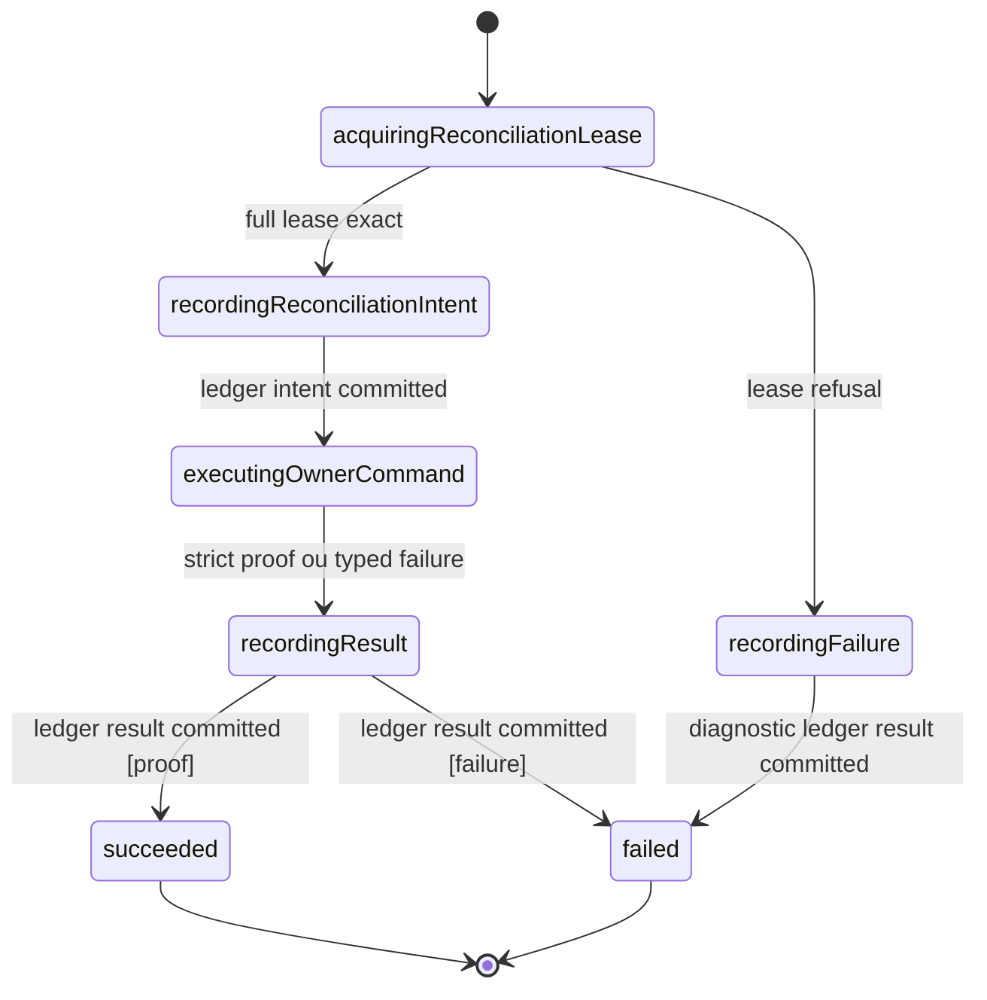
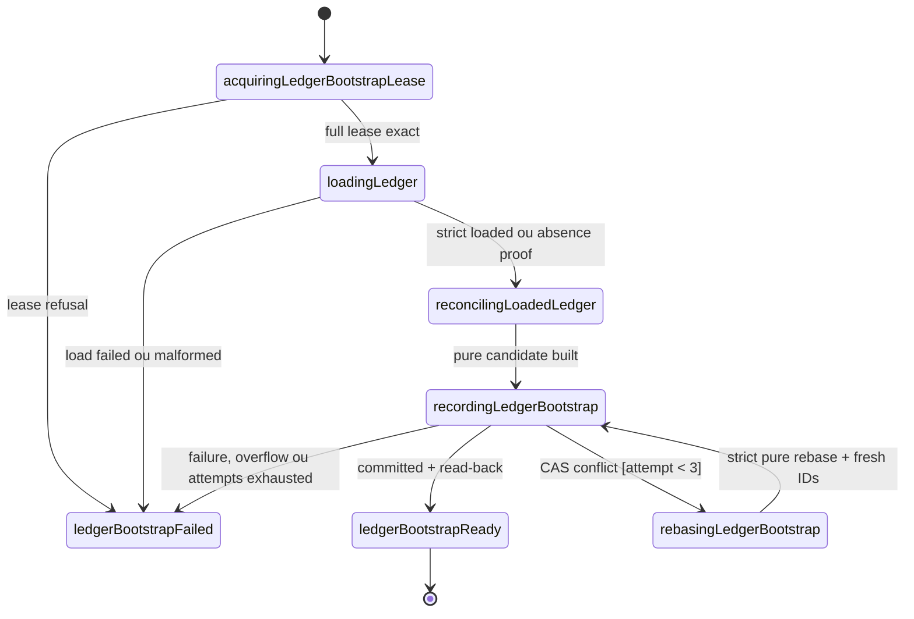
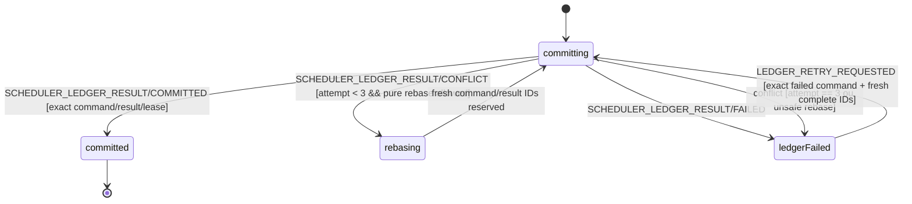
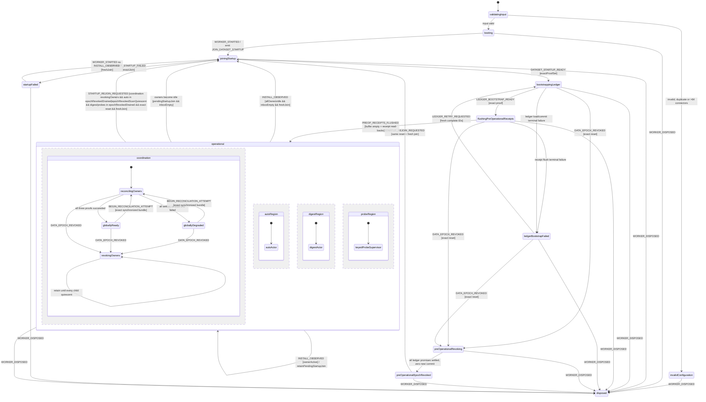
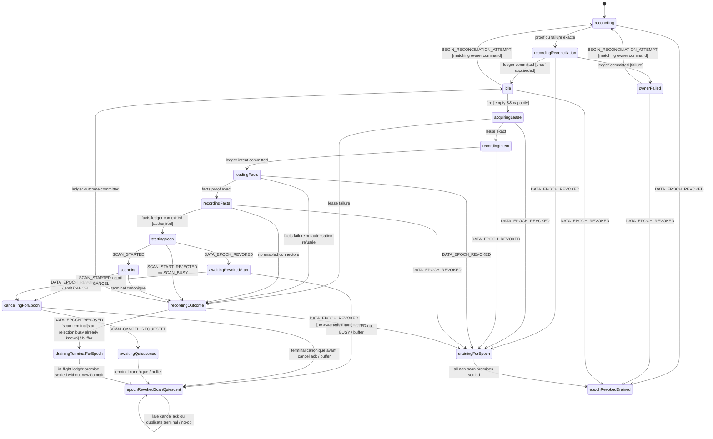
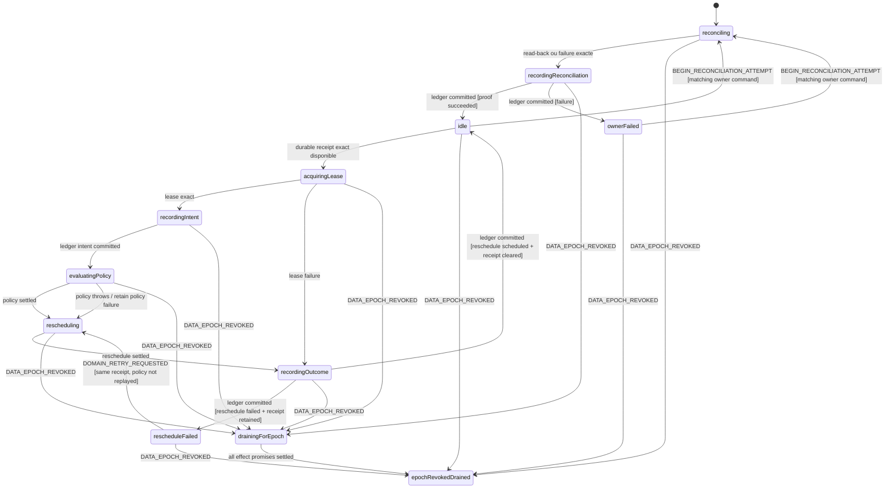
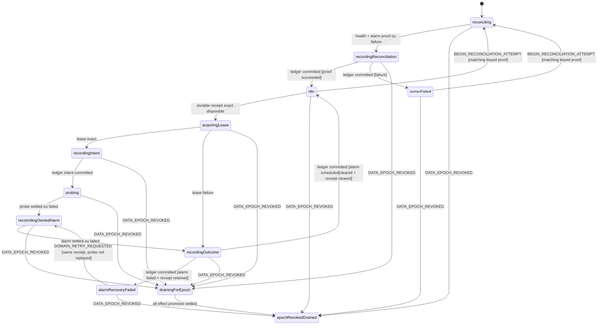
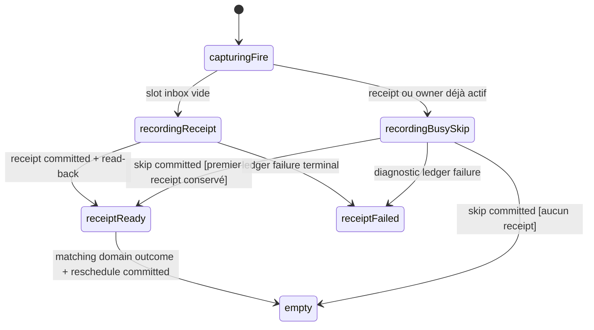

# Background Scheduling and Consent Model

Source de vérité du gate **Model** pour les alarmes Chrome possédées par
MissionPulse, le démarrage du service worker et l'admission des scans
automatiques. Ce modèle compose exactement les autorités existantes :

- `dataset-startup.contract.ts` ouvre l'admission et publie les bootstraps ;
- `dataset-epoch-authority.ts` émet et revalide les leases d'écriture ;
- `settings-persistence.contract.ts` est l'unique writer de `auto-scan` ;
- `onboarding-source.contract.ts` prouve la fin du wizard ;
- `scan-lifecycle.model.md` possède l'admission, l'annulation et les terminaux
  d'un scan ;
- le scheduler digest possède seulement `daily-digest` ;
- le scheduler de probes possède seulement `probe:<connectorId>`.

Les callbacks navigateur et les I/O produisent des signaux typés. Les machines
ci-dessous décident des transitions. Ni texte libre, ni toast, ni LLM ne peut
ouvrir une admission ou fabriquer une preuve.

## Contrats canoniques réutilisés sans projection destructive

Les types suivants sont consommés tels quels ; le modèle background ne les
redéfinit pas et ne retire aucun de leurs champs :

```ts
type CanonicalDependencies = {
  startupEvent: Extract<DatasetStartupEvent, { type: 'START' }>;
  settingsRecovery: StartupSettingsRecoveredV1;
  admission: DatasetAdmissionOpenedProofV1;
  publication: DatasetBootstrapPublicationProofV1;
  lease: DatasetWriteLeaseV1;
  settings: SettingsSnapshotV1;
  onboarding: OnboardingCompletionReadProofV1;
};
```

En particulier, un `DatasetWriteLeaseV1` reste toujours le tuple complet
`{ version, leaseId, operationId, dataEpoch, authorityRevision }`. Aucun
événement background ne le réduit à `leaseId`.

## Namespace et propriété des alarmes

```ts
type MissionPulseAlarm =
  | { kind: 'auto_scan'; name: 'auto-scan' }
  | { kind: 'daily_digest'; name: 'daily-digest' }
  | { kind: 'probe'; name: `probe:${string}`; connectorId: string };
```

| Namespace             | Autorité d'écriture                      | Fire handler                      |
| --------------------- | ---------------------------------------- | --------------------------------- |
| `auto-scan`           | Settings Persistence uniquement          | acteur `auto_scan`                |
| `daily-digest`        | réconciliation et acteur digest          | acteur `daily_digest`             |
| `probe:<connectorId>` | réconciliation et acteur probe de cet ID | acteur keyed `probe[connectorId]` |

`chrome.alarms.clearAll()` est interdit. Un nom inconnu est ignoré. Un nom qui
commence par `probe:` appartient au scheduler de probes pour sa réconciliation,
mais un fire malformed, vide ou exclu ne lance jamais de probe. La
réconciliation peut nettoyer ces seules entrées `probe:*`; elle ne touche pas
les alarmes d'un autre propriétaire.

## Identités et bornes

Toutes les identités sont des UUID v4 lowercase injectés. Elles sont distinctes
au sein d'une commande et fraîches pour le worker courant.

```ts
const MAX_BACKGROUND_OPERATIONS_PER_WORKER = 4096;
const MAX_BACKGROUND_CORRELATION_IDS_PER_WORKER = 32768;
const MAX_PENDING_ONE_SHOT_FIRES_PER_OWNER = 1;
const MAX_BACKGROUND_LEDGER_PROBES = 64;
const MAX_BACKGROUND_ONE_SHOT_RECEIPTS = 65;
const MAX_BACKGROUND_ACTIVE_INTENTS = 66;
const MAX_BACKGROUND_BUSY_SKIPS = 67;
const MAX_BACKGROUND_LEDGER_ENCODED_BYTES = 262144;
const MAX_DISCOVERED_PROBE_ALARMS_PER_RECONCILIATION = 256;
const MAX_BACKGROUND_LEDGER_CAS_REBASES = 3;

interface StartupJoinIdentityV1 {
  joinCommandId: string;
  resultId: string;
  attemptId: string;
  requestId: string;
  settingsRecoveryRequestId: string;
}

interface BackgroundSchedulingInput {
  workerEpoch: string;
  includedConnectorIds: readonly string[];
}

interface OwnerOperationIdentityV1 {
  operationEventId: string;
  alarmEventId: string | null;
  operationId: string;
  workerEpoch: string;
  dataEpoch: string;
  owner: 'auto_scan' | 'daily_digest' | 'probe';
  connectorId: string | null;
}
```

Pour une reconciliation ou un write diagnostic, `alarmEventId === null` et
`operationEventId` est l'ID frais de cette intention. Pour un fire,
`operationEventId === alarmEventId` et reprend exactement l'ID du callback ; un
résultat ne peut pas rebinder l'un ou l'autre.

Le registre monotone du worker conserve tous les `operationId`, IDs de
commande, IDs de résultat, `alarmEventId` et `reconciliationId` consommés. Il
n'évince et ne recycle rien. Chaque admission réserve atomiquement tous ses IDs
de commande, résultat, compensation, ledger et terminal avant d'émettre le
premier effet. À 4 096 opérations ayant demandé un lease, ou quand les 32 768
corrélations ne peuvent plus contenir cette réservation complète, l'admission
termine respectivement avec `OPERATION_CAPACITY_EXHAUSTED` ou
`CORRELATION_CAPACITY_EXHAUSTED`; aucun sous-ensemble n'est consommé. Seul un
nouveau worker, donc une nouvelle instance de `DatasetEpochAuthority`, rouvre
ces capacités. Ces bornes limitent la contribution background à la map interne
de l'autorité et son propre registre de fraîcheur.

`BackgroundSchedulingInput` accepte de 0 à 64 IDs build-inclus, uniques et
triés. Plus de 64 IDs, un doublon ou un ID non inclus produit l'état terminal
`invalidConfiguration`; la liste n'est jamais tronquée et aucun acteur probe
n'est créé. Chaque map `probes`, inbox probe et outcome probe a exactement cette
même borne. Une réconciliation qui découvre plus de 256 alarmes `probe:*`
termine `PROBE_ALARM_CAPACITY_EXHAUSTED` avant tout cleanup partiel.

| Registre / collection                     | Borne          | Admission terminale                            |
| ----------------------------------------- | -------------- | ---------------------------------------------- |
| operations ayant demandé un lease         | 4 096          | `OPERATION_CAPACITY_EXHAUSTED`                 |
| corrélations consommées/réservées         | 32 768         | `CORRELATION_CAPACITY_EXHAUSTED`               |
| connecteurs / actors / outcomes probe     | 64             | `INVALID_CONFIGURATION` avant création         |
| alarmes `probe:*` découvertes par attempt | 256            | `PROBE_ALARM_CAPACITY_EXHAUSTED`, zéro cleanup |
| reconciliation durable                    | 1              | remplacement de `latestReconciliation`         |
| receipt one-shot par namespace/connector  | 1              | busy skip, aucune éviction                     |
| receipts one-shot totaux                  | 65             | digest + 64 probes, aucun 66e receipt          |
| intents actifs / recovered IDs            | 66             | auto + digest + 64 probes                      |
| derniers busy skips                       | 67             | coordination + auto + digest + 64 probes       |
| résultats de reconciliation               | 3              | auto + digest + bulk probes                    |
| ledger JSON encodé                        | 262 144 octets | `LEDGER_CAPACITY_EXHAUSTED`, aucun commit      |
| rebase CAS d'une intention                | 3              | `LEDGER_CAS_RETRY_EXHAUSTED`                   |
| erreurs retenues par actor                | 2              | refus de nouvelle admission, aucune éviction   |

## Erreurs fermées

```ts
type BackgroundSchedulingPhase =
  | 'capture'
  | 'configuration'
  | 'startup_join'
  | 'reconciliation'
  | 'lease'
  | 'ledger_bootstrap'
  | 'ledger'
  | 'one_shot_inbox'
  | 'facts'
  | 'scan_start'
  | 'scan_runtime'
  | 'scan_quiescence'
  | 'digest_policy'
  | 'digest_reschedule'
  | 'probe_execution'
  | 'probe_alarm';

type BackgroundSchedulingErrorCode =
  | 'INVALID_PROTOCOL'
  | 'INVALID_CONFIGURATION'
  | 'OPERATION_CAPACITY_EXHAUSTED'
  | 'CORRELATION_CAPACITY_EXHAUSTED'
  | 'PROBE_ALARM_CAPACITY_EXHAUSTED'
  | 'STARTUP_JOIN_FAILED'
  | 'OWNER_RECONCILIATION_FAILED'
  | 'DATASET_LEASE_REJECTED'
  | 'LEDGER_LOAD_FAILED'
  | 'LEDGER_COMMIT_FAILED'
  | 'LEDGER_CAS_RETRY_EXHAUSTED'
  | 'LEDGER_CAPACITY_EXHAUSTED'
  | 'LEDGER_REVISION_EXHAUSTED'
  | 'ONE_SHOT_RECEIPT_FAILED'
  | 'FACTS_LOAD_FAILED'
  | 'SCAN_START_FAILED'
  | 'SCAN_RUNTIME_FAILED'
  | 'SCAN_QUIESCENCE_FAILED'
  | 'DIGEST_POLICY_FAILED'
  | 'DIGEST_RESCHEDULE_FAILED'
  | 'PROBE_EXECUTION_FAILED'
  | 'PROBE_ALARM_FAILED';

interface BackgroundSchedulingErrorV1 {
  version: 1;
  code: BackgroundSchedulingErrorCode;
  phase: BackgroundSchedulingPhase;
  retryable: boolean;
  owner: 'startup' | 'auto_scan' | 'daily_digest' | 'probe';
  connectorId: string | null;
  correlationId: string;
}
```

La matrice code/phase/retry est fermée :

| Code                             | Phase exacte        | Retry |
| -------------------------------- | ------------------- | ----- |
| `INVALID_PROTOCOL`               | `capture`           | non   |
| `INVALID_CONFIGURATION`          | `configuration`     | non   |
| `OPERATION_CAPACITY_EXHAUSTED`   | `lease`             | non   |
| `CORRELATION_CAPACITY_EXHAUSTED` | `capture`           | non   |
| `PROBE_ALARM_CAPACITY_EXHAUSTED` | `reconciliation`    | non   |
| `STARTUP_JOIN_FAILED`            | `startup_join`      | oui   |
| `OWNER_RECONCILIATION_FAILED`    | `reconciliation`    | oui   |
| `DATASET_LEASE_REJECTED`         | `lease`             | oui   |
| `LEDGER_LOAD_FAILED`             | `ledger_bootstrap`  | oui   |
| `LEDGER_COMMIT_FAILED`           | `ledger`            | oui   |
| `LEDGER_CAS_RETRY_EXHAUSTED`     | `ledger`            | non   |
| `LEDGER_CAPACITY_EXHAUSTED`      | `ledger`            | non   |
| `LEDGER_REVISION_EXHAUSTED`      | `ledger`            | non   |
| `ONE_SHOT_RECEIPT_FAILED`        | `one_shot_inbox`    | oui   |
| `FACTS_LOAD_FAILED`              | `facts`             | oui   |
| `SCAN_START_FAILED`              | `scan_start`        | oui   |
| `SCAN_RUNTIME_FAILED`            | `scan_runtime`      | oui   |
| `SCAN_QUIESCENCE_FAILED`         | `scan_quiescence`   | oui   |
| `DIGEST_POLICY_FAILED`           | `digest_policy`     | oui   |
| `DIGEST_RESCHEDULE_FAILED`       | `digest_reschedule` | oui   |
| `PROBE_EXECUTION_FAILED`         | `probe_execution`   | oui   |
| `PROBE_ALARM_FAILED`             | `probe_alarm`       | oui   |

Une cause canonique (`DatasetStartupErrorV1`, `SettingsPersistenceError` ou
erreur Scan Lifecycle) est conservée dans le résultat discriminé qui la porte ;
elle n'est jamais réduite à un message.

`connectorId` est non-null exactement pour un acteur probe keyed. Il est null
pour startup, auto, digest et la réconciliation bulk des probes. Une erreur
`owner:'probe'` bulk ne peut donc pas être réutilisée comme settlement d'un
connecteur particulier.

## Jointure exacte avec Dataset Startup

L'entrée `WORKER_STARTED` fournit une identité `StartupJoinIdentityV1`. Elle
émet exactement une commande immuable :

```ts
interface JoinDatasetStartupCommandV1 {
  version: 1;
  type: 'JOIN_DATASET_STARTUP';
  commandId: string;
  resultId: string;
  workerEpoch: string;
  includedConnectorIds: readonly string[];
  event: Extract<DatasetStartupEvent, { type: 'START' }>;
}
```

`event` reprend exactement `attemptId`, `requestId`,
`settingsRecoveryRequestId` et `workerEpoch` de l'identité. La commande rejoint
l'acteur Dataset Startup partagé ; elle n'en crée pas un second et n'ouvre pas
directement la base ou l'admission.

Le seul résultat ready accepté est la projection complète suivante :

```ts
interface DatasetStartupReadyForBackgroundV1 {
  version: 1;
  kind: 'DATASET_STARTUP_READY_FOR_BACKGROUND';
  joinCommandId: string;
  resultId: string;
  attemptId: string;
  requestId: string;
  settingsRecoveryRequestId: string;
  workerEpoch: string;
  dataEpoch: string;
  includedConnectorIds: readonly string[];
  settingsRecoveryProof: StartupSettingsRecoveredV1;
  admissionProof: DatasetAdmissionOpenedProofV1;
  publicationProof: DatasetBootstrapPublicationProofV1;
}

type DatasetStartupFailedForBackgroundV1 =
  | {
      version: 1;
      kind: 'DATASET_STARTUP_FAILED_BEFORE_ADMISSION';
      joinCommandId: string;
      resultId: string;
      attemptId: string;
      requestId: string;
      settingsRecoveryRequestId: string;
      workerEpoch: string;
      error: DatasetStartupErrorV1;
      failureFenceProof: null;
    }
  | {
      version: 1;
      kind: 'DATASET_STARTUP_FAILED_AND_FENCED';
      joinCommandId: string;
      resultId: string;
      attemptId: string;
      requestId: string;
      settingsRecoveryRequestId: string;
      workerEpoch: string;
      error: DatasetStartupErrorV1;
      failureFenceProof: DatasetStartupFailureFenceProofV1;
    };
```

Le validateur exige simultanément :

1. tous les IDs, dont le `resultId` attendu, et le worker égaux à la commande
   en vol ;
2. `settingsRecoveryProof` égal à l'attempt, au worker, au data epoch et au
   `settingsRecoveryRequestId` attendus ;
3. son `snapshot` strict, `journal === null`, `resetJournalAbsent === true` et
   son `AutoScanAlarmProofV1` exact ;
4. `admissionProof` égal au même attempt/worker/epoch, `admission === 'open'`,
   et une `authorityRevision` safe positive ;
5. `publicationProof.admissionProofId === admissionProof.proofId`, avec le même
   attempt/worker/epoch, et exactement un bootstrap
   `{ requestId, workerEpoch, dataEpoch }` pour cette jointure ;
6. le set ordonné canonique `includedConnectorIds` égal à celui de la commande.

`STARTUP_FAILED` est également lié à `joinCommandId`, au `resultId` attendu,
`attemptId`, `requestId`, `settingsRecoveryRequestId` et `workerEpoch`. Sa branche est exacte : échec
avant ouverture avec `DatasetStartupErrorV1`, ou échec après ouverture avec le
même error et un `DatasetStartupFailureFenceProofV1` prouvant admission fermée,
zéro lease actif et révision suivante. Un résultat stale ne change rien.

Le proof Settings validé par Dataset Startup initialise l'owner `auto_scan` par
**adoption**. Il n'y a pas de deuxième recovery ni de deuxième writer d'alarme.
Une réparation ultérieure émet un `LOAD` frais vers l'unique coordinateur
Settings et attend son `LOAD_SUCCEEDED` exact (`requestId`,
`commandId === settings/load/{requestId}`, snapshot strict). Le background ne
crée, remplace ou clear jamais `auto-scan` lui-même.

`INSTALL_OBSERVED` porte sa raison et une nouvelle `StartupJoinIdentityV1`. Il
demande cette même jointure sérialisée, sans détecter de session, sans choisir
de source, sans créer de profil et sans démarrer de scan. Un événement install
dupliqué avec les mêmes IDs est un replay no-op.

## Commandes et preuves de réconciliation

Une tentative possède un `reconciliationId` frais et trois commandes
immuables. Un owner ne se settle qu'une fois, tant que sa commande exacte est
son état `reconciling`. Un résultat dupliqué, croisé ou tardif est consommé
comme no-op et ne remplace jamais un résultat déjà settled.

Un résultat valide passe d'abord par `recordingReconciliation`. Le résultat est
ajouté au `DurableReconciliationV1` par CAS sous son lease (l'adoption auto
utilise un lease de ledger frais, pas un writer d'alarme). L'owner devient
`idle` ou `ownerFailed` seulement après le read-back
`SchedulerLedgerCommitProofV1`. La coordination ne compte donc jamais un
settlement seulement présent en mémoire.

```ts
type OwnerReconciliationCommandV1 =
  | {
      version: 1;
      type: 'ADOPT_STARTUP_SETTINGS_PROOF';
      commandId: string;
      resultId: string;
      reconciliationId: string;
      workerEpoch: string;
      dataEpoch: string;
      startupJoinCommandId: string;
      identity: OwnerOperationIdentityV1;
      lease: DatasetWriteLeaseV1;
      settingsRecoveryProof: StartupSettingsRecoveredV1;
    }
  | {
      version: 1;
      type: 'RECOVER_SETTINGS_THROUGH_COORDINATOR';
      commandId: string;
      resultId: string;
      reconciliationId: string;
      identity: OwnerOperationIdentityV1;
      lease: DatasetWriteLeaseV1;
      settingsLoadRequestId: string;
      expectedSettingsCommandId: string;
    }
  | {
      version: 1;
      type: 'RECONCILE_DAILY_DIGEST';
      commandId: string;
      resultId: string;
      reconciliationId: string;
      identity: OwnerOperationIdentityV1;
      lease: DatasetWriteLeaseV1;
      nowMs: number;
      timeZone: string;
      expectedWhenMs: number | null;
      expectedReceiptId: string | null;
    }
  | {
      version: 1;
      type: 'RECONCILE_PROBE_ALARMS';
      commandId: string;
      resultId: string;
      reconciliationId: string;
      identity: OwnerOperationIdentityV1;
      lease: DatasetWriteLeaseV1;
      nowMs: number;
      probeIntervalMs: number;
      includedConnectorIds: readonly string[];
      expectedReceiptIdsByConnector: Readonly<Record<string, string>>;
    };

interface ReconciliationIdentityBundleV1 {
  version: 1;
  reconciliationId: string;
  workerEpoch: string;
  dataEpoch: string;
  autoScan:
    | {
        kind: 'startup_adoption';
        commandId: string;
        resultId: string;
        startupJoinCommandId: string;
        operationEventId: string;
        operationId: string;
        leaseCommandId: string;
      }
    | {
        kind: 'settings_recovery';
        commandId: string;
        resultId: string;
        operationEventId: string;
        operationId: string;
        leaseCommandId: string;
        settingsLoadRequestId: string;
      };
  dailyDigest: {
    commandId: string;
    resultId: string;
    operationEventId: string;
    operationId: string;
    leaseCommandId: string;
  };
  probes: {
    commandId: string;
    resultId: string;
    operationEventId: string;
    operationId: string;
    leaseCommandId: string;
  };
}

interface ReconcileRetryRequestedV1 {
  type: 'RECONCILE_RETRY_REQUESTED';
  requestId: string;
  expectedBusySkipId: string;
  workerEpoch: string;
  dataEpoch: string;
  currentReconciliationId: string;
  next: ReconciliationIdentityBundleV1;
}

interface BeginReconciliationAttemptV1 {
  type: 'BEGIN_RECONCILIATION_ATTEMPT';
  sourceRequestId: string;
  previousReconciliationId: string | null;
  next: ReconciliationIdentityBundleV1;
}

interface LedgerRetryIdentityV1 {
  requestId: string;
  expectedFailedCommandId: string;
  operationEventId: string;
  operationId: string;
  leaseCommandId: string;
  ledgerCommandId: string;
  ledgerResultId: string;
}

interface LedgerRetryRequestedV1 {
  type: 'LEDGER_RETRY_REQUESTED';
  workerEpoch: string;
  dataEpoch: string;
  purpose: 'bootstrap' | 'reconciliation' | 'intent' | 'facts' | 'outcome' | 'receipt' | 'skip';
  identities: LedgerRetryIdentityV1;
}

interface DomainRetryRequestedV1 {
  type: 'DOMAIN_RETRY_REQUESTED';
  requestId: string;
  workerEpoch: string;
  dataEpoch: string;
  owner: 'daily_digest' | 'probe';
  connectorId: string | null;
  receiptId: string;
  failedOutcomeCommandId: string;
  operationEventId: string;
  operationId: string;
  leaseCommandId: string;
  commandId: string;
  resultId: string;
}
```

L'heure, le fuseau et les délais sont injectés. `expectedWhenMs` est calculé
par le Core avant l'effet et doit représenter le prochain 09:00 local strictement
postérieur à `nowMs`.

```ts
type AlarmReadBackV1 =
  | { name: string; exists: false }
  | {
      name: string;
      exists: true;
      scheduledTime: number;
      periodInMinutes: null;
    };

interface DigestReconciliationProofV1 {
  kind: 'DIGEST_RECONCILIATION_PROVED';
  commandId: string;
  reconciliationId: string;
  identity: OwnerOperationIdentityV1;
  lease: DatasetWriteLeaseV1;
  nowMs: number;
  timeZone: string;
  expectedWhenMs: number | null;
  expectedReceiptId: string | null;
  readBack: AlarmReadBackV1;
  proofId: string;
}

interface ProbeAlarmExpectationV1 {
  connectorId: string;
  healthSnapshot: ConnectorHealthSnapshot;
  expected:
    | { kind: 'scheduled'; expectedWhenMs: number }
    | { kind: 'receipt_pending'; receiptId: string }
    | { kind: 'absent' };
  readBack: AlarmReadBackV1;
}

interface ProbeReconciliationProofV1 {
  kind: 'PROBE_RECONCILIATION_PROVED';
  commandId: string;
  reconciliationId: string;
  identity: OwnerOperationIdentityV1;
  lease: DatasetWriteLeaseV1;
  nowMs: number;
  probeIntervalMs: number;
  includedConnectorIds: readonly string[];
  expectations: readonly ProbeAlarmExpectationV1[];
  discoveredUnexpectedProbeNames: readonly string[];
  clearedUnexpectedProbeNames: readonly string[];
  cleanupReadBackAbsent: readonly string[];
  proofId: string;
}

type AutoScanReconciliationProofV1 =
  | {
      kind: 'AUTO_SCAN_STARTUP_PROOF_ADOPTED';
      commandId: string;
      resultId: string;
      reconciliationId: string;
      startupJoinCommandId: string;
      identity: OwnerOperationIdentityV1;
      lease: DatasetWriteLeaseV1;
      settingsRecoveryProof: StartupSettingsRecoveredV1;
    }
  | {
      kind: 'AUTO_SCAN_SETTINGS_RECOVERED';
      commandId: string;
      resultId: string;
      reconciliationId: string;
      identity: OwnerOperationIdentityV1;
      lease: DatasetWriteLeaseV1;
      settingsSnapshot: SettingsSnapshotV1;
    };

type OwnerReconciliationResultV1 =
  | {
      version: 1;
      kind: 'OWNER_RECONCILIATION_SUCCEEDED';
      owner: 'auto_scan';
      commandId: string;
      resultId: string;
      reconciliationId: string;
      proof: AutoScanReconciliationProofV1;
    }
  | {
      version: 1;
      kind: 'OWNER_RECONCILIATION_SUCCEEDED';
      owner: 'daily_digest';
      commandId: string;
      resultId: string;
      reconciliationId: string;
      proof: DigestReconciliationProofV1;
    }
  | {
      version: 1;
      kind: 'OWNER_RECONCILIATION_SUCCEEDED';
      owner: 'probes';
      commandId: string;
      resultId: string;
      reconciliationId: string;
      proof: ProbeReconciliationProofV1;
    }
  | {
      version: 1;
      kind: 'OWNER_RECONCILIATION_ADOPTION_FAILED';
      owner: 'auto_scan';
      commandId: string;
      resultId: string;
      reconciliationId: string;
      startupJoinCommandId: string;
      identity: OwnerOperationIdentityV1;
      lease: DatasetWriteLeaseV1;
      error: BackgroundSchedulingErrorV1;
    }
  | {
      version: 1;
      kind: 'OWNER_RECONCILIATION_FAILED';
      owner: 'auto_scan';
      commandId: string;
      resultId: string;
      reconciliationId: string;
      identity: OwnerOperationIdentityV1;
      lease: DatasetWriteLeaseV1;
      cause: AutoScanFailureCauseV1;
    }
  | {
      version: 1;
      kind: 'OWNER_RECONCILIATION_FAILED';
      owner: 'daily_digest' | 'probes';
      commandId: string;
      resultId: string;
      reconciliationId: string;
      identity: OwnerOperationIdentityV1;
      lease: DatasetWriteLeaseV1;
      error: BackgroundSchedulingErrorV1;
    }
  | {
      version: 1;
      kind: 'OWNER_RECONCILIATION_LEASE_FAILED';
      owner: 'auto_scan' | 'daily_digest' | 'probes';
      commandId: string;
      resultId: string;
      reconciliationId: string;
      identity: OwnerOperationIdentityV1;
      scope: DatasetMutationScopeV2;
      error: BackgroundSchedulingErrorV1;
    };
```

`ReconcileRetryRequestedV1` est accepté seulement si son worker/epoch/current
attempt matchent, si coordination est globalement ready/degraded, si auto et
digest sont `idle|ownerFailed`, si chaque probe keyed est
`idle|ownerFailed`, si aucun startup/reset/ledger retry n'est pending, et si la
réservation de tous les IDs du bundle `next` réussit. Une seule guard pure
vérifie ce produit d'états. En cas de succès, XState raise exactement un
`BeginReconciliationAttemptV1` dans le même macrostep : coordination, auto,
digest et le supervisor des N probes prennent tous leur transition vers
`reconciling`. En cas d'échec, aucune région ne bouge et un
`retry_regions_not_settled` lié à `expectedBusySkipId` est conservé. Il
n'existe pas de retry partiel.

Sans receipt digest, un proof réussi exige `expectedReceiptId === null`, un
`expectedWhenMs` safe, le read-back présent de `daily-digest` à cette heure et
aucune période. Avec receipt durable, il exige son ID exact,
`expectedWhenMs === null` et le read-back absent : l'alarme consommée n'est pas
recréée avant traitement du receipt. Un proof probes contient exactement un
snapshot et une expectation par ID inclus : un receipt exact implique
`receipt_pending` + absence ; sinon circuit `open` implique le one-shot
`nowMs + probeIntervalMs`, et `closed|half-open` implique absence. Les trois
listes de cleanup sont des sets triés identiques couvrant chaque nom `probe:*`
malformed ou exclu découvert, et leurs read-backs prouvent l'absence. Aucun nom
hors `probe:*` ne peut apparaître.

Le résultat auto est soit l'adoption exacte du proof startup, soit un strict
`SettingsSnapshotV1` renvoyé par le coordinateur unique. Les échecs de chaque
commande forment une autre branche discriminée avec
`BackgroundSchedulingErrorV1`; une branche failure ne peut porter de proof.

Chaque état owner `reconciling` invoque la même sous-machine de protocole ; ses
phases ne sont pas stockées en contexte :



L'adoption startup ne réécrit pas l'alarme : elle saute seulement
`executingOwnerCommand`, mais acquiert tout de même un lease distinct pour
persister son résultat de réconciliation. Digest et probes ne peuvent produire
leur proof avant `executingOwnerCommand`.

## Lease canonique et absence de release fictif

Avant tout owner effect autre que l'adoption startup, l'acteur alloue un
`operationId` immuable et émet :

```ts
interface AcquireOwnerLeaseCommandV1 {
  type: 'ACQUIRE_OWNER_LEASE';
  commandId: string;
  resultId: string;
  identity: OwnerOperationIdentityV1;
  scope: DatasetMutationScopeV2; // version 2, même operationId/dataEpoch
}
```

Le seul succès est le `DatasetWriteLeaseV1` exact produit par
`DatasetEpochAuthority.issueLease(scope)`. Chaque commande et chaque résultat
ultérieur répète l'identité owner et ce lease entier. Toute écriture durable
(ledger background, health, seen/history/cache, Settings/Onboarding quand elle
est dans la portée de l'opération) passe par
`authority.commit(lease, operationId, durableEffect)`. L'autorité revalide donc
lease, opération, epoch et révision au moment du commit.

Il n'existe **aucune** action `releaseLease`. Après un terminal durable, l'acteur
efface seulement son identité active. Le binding de l'autorité reste dans son
registre monotone borné jusqu'à révocation ou fin du worker. Une transition ne
prétend jamais qu'un slot vidé a supprimé ce binding.

## Ledger durable des intentions, faits, réconciliations et outcomes

La vérité diagnostique n'est pas déduite des logs. Un unique record V1, écrit
par CAS sous lease et relu après chaque commit, conserve :

```ts
interface LoadBackgroundLedgerCommandV1 {
  type: 'LOAD_BACKGROUND_SCHEDULING_LEDGER';
  commandId: string;
  resultId: string;
  identity: OwnerOperationIdentityV1;
  lease: DatasetWriteLeaseV1;
  storageKey: 'missionpulse.backgroundScheduling.v1';
  startup: DatasetStartupReadyForBackgroundV1;
}

interface BackgroundLedgerAbsentProofV1 {
  version: 1;
  dataEpoch: string;
  commandId: string;
  resultId: string;
  storageKey: 'missionpulse.backgroundScheduling.v1';
  proofId: string;
  absenceReadBackVerified: true;
}

type BackgroundLedgerLoadResultV1 =
  | {
      kind: 'BACKGROUND_LEDGER_LOADED';
      commandId: string;
      resultId: string;
      identity: OwnerOperationIdentityV1;
      lease: DatasetWriteLeaseV1;
      ledger: BackgroundSchedulingLedgerV1;
    }
  | {
      kind: 'BACKGROUND_LEDGER_ABSENT';
      commandId: string;
      resultId: string;
      identity: OwnerOperationIdentityV1;
      lease: DatasetWriteLeaseV1;
      proof: BackgroundLedgerAbsentProofV1;
    }
  | {
      kind: 'BACKGROUND_LEDGER_LOAD_FAILED';
      commandId: string;
      resultId: string;
      identity: OwnerOperationIdentityV1;
      lease: DatasetWriteLeaseV1;
      error: BackgroundSchedulingErrorV1;
    };

interface DurableOwnerIntentV1 {
  version: 1;
  workerEpoch: string;
  identity: OwnerOperationIdentityV1;
  lease: DatasetWriteLeaseV1;
  commandId: string;
  commandKind: 'reconciliation' | 'auto_scan' | 'digest' | 'probe';
  facts: AutoScanFactsProofV1 | null;
  intentDigest: string;
}

interface DurableReconciliationV1 {
  version: 1;
  reconciliationId: string;
  workerEpoch: string;
  dataEpoch: string;
  commands: Readonly<Record<'auto_scan' | 'daily_digest' | 'probes', OwnerReconciliationCommandV1>>;
  results: Readonly<
    Partial<Record<'auto_scan' | 'daily_digest' | 'probes', OwnerReconciliationResultV1>>
  >;
}

interface OneShotFireReceiptV1 {
  version: 1;
  receiptId: string;
  fire: PendingAlarmFireV1;
  dataEpoch: string;
  capturedByWorkerEpoch: string;
}

interface PreOperationalReceiptFlushProofV1 {
  version: 1;
  workerEpoch: string;
  dataEpoch: string;
  receiptIds: readonly string[];
  finalLedgerProof: SchedulerLedgerCommitProofV1;
  preOperationalBufferEmpty: true;
  proofId: string;
}

interface BackgroundBusySkipV1 {
  version: 1;
  kind: 'BACKGROUND_BUSY_SKIP';
  skipId: string;
  workerEpoch: string;
  dataEpoch: string;
  owner: 'auto_scan' | 'daily_digest' | 'probe' | 'coordination';
  connectorId: string | null;
  alarmEventId: string | null;
  reason:
    | 'owner_active'
    | 'pending_fire_occupied'
    | 'owner_not_ready'
    | 'retry_regions_not_settled'
    | 'startup_join_pending';
}

interface BackgroundSchedulingLedgerV1 {
  version: 1;
  storageKey: 'missionpulse.backgroundScheduling.v1';
  dataEpoch: string;
  ledgerRevision: number;
  startup: {
    attemptId: string;
    requestId: string;
    settingsRecoveryRequestId: string;
    admissionProofId: string;
    authorityRevision: number;
  };
  latestReconciliation: DurableReconciliationV1 | null;
  oneShotInbox: {
    digest: OneShotFireReceiptV1 | null;
    probes: Readonly<Record<string, OneShotFireReceiptV1>>;
  };
  activeIntents: {
    autoScan: DurableOwnerIntentV1 | null;
    digest: DurableOwnerIntentV1 | null;
    probes: Readonly<Record<string, DurableOwnerIntentV1>>;
  };
  lastOutcomes: {
    autoScan: AutoScanOutcomeV1 | null;
    digest: DigestOutcomeV1 | null;
    probes: Readonly<Record<string, ProbeOutcomeV1>>;
  };
  lastBusySkips: {
    autoScan: BackgroundBusySkipV1 | null;
    digest: BackgroundBusySkipV1 | null;
    probes: Readonly<Record<string, BackgroundBusySkipV1>>;
    coordination: BackgroundBusySkipV1 | null;
  };
}
```

`DurableReconciliationV1` conserve le `reconciliationId`, les trois commandes,
leurs stricts résultats/proofs et leurs erreurs indépendantes. Un
`DurableOwnerIntentV1` conserve l'identité owner, le lease complet, la commande
en vol et, pour auto-scan, le facts proof strict dès qu'il est acquis.

`latestReconciliation` signifie littéralement **un seul** record : le démarrage
d'une tentative fraîche remplace atomiquement la précédente. Aucun historique
de reconciliation n'est promis ni conservé. Les late results du même worker
sont bloqués par le registre monotone ; ceux d'un ancien worker par
`workerEpoch`. Les maps inbox, outcomes et busy skips contiennent au plus les
64 clés build-incluses et une seule valeur par clé.

Avant le premier domaine effect, l'acteur persiste son intent. Après lecture de
faits, il persiste leur proof avant de dispatcher le scan. Au settlement, une
seule CAS retire l'intent et remplace le dernier outcome du même owner. Le slot
ne retourne à `idle` qu'après `SchedulerLedgerCommitProofV1` exact et read-back.
Le ledger contient au plus un auto, un digest et un résultat par connecteur
build-inclus, avec un maximum de 64 probes. Une nouvelle preuve remplace
seulement la même clé ; elle n'écrase jamais un autre owner.

Si le lease de domaine lui-même est refusé, aucun intent et aucun domaine
effect n'a commencé. L'acteur alloue une opération distincte de diagnostic,
acquiert son propre full lease et persiste l'outcome `*_lease_failed`. Si ce
second lease échoue aussi, l'acteur reste `recordingOutcome` avec les deux
erreurs typées et ne prétend pas avoir produit un outcome durable ; un retry ou
restart refait la réconciliation. Le lease de diagnostic n'est jamais présenté
comme le lease de domaine refusé.

```ts
interface SchedulerLedgerCommitProofV1 {
  version: 1;
  dataEpoch: string;
  operationId: string;
  lease: DatasetWriteLeaseV1;
  commandId: string;
  resultId: string;
  previousRevision: number | null;
  settledRevision: number;
  ledgerDigest: string;
  proofId: string;
  readBackVerified: true;
}

interface SchedulerLedgerConflictV1 {
  version: 1;
  dataEpoch: string;
  commandId: string;
  resultId: string;
  identity: OwnerOperationIdentityV1;
  lease: DatasetWriteLeaseV1;
  attemptedRevision: number | null;
  canonicalLedger: BackgroundSchedulingLedgerV1;
  canonicalDigest: string;
  proofId: string;
  readBackVerified: true;
}

type SchedulerLedgerResultV1 =
  | {
      kind: 'SCHEDULER_LEDGER_COMMITTED';
      proof: SchedulerLedgerCommitProofV1;
    }
  | {
      kind: 'SCHEDULER_LEDGER_CONFLICT';
      conflict: SchedulerLedgerConflictV1;
    }
  | {
      kind: 'SCHEDULER_LEDGER_FAILED';
      commandId: string;
      resultId: string;
      identity: OwnerOperationIdentityV1;
      lease: DatasetWriteLeaseV1;
      error: BackgroundSchedulingErrorV1;
    };

interface LedgerBootstrapReadyProofV1 {
  version: 1;
  workerEpoch: string;
  dataEpoch: string;
  startupJoinCommandId: string;
  loadCommandId: string;
  loadResultId: string;
  ledgerCommitProof: SchedulerLedgerCommitProofV1;
  recoveredOldWorkerIntentIds: readonly string[];
  proofId: string;
}
```

### Bootstrap et CAS du ledger

`DATASET_STARTUP_READY` n'entre jamais directement dans `operational`. Le
superviseur acquiert un lease frais, émet `LOAD_BACKGROUND_SCHEDULING_LEDGER`,
valide le result exact, puis :

- sur absence prouvée, construit la revision 0 avec les références startup et
  toutes les maps vides ;
- sur ledger strict du même epoch, remplace les références startup, conserve
  inbox/outcomes/skips, et transforme chaque intent d'un ancien worker en
  `*_outcome_unknown` sans réutiliser son lease ;
- les clés probe valides mais désormais build-exclues sont retirées
  atomiquement du candidat après classification de leur intent ; leurs alarmes
  seront nettoyées par le proof bulk, jamais par le bootstrap ledger ;
- sur ledger d'un autre epoch, structure malformed, cardinalité dépassée ou
  intent prétendument actif du worker neuf, échoue fail-closed ;
- persiste le candidat et exige son read-back avant d'émettre
  `LedgerBootstrapReadyProofV1`.



Les révisions sont des entiers safe monotones. La création sur absence exige
`previousRevision === null && settledRevision === 0`; toute mise à jour exige
`previousRevision !== null && settledRevision === previousRevision + 1`. Un conflit CAS ne compte pas comme
succès. Le candidat est encodé canoniquement avant dispatch et ne dépasse jamais
262 144 octets ; au-delà, `LEDGER_CAPACITY_EXHAUSTED` termine avant I/O. Un
conflit porte le ledger canonique strict du même epoch ; le Core ne rebase
que si l'intention attendue est encore applicable et qu'aucun owner étranger
n'est écrasé. Chaque rebase consomme de nouveaux command/result IDs. Après
exactement trois conflits, `LEDGER_CAS_RETRY_EXHAUSTED` est terminal pour cette
intention. Quota, read-back différent et I/O produisent
`SCHEDULER_LEDGER_FAILED`; `Number.MAX_SAFE_INTEGER` produit
`LEDGER_REVISION_EXHAUSTED`. Aucune branche ne devient ready/idle par défaut.
Une failure retryable exige `LEDGER_RETRY_REQUESTED` exact, avec IDs et
réservation de capacité frais. `LEDGER_CAS_RETRY_EXHAUSTED`,
`LEDGER_REVISION_EXHAUSTED` et `LEDGER_CAPACITY_EXHAUSTED` refusent ce retry et
restent terminaux pour le worker courant.

Après restart, tout intent d'un ancien `workerEpoch` devient un outcome typé
`outcome_unknown` pendant ce bootstrap sous un nouveau lease. Une différence de
`dataEpoch` est laissée à la procédure Reset et ne peut pas être adoptée dans le
nouvel epoch. `operational` est inaccessible avant `ledgerBootstrapReady`.
Si `preOperationalOneShots` n'est pas vide, il reste aussi inaccessible avant
`PreOperationalReceiptFlushProofV1` et les read-backs de tous les receipts.

Chaque état `recordingReconciliation|recordingIntent|recordingFacts|
recordingOutcome|recordingReceipt|recordingBusySkip` invoque la même
sous-machine typée :



Le parent ne prend sa transition `idle|ownerFailed|loadingFacts|startingScan`
qu'après le final `committed`. `ledgerFailed` conserve le résultat failure ou
conflict exact ; il n'est assimilé ni à un outcome domaine, ni à un succès.

## Outcomes discriminés

```ts
interface ScanStartedV1 {
  type: 'SCAN_STARTED';
  payload: { operationId: string };
}

interface ScanStartRejectedV1 {
  type: 'SCAN_START_REJECTED';
  payload: { operationId: string; code: string; message: string };
}

interface ScanBusyV1 {
  type: 'SCAN_BUSY';
  payload: { operationId: string; activeOperationId: string };
}

interface ScanCompleteV1 {
  type: 'SCAN_COMPLETE';
  payload: { operationId: string; missions: readonly Mission[] };
}

interface ScanErrorV1 {
  type: 'SCAN_ERROR';
  payload: { operationId: string; code: string; message: string };
}

interface ScanCancelledV1 {
  type: 'SCAN_CANCELLED';
  payload: { operationId: string };
}

interface ScanCancelRequestedV1 {
  type: 'SCAN_CANCEL_REQUESTED';
  payload: { operationId: string };
}

interface ResetCorrelationV1 {
  resetId: string;
  workerEpoch: string;
  revokedDataEpoch: string;
}

type RevokedScanTerminalBufferV1 =
  | {
      kind: 'REVOKED_SCAN_NOT_ACCEPTED';
      reset: ResetCorrelationV1;
      identity: OwnerOperationIdentityV1;
      lease: DatasetWriteLeaseV1;
      result: ScanStartRejectedV1 | ScanBusyV1;
      quiescent: true;
    }
  | {
      kind: 'REVOKED_SCAN_ACCEPTED_TERMINAL';
      reset: ResetCorrelationV1;
      identity: OwnerOperationIdentityV1;
      lease: DatasetWriteLeaseV1;
      start: ScanStartedV1;
      terminal: ScanCompleteV1 | ScanErrorV1 | ScanCancelledV1;
      quiescent: true;
    };

type DurableScanTerminalV1 =
  | {
      kind: 'completed';
      missionCount: number;
      orderedMissionIdsDigest: string;
    }
  | { kind: 'failed'; code: string }
  | { kind: 'cancelled' };

type AutoScanFailureCauseV1 =
  | { kind: 'background'; error: BackgroundSchedulingErrorV1 }
  | { kind: 'settings'; error: SettingsPersistenceError };

type AutoScanOutcomeV1 =
  | {
      kind: 'no_enabled_connectors';
      identity: OwnerOperationIdentityV1;
      lease: DatasetWriteLeaseV1;
    }
  | {
      kind: 'authorization_rejected';
      identity: OwnerOperationIdentityV1;
      lease: DatasetWriteLeaseV1;
      reason:
        | 'onboarding_incomplete'
        | 'auto_scan_disabled'
        | 'connector_set_invalid'
        | 'settings_proof_invalid';
    }
  | {
      kind: 'start_rejected';
      identity: OwnerOperationIdentityV1;
      lease: DatasetWriteLeaseV1;
      scanOperationId: string;
      rejection: ScanStartRejectedV1;
    }
  | {
      kind: 'busy';
      identity: OwnerOperationIdentityV1;
      lease: DatasetWriteLeaseV1;
      scanOperationId: string;
      response: ScanBusyV1;
    }
  | {
      kind: 'accepted_terminal';
      identity: OwnerOperationIdentityV1;
      lease: DatasetWriteLeaseV1;
      scanOperationId: string;
      start: ScanStartedV1;
      terminal: DurableScanTerminalV1;
    }
  | {
      kind: 'lease_failed';
      identity: OwnerOperationIdentityV1;
      scope: DatasetMutationScopeV2;
      error: BackgroundSchedulingErrorV1;
    }
  | {
      kind: 'facts_failed' | 'outcome_unknown';
      identity: OwnerOperationIdentityV1;
      lease: DatasetWriteLeaseV1;
      cause: AutoScanFailureCauseV1;
    };

type DigestPolicyResultV1 =
  | { kind: 'sent'; missionIds: readonly string[] }
  | { kind: 'skipped'; reason: 'disabled' | 'muted' | 'no_candidate' }
  | { kind: 'failed'; error: BackgroundSchedulingErrorV1 };

type DigestRescheduleResultV1 =
  | { kind: 'scheduled'; expectedWhenMs: number; readBack: AlarmReadBackV1 }
  | { kind: 'failed'; error: BackgroundSchedulingErrorV1 };

type DigestOutcomeV1 =
  | {
      kind: 'digest_settled';
      identity: OwnerOperationIdentityV1;
      lease: DatasetWriteLeaseV1;
      receiptId: string;
      policy: DigestPolicyResultV1;
      reschedule: DigestRescheduleResultV1;
    }
  | {
      kind: 'digest_lease_failed';
      identity: OwnerOperationIdentityV1;
      scope: DatasetMutationScopeV2;
      receiptId: string;
      error: BackgroundSchedulingErrorV1;
    }
  | {
      kind: 'digest_outcome_unknown';
      identity: OwnerOperationIdentityV1;
      lease: DatasetWriteLeaseV1;
      receiptId: string;
      error: BackgroundSchedulingErrorV1;
    };

type ProbeExecutionResultV1 =
  | { kind: 'closed' | 'open'; snapshot: ConnectorHealthSnapshot }
  | { kind: 'failed'; error: BackgroundSchedulingErrorV1 };

type ProbeAlarmResultV1 =
  | { kind: 'scheduled'; expectedWhenMs: number; readBack: AlarmReadBackV1 }
  | { kind: 'cleared'; readBack: Extract<AlarmReadBackV1, { exists: false }> }
  | { kind: 'failed'; error: BackgroundSchedulingErrorV1 };

type ProbeOutcomeV1 =
  | {
      kind: 'probe_settled';
      identity: OwnerOperationIdentityV1;
      lease: DatasetWriteLeaseV1;
      connectorId: string;
      receiptId: string;
      probe: ProbeExecutionResultV1;
      alarm: ProbeAlarmResultV1;
    }
  | {
      kind: 'probe_lease_failed';
      identity: OwnerOperationIdentityV1;
      scope: DatasetMutationScopeV2;
      connectorId: string;
      receiptId: string;
      error: BackgroundSchedulingErrorV1;
    }
  | {
      kind: 'probe_outcome_unknown';
      identity: OwnerOperationIdentityV1;
      lease: DatasetWriteLeaseV1;
      connectorId: string;
      receiptId: string;
      error: BackgroundSchedulingErrorV1;
    };
```

Les erreurs digest policy/reschedule et probe execution/alarm sont réellement
indépendantes : les deux axes peuvent échouer simultanément avec deux erreurs.
Le remplacement durable suit la clé owner/connector et conserve cette vérité
au restart. Le ledger ne copie jamais les missions : un completion conserve le
count safe et le digest borné des IDs ordonnés. Un digest conserve au plus les
trois IDs effectivement notifiés. Chaque snapshot health respecte la fenêtre
canonique maximale de 100 latences.

Un `DigestRescheduleResultV1/scheduled` exige le read-back présent de
`daily-digest` à `expectedWhenMs`, sans période. Un
`ProbeAlarmResultV1/scheduled` exige le nom du connector, le read-back présent
à l'heure attendue et sans période ; `cleared` exige le même nom absent. Ces
conditions sont des validateurs de frontière, pas des conventions Shell.

La réduction des résultats est exhaustive :

| Signal ou failure                                      | Vérité conservée                                                                 |
| ------------------------------------------------------ | -------------------------------------------------------------------------------- |
| lease domaine refusé                                   | `*_lease_failed`, plus l'erreur du lease diagnostic si celui-ci échoue           |
| facts auto background / Settings                       | `facts_failed.cause` sans perdre `SettingsPersistenceError`                      |
| autorisation false / aucun connecteur                  | `authorization_rejected` / `no_enabled_connectors`                               |
| scan start rejected / busy                             | `start_rejected` / `busy`, jamais runtime error                                  |
| scan accepté complete / error / cancelled              | `accepted_terminal` avec terminal distinct                                       |
| digest policy et reschedule, y compris double failure  | les deux axes de `DigestOutcomeV1`                                               |
| probe execution et alarm, y compris double failure     | les deux axes de `ProbeOutcomeV1`                                                |
| duplicate fire, pending plein ou retry non synchronisé | `BackgroundBusySkipV1` dans `lastBusySkips`                                      |
| CAS conflict / I/O / quota / read-back / overflow      | `SchedulerLedgerResultV1` puis `ledgerFailed` si le rebase borné ne peut réussir |
| terminal après révocation                              | `RevokedScanTerminalBufferV1`, sans write sous lease révoqué                     |

Un busy skip est persisté par une opération diagnostic distincte ; son échec de
ledger reste dans la sous-machine `ledgerFailed` et ne réécrit pas l'owner
actif. Un événement malformed ou stale n'a jamais été admis : il produit
`INVALID_PROTOCOL` à la frontière ou un replay no-op, pas un outcome domaine
inventé.

## Faits canoniques d'un auto-scan

Après acquisition du lease et persistance de l'intent, l'acteur émet une
commande immuable :

```ts
interface LoadAutoScanFactsCommandV1 {
  type: 'LOAD_AUTO_SCAN_FACTS';
  commandId: string;
  resultId: string;
  identity: OwnerOperationIdentityV1;
  lease: DatasetWriteLeaseV1;
  factsRequestId: string;
  settingsLoadRequestId: string;
  expectedSettingsCommandId: string;
  onboardingReadRequestId: string;
  expectedOnboardingCommandId: string;
}

interface AutoScanFactsProofV1 {
  version: 1;
  kind: 'AUTO_SCAN_FACTS_PROVED';
  commandId: string;
  identity: OwnerOperationIdentityV1;
  lease: DatasetWriteLeaseV1;
  factsRequestId: string;
  settingsSnapshot: SettingsSnapshotV1;
  onboardingCompletionProof: OnboardingCompletionReadProofV1;
  proofId: string;
}

type AutoScanFactsResultV1 =
  | {
      kind: 'AUTO_SCAN_FACTS_SUCCEEDED';
      resultId: string;
      proof: AutoScanFactsProofV1;
    }
  | {
      kind: 'AUTO_SCAN_FACTS_FAILED';
      resultId: string;
      commandId: string;
      identity: OwnerOperationIdentityV1;
      lease: DatasetWriteLeaseV1;
      cause: AutoScanFailureCauseV1;
    };

type AutoScanStartResultV1 =
  | {
      kind: 'AUTO_SCAN_STARTED';
      commandId: string;
      resultId: string;
      identity: OwnerOperationIdentityV1;
      lease: DatasetWriteLeaseV1;
      scanOperationId: string;
      response: ScanStartedV1;
    }
  | {
      kind: 'AUTO_SCAN_START_REJECTED';
      commandId: string;
      resultId: string;
      identity: OwnerOperationIdentityV1;
      lease: DatasetWriteLeaseV1;
      scanOperationId: string;
      response: ScanStartRejectedV1;
    }
  | {
      kind: 'AUTO_SCAN_BUSY';
      commandId: string;
      resultId: string;
      identity: OwnerOperationIdentityV1;
      lease: DatasetWriteLeaseV1;
      scanOperationId: string;
      response: ScanBusyV1;
    };

interface AutoScanTerminalResultV1 {
  kind: 'AUTO_SCAN_ACCEPTED_TERMINAL';
  commandId: string;
  resultId: string;
  identity: OwnerOperationIdentityV1;
  lease: DatasetWriteLeaseV1;
  scanOperationId: string;
  result: ScanCompleteV1 | ScanErrorV1 | ScanCancelledV1;
}

interface AutoScanCancelAcknowledgedV1 {
  kind: 'AUTO_SCAN_CANCEL_ACKNOWLEDGED';
  commandId: string;
  resultId: string;
  identity: OwnerOperationIdentityV1;
  lease: DatasetWriteLeaseV1;
  scanOperationId: string;
  reset: ResetCorrelationV1;
  result: ScanCancelRequestedV1;
}

interface DigestSettlementV1 {
  kind: 'DIGEST_SETTLEMENT';
  commandId: string;
  resultId: string;
  identity: OwnerOperationIdentityV1;
  lease: DatasetWriteLeaseV1;
  outcome: Extract<DigestOutcomeV1, { kind: 'digest_settled' }>;
}

interface ProbeSettlementV1 {
  kind: 'PROBE_SETTLEMENT';
  commandId: string;
  resultId: string;
  identity: OwnerOperationIdentityV1;
  lease: DatasetWriteLeaseV1;
  connectorId: string;
  outcome: Extract<ProbeOutcomeV1, { kind: 'probe_settled' }>;
}
```

Le résultat est lu sous le commit gate du lease. Le snapshot Settings doit
porter le `settingsLoadRequestId`, le `settings/load/{requestId}` exact,
`resetJournalAbsent:true`, `envelope.journal:null`, et un alarm proof lié au
même epoch/revision/generation/digest/request/command. La preuve Onboarding doit
porter le même epoch, son request/command attendu et le booléen durable. Aucun
scalaire `autoScan`, revision, generation ou liste de connecteurs n'existe à
côté : ils sont dérivés de `settingsSnapshot.envelope.settings`.

```ts
automaticScanConsentAuthorized =
  autoActor.matches('loadingFacts') &&
  currentAutoReconciliation.kind === 'OWNER_RECONCILIATION_SUCCEEDED' &&
  currentAutoReconciliation.owner === 'auto_scan' &&
  currentAutoReconciliation.reconciliationId === activeReconciliationId &&
  sameOwnerIdentity(facts.identity, activeIdentity) &&
  sameLeaseTuple(facts.lease, activeLease) &&
  strictSettingsSnapshot(facts.settingsSnapshot) &&
  facts.settingsSnapshot.dataEpoch === installedDataEpoch &&
  facts.onboardingCompletionProof.dataEpoch === installedDataEpoch &&
  facts.onboardingCompletionProof.onboardingCompleted === true &&
  facts.settingsSnapshot.envelope.settings.autoScan === true &&
  enabledConnectorIds are unique and all build-included;

dispatchAlarmScan = automaticScanConsentAuthorized && enabledConnectorIds.length > 0;
authorizedNoEnabledConnector =
  automaticScanConsentAuthorized && enabledConnectorIds.length === 0;
```

Un owner auto en échec de réconciliation ne route pas son fire, même si la
coordination globale est `degraded`. Une liste vide est un outcome
`no_enabled_connectors`, jamais « tous les connecteurs ».

Les autres commandes Shell sont également fermées :

```ts
interface PendingAlarmFireV1 {
  version: 1;
  workerEpoch: string;
  alarmEventId: string;
  name: 'daily-digest' | `probe:${string}`;
  owner: 'daily_digest' | 'probe';
  connectorId: string | null;
  firedAtMs: number;
}

interface PersistSchedulerLedgerCommandV1 {
  type: 'PERSIST_SCHEDULER_LEDGER';
  commandId: string;
  resultId: string;
  identity: OwnerOperationIdentityV1;
  lease: DatasetWriteLeaseV1;
  purpose: 'bootstrap' | 'reconciliation' | 'intent' | 'facts' | 'outcome' | 'receipt' | 'skip';
  casAttempt: 0 | 1 | 2;
  expectedRevision: number | null;
  expectedLedgerDigest: string | null;
  candidate: BackgroundSchedulingLedgerV1;
}

interface DispatchAlarmScanCommandV1 {
  type: 'DISPATCH_ALARM_SCAN';
  commandId: string;
  resultId: string;
  identity: OwnerOperationIdentityV1;
  lease: DatasetWriteLeaseV1;
  scanOperationId: string;
  trigger: 'alarm';
  connectorIds: readonly string[];
}

interface CancelAlarmScanCommandV1 {
  type: 'CANCEL_ALARM_SCAN_FOR_EPOCH_REVOCATION';
  commandId: string;
  resultId: string;
  identity: OwnerOperationIdentityV1;
  lease: DatasetWriteLeaseV1;
  scanOperationId: string;
  reset: ResetCorrelationV1;
}

interface RunDigestCommandV1 {
  type: 'RUN_DAILY_DIGEST_AND_RESCHEDULE';
  commandId: string;
  resultId: string;
  identity: OwnerOperationIdentityV1;
  lease: DatasetWriteLeaseV1;
  receiptId: string;
  nowMs: number;
  timeZone: string;
  expectedNextWhenMs: number;
}

interface RunProbeCommandV1 {
  type: 'RUN_CONNECTOR_PROBE_AND_RECONCILE_ALARM';
  commandId: string;
  resultId: string;
  identity: OwnerOperationIdentityV1;
  lease: DatasetWriteLeaseV1;
  connectorId: string;
  receiptId: string;
  nowMs: number;
  probeIntervalMs: number;
}

type RetryOneShotAxisCommandV1 =
  | {
      type: 'RETRY_DIGEST_RESCHEDULE_ONLY';
      commandId: string;
      resultId: string;
      identity: OwnerOperationIdentityV1;
      lease: DatasetWriteLeaseV1;
      receiptId: string;
      retainedPolicy: DigestPolicyResultV1;
      expectedNextWhenMs: number;
    }
  | {
      type: 'RETRY_PROBE_ALARM_ONLY';
      commandId: string;
      resultId: string;
      identity: OwnerOperationIdentityV1;
      lease: DatasetWriteLeaseV1;
      receiptId: string;
      connectorId: string;
      retainedProbe: ProbeExecutionResultV1;
      expectedAlarm: { kind: 'scheduled'; expectedWhenMs: number } | { kind: 'absent' };
    };

type BackgroundSchedulingCommandV1 =
  | JoinDatasetStartupCommandV1
  | LoadBackgroundLedgerCommandV1
  | OwnerReconciliationCommandV1
  | AcquireOwnerLeaseCommandV1
  | PersistSchedulerLedgerCommandV1
  | LoadAutoScanFactsCommandV1
  | DispatchAlarmScanCommandV1
  | CancelAlarmScanCommandV1
  | RunDigestCommandV1
  | RunProbeCommandV1
  | RetryOneShotAxisCommandV1;
```

## Événements externes

```ts
type BackgroundSchedulingEvent =
  | { type: 'WORKER_STARTED'; workerEpoch: string; join: StartupJoinIdentityV1 }
  | {
      type: 'STARTUP_REJOIN_REQUESTED';
      reset: ResetCorrelationV1;
      join: StartupJoinIdentityV1;
    }
  | {
      type: 'DATASET_STARTUP_READY';
      result: DatasetStartupReadyForBackgroundV1;
    }
  | { type: 'DATASET_STARTUP_FAILED'; result: DatasetStartupFailedForBackgroundV1 }
  | {
      type: 'INSTALL_OBSERVED';
      workerEpoch: string;
      reason: 'install' | 'update' | 'chrome_update' | 'shared_module_update';
      join: StartupJoinIdentityV1;
    }
  | ReconcileRetryRequestedV1
  | LedgerRetryRequestedV1
  | DomainRetryRequestedV1
  | { type: 'OWNER_RECONCILIATION_RESULT'; result: OwnerReconciliationResultV1 }
  | {
      type: 'ALARM_FIRED';
      workerEpoch: string;
      alarmEventId: string;
      name: string;
      firedAtMs: number;
    }
  | {
      type: 'OWNER_LEASE_ACQUIRED';
      commandId: string;
      resultId: string;
      lease: DatasetWriteLeaseV1;
    }
  | {
      type: 'OWNER_LEASE_FAILED';
      commandId: string;
      resultId: string;
      scope: DatasetMutationScopeV2;
      error: BackgroundSchedulingErrorV1;
    }
  | { type: 'BACKGROUND_LEDGER_LOAD_RESULT'; result: BackgroundLedgerLoadResultV1 }
  | { type: 'SCHEDULER_LEDGER_RESULT'; result: SchedulerLedgerResultV1 }
  | { type: 'LEDGER_BOOTSTRAP_READY'; proof: LedgerBootstrapReadyProofV1 }
  | { type: 'PREOP_RECEIPTS_FLUSHED'; proof: PreOperationalReceiptFlushProofV1 }
  | { type: 'AUTO_SCAN_FACTS_RESULT'; result: AutoScanFactsResultV1 }
  | { type: 'AUTO_SCAN_START_RESULT'; result: AutoScanStartResultV1 }
  | { type: 'AUTO_SCAN_TERMINAL'; result: AutoScanTerminalResultV1 }
  | { type: 'SCAN_CANCEL_ACKNOWLEDGED'; result: AutoScanCancelAcknowledgedV1 }
  | { type: 'DIGEST_RESULT'; result: DigestSettlementV1 }
  | { type: 'PROBE_RESULT'; result: ProbeSettlementV1 }
  | {
      type: 'DATA_EPOCH_REVOKED';
      reset: ResetCorrelationV1;
    }
  | { type: 'WORKER_DISPOSED'; workerEpoch: string };

type BackgroundSchedulingInternalEvent = BeginReconciliationAttemptV1;
```

Les aliases Scan nommés ci-dessus sont les projections typées exactes des
réponses/broadcasts de `scan-lifecycle.model.md`, toutes liées au même
`scanOperationId`. `AutoScanStartResultV1` est une union exacte
`SCAN_STARTED | SCAN_START_REJECTED | SCAN_BUSY`; aucune branche ne peut être
convertie en une autre. `AutoScanTerminalResultV1` n'accepte que
`SCAN_COMPLETE | SCAN_ERROR | SCAN_CANCELLED` après `SCAN_STARTED`.
`BEGIN_RECONCILIATION_ATTEMPT` est interne et ne traverse jamais la capture
Shell ; une entrée externe portant ce type est `INVALID_PROTOCOL`.

Chaque entrée `unknown` est capturée récursivement sans getter, symbole,
prototype exotique, tableau sparse ou taille hors borne, puis validée et gelée
avant XState. Un événement malformed, stale, cross-worker, cross-epoch,
cross-command, cross-operation ou cross-lease est un no-op et ne libère aucun
acteur courant.

Le routing est total : `auto-scan` sans proof auto courant produit un skip
fail-closed (l'alarme périodique reste possédée par Settings), digest/probe sans
readiness owner journalise leur unique receipt, un receipt/owner déjà actif
produit un busy skip, et un owner ready ne demande son lease domaine qu'après
receipt read-back. Tout nom unknown/malformed/exclu est un no-op sans effet de
domaine.

## Hiérarchie XState

Les phases existent exclusivement dans les états XState. Aucun champ `phase`
ou `SchedulerState` n'est stocké dans les contextes.
`loadingFacts` est l'unique identifiant de l'état auto correspondant ;
`loading_facts` n'existe ni dans les guards, ni dans les snapshots.

```ts
interface BackgroundSchedulingContext {
  workerEpoch: string | null;
  startupJoin: JoinDatasetStartupCommandV1 | null;
  pendingStartupJoin: JoinDatasetStartupCommandV1 | null;
  startupAuthority: DatasetStartupReadyForBackgroundV1 | null;
  ledgerLoadCommand: LoadBackgroundLedgerCommandV1 | null;
  ledgerBootstrapProof: LedgerBootstrapReadyProofV1 | null;
  ledgerError: BackgroundSchedulingErrorV1 | null;
  preOperationalOneShots: {
    digest: PendingAlarmFireV1 | null;
    probes: Readonly<Record<string, PendingAlarmFireV1>>;
  };
  includedConnectorIds: readonly string[];
  activeReconciliation: ReconciliationIdentityBundleV1 | null;
  reconciliationResults: Readonly<
    Partial<Record<'auto_scan' | 'daily_digest' | 'probes', OwnerReconciliationResultV1>>
  >;
  ledger: BackgroundSchedulingLedgerV1 | null;
  consumedCorrelationIds: readonly string[];
}

interface OwnerActorContext {
  identity: OwnerOperationIdentityV1 | null;
  lease: DatasetWriteLeaseV1 | null;
  command: BackgroundSchedulingCommandV1 | null;
  facts: AutoScanFactsProofV1 | null;
  pendingFire: PendingAlarmFireV1 | null;
  pendingReceipt: OneShotFireReceiptV1 | null;
  revokedTerminalBuffer: RevokedScanTerminalBufferV1 | null;
  errors: readonly (BackgroundSchedulingErrorV1 | SettingsPersistenceError)[];
}
```

`errors` contient au plus deux entrées : l'erreur domaine/lease puis, si
nécessaire, l'erreur du write diagnostic. Une troisième admission est terminale
`CORRELATION_CAPACITY_EXHAUSTED`; aucune erreur existante n'est évincée.



La région `coordination` est `reconciling`, puis `ready` si les trois résultats
sont succeeded ou `degraded` dès qu'ils sont tous settled avec au moins un
failure. Elle ne décide pas la readiness d'un owner : chaque owner route dès sa
propre preuve succeeded. Un retry reçoit un bundle entièrement frais et remet
les trois owners en `reconciling`; ainsi chaque proof succeeded appartient
toujours au `reconciliationId` courant. À l'entrée `operational`, la machine
raise le même `BEGIN_RECONCILIATION_ATTEMPT` initial vers les quatre régions.
Le ledger ne garde que `latestReconciliation`; la tentative précédente est
remplacée, pas historisée, et n'autorise plus un fire.

### Acteur auto-scan



`SCAN_START_REJECTED` termine seulement l'intention background
`start_rejected`; aucun runtime terminal n'est inventé. `SCAN_BUSY` produit
`busy`. `SCAN_ERROR` n'est valide qu'après `SCAN_STARTED`. Après révocation,
`epochRevokedScanQuiescent` et `epochRevokedDrained` sont les seuls joins
autorisés vers le prochain Startup ; ils n'émettent aucun write sous l'ancien
lease.

### Acteur digest



`rescheduling` est un chemin `finally` obligatoire. Une exception de policy ne
saute jamais la tentative de schedule et les deux résultats restent distincts.
Le retry de `rescheduleFailed` réutilise le `DigestPolicyResultV1` durable et
remplace seulement `reschedule`; il ne peut pas produire un second envoi.

### Template d'acteur probe keyed

Un acteur est créé pour chaque ID exact de `includedConnectorIds`; aucun autre
ID ne peut être spawné.



Les acteurs keyed progressent indépendamment. Un probe lent ou failed ne bloque
ni le digest, ni auto-scan, ni un autre connecteur.
Le retry de `alarmRecoveryFailed` réutilise le `ProbeExecutionResultV1` durable
et remplace seulement `alarm`; il ne relance pas le probe.

## One-shots : inbox durable et limite de garantie explicite

`daily-digest` et `probe:*` sont one-shot. Une fois le ledger bootstrappé, un
callback valide ne lance aucun domaine effect avant d'avoir persisté et relu un
`OneShotFireReceiptV1` dans `oneShotInbox` sous un full lease frais :

Chaque actor digest/probe possède deux régions orthogonales : `readiness`
(`reconciling|idle|ownerFailed|epochRevoked*`) et `fireInbox`
(`empty|recordingReceipt|receiptReady|receiptFailed`). Un callback peut donc
être reçu et journalisé pendant la reconciliation sans forcer une transition
illégale de la région readiness. Le domaine démarre seulement sur le produit
`readiness.idle && fireInbox.receiptReady`.



Les règles sont exactes :

1. l'inbox contient au plus un receipt digest et un par connecteur inclus ; un
   doublon conserve le premier et produit `BackgroundBusySkipV1` ;
2. le receipt est supprimé uniquement dans la même CAS que l'outcome durable
   `digest_settled|probe_settled` **et** un read-back reschedule/clear réussi.
   Reschedule/alarm failed, `*_lease_failed` et `*_outcome_unknown` le
   conservent ; leur retry reprend seulement l'axe non settled et ne renvoie ni
   notification ni probe ;
3. un restart charge l'inbox **avant** `operational` : chaque receipt est
   remis au bon acteur, tandis que chaque one-shot attendu sans receipt est
   relu/recréé par sa reconciliation ;
4. un fire pendant `booting`, `joiningStartup` ou `bootstrappingLedger` reste
   dans `preOperationalOneShots`, borné, puis est écrit immédiatement après
   `ledgerBootstrapReady`, avant toute reconciliation owner. La copie
   in-memory n'est effacée qu'après le read-back du receipt ;
5. si cet owner est ready alors qu'un autre se réconcilie, son receipt est
   routé sans attendre la readiness globale ;
6. `ONE_SHOT_RECEIPT_FAILED` laisse le receipt in-memory et l'owner fail-closed ;
   un retry ledger frais est obligatoire.

La garantie est volontairement précise, pas absolue : Chrome ne fournit pas de
transaction atomique entre la consommation de l'alarme et notre premier write.
Un crash du worker **avant** le commit du receipt peut donc perdre ce callback.
Le prochain démarrage du worker répare l'alarme absente par read-back, mais le
modèle ne promet ni exécution exactement-once ni délai borné avant ce prochain
démarrage. Après `SchedulerLedgerCommitProofV1` du receipt, en revanche, aucun
restart ni ordre de reconciliation ne peut perdre l'intention.

## Révocation d'epoch et quiescence Scan

`DATA_EPOCH_REVOKED` invalide tous les leases pour les commits, mais ne supprime
pas silencieusement un scan accepté :

- avant `SCAN_STARTED`, l'acteur mémorise la révocation et attend la réponse de
  start ; rejection/busy est bufferisé dans `RevokedScanTerminalBufferV1`,
  acceptance émet immédiatement le `CANCEL` Scan Lifecycle exact ;
- après `SCAN_STARTED`, il émet un seul `CANCEL` corrélé, attend
  `SCAN_CANCEL_REQUESTED`, puis le terminal canonique ;
- `CancelAlarmScanCommandV1` et `AutoScanCancelAcknowledgedV1` répètent le full
  lease révoqué et le même `ResetCorrelationV1`. Ce tuple est une corrélation
  en lecture seule : `reset.workerEpoch === identity.workerEpoch`,
  `reset.revokedDataEpoch === identity.dataEpoch === lease.dataEpoch` et
  `lease.operationId === identity.operationId`; il ne peut jamais être passé à
  `authority.commit` ;
- `SCAN_CANCELLED` n'est accepté qu'après la preuve de quiescence du scanner et
  de la transaction définie par Scan Lifecycle ;
- un `SCAN_COMPLETE` ou `SCAN_ERROR` concurrent reste la vérité canonique si le
  lifecycle l'a linéarisé avant l'annulation. Le terminal est bufferisé qu'il
  arrive avant ou après le cancel ack ; un ack tardif devient no-op ;
- aucun terminal, busy, rejection ou erreur post-révocation n'entre dans
  `recordingOutcome`. L'ancien ledger intent reste durable et sera classé
  `outcome_unknown` par l'autorité de cleanup/reset ; aucun résultat de
  l'ancien lease ne commit dans le nouvel epoch ;
- Startup ne publie pas le bootstrap du nouvel epoch avant que sa propre gate
  de recovery Scan ait réduit le checkpoint et prouvé cette quiescence.

`STARTUP_REJOIN_REQUESTED` doit répéter exactement le `resetId`, le worker et
l'epoch révoqué. Il n'est accepté que lorsque auto est
`epochRevokedDrained` ou `epochRevokedScanQuiescent`, digest et les N actors
probe sont tous `epochRevokedDrained`, et la coordination est
`revokingOwners`. Le buffer sert seulement de join de quiescence ; il n'est pas
réécrit sous un lease révoqué et est abandonné lorsque Dataset Startup installe
le prochain epoch.

Si la révocation survient dans `bootstrappingLedger` ou
`flushingPreOperationalReceipts`, le superviseur entre
`preOperationalRevoking`, attend chaque promise déjà lancée et n'en émet plus.
Les fires uniquement in-memory de l'epoch révoqué ne migrent pas vers le
nouvel epoch ; ils relèvent de la fenêtre pré-receipt explicitement non
garantie, et la prochaine reconciliation recrée les schedules attendus.

Digest/probe interrompus ne peuvent plus commit après révocation. Leur intent
reste attaché à l'ancien epoch et relève du cleanup Reset ; le ledger du nouvel
epoch ne l'adopte pas. Seul un restart **du même epoch** transforme un intent
d'ancien worker en `outcome_unknown`. Aucune alarme d'un autre owner n'est
touchée.

## Retry, restart et install

- Un retry fournit un nouveau `reconciliationId`, de nouveaux operation/command/
  proof IDs et un lease frais. L'ancien résultat ne peut matcher aucun acteur.
- `DomainRetryRequestedV1` exige le receipt et le failed outcome exacts dans le
  ledger, tous ses nouveaux IDs frais, digest avec `connectorId:null` ou probe
  avec l'ID inclus exact. Il reprend exclusivement reschedule ou alarm ; toute
  tentative de rejouer policy/probe est `INVALID_PROTOCOL`.
- Un owner succeeded ne redevient pas failed par replay. Un owner failed ne
  devient ready que par un proof réussi de sa commande courante.
- Au restart, un nouveau worker vide seulement ses acteurs et registres
  in-memory, rejoint Dataset Startup, rehydrate le ledger du même epoch, clôture
  les intents de l'ancien worker comme `outcome_unknown`, puis réconcilie les
  trois namespaces.
- Les Settings facts ne sont jamais pris d'un cache background : ils viennent
  toujours du snapshot strict de l'unique coordinateur.
- Fresh install et les quatre update reasons n'effectuent aucune session
  detection, sélection de source, mutation de profil ou scan.

## Contrat first-scan

Le premier scan passe `profileOverride` et `connectorIdsOverride` comme inputs
immuables de l'opération Scan Lifecycle. Il ne persiste pas de Settings
temporaires. Un éventuel adapter legacy doit capturer la valeur complète et la
restaurer dans `finally` après succès, failure, cancel, throw ou abort ; un
échec de restore est typé et interdit un faux succès.

## Transitions interdites

- Installer un epoch avec un événement qui ne porte pas les trois proofs
  Dataset Startup corrélés.
- Entrer `operational` avant le load/reconcile/read-back du ledger et le flush
  des fires pré-opérationnels.
- Lancer une deuxième machine de recovery/écriture de `auto-scan`.
- Réduire un lease à son ID, changer son operation ID ou inventer un release.
- Autoriser auto-scan depuis `degraded` quand l'owner auto courant a failed.
- Déduire le consentement d'une alarme, d'une session ou de scalaires Settings
  recopiés.
- Ignorer un fire digest/probe one-shot pendant startup/reconciliation.
- Effacer un receipt sur lease failure, outcome unknown ou reschedule failure.
- Transformer `SCAN_START_REJECTED` en `SCAN_ERROR` ou `SCAN_BUSY`.
- Vider un slot scan accepté sur reset avant qu'un terminal canonique prouve la
  quiescence.
- Écrire outcome, skip ou diagnostic sous un lease déjà révoqué.
- Retenter un CAS plus de trois fois, évincer une corrélation ou tronquer une
  liste de probes pour contourner une capacité.
- Faire transitionner seulement une partie des régions sur un retry.
- Écraser l'erreur policy par l'erreur reschedule, ou l'erreur probe par
  l'erreur alarm.
- Laisser un result replayé settle un owner ou connector différent.
- Toucher une alarme hors de son namespace ou appeler `clearAll()`.
- Stocker une phase d'acteur dans le contexte.
- Faire décider une transition par texte libre, toast ou LLM.

## Invariants

1. Chaque nom d'alarme a une autorité unique.
2. Readiness globale et readiness par owner sont distinctes ; seul le proof de
   l'owner ouvre son fire handler.
3. La jointure startup conserve attempt, request, recovery, admission,
   publication et authority revision.
4. Chaque owner effect conserve le full `DatasetWriteLeaseV1` et chaque write
   durable passe le commit gate central.
5. L'autorité ne fournit aucun release ; son registre est borné par admission.
6. Auto-scan exige Settings settled et Onboarding completion du même epoch.
7. Après commit de son receipt, un fire one-shot est routé ou retenu borné et
   survit au restart. Avant ce commit, seule la réparation au prochain startup
   est garantie, sans délai borné ni exactement-once.
8. Chaque reconciliation command se settle une fois par un proof exact.
9. Outcomes et erreurs indépendantes survivent au clear d'un acteur et au
   restart via le ledger borné.
10. Scan start rejection, busy et terminal accepté restent trois vérités
    différentes.
11. Reset interdit les commits tardifs et attend la quiescence d'un scan
    accepté.
12. Fresh install n'implique jamais consentement ni premier scan.
13. Les phases n'ont qu'une autorité : les états XState.
14. `operational` exige Startup, ledger bootstrap et flush pré-op tous prouvés.
15. Un retry reconciliation transitionne les quatre régions dans un macrostep
    ou n'en transitionne aucune.
16. Chaque registre a une borne et une admission terminale sans éviction.

## Matrice de fermeture de la cold review

| #   | Finding cold review                  | Fermeture normative                                                                                                   |
| --- | ------------------------------------ | --------------------------------------------------------------------------------------------------------------------- |
| 1   | ledger absent du bootstrap           | `LOAD_BACKGROUND_SCHEDULING_LEDGER` + load union + CAS/recovery + `LedgerBootstrapReadyProofV1` avant `operational`   |
| 2   | one-shot boot/crash surpromis        | inbox/receipt durable après bootstrap, flush pré-op, et fenêtre pré-receipt explicitement non garantie                |
| 3   | reset scan écrit sous lease révoqué  | terminal bufferisé dans `epochRevokedScanQuiescent`, zéro `recordingOutcome`, join seulement après quiescence         |
| 4   | retry non exécutable/synchronisé     | `ReconcileRetryRequestedV1` exact puis unique internal `BEGIN_RECONCILIATION_ATTEMPT` pris par toutes les régions     |
| 5   | ledger sans failures/rebase terminal | `SchedulerLedgerResultV1`, trois conflits maximum, fresh IDs, overflow/failure/attempt exhaustion vers `ledgerFailed` |
| 6   | registres et probes non bornés       | table de huit bornes, réservations complètes, >64 connectors terminal et >256 alarmes sans cleanup partiel            |
| 7   | cancel/reset perd le tuple lease     | command + ack répètent full lease et `ResetCorrelationV1`; tuple révoqué corrèle mais ne commit jamais                |
| 8   | historique reconciliation ambigu     | exactement un `latestReconciliation`, remplacement atomique, aucune promesse d'historique                             |
| 9   | unions perdent errors/skips/outcomes | cause Settings conservée, `lastBusySkips`, axes digest/probe indépendants et table de réduction exhaustive            |
| 10  | `loading_facts` divergent            | identifiant unique `loadingFacts` dans statechart et guard                                                            |

## Matrice de review obligatoire

- startup ready avec chaque mismatch attempt/request/recovery/admission/
  publication/bootstrap/authority revision ;
- ledger absent/loaded/malformed/cross-epoch, ancien intent même epoch,
  pre-operational receipt flush et interdiction d'entrer operational avant les
  deux proofs ;
- CAS success, un/deux/trois conflits, unsafe rebase, quota, read-back mismatch,
  revision terminale et `LEDGER_RETRY_REQUESTED` stale/frais ;
- startup failure avant admission et après admission correctement fenced ;
- adoption Settings sans second writer, recovery explicite via le coordinateur
  unique, failure et replay ;
- permutations des trois owner reconciliations, partial failure, retry frais,
  résultat dupliqué/croisé/tardif ;
- digest/probe fire avant proof, entre read-back et transition, après readiness,
  pendant failure, avant/après receipt commit, puis restart à chaque point ;
- crash Chrome avant receipt (garantie explicitement non bornée), receipt
  durable replayé, doublon busy et receipt conservé après lease failure ;
- operation/command/result capacity terminale et restart réouvrant la capacité ;
- full lease mismatch sur leaseId/operationId/dataEpoch/authorityRevision et
  révocation entre read et commit ;
- onboarding false/true, autoScan false/true, Settings journal non-null,
  reset-journal présent, revision/generation/proof mismatch ;
- connecteurs vides, dupliqués, exclus et plus de 64 IDs ;
- 255/256/257 alarmes probe découvertes, zéro cleanup sur dépassement ;
- `SCAN_START_REJECTED`, `SCAN_BUSY`, chaque terminal accepté, révocation avant
  et après `SCAN_STARTED`, cancel ack et quiescence concurrente ;
- digest sent/skipped/failed croisé avec reschedule scheduled/failed ;
- probe closed/open/failed croisé avec alarm scheduled/cleared/failed, dont les
  deux axes failed ;
- CAS ledger conflict/quota/read-back mismatch, restart avec intent en vol et
  replacement exact des outcomes par owner/connector ;
- retry accepté seulement avec toutes les régions settled, plus chaque région
  active/failed/stale et preuve qu'aucun sous-ensemble ne transitionne ;
- cancel ack avant/après terminal, full lease mismatch sur chaque champ,
  Reset correlation croisée et preuve de zéro commit post-révocation ;
- install/update/chrome_update/shared_module_update sans scan ni mutation
  produit ;
- architecture scan prouvant zéro `clearAll`, zéro releaseLease, zéro phase en
  contexte et zéro writer `auto-scan` hors Settings.

L'implémentation est interdite jusqu'à l'approbation indépendante de ce modèle
et la confirmation explicite qu'il ne duplique pas la machine Settings.
