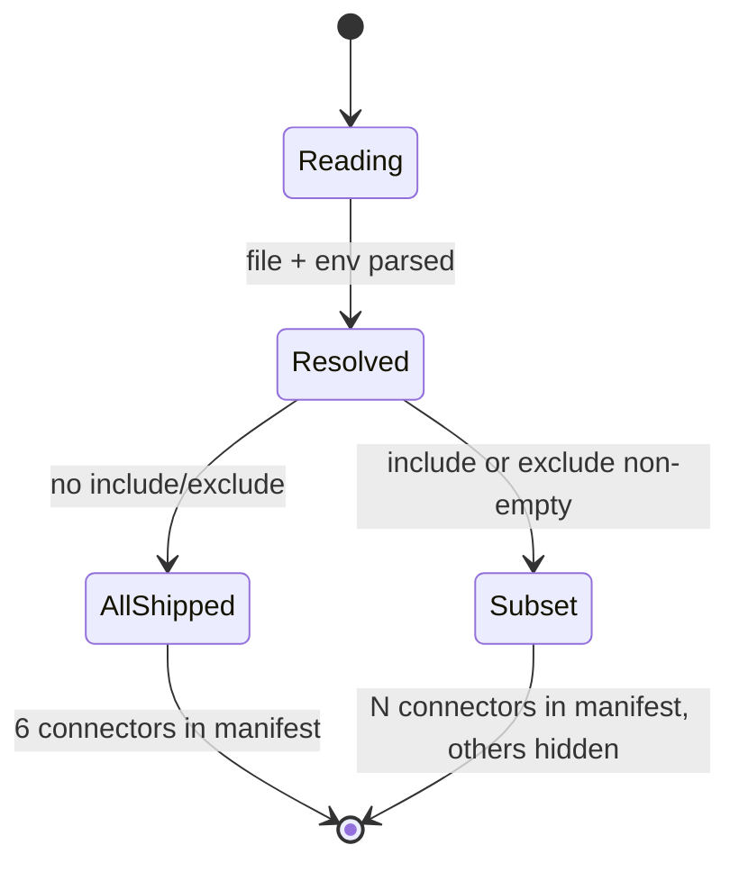

# Connector Build-Time Configuration Model

Source of truth for selecting which platform connectors are shipped in a given
production build of the extension. Lets an operator exclude broken or
unwanted connectors (e.g. Malt, Collective) at **package build time** so the
produced ZIP never advertises, requests permissions for, or runs them.

This is a **build-time** decision, distinct from the existing **runtime**
`AppSettings.enabledConnectors` (which lets the end-user toggle connectors on
or off inside an already-built package). Build-time wins: a connector absent
from the build cannot be re-enabled at runtime.

The LLM never decides a transition. Build-time inclusion is resolved by a
pure function from deterministic inputs (config file + env var) before Vite
runs. **Le LLM produit des signaux ; le modèle décide.**

## Why a model

The connector catalog is consumed in four independent places that must stay
in sync when a connector is removed:

1. `manifest.json` `host_permissions` — Chrome refuses cookies/fetch to
   non-permitted hosts; conversely, shipping unused host permissions is a
   privacy/store-review red flag.
2. `getConnectorsMeta()` (`src/lib/shell/connectors/meta.ts`) — drives the UI
   catalog (FilterBar, ConnectorStatusList, CV sync targets).
3. `CONNECTOR_REGISTRY` (`src/lib/shell/connectors/index.ts`) — drives the
   scanner and session detection.
4. `DEFAULT_SETTINGS.enabledConnectors`
   (`src/lib/shell/storage/chrome-storage.ts`) — the runtime default; if it
   references a built-out connector, the scanner reports phantom errors.

Doing the filtering ad-hoc in each consumer risks drift. This model defines
one resolution function whose output is the single source of truth consumed
by all four.

## Inputs

| Input                        | Source                                  | Precedence                |
| ---------------------------- | --------------------------------------- | ------------------------- |
| Catalog                      | `meta.ts` `ALL_CONNECTOR_IDS`           | ground truth of known IDs |
| Config file                  | `apps/extension/connectors.config.json` | default                   |
| `CONNECTORS_INCLUDE` env var | build env                               | highest (wins over file)  |
| `CONNECTORS_EXCLUDE` env var | build env                               | highest (wins over file)  |

`connectors.config.json` shape (mutually exclusive fields):

```json
{ "exclude": ["malt", "collective"] }
```

or

```json
{ "include": ["free-work", "lehibou", "hiway", "cherry-pick"] }
```

Env vars are comma-separated connector IDs, e.g.
`CONNECTORS_EXCLUDE=malt,collective`.

## Resolution function (pure)

Lives in `apps/extension/scripts/resolve-connectors.ts` so it can run in
`vite.config.ts`, `verify-manifest.ts`, and `build-extension.sh`. It is part
of the extension's TypeScript program (`scripts/**/*.ts` is in `tsconfig.json`)
and is imported directly by the build tooling.

```
resolveIncludedConnectors({ allIds, config, env }) → {
  included: ConnectorId[],     // ordered as in allIds
  excluded: ConnectorId[],     // known IDs that were removed
  warnings: string[],          // unknown IDs in include/exclude lists
  source: 'include-env' | 'exclude-env' | 'include-file' | 'exclude-file' | 'all'
}
```

### Algorithm

1. `includeEnv` = parse `CONNECTORS_INCLUDE` env (non-empty → set).
2. `excludeEnv` = parse `CONNECTORS_EXCLUDE` env.
3. `includeFile` / `excludeFile` = same from config JSON.
4. **Include wins over exclude.** If any include source is non-empty:
   - `candidate = includeEnv ?? includeFile` (env wins).
5. Else if any exclude source is non-empty:
   - `candidate = allIds \ (excludeEnv ?? excludeFile)`.
6. Else `candidate = allIds`.
7. Intersect `candidate` with `allIds`. Any ID not in `allIds` → `warnings`.
8. Preserve `allIds` ordering in `included`.

### Invariants

- `included ∪ excluded === allIds` (set equality).
- `included ∩ excluded === ∅`.
- `warnings` is empty iff every input ID is a known connector ID.
- Output is deterministic given `(allIds, config, env)`. No `Date.now()`, no
  `Math.random()`, no I/O. The resolver is a pure function (FC&IS core); the
  only side-effect — reading the JSON file — happens in its thin caller.

## Wiring (build-time, imperative shell)

### `vite.config.ts`

Loads `resolveIncludedConnectors()` once at config-eval time and:

1. **Manifest filter** — rewrites `manifest.host_permissions` to keep only
   patterns owned by an `included` connector. Ownership is declared in
   `meta.ts` (`ConnectorMeta.hostPermissions: string[]`). Patterns not owned
   by any connector (e.g. the Supabase host) are always kept.
2. **Compile-time define** — exposes the resolved list as
   `__PULSE_INCLUDED_CONNECTORS__` (string array literal) for runtime code.

### Runtime consumption

A thin accessor module `src/lib/shell/connectors/build-config.ts`:

```ts
declare const __PULSE_INCLUDED_CONNECTORS__: ConnectorId[] | undefined;
const FALLBACK: ConnectorId[] = ALL_CONNECTOR_IDS; // dev + test default
export const INCLUDED_CONNECTOR_IDS: ConnectorId[] =
  typeof __PULSE_INCLUDED_CONNECTORS__ === 'undefined' ? FALLBACK : __PULSE_INCLUDED_CONNECTORS__;
```

`typeof` on the bare identifier is safe (does not throw on undefined
globals) so vitest — which does not apply the `define` — falls back to the
full catalog instead of throwing.

Consumers filter against `INCLUDED_CONNECTOR_IDS`:

- `meta.ts` `getConnectorsMeta()` → returns only included connectors.
- `index.ts` `getConnectorIds()` → only included; `getConnector(id)` returns
  `null` for excluded IDs (so the scanner reports "Connecteur introuvable"
  rather than crashing).
- `chrome-storage.ts` `DEFAULT_SETTINGS.enabledConnectors` → intersect with
  `INCLUDED_CONNECTOR_IDS`.

### Code stripping

Static imports are kept (the service worker cannot use dynamic `import()`).
Excluded connector classes remain bundled but are never instantiated —
acceptable for an MV3 extension. Runtime behavior and manifest permissions
are the correctness guarantees; tree-shaking is best-effort only.

## States (build resolution)



There is no "error" state: unknown IDs become warnings, the build proceeds
with the known subset. Empty `included` is permitted (builds a no-scan
shell) but logs a warning.

## Permissions model (least-privilege)

For each `included` connector, **every** entry in its `hostPermissions` array
must appear in the shipped `manifest.host_permissions`. For each `excluded`
connector, **none** of its entries may appear. `verify-manifest.ts` enforces
this against the resolver output instead of a hardcoded list.

## Test plan (Verify)

Pure resolver (`resolve-connectors.test.ts`):

- Empty config + no env → all IDs, `source: 'all'`.
- `exclude` file only → subset.
- `CONNECTORS_EXCLUDE` env overrides file exclude.
- `include` file only → that subset only.
- `CONNECTORS_INCLUDE` env overrides file include.
- `include` beats `exclude` when both present (file include + env exclude →
  include wins, env only filters within include? — no: include source wins
  outright; documented + tested).
- Unknown IDs → collected in `warnings`, ignored from result.
- Ordering follows `allIds`.
- Invariants hold for every case.

Wiring (`meta` / `build-config`):

- `getConnectorsMeta()` filters by `INCLUDED_CONNECTOR_IDS`.
- `DEFAULT_SETTINGS.enabledConnectors` is a subset of
  `INCLUDED_CONNECTOR_IDS`.
- `getConnector('malt')` returns `null` when malt is excluded.

Manifest coverage (`verify-manifest.test.ts`):

- Connector `host_permissions` check now iterates the **resolved** included
  set, not the full catalog — so excluding `malt` no longer fails the Malt
  host_permission assertion.
- Supabase / non-connector patterns are always retained.

## OpenSpec change

This change is recorded in `openspec/changes/connector-build-time-config/`
(proposal) following the project's spec-driven workflow.
