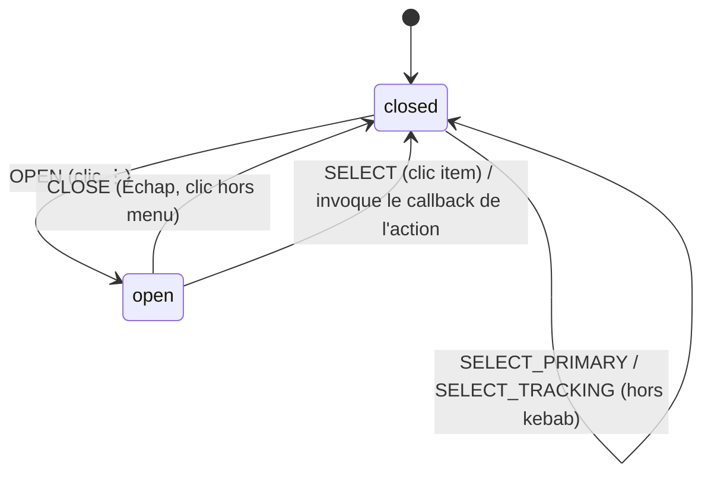

# Drawer Footer Actions — Model

> Source de vérité pour la hiérarchie d'actions du footer du
> `MissionInvestigationDrawer`. Proposition Mobbin Peerlist : une action
> primaire unique + menu kebab pour les actions secondaires.

## Contexte

Le footer du drawer empile aujourd'hui 4 boutons équivalents dans une grille
2×2 (« Suivi », « Ouvrir pour postuler », « Comparer », « Masquer »). Toutes
les actions ont le même poids visuel alors que leur fréquence d'usage diffère
radicalement. Les drawers de référence (Peerlist) hiérarchisent : une action
primaire pleine largeur, et les actions rares dans un menu kebab `⋮`.

## Hiérarchie des actions

| Rang       | Action                            | Rendu                        | Fréquence    |
| ---------- | --------------------------------- | ---------------------------- | ------------ |
| Primaire   | Ouvrir la mission                 | `Button variant="primary"`   | Systématique |
| Secondaire | Suivi (changer de statut)         | `Button variant="secondary"` | Fréquente    |
| Kebab      | Comparer / Masquer (ou Restaurer) | menu `⋮`, 2 items            | Rare         |

## Machine à états du kebab (disclosure locale au drawer)

- États : `closed | open` — état UI **local au composant**, jamais persisté, jamais
  envoyé sur le bridge.
- `SELECT` invoque exactement les callbacks props existants (`onToggleCompare`,
  `onHide`) : le kebab est une **réorganisation de présentation**, pas un nouveau
  workflow. Aucune nouvelle transition métier n'est introduite.
- Focus : à l'ouverture, focus sur le premier item ; `Échap` restitue le focus au
  bouton kebab ; le menu se ferme à la fermeture du drawer (montage/démontage).

## Invariants

1. Le nombre d'actions visibles sans interaction passe de 4 à 2 + kebab.
2. Aucune action n'est supprimée : Comparer et Masquer/Restaurer restent
   accessibles en 1 clic + 1 clic.
3. Les callbacks existants ne changent pas de signature ; le drawer reste
   piloté par les mêmes props.
4. Le menu kebab ne propose jamais d'action qui déciderait d'un statut métier
   non couvert par `VALID_TRANSITIONS` (le suivi reste l'action dédiée).
