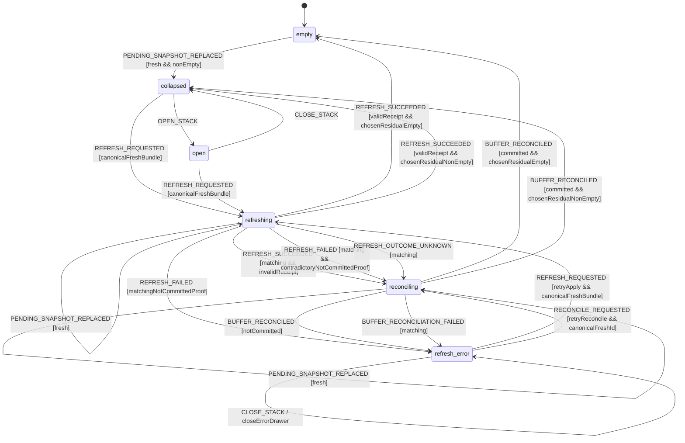
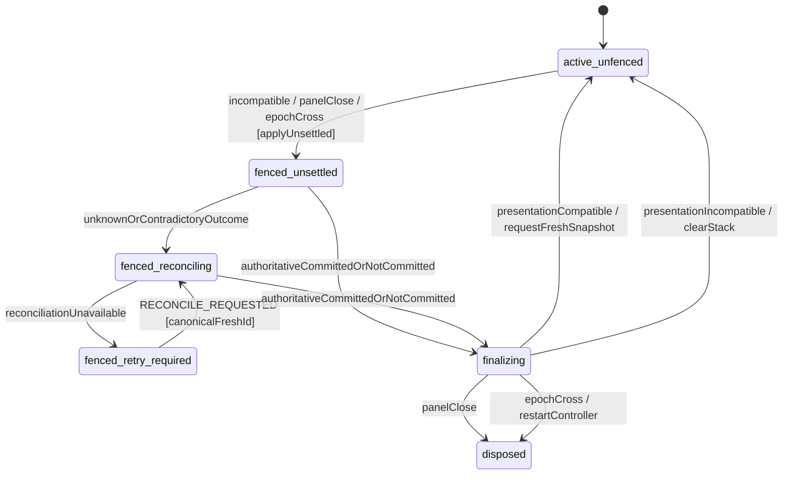

# Mission Arrival Queue and Feed Presentation Model

Source of truth for three coupled Feed concerns:

1. the mutually exclusive loading, empty, error and loaded actions;
2. stable reading of the **Nouvelles** queue while missions become seen; and
3. revisioned scan arrivals that never replace the list being read without an
   explicit, correlated refresh.

The scan lifecycle produces committed signals. This model decides how the Feed
may present them. No component, free text or LLM decides a transition.

## Composition and scope

This model composes with:

- `scan-lifecycle.model.md`, which owns scan acceptance, cancellation and
  terminal commit;
- `notification-deep-link.model.md`, whose focus lens remains an independent
  allow-list over the projected missions; and
- the public `FeedState = 'empty' | 'loading' | 'loaded' | 'error'` vocabulary
  from `feed.svelte.ts`.

Search, facets, favorites, comparison, tracking, connector execution, scoring
and persistence remain outside this model.

## Total Feed presentation projection

The Shell supplies facts; a pure Core function returns the only permitted
primary action and whether arrival state is compatible.

```ts
type FeedState = 'empty' | 'loading' | 'loaded' | 'error';
type OwnedActiveScanState = 'starting' | 'scanning' | 'retrying' | 'persisting' | 'cancelling';

interface FeedPresentationFacts {
  feedState: FeedState;
  ownedScan: { operationId: string; state: OwnedActiveScanState } | null;
  networkOnline: boolean;
}

type FeedPresentation =
  | { value: 'loading'; primaryAction: 'cancel'; actionEnabled: boolean; arrivalCompatible: false }
  | { value: 'empty'; primaryAction: 'start'; actionEnabled: boolean; arrivalCompatible: false }
  | { value: 'error'; primaryAction: 'retry'; actionEnabled: boolean; arrivalCompatible: false }
  | { value: 'loaded'; primaryAction: 'start'; actionEnabled: boolean; arrivalCompatible: true }
  | { value: 'inconsistent'; primaryAction: null; actionEnabled: false; arrivalCompatible: false };

declare function deriveFeedPresentation(facts: Readonly<FeedPresentationFacts>): FeedPresentation;
```

| Feed facts                                               | Projection     | Sole primary action                                      |
| -------------------------------------------------------- | -------------- | -------------------------------------------------------- |
| `loading` plus one owned active scan                     | `loading`      | `cancel`; disabled only after state becomes `cancelling` |
| `empty` plus no owned active scan                        | `empty`        | `start`; disabled while offline                          |
| `error` plus no owned active scan                        | `error`        | `retry`; disabled while offline                          |
| `loaded` plus no owned active scan                       | `loaded`       | `start`; disabled while offline                          |
| every other combination, including loading without an ID | `inconsistent` | none; fail closed and hide arrivals                      |

`ownedScan` is the manual operation owned by this Feed controller, not an
unobserved background alarm scan. A terminal operation is removed from this
field only after the controller has projected its terminal Feed state. Thus
`loading` can never expose Start/Retry and Empty/Error can never expose Cancel.

The Shell dispatches `FEED_FACTS_CHANGED` with a monotonically increasing
`presentationRevision`. The reducer derives the projection itself; it never
trusts a caller-supplied action or `arrivalCompatible` flag.

## Complete initial state and revision domain

`-1` is a sentinel held only in controller context. It is not a valid published
revision. The first valid presentation and buffer revisions are `0`.

```ts
const INITIAL_ARRIVAL_QUEUE_STATE: ArrivalQueueState = {
  lifecycle: 'active',
  identityNonce: injectedControllerNonce,
  operationOrdinalHighWatermark: 0,
  reconciliationOrdinalHighWatermark: 0,
  consumedRefreshIds: [],
  consumedApplyCommandIds: [],
  consumedReconciliationIds: [],
  presentationRevision: -1,
  presentation: {
    value: 'inconsistent',
    primaryAction: null,
    actionEnabled: false,
    arrivalCompatible: false,
  },
  bufferEpoch: null,
  lastBufferRevision: -1,
  queue: { value: 'all-feed' },
  stack: { value: 'empty' },
  settlementFence: null,
  controllerFailure: null,
  settledApplyKeys: [],
};
```

Consequently, `FEED_FACTS_CHANGED(0, ...)` and
`PENDING_SNAPSHOT_REPLACED(revision=0)` are accepted at bootstrap. A revision
is fresh exactly when it is a safe non-negative integer strictly greater than
the corresponding stored revision. A pending snapshot is the buffer authority's
complete unconsumed buffer at one revision; an empty snapshot is an explicit
clear.

`identityNonce` is a fresh lowercase canonical UUID injected once per controller
instance. Refresh and reconciliation identities are canonical strings:

```text
refreshId       = identityNonce + ":refresh:" + decimal(operationOrdinal)
applyCommandId  = identityNonce + ":apply:" + decimal(operationOrdinal)
reconciliationId = identityNonce + ":reconcile:" + decimal(reconciliationOrdinal)
```

Both ordinals are safe positive integers. `REFRESH_REQUESTED` is accepted only
when its two canonical operation IDs match the injected nonce and
`operationOrdinal === operationOrdinalHighWatermark + 1`. Its canonical
contingency reconciliation ID must simultaneously match
`reconciliationOrdinalHighWatermark + 1`. Core atomically advances both high
waters and appends all three IDs to their ledgers before `apply-pending` is
emitted. A reconciliation retry likewise validates, advances and appends the
next canonical reconciliation identity before its command is emitted. Thus a
Shell-generated string alone is never freshness authority.

The controller retains non-evicting ledgers for at most 256 refresh IDs, 256
apply-command IDs and 256 reconciliation IDs. Capacity exhaustion is a typed
`IDENTITY_CAPACITY_EXHAUSTED` transition to `lifecycle='failed'`: it emits no
command, preserves any unresolved causal context for diagnosis and never wraps
or delegates freshness to the Shell. A failed controller cannot be silently
remounted with a new nonce while a journal key is unresolved.
High-water marks and consumed identities survive every success, failure,
not-committed settlement, unused contingency and retry. A late callback can
therefore never bind after an identity would otherwise be forgotten. A new
buffer epoch receives a new controller nonce only after the prior controller
has reached an authoritative settlement or authenticated epoch boundary.

## Revisioned state and durable apply proof

```ts
interface PendingSnapshot {
  version: 1;
  bufferEpoch: string;
  snapshotId: string;
  revision: number;
  orderedIds: readonly string[];
}

interface ApplyCommitReceipt {
  version: 1;
  refreshId: string;
  appliedSnapshotId: string;
  applyCommandId: string;
  commitId: string;
  bufferEpoch: string;
  commitRevision: number;
  committedResidual: PendingSnapshot;
  orderedAllFeedIds: readonly string[];
  orderedUnseenIds: readonly string[];
}

interface ApplyNotCommittedReceipt {
  version: 1;
  refreshId: string;
  appliedSnapshotId: string;
  applyCommandId: string;
  disposition: 'not_committed';
  authoritativeSnapshot: PendingSnapshot;
}

type ReconciliationReceipt = {
  version: 1;
  reconciliationId: string;
  refreshId: string;
  appliedSnapshotId: string;
  applyCommandId: string;
  authoritativeSnapshot: PendingSnapshot;
} & (
  | { disposition: 'committed'; commit: ApplyCommitReceipt }
  | { disposition: 'not_committed'; commit: null }
);

type ArrivalRefreshError =
  | { code: 'APPLY_FAILED'; retry: 'apply' }
  | { code: 'APPLY_CANCELLED'; retry: 'apply' }
  | { code: 'BUFFER_PROTOCOL_ERROR'; retry: 'reconcile' }
  | { code: 'PRESENTATION_INVALIDATED'; retry: 'none' };

type ArrivalSettlementFence =
  | {
      reason: 'presentation-incompatible';
      requestedAtPresentationRevision: number;
    }
  | {
      reason: 'panel-closed';
      requestedAtPresentationRevision: number;
    }
  | {
      reason: 'epoch-restart';
      requestedAtPresentationRevision: number;
      nextBufferEpoch: string;
    };

interface ArrivalControllerFailure {
  code: 'IDENTITY_CAPACITY_EXHAUSTED';
  domain: 'refresh' | 'apply-command' | 'reconciliation';
  capacity: 256;
}

interface ArrivalQueueState {
  lifecycle: 'active' | 'disposing' | 'failed' | 'disposed';
  identityNonce: string;
  operationOrdinalHighWatermark: number;
  reconciliationOrdinalHighWatermark: number;
  consumedRefreshIds: readonly string[];
  consumedApplyCommandIds: readonly string[];
  consumedReconciliationIds: readonly string[];
  presentationRevision: number;
  presentation: FeedPresentation;
  bufferEpoch: string | null;
  lastBufferRevision: number;
  queue:
    | { value: 'all-feed' }
    | {
        value: 'stable-queue';
        queueIds: readonly string[];
        dwells: Readonly<Record<string, number>>;
        seenEmissionIds: readonly string[];
      };
  stack:
    | { value: 'empty' }
    | {
        value: 'collapsed' | 'open';
        pending: PendingSnapshot;
        previewIds: readonly string[];
      }
    | {
        value: 'refreshing';
        refreshId: string;
        applyCommandId: string;
        operationOrdinal: number;
        contingencyReconciliationId: string;
        contingencyReconciliationOrdinal: number;
        applied: PendingSnapshot;
        latest: PendingSnapshot;
        previewIds: readonly string[];
      }
    | {
        value: 'reconciling';
        reconciliationId: string;
        reconciliationOrdinal: number;
        refreshId: string;
        applyCommandId: string;
        applied: PendingSnapshot;
        latest: PendingSnapshot;
        disputedCommit: ApplyCommitReceipt | null;
        previewIds: readonly string[];
      }
    | {
        value: 'refresh-error';
        pending: PendingSnapshot;
        previewIds: readonly string[];
        failedRefreshId: string;
        failedApplyCommandId: string;
        error: ArrivalRefreshError;
        drawerOpen: boolean;
        retryContext:
          | { kind: 'apply' }
          | {
              kind: 'reconcile';
              applied: PendingSnapshot;
              latest: PendingSnapshot;
              disputedCommit: ApplyCommitReceipt | null;
            }
          | { kind: 'none' };
      };
  settlementFence: ArrivalSettlementFence | null;
  controllerFailure: ArrivalControllerFailure | null;
  settledApplyKeys: readonly string[];
}
```

The buffer authority allocates revisions and the apply journal atomically. The
linearization point of a successful refresh is the durable journal commit named
by `(applyCommandId, commitId, commitRevision)`, never arrival order in the
actor mailbox. A valid receipt proves all of the following:

1. all correlation fields match the active refresh and frozen snapshot;
2. `commitRevision` is a safe integer greater than `applied.revision` in the
   same `bufferEpoch`;
3. `committedResidual.revision === commitRevision`, and its epoch and snapshot
   ID match the journal receipt;
4. no ID from `applied.orderedIds` occurs in `committedResidual.orderedIds`; and
5. `orderedAllFeedIds` and `orderedUnseenIds` are each unique, the unseen list
   is an ordered subset of the all-Feed membership, and both were read in the
   same commit.

A reconciliation receipt is valid only when every common correlation matches
the command. `disposition='committed'` requires a non-null valid commit. A
same-epoch authoritative snapshot must be at or after its commit revision; an
authenticated crossed-epoch snapshot is an epoch boundary and is never selected
as old-controller pending state.
`disposition='not_committed'` requires `commit=null` and an authoritative
snapshot read in the same journal transaction that proved absence of the apply
key. Its authoritative snapshot is subject to the same monotone rule as an
initial negative proof: in the applied epoch its safe revision is at least
`applied.revision`; equality requires exact snapshot ID and ordered-ID
equality with `applied`; and comparison with `latest` chooses only the greater
same-epoch snapshot, with exact equality required at the same revision. A
lower or equal-revision-divergent snapshot is an invalid proof and never
settles the apply. A crossed epoch is not selected as pending: the
authenticated journal transaction proves the old apply absent at the epoch
boundary, and the controller disposes and restarts on that new epoch. Structural
unions alone are not treated as authority; the buffer/journal adapter
capability authenticates both receipts and the epoch boundary.

`ApplyNotCommittedReceipt` is the equivalent authenticated journal observation
returned in the original apply result. It has no independently trusted outcome
identity: every correlation must match the one active refresh/apply/snapshot
tuple, and the authoritative snapshot is read in the same transaction that
proved the apply key absent. The first matching authoritative reduction removes
that active tuple; an identical replay is therefore stale, while a later
refresh has different canonical operation IDs. No outcome-ID allocator, replay
ledger or hidden capacity claim exists. That snapshot has the same epoch and a
safe revision at least equal to `applied.revision`; a lower, crossed or
same-revision-divergent snapshot is not a negative proof.

The Shell cannot manufacture this proof. The journal has a unique key
`(applyCommandId, appliedSnapshotId)` and an apply command is idempotent on that
key. `settledApplyKeys` retains the 256 most recent keys as a bounded audit
ledger; replay is also rejected by the durable journal key, so eviction from
the in-memory audit ledger can never
authorize a second apply.

## Events

```ts
type ArrivalQueueEvent =
  | { type: 'FEED_FACTS_CHANGED'; presentationRevision: number; facts: FeedPresentationFacts }
  | { type: 'ENTER_NEW_QUEUE'; orderedUnseenIds: readonly string[] }
  | { type: 'EXIT_NEW_QUEUE' }
  | { type: 'SORT_QUEUE'; orderedQueueIds: readonly string[] }
  | { type: 'DWELL_STARTED'; missionId: string; now: number }
  | { type: 'DWELL_CANCELLED'; missionId: string }
  | { type: 'DWELL_ELAPSED'; missionId: string; now: number }
  | { type: 'PENDING_SNAPSHOT_REPLACED'; snapshot: PendingSnapshot }
  | { type: 'OPEN_STACK' }
  | { type: 'CLOSE_STACK' }
  | {
      type: 'REFRESH_REQUESTED';
      operationOrdinal: number;
      refreshId: string;
      applyCommandId: string;
      contingencyReconciliationOrdinal: number;
      contingencyReconciliationId: string;
    }
  | { type: 'REFRESH_SUCCEEDED'; receipt: ApplyCommitReceipt }
  | {
      type: 'REFRESH_FAILED';
      refreshId: string;
      appliedSnapshotId: string;
      applyCommandId: string;
      proof: ApplyNotCommittedReceipt;
      error: Extract<ArrivalRefreshError, { code: 'APPLY_FAILED' | 'APPLY_CANCELLED' }>;
    }
  | {
      type: 'REFRESH_OUTCOME_UNKNOWN';
      refreshId: string;
      appliedSnapshotId: string;
      applyCommandId: string;
      reason: 'RESULT_MALFORMED' | 'JOURNAL_UNAVAILABLE' | 'TIMEOUT';
    }
  | {
      type: 'RECONCILE_REQUESTED';
      reconciliationOrdinal: number;
      reconciliationId: string;
    }
  | { type: 'BUFFER_RECONCILED'; receipt: ReconciliationReceipt }
  | {
      type: 'BUFFER_RECONCILIATION_FAILED';
      reconciliationId: string;
      refreshId: string;
      appliedSnapshotId: string;
      applyCommandId: string;
      reason: 'JOURNAL_UNAVAILABLE' | 'INVALID_PROOF' | 'TIMEOUT';
    }
  | { type: 'PANEL_CLOSED' };
```

The raw boundary converts a structurally malformed matching apply result into
`REFRESH_OUTCOME_UNKNOWN(reason='RESULT_MALFORMED')`; a structurally valid but
semantically contradictory success remains `REFRESH_SUCCEEDED` and enters
reconciliation with its disputed receipt. A malformed or semantically invalid
matching reconciliation result becomes
`BUFFER_RECONCILIATION_FAILED(reason='INVALID_PROOF')`; neither may be silently
dropped while the actor waits. A reconciliation supervisor converts a missing
result into the correlated `TIMEOUT` event. Correlation mismatches are stale
no-ops. There is deliberately no `SCAN_CANCELLED` event: the scan model already
proves that a cancelled operation publishes no arrival item.

`REFRESH_FAILED` is accepted only with its matching durable `not_committed`
receipt. A network error, timeout or malformed result that cannot prove that
negative fact normalizes to `REFRESH_OUTCOME_UNKNOWN` and enters reconciliation;
it never authorizes an apply retry.

Every accepted refresh already owns the canonical contingency reconciliation
identity stored in its `refreshing` state. A valid monotone negative proof
leaves that identity unused but consumed. A structurally valid matching proof
whose authoritative snapshot is crossed, lower, or divergent at the same
revision enters reconciliation with that exact stored identity and
`disputedCommit=null`; it cannot remain refreshing, accept a result-supplied
identity or invent an apply-retry authorization.

For a valid negative proof, Core chooses pending state monotonically between
the authenticated snapshot and `latest`: the greater same-epoch revision wins;
equal revisions require exact snapshot ID and ordered-ID equality. A
contradiction enters reconciliation. Thus a not-committed result delivered
after a newer buffer publication cannot roll back or lose those arrivals.

## Presentation and ordinary stack transitions

| From / condition                                     | Event / guard                                     | Result and effects                                                                                                                                                                             |
| ---------------------------------------------------- | ------------------------------------------------- | ---------------------------------------------------------------------------------------------------------------------------------------------------------------------------------------------- |
| active                                               | fresh `FEED_FACTS_CHANGED`                        | derive and store presentation                                                                                                                                                                  |
| loaded-compatible, no unsettled apply                | fresh incompatible presentation                   | clear stack immediately                                                                                                                                                                        |
| `refreshing` / `reconciling` / reconcile retry error | fresh incompatible presentation                   | retain all causal context, set `settlementFence='presentation-incompatible'`, hide arrivals, and issue only an advisory cancel for a currently running command                                 |
| fenced presentation becomes loaded-compatible        | fresh `FEED_FACTS_CHANGED`                        | store the projection but keep the fence and hidden stack until authoritative settlement                                                                                                        |
| incompatible -> loaded-compatible, no fence          | fresh `FEED_FACTS_CHANGED`                        | keep stack empty; request one authoritative snapshot strictly after `lastBufferRevision`                                                                                                       |
| no buffer epoch yet                                  | first valid pending snapshot                      | bind `bufferEpoch`, accept revision including `0`, and reduce the snapshot through the rows below                                                                                              |
| bound epoch, no unsettled apply                      | snapshot from a different epoch                   | dispose and emit `restart-arrival-controller`; the fresh actor accepts that epoch from `-1`                                                                                                    |
| bound epoch with unsettled apply                     | snapshot from a different epoch                   | retain correlation, set `lifecycle='disposing'` and an `epoch-restart` fence naming the new epoch; settle the old journal key before restart                                                   |
| incompatible presentation, no unsettled apply        | fresh same-epoch pending snapshot                 | advance `lastBufferRevision`; do not retain a hidden snapshot                                                                                                                                  |
| loaded + `empty`                                     | fresh non-empty pending snapshot                  | `collapsed`; store canonical pending with empty previews                                                                                                                                       |
| loaded + `collapsed`                                 | fresh non-empty pending snapshot                  | remain `collapsed`; replace canonical pending and clear previews                                                                                                                               |
| loaded + `open`                                      | fresh non-empty pending snapshot                  | remain `open`; replace canonical pending while preserving frozen previews                                                                                                                      |
| loaded + `refresh-error`, no settlement fence        | fresh pending snapshot, including empty           | replace pending; for reconcile retry also replace only `retryContext.latest`; preserve applied/dispute/error/drawer state                                                                      |
| fenced `refresh-error` with reconcile retry context  | fresh same-epoch pending snapshot                 | advance revision and replace only `retryContext.latest`; preserve the unresolved key and fence                                                                                                 |
| loaded + `empty`/`collapsed`/`open`                  | fresh empty pending snapshot                      | `empty`; clear previews                                                                                                                                                                        |
| `refreshing` / `reconciling`, fenced or unfenced     | fresh same-epoch pending snapshot                 | advance revision and replace `latest` only; preserve applied, identities, dispute and frozen previews                                                                                          |
| `collapsed`                                          | `OPEN_STACK`                                      | `open`; freeze first three pending IDs and focus drawer heading                                                                                                                                |
| `open`                                               | `CLOSE_STACK`                                     | `collapsed`; retain pending, clear previews and restore trigger focus                                                                                                                          |
| `refresh-error`, unfenced                            | `OPEN_STACK` / `CLOSE_STACK`                      | remain `refresh-error`; toggle only `drawerOpen`, preserving error and retry context                                                                                                           |
| non-refreshing state with non-empty pending          | canonical fresh `REFRESH_REQUESTED` bundle        | only normal pending or `retryContext.kind='apply'`; reserve operation and contingency identities, freeze applied/latest and emit exactly one apply                                             |
| `refresh-error` with reconcile retry context         | canonical fresh `RECONCILE_REQUESTED`             | reserve the next reconciliation identity, restore original applied/latest/dispute and observe the same journal key; never emit apply                                                           |
| any state with no unsettled apply                    | `PANEL_CLOSED`                                    | dispose immediately                                                                                                                                                                            |
| any state with an unsettled apply                    | `PANEL_CLOSED`                                    | set `lifecycle='disposing'`, retain causal context, replace any weaker fence with `panel-closed`, hide UI and cancel only as an advisory; disposal waits for committed/not-committed authority |
| any                                                  | stale/duplicate revision, identity or correlation | no-op; a matching result remains reducible while its settlement obligation is retained                                                                                                         |

Every accepted pending snapshot updates `lastBufferRevision`. The displayed
count is always the current canonical snapshot's `orderedIds.length`; no second
`pendingMissionCount` exists.

An **unsettled apply** is represented by `refreshing`, `reconciling`, or
`refresh-error` with `retryContext.kind='reconcile'`. Only an authoritative
committed/not-committed result removes that classification. A timeout,
transport cancellation or failed journal observation does not.

`request-pending-buffer(afterRevision)` is a revision-allocating read: the
buffer authority must answer once with a snapshot whose revision is strictly
greater than `afterRevision`, even when ordered IDs are unchanged.

`cancel-apply` and `cancel-reconciliation` are transport hints, never outcome
receipts. A settlement fence therefore preserves the exact journal key and
latest snapshot until either a valid commit or an authenticated
`not_committed` observation arrives. On committed settlement, the Queue region
is projected exactly once even when the stack is hidden or the panel is
disposing. The fence is then completed atomically: `panel-closed` becomes
terminal; `epoch-restart` becomes terminal and emits one restart; and
`presentation-incompatible` clears the stack, then requests a snapshot after
`lastBufferRevision` only if the latest presentation is loaded-compatible.
There is no intermediate reactivation and no committed Queue projection can be
lost because a cancel raced its result.

## Queue transitions and cross-region effects

| From           | Event                    | Guard/effect                                                                                                |
| -------------- | ------------------------ | ----------------------------------------------------------------------------------------------------------- |
| `all-feed`     | `ENTER_NEW_QUEUE(ids)`   | capture unique unseen membership, empty dwell/emission sets and preserve scroll                             |
| `stable-queue` | `SORT_QUEUE(ids)`        | accept only an exact permutation of current membership                                                      |
| `stable-queue` | `DWELL_STARTED(id, now)` | require membership and no prior seen emission; record the injected finite start                             |
| `stable-queue` | `DWELL_CANCELLED(id)`    | remove only that dwell                                                                                      |
| `stable-queue` | `DWELL_ELAPSED(id, now)` | require its matching start and 1500 ms continuous visibility; emit `mark-seen(id)` once and keep membership |
| `stable-queue` | `EXIT_NEW_QUEUE`         | clear stable membership/dwells/emissions and transition to `all-feed`                                       |
| `all-feed`     | committed apply          | remain `all-feed`; emit `project-all-feed-commit(receipt.orderedAllFeedIds)`                                |
| `stable-queue` | committed apply          | remain `stable-queue`; replace `queueIds` with `receipt.orderedUnseenIds`; clear dwell/emission sets        |

A committed settlement executes exactly one of the last two rows based on the
Queue region value captured at reduction time. The Stack region never writes
Queue state directly. The shared Core action emits either
`project-all-feed-commit` or `project-stable-new-commit`, never both. Thus a
success from `all-feed` cannot accidentally create a Nouvelles queue, while a
success from `stable-queue` deterministically rebuilds that queue.

`all-feed` is deliberately a mode marker: the existing Feed catalogue owns its
full membership. The commit receipt supplies the exact replacement IDs to the
single `project-all-feed-commit` effect. There is no implicit Stack-to-Queue
transition or second membership calculation.

`SORT_QUEUE` is the only event that may reorder an active stable queue. It may
neither add nor remove an ID. Search/facets project captured membership without
mutating it. `seenEmissionIds` is a subset of `queueIds`.

## Stack statechart and refresh linearization



The causal lifecycle is orthogonal to the Stack value:



`fenced_retry_required` is represented by `refresh-error` with
`retryContext.kind='reconcile'` plus a non-null settlement fence. It is not a
user-visible error. The supervisor must schedule the next canonical
`RECONCILE_REQUESTED`; neither disposal nor presentation reactivation may pass
that state without an authoritative result.

On an accepted `REFRESH_REQUESTED`, Core first reserves the validated operation
and contingency identities, freezes `applied`, copies it to `latest`, and emits
one `apply-pending` command with the fresh idempotency key. Fresh buffer signals
may replace only `latest`.

For a valid success receipt, Core chooses the authoritative residual by revision:

| Mailbox order at receipt reduction                          | Chosen residual and result                                                                                 |
| ----------------------------------------------------------- | ---------------------------------------------------------------------------------------------------------- |
| `latest.revision < commitRevision`                          | use `committedResidual`; advance `lastBufferRevision` to `commitRevision`                                  |
| `latest.revision === commitRevision`                        | require exact snapshot/epoch/IDs equality, then use that snapshot                                          |
| `latest.revision > commitRevision` in the same buffer epoch | use `latest`, which is causally post-commit; require applied IDs absent                                    |
| matching receipt with epoch/revision/residual contradiction | enter `reconciling`; emit one correlated journal observation; perform no Queue or pending partial mutation |
| non-matching refresh, apply or snapshot correlation         | stale no-op; it cannot settle or disturb the active refresh                                                |

This table accepts all legal orders:

- post-commit `S11` before the success receipt: equality settles on `S11`;
- the receipt before `S11`: the receipt settles on its embedded `S11`, and the
  later duplicate buffer signal is ignored by revision;
- post-commit `S12` between commit `S11` and its receipt: `S12` is chosen and
  survives as pending; and
- `S12` after the receipt: the receipt settles on `S11`, then the fresh normal
  buffer transition replaces it with `S12`.

There is no subtraction of `applied` from an arbitrary mailbox snapshot. The
buffer authority's commit receipt and monotone epoch are the only post-commit
proof. Queue membership always comes from the commit receipt, whereas arrivals
after that commit remain in the chosen pending residual.

## Total `BUFFER_PROTOCOL_ERROR` reconciliation

Entering `reconciling` preserves `applied`, `latest`, previews and the disputed
receipt. It does not emit `apply-pending`. The accepted refresh bundle has
already consumed and stored a contingency reconciliation identity; a valid
success leaves it unused, while a matching invalid, unknown or contradictory
outcome emits exactly one `reconcile-pending-buffer` command with that exact
identity. The command reads the durable journal by
`(applyCommandId, appliedSnapshotId)` and returns one typed result.

`REFRESH_OUTCOME_UNKNOWN` follows the same entry action with
`disputedCommit=null` and the stored contingency identity.
`REFRESH_FAILED` with a matching but contradictory negative proof follows that
same entry action; it never accepts a replacement identity or emits
`apply-pending`.

| Matching result                                           | Settlement                                                                                                                                                                                                 |
| --------------------------------------------------------- | ---------------------------------------------------------------------------------------------------------------------------------------------------------------------------------------------------------- |
| valid same-epoch `committed` receipt                      | choose a proven residual by the success revision table; update the proper Queue region once; record the settled key; then either complete the fence or exit to empty/collapsed                             |
| authenticated crossed-epoch `committed` receipt           | validate and project the old commit into exactly one Queue branch, record the settled key, select no crossed pending snapshot, dispose and emit exactly one restart for the new epoch                      |
| valid same-epoch `not_committed` receipt                  | require the same applied/latest monotone constraints as the initial negative path; choose the greater exact snapshot; then either complete the fence or exit to `refresh-error(APPLY_FAILED, retry=apply)` |
| authenticated crossed-epoch `not_committed` receipt       | treat the journal absence plus epoch boundary as terminal authority for the old key; select no crossed snapshot as pending; dispose and emit exactly one restart for the new epoch                         |
| lower or equal-revision-divergent `not_committed` receipt | do not settle or authorize apply retry; retain causal context as `BUFFER_PROTOCOL_ERROR(retry=reconcile)` and require a fresh reconciliation identity                                                      |
| unavailable, timeout or malformed proof                   | retain applied/latest/dispute as `BUFFER_PROTOCOL_ERROR(retry=reconcile)`; if fenced, schedule the supervisor retry and forbid disposal/reactivation, otherwise expose the explicit retry state            |

An authoritative matching result exits the in-flight reconciliation. A
non-authoritative failure stores the original `applied`, `latest` and disputed
commit in `retryContext`; it ends only that read attempt, not the unresolved
apply obligation. A further `RECONCILE_REQUESTED` is allowed only from a
`retry='reconcile'` error and uses the next validated canonical reconciliation
identity. It restores that context, observes the same journal key and never
resends the apply. An apply retry is allowed only after a proven
`not_committed` outcome and must reserve a new refresh/apply/contingency bundle.
Therefore no protocol error, fence or retry path can double-apply committed
IDs.

A lower or same-revision-divergent negative reconciliation receipt is total as
an invalid proof: it deterministically enters the retry-reconciliation state,
never the apply-retry state. A crossed-epoch negative is total as an
authenticated boundary: it disposes/restarts, never projects the crossed
snapshot into the old actor. These rules prevent both rollback and false
settlement.

## Effects and rendering projections

Core effects are explicit data:

```ts
type ArrivalQueueEffect =
  | { type: 'mark-seen'; missionId: string }
  | { type: 'request-pending-buffer'; afterRevision: number }
  | { type: 'apply-pending'; refreshId: string; applyCommandId: string; snapshot: PendingSnapshot }
  | { type: 'cancel-apply'; refreshId: string; applyCommandId: string; snapshotId: string }
  | {
      type: 'reconcile-pending-buffer';
      reconciliationId: string;
      refreshId: string;
      applyCommandId: string;
      appliedSnapshotId: string;
    }
  | { type: 'schedule-reconciliation-retry'; applyCommandId: string; appliedSnapshotId: string }
  | { type: 'cancel-reconciliation'; reconciliationId: string }
  | { type: 'restart-arrival-controller'; nextBufferEpoch: string }
  | { type: 'report-controller-failure'; failure: ArrivalControllerFailure }
  | { type: 'project-all-feed-commit'; orderedIds: readonly string[] }
  | { type: 'project-stable-new-commit'; orderedIds: readonly string[] }
  | { type: 'focus-drawer-heading' }
  | { type: 'focus-stack-trigger' }
  | { type: 'scroll-feed-start' };
```

The arrival UI renders only when lifecycle is active, `settlementFence` is
null, presentation is the exact loaded-compatible projection, stack is not
empty, and the canonical pending or latest snapshot is non-empty. During
`reconciling`, previews remain frozen and refresh controls remain disabled.
Count and preview IDs come only from Core.
`OPEN_STACK` derives `pending.orderedIds.slice(0, 3)`; missing catalogue objects
render an unavailable preview and request reconciliation without changing count.

## UX, motion and accessibility contract

- A seen write changes **Nouveau** to **Vu** but does not remove or reposition a
  card in the current stable queue.
- Re-entering Nouvelles captures a fresh unseen snapshot.
- The stack is anchored to the lower Feed edge, reserves space for the last
  mission actions and has a target at least 44 px high.
- Visual depth and drawer previews are capped at three; count remains exact.
- The drawer is non-modal: `aria-modal` is absent/false, there is no backdrop or
  focus trap, and it never registers with `modal-focus.model.md`.
- Escape closes only the open/error drawer. Refresh and reconciliation are not
  interruptible from the drawer UI.
- Count updates announce one throttled polite summary per committed snapshot,
  not per mission.
- Stack crossfade is at most 160 ms per snapshot; drawer motion is opacity plus
  at most 6 px over 180 ms. Reduced motion is instant.
- Notification focus remains an independent allow-list and mutates no arrival
  state.

## Invariants

1. Loading exposes Cancel only; Empty exposes Start only; Error exposes Retry
   only. An inconsistent fact tuple exposes no primary action.
2. Initial sentinels are explicit; published revision `0` is accepted exactly
   once and all subsequent published revisions are strictly monotone.
3. Every refresh/apply identity is the canonical nonce/operation-ordinal pair;
   every reconciliation identity is the canonical nonce/reconciliation-ordinal
   pair. Core advances each high-water mark exactly once before command
   emission, and consumed identities are never reintroduced.
4. Identity capacity exhaustion fails closed; no result, retry, late callback
   or Shell-provided string may reset a high-water mark or bypass a ledger.
5. Count, ordered IDs and previews have one Core authority.
6. Seen never removes active stable membership.
7. The durable commit, not mailbox order, is the refresh linearization point.
8. A success received before, after or between post-commit buffer publications
   selects the same authoritative state for the same revision history.
9. A committed settlement updates exactly one Queue region branch and records
   its apply key once.
10. `BUFFER_PROTOCOL_ERROR` has a correlated, total reconciliation obligation;
    an unavailable read becomes an explicit retry of the same journal key and
    never resends the apply.
11. Only a valid durable `not_committed` proof authorizes an apply retry.
    Reconciliation negatives obey the same epoch/revision/equality constraints
    as initial negatives.
12. Lower or same-revision-divergent reconciliation negatives never settle;
    crossed-epoch authority disposes/restarts and never becomes old-controller
    pending state.
13. Arrivals after commit remain pending and never enter the commit's refreshed
    queue membership implicitly.
14. A durable negative proof can authorize retry but can never roll pending
    state behind a newer same-epoch snapshot.
15. Cancelled scans cannot clear prior committed arrivals because they emit no
    arrival event.
16. Apply/reconciliation cancellation is advisory. Invalidation, panel close
    and epoch restart retain the exact causal settlement obligation until
    committed or authenticated not-committed authority is reduced.
17. A fenced committed outcome still emits exactly one Queue projection before
    disposal, restart or reactivation; a fenced negative emits none. No
    reactivation or terminal disposal may precede that distinction.
18. Disposed state is terminal for the mounted Feed instance and is reached
    with no unresolved journal key.
19. A mission produces at most one seen-write effect per stable queue capture.
20. No Shell condition, free text or LLM output duplicates these decisions.

For every `refresh-error`, `error.retry` and `retryContext.kind` are equal
(`apply`, `reconcile` or `none`). `drawerOpen` is presentational only and cannot
clear or change that durable settlement requirement.

## Mandatory review matrix

- bootstrap: presentation revision `0`, buffer revision `0`, then duplicate,
  stale, gap and epoch-crossing snapshots;
- all valid FeedState/owned-scan combinations and every inconsistent tuple;
- loading/empty/error clearing a prior stack and loaded not resurrecting it;
- refresh commit `S11` with `S11` delivered before the receipt, after the
  receipt, and `S12` delivered between commit and receipt;
- success from `all-feed` versus `stable-queue`, proving only the corresponding
  Queue projection effect occurs;
- newer snapshot during refresh with overlapping and disjoint IDs;
- receipt mismatch, correlated reconciliation committed/not-committed/failure,
  guaranteed exit and no duplicate `apply-pending`;
- not-committed proof before/after a newer pending snapshot, equal-revision or
  lower-revision contradiction consuming its contingency reconciliation ID,
  identical receipt replay after settlement, and monotone pending selection
  without arrival loss;
- reconciliation `not_committed` at lower, equal-exact,
  equal-revision-divergent, greater same-epoch and crossed-epoch snapshots,
  proving only the valid same-epoch cases authorize apply retry and crossed
  epoch disposes/restarts;
- canonical identity bundles across success, failure, unused contingency,
  apply retry, reconciliation retry, duplicate/late callback and all three
  256-entry capacity boundaries;
- refresh A result after failure and Retry B, proving A identities cannot bind B;
- invalidation and panel close during apply/reconciliation, with commit,
  not-committed, unknown, failed-reconciliation/retry and late-result orders;
- incompatible then loaded reactivation while fenced, proving the stack remains
  hidden until settlement and committed Queue projection occurs before the
  post-settlement snapshot request;
- epoch change during apply and during reconciliation, proving old committed
  Queue projection is preserved and restart occurs exactly once;
- cancelled scan B while committed pending A exists;
- queue sort exact permutation, attempted add/remove and continuous dwell;
- notification focus, reduced motion, missing preview catalogue object and
  keyboard drawer close.

Implementation is forbidden until an independent reviewer approves this
revision and executable Core tests are RED for the matrix above.
