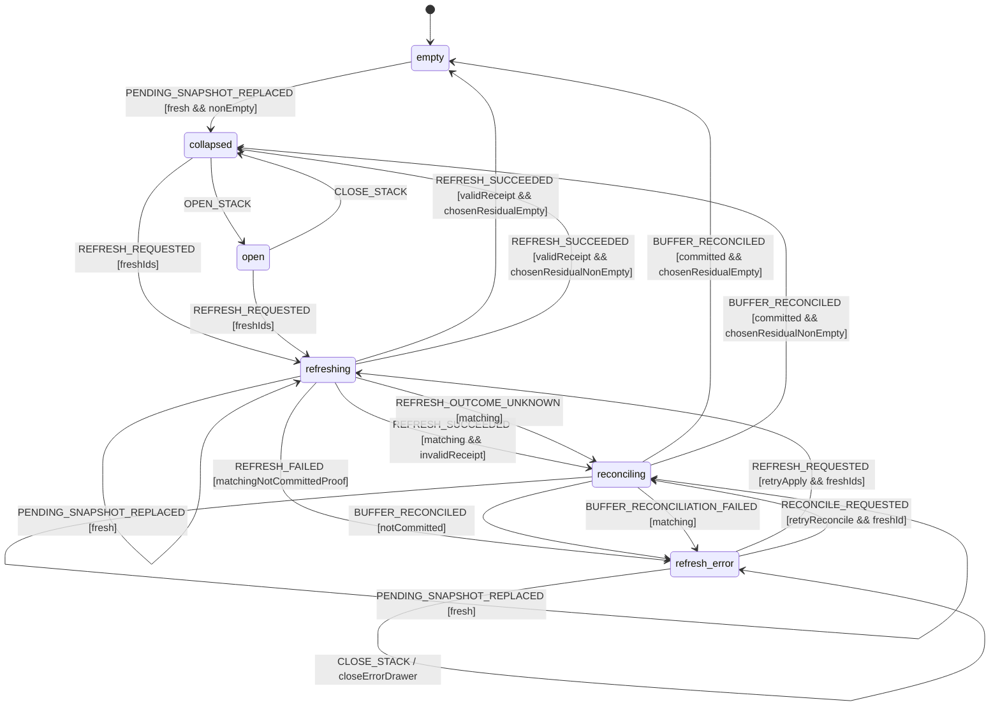

# Mission Arrival Queue and Feed Presentation Model

Source of truth for three coupled Feed concerns:

1. the mutually exclusive loading, empty, error and loaded actions;
2. stable reading of the **Nouvelles** queue while missions become seen; and
3. revisioned scan arrivals that never replace the list being read without an
   explicit, correlated refresh.

The scan lifecycle produces committed signals. This model decides how the Feed
may present them. No component, free text or LLM decides a transition.

## Composition and scope

This model composes with:

- `scan-lifecycle.model.md`, which owns scan acceptance, cancellation and
  terminal commit;
- `notification-deep-link.model.md`, whose focus lens remains an independent
  allow-list over the projected missions; and
- the public `FeedState = 'empty' | 'loading' | 'loaded' | 'error'` vocabulary
  from `feed.svelte.ts`.

Search, facets, favorites, comparison, tracking, connector execution, scoring
and persistence remain outside this model.

## Total Feed presentation projection

The Shell supplies facts; a pure Core function returns the only permitted
primary action and whether arrival state is compatible.

```ts
type FeedState = 'empty' | 'loading' | 'loaded' | 'error';
type OwnedActiveScanState = 'starting' | 'scanning' | 'retrying' | 'persisting' | 'cancelling';

interface FeedPresentationFacts {
  feedState: FeedState;
  ownedScan: { operationId: string; state: OwnedActiveScanState } | null;
  networkOnline: boolean;
}

type FeedPresentation =
  | { value: 'loading'; primaryAction: 'cancel'; actionEnabled: boolean; arrivalCompatible: false }
  | { value: 'empty'; primaryAction: 'start'; actionEnabled: boolean; arrivalCompatible: false }
  | { value: 'error'; primaryAction: 'retry'; actionEnabled: boolean; arrivalCompatible: false }
  | { value: 'loaded'; primaryAction: 'start'; actionEnabled: boolean; arrivalCompatible: true }
  | { value: 'inconsistent'; primaryAction: null; actionEnabled: false; arrivalCompatible: false };

declare function deriveFeedPresentation(facts: Readonly<FeedPresentationFacts>): FeedPresentation;
```

| Feed facts                                               | Projection     | Sole primary action                                      |
| -------------------------------------------------------- | -------------- | -------------------------------------------------------- |
| `loading` plus one owned active scan                     | `loading`      | `cancel`; disabled only after state becomes `cancelling` |
| `empty` plus no owned active scan                        | `empty`        | `start`; disabled while offline                          |
| `error` plus no owned active scan                        | `error`        | `retry`; disabled while offline                          |
| `loaded` plus no owned active scan                       | `loaded`       | `start`; disabled while offline                          |
| every other combination, including loading without an ID | `inconsistent` | none; fail closed and hide arrivals                      |

`ownedScan` is the manual operation owned by this Feed controller, not an
unobserved background alarm scan. A terminal operation is removed from this
field only after the controller has projected its terminal Feed state. Thus
`loading` can never expose Start/Retry and Empty/Error can never expose Cancel.

The Shell dispatches `FEED_FACTS_CHANGED` with a monotonically increasing
`presentationRevision`. The reducer derives the projection itself; it never
trusts a caller-supplied action or `arrivalCompatible` flag.

## Complete initial state and revision domain

`-1` is a sentinel held only in controller context. It is not a valid published
revision. The first valid presentation and buffer revisions are `0`.

```ts
const INITIAL_ARRIVAL_QUEUE_STATE: ArrivalQueueState = {
  lifecycle: 'active',
  presentationRevision: -1,
  presentation: {
    value: 'inconsistent',
    primaryAction: null,
    actionEnabled: false,
    arrivalCompatible: false,
  },
  bufferEpoch: null,
  lastBufferRevision: -1,
  queue: { value: 'all-feed' },
  stack: { value: 'empty' },
  settledApplyKeys: [],
};
```

Consequently, `FEED_FACTS_CHANGED(0, ...)` and
`PENDING_SNAPSHOT_REPLACED(revision=0)` are accepted at bootstrap. A revision
is fresh exactly when it is a safe non-negative integer strictly greater than
the corresponding stored revision. IDs are non-empty and unique within their
domain. A pending snapshot is the buffer authority's complete unconsumed buffer
at one revision; an empty snapshot is an explicit clear.

## Revisioned state and durable apply proof

```ts
interface PendingSnapshot {
  version: 1;
  bufferEpoch: string;
  snapshotId: string;
  revision: number;
  orderedIds: readonly string[];
}

interface ApplyCommitReceipt {
  version: 1;
  refreshId: string;
  appliedSnapshotId: string;
  applyCommandId: string;
  commitId: string;
  bufferEpoch: string;
  commitRevision: number;
  committedResidual: PendingSnapshot;
  orderedAllFeedIds: readonly string[];
  orderedUnseenIds: readonly string[];
}

interface ApplyNotCommittedReceipt {
  version: 1;
  outcomeId: string;
  refreshId: string;
  appliedSnapshotId: string;
  applyCommandId: string;
  disposition: 'not_committed';
  authoritativeSnapshot: PendingSnapshot;
}

type ReconciliationReceipt = {
  version: 1;
  reconciliationId: string;
  refreshId: string;
  appliedSnapshotId: string;
  applyCommandId: string;
  authoritativeSnapshot: PendingSnapshot;
} & (
  | { disposition: 'committed'; commit: ApplyCommitReceipt }
  | { disposition: 'not_committed'; commit: null }
);

type ArrivalRefreshError =
  | { code: 'APPLY_FAILED'; retry: 'apply' }
  | { code: 'APPLY_CANCELLED'; retry: 'apply' }
  | { code: 'BUFFER_PROTOCOL_ERROR'; retry: 'reconcile' }
  | { code: 'PRESENTATION_INVALIDATED'; retry: 'none' };

interface ArrivalQueueState {
  lifecycle: 'active' | 'disposed';
  presentationRevision: number;
  presentation: FeedPresentation;
  bufferEpoch: string | null;
  lastBufferRevision: number;
  queue:
    | { value: 'all-feed' }
    | {
        value: 'stable-queue';
        queueIds: readonly string[];
        dwells: Readonly<Record<string, number>>;
        seenEmissionIds: readonly string[];
      };
  stack:
    | { value: 'empty' }
    | {
        value: 'collapsed' | 'open';
        pending: PendingSnapshot;
        previewIds: readonly string[];
      }
    | {
        value: 'refreshing';
        refreshId: string;
        applyCommandId: string;
        applied: PendingSnapshot;
        latest: PendingSnapshot;
        previewIds: readonly string[];
      }
    | {
        value: 'reconciling';
        reconciliationId: string;
        refreshId: string;
        applyCommandId: string;
        applied: PendingSnapshot;
        latest: PendingSnapshot;
        disputedCommit: ApplyCommitReceipt | null;
        previewIds: readonly string[];
      }
    | {
        value: 'refresh-error';
        pending: PendingSnapshot;
        previewIds: readonly string[];
        failedRefreshId: string;
        failedApplyCommandId: string;
        error: ArrivalRefreshError;
        drawerOpen: boolean;
        retryContext:
          | { kind: 'apply' }
          | {
              kind: 'reconcile';
              applied: PendingSnapshot;
              latest: PendingSnapshot;
              disputedCommit: ApplyCommitReceipt | null;
            }
          | { kind: 'none' };
      };
  settledApplyKeys: readonly string[];
}
```

The buffer authority allocates revisions and the apply journal atomically. The
linearization point of a successful refresh is the durable journal commit named
by `(applyCommandId, commitId, commitRevision)`, never arrival order in the
actor mailbox. A valid receipt proves all of the following:

1. all correlation fields match the active refresh and frozen snapshot;
2. `commitRevision` is a safe integer greater than `applied.revision` in the
   same `bufferEpoch`;
3. `committedResidual.revision === commitRevision`, and its epoch and snapshot
   ID match the journal receipt;
4. no ID from `applied.orderedIds` occurs in `committedResidual.orderedIds`; and
5. `orderedAllFeedIds` and `orderedUnseenIds` are each unique, the unseen list
   is an ordered subset of the all-Feed membership, and both were read in the
   same commit.

A reconciliation receipt is valid only when every common correlation matches
the command. `disposition='committed'` requires a non-null valid commit and an
authoritative same-epoch snapshot at or after its commit revision.
`disposition='not_committed'` requires `commit=null` and an authoritative
snapshot read in the same journal transaction that proved absence of the apply
key. Structural unions alone are not treated as authority; the buffer/journal
adapter capability authenticates both receipts.

`ApplyNotCommittedReceipt` is the equivalent authenticated journal observation
returned in the original apply result. Its outcome ID is fresh, every
correlation matches, and its authoritative snapshot is read in the same
transaction that proved the apply key absent. That snapshot has the same epoch
and a safe revision at least equal to `applied.revision`; a lower, crossed or
same-revision-divergent snapshot is not a negative proof.

The Shell cannot manufacture this proof. The journal has a unique key
`(applyCommandId, appliedSnapshotId)` and an apply command is idempotent on that
key. `settledApplyKeys` retains the 256 most recent keys as a bounded audit
ledger; replay is also rejected by the durable journal key, so eviction from
the in-memory audit ledger can never
authorize a second apply.

## Events

```ts
type ArrivalQueueEvent =
  | { type: 'FEED_FACTS_CHANGED'; presentationRevision: number; facts: FeedPresentationFacts }
  | { type: 'ENTER_NEW_QUEUE'; orderedUnseenIds: readonly string[] }
  | { type: 'EXIT_NEW_QUEUE' }
  | { type: 'SORT_QUEUE'; orderedQueueIds: readonly string[] }
  | { type: 'DWELL_STARTED'; missionId: string; now: number }
  | { type: 'DWELL_CANCELLED'; missionId: string }
  | { type: 'DWELL_ELAPSED'; missionId: string; now: number }
  | { type: 'PENDING_SNAPSHOT_REPLACED'; snapshot: PendingSnapshot }
  | { type: 'OPEN_STACK' }
  | { type: 'CLOSE_STACK' }
  | { type: 'REFRESH_REQUESTED'; refreshId: string; applyCommandId: string }
  | {
      type: 'REFRESH_SUCCEEDED';
      receipt: ApplyCommitReceipt;
      reconciliationId: string;
    }
  | {
      type: 'REFRESH_FAILED';
      refreshId: string;
      appliedSnapshotId: string;
      applyCommandId: string;
      proof: ApplyNotCommittedReceipt;
      error: Extract<ArrivalRefreshError, { code: 'APPLY_FAILED' | 'APPLY_CANCELLED' }>;
    }
  | {
      type: 'REFRESH_OUTCOME_UNKNOWN';
      refreshId: string;
      appliedSnapshotId: string;
      applyCommandId: string;
      reconciliationId: string;
      reason: 'RESULT_MALFORMED' | 'JOURNAL_UNAVAILABLE' | 'TIMEOUT';
    }
  | { type: 'RECONCILE_REQUESTED'; reconciliationId: string }
  | { type: 'BUFFER_RECONCILED'; receipt: ReconciliationReceipt }
  | {
      type: 'BUFFER_RECONCILIATION_FAILED';
      reconciliationId: string;
      refreshId: string;
      appliedSnapshotId: string;
      applyCommandId: string;
      reason: 'JOURNAL_UNAVAILABLE' | 'INVALID_PROOF' | 'TIMEOUT';
    }
  | { type: 'PANEL_CLOSED' };
```

The raw boundary converts a structurally malformed matching apply result into
`REFRESH_OUTCOME_UNKNOWN(reason='RESULT_MALFORMED')`; a structurally valid but
semantically contradictory success remains `REFRESH_SUCCEEDED` and enters
reconciliation with its disputed receipt. A malformed or semantically invalid
matching reconciliation result becomes
`BUFFER_RECONCILIATION_FAILED(reason='INVALID_PROOF')`; neither may be silently
dropped while the actor waits. A reconciliation supervisor converts a missing
result into the correlated `TIMEOUT` event. Correlation mismatches are stale
no-ops. There is deliberately no `SCAN_CANCELLED` event: the scan model already
proves that a cancelled operation publishes no arrival item.

`REFRESH_FAILED` is accepted only with its matching durable `not_committed`
receipt. A network error, timeout or malformed result that cannot prove that
negative fact normalizes to `REFRESH_OUTCOME_UNKNOWN` and enters reconciliation;
it never authorizes an apply retry.

For a valid negative proof, Core chooses pending state monotonically between
the authenticated snapshot and `latest`: the greater same-epoch revision wins;
equal revisions require exact snapshot ID and ordered-ID equality. A
contradiction enters reconciliation. Thus a not-committed result delivered
after a newer buffer publication cannot roll back or lose those arrivals.

## Presentation and ordinary stack transitions

| From / condition                             | Event / guard                                  | Result and effects                                                                                                          |
| -------------------------------------------- | ---------------------------------------------- | --------------------------------------------------------------------------------------------------------------------------- |
| active                                       | fresh `FEED_FACTS_CHANGED`                     | derive and store presentation                                                                                               |
| loaded-compatible -> incompatible            | fresh `FEED_FACTS_CHANGED`                     | clear stack; cancel the exact apply/reconciliation if one is active                                                         |
| incompatible -> loaded-compatible            | fresh `FEED_FACTS_CHANGED`                     | keep stack empty; request one authoritative snapshot strictly after `lastBufferRevision`                                    |
| no buffer epoch yet                          | first valid pending snapshot                   | bind `bufferEpoch`, accept revision including `0`, and reduce the snapshot through the rows below                           |
| bound buffer epoch                           | snapshot from a different epoch                | cancel active work, dispose this actor, and emit `restart-arrival-controller`; the fresh actor accepts that epoch from `-1` |
| incompatible presentation                    | fresh same-epoch pending snapshot              | advance `lastBufferRevision`; do not retain a hidden snapshot                                                               |
| loaded + `empty`                             | fresh non-empty pending snapshot               | `collapsed`; store canonical pending with empty previews                                                                    |
| loaded + `collapsed`                         | fresh non-empty pending snapshot               | remain `collapsed`; replace canonical pending and clear previews                                                            |
| loaded + `open`                              | fresh non-empty pending snapshot               | remain `open`; replace canonical pending while preserving frozen previews                                                   |
| loaded + `refresh-error`                     | fresh pending snapshot, including empty        | replace pending; for reconcile retry also replace only `retryContext.latest`; preserve applied/dispute/error/drawer state   |
| loaded + `empty`/`collapsed`/`open`          | fresh empty pending snapshot                   | `empty`; clear previews                                                                                                     |
| `refreshing` / `reconciling`                 | fresh same-epoch pending snapshot              | advance revision and replace `latest` only; preserve applied, IDs, dispute and frozen previews                              |
| `collapsed`                                  | `OPEN_STACK`                                   | `open`; freeze first three pending IDs and focus drawer heading                                                             |
| `open`                                       | `CLOSE_STACK`                                  | `collapsed`; retain pending, clear previews and restore trigger focus                                                       |
| `refresh-error`                              | `OPEN_STACK` / `CLOSE_STACK`                   | remain `refresh-error`; toggle only `drawerOpen`, preserving error and retry context                                        |
| non-refreshing state with non-empty pending  | fresh `REFRESH_REQUESTED`                      | only normal pending or `retryContext.kind='apply'`; freeze applied/latest and emit exactly one apply                        |
| `refresh-error` with reconcile retry context | fresh `RECONCILE_REQUESTED`                    | restore original applied/latest/dispute and observe the same journal key; never emit apply                                  |
| any state                                    | stale/duplicate revision, event or correlation | no-op                                                                                                                       |

Every accepted pending snapshot updates `lastBufferRevision`. The displayed
count is always the current canonical snapshot's `orderedIds.length`; no second
`pendingMissionCount` exists.

`request-pending-buffer(afterRevision)` is a revision-allocating read: the
buffer authority must answer once with a snapshot whose revision is strictly
greater than `afterRevision`, even when ordered IDs are unchanged.

## Queue transitions and cross-region effects

| From           | Event                    | Guard/effect                                                                                                |
| -------------- | ------------------------ | ----------------------------------------------------------------------------------------------------------- |
| `all-feed`     | `ENTER_NEW_QUEUE(ids)`   | capture unique unseen membership, empty dwell/emission sets and preserve scroll                             |
| `stable-queue` | `SORT_QUEUE(ids)`        | accept only an exact permutation of current membership                                                      |
| `stable-queue` | `DWELL_STARTED(id, now)` | require membership and no prior seen emission; record the injected finite start                             |
| `stable-queue` | `DWELL_CANCELLED(id)`    | remove only that dwell                                                                                      |
| `stable-queue` | `DWELL_ELAPSED(id, now)` | require its matching start and 1500 ms continuous visibility; emit `mark-seen(id)` once and keep membership |
| `stable-queue` | `EXIT_NEW_QUEUE`         | clear stable membership/dwells/emissions and transition to `all-feed`                                       |
| `all-feed`     | committed apply          | remain `all-feed`; emit `project-all-feed-commit(receipt.orderedAllFeedIds)`                                |
| `stable-queue` | committed apply          | remain `stable-queue`; replace `queueIds` with `receipt.orderedUnseenIds`; clear dwell/emission sets        |

A committed settlement executes exactly one of the last two rows based on the
Queue region value captured at reduction time. The Stack region never writes
Queue state directly. The shared Core action emits either
`project-all-feed-commit` or `project-stable-new-commit`, never both. Thus a
success from `all-feed` cannot accidentally create a Nouvelles queue, while a
success from `stable-queue` deterministically rebuilds that queue.

`all-feed` is deliberately a mode marker: the existing Feed catalogue owns its
full membership. The commit receipt supplies the exact replacement IDs to the
single `project-all-feed-commit` effect. There is no implicit Stack-to-Queue
transition or second membership calculation.

`SORT_QUEUE` is the only event that may reorder an active stable queue. It may
neither add nor remove an ID. Search/facets project captured membership without
mutating it. `seenEmissionIds` is a subset of `queueIds`.

## Stack statechart and refresh linearization



On `REFRESH_REQUESTED`, Core freezes `applied`, copies it to `latest`, and emits
one `apply-pending` command with the fresh idempotency key. Fresh buffer signals
may replace only `latest`.

For a valid success receipt, Core chooses the authoritative residual by revision:

| Mailbox order at receipt reduction                          | Chosen residual and result                                                                                 |
| ----------------------------------------------------------- | ---------------------------------------------------------------------------------------------------------- |
| `latest.revision < commitRevision`                          | use `committedResidual`; advance `lastBufferRevision` to `commitRevision`                                  |
| `latest.revision === commitRevision`                        | require exact snapshot/epoch/IDs equality, then use that snapshot                                          |
| `latest.revision > commitRevision` in the same buffer epoch | use `latest`, which is causally post-commit; require applied IDs absent                                    |
| matching receipt with epoch/revision/residual contradiction | enter `reconciling`; emit one correlated journal observation; perform no Queue or pending partial mutation |
| non-matching refresh, apply or snapshot correlation         | stale no-op; it cannot settle or disturb the active refresh                                                |

This table accepts all legal orders:

- post-commit `S11` before the success receipt: equality settles on `S11`;
- the receipt before `S11`: the receipt settles on its embedded `S11`, and the
  later duplicate buffer signal is ignored by revision;
- post-commit `S12` between commit `S11` and its receipt: `S12` is chosen and
  survives as pending; and
- `S12` after the receipt: the receipt settles on `S11`, then the fresh normal
  buffer transition replaces it with `S12`.

There is no subtraction of `applied` from an arbitrary mailbox snapshot. The
buffer authority's commit receipt and monotone epoch are the only post-commit
proof. Queue membership always comes from the commit receipt, whereas arrivals
after that commit remain in the chosen pending residual.

## Total `BUFFER_PROTOCOL_ERROR` reconciliation

Entering `reconciling` preserves `applied`, `latest`, previews and the disputed
receipt. It does not emit `apply-pending`. Every `REFRESH_SUCCEEDED` carries a
separate, injected fresh contingency `reconciliationId`; a valid success leaves
that ID unused, while a matching invalid proof atomically consumes it and emits
exactly one `reconcile-pending-buffer` command. The command
reads the durable journal by `(applyCommandId, appliedSnapshotId)` and returns
one typed result:

`REFRESH_OUTCOME_UNKNOWN` follows the same entry action with
`disputedCommit=null` and its injected fresh `reconciliationId`.

| Matching result                         | Settlement                                                                                                                            |
| --------------------------------------- | ------------------------------------------------------------------------------------------------------------------------------------- |
| valid `committed` receipt               | choose a proven residual by the same revision table; update the proper Queue region once; record settled key; exit to empty/collapsed |
| valid `not_committed` receipt           | choose the monotone negative pending snapshot against `latest`; exit to `refresh-error(APPLY_FAILED, retry=apply)`                    |
| unavailable, timeout or malformed proof | retain latest known pending; exit to `refresh-error(BUFFER_PROTOCOL_ERROR, retry=reconcile)`                                          |

A matching result always exits the in-flight reconciliation. A reconciliation
failure stores the original `applied`, `latest` and disputed commit in the
`retryContext`. A further `RECONCILE_REQUESTED` is allowed only from a
`retry='reconcile'` error and uses a fresh reconciliation ID; it restores that
context, observes the same journal key and never resends the apply. An apply
retry is allowed only after a proven `not_committed` outcome and must use new
refresh and apply command IDs. Therefore no protocol error or retry path can
double-apply committed IDs.

Presentation invalidation cancels a matching apply or reconciliation and clears
the stack. Panel disposal does the same and is terminal. Late results are stale
no-ops because their correlation is no longer active.

## Effects and rendering projections

Core effects are explicit data:

```ts
type ArrivalQueueEffect =
  | { type: 'mark-seen'; missionId: string }
  | { type: 'request-pending-buffer'; afterRevision: number }
  | { type: 'apply-pending'; refreshId: string; applyCommandId: string; snapshot: PendingSnapshot }
  | { type: 'cancel-apply'; refreshId: string; applyCommandId: string; snapshotId: string }
  | {
      type: 'reconcile-pending-buffer';
      reconciliationId: string;
      refreshId: string;
      applyCommandId: string;
      appliedSnapshotId: string;
    }
  | { type: 'cancel-reconciliation'; reconciliationId: string }
  | { type: 'restart-arrival-controller'; nextBufferEpoch: string }
  | { type: 'project-all-feed-commit'; orderedIds: readonly string[] }
  | { type: 'project-stable-new-commit'; orderedIds: readonly string[] }
  | { type: 'focus-drawer-heading' }
  | { type: 'focus-stack-trigger' }
  | { type: 'scroll-feed-start' };
```

The arrival UI renders only when lifecycle is active, presentation is the exact
loaded-compatible projection, stack is not empty, and the canonical pending or
latest snapshot is non-empty. During `reconciling`, previews remain frozen and
refresh controls remain disabled. Count and preview IDs come only from Core.
`OPEN_STACK` derives `pending.orderedIds.slice(0, 3)`; missing catalogue objects
render an unavailable preview and request reconciliation without changing count.

## UX, motion and accessibility contract

- A seen write changes **Nouveau** to **Vu** but does not remove or reposition a
  card in the current stable queue.
- Re-entering Nouvelles captures a fresh unseen snapshot.
- The stack is anchored to the lower Feed edge, reserves space for the last
  mission actions and has a target at least 44 px high.
- Visual depth and drawer previews are capped at three; count remains exact.
- The drawer is non-modal: `aria-modal` is absent/false, there is no backdrop or
  focus trap, and it never registers with `modal-focus.model.md`.
- Escape closes only the open/error drawer. Refresh and reconciliation are not
  interruptible from the drawer UI.
- Count updates announce one throttled polite summary per committed snapshot,
  not per mission.
- Stack crossfade is at most 160 ms per snapshot; drawer motion is opacity plus
  at most 6 px over 180 ms. Reduced motion is instant.
- Notification focus remains an independent allow-list and mutates no arrival
  state.

## Invariants

1. Loading exposes Cancel only; Empty exposes Start only; Error exposes Retry
   only. An inconsistent fact tuple exposes no primary action.
2. Initial sentinels are explicit; published revision `0` is accepted exactly
   once and all subsequent published revisions are strictly monotone.
3. Count, ordered IDs and previews have one Core authority.
4. Seen never removes active stable membership.
5. The durable commit, not mailbox order, is the refresh linearization point.
6. A success received before, after or between post-commit buffer publications
   selects the same authoritative state for the same revision history.
7. A committed settlement updates exactly one Queue region branch and records
   its apply key once.
8. `BUFFER_PROTOCOL_ERROR` has a correlated, total reconciliation settlement;
   it can neither hang in `refreshing` nor resend the apply.
9. Only a durable `not_committed` proof authorizes an apply retry.
10. Arrivals after commit remain pending and never enter the commit's refreshed
    queue membership implicitly.
11. A durable negative proof can authorize retry but can never roll pending
    state behind a newer same-epoch snapshot.
12. Cancelled scans cannot clear prior committed arrivals because they emit no
    arrival event.
13. Presentation invalidation and panel disposal causally fence late results.
14. Disposed state is terminal for the mounted Feed instance.
15. A mission produces at most one seen-write effect per stable queue capture.
16. No Shell condition, free text or LLM output duplicates these decisions.

For every `refresh-error`, `error.retry` and `retryContext.kind` are equal
(`apply`, `reconcile` or `none`). `drawerOpen` is presentational only and cannot
clear or change that durable settlement requirement.

## Mandatory review matrix

- bootstrap: presentation revision `0`, buffer revision `0`, then duplicate,
  stale, gap and epoch-crossing snapshots;
- all valid FeedState/owned-scan combinations and every inconsistent tuple;
- loading/empty/error clearing a prior stack and loaded not resurrecting it;
- refresh commit `S11` with `S11` delivered before the receipt, after the
  receipt, and `S12` delivered between commit and receipt;
- success from `all-feed` versus `stable-queue`, proving only the corresponding
  Queue projection effect occurs;
- newer snapshot during refresh with overlapping and disjoint IDs;
- receipt mismatch, correlated reconciliation committed/not-committed/failure,
  guaranteed exit and no duplicate `apply-pending`;
- not-committed proof before/after a newer pending snapshot, equal-revision
  contradiction and monotone pending selection without arrival loss;
- refresh A result after failure and Retry B;
- invalidation and panel close during apply/reconciliation with late results;
- cancelled scan B while committed pending A exists;
- queue sort exact permutation, attempted add/remove and continuous dwell;
- notification focus, reduced motion, missing preview catalogue object and
  keyboard drawer close.

Implementation is forbidden until an independent reviewer approves this
revision and executable Core tests are RED for the matrix above.
