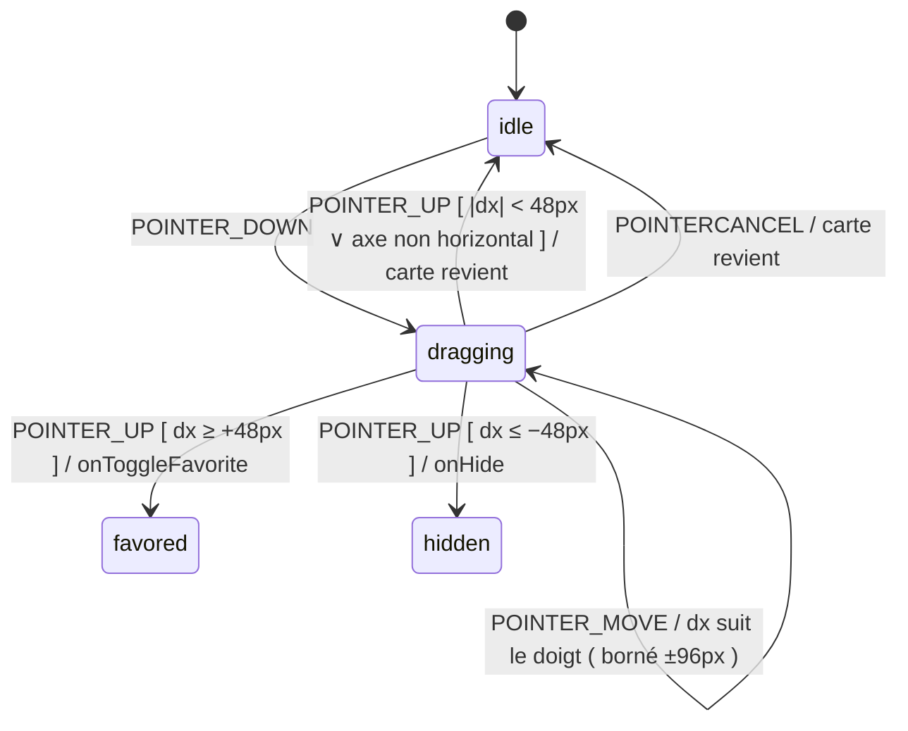

# Mission Card Swipe — Model

> Source de vérité pour le geste de balayage horizontal sur les cartes du feed
> (`MissionCard`). Proposition Mobbin : tri rapide au doigt — droite = favori,
> gauche = masquer.

## Contexte

Favoriser/masquer une mission exige un hover + clic précis sur les boutons
d'action de la carte. Sur écran étroit (side panel), le swipe est le geste
natif de tri rapide (référence : feeds de rencontres / boîtes mail tactiles).

## Machine à états du geste

- Implémentation : Svelte **action** (`use:swipe`) — aucun état global, aucun
  effet de bord hors les callbacks props existants `onToggleFavorite` / `onHide`.
- Intention horizontale : le geste n'est capturé que si `|dx| > |dy|` dès les
  premiers 8px ; sinon le scroll vertical reste maître (le container du feed
  garde son scroll — l'action appelle `preventDefault` seulement une fois
  l'intention horizontale établie).
- Seuil de validation : 48px, mesuré sur le déplacement réel du pointeur.
  Translation maximale bornée (96px) avec résistance élastique au-delà de
  48px — la résistance est purement visuelle et n'affecte pas la validation.
- Feedback : icône de destination (cœur / œil barré) qui apparaît en fond
  selon le sens, opacité proportionnelle à la progression vers le seuil.
  L'icône est mémoïsée par sens (rebuild uniquement au changement de
  direction), le padding appliqué à un seul côté à la fois.
- Capture du pointeur : `setPointerCapture` sur la carte dès que l'intention
  horizontale est verrouillée, libérée sur `POINTER_UP` / `POINTER_CANCEL` /
  désactivation — le geste survit à un pointeur qui quitte les limites de la
  carte, et un pointeur orphelin ne bloque pas les gestes suivants.
- Post-détection de clic : un `POINTER_UP` sous le seuil est traité comme clic
  normal (ouverture du détail) — jamais comme tri accidentel. Un `POINTER_UP`
  après intention horizontale verrouillée supprime le clic qui suit.

## Invariants

1. Les callbacks invoqués sont exactement ceux des boutons existants : le
   swipe est un **raccourci de présentation**, pas un nouveau workflow.
2. Clavier/souris : les boutons d'action restent la voie accessible — le swipe
   n'est jamais la seule manière de trier (pas d'impact a11y).
3. Une carte en cours de composition de geste n'ouvre jamais le détail
   (les deux exclusions sont mutuelles).
4. Le geste est désactivé quand la carte est en mode compact/compare ou dans
   le drawer — uniquement le feed.
