# Modal Focus Workflow Model

Source of truth for registry ownership, keyboard focus and causal close
handshakes on every MissionPulse surface that renders `aria-modal="true"`:

- `BackupRestoreModal`;
- `MissionComparison`;
- `MissionInvestigationDrawer`; and
- `KeyboardShortcutsHelp`.

The model owns focus only. Backup restoration, comparison, investigation and
shortcut-list content remain in their domain models. DOM and registry facts are
normalized signals; this deterministic workflow decides all focus, Tab,
Escape, close, restoration and modal-attribute effects.

## State, identities and context

```ts
type ModalSurface =
  'backup_restore' | 'mission_comparison' | 'mission_investigation' | 'keyboard_shortcuts_help';

type ModalFocusState =
  | 'closed'
  | 'registering'
  | 'opening_waiting_dom'
  | 'opening_background'
  | 'open'
  | 'busy'
  | 'busy_success_pending'
  | 'closing'
  | 'disposed';

type ModalCloseReason = 'explicit' | 'escape' | 'business_success';
type InitialFocusVariant =
  | 'backup_valid'
  | 'backup_error'
  | 'backup_validation_pending'
  | 'comparison'
  | 'investigation'
  | 'shortcuts_help';

interface CloseRequestIdentity {
  sessionNonce: string;
  ordinal: number;
  requestId: string;
}

interface CloseHandshake {
  identity: CloseRequestIdentity;
  reason: ModalCloseReason;
  resumeAfterReject: 'opening_waiting_dom' | 'open';
  ownerAcknowledged: boolean;
  removalToken: string | null;
}

interface ModalFocusContext {
  instanceId: string;
  ownerScopePath: readonly string[];
  surface: ModalSurface;
  variant: InitialFocusVariant | null;
  openSessionId: string | null;
  sessionNonce: string | null;
  registrationId: string | null;
  domRequestId: string | null;
  lastRegistryRevision: number;
  busyOperationId: string | null;
  deferredBusinessSuccessIdentity: CloseRequestIdentity | null;
  closeIdentityHighWatermark: number;
  recentCloseRequestIds: readonly string[];
  closeHandshake: CloseHandshake | null;
}

interface ModalFocusDomBinding {
  trigger: HTMLElement | null;
  dialog: HTMLElement;
}
```

The complete initial state is `closed` with configured non-empty `instanceId`,
`ownerScopePath` and `surface`; every nullable field is `null`,
`lastRegistryRevision=-1`, `closeIdentityHighWatermark=0`, and the bounded audit
ledger is empty. `OPEN` fills the session fields exactly once. There is no
implicit initial variant, registration or topmost value.

`instanceId`, `openSessionId`, `sessionNonce`, `registrationId`, DOM request IDs,
operation IDs and removal tokens are non-empty opaque IDs from distinct
domains. A `sessionNonce` is a fresh lowercase canonical UUID for every
mount/open session, so it contains no colon. The canonical close request string
is exactly:

```text
requestId = sessionNonce + ":" + decimal(ordinal)
```

`ordinal` is a safe positive integer. A fresh close identity has the current
session nonce, canonical string and `ordinal === closeIdentityHighWatermark + 1`.
This makes empty, crossed, skipped, duplicate and replayed identities
unrepresentable after normalization.

The reducer retains the high-water mark for the whole instance lifetime,
including owner rejection, blocked background input and busy-state input. It
also retains the 64 most recent request strings as a bounded audit ledger.
Evicting an audit entry does not permit replay because an older ordinal remains
below the non-decreasing high-water mark. At `Number.MAX_SAFE_INTEGER`, close
identity allocation fails closed with `CLOSE_ID_CAPACITY_EXHAUSTED`; it never
wraps.

State is owned only by the statechart. DOM handles remain in the Svelte action
and never enter Core or persistence. `disposed` is terminal for one action
instance.

## Shared registry actor

One module-local registry actor is the sole owner of modal order. Its context is
typed and contains a monotone `registryRevision`, an ordered stack of live
registrations, and at most one ancestor-teardown transaction.

```ts
interface RegistryEntry {
  registrationId: string;
  instanceId: string;
  surface: ModalSurface;
  ownerScopePath: readonly string[];
}

interface ModalRegistryContext {
  registryRevision: number;
  stack: readonly RegistryEntry[];
  consumedRegistrationIds: readonly string[];
  consumedDeliveryIds: readonly string[];
  teardown: {
    teardownId: string;
    scopeId: string;
    affectedRegistrationIds: readonly string[];
  } | null;
  restorationSettlement: {
    receiptId: string;
    exposedRegistrationId: string | null;
  } | null;
}

interface RegistrySnapshot {
  registryRevision: number;
  topmostRegistrationId: string | null;
  activeTeardownId: string | null;
}

type RemovalCause = 'normal_close' | 'owner_unmount' | 'ancestor_teardown';

interface RegistryRemovalReceipt {
  receiptId: string;
  registrationId: string;
  registryRevision: number;
  cause: RemovalCause;
  wasTopmostAtRemoval: boolean;
  exposedRegistrationId: string | null;
  topmostNotification: 'after_restore' | 'without_restore' | 'suppressed';
  teardownId: string | null;
}
```

The registry accepts at most 16 simultaneous live entries and 4,096 total
registration IDs plus 4,096 restoration/exposure delivery IDs during one panel
registry lifetime. Those consumed ledgers never evict; exhaustion is a typed
`CAPACITY_EXHAUSTED` rejection. A fresh panel document creates a new registry
only after all old actions/listeners are disposed. Thus removing an entry never
authorizes reuse of its registration ID, and a stale receipt/delivery cannot
bind a later modal instance.

The complete registry initial state is revision `-1`, an empty stack, empty
consumed-ID ledgers, and null teardown/restoration settlement. The first
successful registration publishes revision `0`. Every later stack mutation
strictly increments the safe revision; read-only snapshots may repeat it.

Registry transitions are total:

| Registry event                                 | Guard and atomic result                                                                                                                                                                 |
| ---------------------------------------------- | --------------------------------------------------------------------------------------------------------------------------------------------------------------------------------------- |
| `REGISTER(entry)`                              | all IDs fresh and no affected teardown; append once, increment revision, broadcast position snapshot                                                                                    |
| `REMOVE_NORMAL(registrationId, token)`         | exact owner-acknowledged removal capability; remove once and return a `normal_close` receipt with position at the removal linearization point                                           |
| `RESTORATION_SETTLED(receiptId, outcome)`      | exact pending normal-topmost receipt; outcome is `restored` or `skipped`; only now enqueue the causally linked `TOPMOST_RESTORED`                                                       |
| `REMOVE_OWNER(registrationId, scopeId)`        | exact mounted owner; remove once, return `owner_unmount`, suppress trigger restoration and, when topmost exposed a survivor, enqueue one fresh correlated `TOPMOST_EXPOSED` delivery    |
| `ANCESTOR_TEARDOWN_STARTED(teardownId, scope)` | select every entry whose `ownerScopePath` has the normalized scope path as an exact segment prefix, remove the complete set in one registry transaction, then issue suppressed receipts |
| stale/duplicate register or remove             | typed rejection; stack and revision unchanged                                                                                                                                           |

The atomic receipt, not an earlier close request or acknowledgement, is the
authority for `wasTopmostAtRemoval`. Therefore a new modal registered between
close request, owner acknowledgement and DOM removal makes the old instance a
background removal: it unregisters without restoring focus and without waking
another instance.

For a normal topmost removal, the action first attempts the permitted trigger
restoration, then the registry emits one `TOPMOST_RESTORED` to the exposed
registration. A normal background removal emits no such event. Owner unmount
never restores a trigger; it may expose a surviving registration only through
one correlated `TOPMOST_EXPOSED` delivery after the `without_restore` removal
transaction. Ancestor teardown removes all
affected registrations atomically and emits no intermediate
`TOPMOST_RESTORED`. Thus a Backup in `busy_success_pending` cannot wake while
its ancestor stack is being destroyed.

For a normal topmost receipt the registry enters a typed
`settling_restoration(receiptId)` substate. The Shell performs the synchronous
focus attempt and immediately returns `RESTORATION_SETTLED(restored|skipped)`;
only that transition enqueues `TOPMOST_RESTORED`. Registry commands are
serialized behind this settlement, so a later `REGISTER` cannot interleave. A
registration already ahead of the closing instance is reflected by
`wasTopmostAtRemoval=false` and receives no restoration effect.

## Normalized DOM facts and Core decisions

The Shell queries the DOM, assigns stable per-capture target IDs, and passes a
closed normalized value to Core. DOM nodes themselves never cross the boundary.

```ts
interface InitialFocusFacts {
  captureId: string;
  containerTargetId: string;
  confirmationInputTargetId: string | null;
  closeButtonTargetId: string | null;
  cancelButtonTargetId: string | null;
  firstEnabledButtonTargetId: string | null;
  firstMissionLinkTargetId: string | null;
  firstEnabledActionTargetId: string | null;
  acknowledgementButtonTargetId: string | null;
}

interface TabDomFacts {
  captureId: string;
  containerTargetId: string;
  activeTargetId: string | null;
  orderedFocusableTargetIds: readonly string[];
}

type TabDecision =
  | { kind: 'ignore'; preventDefault: false; targetId: null }
  | { kind: 'allow-native'; preventDefault: false; targetId: null }
  | { kind: 'defer-opening'; preventDefault: true; targetId: null }
  | { kind: 'focus'; preventDefault: true; targetId: string };

declare function decideInitialFocus(
  variant: InitialFocusVariant,
  facts: Readonly<InitialFocusFacts>
): string;

declare function decideTab(
  state: ModalFocusState,
  isTopmost: boolean,
  backwards: boolean,
  facts: Readonly<TabDomFacts>
): TabDecision;
```

The normalized fact parser proves unique non-empty target IDs, that the
container and every non-null typed slot are in the capture table, that every
focusable belongs to the dialog, and that `activeTargetId` is either in that
table or `null` for outside. The Shell labels DOM facts by semantic slot but
cannot supply a preferred/fallback ordering; `decideInitialFocus` owns that
ordering from `variant`. Each surface adapter has a fixed, reviewable slot-to-DOM
contract; components cannot relabel an arbitrary node as a preferred control. A
candidate is connected, rendered, enabled, outside hidden/inert ancestors and
keyboard-focusable. `tabindex="-1"` is excluded from Tab order but is allowed
for the explicit container fallback.

`decideTab` is exhaustive:

The reducer computes its `isTopmost` argument itself from the authenticated
registry snapshot and its own `registrationId`; the Shell cannot pass that
boolean directly.

| State/position                              | Decision                                                 |
| ------------------------------------------- | -------------------------------------------------------- |
| any non-topmost registration                | `ignore`                                                 |
| topmost `registering`/opening state         | `defer-opening`; suppress Tab until correlated readiness |
| topmost interactive state with no focusable | focus container                                          |
| active target outside the Tab order         | focus first item in either direction                     |
| forward Tab on last                         | focus first                                              |
| backward Tab on first                       | focus last                                               |
| one focusable                               | focus that item                                          |
| intermediate item                           | `allow-native`                                           |

Interactive means `open`, `busy`, `busy_success_pending` or `closing`; the
focus trap remains active until registry removal. Core alone chooses both
`preventDefault` and `targetId`. The Shell resolves the chosen ID only against
the exact captured table and executes that decision; it never recomputes the
focusable order or chooses a fallback. If a target disappears before execution,
the Shell still prevents default and dispatches `DOM_FACTS_INVALIDATED` to
request a new capture. This is fail-closed and does not create a second Tab
authority.

## Events

```ts
type ModalFocusEvent =
  | {
      type: 'OPEN';
      variant: InitialFocusVariant;
      openSessionId: string;
      sessionNonce: string;
      registrationId: string;
      domRequestId: string;
    }
  | {
      type: 'OPEN_REJECTED';
      reason: 'INVALID_SURFACE_VARIANT' | 'INVALID_ID' | 'CROSSED_SESSION' | 'CAPACITY_EXHAUSTED';
    }
  | { type: 'REGISTRY_REGISTERED'; registrationId: string; snapshot: RegistrySnapshot }
  | {
      type: 'REGISTRY_REGISTRATION_REJECTED';
      registrationId: string;
      reason: 'DUPLICATE_ID' | 'INVALID_SCOPE' | 'TEARDOWN_ACTIVE' | 'CAPACITY_EXHAUSTED';
    }
  | {
      type: 'REGISTRY_POSITION_CHANGED';
      registrationId: string;
      snapshot: RegistrySnapshot;
    }
  | {
      type: 'DOM_READY';
      registrationId: string;
      domRequestId: string;
      snapshot: RegistrySnapshot;
      facts: InitialFocusFacts;
    }
  | {
      type: 'DOM_FACTS_INVALIDATED';
      registrationId: string;
      captureId: string;
      nextDomRequestId: string;
      snapshot: RegistrySnapshot;
    }
  | { type: 'TAB'; backwards: boolean; snapshot: RegistrySnapshot; facts: TabDomFacts }
  | { type: 'ESCAPE'; identity: CloseRequestIdentity; snapshot: RegistrySnapshot }
  | { type: 'EXPLICIT_CLOSE'; identity: CloseRequestIdentity; snapshot: RegistrySnapshot }
  | { type: 'BACKUP_BUSY_STARTED'; operationId: string; snapshot: RegistrySnapshot }
  | { type: 'BACKUP_BUSY_SETTLED'; operationId: string; outcome: 'failed' | 'cancelled' }
  | {
      type: 'BACKUP_BUSY_SETTLED';
      operationId: string;
      outcome: 'succeeded';
      identity: CloseRequestIdentity;
      snapshot: RegistrySnapshot;
    }
  | {
      type: 'TOPMOST_RESTORED';
      restorationId: string;
      receiptId: string;
      snapshot: RegistrySnapshot;
      nextDomRequestId: string;
    }
  | {
      type: 'TOPMOST_EXPOSED';
      exposureId: string;
      receiptId: string;
      cause: 'owner_unmount';
      snapshot: RegistrySnapshot;
      nextDomRequestId: string;
    }
  | { type: 'OWNER_CLOSE_ACKNOWLEDGED'; requestId: string; removalToken: string }
  | {
      type: 'OWNER_CLOSE_REJECTED';
      requestId: string;
      nextDomRequestId: string;
    }
  | {
      type: 'DIALOG_REMOVED';
      requestId: string;
      removalToken: string;
      receipt: RegistryRemovalReceipt;
    }
  | { type: 'PARENT_UNMOUNTED'; receipt: RegistryRemovalReceipt | null }
  | { type: 'ANCESTOR_TEARDOWN_RECEIPT'; receipt: RegistryRemovalReceipt };
```

Only the registry actor can create registry snapshots and removal receipts. The
event boundary validates monotone registry revisions and exact registration,
receipt, teardown, request and removal-token correlations. A caller-supplied
boolean such as `isTopmost` is forbidden.

Equal registry revisions are allowed for several facts captured from the same
stack state; a lower revision is stale. For keyboard events, the shared listener
captures the registry snapshot, normalized DOM facts, Core reduction and effect
decision in one JavaScript task before another registry command can run. For
`DOM_READY`, the registry attaches its current snapshot at dispatch, so a DOM
callback cannot replay a previously topmost observation after nesting changes.

`restorationId` and `exposureId` are registry-allocated one-shot delivery IDs.
Each is bound to the removal receipt ID, the exact exposed registration and the
post-removal registry revision before enqueue. The consumed-delivery ledger is
updated atomically; crossed, duplicate or capacity-exhausted delivery events are
typed no-ops and can never release a deferred business close.

Every event carrying `CloseRequestIdentity` first passes through the pure close
identity gate, before any state/topmost/business guard. A valid fresh identity
is consumed and recorded even if the instance is background, busy, closing or
the busy operation ID is stale. Invalid/empty/crossed/replayed identities reduce
to a typed no-op and can never invoke the owner. This two-stage reduction is
what preserves at-most-once behavior after an owner rejection.

Core outputs only typed effects:

```ts
type ModalFocusEffect =
  | { type: 'register-modal'; entry: RegistryEntry }
  | { type: 'request-dom-capture'; registrationId: string; domRequestId: string }
  | {
      type: 'project-modal';
      registrationId: string;
      inert: boolean;
      ariaHidden: boolean;
      ariaModal: boolean;
    }
  | { type: 'apply-initial-focus'; captureId: string; targetId: string }
  | { type: 'apply-tab-decision'; captureId: string; decision: TabDecision }
  | { type: 'request-owner-close'; requestId: string; reason: ModalCloseReason }
  | {
      type: 'restore-trigger';
      receiptId: string;
      settleRegistryWith: 'RESTORATION_SETTLED';
    }
  | { type: 'dispose-modal-binding'; registrationId: string | null }
  | {
      type: 'report-modal-focus-error';
      code:
        | 'MODAL_INPUT_REJECTED'
        | 'REGISTRY_REJECTED'
        | 'DOM_FACTS_INVALID'
        | 'CLOSE_ID_INVALID'
        | 'CLOSE_ID_REPLAYED'
        | 'CLOSE_ID_CAPACITY_EXHAUSTED';
    };
```

Effects contain no callback result or caller-selected focus policy. Each
command/result is correlated by the IDs shown above.

## Statechart

```mermaid
stateDiagram-v2
  [*] --> closed
  closed --> registering: OPEN [validSurfaceVariantAndFreshIds] / register
  closed --> closed: OPEN_REJECTED / reportTypedInputError
  registering --> opening_waiting_dom: REGISTRY_REGISTERED [matching] / projectInertAndRequestDom
  registering --> disposed: REGISTRY_REGISTRATION_REJECTED [matching] / reportConfigurationError

  opening_waiting_dom --> open: DOM_READY [matching && topmostNow] / projectModalAndFocusCoreTarget
  opening_waiting_dom --> opening_background: DOM_READY [matching && !topmostNow] / remainInert
  opening_waiting_dom --> opening_background: REGISTRY_POSITION_CHANGED [matching && !topmostNow] / invalidateDomRequestAndRemainInert
  opening_waiting_dom --> opening_waiting_dom: TAB [topmostNow] / applyCoreDeferDecision
  opening_waiting_dom --> closing: ESCAPE [freshConsumed && topmostNow] / requestOwnerClose
  opening_waiting_dom --> closing: EXPLICIT_CLOSE [freshConsumed && topmostNow] / requestOwnerClose

  opening_background --> opening_waiting_dom: TOPMOST_RESTORED [matchingNormalReceipt && topmostNow] / requestFreshDom
  opening_background --> opening_waiting_dom: TOPMOST_EXPOSED [matchingOwnerUnmountReceipt && topmostNow] / requestFreshDom
  opening_background --> opening_waiting_dom: REGISTRY_POSITION_CHANGED [matching && topmostWithoutRestore] / requestFreshDom
  opening_background --> opening_background: TAB / applyCoreIgnoreDecision
  opening_background --> opening_background: ESCAPE, EXPLICIT_CLOSE / consumeWithoutOwnerCallback

  open --> open: TAB / applyCoreTabDecision
  open --> closing: ESCAPE [freshConsumed && topmostNow] / requestOwnerClose
  open --> closing: EXPLICIT_CLOSE [freshConsumed && topmostNow] / requestOwnerClose
  open --> busy: BACKUP_BUSY_STARTED [topmostNow && backupSurface && freshOperation]

  busy --> busy: TAB / applyCoreTabDecision
  busy --> open: BACKUP_BUSY_SETTLED(failed|cancelled) [matchingBusyOperation]
  busy --> closing: BACKUP_BUSY_SETTLED(succeeded) [freshConsumed && matchingBusyOperation && topmostNow] / requestOwnerClose
  busy --> busy_success_pending: BACKUP_BUSY_SETTLED(succeeded) [freshConsumed && matchingBusyOperation && !topmostNow] / storeDeferredClose
  busy --> busy: ESCAPE, EXPLICIT_CLOSE / consumeWithoutOwnerCallback

  busy_success_pending --> busy_success_pending: TAB / applyCoreTabDecision
  busy_success_pending --> closing: TOPMOST_RESTORED [matchingNormalReceipt && topmostNow && hasDeferredClose] / requestDeferredOwnerClose
  busy_success_pending --> closing: TOPMOST_EXPOSED [matchingOwnerUnmountReceipt && topmostNow && hasDeferredClose] / requestDeferredOwnerClose
  busy_success_pending --> busy_success_pending: ESCAPE, EXPLICIT_CLOSE / consumeWithoutOwnerCallback

  closing --> closing: TAB / applyCoreTabDecision
  closing --> closing: OWNER_CLOSE_ACKNOWLEDGED [matchingUnacknowledged] / storeRemovalToken
  closing --> opening_waiting_dom: OWNER_CLOSE_REJECTED [matching && resumeOpening] / retainConsumedIdAndRequestFreshDom
  closing --> open: OWNER_CLOSE_REJECTED [matching && resumeOpen] / retainConsumedId
  closing --> disposed: DIALOG_REMOVED [acknowledgedNormalReceipt] / settleRemovalByPosition

  registering --> disposed: PARENT_UNMOUNTED / settleUnmountReceipt
  opening_waiting_dom --> disposed: PARENT_UNMOUNTED / settleUnmountReceipt
  opening_background --> disposed: PARENT_UNMOUNTED / settleUnmountReceipt
  open --> disposed: PARENT_UNMOUNTED / settleUnmountReceipt
  busy --> disposed: PARENT_UNMOUNTED / settleUnmountReceipt
  busy_success_pending --> disposed: PARENT_UNMOUNTED / settleUnmountReceipt
  closing --> disposed: PARENT_UNMOUNTED / settleUnmountReceipt
  registering --> disposed: ANCESTOR_TEARDOWN_RECEIPT / settleSuppressedTeardownReceipt
  opening_waiting_dom --> disposed: ANCESTOR_TEARDOWN_RECEIPT / settleSuppressedTeardownReceipt
  opening_background --> disposed: ANCESTOR_TEARDOWN_RECEIPT / settleSuppressedTeardownReceipt
  open --> disposed: ANCESTOR_TEARDOWN_RECEIPT / settleSuppressedTeardownReceipt
  busy --> disposed: ANCESTOR_TEARDOWN_RECEIPT / settleSuppressedTeardownReceipt
  busy_success_pending --> disposed: ANCESTOR_TEARDOWN_RECEIPT / settleSuppressedTeardownReceipt
  closing --> disposed: ANCESTOR_TEARDOWN_RECEIPT / settleSuppressedTeardownReceipt
  closed --> disposed: PARENT_UNMOUNTED
```



All unlisted or stale events are explicit no-ops. A fresh registry snapshot is
stored before deriving the modal projection. Registering a newer topmost entry
causes every prior entry to project inert/background immediately.

The following cross-cutting transitions preserve the current business state:

| Event / condition                                          | Core transition/effect                                                                                                       |
| ---------------------------------------------------------- | ---------------------------------------------------------------------------------------------------------------------------- |
| fresh `REGISTRY_POSITION_CHANGED`, instance not topmost    | ready states retain business state and become inert; `opening_waiting_dom` invalidates its DOM request and enters background |
| fresh `REGISTRY_POSITION_CHANGED`, topmost without restore | ready states project interactive; an `opening_background` state requests a fresh correlated DOM capture                      |
| matching normal `TOPMOST_RESTORED` in `open`/`busy`        | retain state and project interactive; trigger focus was already settled by the causative removal                             |
| matching owner-unmount `TOPMOST_EXPOSED` in `open`/`busy`  | retain state and project interactive without trigger restoration; consume the unique exposure delivery                       |
| matching `DOM_FACTS_INVALIDATED`                           | retain business state, consume `nextDomRequestId`; when topmost request a fresh capture, otherwise wait for topmost          |
| matching recovery `DOM_READY` in an already-ready state    | if topmost, apply the new Core initial-focus target; if background, remain inert and consume no focus effect                 |

`busy_success_pending` is the one exception to state preservation on a causal
topmost delivery: normal `TOPMOST_RESTORED` or owner-unmount
`TOPMOST_EXPOSED` enters `closing` and requests its stored business close.
An ordinary position event cannot synthesize that transition, and ancestor
teardown emits neither delivery.

`PARENT_UNMOUNTED` is a registry settlement, not a second unregister command.
Its non-null receipt must have `cause='owner_unmount'` and exact registration.
A null receipt is valid only while `registering` and proves that the registry
serialized the owner cancellation before append, so no late registration can
leak. `ANCESTOR_TEARDOWN_RECEIPT` requires the exact active teardown ID,
`cause='ancestor_teardown'` and `topmostNotification='suppressed'`.

## Executable opening policy

From registration until a matching `DOM_READY` proves the instance is current
topmost, the dialog projection is:

```text
inert = true
aria-hidden = "true"
aria-modal = "false"
keyboard owner = registry topmost entry, with Tab suppressed
```

`DOM_READY` is correlated by both `registrationId` and `domRequestId`. The
registry attaches its current snapshot atomically when dispatching the event.
If that snapshot says the instance is topmost, Core selects the initial target,
the action removes inert/hidden, sets `aria-modal="true"`, and focuses the exact
Core target. If a nested modal is already topmost, the event moves the instance
to `opening_background` without focus.

A later normal removal of the nested modal sends `TOPMOST_RESTORED` only after
its restoration step. An opening-background instance then consumes a fresh
`nextDomRequestId` and waits for a new `DOM_READY`; it never reuses facts from
the earlier tick. Late readiness for the old request ID is stale. Escape during
topmost opening follows the normal close handshake; Tab is prevented and
deferred. Neither key can leak to page content.

## Causal close and removal handshake

1. The identity gate validates and permanently consumes the close identity.
2. A permitted topmost transition stores the identity and invokes the owner
   once with `{ requestId, reason }`.
3. The owner either rejects or acknowledges with a fresh removal token before
   changing visibility. Rejection clears the handshake but not the identity
   high-water mark or audit ledger.
4. The registry atomically removes the exact registration and emits a removal
   receipt containing its position and cause at that instant.
5. A matching `normal_close` receipt from a topmost removal may restore the
   still-valid trigger; a background normal removal unregisters without focus
   movement. Owner/ancestor teardown never restores.
6. `TOPMOST_RESTORED`, when allowed, is delivered only after restoration and
   carries the causative receipt ID. Duplicate receipts, removal tokens,
   acknowledgements and restoration events are stale no-ops. Owner unmount uses
   the distinct one-shot `TOPMOST_EXPOSED` receipt and never claims restoration.

A trigger is restorable only while connected, enabled, non-inert and in the same
live document. No fallback is guessed when it is invalid.

## Backup busy settlement

Only a topmost Backup surface can enter `busy`. Failure/cancellation for its
matching operation returns to `open`. Success carries a fresh close identity;
that identity is consumed even for stale or background input. Matching success
requests a business close immediately when topmost. Otherwise it stores the
identity in `busy_success_pending`; a causally matched normal
`TOPMOST_RESTORED` or owner-unmount `TOPMOST_EXPOSED` for this registration can
consume the deferred value and invoke the owner once. Ancestor teardown can do
neither. Comparison, Investigation and Shortcuts Help never enter busy.

## Initial focus policy

After a matching DOM capture, Core chooses the first available target from this
typed policy. The Shell does not reinterpret it.

| Variant                     | Preferred target   | Ordered fallback                  |
| --------------------------- | ------------------ | --------------------------------- |
| `backup_valid`              | confirmation input | first enabled button, container   |
| `backup_error`              | close button       | container                         |
| `backup_validation_pending` | cancel button      | container                         |
| `comparison`                | close button       | first mission link, container     |
| `investigation`             | close button       | first enabled action, container   |
| `shortcuts_help`            | close button       | acknowledgement button, container |

The surface/variant relation is exact: `backup_*` belongs only to Backup,
`comparison` to Comparison, `investigation` to Investigation, and
`shortcuts_help` to Keyboard Shortcuts Help. The dialog has a stable accessible
name before readiness is dispatched.

## Composition with Keyboard Shortcuts Help and the arrival drawer

`KeyboardShortcutsHelp` is a full registry participant. Its content model's
`OPEN`, `CLOSE_BUTTON`, `CLOSE_BACKDROP` and `ESCAPE` remain domain intents, but
their focus semantics are refined here:

- `OPEN` creates one `keyboard_shortcuts_help` registration and uses the
  `shortcuts_help` focus variant;
- close button, acknowledgement button and backdrop create fresh
  `EXPLICIT_CLOSE` identities;
- Escape creates a fresh `ESCAPE` identity through the shared keyboard listener;
- its owner moves `showShortcutsHelp` to false only after acknowledging the
  correlated close request; and
- the component has no independent document/window keydown listener, focus
  routine or `aria-modal` authority.

Every live modal surface, including Shortcuts Help, derives attributes from the
same registry projection:

| Registry position/state                       | Projection                                                 |
| --------------------------------------------- | ---------------------------------------------------------- |
| topmost and ready/open/busy/closing           | interactive, `aria-hidden=false`, `aria-modal=true`        |
| background registration                       | `inert`, `aria-hidden=true`, `aria-modal=false`            |
| topmost but awaiting correlated DOM readiness | `inert`, `aria-hidden=true`, `aria-modal=false`, Tab defer |

Thus at most one surface claims `aria-modal=true`. Opening Shortcuts Help above
Comparison/Investigation makes the prior surface inert; opening
Comparison/Investigation above Shortcuts Help does the inverse. Only the final
topmost handles Tab/Escape in either order.

The Feed arrival drawer from `mission-arrival-queue.model.md` is explicitly
non-modal: it has no backdrop, no focus trap, `aria-modal` is absent/false, and
it never enters this registry. Its local Escape close cannot compete for modal
ownership; a modal topmost listener consumes Escape before non-modal routing.

## Boundaries

- **Pure Core:** event/state reduction, exact surface/variant mapping, close
  identity gate, busy/close correlation, initial focus selection and complete
  Tab target/default-prevention decision from normalized facts.
- **Registry actor:** registration stack, monotone snapshots, atomic removal
  position/cause, ancestor teardown and ordered topmost notifications.
- **Shared Svelte action:** DOM queries and capture-table construction,
  registry transport, focus calls, attribute/inert application and execution of
  the exact Core decision.
- **Components:** provide typed surface, variant, scope, dialog, trigger and
  owner callback. They add no Escape/Tab/focus or `aria-modal` path.

No storage, Chrome API, timestamp, button copy or LLM participates.

## Invariants

1. The registry is the sole global topmost authority; no caller boolean can
   claim ownership.
2. At most one registered surface is interactive and `aria-modal=true`; every
   other modal surface is inert and hidden from accessibility APIs.
3. Opening remains inert until a correlated, current-topmost `DOM_READY`;
   topmost Tab is suppressed and Escape is causally closed during that window.
4. Late readiness for a background instance cannot move focus. Regaining
   topmost requires a new DOM request and capture.
5. Core alone selects Tab target and default prevention from normalized facts;
   Shell never recomputes the algorithm.
6. Every registration is removed exactly once. Restoration depends on position
   at atomic removal, not position at request or acknowledgement.
7. Background removal, owner unmount and ancestor teardown never restore a
   trigger. Ancestor teardown emits no intermediate topmost wake-up.
8. Every valid close identity is one-shot and retained across rejection,
   blocking and stale business events; an invalid or replayed ID invokes no owner.
9. Owner close callback runs at most once per canonical request ID.
10. Only Backup enters busy, and only its matching operation settles it.
11. A non-topmost Backup success waits for a causal normal-restoration or
    owner-unmount exposure receipt and cannot wake during ancestor teardown.
12. Keyboard Shortcuts Help participates in the same registry and has no second
    Escape, Tab, focus or `aria-modal` authority.
13. The arrival drawer remains non-modal and cannot contend for registry
    ownership.
14. Registry live/consumed capacities are explicit and never evict replay
    evidence within a panel lifetime.
15. Disposed is terminal; no DOM handle, free text or LLM signal enters Core.

## Mandatory review matrix

- every surface/variant pair, invalid pair and no-focusable fallback;
- nested `OPEN` before the first `DOM_READY`, Tab/Escape during opening, late
  background readiness, then fresh readiness after topmost restoration;
- forward/backward wrap, one item, dynamic disable/remove, focus outside and
  target invalidation between decision and effect;
- close request ID empty, malformed, crossed, duplicate, skipped and replayed
  after owner reject; bounded-ledger eviction with high-water replay rejection;
- new topmost registered between close request, acknowledgement and
  `DIALOG_REMOVED`, proving background removal does not restore;
- normal nested topmost removal, invalid trigger and ordered restoration before
  `TOPMOST_RESTORED`;
- multi-registration ancestor teardown containing a Backup
  `busy_success_pending`, proving zero transient wake-up/restoration;
- nested owner unmount exposing a Backup `busy_success_pending`, proving one
  deferred close without a false trigger-restoration claim;
- Backup busy failure, cancellation, success, stale operation result and busy
  event rejected on every non-Backup surface;
- Shortcuts Help above Comparison and Investigation, then each inverse order,
  proving one `aria-modal`, Tab and Escape owner;
- unmount during registering/opening/open/busy/closing and duplicate removal
  receipts; teardown leaves no listener or registry entry;
- Feed arrival drawer open below each modal, proving it remains non-modal.

Implementation is forbidden until an independent reviewer approves this model
and its composition with the non-modal Feed arrival drawer.
