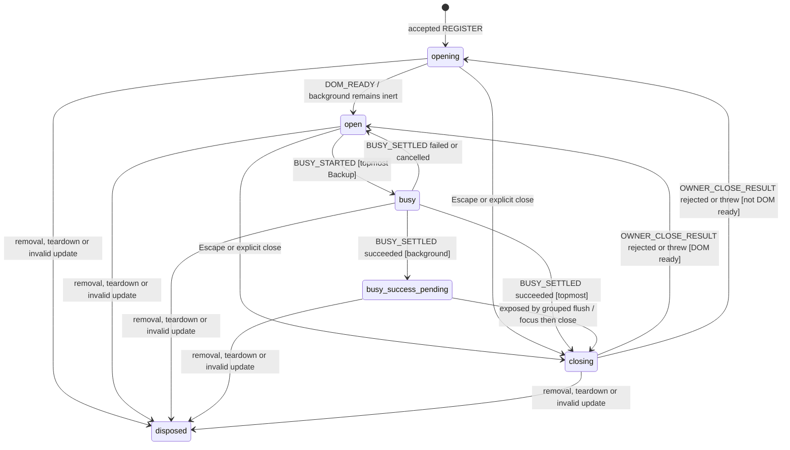
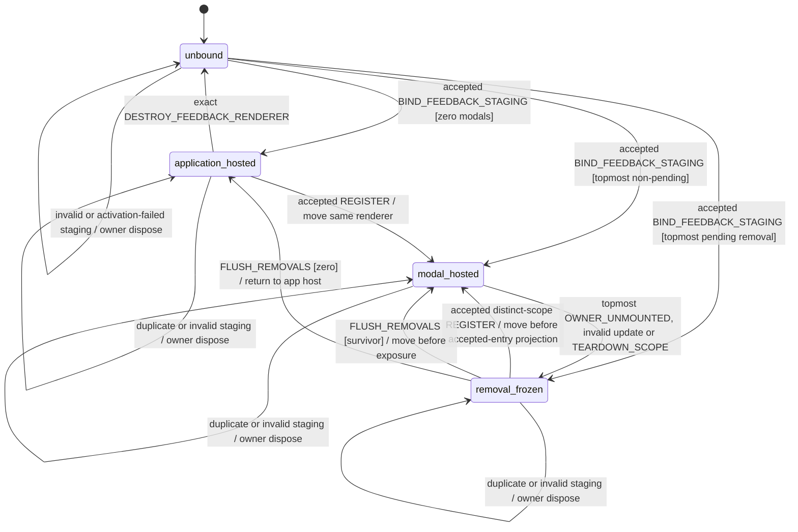

# Modal Focus Workflow Model

Status: **MODEL REVISION 4 — pending independent cold review; implementation
forbidden until approval**.

Pending behaviour SHA-256: `cc6fb80b6308744b6d7dac59f07ee28de08e20646176c82ad302a2df18ce7a0f`.

Hash convention: compute SHA-256 over all raw UTF-8/LF bytes of this file after
replacing only the value between backticks on the `Pending behaviour SHA-256`
line with the literal `__PENDING_BEHAVIOUR_SHA256__`; the surrounding backticks,
period and every other byte remain unchanged. The reviewer must reproduce that
substitution before comparing the digest, so recording the digest creates no
self-referential cycle.

Revision 2 was independently rejected at normalized UTF-8/LF behaviour hash
`e24dbaa7b8836113eeafe52b7383382c9cb486619710bd59dd2d69b0e40f1a77`.
Its feedback lane did not define an accepted distinct-scope `REGISTER` while
the previous topmost was removal-frozen, and it allowed a concurrent bind
candidate to arrive already marked/rendering, so rejection could not prove one
renderer/live region. Revision 3 closed both paths.

Revision 3 was independently rejected at normalized UTF-8/LF behaviour hash
`17687b1e1e77e3843aa5f85720da6571e1d605ea700dd2e07ad8272d201cca2e`.
It closed both revision-2 findings, but its state diagram sent every accepted
initial bind with a live topmost to `modal_hosted`, including a topmost already
pending removal. Revision 4 makes that initial branch explicit:
pending-removal topmost -> `topmost-removal-frozen`/`removal_frozen`, while only
a non-pending topmost -> `modal-hosted`. All other revision-3 behaviour is
unchanged. No approval transfers to this revision; no focus-registry or toast
implementation is authorized until an independent reviewer approves these
exact normalized bytes.

The original regression remains the actionable tracking toast created while
`MissionInvestigationDrawer` is topmost: it stayed in the application host,
under the body overlay, and its **Annuler** action could not be reached.

This model is the focus and accessibility authority for every MissionPulse
surface that renders `aria-modal="true"`:

- `BackupRestoreModal`;
- `MissionComparison`;
- `MissionInvestigationDrawer`; and
- `KeyboardShortcutsHelp`.

It owns painted topmost order, inert/ARIA projection, initial and recovery
focus, Tab, Escape, Backup busy behaviour, grouped removal and the placement of
the one application feedback renderer. Modal business mutations, toast item
lifecycle, timers and action semantics remain in their owners. No DOM query,
rendered copy, free text, CSS z-index or LLM output chooses topmost, feedback
target or a business transition; validated DOM facts remain inputs only to the
existing registration, projection and focus predicates.

## Scope and boundaries

| Layer                   | Responsibility                                                                                           |
| ----------------------- | -------------------------------------------------------------------------------------------------------- |
| Pure Core               | Validation, target eligibility, focus order, Tab, entry and feedback-lane transitions                    |
| Per-`Document` registry | Live entries, unique topmost, layers, serialized commands, feedback target, listener and grouped removal |
| Shared Svelte action    | Complete DOM/config capture, projection, portal moves, focus calls and owner callbacks                   |
| Components              | Typed surface/variant/scope, dialog, trigger and business close/busy intents                             |
| Toast owner             | One renderer, typed item/action identity, timers, dismissal and invocation                               |

There is exactly one registry per live `Document`, held in a
`WeakMap<Document, ModalRegistry>`. It has no persistence, Chrome API, crypto
identity, replay ledger, acknowledgement supervisor or timeout protocol. The
Feed arrival drawer is non-modal and never registers. The feedback lane is an
ephemeral DOM-placement projection only: it does not persist, replay,
interpret or settle a toast, and it cannot authorize a business transition.

## Registry construction, serialization and capacity

Application bootstrap creates a registry with exactly one fallback element:

```ts
declare function createModalRegistry(
  document: Document,
  overlayRoot: HTMLElement,
  documentFallback: HTMLElement
): ModalRegistry;
```

At construction, `overlayRoot` must satisfy the exact DOM contract below.
`documentFallback` must belong to `document`, be connected and pass the
document-level recovery eligibility predicate. Invalid construction fails
before any binding can register. Both nodes are thereafter registry-owned and
immutable; registrations, entries and updates cannot replace them. If fallback
later becomes ineligible, recovery falls through to `document.body`.

Application bootstrap exposes one stable application host, but it does **not**
construct a renderer or live region before acceptance. The shared action first
creates one neutral staging root, submits the branded attempt below, and waits
for the serialized acceptance effect. Components and toast producers cannot
construct or dispatch a staging attempt directly.

```ts
interface ModalFeedbackHandle {
  readonly ordinal: number;
  // Private object identity; constructible only by this registry.
}

interface ModalFeedbackStagingAttempt {
  readonly attemptIdentity: object;
  readonly applicationHost: HTMLElement;
  readonly stagingRoot: HTMLElement;
  readonly onRejected: (reason: ModalFeedbackRejectionReason) => void;
  // Private branded value created and owned only by the shared action.
}

type ModalFeedbackLaneState = 'application-hosted' | 'modal-hosted' | 'topmost-removal-frozen';

type ModalFeedbackTarget =
  | { kind: 'application'; host: HTMLElement }
  | { kind: 'modal'; handle: ModalHandle; dialog: HTMLElement };

interface ModalFeedbackBinding {
  handle: ModalFeedbackHandle;
  applicationHost: HTMLElement;
  renderer: HTMLElement;
  state: ModalFeedbackLaneState;
  target: ModalFeedbackTarget;
  onRejected(reason: ModalFeedbackRejectionReason): void;
}
```

`applicationHost` and `stagingRoot` must be distinct, connected elements in the
registry `Document`; staging starts as a direct child of the host and
`onRejected` must be callable. The application host is outside `overlayRoot`,
outside every modal root/dialog and is owned for the complete App lifetime.
The private action factory mints attempts only for that one bootstrap host. It
is initially unmarked/non-live; after acceptance, later neutral duplicate
staging roots may be its children while its accepted host marker remains. A
different host identity or a foreign host marker is invalid.

Before **every** attempt, including a concurrently queued duplicate, the
shared action's private brand proves its non-DOM lifecycle facts and the
registry independently revalidates its observable DOM neutrality:

- it has no `data-modal-feedback-host`, `data-modal-feedback-renderer`, `role`,
  `aria-live`, `aria-atomic` or `aria-relevant` marker;
- it has zero child nodes and no mounted toast collection, Svelte renderer,
  live region, store subscription, timer or action callback;
- its private action state is exactly `staging`, never previously accepted or
  rejected; and
- it is DOM-disjoint from overlay, fallback, every modal root/dialog, the
  accepted renderer and every other accepted registry-owned root/dialog.

The registry revalidates those facts when the FIFO actually reduces the
attempt. A staging mutation between enqueue and reduction therefore rejects
without ever becoming an accepted renderer. Because the complete FIFO drains
in one call stack, no queued staging candidate can paint between validation and
its acceptance or owner disposal.

Bind validation order is fixed: private brand/owner identity -> same-Document
host/staging structure -> complete neutral-staging facts -> existing accepted
binding. Thus a mutated/hostile candidate is `INVALID_FEEDBACK_STAGING` even if
another binding already exists; a valid neutral second candidate is
`DUPLICATE_FEEDBACK_BINDING`. Both are owner-disposed before notification.

Only the attempt that **completes** acceptance receives observable state and DOM
authority. In one command, with no callback or paint between steps, the
registry/action:

1. reserves one provisional private handle that no consumer can observe;
2. derives the typed target and moves the still-empty, unmarked, non-live
   staging root there;
3. atomically commits the binding, adds `data-modal-feedback-host` only to its
   application host and `data-modal-feedback-renderer` only to its staging root,
   and activates the single toast-store subscription/live-region renderer; and
4. only after that successful commit permits existing or future toast items to
   render.

The staging root is thereafter `renderer`. If a modal already exists, step 2
places the neutral root in the typed topmost dialog before the acceptance
commit, so even an existing store item cannot first paint in the external
application host.

If staging placement or the atomic activation commit fails, the same command
rolls back before any paint: stop/detach any partial subscription or live
region, remove only this attempt's provisional markers, clear its provisional
handle/binding, owner-dispose its neutralized staging root and then notify
`FEEDBACK_ACTIVATION_FAILED`. From every observer and reducer boundary the
attempt was never marked, rendering or accepted. The registry returns to
`unbound`; a later fresh staging attempt may retry. No failure path leaves a
renderer, live region, collection subscription or accepted handle behind.

A second live binding or invalid staging attempt is rejected without changing
the accepted host, renderer, subscription, collection or target. Before any
user rejection callback runs, the registry emits one exact owner-disposal
effect; the shared action synchronously removes its own still-neutral staging
root and marks that attempt terminally `rejected`. It never removes or unmarks
the shared/accepted application host. The registry then invokes only that
attempt's captured `onRejected` once. A throwing callback is reported after
owner disposal and cannot replace or destroy the accepted binding. Reentrant
binds from that callback join the FIFO only after the rejected staging no
longer exists.

The toast owner may render zero or several keyed items inside that one renderer,
but every item identity, action callback, dismiss timer and live DOM subtree
exists exactly once. Moving the lane uses the same renderer node (or a portal
whose single mount target preserves that node identity); cloning, mirroring,
dual rendering and separate modal toast stores are forbidden.

All commands are synchronous and non-reentrant per `Document`:

1. append the command to an internal FIFO;
2. if reduction is active, return after enqueue;
3. otherwise reduce until the FIFO is empty; and
4. finish projection/focus effects for a command before reducing the next.

A callback that re-enters the registry queues work and cannot interleave its
own transition.

The registry accepts at most **16 live entries**. Private handle identity is
accepted only by the registry that created it.

```ts
interface ModalHandle {
  readonly ordinal: number;
  // Private object identity; not constructible by a component.
}

interface ModalRegistryContext {
  readonly document: Document;
  readonly overlayRoot: HTMLElement;
  readonly documentFallback: HTMLElement;
  nextOrdinal: number;
  nextFeedbackOrdinal: number;
  dispatching: boolean;
  entries: readonly ModalEntry[];
  feedbackBinding: ModalFeedbackBinding | null;
  pendingRemovalHandles: ReadonlySet<ModalHandle>;
  pendingTeardownPaths: readonly OwnerScopePath[];
  removalMicrotaskScheduled: boolean;
  keyboardListenerInstalled: boolean;
}
```

The first accepted entry installs one capturing document `keydown` listener.
The transition to zero entries removes it in the same serialized removal
transaction. Rejection never installs an otherwise unused listener.

## Canonical owner scopes

```ts
type OwnerScopePath = readonly string[];
```

`parseOwnerScopePath` accepts a plain array of 1–16 strings. Each segment is
trimmed and must remain non-empty, be at most 64 UTF-16 code units, contain no
`/`, control character or line break, and equal its NFC normalization. The
returned array is frozen.

`TEARDOWN_SCOPE(path)` removes every entry whose canonical path begins with the
path segment by segment. Thus `['feed', '1']` never matches
`['feed', '10']`. Invalid registration scope rejects; a changed or invalid
scope in update terminally invalidates only that binding.

On `TEARDOWN_SCOPE`, the registry immediately freezes the exact matching live
handle set and projects those entries inert/hidden in the same FIFO command.
The canonical path remains a registration gate until `FLUSH_REMOVALS`: every
new scope beginning with that path is rejected as `SCOPE_TEARDOWN_PENDING`.
After read-only identity and structural checks, only a proven-disjoint candidate
root may be projected inert/hidden; candidate dialog attributes remain untouched.
Aliased or structurally overlapping DOM is never mutated. The flush removes
only the frozen handles, never a later rescan.
Thus neither an old match nor a same-scope reentrant registration can become
exposed between teardown and flush.

A registration whose canonical scope is proven segment-disjoint from every
pending teardown path is not gated merely because another topmost is frozen.
If that candidate passes the unchanged identity/DOM/style/capacity validation,
`REGISTER` appends it after all existing entries and it immediately becomes the
typed topmost even before `FLUSH_REMOVALS`. The frozen former topmost remains
inert, hidden and pending in the background. If feedback is bound, the same
serialized registration moves its renderer from that frozen dialog into the
new dialog **before** the accepted-entry accessibility projection or focus. The
later grouped flush removes only its original frozen set; because the new
topmost and target survive unchanged, that flush moves neither feedback nor
focus.

## Exact overlay DOM and painted order

The one `overlayRoot` is the direct child of `document.body` marked
`data-modal-surface-root`. Its normalized layout is fixed and deterministic:
`position:fixed`, `inset:0`, `isolation:isolate` and one fixed application
z-index. No ancestor from body to overlay may introduce transform, filter,
perspective, opacity, containment or another stacking context.

Every candidate modal root must be a **direct element child** of that overlay;
all accepted roots are therefore distinct siblings, never ancestors or
descendants of one another. Its dialog is a proper descendant of its own root
and of no other accepted root. No wrapper may exist between overlay and root.

The registry normalizes each root to `position:absolute`, `inset:0` and inline
`z-index = MODAL_LAYER_BASE + stackIndex`. Apart from this required positioned
z-index stacking context, a root may not create another one through transform,
filter, perspective, opacity below 1, `mix-blend-mode`, `isolation`, paint
containment or `will-change`. Computed-style validation fails closed on any
violation. Dialog-descendant styling cannot participate in sibling ordering.

Every accepted registration is appended to the opening stack. The registry
compacts live `stackIndex` values to `0..n-1`; inline positioning and z-index are
reprojected synchronously after registration or removal.

```ts
interface RegistryLayer {
  stackIndex: number;
  projectedZIndex: number;
}
```

After registration or grouped removal, all layers are projected before
inert/ARIA or focus. The last accepted survivor has the greatest actual painted
layer and is the unique ARIA, Tab and Escape topmost. Caller-supplied topmost,
computed z-index and DOM order are forbidden as ordering inputs.

The feedback renderer never receives an independent fixed/body overlay or a
z-index intended to outpaint `overlayRoot`. While at least one accepted modal
exists, its target is a proper descendant of the registry-selected topmost
`dialog`, so it participates in that modal root's controlled stacking context.
With zero accepted modals its target is exactly `applicationHost`. Painted
visibility is therefore derived from the same typed stack order as ARIA, Tab
and Escape, never from comparing computed styles or searching the DOM for a
visible dialog.

## Entry state and complete configuration

```ts
type ModalSurface =
  'backup_restore' | 'mission_comparison' | 'mission_investigation' | 'keyboard_shortcuts_help';

type InitialFocusVariant =
  | 'backup_valid'
  | 'backup_error'
  | 'backup_validation_pending'
  | 'comparison'
  | 'investigation'
  | 'shortcuts_help';

type ModalEntryState =
  'opening' | 'open' | 'busy' | 'busy-success-pending' | 'closing' | 'disposed';

type ModalCloseReason = 'explicit' | 'escape' | 'business_success';
type ModalRejectionReason =
  | 'INVALID_CONFIG'
  | 'INVALID_SCOPE'
  | 'INVALID_STACKING_CONTEXT'
  | 'CAPACITY_EXHAUSTED'
  | 'SCOPE_TEARDOWN_PENDING'
  | 'DUPLICATE_ROOT'
  | 'DUPLICATE_DIALOG'
  | 'INVALID_UPDATE';

type ModalFeedbackRejectionReason =
  'INVALID_FEEDBACK_STAGING' | 'DUPLICATE_FEEDBACK_BINDING' | 'FEEDBACK_ACTIVATION_FAILED';

interface ModalCallbacks {
  onBeforeClose(reason: ModalCloseReason): unknown;
  onRejected(reason: ModalRejectionReason): void;
}

interface ModalRegistrationConfig extends ModalCallbacks {
  document: Document;
  root: HTMLElement;
  dialog: HTMLElement;
  trigger: HTMLElement | null;
  surface: ModalSurface;
  variant: InitialFocusVariant;
  ownerScopePath: OwnerScopePath;
}

interface ModalUpdate {
  config: ModalRegistrationConfig;
}

interface ModalEntry {
  handle: ModalHandle;
  surface: ModalSurface;
  variant: InitialFocusVariant;
  ownerScopePath: OwnerScopePath;
  root: HTMLElement;
  dialog: HTMLElement;
  trigger: HTMLElement | null;
  layer: RegistryLayer;
  state: ModalEntryState;
  domReady: boolean;
  closeCycle: number;
  pendingClose: {
    cycle: number;
    reason: ModalCloseReason;
    returnState: 'opening' | 'open';
  } | null;
  acceptedClose: { cycle: number; reason: ModalCloseReason } | null;
  busyOperation: object | null;
  callbacks: ModalCallbacks;
  rejectionNotified: boolean;
}
```

The action recaptures and normalizes the **complete** configuration on every
Svelte update. This makes every identity and policy change observable. The
registry permits only:

- a valid variant belonging to the unchanged surface; and
- valid replacement callbacks.

It revalidates root connectivity and controlled stacking context. A changed
`Document`, root, dialog, trigger, surface or canonical scope, an invalid
surface/variant/callback, or a root leaving the controlled context is
`INVALID_UPDATE`. The old accepted entry is projected inert and queued for
terminal grouped removal. The registry never mutates a newly supplied root or
dialog that belongs to another accepted entry. Invalid update notification uses
the last accepted `onRejected` callback; an attempted replacement is installed
only after the entire update has validated.

## Unique root and dialog registration

Among accepted live entries, both `root` identity and `dialog` identity are
unique. Registration validation has a fixed order: normalized type/scope and
surface relation; read-only duplicate root/dialog identity; pending teardown
scope; same registry document and exact overlay/root/dialog contract; root
computed style; capacity.

The synchronous `REGISTER` command first performs read-only root/dialog identity
checks and the direct-sibling structural check. Only after those checks prove a
candidate root distinct and DOM-disjoint from every accepted root/dialog may the
registry project that root `inert`, `aria-hidden=true` and unfocusable. No
candidate dialog attribute is written during pre-validation. Because the
command does not yield or paint, a new root cannot become observable before
this safe root projection.

Duplicate detection happens before any DOM mutation:

- `DUPLICATE_ROOT` has priority when both identities collide;
- for either duplicate reason, the rejected action disposes only its attempted
  binding and invokes its own `onRejected` once;
- it never changes an aliased root or any attempted dialog. After the read-only
  checks, a distinct, direct-sibling candidate root may be made inert/hidden;
  no other candidate node, layer or focus is changed.

Consequently, `DUPLICATE_DIALOG` with a distinct root leaves the aliased dialog
untouched while the proven-disjoint candidate root is synchronously made inert,
hidden and unfocusable. A duplicate root, both identities colliding, or any root
that is not proven disjoint produces no DOM mutation at all.

Only after registration has passed identity, scope, document, overlay, computed
style and capacity validation does the accepted-entry projection set the
dialog's `aria-hidden` and `aria-modal` attributes. Thus no pre-validation path
can mutate a dialog already owned by another entry.

For every other rejection whose candidate root is proven disjoint, the registry
projects only that root inert, hidden and unfocusable, leaves the candidate
dialog untouched, disposes the binding and calls `onRejected` once. A throwing
rejection callback is reported after cleanup and cannot revive the binding. No
rejection leaves a registry entry or stale listener. Dialog ARIA attributes are
written only by an accepted-entry projection.

## Events and effects

```ts
type ModalRegistryEvent =
  | { type: 'BIND_FEEDBACK_STAGING'; attempt: ModalFeedbackStagingAttempt }
  | { type: 'DESTROY_FEEDBACK_RENDERER'; handle: ModalFeedbackHandle }
  | { type: 'REGISTER'; config: ModalRegistrationConfig }
  | { type: 'DOM_READY'; handle: ModalHandle; facts: InitialFocusFacts }
  | { type: 'UPDATE'; handle: ModalHandle; update: ModalUpdate }
  | { type: 'TAB'; backwards: boolean; facts: TabDomFacts }
  | { type: 'ESCAPE' }
  | { type: 'EXPLICIT_CLOSE'; handle: ModalHandle }
  | {
      type: 'OWNER_CLOSE_RESULT';
      handle: ModalHandle;
      closeCycle: number;
      disposition: 'accepted' | 'rejected' | 'threw';
    }
  | { type: 'BUSY_STARTED'; handle: ModalHandle; operation: object }
  | {
      type: 'BUSY_SETTLED';
      handle: ModalHandle;
      operation: object;
      outcome: 'succeeded' | 'failed' | 'cancelled';
    }
  | { type: 'OWNER_UNMOUNTED'; handle: ModalHandle }
  | { type: 'TEARDOWN_SCOPE'; ownerScopePath: OwnerScopePath }
  | { type: 'FLUSH_REMOVALS' }
  | { type: 'FOCUS_TARGET_INVALIDATED'; handle: ModalHandle };

type ModalFocusEffect =
  | {
      type: 'project-entry';
      handle: ModalHandle;
      layer: RegistryLayer;
      inert: boolean;
      ariaHidden: boolean;
      ariaModal: boolean;
    }
  | {
      type: 'place-feedback-staging';
      attempt: ModalFeedbackStagingAttempt;
      feedbackHandle: ModalFeedbackHandle;
      target: ModalFeedbackTarget;
    }
  | {
      type: 'place-feedback-renderer';
      feedbackHandle: ModalFeedbackHandle;
      renderer: HTMLElement;
      target: ModalFeedbackTarget;
    }
  | {
      type: 'commit-feedback-renderer';
      feedbackHandle: ModalFeedbackHandle;
      renderer: HTMLElement;
      applicationHost: HTMLElement;
    }
  | {
      type: 'rollback-feedback-activation';
      attempt: ModalFeedbackStagingAttempt;
      feedbackHandle: ModalFeedbackHandle;
    }
  | {
      type: 'dispose-feedback-staging';
      attempt: ModalFeedbackStagingAttempt;
      outcome: 'rejected' | 'activation_failed';
    }
  | {
      type: 'deactivate-feedback-renderer';
      feedbackHandle: ModalFeedbackHandle;
      renderer: HTMLElement;
      applicationHost: HTMLElement;
    }
  | { type: 'focus-target'; target: HTMLElement }
  | { type: 'prevent-key-default' }
  | {
      type: 'invoke-owner-before-close';
      handle: ModalHandle;
      closeCycle: number;
      reason: ModalCloseReason;
    }
  | { type: 'notify-rejection'; handle: ModalHandle | null; reason: ModalRejectionReason }
  | { type: 'install-document-keyboard-listener' }
  | { type: 'remove-document-keyboard-listener' }
  | {
      type: 'notify-feedback-rejection';
      reason: ModalFeedbackRejectionReason;
      callback: (reason: ModalFeedbackRejectionReason) => void;
    }
  | { type: 'report-feedback-placement-error'; reason: string }
  | { type: 'report-focus-error'; reason: string }
  | {
      type: 'report-owner-close-error';
      handle: ModalHandle;
      closeCycle: number;
      reason: 'THREW' | 'INVALID_RETURN';
    };
```

The effect calls captured `onBeforeClose` exactly once and synchronously. Only
primitive strict-equality results `'accepted'` and `'rejected'` are valid.
`undefined`, `null`, booleans, numbers, objects, boxed strings, functions,
Promises and thenables deterministically enqueue `rejected`; they are never
awaited and no continuation is attached. A throw enqueues `threw`. Invalid
returns are reported but recover through the ordinary rejected transition.
The callback never mutates state directly. Handle mismatch, disposed modal or
feedback handle, duplicate readiness, stale close cycle, stale busy operation
and keyboard input with no live topmost are exact no-ops.

## Readiness and projection

Every accepted registration starts `opening`. `DOM_READY` for its exact dialog
always changes it to `open`, whether foreground or background:

- if unique topmost, projection makes it interactive and initial focus runs;
- if background, projection remains inert/hidden and no focus moves;
- when that background entry is later exposed, recovery focus runs against its
  current complete configuration.

Thus readiness never strands a background entry in `opening`.

Layer plus accessibility projection is recomputed atomically for all live
entries after registration, readiness, lifecycle transition or grouped
removal.

| Entry position/state                                                      | Projection                                                             |
| ------------------------------------------------------------------------- | ---------------------------------------------------------------------- |
| Unique topmost, DOM ready, `open`/`busy`/`busy-success-pending`/`closing` | `inert=false`, `aria-hidden=false`, `aria-modal=true`                  |
| Topmost but not DOM ready                                                 | `inert=true`, `aria-hidden=true`, `aria-modal=false`; Tab is prevented |
| Any background entry                                                      | `inert=true`, `aria-hidden=true`, `aria-modal=false`                   |
| Pending grouped removal or disposed                                       | `inert=true`, `aria-hidden=true`, `aria-modal=false`                   |

If topmost is pending grouped removal, no survivor becomes interactive before
`FLUSH_REMOVALS`; Tab and Escape are prevented during that interval. This guard
ends immediately if a valid distinct-scope `REGISTER` appends a new, non-pending
typed topmost: feedback placement precedes its ordinary not-ready/ready
projection and focus rules. The old frozen entry remains hidden in background
until the original flush.

## Modal feedback placement lane

The lane is a parallel, ephemeral projection region of the same serialized
registry. Its pure state is `unbound` when `feedbackBinding` is null; otherwise
it is the binding's `application-hosted`, `modal-hosted` or
`topmost-removal-frozen` state. It never contains toast copy, severity,
business payload, action callbacks, deadlines or an Undo decision.

The target function is total and uses registry state only:

```ts
declare function deriveModalFeedbackTarget(
  entries: readonly ModalEntry[],
  pendingRemovalHandles: ReadonlySet<ModalHandle>,
  applicationHost: HTMLElement
): { state: ModalFeedbackLaneState; target: ModalFeedbackTarget };
```

1. zero accepted entries -> `application-hosted` at the immutable application
   host;
2. a unique topmost not pending removal -> `modal-hosted` at that exact entry's
   dialog, regardless of `opening`, `open`, `busy`, pending success or
   `closing`;
3. a pending-removal topmost -> `topmost-removal-frozen` at that exact dialog
   until the grouped flush chooses one final survivor.

"Topmost" here is always the last accepted current entry. Pending-removal
membership of an older background entry does not freeze a later accepted,
disjoint-scope topmost and cannot delay moving feedback into it.

No selector, active element, `aria-modal` attribute, rendered message, action
label, opacity or z-index is an input. The renderer is moved eagerly whenever
the typed stack target changes, including when it currently contains no items.
Consequently a toast with a typed non-null action added while a modal is
topmost is first painted inside that dialog. The same eager rule also places
non-actionable feedback there because splitting one collection into a second
renderer is forbidden.

| Lane state/event                                                      | Guard                                                  | Next/effect                                                                                                                                           |
| --------------------------------------------------------------------- | ------------------------------------------------------ | ----------------------------------------------------------------------------------------------------------------------------------------------------- |
| unbound + `BIND_FEEDBACK_STAGING`                                     | neutral/valid staging; zero entries                    | reserve handle; keep/move neutral staging at application host; atomically commit `application-hosted` binding and one renderer/live region            |
| unbound + `BIND_FEEDBACK_STAGING`                                     | neutral/valid staging; topmost is not pending removal  | reserve handle; move neutral staging into exact topmost dialog; atomically commit `modal-hosted` binding and one renderer/live region                 |
| unbound + `BIND_FEEDBACK_STAGING`                                     | neutral/valid staging; topmost is pending removal      | reserve handle; move neutral staging into that inert/hidden dialog; atomically commit `topmost-removal-frozen` binding and one renderer/live region   |
| bound + `BIND_FEEDBACK_STAGING`                                       | valid neutral branded concurrent candidate             | preserve accepted binding; owner-dispose neutral staging; then notify `DUPLICATE_FEEDBACK_BINDING`                                                    |
| any + invalid `BIND_FEEDBACK_STAGING`                                 | failed brand/identity/document/neutrality check        | preserve any accepted binding; owner-dispose candidate; then notify `INVALID_FEEDBACK_STAGING`; no accepted DOM mutation                              |
| unbound + provisional staging acceptance failure                      | placement or atomic commit failed                      | reverse rollback before paint; owner-dispose staging; notify `FEEDBACK_ACTIVATION_FAILED`; remain `unbound`                                           |
| `application-hosted` + accepted `REGISTER`                            | new entry becomes stack topmost                        | move renderer into the new dialog after safe root acceptance and before any entry becomes interactive                                                 |
| `modal-hosted` + accepted `REGISTER`                                  | new entry becomes stack topmost                        | move the same renderer from the former dialog into the new dialog before readiness projection/focus                                                   |
| `topmost-removal-frozen` + accepted `REGISTER`                        | candidate is accepted and disjoint from teardown gates | move renderer immediately from frozen dialog into new typed topmost dialog before accepted-entry accessibility projection/focus; enter `modal-hosted` |
| any bound state + rejected `REGISTER` or background-only change       | typed topmost unchanged                                | exact no-op                                                                                                                                           |
| `modal-hosted` + close/busy/readiness transition                      | same live topmost                                      | remain in the same dialog; no renderer or item lifecycle restart                                                                                      |
| `modal-hosted` + topmost frozen for removal                           | exact target handle is frozen                          | enter `topmost-removal-frozen`; keep renderer in that now-inert/hidden dialog; expose no underlying modal or page                                     |
| `topmost-removal-frozen` + `FLUSH_REMOVALS`                           | one final survivor exists                              | move renderer into final survivor dialog before survivor accessibility projection and the one existing recovery-focus decision                        |
| `topmost-removal-frozen` + `FLUSH_REMOVALS`                           | no survivor                                            | move renderer back into exact application host before listener removal and the one existing recovery-focus decision                                   |
| `modal-hosted` + background-only grouped removal                      | target handle survives and remains topmost             | no move and no focus effect                                                                                                                           |
| `application-hosted` + `DESTROY_FEEDBACK_RENDERER`                    | exact private feedback handle; zero entries            | terminally clear binding references; action teardown owns removal of the one renderer and all toast timers/listeners                                  |
| `modal-hosted`/`topmost-removal-frozen` + `DESTROY_FEEDBACK_RENDERER` | exact handle; one or more entries remain               | report teardown-order error; preserve binding and renderer until modal removal flushes                                                                |
| bound + stale/foreign `DESTROY_FEEDBACK_RENDERER`                     | handle mismatch                                        | exact no-op                                                                                                                                           |

Modal component/action destruction is represented only by the existing
`OWNER_UNMOUNTED` followed by `FLUSH_REMOVALS`; it cannot directly append the
renderer to `body` or the application host. Feedback binding destruction is
the final App teardown event after modal actions have dispatched and flushed
their own destroy events. Rebinding after ordinary zero-modal operation is
unnecessary. After a genuine App remount, the per-Document registry (new or
reused only after the exact prior destroy) accepts one new renderer and rejects
every stale feedback handle.

Exact zero-entry destroy stops the accepted subscription/live region first,
removes its renderer marker and node, removes the host marker, then clears the
binding/handle. It never converts that old renderer back into a reusable
staging attempt.

Placement is a synchronous part of the registry command and uses the already
validated element identities. For accepted registration the order is: safe
candidate inerting -> entry acceptance/layer calculation -> renderer move ->
ARIA/interactivity projection -> focus. For grouped removal it is the exact
order stated below. There is no paint or callback between those steps. A target
formerly in `topmost-removal-frozen` is therefore recomputed immediately after
the distinct-scope entry append and never waits for the older removal flush. A
target that has unexpectedly changed document, disconnected or ceased to be the
accepted dialog is handled by the existing terminal invalid-update/removal
path; a renderer/host invalidation is a feedback-binding teardown error and is
reported without creating a replacement renderer. Supported owner actions
must dispatch their typed update/destroy command before removing owned DOM.

The lane emits no focus effect of its own. While modal-hosted, every currently
interactive toast button is a proper descendant of the unique topmost dialog,
must pass `isDialogTargetEligible(..., true)`, and participates in the same
captured `orderedFocusable` sequence as other controls. Initial focus
priorities remain unchanged. If a focused toast control is dismissed, its
renderer integration dispatches the existing `FOCUS_TARGET_INVALIDATED` for
the current exact topmost handle; recovery then uses the existing policy. A
portal move during registration/removal cannot add a second focus decision or
override causal trigger recovery.

The renderer retains one live-region subtree. Reparenting preserves every
toast key, element identity, action callback, timer and dismissal deadline; it
does not invoke, dismiss, recreate or extend an item. A toast action click emits
the toast owner's typed action intent exactly once. Only that owner/model may
decide the corresponding tracking or Undo transition. DOM ancestry, label
**Annuler**, message copy, toast presence and focus state are never business
guards.

## Distinct DOM eligibility predicates

Initial focus and Tab use dialog containment:

```ts
declare function isDialogTargetEligible(
  node: HTMLElement | null,
  dialog: HTMLElement,
  requireTabStop: boolean
): boolean;
```

The predicate requires the node and dialog to be connected to the same
`Document`, the node to be contained by that dialog, the node to be enabled,
and neither node nor any ancestor through the dialog to be hidden,
`aria-hidden=true`, inert, `display:none` or `visibility:hidden`.
`requireTabStop` additionally requires `tabIndex >= 0`. The dialog container is
the final programmatic fallback and may use `tabIndex=-1`.

Recovery of a causal trigger uses a different predicate:

```ts
declare function isRecoveryTriggerEligible(
  node: HTMLElement | null,
  document: Document,
  survivingDialog: HTMLElement | null
): boolean;
```

It requires same-document connectivity, enabled state and no hidden/inert
ancestor. If a survivor exists, the trigger **must** be contained by the
surviving dialog. If there is no survivor, any eligible same-document trigger
may restore focus. It never requires containment in the removed dialog.

The registry fallback uses document-level eligibility: same document,
connected, enabled and no hidden/inert ancestor, with no dialog-containment
requirement. These three predicates are not interchangeable.

## Exact initial and recovery focus

```ts
interface InitialFocusFacts {
  dialog: HTMLElement;
  confirmationInput: HTMLElement | null;
  closeButton: HTMLElement | null;
  cancelButton: HTMLElement | null;
  firstEnabledButton: HTMLElement | null;
  firstMissionLink: HTMLElement | null;
  firstEnabledAction: HTMLElement | null;
  acknowledgementButton: HTMLElement | null;
}
```

| Variant                     | Exact eligible order                               |
| --------------------------- | -------------------------------------------------- |
| `backup_valid`              | confirmation input → first enabled button → dialog |
| `backup_error`              | close button → dialog                              |
| `backup_validation_pending` | cancel button → dialog                             |
| `comparison`                | close button → first mission link → dialog         |
| `investigation`             | close button → first enabled action → dialog       |
| `shortcuts_help`            | close button → acknowledgement button → dialog     |

Only `backup_*` variants belong to Backup; every other variant belongs exactly
to its named surface.

After grouped removal, final topmost projection precedes one recovery decision:

1. causal normal-close trigger, using the recovery predicate;
2. surviving DOM-ready topmost's current initial policy;
3. surviving dialog container;
4. unique registry-owned `documentFallback`, if still document-eligible;
5. `document.body`, temporarily programmatically focusable if needed.

Owner unmount without an accepted close and scope teardown cannot claim step 1
and start at step 2. If there is no survivor, step 2 and 3 are skipped. If a
selected node disappears, `FOCUS_TARGET_INVALIDATED` performs one fresh
synchronous capture and resumes at the next eligible fallback.

## Tab and Escape

```ts
interface TabDomFacts {
  activeElement: Element | null;
  orderedFocusable: readonly HTMLElement[];
  dialog: HTMLElement;
}
```

The registry accepts Tab facts only for the exact unique topmost dialog and
filters every candidate through `isDialogTargetEligible(..., true)`.

| Condition                                | Tab decision                           |
| ---------------------------------------- | -------------------------------------- |
| Pending removal or topmost not DOM ready | Prevent; do not escape to page content |
| No eligible focusable                    | Prevent and focus dialog container     |
| Active outside order, forward/backward   | Prevent and focus first/last           |
| Forward on last / backward on first      | Prevent and wrap to first/last         |
| One eligible item                        | Prevent and focus that item            |
| Intermediate item                        | Allow native movement                  |

Only unique topmost receives Escape. `busy`, `busy-success-pending` and
`closing` consume it without another close. `open` or `opening` begins one
correlated close request; background receives no key event.

## Correlated owner close result

Beginning a close increments `closeCycle`, records `pendingClose`, enters
`closing` and emits one `invoke-owner-before-close`. No second close begins
while that cycle is pending or accepted.

| Exact `OWNER_CLOSE_RESULT` disposition | Result                                                                           |
| -------------------------------------- | -------------------------------------------------------------------------------- |
| `accepted`                             | Clear pending; record `acceptedClose`; remain `closing` until owner unmount      |
| `rejected`                             | Clear pending/accepted close; return to `open` if DOM ready, otherwise `opening` |
| `threw`                                | Same state recovery as rejected, plus report owner error                         |

For `business_success`, both immediate and deferred requests originate from a
DOM-ready entry, so rejection or throw returns **exactly `open`**. The
successful busy outcome is consumed when the close request begins:
`busyOperation` and deferred-success state are cleared. Returning open cannot
automatically request business close again; only a new busy operation and new
success may do so.

`DOM_READY` received while a close callback is pending records readiness
without moving focus; a later rejection therefore returns open. A stale,
duplicate or crossed close result is an exact no-op.

## Backup busy transitions

Only topmost open Backup accepts `BUSY_STARTED`, storing the operation by object
identity.

| State                                         | Matching settlement | Result                                                                               |
| --------------------------------------------- | ------------------- | ------------------------------------------------------------------------------------ |
| `busy`                                        | failed/cancelled    | Clear operation; return `open`                                                       |
| `busy`, still topmost                         | succeeded           | Consume success and begin one immediate correlated `business_success` close          |
| `busy`, now background                        | succeeded           | Clear operation; enter `busy-success-pending`                                        |
| `busy-success-pending`, later exposed topmost | grouped flush       | Project/focus survivor, consume pending success, begin one deferred correlated close |

Non-Backup busy events, crossed operation identities and duplicate settlements
are no-ops. Tab remains trapped while busy; Escape never cancels work.

## Grouped removal and scope teardown

`OWNER_UNMOUNTED` and terminal invalid update immediately freeze their exact
handles. `TEARDOWN_SCOPE` immediately freezes all current canonical matches and
installs its path gate. Every frozen entry is projected inert/hidden before the
command returns; no underlying entry is exposed. The first event schedules one
microtask and later removal events in the same task union more frozen handles.

`FLUSH_REMOVALS` is one serialized transaction:

1. consume the already frozen exact handle set; do not rescan scope paths;
2. capture pre-removal visual topmost and its accepted normal-close cause;
3. project every affected accepted entry inert/hidden;
4. remove the complete logical entry set with no intermediate projection/focus;
5. compact final survivor layers and derive the one final typed feedback target;
6. if bound and target identity changed, move the same feedback renderer into
   the final survivor dialog or, with no survivor, back into the immutable
   application host; exact unchanged target is a no-op;
7. project final survivor layers/accessibility;
8. make one recovery focus decision using the distinct predicates;
9. if final topmost is `busy-success-pending`, begin its deferred close only
   after feedback placement, projection and focus; and
10. remove the keyboard listener if live count becomes zero.

The transaction then clears the consumed teardown path gates. A registration
queued after the flush may use that scope normally; one queued before it was
deterministically rejected.

Background-only removal that does not change topmost moves no focus. If several
accepted closes are removed together, only pre-removal topmost supplies a
causal trigger. Teardown suppresses trigger restoration for entries it removes.
It also never creates a second renderer: a feedback node formerly hosted by a
removed dialog is reparented once to the single final target.

## State transition summary



An accepted owner result remains closing until terminal unmount. Register
rejection produces a terminal disposed binding without entering the chart.

The parallel feedback lane has its own explicit state chart and never changes
an entry business/lifecycle state:



Rejected/foreign binding commands, non-topmost removals, readiness, busy and
close-result events are self/no-op transitions for this lane unless they change
the typed topmost at the grouped flush.

## Errors and terminal behaviour

- Duplicate rejection never mutates possibly accepted DOM.
- Duplicate/invalid feedback staging never mutates the accepted renderer/host.
  The candidate has no markers, collection or live region and its owner removes
  it before rejection notification, so concurrency never creates a second
  renderer/live-region subtree.
- Feedback activation failure rolls back its provisional handle, markers,
  placement and subscription before owner disposal and notification.
- Other registration rejection and invalid update are terminal and reported
  after safe inert projection/cleanup.
- Owner close rejection, invalid return or throw recovers coherently;
  business-success failure cannot loop.
- Escape is a close request, never a teardown or Backup cancellation.
- Owner unmount/scope teardown are terminal for affected entries and grouped by
  one microtask.
- Failed focus falls through synchronously; there is no ACK/timeout protocol.
- With zero entries the registry is idle/listener-free and can later accept a
  new entry; while its feedback binding remains live, the exact renderer is
  application-hosted. Its WeakMap key remains collectible after App teardown.
- Modal owner destroy, invalid update and scope teardown use the same frozen
  grouped-removal path for feedback placement; no destroy hook writes directly
  to `body`.
- Exact feedback renderer destroy at zero entries clears the only private
  binding and all DOM references. Early destroy is rejected without breaking
  the modal scope; stale/foreign destroy cannot affect a later App instance.

## Invariants

1. One registry per Document is the only topmost authority and owns exactly one
   immutable document fallback.
2. Commands are serialized/non-reentrant; callback activity cannot interleave
   a transition.
3. At most 16 entries exist. Their unique roots are direct sibling children of
   the one validated overlay and receive deterministic position/z-index; no
   wrapper, ancestor relation or extra root stacking context participates.
4. Root and dialog identities are each unique. Pre-validation never mutates a
   dialog or aliased/overlapping root; a proven-disjoint duplicate-dialog root
   alone becomes inert, hidden and unfocusable. Dialog ARIA projection starts
   only after acceptance.
5. Painted, ARIA and keyboard topmost are the same last accepted survivor.
6. `DOM_READY` always enters open; a ready background remains inert until
   exposure.
7. At most one entry is interactive/`aria-modal=true`; every background,
   not-ready, removal-pending and disposed entry is inert/hidden.
8. Initial/Tab targets require current dialog containment. Recovery trigger
   never requires removed-dialog containment and requires survivor containment
   only when a survivor exists.
9. Tab never escapes; Escape starts at most one correlated active owner close
   and never cancels Backup work.
10. Only synchronous literal close decisions are accepted. Rejected, invalid
    or throwing business-success callbacks return open and cannot loop, both
    immediate and deferred.
11. Only Backup enters busy and only its exact operation settles it.
12. Trigger restoration is causal to pre-removal topmost accepted close;
    unmount/teardown cannot claim it.
13. Teardown freezes exact handles and gates matching registrations before its
    grouped flush exposes one final survivor with no intermediate projection.
    A distinct-scope registration is a separate serialized command and may
    append a later topmost before that flush.
14. Complete update capture detects every immutable identity/policy change;
    invalid update is terminal.
15. The document keyboard listener exists exactly while live count is nonzero.
16. Disposed handles accept no event and cannot be reused.
17. No storage, crypto ID, durable delivery lane, ACK supervisor or timeout
    participates. The one feedback lane is ephemeral placement state only.
18. At most one feedback renderer binding exists per registry; its one renderer
    and every keyed toast/action subtree exist exactly once and are never cloned
    or mirrored. Every unaccepted concurrent candidate remains empty, unmarked
    and non-live.
19. With a live modal, the renderer is a descendant of the typed topmost dialog;
    with zero live modals it is a child of the immutable application feedback
    host. It never outpaints the modal from an external body overlay.
20. An actionable notification born while a modal is topmost is first painted
    inside that dialog, follows nesting and close rejection, stays owned by the
    inert frozen topmost during removal, and enters either a newly registered
    disjoint-scope topmost or the flush's final survivor before its accepted
    accessibility projection and focus.
21. Feedback action controls participate in the existing Tab containment and
    invalidated-focus recovery rules; feedback placement adds no second focus
    authority or recovery decision.
22. Reparenting preserves item/element identity, action callback, timer and
    deadline and never invokes, dismisses, duplicates or recreates a toast.
23. Typed stack events alone choose the feedback target. DOM ancestry, CSS,
    rendered copy, action label, toast presence, free text and LLM output never
    decide a modal, tracking or Undo transition.
24. Marker, renderer, live-region and collection authority are granted only
    after one staging attempt is accepted. Duplicate/invalid attempts are
    owner-disposed while neutral before their rejection callback.
25. Accepted distinct-scope `REGISTER` from `topmost-removal-frozen` moves the
    same renderer to the newly appended topmost before accepted-entry
    accessibility projection/focus; the later background-only flush cannot
    move it back or focus again.
26. Initial accepted feedback staging derives its state from pending membership
    of the exact typed topmost: pending enters `topmost-removal-frozen`, and only
    non-pending enters `modal-hosted`.

## Mandatory review matrix

- every valid/invalid surface-variant pair and canonical scope edge;
- first, 16th and rejected 17th registration; removal/capacity reuse and
  listener first/last lifecycle;
- duplicate root, duplicate dialog and both colliding, proving no DOM mutation
  of aliased nodes and priority; duplicate dialog with only its proven-disjoint
  root made inert; dialog attributes unchanged until acceptance; non-duplicate
  invalid config proving safe inert cleanup;
- complete valid update and every changed document/root/dialog/trigger/surface/
  scope, invalid variant/callback/context, including a newly supplied node
  owned by another modal;
- overlay direct-body contract; direct sibling roots; rejection of wrappers,
  ancestor roots and extra stacking-context causes; deterministic position,
  greater painted layer and removal compaction;
- foreground and background DOM_READY, then exposing the ready background;
- every initial variant, missing targets, dialog fallback and hidden/inert
  ancestors;
- initial/Tab candidate outside dialog rejection; recovery trigger inside
  survivor acceptance, outside survivor rejection, and no-survivor eligible
  same-document trigger outside removed dialog;
- unique fallback valid, later disconnected/hidden, then body fallback;
- forward/backward Tab, zero/one item, active outside, dynamic removal and
  invalidated target;
- Escape during opening/open/busy/pending-success/closing and accepted,
  rejected, throwing, stale/crossed owner result; undefined/object/Promise/
  thenable callback returns mapping synchronously to rejected without awaiting;
- Backup failure/cancellation, immediate success-close rejected/thrown, success
  in background, exposure and deferred close rejected/thrown, proving no loop;
- exact unmount, canonical ancestor teardown, sibling non-match and `feed/1`
  versus `feed/10`;
- same-scope reentrant registration before flush, proving rejection, safe inert
  projection, frozen handle membership and later post-flush reuse;
- distinct-scope accepted registration while the former topmost is removal-
  frozen, proving immediate renderer move to the new entry before its
  accepted accessibility projection/focus and a later background-only flush
  with no move/focus;
- several removals/teardown in one task, proving one flush, no intermediate
  exposure and one focus decision;
- background-only removal proving no focus movement;
- all four surfaces nested pairwise in both opening orders, proving last
  accepted painted/ARIA/Tab/Escape ownership;
- reentrant register/remove/update from close and rejection callbacks, proving
  FIFO serialization;
- feedback staging acceptance with zero entries and every topmost lifecycle
  state; markers/subscription/live region appear only after acceptance;
- initial accepted feedback staging while the typed topmost is already pending
  removal, proving direct `unbound -> topmost-removal-frozen`, placement in its
  inert dialog and both later flush outcomes;
- two FIFO/reentrant staging attempts in both orders, plus mutation between
  enqueue and reduction, proving exactly one accepted renderer while every
  duplicate/invalid candidate stays neutral and is owner-disposed before its
  callback; activation failure proving complete rollback;
- actionable and non-actionable feedback born under each modal, proving first
  paint inside the exact typed topmost dialog and no external z-index lane;
- nested-modal opening in both orders, close accepted/rejected/thrown, owner
  destroy, invalid update, scope teardown and final-zero removal, proving exact
  renderer movement to new topmost, previous topmost or application host;
- stable toast/item/action node identity, callback, timer and deadline across
  every portal move, proving no duplicate rendering or lifecycle restart;
- feedback action in forward/backward Tab order, focused action dismissal and
  `FOCUS_TARGET_INVALIDATED`, proving one focus/ARIA scope and one recovery;
- exact/stale feedback destroy and new App remount, proving no stale handle,
  listener, renderer or item survives;
- arrival drawer below each modal, proving it remains non-modal.

## Required RED tests before revision-4 implementation

The implementation phase may start only after the following tests exist and
fail for the expected placement/accessibility reason against the current code;
type/import/setup failures are not acceptable RED evidence.

1. **Real regression — investigation tracking Undo.** Open
   `MissionInvestigationDrawer`, trigger a typed tracking status mutation that
   creates the actionable **Annuler** toast, and assert before clicking that the
   single renderer and action button are descendants of that drawer's exact
   `dialog`, not descendants of `body`/application host outside the overlay.
   The action must be visible, pointer-reachable and keyboard-reachable; one
   click invokes the action intent once and restores the prior tracking state.
   Current expected RED: renderer remains under the application host beneath
   the `z=2147483000` modal overlay, so the button cannot be activated.
2. **One renderer and one item.** Snapshot renderer node identity, toast item
   key/node identity, action callback spy and timer before opening a modal;
   after app -> modal -> app placement, assert the same identities, one DOM
   occurrence, one callback registration and the original deadline. Current
   expected RED: no modal reparenting exists.
3. **Eager first paint.** Submit one empty/unmarked/non-live staging root, prove
   acceptance places it before activating the renderer, open each of the four
   modal surfaces, then add an actionable toast. A mutation/paint observer must
   never observe that item in the application host while the modal is the typed
   topmost. Current expected RED: the item first paints in the global host.
4. **Nested topmost changes.** With an actionable toast live in modal A, open
   modal B and prove the same renderer moves into B before B becomes
   interactive; reject B's close and prove it stays in B; accept/destroy B and
   prove one grouped flush moves it into A before A is exposed. Execute both
   nesting orders for all surface pairs. Current expected RED: renderer never
   follows the registry topmost.
5. **Last modal closes.** Close/destroy the sole modal while a toast remains;
   after the grouped flush assert the same renderer is a direct child of the
   immutable application host, no copy remains in the removed dialog and the
   existing causal focus recovery ran once. Current expected RED: there is no
   registry-owned return transition.
6. **Topmost destroy and scope teardown.** Destroy the topmost action or tear
   down its canonical scope with a survivor. Until flush, feedback remains in
   the frozen inert dialog and neither survivor nor page is exposed; at flush
   it moves once to the final survivor before ARIA exposure. Current expected
   RED: toast placement is unrelated to frozen handle membership.
7. **Register before frozen flush.** Freeze topmost A for one canonical scope,
   then, before `FLUSH_REMOVALS`, accept modal B under a proven-disjoint scope.
   Assert the same renderer moves immediately from inert A into B before B's
   accepted accessibility projection/focus; B may complete `DOM_READY`
   normally. The original
   flush then removes only A as background and performs no renderer move or
   focus. Repeat with a same/descendant scope and prove rejection leaves the lane
   frozen in A. Current expected RED: revision-2 had no
   `topmost-removal-frozen + REGISTER` transition.
8. **Tab/ARIA containment.** While the investigation toast action is live,
   forward/backward Tab must include it in the exact topmost dialog order,
   never escape to the application host, and expose one live region only.
   Dismissing the focused item must dispatch the exact topmost
   `FOCUS_TARGET_INVALIDATED` and use one existing recovery decision. Current
   expected RED: the action is outside dialog containment and filtered out.
9. **No business transition from presentation.** Reparent the renderer, change
   toast message/action label/CSS and simulate a DOM clone outside the lane;
   assert none dispatches tracking/Undo/modal transitions. Only the typed toast
   action intent may do so, exactly once. Current expected RED must demonstrate
   the new reducer ignores all such presentation facts, not merely that copy is
   unchanged.
10. **Concurrent staging acceptance/rejection.** Queue or reentrantly dispatch
    two branded neutral staging attempts before the FIFO drains. Prove the first
    accepted root alone receives host/renderer markers, store subscription,
    collection and live region. The second remains empty/unmarked/non-live, its
    owner removes it exactly once before `onRejected`, and a reentrant third
    attempt sees that disposal. Repeat after mutating a queued candidate and
    prove `INVALID_FEEDBACK_STAGING`; simulate activation failure and prove full
    rollback to `unbound`. Current expected RED: revision-2 allowed every
    candidate to arrive already rendering, so duplicate rejection could begin
    with two live regions.
11. **Binding teardown.** Exact final App destroy at zero modals stops the
    subscription/live region, removes markers and renderer, clears the private
    binding, and makes stale destroy after a new App remount a no-op. Current
    expected RED: no typed binding lifecycle exists.
12. **Non-actionable coexistence.** With action and plain feedback together,
    prove the one renderer moves as a unit and neither item is duplicated or
    split into a second modal-specific store. Current expected RED: all items
    remain in the external global renderer.
13. **Initial bind during frozen topmost.** Freeze the only current topmost A,
    then submit and accept the first neutral feedback staging before
    `FLUSH_REMOVALS`. Assert the atomic bind enters
    `topmost-removal-frozen`/`removal_frozen`, places the renderer inside A's
    inert/hidden dialog and never enters `modal-hosted`. With one background
    survivor, flush must move it into that survivor before exposure; with no
    survivor, flush must return it to the application host. Current expected
    RED: revision-3's diagram incorrectly routed every live-topmost initial bind
    to `modal_hosted`.

## Task 9 mapping

| Task 9 interface                          | Authoritative clause                       | Required RED proof before implementation                                                  |
| ----------------------------------------- | ------------------------------------------ | ----------------------------------------------------------------------------------------- |
| Dialog establishes initial focus          | Readiness and exact initial focus          | Foreground/background readiness; every preferred target and fallback                      |
| Dialog traps Tab                          | Dialog eligibility and Tab table           | Containment, wrap, zero/one target, hidden/inert ancestors                                |
| Escape closes correct dialog              | Registry layer and correlated close result | Both nesting orders; only last accepted callback; reject/throw recovery                   |
| Close restores focus                      | Grouped removal and recovery predicate     | Survivor-contained trigger, no-survivor external trigger, unique fallback/body            |
| Nested modals expose one accessible modal | Atomic projection and grouped flush        | Exactly one ARIA topmost; ready background stays inert; no transient exposure             |
| Shared binding detects identity changes   | Complete configuration/update              | Changed immutable field terminally removes old binding without mutating another modal DOM |
| Actionable toast remains operable         | Modal feedback placement lane              | First paint in topmost dialog; Tab/click; nesting/close/destroy; return to app host       |
| Frozen topmost accepts disjoint modal     | Scope gate plus feedback lane              | Move before accepted accessibility projection; old background flush is inert              |
| Concurrent toast bindings collapse to one | Neutral staging acceptance                 | One marked/live accepted root; rejected staging owner-disposed before callback            |
| First bind observes frozen topmost        | Total feedback target derivation           | Enter removal-frozen; flush to survivor dialog or application host                        |

Task 9 implementations must use one shared action/registry across the four
modal components and one shared application feedback renderer. Component-local
Escape, focus trap, fallback, `aria-modal`, z-index toast overlay or cloned
modal toast renderer decisions contradict this model.

## Self-review gate

- Registry, entry states, commands, results, effects, failure and terminal
  paths are explicit.
- Unique root/dialog and registry fallback ownership are unambiguous.
- Background readiness, business-close rejection and focus containment use
  exact, testable rules.
- Grouped teardown exposes one final stack and moves one renderer to one final
  target without cloning, durable delivery or ACK machinery.
- A disjoint `REGISTER` during removal-frozen moves feedback to its newly
  appended topmost before accepted accessibility projection; the older flush
  is then background-only.
- Concurrent binds begin as neutral staging, and only one accepted attempt can
  acquire markers, subscription, collection and live-region authority.
- First bind against a pending-removal topmost enters removal-frozen; only a
  non-pending topmost enters modal-hosted.
- Actionable feedback is inside the typed topmost focus/ARIA scope before first
  paint and returns to the immutable App host at zero modals.
- No transition depends on DOM/text/CSS presentation or an LLM.

**REVISION-4 SELF-REVIEW VERDICT: READY FOR INDEPENDENT COLD REVIEW; NOT
APPROVED FOR IMPLEMENTATION.**
