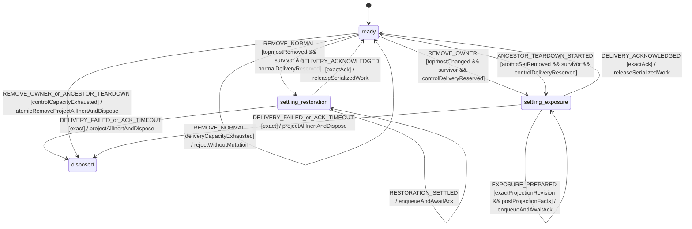

# Modal Focus Workflow Model

Source of truth for registry ownership, keyboard focus and causal close
handshakes on every MissionPulse surface that renders `aria-modal="true"`:

- `BackupRestoreModal`;
- `MissionComparison`;
- `MissionInvestigationDrawer`; and
- `KeyboardShortcutsHelp`.

The model owns focus only. Backup restoration, comparison, investigation and
shortcut-list content remain in their domain models. DOM and registry facts are
normalized signals; this deterministic workflow decides all focus, Tab,
Escape, close, restoration and modal-attribute effects.

## State, identities and context

```ts
type ModalSurface =
  'backup_restore' | 'mission_comparison' | 'mission_investigation' | 'keyboard_shortcuts_help';

type ModalFocusState =
  | 'closed'
  | 'registering'
  | 'opening_waiting_dom'
  | 'opening_background'
  | 'open'
  | 'busy'
  | 'busy_success_pending'
  | 'closing'
  | 'disposed';

type ModalCloseReason = 'explicit' | 'escape' | 'business_success';
type InitialFocusVariant =
  | 'backup_valid'
  | 'backup_error'
  | 'backup_validation_pending'
  | 'comparison'
  | 'investigation'
  | 'shortcuts_help';

interface CloseRequestIdentity {
  sessionNonce: string;
  ordinal: number;
  requestId: string;
}

interface CloseHandshake {
  identity: CloseRequestIdentity;
  reason: ModalCloseReason;
  resumeAfterReject: 'opening_waiting_dom' | 'open';
  ownerAcknowledged: boolean;
  removalToken: string | null;
}

interface ModalFocusContext {
  instanceId: string;
  ownerScopePath: readonly string[];
  surface: ModalSurface;
  variant: InitialFocusVariant | null;
  openSessionId: string | null;
  sessionNonce: string | null;
  registrationId: string | null;
  domRequestId: string | null;
  lastRegistryRevision: number;
  busyOperationId: string | null;
  deferredBusinessSuccessIdentity: CloseRequestIdentity | null;
  closeIdentityHighWatermark: number;
  recentCloseRequestIds: readonly string[];
  closeHandshake: CloseHandshake | null;
}

interface ModalFocusDomBinding {
  trigger: HTMLElement | null;
  dialog: HTMLElement;
}
```

The complete initial state is `closed` with configured non-empty `instanceId`,
`ownerScopePath` and `surface`; every nullable field is `null`,
`lastRegistryRevision=-1`, `closeIdentityHighWatermark=0`, and the bounded audit
ledger is empty. `OPEN` fills the session fields exactly once. There is no
implicit initial variant, registration or topmost value.

`instanceId`, `openSessionId`, `sessionNonce`, `registrationId`, DOM request IDs,
operation IDs and removal tokens are non-empty opaque IDs from distinct
domains. A `sessionNonce` is a fresh lowercase canonical UUID for every
mount/open session, so it contains no colon. The canonical close request string
is exactly:

```text
requestId = sessionNonce + ":" + decimal(ordinal)
```

`ordinal` is a safe positive integer. A fresh close identity has the current
session nonce, canonical string and `ordinal === closeIdentityHighWatermark + 1`.
This makes empty, crossed, skipped, duplicate and replayed identities
unrepresentable after normalization.

The reducer retains the high-water mark for the whole instance lifetime,
including owner rejection, blocked background input and busy-state input. It
also retains the 64 most recent request strings as a bounded audit ledger.
Evicting an audit entry does not permit replay because an older ordinal remains
below the non-decreasing high-water mark. At `Number.MAX_SAFE_INTEGER`, close
identity allocation fails closed with `CLOSE_ID_CAPACITY_EXHAUSTED`; it never
wraps.

State is owned only by the statechart. DOM handles remain in the Svelte action
and never enter Core or persistence. `disposed` is terminal for one action
instance.

## Shared registry actor

One module-local registry actor is the sole owner of modal order. Its context is
typed and contains a monotone `registryRevision`, an ordered stack of live
registrations, and at most one ancestor-teardown transaction.

```ts
interface RegistryEntry {
  registrationId: string;
  instanceId: string;
  surface: ModalSurface;
  ownerScopePath: readonly string[];
}

interface ModalRegistryContext {
  registryNonce: string;
  registryRevision: number;
  deliveryOrdinalHighWatermark: number;
  normalDeliverySlotsRemaining: number;
  controlDeliverySlotsRemaining: number;
  stack: readonly RegistryEntry[];
  consumedRegistrationIds: readonly string[];
  consumedDeliveryIds: readonly string[];
  teardown: {
    teardownId: string;
    scopePath: readonly string[];
    affectedRegistrationIds: readonly string[];
  } | null;
  restorationSettlement: {
    receiptId: string;
    deliveryId: string;
    acknowledgementToken: string;
    exposedRegistrationId: string;
    registryRevision: number;
    preparationId: string;
    phase: 'preparing' | 'awaiting-survivor-ack';
  } | null;
  exposureSettlement: {
    deliveryId: string;
    acknowledgementToken: string;
    cause:
      | { value: 'owner_unmount'; receiptId: string; teardownId: null }
      | { value: 'ancestor_teardown'; receiptId: null; teardownId: string };
    exposedRegistrationId: string;
    registryRevision: number;
    preparationId: string;
    phase: 'preparing' | 'awaiting-survivor-ack';
  } | null;
}

interface RegistrySnapshot {
  registryRevision: number;
  topmostRegistrationId: string | null;
  activeTeardownId: string | null;
}

type RemovalCause = 'normal_close' | 'owner_unmount' | 'ancestor_teardown';

interface RegistryRemovalReceipt {
  receiptId: string;
  registrationId: string;
  registryRevision: number;
  cause: RemovalCause;
  wasTopmostAtRemoval: boolean;
  exposedRegistrationId: string | null;
  topmostNotification: 'after_restore' | 'without_restore' | 'suppressed';
  teardownId: string | null;
}

interface RegistryRegistrationCancellationReceipt {
  receiptId: string;
  registrationId: string;
  instanceId: string;
  ownerScopePath: readonly string[];
  registryRevision: number;
  disposition: 'cancelled_before_append';
}

interface RegistryRegistrationRejectionReceipt {
  receiptId: string;
  registrationId: string;
  instanceId: string;
  ownerScopePath: readonly string[];
  registryRevision: number;
  reason: 'DUPLICATE_ID' | 'TEARDOWN_ACTIVE' | 'CAPACITY_EXHAUSTED';
  disposition: 'rejected_tombstoned';
  authorityRevoked: true;
}

interface RegistryNormalRemovalRejectionReceipt {
  receiptId: string;
  registrationId: string;
  registryRevision: number;
  reason: 'DELIVERY_CAPACITY_EXHAUSTED';
  disposition: 'not_removed';
}

interface RegistryDeliveryAcknowledgement {
  version: 1;
  deliveryId: string;
  acknowledgementToken: string;
  preparationId: string;
  exposedRegistrationId: string;
  registryRevision: number;
  survivorOutcome: 'interactive_ready' | 'deferred_close_requested';
}

interface RegistryDeliveryFailure {
  version: 1;
  deliveryId: string;
  acknowledgementToken: string;
  preparationId: string;
  exposedRegistrationId: string;
  registryRevision: number;
  reason:
    | 'SURVIVOR_REDUCTION_REJECTED'
    | 'PROJECTION_FAILED'
    | 'FOCUS_FAILED'
    | 'DEFERRED_CLOSE_EFFECT_FAILED'
    | 'ACK_TIMEOUT';
}

type ModalRegistryState = 'ready' | 'settling_restoration' | 'settling_exposure' | 'disposed';

declare const modalOwnerAuthorityBrand: unique symbol;

interface ModalOwnerAuthority {
  readonly [modalOwnerAuthorityBrand]: true;
}

type ModalRegistryOwnerCommand =
  | {
      type: 'REGISTER';
      entry: RegistryEntry;
      authority: ModalOwnerAuthority;
    }
  | {
      type: 'REMOVE_OWNER';
      registrationId: string;
      instanceId: string;
      ownerScopePath: readonly string[];
      authority: ModalOwnerAuthority;
    };

type ModalRegistrySettlementEvent =
  | { type: 'DELIVERY_ACKNOWLEDGED'; acknowledgement: RegistryDeliveryAcknowledgement }
  | { type: 'DELIVERY_FAILED'; failure: RegistryDeliveryFailure }
  | {
      type: 'DELIVERY_ACK_TIMEOUT';
      failure: RegistryDeliveryFailure & { reason: 'ACK_TIMEOUT' };
    };
```

The registry accepts at most 16 simultaneous live entries and 4,096 total
registration IDs during one panel registry lifetime. Registration evidence
never evicts; exhaustion permanently closes the registration gate for that
registry lifetime. A fresh panel document creates a new registry only after all
old actions/listeners are disposed. Thus removing or rejecting an entry never
authorizes reuse of its registration ID.

Delivery capacity is partitioned at registry construction into 4,032 normal
slots and a pre-reserved 64-slot control lane used only by non-cancellable
owner/ancestor teardown. `registryNonce` is a fresh canonical UUID and every
allocated delivery is:

```text
deliveryId = registryNonce + ":delivery:" + decimal(deliveryOrdinal)
preparationId = deliveryId + ":prepare"
acknowledgementToken = deliveryId + ":ack"
```

The safe ordinal is allocated by the registry as
`deliveryOrdinalHighWatermark + 1`; the selected lane is decremented and the ID
is appended to the non-evicting 4,096-entry consumed ledger before any stack
mutation. An ID remains consumed after success, failure or timeout. Normal
capacity exhaustion rejects a cancellable normal removal without mutation.
Control-lane exhaustion cannot cancel owner unmount or ancestor teardown: in
the same atomic registry transaction it performs the mandatory removal, keeps
every survivor inert, disposes the registry and its keyboard listener, and
dispatches typed disposal to all surviving bindings. No state exists in which
suppression has occurred but exposure capacity is undecided.

Every owner and teardown boundary calls the same
`parseCanonicalScopePath(unknown)` function. It accepts only a plain array of
1–32 strings. Each segment is normalized with Unicode NFC, then rejected if it
is empty, exceeds 128 UTF-16 code units, or contains any Unicode `White_Space`,
`General_Category=Cc` or `General_Category=Cf` code point, including bidi
controls and zero-width format characters. The result is a deeply frozen
canonical array. Registration binding, `REGISTER`, `REMOVE_OWNER` and
`ANCESTOR_TEARDOWN_STARTED` compare only those canonical segments. Prefix
comparison is segment by segment; a string prefix such as `feed/1` never
matches `feed/10`. Invalid, non-canonical-on-revalidation or oversized paths
are rejected before registry mutation.

```ts
declare function parseCanonicalScopePath(input: unknown): readonly string[];
```

The complete registry initial state is `ready` at revision `-1`, delivery
high-water `0`, 4,032 normal slots, 64 control slots, an empty stack, empty
consumed-ID ledgers, and null teardown/restoration/exposure settlement.
Restoration and exposure settlements are mutually exclusive. The first
successful registration publishes revision `0`. Every later stack mutation
strictly increments the safe revision; read-only snapshots may repeat it.

Registry transitions are total:

| Registry event                                               | Guard and atomic result                                                                                                                                                                                                                                                                                                                |
| ------------------------------------------------------------ | -------------------------------------------------------------------------------------------------------------------------------------------------------------------------------------------------------------------------------------------------------------------------------------------------------------------------------------- |
| `REGISTER(entry, authority)`                                 | exact Shell authority bound to the canonical tuple, all IDs fresh and no affected teardown; append once, increment revision, broadcast position snapshot. Any rejection first revokes that authority and tombstones the proposed ID (or confirms its existing tombstone), then returns an authenticated rejection receipt              |
| `REMOVE_NORMAL(registrationId, token)`                       | exact owner-acknowledged removal capability; if topmost removal would expose a survivor, reserve one normal delivery ID before mutation or return `not_removed`; after reservation remove once, return the receipt and enter `settling_restoration`                                                                                    |
| `RESTORATION_SETTLED(receiptId, outcome, preparationId)`     | exact preparing normal-topmost settlement; outcome is `restored` or `skipped`; enqueue the causally linked `TOPMOST_RESTORED`, change phase to `awaiting-survivor-ack`, and remain locked                                                                                                                                              |
| `REMOVE_OWNER(registrationId, instanceId, scope, authority)` | exact authority and canonical tuple; pre-reserve control delivery when an appended topmost removal will expose a survivor, then remove once. A pre-append winner tombstones the ID and revokes authority. If control capacity is unavailable, perform removal and fail-closed disposal atomically; otherwise enter `settling_exposure` |
| `ANCESTOR_TEARDOWN_STARTED(teardownId, scope)`               | validate the canonical path and compute the complete affected set/survivor; pre-reserve one control delivery if final exposure is required; atomically remove the set and issue suppressed receipts. With capacity enter one final `settling_exposure`; without it atomically keep survivors inert and dispose the registry            |
| `EXPOSURE_PREPARED(deliveryId, preparationId, facts)`        | exact preparing cause, exposed registration and post-removal revision; accept facts captured only after the exact dialog was projected interactive, enqueue one causally bound `TOPMOST_EXPOSED`, change phase to `awaiting-survivor-ack`, and remain locked                                                                           |
| `DELIVERY_ACKNOWLEDGED(ack)`                                 | exact active delivery/token/preparation/exposed registration/revision and typed survivor outcome; only after the survivor reduction and its ordered projection/focus/deferred-close effects succeeded, consume the ACK, clear settlement and return to `ready`                                                                         |
| `DELIVERY_FAILED(failure)` / `DELIVERY_ACK_TIMEOUT(failure)` | exact active settlement correlation; atomically project every binding inert/hidden, disable keyboard dispatch, clear live stack and settlements, enter terminal `disposed`, and dispatch `REGISTRY_DISPOSED`; a stale failure/timeout is a no-op                                                                                       |
| command or keyboard input while settling                     | serialized behind the active settlement, including the interval after delivery enqueue and before ACK; no `REGISTER`, Tab, Escape, remove or teardown mutation interleaves                                                                                                                                                             |
| stale/duplicate register, remove, delivery or ACK            | typed rejection/no-op; stack and revision unchanged                                                                                                                                                                                                                                                                                    |

The atomic receipt, not an earlier close request or acknowledgement, is the
authority for `wasTopmostAtRemoval`. Therefore a new modal registered between
close request, owner acknowledgement and DOM removal makes the old instance a
background removal: it unregisters without restoring focus and without waking
another instance.

`ModalOwnerAuthority` and `ModalRegistryOwnerCommand` belong only to the Shell
registry adapter; despite being documented here, neither type is imported into
Pure Core. The trusted modal binding factory creates the opaque authority and a
private `WeakMap<ModalOwnerAuthority, CanonicalOwnerBinding>` authenticates it
by object identity. Before either command can be queued, the factory binds the
authority once to the exact `(instanceId, registrationId,
parseCanonicalScopePath(ownerScopePath))` tuple.

Core's pure `register-modal` effect contains only `RegistryEntry`. The shared
Svelte action, which already owns the local authority, enriches that effect into
the typed Shell `REGISTER(entry, authority)` command. Unmount emits the typed
Shell `REMOVE_OWNER` command directly; it is not a Core event/effect. Neither
path accepts authority from component props, serialized data or a string. If
`REMOVE_OWNER` wins registry serialization before append, the authenticated
pending binding creates the cancellation tombstone. The later `REGISTER` for
that exact tuple is rejected; crossed authority cannot create the tombstone or
revive the consumed ID.

A rejected `REGISTER` executes its security settlement before returning: the
registry deletes the rejected authority from the private `WeakMap`, appends a
fresh proposed registration ID to the consumed ledger (or observes that a
duplicate is already consumed), and returns a
`RegistryRegistrationRejectionReceipt`. If registration capacity is already
closed, the permanent closed gate is the tombstone for every later proposed ID.
Only that exact receipt may drive the action instance to `disposed`. Binding
disposal and listener removal happen before `onOpenAborted`; a missing or
throwing callback can be reported but cannot restore authority, reuse the ID or
keep the action outside `disposed`.

For a normal topmost removal, the registry's trusted DOM coordinator first
projects the exact `exposedRegistrationId` interactive while every other live
registration remains inert. This preparation and the synchronous restoration
attempt run inside the serialized restoration settlement: no keyboard event or
registry command can interleave. When an exposed registration exists, the
trigger is restorable only if it is contained by that exact exposed dialog;
otherwise restoration is `skipped`. The registry then emits one
`TOPMOST_RESTORED(restored|skipped)` to the exposed registration. A skipped
delivery carries a fresh normalized recovery capture; a restored delivery
carries `recoveryFacts=null` and cannot move focus again. A normal background
removal emits no such event.

Owner unmount and ancestor teardown never restore a trigger. After their atomic
removal transaction, the registry computes the single surviving topmost entry.
If one exists and the removal changed which entry is topmost, it enters
`settling_exposure`; otherwise it emits no exposure. Ancestor teardown emits
all affected receipts with `topmostNotification='suppressed'` and
`exposedRegistrationId=null` before this step and never wakes an entry between
removals. Its one final exposure is causally bound to `teardownId`; owner
unmount exposure is bound to its removal `receiptId`.

Inside `settling_exposure`, registry commands and keyboard dispatch are held.
The coordinator first verifies the exact exposed registration and post-removal
revision, then projects only that dialog interactive while every other live
dialog stays inert. Only after this projection may it capture normalized
recovery facts; capturing a dialog while it is inert/hidden is invalid. It
returns `EXPOSURE_PREPARED` with the exact preparation ID, and the registry
enqueues exactly one `TOPMOST_EXPOSED` but remains locked in
`awaiting-survivor-ack`. The receiving Core reduction accepts the prepared
projection, applies its recovery focus and, for `busy_success_pending`, invokes
the deferred owner-close effect. Only after those ordered effects succeed does
the shared action return the exact `RegistryDeliveryAcknowledgement`; only its
reduction releases keyboard and queued registry work. This sequence also
applies when the survivor is
`busy_success_pending`: it receives the one final causal exposure and may then
request its deferred business close. An affected Backup is disposed by its
suppressed teardown receipt and never wakes during destruction.

For a normal topmost receipt the registry enters a typed
`settling_restoration(receiptId)` substate. The trusted coordinator prepares
the exact exposed binding, performs the synchronous focus attempt and
immediately returns `RESTORATION_SETTLED(restored|skipped)`; only that
transition enqueues the corresponding one-shot delivery and moves to
`awaiting-survivor-ack`; it does not release the settlement. The prepared
binding must match the receipt's exposed registration and post-removal
revision. Registry commands and keyboard dispatch remain serialized until the
exact survivor ACK, so a later `REGISTER`, Tab or Escape cannot interleave. A
registration already ahead of the closing instance is reflected by
`wasTopmostAtRemoval=false` and receives no restoration effect.

The parallel `settling_exposure(exposureId)` substate is mandatory for owner
unmount and final ancestor-teardown exposure. The exact ordering is
`atomic removal -> interactive projection -> recovery capture -> one-shot
delivery -> survivor reduction -> ordered projection/focus/deferred-close
effects -> exact ACK -> release keyboard`. No recovery parser is asked to
validate facts from an inert dialog, and no ordinary position snapshot can
bypass the settlement.

The registry arms an ACK supervisor when it enqueues either delivery. The
supervisor can emit only the exact active `DELIVERY_ACK_TIMEOUT` tuple. A
survivor reduction rejection or any ordered effect failure emits the same tuple
as `DELIVERY_FAILED` with its typed reason. Both paths atomically fail closed to
terminal registry disposal; they never unlock a partially exposed survivor.

## Normalized DOM facts and Core decisions

The Shell queries the DOM, assigns stable per-capture target IDs, and passes a
closed normalized value to Core. DOM nodes themselves never cross the boundary.

```ts
interface InitialFocusFacts {
  captureId: string;
  containerTargetId: string;
  confirmationInputTargetId: string | null;
  closeButtonTargetId: string | null;
  cancelButtonTargetId: string | null;
  firstEnabledButtonTargetId: string | null;
  firstMissionLinkTargetId: string | null;
  firstEnabledActionTargetId: string | null;
  acknowledgementButtonTargetId: string | null;
}

interface TabDomFacts {
  captureId: string;
  containerTargetId: string;
  activeTargetId: string | null;
  orderedFocusableTargetIds: readonly string[];
}

type TabDecision =
  | { kind: 'ignore'; preventDefault: false; targetId: null }
  | { kind: 'allow-native'; preventDefault: false; targetId: null }
  | { kind: 'defer-opening'; preventDefault: true; targetId: null }
  | { kind: 'focus'; preventDefault: true; targetId: string };

declare function decideInitialFocus(
  variant: InitialFocusVariant,
  facts: Readonly<InitialFocusFacts>
): string;

declare function decideTab(
  state: ModalFocusState,
  isTopmost: boolean,
  backwards: boolean,
  facts: Readonly<TabDomFacts>
): TabDecision;
```

The normalized fact parser proves unique non-empty target IDs, that the
container and every non-null typed slot are in the capture table, that every
focusable belongs to the dialog, and that `activeTargetId` is either in that
table or `null` for outside. The Shell labels DOM facts by semantic slot but
cannot supply a preferred/fallback ordering; `decideInitialFocus` owns that
ordering from `variant`. Each surface adapter has a fixed, reviewable slot-to-DOM
contract; components cannot relabel an arbitrary node as a preferred control. A
candidate is connected, rendered, enabled, outside hidden/inert ancestors and
keyboard-focusable. `tabindex="-1"` is excluded from Tab order but is allowed
for the explicit container fallback.

`decideTab` is exhaustive:

The reducer computes its `isTopmost` argument itself from the authenticated
registry snapshot and its own `registrationId`; the Shell cannot pass that
boolean directly.

| State/position                              | Decision                                                 |
| ------------------------------------------- | -------------------------------------------------------- |
| any non-topmost registration                | `ignore`                                                 |
| topmost `registering`/opening state         | `defer-opening`; suppress Tab until correlated readiness |
| topmost interactive state with no focusable | focus container                                          |
| active target outside the Tab order         | focus first item in either direction                     |
| forward Tab on last                         | focus first                                              |
| backward Tab on first                       | focus last                                               |
| one focusable                               | focus that item                                          |
| intermediate item                           | `allow-native`                                           |

Interactive means `open`, `busy`, `busy_success_pending` or `closing`; the
focus trap remains active until registry removal. Core alone chooses both
`preventDefault` and `targetId`. The Shell resolves the chosen ID only against
the exact captured table and executes that decision; it never recomputes the
focusable order or chooses a fallback. If a target disappears before execution,
the Shell still prevents default and dispatches `DOM_FACTS_INVALIDATED` to
request a new capture. This is fail-closed and does not create a second Tab
authority.

## Events

```ts
type ModalFocusEvent =
  | {
      type: 'OPEN';
      variant: InitialFocusVariant;
      openSessionId: string;
      sessionNonce: string;
      registrationId: string;
      domRequestId: string;
    }
  | {
      type: 'OPEN_REJECTED';
      reason:
        | 'INVALID_SURFACE_VARIANT'
        | 'INVALID_ID'
        | 'INVALID_SCOPE'
        | 'CROSSED_SESSION'
        | 'CAPACITY_EXHAUSTED';
    }
  | { type: 'REGISTRY_REGISTERED'; registrationId: string; snapshot: RegistrySnapshot }
  | {
      type: 'REGISTRY_REGISTRATION_REJECTED';
      receipt: RegistryRegistrationRejectionReceipt;
    }
  | {
      type: 'REGISTRY_POSITION_CHANGED';
      registrationId: string;
      snapshot: RegistrySnapshot;
    }
  | {
      type: 'DOM_READY';
      registrationId: string;
      domRequestId: string;
      snapshot: RegistrySnapshot;
      facts: InitialFocusFacts;
    }
  | {
      type: 'DOM_FACTS_INVALIDATED';
      registrationId: string;
      captureId: string;
      nextDomRequestId: string;
      snapshot: RegistrySnapshot;
    }
  | { type: 'TAB'; backwards: boolean; snapshot: RegistrySnapshot; facts: TabDomFacts }
  | { type: 'ESCAPE'; identity: CloseRequestIdentity; snapshot: RegistrySnapshot }
  | { type: 'EXPLICIT_CLOSE'; identity: CloseRequestIdentity; snapshot: RegistrySnapshot }
  | { type: 'BACKUP_BUSY_STARTED'; operationId: string; snapshot: RegistrySnapshot }
  | { type: 'BACKUP_BUSY_SETTLED'; operationId: string; outcome: 'failed' | 'cancelled' }
  | {
      type: 'BACKUP_BUSY_SETTLED';
      operationId: string;
      outcome: 'succeeded';
      identity: CloseRequestIdentity;
      snapshot: RegistrySnapshot;
    }
  | {
      type: 'TOPMOST_RESTORED';
      restorationId: string;
      acknowledgementToken: string;
      preparationId: string;
      exposedRegistrationId: string;
      receiptId: string;
      snapshot: RegistrySnapshot;
      outcome: 'restored' | 'skipped';
      recoveryFacts: InitialFocusFacts | null;
    }
  | ({
      type: 'TOPMOST_EXPOSED';
      exposureId: string;
      acknowledgementToken: string;
      preparationId: string;
      exposedRegistrationId: string;
      snapshot: RegistrySnapshot;
      recoveryFacts: InitialFocusFacts;
    } & (
      | { cause: 'owner_unmount'; receiptId: string; teardownId: null }
      | { cause: 'ancestor_teardown'; receiptId: null; teardownId: string }
    ))
  | { type: 'OWNER_CLOSE_ACKNOWLEDGED'; requestId: string; removalToken: string }
  | {
      type: 'OWNER_CLOSE_REJECTED';
      requestId: string;
      nextDomRequestId: string;
    }
  | {
      type: 'DIALOG_REMOVED';
      requestId: string;
      removalToken: string;
      receipt: RegistryRemovalReceipt;
    }
  | {
      type: 'REGISTRY_NORMAL_REMOVAL_REJECTED';
      requestId: string;
      receipt: RegistryNormalRemovalRejectionReceipt;
    }
  | {
      type: 'PARENT_UNMOUNTED';
      receipt: RegistryRemovalReceipt | RegistryRegistrationCancellationReceipt | null;
    }
  | { type: 'ANCESTOR_TEARDOWN_RECEIPT'; receipt: RegistryRemovalReceipt }
  | {
      type: 'REGISTRY_DISPOSED';
      reason: 'CONTROL_DELIVERY_CAPACITY_EXHAUSTED' | RegistryDeliveryFailure['reason'];
    };
```

Only the registry actor can create registry snapshots, removal/rejection
receipts, delivery reservations and acknowledgement tokens. The event boundary
validates monotone registry revisions and exact registration, receipt,
delivery, preparation, acknowledgement, teardown, request and removal-token
correlations. A caller-supplied boolean such as `isTopmost` is forbidden.

Equal registry revisions are allowed for several facts captured from the same
stack state; a lower revision is stale. For keyboard events, the shared listener
captures the registry snapshot, normalized DOM facts, Core reduction and effect
decision in one JavaScript task before another registry command can run. For
`DOM_READY`, the registry attaches its current snapshot at dispatch, so a DOM
callback cannot replay a previously topmost observation after nesting changes.

`restorationId` and `exposureId` are registry-allocated one-shot delivery IDs.
Each is bound to its exact cause, exposed registration, preparation and
post-removal registry revision before enqueue: restoration and owner exposure
bind a removal receipt ID, while ancestor exposure binds the completed teardown
ID and requires `receiptId=null`. For a restoration delivery,
`recoveryFacts` is null exactly when the coordinator proved `restored`; it is a
fresh valid capture exactly when the outcome is `skipped`. An exposure delivery
always carries a fresh valid post-preparation capture because teardown exposure
never restores focus. The consumed-delivery ledger is updated atomically;
crossed, duplicate, malformed or capacity-exhausted delivery events are typed
no-ops and can never release a deferred business close.

The delivery also carries its exact `acknowledgementToken`, `preparationId`,
exposed registration and registry revision. Enqueue consumes the delivery ID
but does not complete settlement. Only a matching
`RegistryDeliveryAcknowledgement` after the receiver's ordered effect barrier
unlocks it. Duplicate/crossed ACKs and stale timeout/failure tuples are no-ops;
the matching timeout/failure takes the registry only to fail-closed `disposed`.

Every event carrying `CloseRequestIdentity` first passes through the pure close
identity gate, before any state/topmost/business guard. A valid fresh identity
is consumed and recorded even if the instance is background, busy, closing or
the busy operation ID is stale. Invalid/empty/crossed/replayed identities reduce
to a typed no-op and can never invoke the owner. This two-stage reduction is
what preserves at-most-once behavior after an owner rejection.

Core outputs only typed effects:

```ts
type ModalFocusEffect =
  | { type: 'register-modal'; entry: RegistryEntry }
  | {
      type: 'abort-modal-open';
      instanceId: string;
      reason: 'input_rejected' | 'registry_rejected';
    }
  | { type: 'request-dom-capture'; registrationId: string; domRequestId: string }
  | {
      type: 'project-modal';
      registrationId: string;
      inert: boolean;
      ariaHidden: boolean;
      ariaModal: boolean;
    }
  | { type: 'apply-initial-focus'; captureId: string; targetId: string }
  | { type: 'apply-tab-decision'; captureId: string; decision: TabDecision }
  | { type: 'request-owner-close'; requestId: string; reason: ModalCloseReason }
  | {
      type: 'complete-topmost-delivery';
      acknowledgement: RegistryDeliveryAcknowledgement;
      ordering: 'after_projection_focus_and_optional_deferred_close';
    }
  | {
      type: 'restore-trigger';
      receiptId: string;
      settleRegistryWith: 'RESTORATION_SETTLED';
    }
  | { type: 'dispose-modal-binding'; registrationId: string | null }
  | {
      type: 'report-modal-focus-error';
      code:
        | 'MODAL_INPUT_REJECTED'
        | 'REGISTRY_REJECTED'
        | 'DOM_FACTS_INVALID'
        | 'CLOSE_ID_INVALID'
        | 'CLOSE_ID_REPLAYED'
        | 'CLOSE_ID_CAPACITY_EXHAUSTED';
    };
```

Effects contain no callback result or caller-selected focus policy. Each
command/result is correlated by the IDs shown above.
`complete-topmost-delivery` is an ordered effect barrier, not permission to ACK
early: the action sends its payload to the registry only after all preceding
Core-selected projection/focus effects and any deferred owner-close invocation
return successfully. It sends the exact correlated `DELIVERY_FAILED` instead
if one fails.

## Statechart

```mermaid
stateDiagram-v2
  [*] --> closed
  closed --> registering: OPEN [validSurfaceVariantAndFreshIds] / register
  closed --> disposed: OPEN_REJECTED / abortOpenAndReportTypedInputError
  registering --> opening_waiting_dom: REGISTRY_REGISTERED [matching] / projectInertAndRequestDom
  registering --> disposed: REGISTRY_REGISTRATION_REJECTED [matchingRevokedTombstoneReceipt] / disposeBindingThenAbortAndReport

  opening_waiting_dom --> open: DOM_READY [matching && topmostNow] / projectModalAndFocusCoreTarget
  opening_waiting_dom --> opening_background: DOM_READY [matching && !topmostNow] / remainInert
  opening_waiting_dom --> opening_background: REGISTRY_POSITION_CHANGED [matching && !topmostNow] / invalidateDomRequestAndRemainInert
  opening_waiting_dom --> opening_waiting_dom: TAB [topmostNow] / applyCoreDeferDecision
  opening_waiting_dom --> closing: ESCAPE [freshConsumed && topmostNow] / requestOwnerClose
  opening_waiting_dom --> closing: EXPLICIT_CLOSE [freshConsumed && topmostNow] / requestOwnerClose

  opening_background --> open: TOPMOST_RESTORED [matchingNormalReceipt && topmostNow && restored] / acceptPreparedProjectionThenAck
  opening_background --> open: TOPMOST_RESTORED [matchingNormalReceipt && topmostNow && skipped && validRecoveryFacts] / applyRecoveryFocusThenAck
  opening_background --> open: TOPMOST_EXPOSED [matchingOwnerOrTeardownCause && topmostNow && validPostPreparationFacts] / applyRecoveryFocusThenAck
  opening_background --> opening_background: TAB / applyCoreIgnoreDecision
  opening_background --> opening_background: ESCAPE, EXPLICIT_CLOSE / consumeWithoutOwnerCallback

  open --> open: TAB / applyCoreTabDecision
  open --> closing: ESCAPE [freshConsumed && topmostNow] / requestOwnerClose
  open --> closing: EXPLICIT_CLOSE [freshConsumed && topmostNow] / requestOwnerClose
  open --> busy: BACKUP_BUSY_STARTED [topmostNow && backupSurface && freshOperation]

  busy --> busy: TAB / applyCoreTabDecision
  busy --> open: BACKUP_BUSY_SETTLED(failed|cancelled) [matchingBusyOperation]
  busy --> closing: BACKUP_BUSY_SETTLED(succeeded) [freshConsumed && matchingBusyOperation && topmostNow] / requestOwnerClose
  busy --> busy_success_pending: BACKUP_BUSY_SETTLED(succeeded) [freshConsumed && matchingBusyOperation && !topmostNow] / storeDeferredClose
  busy --> busy: ESCAPE, EXPLICIT_CLOSE / consumeWithoutOwnerCallback

  busy_success_pending --> busy_success_pending: TAB / applyCoreTabDecision
  busy_success_pending --> closing: TOPMOST_RESTORED [matchingNormalReceipt && topmostNow && restored && hasDeferredClose] / acceptProjectionRequestDeferredCloseThenAck
  busy_success_pending --> closing: TOPMOST_RESTORED [matchingNormalReceipt && topmostNow && skipped && validRecoveryFacts && hasDeferredClose] / focusRequestDeferredCloseThenAck
  busy_success_pending --> closing: TOPMOST_EXPOSED [matchingOwnerOrTeardownCause && topmostNow && validPostPreparationFacts && hasDeferredClose] / focusRequestDeferredCloseThenAck
  busy_success_pending --> busy_success_pending: ESCAPE, EXPLICIT_CLOSE / consumeWithoutOwnerCallback

  closing --> closing: TAB / applyCoreTabDecision
  closing --> closing: OWNER_CLOSE_ACKNOWLEDGED [matchingUnacknowledged] / storeRemovalToken
  closing --> opening_waiting_dom: OWNER_CLOSE_REJECTED [matching && resumeOpening] / retainConsumedIdAndRequestFreshDom
  closing --> open: OWNER_CLOSE_REJECTED [matching && resumeOpen] / retainConsumedId
  closing --> open: REGISTRY_NORMAL_REMOVAL_REJECTED [matchingNotRemoved] / retainConsumedIdAndReportCapacity
  closing --> disposed: DIALOG_REMOVED [acknowledgedNormalReceipt] / settleRemovalByPosition

  registering --> disposed: PARENT_UNMOUNTED / settleUnmountReceipt
  opening_waiting_dom --> disposed: PARENT_UNMOUNTED / settleUnmountReceipt
  opening_background --> disposed: PARENT_UNMOUNTED / settleUnmountReceipt
  open --> disposed: PARENT_UNMOUNTED / settleUnmountReceipt
  busy --> disposed: PARENT_UNMOUNTED / settleUnmountReceipt
  busy_success_pending --> disposed: PARENT_UNMOUNTED / settleUnmountReceipt
  closing --> disposed: PARENT_UNMOUNTED / settleUnmountReceipt
  registering --> disposed: ANCESTOR_TEARDOWN_RECEIPT / settleSuppressedTeardownReceipt
  opening_waiting_dom --> disposed: ANCESTOR_TEARDOWN_RECEIPT / settleSuppressedTeardownReceipt
  opening_background --> disposed: ANCESTOR_TEARDOWN_RECEIPT / settleSuppressedTeardownReceipt
  open --> disposed: ANCESTOR_TEARDOWN_RECEIPT / settleSuppressedTeardownReceipt
  busy --> disposed: ANCESTOR_TEARDOWN_RECEIPT / settleSuppressedTeardownReceipt
  busy_success_pending --> disposed: ANCESTOR_TEARDOWN_RECEIPT / settleSuppressedTeardownReceipt
  closing --> disposed: ANCESTOR_TEARDOWN_RECEIPT / settleSuppressedTeardownReceipt
  registering --> disposed: REGISTRY_DISPOSED / disposeBindingFailClosed
  opening_waiting_dom --> disposed: REGISTRY_DISPOSED / disposeBindingFailClosed
  opening_background --> disposed: REGISTRY_DISPOSED / disposeBindingFailClosed
  open --> disposed: REGISTRY_DISPOSED / disposeBindingFailClosed
  busy --> disposed: REGISTRY_DISPOSED / disposeBindingFailClosed
  busy_success_pending --> disposed: REGISTRY_DISPOSED / disposeBindingFailClosed
  closing --> disposed: REGISTRY_DISPOSED / disposeBindingFailClosed
  closed --> disposed: PARENT_UNMOUNTED
```



The registry actor serializes restoration and exposure independently of each
modal's business state:



No registry command or keyboard dispatch crosses either settling state,
including either `awaiting-survivor-ack` phase. For an
ancestor transaction, the `ready -> settling_exposure` edge occurs only after
the entire affected set and all suppressed receipts have been committed; there
is no edge per affected registration.

All unlisted or stale events are explicit no-ops. A fresh registry snapshot is
stored before deriving the modal projection. Registering a newer topmost entry
causes every prior entry to project inert/background immediately.

The following cross-cutting transitions preserve the current business state:

| Event / condition                                       | Core transition/effect                                                                                                                                            |
| ------------------------------------------------------- | ----------------------------------------------------------------------------------------------------------------------------------------------------------------- |
| fresh `REGISTRY_POSITION_CHANGED`, instance not topmost | ready states retain business state and become inert; `opening_waiting_dom` invalidates its DOM request and enters background                                      |
| fresh `REGISTRY_POSITION_CHANGED`, instance is topmost  | never exposes a background instance; retain inert projection until a causally matched restoration/exposure delivery                                               |
| matching normal `TOPMOST_RESTORED(restored)`            | retain business state and accept the registry-prepared interactive projection; do not move focus again                                                            |
| matching normal `TOPMOST_RESTORED(skipped)`             | retain business state, consume the unique delivery, project interactive and apply Core recovery focus from the attached facts                                     |
| matching owner/ancestor `TOPMOST_EXPOSED`               | retain business state, consume the unique final delivery, accept the prepared interactive projection and apply Core recovery focus from its post-projection facts |
| matching `DOM_FACTS_INVALIDATED`                        | retain business state, consume `nextDomRequestId`; when topmost request a fresh capture, otherwise wait for topmost                                               |
| matching recovery `DOM_READY` in an already-ready state | if topmost, apply the new Core initial-focus target; if background, remain inert and consume no focus effect                                                      |

`busy_success_pending` is the one exception to state preservation on a causal
topmost delivery: normal `TOPMOST_RESTORED`, owner-unmount `TOPMOST_EXPOSED` or
final ancestor-teardown `TOPMOST_EXPOSED` first accepts restored focus or
applies Core recovery focus, then enters `closing` and requests its stored
business close in the same reduction.
An ordinary position event cannot synthesize that transition. Ancestor teardown
emits no intermediate delivery and at most one final exposure delivery to the
survivor outside its removed scope.

`PARENT_UNMOUNTED` is a registry settlement, not a second unregister command.
An appended registration requires a `RegistryRemovalReceipt` with
`cause='owner_unmount'` and exact registration. An unmount racing registration
requires the exact authenticated `cancelled_before_append` receipt, including
the current instance and exact normalized owner scope; the registry consumes
that registration ID before returning it, so a queued late `REGISTER` is
rejected. A null receipt is valid only while `closed`, where no registration
command was ever emitted. Every other active state requires one of those exact
non-null receipts.
`ANCESTOR_TEARDOWN_RECEIPT` requires the exact active teardown ID,
`cause='ancestor_teardown'` and `topmostNotification='suppressed'`.

An input or registry rejection happens before the instance can become an
interactive modal. For a registry rejection, the authenticated receipt proves
authority revocation and registration tombstoning before Core enters
`disposed`; the action then removes its binding/listeners and projects the
dialog `inert`, `aria-hidden=true`, `aria-modal=false` before invoking
`onOpenAborted`. Input rejection follows the same visual/disposal ordering but
has no registry authority to revoke. A throwing or missing callback is reported
after disposal and cannot change it; no rejected registration may remain
visible, registered, authoritative or reusable.

## Executable opening policy

From registration until a matching `DOM_READY` proves the instance is current
topmost, the dialog projection is:

```text
inert = true
aria-hidden = "true"
aria-modal = "false"
keyboard owner = registry topmost entry, with Tab suppressed
```

`DOM_READY` is correlated by both `registrationId` and `domRequestId`. The
registry attaches its current snapshot atomically when dispatching the event.
If that snapshot says the instance is topmost, Core selects the initial target,
the action removes inert/hidden, sets `aria-modal="true"`, and focuses the exact
Core target. If a nested modal is already topmost, the event moves the instance
to `opening_background` without focus.

A later normal removal of the nested modal sends `TOPMOST_RESTORED` only after
its restoration step. A restored trigger is already inside the causally exposed
dialog, so an opening-background instance becomes `open` without moving focus a
second time. If restoration was skipped, the delivery carries a fresh normalized
capture made after exposure and Core chooses the recovery target. Facts from the
earlier opening tick are never reused. Escape during topmost opening follows the
normal close handshake; Tab is prevented and deferred. Neither key can leak to
page content.

## Causal close and removal handshake

1. The identity gate validates and permanently consumes the close identity.
2. A permitted topmost transition stores the identity and invokes the owner
   once with `{ requestId, reason }`.
3. The owner either rejects or acknowledges with a fresh removal token before
   changing visibility. Rejection clears the handshake but not the identity
   high-water mark or audit ledger.
4. If the removal would expose a survivor, the registry reserves the applicable
   normal/control delivery identity before atomically removing the exact
   registration. A cancellable normal close is rejected without mutation when
   reservation fails; non-cancellable teardown fails closed atomically.
5. A matching `normal_close` receipt from a topmost removal may restore the
   still-valid trigger after the exact exposed dialog has been prepared
   interactive. With an exposed modal, containment by that dialog is mandatory;
   otherwise restoration is skipped and Core applies recovery focus. A
   background normal removal unregisters without focus movement.
   Owner/ancestor teardown never restores.
6. `TOPMOST_RESTORED`, when allowed, is delivered only after restoration and
   carries the causative receipt ID. Duplicate receipts, removal tokens,
   acknowledgements and restoration events are stale no-ops. Owner unmount and
   completed ancestor teardown use the distinct one-shot `TOPMOST_EXPOSED`
   delivery after serialized interactive preparation and never claim
   restoration.
7. The registry remains locked after delivery enqueue. Only the exact ACK sent
   after survivor reduction, projection/focus and any deferred-close invocation
   releases it. Matching failure/timeout disposes fail closed; Tab, Escape and
   `REGISTER` cannot interleave.

A trigger is restorable only while connected, enabled, non-inert after the
registry-owned preparation, and in the same live document. When a modal is
exposed, the trigger must also be contained by its exact dialog binding. No
Shell-selected fallback is guessed: `skipped`, owner-unmount exposure and final
ancestor exposure carry fresh post-preparation facts, and Core chooses the
recovery target.

## Backup busy settlement

Only a topmost Backup surface can enter `busy`. Failure/cancellation for its
matching operation returns to `open`. Success carries a fresh close identity;
that identity is consumed even for stale or background input. Matching success
requests a business close immediately when topmost. Otherwise it stores the
identity in `busy_success_pending`; a causally matched normal
`TOPMOST_RESTORED`, owner-unmount `TOPMOST_EXPOSED`, or final
ancestor-teardown `TOPMOST_EXPOSED` for this surviving registration can consume
the deferred value and invoke the owner once. An affected registration is
disposed by its suppressed teardown receipt and cannot consume the deferred
value. Comparison, Investigation and Shortcuts Help never enter busy.

## Initial focus policy

After a matching DOM capture, Core chooses the first available target from this
typed policy. The Shell does not reinterpret it.

| Variant                     | Preferred target   | Ordered fallback                  |
| --------------------------- | ------------------ | --------------------------------- |
| `backup_valid`              | confirmation input | first enabled button, container   |
| `backup_error`              | close button       | container                         |
| `backup_validation_pending` | cancel button      | container                         |
| `comparison`                | close button       | first mission link, container     |
| `investigation`             | close button       | first enabled action, container   |
| `shortcuts_help`            | close button       | acknowledgement button, container |

The surface/variant relation is exact: `backup_*` belongs only to Backup,
`comparison` to Comparison, `investigation` to Investigation, and
`shortcuts_help` to Keyboard Shortcuts Help. The dialog has a stable accessible
name before readiness is dispatched.

## Composition with Keyboard Shortcuts Help and the arrival drawer

`KeyboardShortcutsHelp` is a full registry participant. Its content model's
`OPEN`, `CLOSE_BUTTON`, `CLOSE_BACKDROP` and `ESCAPE` remain domain intents, but
their focus semantics are refined here:

- `OPEN` creates one `keyboard_shortcuts_help` registration and uses the
  `shortcuts_help` focus variant;
- close button, acknowledgement button and backdrop create fresh
  `EXPLICIT_CLOSE` identities;
- Escape creates a fresh `ESCAPE` identity through the shared keyboard listener;
- its owner moves `showShortcutsHelp` to false only after acknowledging the
  correlated close request; and
- the component has no independent document/window keydown listener, focus
  routine or `aria-modal` authority.

Every live modal surface, including Shortcuts Help, derives attributes from the
same registry projection:

| Registry position/state                       | Projection                                                 |
| --------------------------------------------- | ---------------------------------------------------------- |
| topmost and ready/open/busy/closing           | interactive, `aria-hidden=false`, `aria-modal=true`        |
| background registration                       | `inert`, `aria-hidden=true`, `aria-modal=false`            |
| topmost but awaiting correlated DOM readiness | `inert`, `aria-hidden=true`, `aria-modal=false`, Tab defer |

Thus at most one surface claims `aria-modal=true`. Opening Shortcuts Help above
Comparison/Investigation makes the prior surface inert; opening
Comparison/Investigation above Shortcuts Help does the inverse. Only the final
topmost handles Tab/Escape in either order.

The Feed arrival drawer from `mission-arrival-queue.model.md` is explicitly
non-modal: it has no backdrop, no focus trap, `aria-modal` is absent/false, and
it never enters this registry. Its local Escape close cannot compete for modal
ownership; a modal topmost listener consumes Escape before non-modal routing.

## Boundaries

- **Pure Core:** event/state reduction, exact surface/variant mapping, close
  identity gate, busy/close correlation, initial focus selection and complete
  Tab target/default-prevention decision from normalized facts.
- **Registry actor:** registration stack, monotone snapshots, atomic removal
  position/cause, ancestor teardown and ordered topmost notifications.
- **Shared Svelte action:** DOM queries and capture-table construction,
  registry transport, focus calls, attribute/inert application and execution of
  the exact Core decision.
- **Components:** provide typed surface, variant, scope, dialog, trigger, normal
  close callback and fail-closed open-abort callback. They add no
  Escape/Tab/focus or `aria-modal` path.

No storage, Chrome API, timestamp, button copy or LLM participates.

## Invariants

1. The registry is the sole global topmost authority; no caller boolean can
   claim ownership.
2. At most one registered surface is interactive and `aria-modal=true`; every
   other modal surface is inert and hidden from accessibility APIs.
3. Opening remains inert until a correlated, current-topmost `DOM_READY`;
   topmost Tab is suppressed and Escape is causally closed during that window.
4. Late readiness for a background instance cannot move focus. Regaining
   topmost requires a new DOM request and capture.
5. Core alone selects Tab target and default prevention from normalized facts;
   Shell never recomputes the algorithm.
6. Every registration is removed exactly once. Restoration depends on position
   at atomic removal, not position at request or acknowledgement.
7. Background removal, owner unmount and ancestor teardown never restore a
   trigger. Ancestor teardown emits no intermediate topmost wake-up and at most
   one final exposure for the single surviving topmost registration.
8. Every valid close identity is one-shot and retained across rejection,
   blocking and stale business events; an invalid or replayed ID invokes no owner.
9. Owner close callback runs at most once per canonical request ID.
10. Only Backup enters busy, and only its matching operation settles it.
11. A non-topmost Backup success waits for a causal normal-restoration,
    owner-unmount exposure or final ancestor-teardown exposure. If affected by
    teardown it is disposed; if it survives as final topmost, it accepts focus
    and requests the deferred close exactly once.
12. Keyboard Shortcuts Help participates in the same registry and has no second
    Escape, Tab, focus or `aria-modal` authority.
13. The arrival drawer remains non-modal and cannot contend for registry
    ownership.
14. Delivery capacity is reserved and consumed before any removal that needs a
    survivor delivery. Normal exhaustion causes no mutation; reserved-control
    exhaustion performs non-cancellable removal plus inert terminal registry
    disposal atomically.
15. A registering unmount requires an authenticated cancellation/removal
    receipt; nullable input can never prove that an enqueued registration was
    fenced, and a crossed owner authority can never create its tombstone.
16. A registry rejection revokes its Shell authority and tombstones the
    registration ID before the instance enters `disposed`. Missing/throwing
    abort callbacks cannot reverse disposal, revocation or tombstoning.
17. `ModalOwnerAuthority` exists only in the Shell command layer and is checked
    by private `WeakMap` identity against the exact canonical tuple. Core never
    receives or manufactures it; both register and pre-append owner removal are
    therefore implementably authenticated.
18. Every owner/teardown path uses the same NFC/control/whitespace-rejecting,
    bounded canonical scope parser before binding or comparison.
19. An ordinary position snapshot can make a modal background but can never
    re-expose it. Re-exposure is authorized only by a one-shot
    normal-restoration or final owner/ancestor exposure delivery.
20. A nested normal close prepares the exact exposed dialog before attempting
    restoration. A skipped restoration or final owner/ancestor exposure always
    applies a fresh Core-selected recovery focus before the exposed modal
    accepts keyboard input.
21. Restoration/exposure remains serialized through delivery enqueue, survivor
    reduction, projection/focus, optional deferred-close invocation and the
    exact ACK. Tab, Escape, `REGISTER` and teardown cannot interleave.
22. A matching delivery failure or ACK timeout never unlocks partial state; it
    projects all bindings inert and disposes the registry. Crossed/duplicate
    ACK, failure and timeout tuples are no-ops.
23. Disposed is terminal; no DOM handle, free text or LLM signal enters Core.

## Mandatory review matrix

- every surface/variant pair, invalid pair and no-focusable fallback;
- invalid `OPEN`, duplicate/invalid/capacity registration rejection, throwing
  or missing open-abort callback, and proof that each registry-rejected surface
  is disposed with authority revoked and registration ID tombstoned first;
- nested `OPEN` before the first `DOM_READY`, Tab/Escape during opening, late
  background readiness, then fresh readiness after topmost restoration;
- forward/backward wrap, one item, dynamic disable/remove, focus outside and
  target invalidation between decision and effect;
- close request ID empty, malformed, crossed, duplicate, skipped and replayed
  after owner reject; bounded-ledger eviction with high-water replay rejection;
- new topmost registered between close request, acknowledgement and
  `DIALOG_REMOVED`, proving background removal does not restore;
- normal nested topmost removal with trigger inside/outside the exposed dialog,
  invalid trigger, prepared projection, restored versus skipped outcome, and
  proof that an ordinary position snapshot cannot expose the background modal;
- multi-registration ancestor teardown containing a Backup
  `busy_success_pending`, proving zero transient wake-up/restoration for
  affected entries, followed by exactly one final exposure for a surviving
  outside-scope topmost (including a surviving `busy_success_pending` case);
- nested owner unmount exposing a ready modal and a Backup
  `busy_success_pending`, proving fresh Core recovery focus and one deferred
  close without a false trigger-restoration claim;
- Backup busy failure, cancellation, success, stale operation result and busy
  event rejected on every non-Backup surface;
- Shortcuts Help above Comparison and Investigation, then each inverse order,
  proving one `aria-modal`, Tab and Escape owner;
- unmount during closed/registering before and after append/opening/open/busy/
  closing, null receipt accepted only for closed, crossed cancellation receipt,
  crossed owner authority, late register after a cancellation tombstone, and
  duplicate removal receipts; teardown leaves no listener or registry entry;
- Shell authority enrichment for `REGISTER`, pre-append authenticated
  `REMOVE_OWNER`, attempted authority serialization/prop injection, mismatched
  instance/registration/scope tuple and proof that Core effects contain no
  opaque authority;
- canonical scope parsing with NFC-equivalent segments, Unicode whitespace,
  Cc/Cf and bidi/zero-width controls, empty/129-unit/33-segment bounds, plus
  exact segment-prefix cases such as `feed/1` versus `feed/10`;
- owner and ancestor exposure ordering, proving the exact survivor is projected
  interactive before capture, no inert capture is accepted, keyboard/REGISTER
  cannot interleave before exact post-effects ACK, and duplicate/crossed ACK is
  a no-op;
- restored/skipped/exposed survivor ACK after ordinary focus and after
  `busy_success_pending` deferred close, plus reduction/projection/focus/close
  failure and exact/stale ACK timeout, proving total fail-closed disposal;
- delivery capacity at the last normal and last reserved-control slot: normal
  exhaustion leaves the stack unchanged, while owner/ancestor exhaustion
  atomically removes, keeps every survivor inert and disposes the registry;
- Feed arrival drawer open below each modal, proving it remains non-modal.

Implementation is forbidden until an independent reviewer approves this model
and its composition with the non-modal Feed arrival drawer.
