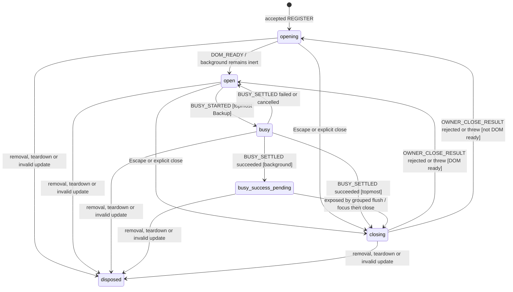

# Modal Focus Workflow Model

Status: **MODEL — ready for independent cold review; implementation forbidden
until approval**.

This model is the focus and accessibility authority for every MissionPulse
surface that renders `aria-modal="true"`:

- `BackupRestoreModal`;
- `MissionComparison`;
- `MissionInvestigationDrawer`; and
- `KeyboardShortcutsHelp`.

It owns painted topmost order, inert/ARIA projection, initial and recovery
focus, Tab, Escape, Backup busy behaviour and grouped removal. Modal business
mutations remain in their owners. No free text or LLM output drives a
transition.

## Scope and boundaries

| Layer                   | Responsibility                                                                                   |
| ----------------------- | ------------------------------------------------------------------------------------------------ |
| Pure Core               | Validation, target eligibility, focus order, Tab and entry transitions                           |
| Per-`Document` registry | Live entries, unique topmost, layers, serialized commands, keyboard listener and grouped removal |
| Shared Svelte action    | Complete DOM/config capture, projection, focus calls and owner callbacks                         |
| Components              | Typed surface/variant/scope, dialog, trigger and business close/busy intents                     |

There is exactly one registry per live `Document`, held in a
`WeakMap<Document, ModalRegistry>`. It has no persistence, Chrome API, crypto
identity, replay ledger, acknowledgement supervisor or timeout protocol. The
Feed arrival drawer is non-modal and never registers.

## Registry construction, serialization and capacity

Application bootstrap creates a registry with exactly one fallback element:

```ts
declare function createModalRegistry(
  document: Document,
  overlayRoot: HTMLElement,
  documentFallback: HTMLElement
): ModalRegistry;
```

At construction, `overlayRoot` must satisfy the exact DOM contract below.
`documentFallback` must belong to `document`, be connected and pass the
document-level recovery eligibility predicate. Invalid construction fails
before any binding can register. Both nodes are thereafter registry-owned and
immutable; registrations, entries and updates cannot replace them. If fallback
later becomes ineligible, recovery falls through to `document.body`.

All commands are synchronous and non-reentrant per `Document`:

1. append the command to an internal FIFO;
2. if reduction is active, return after enqueue;
3. otherwise reduce until the FIFO is empty; and
4. finish projection/focus effects for a command before reducing the next.

A callback that re-enters the registry queues work and cannot interleave its
own transition.

The registry accepts at most **16 live entries**. Private handle identity is
accepted only by the registry that created it.

```ts
interface ModalHandle {
  readonly ordinal: number;
  // Private object identity; not constructible by a component.
}

interface ModalRegistryContext {
  readonly document: Document;
  readonly overlayRoot: HTMLElement;
  readonly documentFallback: HTMLElement;
  nextOrdinal: number;
  dispatching: boolean;
  entries: readonly ModalEntry[];
  pendingRemovalHandles: ReadonlySet<ModalHandle>;
  pendingTeardownPaths: readonly OwnerScopePath[];
  removalMicrotaskScheduled: boolean;
  keyboardListenerInstalled: boolean;
}
```

The first accepted entry installs one capturing document `keydown` listener.
The transition to zero entries removes it in the same serialized removal
transaction. Rejection never installs an otherwise unused listener.

## Canonical owner scopes

```ts
type OwnerScopePath = readonly string[];
```

`parseOwnerScopePath` accepts a plain array of 1–16 strings. Each segment is
trimmed and must remain non-empty, be at most 64 UTF-16 code units, contain no
`/`, control character or line break, and equal its NFC normalization. The
returned array is frozen.

`TEARDOWN_SCOPE(path)` removes every entry whose canonical path begins with the
path segment by segment. Thus `['feed', '1']` never matches
`['feed', '10']`. Invalid registration scope rejects; a changed or invalid
scope in update terminally invalidates only that binding.

On `TEARDOWN_SCOPE`, the registry immediately freezes the exact matching live
handle set and projects those entries inert/hidden in the same FIFO command.
The canonical path remains a registration gate until `FLUSH_REMOVALS`: every
new scope beginning with that path is rejected as `SCOPE_TEARDOWN_PENDING`.
After read-only identity and structural checks, only a proven-disjoint candidate
root may be projected inert/hidden; candidate dialog attributes remain untouched.
Aliased or structurally overlapping DOM is never mutated. The flush removes
only the frozen handles, never a later rescan.
Thus neither an old match nor a same-scope reentrant registration can become
exposed between teardown and flush.

## Exact overlay DOM and painted order

The one `overlayRoot` is the direct child of `document.body` marked
`data-modal-surface-root`. Its normalized layout is fixed and deterministic:
`position:fixed`, `inset:0`, `isolation:isolate` and one fixed application
z-index. No ancestor from body to overlay may introduce transform, filter,
perspective, opacity, containment or another stacking context.

Every candidate modal root must be a **direct element child** of that overlay;
all accepted roots are therefore distinct siblings, never ancestors or
descendants of one another. Its dialog is a proper descendant of its own root
and of no other accepted root. No wrapper may exist between overlay and root.

The registry normalizes each root to `position:absolute`, `inset:0` and inline
`z-index = MODAL_LAYER_BASE + stackIndex`. Apart from this required positioned
z-index stacking context, a root may not create another one through transform,
filter, perspective, opacity below 1, `mix-blend-mode`, `isolation`, paint
containment or `will-change`. Computed-style validation fails closed on any
violation. Dialog-descendant styling cannot participate in sibling ordering.

Every accepted registration is appended to the opening stack. The registry
compacts live `stackIndex` values to `0..n-1`; inline positioning and z-index are
reprojected synchronously after registration or removal.

```ts
interface RegistryLayer {
  stackIndex: number;
  projectedZIndex: number;
}
```

After registration or grouped removal, all layers are projected before
inert/ARIA or focus. The last accepted survivor has the greatest actual painted
layer and is the unique ARIA, Tab and Escape topmost. Caller-supplied topmost,
computed z-index and DOM order are forbidden as ordering inputs.

## Entry state and complete configuration

```ts
type ModalSurface =
  'backup_restore' | 'mission_comparison' | 'mission_investigation' | 'keyboard_shortcuts_help';

type InitialFocusVariant =
  | 'backup_valid'
  | 'backup_error'
  | 'backup_validation_pending'
  | 'comparison'
  | 'investigation'
  | 'shortcuts_help';

type ModalEntryState =
  'opening' | 'open' | 'busy' | 'busy-success-pending' | 'closing' | 'disposed';

type ModalCloseReason = 'explicit' | 'escape' | 'business_success';
type ModalRejectionReason =
  | 'INVALID_CONFIG'
  | 'INVALID_SCOPE'
  | 'INVALID_STACKING_CONTEXT'
  | 'CAPACITY_EXHAUSTED'
  | 'SCOPE_TEARDOWN_PENDING'
  | 'DUPLICATE_ROOT'
  | 'DUPLICATE_DIALOG'
  | 'INVALID_UPDATE';

interface ModalCallbacks {
  onBeforeClose(reason: ModalCloseReason): unknown;
  onRejected(reason: ModalRejectionReason): void;
}

interface ModalRegistrationConfig extends ModalCallbacks {
  document: Document;
  root: HTMLElement;
  dialog: HTMLElement;
  trigger: HTMLElement | null;
  surface: ModalSurface;
  variant: InitialFocusVariant;
  ownerScopePath: OwnerScopePath;
}

interface ModalUpdate {
  config: ModalRegistrationConfig;
}

interface ModalEntry {
  handle: ModalHandle;
  surface: ModalSurface;
  variant: InitialFocusVariant;
  ownerScopePath: OwnerScopePath;
  root: HTMLElement;
  dialog: HTMLElement;
  trigger: HTMLElement | null;
  layer: RegistryLayer;
  state: ModalEntryState;
  domReady: boolean;
  closeCycle: number;
  pendingClose: {
    cycle: number;
    reason: ModalCloseReason;
    returnState: 'opening' | 'open';
  } | null;
  acceptedClose: { cycle: number; reason: ModalCloseReason } | null;
  busyOperation: object | null;
  callbacks: ModalCallbacks;
  rejectionNotified: boolean;
}
```

The action recaptures and normalizes the **complete** configuration on every
Svelte update. This makes every identity and policy change observable. The
registry permits only:

- a valid variant belonging to the unchanged surface; and
- valid replacement callbacks.

It revalidates root connectivity and controlled stacking context. A changed
`Document`, root, dialog, trigger, surface or canonical scope, an invalid
surface/variant/callback, or a root leaving the controlled context is
`INVALID_UPDATE`. The old accepted entry is projected inert and queued for
terminal grouped removal. The registry never mutates a newly supplied root or
dialog that belongs to another accepted entry. Invalid update notification uses
the last accepted `onRejected` callback; an attempted replacement is installed
only after the entire update has validated.

## Unique root and dialog registration

Among accepted live entries, both `root` identity and `dialog` identity are
unique. Registration validation has a fixed order: normalized type/scope and
surface relation; read-only duplicate root/dialog identity; pending teardown
scope; same registry document and exact overlay/root/dialog contract; root
computed style; capacity.

The synchronous `REGISTER` command first performs read-only root/dialog identity
checks and the direct-sibling structural check. Only after those checks prove a
candidate root distinct and DOM-disjoint from every accepted root/dialog may the
registry project that root `inert`, `aria-hidden=true` and unfocusable. No
candidate dialog attribute is written during pre-validation. Because the
command does not yield or paint, a new root cannot become observable before
this safe root projection.

Duplicate detection happens before any DOM mutation:

- `DUPLICATE_ROOT` has priority when both identities collide;
- for either duplicate reason, the rejected action disposes only its attempted
  binding and invokes its own `onRejected` once;
- it never changes an aliased root or any attempted dialog. After the read-only
  checks, a distinct, direct-sibling candidate root may be made inert/hidden;
  no other candidate node, layer or focus is changed.

Consequently, `DUPLICATE_DIALOG` with a distinct root leaves the aliased dialog
untouched while the proven-disjoint candidate root is synchronously made inert,
hidden and unfocusable. A duplicate root, both identities colliding, or any root
that is not proven disjoint produces no DOM mutation at all.

Only after registration has passed identity, scope, document, overlay, computed
style and capacity validation does the accepted-entry projection set the
dialog's `aria-hidden` and `aria-modal` attributes. Thus no pre-validation path
can mutate a dialog already owned by another entry.

For every other rejection whose candidate root is proven disjoint, the registry
projects only that root inert, hidden and unfocusable, leaves the candidate
dialog untouched, disposes the binding and calls `onRejected` once. A throwing
rejection callback is reported after cleanup and cannot revive the binding. No
rejection leaves a registry entry or stale listener. Dialog ARIA attributes are
written only by an accepted-entry projection.

## Events and effects

```ts
type ModalRegistryEvent =
  | { type: 'REGISTER'; config: ModalRegistrationConfig }
  | { type: 'DOM_READY'; handle: ModalHandle; facts: InitialFocusFacts }
  | { type: 'UPDATE'; handle: ModalHandle; update: ModalUpdate }
  | { type: 'TAB'; backwards: boolean; facts: TabDomFacts }
  | { type: 'ESCAPE' }
  | { type: 'EXPLICIT_CLOSE'; handle: ModalHandle }
  | {
      type: 'OWNER_CLOSE_RESULT';
      handle: ModalHandle;
      closeCycle: number;
      disposition: 'accepted' | 'rejected' | 'threw';
    }
  | { type: 'BUSY_STARTED'; handle: ModalHandle; operation: object }
  | {
      type: 'BUSY_SETTLED';
      handle: ModalHandle;
      operation: object;
      outcome: 'succeeded' | 'failed' | 'cancelled';
    }
  | { type: 'OWNER_UNMOUNTED'; handle: ModalHandle }
  | { type: 'TEARDOWN_SCOPE'; ownerScopePath: OwnerScopePath }
  | { type: 'FLUSH_REMOVALS' }
  | { type: 'FOCUS_TARGET_INVALIDATED'; handle: ModalHandle };

type ModalFocusEffect =
  | {
      type: 'project-entry';
      handle: ModalHandle;
      layer: RegistryLayer;
      inert: boolean;
      ariaHidden: boolean;
      ariaModal: boolean;
    }
  | { type: 'focus-target'; target: HTMLElement }
  | { type: 'prevent-key-default' }
  | {
      type: 'invoke-owner-before-close';
      handle: ModalHandle;
      closeCycle: number;
      reason: ModalCloseReason;
    }
  | { type: 'notify-rejection'; handle: ModalHandle | null; reason: ModalRejectionReason }
  | { type: 'install-document-keyboard-listener' }
  | { type: 'remove-document-keyboard-listener' }
  | { type: 'report-focus-error'; reason: string }
  | {
      type: 'report-owner-close-error';
      handle: ModalHandle;
      closeCycle: number;
      reason: 'THREW' | 'INVALID_RETURN';
    };
```

The effect calls captured `onBeforeClose` exactly once and synchronously. Only
primitive strict-equality results `'accepted'` and `'rejected'` are valid.
`undefined`, `null`, booleans, numbers, objects, boxed strings, functions,
Promises and thenables deterministically enqueue `rejected`; they are never
awaited and no continuation is attached. A throw enqueues `threw`. Invalid
returns are reported but recover through the ordinary rejected transition.
The callback never mutates state directly. Handle mismatch, disposed handle,
duplicate readiness, stale close cycle, stale busy operation and keyboard input
with no live topmost are exact no-ops.

## Readiness and projection

Every accepted registration starts `opening`. `DOM_READY` for its exact dialog
always changes it to `open`, whether foreground or background:

- if unique topmost, projection makes it interactive and initial focus runs;
- if background, projection remains inert/hidden and no focus moves;
- when that background entry is later exposed, recovery focus runs against its
  current complete configuration.

Thus readiness never strands a background entry in `opening`.

Layer plus accessibility projection is recomputed atomically for all live
entries after registration, readiness, lifecycle transition or grouped
removal.

| Entry position/state                                                      | Projection                                                             |
| ------------------------------------------------------------------------- | ---------------------------------------------------------------------- |
| Unique topmost, DOM ready, `open`/`busy`/`busy-success-pending`/`closing` | `inert=false`, `aria-hidden=false`, `aria-modal=true`                  |
| Topmost but not DOM ready                                                 | `inert=true`, `aria-hidden=true`, `aria-modal=false`; Tab is prevented |
| Any background entry                                                      | `inert=true`, `aria-hidden=true`, `aria-modal=false`                   |
| Pending grouped removal or disposed                                       | `inert=true`, `aria-hidden=true`, `aria-modal=false`                   |

If topmost is pending grouped removal, no survivor becomes interactive before
`FLUSH_REMOVALS`; Tab and Escape are prevented during that interval.

## Distinct DOM eligibility predicates

Initial focus and Tab use dialog containment:

```ts
declare function isDialogTargetEligible(
  node: HTMLElement | null,
  dialog: HTMLElement,
  requireTabStop: boolean
): boolean;
```

The predicate requires the node and dialog to be connected to the same
`Document`, the node to be contained by that dialog, the node to be enabled,
and neither node nor any ancestor through the dialog to be hidden,
`aria-hidden=true`, inert, `display:none` or `visibility:hidden`.
`requireTabStop` additionally requires `tabIndex >= 0`. The dialog container is
the final programmatic fallback and may use `tabIndex=-1`.

Recovery of a causal trigger uses a different predicate:

```ts
declare function isRecoveryTriggerEligible(
  node: HTMLElement | null,
  document: Document,
  survivingDialog: HTMLElement | null
): boolean;
```

It requires same-document connectivity, enabled state and no hidden/inert
ancestor. If a survivor exists, the trigger **must** be contained by the
surviving dialog. If there is no survivor, any eligible same-document trigger
may restore focus. It never requires containment in the removed dialog.

The registry fallback uses document-level eligibility: same document,
connected, enabled and no hidden/inert ancestor, with no dialog-containment
requirement. These three predicates are not interchangeable.

## Exact initial and recovery focus

```ts
interface InitialFocusFacts {
  dialog: HTMLElement;
  confirmationInput: HTMLElement | null;
  closeButton: HTMLElement | null;
  cancelButton: HTMLElement | null;
  firstEnabledButton: HTMLElement | null;
  firstMissionLink: HTMLElement | null;
  firstEnabledAction: HTMLElement | null;
  acknowledgementButton: HTMLElement | null;
}
```

| Variant                     | Exact eligible order                               |
| --------------------------- | -------------------------------------------------- |
| `backup_valid`              | confirmation input → first enabled button → dialog |
| `backup_error`              | close button → dialog                              |
| `backup_validation_pending` | cancel button → dialog                             |
| `comparison`                | close button → first mission link → dialog         |
| `investigation`             | close button → first enabled action → dialog       |
| `shortcuts_help`            | close button → acknowledgement button → dialog     |

Only `backup_*` variants belong to Backup; every other variant belongs exactly
to its named surface.

After grouped removal, final topmost projection precedes one recovery decision:

1. causal normal-close trigger, using the recovery predicate;
2. surviving DOM-ready topmost's current initial policy;
3. surviving dialog container;
4. unique registry-owned `documentFallback`, if still document-eligible;
5. `document.body`, temporarily programmatically focusable if needed.

Owner unmount without an accepted close and scope teardown cannot claim step 1
and start at step 2. If there is no survivor, step 2 and 3 are skipped. If a
selected node disappears, `FOCUS_TARGET_INVALIDATED` performs one fresh
synchronous capture and resumes at the next eligible fallback.

## Tab and Escape

```ts
interface TabDomFacts {
  activeElement: Element | null;
  orderedFocusable: readonly HTMLElement[];
  dialog: HTMLElement;
}
```

The registry accepts Tab facts only for the exact unique topmost dialog and
filters every candidate through `isDialogTargetEligible(..., true)`.

| Condition                                | Tab decision                           |
| ---------------------------------------- | -------------------------------------- |
| Pending removal or topmost not DOM ready | Prevent; do not escape to page content |
| No eligible focusable                    | Prevent and focus dialog container     |
| Active outside order, forward/backward   | Prevent and focus first/last           |
| Forward on last / backward on first      | Prevent and wrap to first/last         |
| One eligible item                        | Prevent and focus that item            |
| Intermediate item                        | Allow native movement                  |

Only unique topmost receives Escape. `busy`, `busy-success-pending` and
`closing` consume it without another close. `open` or `opening` begins one
correlated close request; background receives no key event.

## Correlated owner close result

Beginning a close increments `closeCycle`, records `pendingClose`, enters
`closing` and emits one `invoke-owner-before-close`. No second close begins
while that cycle is pending or accepted.

| Exact `OWNER_CLOSE_RESULT` disposition | Result                                                                           |
| -------------------------------------- | -------------------------------------------------------------------------------- |
| `accepted`                             | Clear pending; record `acceptedClose`; remain `closing` until owner unmount      |
| `rejected`                             | Clear pending/accepted close; return to `open` if DOM ready, otherwise `opening` |
| `threw`                                | Same state recovery as rejected, plus report owner error                         |

For `business_success`, both immediate and deferred requests originate from a
DOM-ready entry, so rejection or throw returns **exactly `open`**. The
successful busy outcome is consumed when the close request begins:
`busyOperation` and deferred-success state are cleared. Returning open cannot
automatically request business close again; only a new busy operation and new
success may do so.

`DOM_READY` received while a close callback is pending records readiness
without moving focus; a later rejection therefore returns open. A stale,
duplicate or crossed close result is an exact no-op.

## Backup busy transitions

Only topmost open Backup accepts `BUSY_STARTED`, storing the operation by object
identity.

| State                                         | Matching settlement | Result                                                                               |
| --------------------------------------------- | ------------------- | ------------------------------------------------------------------------------------ |
| `busy`                                        | failed/cancelled    | Clear operation; return `open`                                                       |
| `busy`, still topmost                         | succeeded           | Consume success and begin one immediate correlated `business_success` close          |
| `busy`, now background                        | succeeded           | Clear operation; enter `busy-success-pending`                                        |
| `busy-success-pending`, later exposed topmost | grouped flush       | Project/focus survivor, consume pending success, begin one deferred correlated close |

Non-Backup busy events, crossed operation identities and duplicate settlements
are no-ops. Tab remains trapped while busy; Escape never cancels work.

## Grouped removal and scope teardown

`OWNER_UNMOUNTED` and terminal invalid update immediately freeze their exact
handles. `TEARDOWN_SCOPE` immediately freezes all current canonical matches and
installs its path gate. Every frozen entry is projected inert/hidden before the
command returns; no underlying entry is exposed. The first event schedules one
microtask and later removal events in the same task union more frozen handles.

`FLUSH_REMOVALS` is one serialized transaction:

1. consume the already frozen exact handle set; do not rescan scope paths;
2. capture pre-removal visual topmost and its accepted normal-close cause;
3. project every affected accepted entry inert/hidden;
4. remove the complete set with no intermediate projection/focus;
5. compact and project final survivor layers/accessibility;
6. make one recovery focus decision using the distinct predicates;
7. if final topmost is `busy-success-pending`, begin its deferred close only
   after projection/focus; and
8. remove the keyboard listener if live count becomes zero.

The transaction then clears the consumed teardown path gates. A registration
queued after the flush may use that scope normally; one queued before it was
deterministically rejected.

Background-only removal that does not change topmost moves no focus. If several
accepted closes are removed together, only pre-removal topmost supplies a
causal trigger. Teardown suppresses trigger restoration for entries it removes.

## State transition summary



An accepted owner result remains closing until terminal unmount. Register
rejection produces a terminal disposed binding without entering the chart.

## Errors and terminal behaviour

- Duplicate rejection never mutates possibly accepted DOM.
- Other registration rejection and invalid update are terminal and reported
  after safe inert projection/cleanup.
- Owner close rejection, invalid return or throw recovers coherently;
  business-success failure cannot loop.
- Escape is a close request, never a teardown or Backup cancellation.
- Owner unmount/scope teardown are terminal for affected entries and grouped by
  one microtask.
- Failed focus falls through synchronously; there is no ACK/timeout protocol.
- With zero entries the registry is idle/listener-free and can later accept a
  new entry; its WeakMap key remains collectible.

## Invariants

1. One registry per Document is the only topmost authority and owns exactly one
   immutable document fallback.
2. Commands are serialized/non-reentrant; callback activity cannot interleave
   a transition.
3. At most 16 entries exist. Their unique roots are direct sibling children of
   the one validated overlay and receive deterministic position/z-index; no
   wrapper, ancestor relation or extra root stacking context participates.
4. Root and dialog identities are each unique. Pre-validation never mutates a
   dialog or aliased/overlapping root; a proven-disjoint duplicate-dialog root
   alone becomes inert, hidden and unfocusable. Dialog ARIA projection starts
   only after acceptance.
5. Painted, ARIA and keyboard topmost are the same last accepted survivor.
6. `DOM_READY` always enters open; a ready background remains inert until
   exposure.
7. At most one entry is interactive/`aria-modal=true`; every background,
   not-ready, removal-pending and disposed entry is inert/hidden.
8. Initial/Tab targets require current dialog containment. Recovery trigger
   never requires removed-dialog containment and requires survivor containment
   only when a survivor exists.
9. Tab never escapes; Escape starts at most one correlated active owner close
   and never cancels Backup work.
10. Only synchronous literal close decisions are accepted. Rejected, invalid
    or throwing business-success callbacks return open and cannot loop, both
    immediate and deferred.
11. Only Backup enters busy and only its exact operation settles it.
12. Trigger restoration is causal to pre-removal topmost accepted close;
    unmount/teardown cannot claim it.
13. Teardown freezes exact handles and gates matching registrations before the
    grouped removal exposes one final topmost and no intermediate survivor.
14. Complete update capture detects every immutable identity/policy change;
    invalid update is terminal.
15. The document keyboard listener exists exactly while live count is nonzero.
16. Disposed handles accept no event and cannot be reused.
17. No storage, crypto ID, delivery lane, ACK supervisor, timeout, free text or
    LLM output participates.

## Mandatory review matrix

- every valid/invalid surface-variant pair and canonical scope edge;
- first, 16th and rejected 17th registration; removal/capacity reuse and
  listener first/last lifecycle;
- duplicate root, duplicate dialog and both colliding, proving no DOM mutation
  of aliased nodes and priority; duplicate dialog with only its proven-disjoint
  root made inert; dialog attributes unchanged until acceptance; non-duplicate
  invalid config proving safe inert cleanup;
- complete valid update and every changed document/root/dialog/trigger/surface/
  scope, invalid variant/callback/context, including a newly supplied node
  owned by another modal;
- overlay direct-body contract; direct sibling roots; rejection of wrappers,
  ancestor roots and extra stacking-context causes; deterministic position,
  greater painted layer and removal compaction;
- foreground and background DOM_READY, then exposing the ready background;
- every initial variant, missing targets, dialog fallback and hidden/inert
  ancestors;
- initial/Tab candidate outside dialog rejection; recovery trigger inside
  survivor acceptance, outside survivor rejection, and no-survivor eligible
  same-document trigger outside removed dialog;
- unique fallback valid, later disconnected/hidden, then body fallback;
- forward/backward Tab, zero/one item, active outside, dynamic removal and
  invalidated target;
- Escape during opening/open/busy/pending-success/closing and accepted,
  rejected, throwing, stale/crossed owner result; undefined/object/Promise/
  thenable callback returns mapping synchronously to rejected without awaiting;
- Backup failure/cancellation, immediate success-close rejected/thrown, success
  in background, exposure and deferred close rejected/thrown, proving no loop;
- exact unmount, canonical ancestor teardown, sibling non-match and `feed/1`
  versus `feed/10`;
- same-scope reentrant registration before flush, proving rejection, safe inert
  projection, frozen handle membership and later post-flush reuse;
- several removals/teardown in one task, proving one flush, no intermediate
  exposure and one focus decision;
- background-only removal proving no focus movement;
- all four surfaces nested pairwise in both opening orders, proving last
  accepted painted/ARIA/Tab/Escape ownership;
- reentrant register/remove/update from close and rejection callbacks, proving
  FIFO serialization;
- arrival drawer below each modal, proving it remains non-modal.

## Task 9 mapping

| Task 9 interface                          | Authoritative clause                       | Required RED proof before implementation                                                  |
| ----------------------------------------- | ------------------------------------------ | ----------------------------------------------------------------------------------------- |
| Dialog establishes initial focus          | Readiness and exact initial focus          | Foreground/background readiness; every preferred target and fallback                      |
| Dialog traps Tab                          | Dialog eligibility and Tab table           | Containment, wrap, zero/one target, hidden/inert ancestors                                |
| Escape closes correct dialog              | Registry layer and correlated close result | Both nesting orders; only last accepted callback; reject/throw recovery                   |
| Close restores focus                      | Grouped removal and recovery predicate     | Survivor-contained trigger, no-survivor external trigger, unique fallback/body            |
| Nested modals expose one accessible modal | Atomic projection and grouped flush        | Exactly one ARIA topmost; ready background stays inert; no transient exposure             |
| Shared binding detects identity changes   | Complete configuration/update              | Changed immutable field terminally removes old binding without mutating another modal DOM |

Task 9 implementations must use one shared action/registry across the four
modal components. Component-local Escape, focus trap, fallback or
`aria-modal` decisions contradict this model.

## Self-review gate

- Registry, entry states, commands, results, effects, failure and terminal
  paths are explicit.
- Unique root/dialog and registry fallback ownership are unambiguous.
- Background readiness, business-close rejection and focus containment use
  exact, testable rules.
- Grouped teardown exposes one final stack without delivery/ACK machinery.
- No transition depends on text or an LLM.

**SELF-REVIEW VERDICT: READY FOR INDEPENDENT COLD REVIEW; NOT APPROVED FOR
IMPLEMENTATION.**
