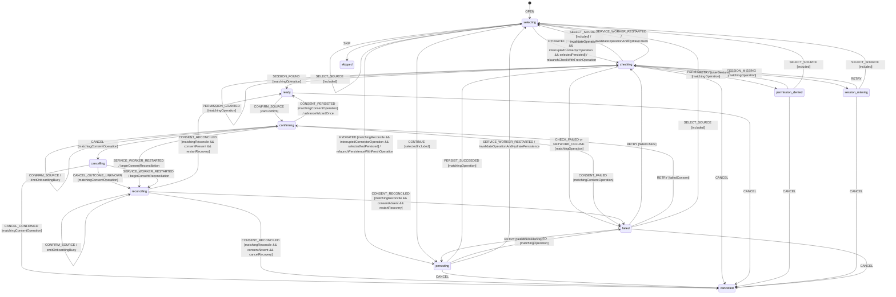

# Onboarding Source Workflow Model

Authoritative behavior for selecting, persisting, and checking a connector in
onboarding, and for projecting the same shipped connector state in Settings.

## Scope and decisions

Both screens derive their source list from `getConnectorsMeta()` and therefore
the build-filtered `INCLUDED_CONNECTOR_IDS`. A connector excluded from the
package cannot appear, be persisted, be checked, or be granted a permission.

The workflow separates three facts that the current UI can otherwise conflate:
the selected connector, its confirmed persisted `enabled` value, and its
runtime permission/session result. Onboarding cannot leave the source step
until all three are valid. Skipping onboarding is explicit and grants no
automatic-scan consent.

## State vocabulary and context

The exact connector check vocabulary consumed by onboarding and Settings is:

```ts
type ConnectorId = 'free-work' | 'lehibou' | 'hiway' | 'collective' | 'cherry-pick' | 'malt';

type ConnectorCheckStatus =
  'checking' | 'ready' | 'permission_denied' | 'session_missing' | 'failed';

type OnboardingSourceState =
  | 'selecting'
  | 'persisting'
  | ConnectorCheckStatus
  | 'confirming'
  | 'cancelling'
  | 'reconciling'
  | 'cancelled'
  | 'skipped';

interface SourceContext {
  state: OnboardingSourceState;
  includedConnectorIds: readonly ConnectorId[];
  selectedConnectorId: ConnectorId | null;
  previousEnabledConnectorIds: readonly ConnectorId[];
  persistedEnabledConnectorIds: readonly ConnectorId[];
  permission: 'unknown' | 'not_required' | 'granted' | 'denied';
  session: 'unknown' | 'present' | 'missing';
  lastSync: string | null;
  operationId: string | null;
  consentOperationId: string | null;
  reconcileRequestId: string | null;
  reconcileReason: 'restart' | 'cancel_race' | null;
  interruptedConnectorPhase: 'persisting' | 'checking' | null;
  invalidatedConnectorOperationId: string | null;
  advancePending: boolean;
  failurePhase: 'persistence' | 'permission' | 'session' | 'offline' | 'consent' | null;
  error: string | null;
  scanConsent: boolean;
}

interface ConnectorSourceProjection {
  id: ConnectorId;
  enabled: boolean;
  status: ConnectorCheckStatus;
  permission: SourceContext['permission'];
  session: SourceContext['session'];
  lastSync: string | null;
  error: string | null;
}
```

`scanConsent` is a persisted, explicit user decision. Selecting or checking a
source does not set it. `confirming` means the write outcome is pending;
`reconciling` means it is unknown and must be read from canonical storage. The
source-step confirmation sets it and advances the wizard only after a matching
write or reconciliation proves success.

## Events

```ts
type OnboardingSourceEvent =
  | {
      type: 'OPEN';
      includedConnectorIds: readonly ConnectorId[];
      enabledConnectorIds: readonly ConnectorId[];
      scanConsent: boolean;
    }
  | { type: 'SELECT_SOURCE'; connectorId: ConnectorId }
  | { type: 'CONTINUE'; operationId: string }
  | { type: 'PERSIST_SUCCEEDED'; operationId: string; enabledConnectorIds: readonly ConnectorId[] }
  | { type: 'PERSIST_FAILED'; operationId: string; error: string }
  | { type: 'PERMISSION_GRANTED'; operationId: string; required: boolean }
  | { type: 'PERMISSION_REFUSED'; operationId: string }
  | { type: 'SESSION_FOUND'; operationId: string; lastSync: string | null }
  | { type: 'SESSION_MISSING'; operationId: string }
  | { type: 'CHECK_FAILED'; operationId: string; error: string }
  | { type: 'NETWORK_OFFLINE'; operationId: string }
  | { type: 'CONFIRM_SOURCE'; operationId: string }
  | { type: 'CONSENT_PERSISTED'; operationId: string }
  | { type: 'CONSENT_FAILED'; operationId: string; error: string }
  | { type: 'RETRY'; operationId: string }
  | { type: 'CANCEL'; operationId: string }
  | { type: 'CANCEL_CONFIRMED'; operationId: string }
  | { type: 'CANCEL_OUTCOME_UNKNOWN'; operationId: string; requestId: string }
  | { type: 'SKIP'; operationId: string }
  | { type: 'SERVICE_WORKER_RESTARTED'; requestId: string }
  | {
      type: 'CONSENT_RECONCILED';
      requestId: string;
      scanConsent: boolean;
      enabledConnectorIds: readonly ConnectorId[];
    }
  | {
      type: 'HYDRATED';
      requestId: string;
      nextOperationId: string;
      enabledConnectorIds: readonly ConnectorId[];
      scanConsent: boolean;
    };
```

## Statechart



## Guards

| Guard                             | Rule                                                                                                                                                         |
| --------------------------------- | ------------------------------------------------------------------------------------------------------------------------------------------------------------ |
| `included`                        | Connector ID occurs in the current build-filtered catalogue.                                                                                                 |
| `selectedIncluded`                | Selection is non-null, included, and differs from no stale catalogue entry.                                                                                  |
| `matchingOperation`               | Response operation ID equals the current operation ID.                                                                                                       |
| `matchingConsentOperation`        | Response operation ID equals `consentOperationId`; connector-check IDs cannot acknowledge consent.                                                           |
| `matchingReconcile`               | Response request ID equals `reconcileRequestId`; older hydration/reconciliation reads are discarded.                                                         |
| `noInterruptedConnectorOperation` | `interruptedConnectorPhase === null`; hydration only refreshes canonical facts.                                                                              |
| `interruptedConnectorOperation`   | Interrupted phase is `persisting` or `checking`, and `nextOperationId` is non-empty and differs from `invalidatedConnectorOperationId`.                      |
| `selectedPersisted`               | Hydrated enabled IDs contain the still-included selected connector.                                                                                          |
| `selectedNotPersisted`            | Hydrated enabled IDs do not contain the still-included selected connector.                                                                                   |
| `userGesture`                     | Optional permission request is directly caused by the user's Continue/Retry action.                                                                          |
| `failedPersistence`               | `failurePhase === 'persistence'`.                                                                                                                            |
| `failedCheck`                     | Failure phase is permission, session, or offline.                                                                                                            |
| `failedConsent`                   | `failurePhase === 'consent'` and connector check facts remain valid.                                                                                         |
| `canConfirm`                      | State is `ready`, consent is false, selection is persisted/enabled, permission is granted/not required, session is present, and no consent operation exists. |
| `restartRecovery`                 | `reconcileReason === 'restart'`.                                                                                                                             |
| `cancelRecovery`                  | `reconcileReason === 'cancel_race'`.                                                                                                                         |
| `consentPresent`                  | Reconciled canonical `scanConsent === true`.                                                                                                                 |
| `consentAbsent`                   | Reconciled canonical `scanConsent === false`.                                                                                                                |

## Transition table

| From                   | Event                      | Guard                           | To                                        | Effects                                                                                                                                             |
| ---------------------- | -------------------------- | ------------------------------- | ----------------------------------------- | --------------------------------------------------------------------------------------------------------------------------------------------------- |
| `selecting`            | `SELECT_SOURCE`            | `included`                      | `selecting`                               | Store candidate only; no persistence or permission prompt.                                                                                          |
| `selecting`            | `HYDRATED`                 | no interrupted operation        | `selecting`                               | Replace canonical enabled IDs/consent only for the matching hydration request.                                                                      |
| `selecting`            | `CONTINUE`                 | `selectedIncluded`              | `persisting`                              | Snapshot previous settings; persist selected connector enabled.                                                                                     |
| `persisting`           | `PERSIST_SUCCEEDED`        | `matchingOperation`             | `checking`                                | Commit enabled IDs; check/request host permission, then session through worker.                                                                     |
| `persisting`           | `PERSIST_FAILED`           | `matchingOperation`             | `failed`                                  | Retain candidate, restore previous projection, expose retry.                                                                                        |
| persisting/checking    | `SERVICE_WORKER_RESTARTED` | —                               | `selecting`                               | Remember interrupted phase/old ID, clear `operationId`, store fresh hydration request ID, and read canonical settings.                              |
| `selecting`            | `HYDRATED`                 | interrupted, selected persisted | `checking`                                | Apply canonical facts, assign `nextOperationId`, clear interrupted phase/invalidated ID, and relaunch permission/session check from its first step. |
| `selecting`            | `HYDRATED`                 | interrupted, selected absent    | `persisting`                              | Apply canonical facts, assign `nextOperationId`, clear interrupted phase/invalidated ID, and idempotently repeat selected-connector persistence.    |
| `checking`             | `PERMISSION_GRANTED`       | matching                        | `checking`                                | Continue deterministic session detection.                                                                                                           |
| `checking`             | `PERMISSION_REFUSED`       | matching                        | `permission_denied`                       | Remain on source step; no scan and no success copy.                                                                                                 |
| `checking`             | `SESSION_FOUND`            | matching                        | `ready`                                   | Store session and last-sync facts; enable source-step confirmation.                                                                                 |
| `checking`             | `SESSION_MISSING`          | matching                        | `session_missing`                         | Remain on source step and offer open-platform/retry action.                                                                                         |
| `checking`             | `CHECK_FAILED`             | matching                        | `failed`                                  | Store typed retryable technical error.                                                                                                              |
| `checking`             | `NETWORK_OFFLINE`          | matching                        | `failed`                                  | Store `failurePhase='offline'`; preserve persisted selection.                                                                                       |
| `ready`                | `CONFIRM_SOURCE`           | `canConfirm`                    | `confirming`                              | Set `advancePending`, create consent operation, and persist consent; do not advance.                                                                |
| `confirming`           | `CONSENT_PERSISTED`        | matching consent                | `ready`                                   | Set canonical consent true, clear operation, and advance the wizard exactly once.                                                                   |
| `confirming`           | `CONSENT_FAILED`           | matching consent                | `failed`                                  | Set `failurePhase='consent'`; clear pending advancement and never claim consent.                                                                    |
| confirming/reconciling | `CONFIRM_SOURCE`           | —                               | same                                      | Return typed `ONBOARDING_BUSY`; never start a second consent write.                                                                                 |
| `confirming`           | `CANCEL`                   | matching consent                | `cancelling`                              | Request abort; retain the operation token until its outcome is known.                                                                               |
| `cancelling`           | `CANCEL_CONFIRMED`         | matching consent                | `cancelled`                               | Clear pending advancement only after proof that consent did not commit.                                                                             |
| `cancelling`           | `CANCEL_OUTCOME_UNKNOWN`   | matching consent                | `reconciling`                             | Read canonical consent with a fresh request ID and reason `cancel_race`.                                                                            |
| confirming/cancelling  | `SERVICE_WORKER_RESTARTED` | —                               | `reconciling`                             | Invalidate prior consent result and read canonical consent using the event's fresh request ID and reason `restart`.                                 |
| `reconciling`          | `CONSENT_RECONCILED`       | matching, true, restart         | `ready`                                   | Accept canonical consent and advance once only when `advancePending` is true.                                                                       |
| `reconciling`          | `CONSENT_RECONCILED`       | matching, false, restart        | `failed`                                  | Set retryable consent failure; no advancement.                                                                                                      |
| `reconciling`          | `CONSENT_RECONCILED`       | matching, false, cancel         | `cancelled`                               | Cancellation is now proven; clear pending advancement.                                                                                              |
| `reconciling`          | `CONSENT_RECONCILED`       | matching, true, cancel          | `reconciling`                             | Request idempotent consent revocation and a fresh canonical read; never advance.                                                                    |
| refusal/missing/failed | `RETRY`                    | matching phase                  | `checking`, `persisting`, or `confirming` | New operation ID; repeat only the failed phase and dependencies.                                                                                    |
| non-consent states     | `CANCEL`                   | matching/current attempt        | `cancelled`                               | Abort request, invalidate operation ID, restore previous enabled IDs if needed.                                                                     |
| `selecting`            | `SKIP`                     | —                               | `skipped`                                 | Persist no scan consent; preserve prior settings.                                                                                                   |

Settings uses the same `ConnectorCheckStatus` per included connector. Toggling
an enabled connector reuses the persistence and check guards; Settings may
display multiple connector snapshots but serializes mutations per connector.
The source choice means "enable and verify this connector"; no unsupported
`primarySource` field or display label such as `"Free-Work"` is persisted.
Changing the selected source invalidates the prior operation ID before starting
another persistence/check sequence.

## Side effects and ownership

- **Core:** validates included IDs, reduces events, derives `canContinue`, and
  never imports the connector registry or browser APIs.
- **Side panel:** renders catalogue metadata and emits selection/continue/retry.
  It does not call `chrome.permissions`, `chrome.cookies`, IndexedDB, or storage.
- **Service worker Shell:** persists enabled IDs, owns optional permission and
  cookie/session checks, and returns typed events over the bridge.
- **Connector Shell:** detects session only after permission succeeds. It does
  not decide onboarding completion.

## Persistence boundary

`enabledConnectors` and `scanConsent` are stored in `chrome.storage.local`
through the settings/app-flags facade. Permission grants remain Chrome-owned;
session presence is observed, never persisted as a credential. `lastSync` may
be read from persisted connector status. Candidate selection, operation ID,
failure copy, and in-flight check are ephemeral.

After a normal open, matching `HYDRATED` reloads canonical enabled IDs and
consent. A restart in `persisting`/`checking` first stores the interrupted
phase, invalidates the old operation ID, and enters `selecting` only as the
hydration state. Matching `HYDRATED` then assigns its injected
`nextOperationId`: it relaunches checking when the selected connector is
canonically enabled, or repeats persistence idempotently when it is absent.
During `confirming`/`cancelling`, restart instead enters `reconciling`; only a
matching `CONSENT_RECONCILED` canonical read can settle the write. No result for
the invalidated operation ID can advance the source step.

## Permissions and offline behavior

Permission requests are limited to the selected shipped connector's declared
host patterns and require a user gesture. Refusal maps only to
`permission_denied`; it is not a technical error and is never retried
automatically. Session detection follows permission and returns
`session_missing` without inventing credentials.

Offline detection maps to `failed` with `failurePhase='offline'`. Persisted
local selection remains intact, but onboarding cannot claim `ready` because a
required live session check was not completed. Retry is manual after network
recovery.

## Retry, cancellation, concurrency, and restart

- Retry repeats persistence only after a persistence failure; otherwise it
  repeats permission/session checking, or consent only when
  `failurePhase='consent'` and the connector facts remain valid.
- Cancellation is terminal only after abort or reconciliation proves consent
  was not committed. If it was committed during a cancel race, the Shell
  idempotently revokes it and rereads before reaching `cancelled`.
- Duplicate Continue/Retry/Confirm while an operation is active returns a typed
  busy result and leaves the active operation unchanged.
- Different connector status reads may run concurrently in Settings, but only
  the matching connector/operation may update its snapshot.
- Service-worker restart triggers hydration/fresh check, or consent
  reconciliation when its outcome is unknown; no in-flight result is presumed
  successful. Persisting/checking restart always uses the request ID carried by
  `SERVICE_WORKER_RESTARTED` and the fresh operation ID carried by `HYDRATED`.

## Terminal states and re-entry

`ready` is terminal for the check operation but remains confirmable;
`confirming`, `cancelling`, and `reconciling` are pending transaction states
and never advance implicitly. `permission_denied`, `session_missing`, and
`failed` are settled retry states.
`cancelled` and `skipped` are terminal for the current onboarding attempt. A
new `OPEN` creates a new attempt from persisted facts. Settings can explicitly
start a new check from any settled connector state.

## Forbidden transitions

- Selection or persistence of a connector absent from `INCLUDED_CONNECTOR_IDS`.
- Session check before required permission is granted.
- Advance to the next onboarding step before selected source persistence,
  permission/session checks, and consent persistence are confirmed.
- Automatic retry after permission refusal or offline failure.
- Applying a result whose operation ID or connector ID does not match.
- Advancing the wizard from `confirming`, `cancelling`, or `reconciling`, or
  accepting a stale consent acknowledgement/canonical read.
- Starting a second consent write while one is confirming or reconciling.
- Entering `cancelled` after a consent-write race without canonical proof that
  consent is absent.
- Treating skip, permission refusal, or session absence as scan consent.
- Any implicit transition derived from a connector label, toast, or generated text.

## Invariants

1. Onboarding and Settings show exactly the same build-filtered connector set.
2. `ready` implies selected connector persisted, permission granted/not needed,
   and session present.
3. Continue stays disabled until the state is `ready`; wizard advancement waits
   for persisted consent.
4. No credentials or cookie values are stored by MissionPulse.
5. Permission refusal and missing session are distinct user-recoverable states.
6. A cancelled/stale operation can never publish a success result.
7. The side panel uses facades/messaging for all persistence and permissions.
8. An LLM never decides a transition; it supplies no signal in this workflow.
9. Wizard advancement occurs exactly once and only after matching persisted or
   reconciled consent proof.
10. Consent and connector-check operation IDs are distinct; neither can
    acknowledge the other.
11. Restart invalidates the interrupted persistence/check operation before
    hydration; only the matching read can install a fresh operation ID and
    relaunch work.

## Review checklist

- [x] Nominal select, persist, permission, session, confirm flow is explicit.
- [x] Excluded connector, persistence error, permission refusal, and missing session are covered.
- [x] Offline behavior and manual retry are named.
- [x] Skip and cancellation preserve prior settings and grant no consent.
- [x] Duplicate requests and late responses are operation-scoped.
- [x] Consent has explicit pending, duplicate, cancel-race, and restart reconciliation paths.
- [x] Service-worker restart hydrates/reconciles and rechecks instead of assuming success.
- [x] Settled-state re-entry requires Retry, a new check, or a new onboarding attempt.
