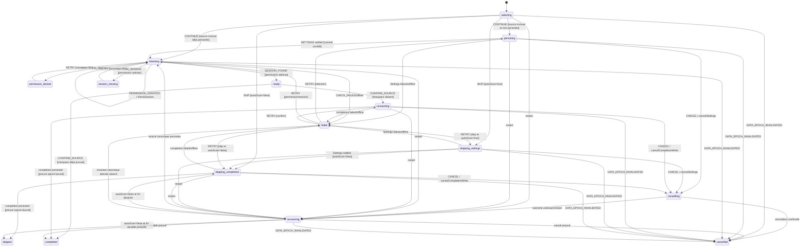

# Onboarding Source Workflow Model

Source de vérité du gate **Model** pour la sélection — ou l'ignorance — d'une
source pendant l'onboarding. Le modèle est exécutable, pur et sans I/O :

- `onboarding-source.contract.ts` définit entrées, événements, preuves,
  commandes, projections et validateurs de frontière ;
- `onboarding-source.logic.ts` contient les guards et actions pures ;
- `onboarding-source.machine.ts` garde la machine XState et son acteur privés
  derrière une façade publique allowlistée.

Ce modèle n'est pas encore branché au runtime de l'extension.

## Décisions d'autorité

1. Le Shell injecte le catalogue exact de `getConnectorsMeta()`, donc déjà
   filtré par `INCLUDED_CONNECTOR_IDS`. Un connecteur absent ne peut être
   sélectionné, persisté, vérifié ni demandé en permission.
2. Une source est durable seulement après une mutation transactionnelle
   Settings de `AppSettings.enabledConnectors` et un settlement causalement
   égal à l'attente exacte émise par le modèle.
3. La clé durable `onboarding_completed` signifie **wizard terminé**. Elle ne
   signifie ni « source consentie » à elle seule, ni `autoScan=true`.
4. `CONFIRM_SOURCE` matérialise le consentement explicite à la source prête. Il
   conserve la préférence `autoScan` choisie et fait persister le marqueur de
   fin du wizard s'il est absent.
5. `SKIP` termine le wizard sans consentement à une source. Il doit d'abord
   persister transactionnellement `autoScan=false`, puis persister
   `onboarding_completed=true`, avant d'émettre l'avancement terminal `skipped`.
6. L'autorisation effective d'un scan automatique est toujours la conjonction
   `onboardingCompleted && canonicalSettings.autoScan`.
7. Permission et session sont des faits distincts. La session n'est vérifiée
   qu'après une permission `granted` ou `not_required`.
8. Tout writer de donnée mutable conserve un lease `dataEpoch` et le revalide
   avant l'écriture puis avant son acknowledgement. Le texte, un LLM ou le
   Shell ne choisissent jamais une transition.
9. Cette conjonction est la décision d'autorité de ce modèle et remplace la
   proposition historique d'un second flag `scanConsent`. Task 8 doit consommer
   cette conjonction; aucun nouveau flag concurrent ne doit être inventé.

## Entrée

```ts
interface OnboardingSourceInput {
  attemptId: string; // UUID v4 injecté
  dataEpoch: string; // epoch canonique courant
  connectorCatalog: readonly ConnectorMeta[]; // getConnectorsMeta()
  settingsSnapshot: unknown; // SettingsSnapshotV1 settled exact
  onboardingCompleted: boolean; // valeur de onboarding_completed
  onboardingCompletionDataEpoch: string; // epoch auquel la valeur a été lue
}
```

L'entrée est refusée si les identités sont invalides ou égales, si le catalogue
est vide/dupliqué/invalide, si le snapshot Settings n'est pas settled et limité
au catalogue injecté, ou si `onboardingCompletionDataEpoch !== dataEpoch`.

## États

| État interne          | Projection UI       | Sens                                                                  |
| --------------------- | ------------------- | --------------------------------------------------------------------- |
| `selecting`           | `selecting`         | Aucun effet en vol; la sélection locale peut changer.                 |
| `persisting`          | `persisting`        | Mutation Settings `enabledConnectors` en vol.                         |
| `checking.permission` | `checking`          | Vérification/demande des host permissions.                            |
| `checking.session`    | `checking`          | Détection de session après permission admise.                         |
| `permission_denied`   | `permission_denied` | Refus utilisateur explicite, retentable manuellement.                 |
| `session_missing`     | `session_missing`   | Permission valide mais aucune session détectée.                       |
| `ready`               | `ready`             | Source persistée, permission valide et session présente.              |
| `consenting`          | `consenting`        | Persistance epoch-bound de `onboarding_completed=true` après confirm. |
| `skipping_settings`   | `skipping`          | Transaction Settings `autoScan=false` en vol.                         |
| `skipping_completion` | `skipping`          | Persistance epoch-bound de la fin du wizard après le Settings commit. |
| `cancelling`          | `cancelling`        | Annulation corrélée d'un write en vol.                                |
| `recovering`          | `recovering`        | Relecture canonique après restart ou outcome inconnu.                 |
| `failed`              | `failed`            | Erreur typée et, si autorisé, retentable manuellement.                |
| `completed`           | `completed`         | Terminal confirm; avancement idempotent émis.                         |
| `cancelled`           | `cancelled`         | Terminal sans avancement.                                             |
| `skipped`             | `skipped`           | Terminal skip sûr; `autoScan=false`, fin du wizard, avancement émis.  |

## Contexte et corrélation

Le contexte contient uniquement des clones : catalogue/IDs inclus,
Settings initial/canonique, revision/generation, source sélectionnée,
permission, session, last-sync, opération active, récupération, erreur,
commande, registre de corrélations consommées et bit `advanceIssued`. Aucun
cookie ni credential n'y entre.

Les identités suivantes ne sont jamais confondues :

- `attemptId` identifie l'instance d'onboarding ;
- `dataEpoch` clôture tous les writes et preuves durables ;
- `operationId` corrèle l'orchestration onboarding ;
- `mutationId`, `permissionRequestId`, `activationId` et
  `storageReservationId` corrèlent la transaction Settings ;
- `requestId` corrèle annulation et relecture après restart.

Une récupération conserve aussi l'identité de la commande de relecture
Onboarding et les deux identités attendues du snapshot Settings :
`snapshotRequestId === requestId` et
`snapshotCommandId === settings/recover/{requestId}`. La preuve de lecture du
marqueur `onboarding_completed` répète le même `dataEpoch`, le même `requestId`
et le `commandId` exact de `READ_CANONICAL_ONBOARDING_SOURCE`. Ni le snapshot
Settings ni le booléen durable ne peuvent être réenveloppés sous une autre
requête.

Tous les IDs opérationnels sont des UUID v4 **lowercase**, selon le validateur
Settings partagé. Dès qu'un événement accepté consomme ou invalide une
corrélation, son ID reste dans `consumedCorrelationIds`; ni échec, ni refus,
ni changement de source, ni restart ne l'efface. `RETRY` consomme ses cinq IDs,
même si une phase n'en utilise qu'un.

Le registre est borné à 256 IDs et n'évince jamais un ancien ID. La projection
publie `correlationCapacityRemaining`. Si une opération de cinq IDs ou une
requête d'un ID dépasse la capacité restante, son dispatch est rejeté
`invalid_event`; seule la création explicite d'un nouvel acteur avec un nouvel
`attemptId` ouvre une nouvelle capacité. Un Retry ne recycle jamais le registre.
L'admission réserve aussi les corrélations de suivi obligatoires : un ID de
relecture après restart ou Retry de récupération, et deux IDs avant
l'annulation d'un write (requête de récupération puis opération de relecture)
si son résultat devient inconnu. Le modèle rejette l'événement avant d'entrer
dans une voie qui ne pourrait pas accepter son acknowledgement obligatoire.
Un `CANCEL` immédiat terminal n'a aucun follow-up à réserver, mais son
`requestId` frais consomme néanmoins une place du même registre monotone avant
le passage à `cancelled`. Sa projection terminale reflète donc exactement la
capacité restante et un cancel sans place disponible est refusé.

## Événements externes

| Famille                | Événements                                                                                                                                                |
| ---------------------- | --------------------------------------------------------------------------------------------------------------------------------------------------------- |
| Choix                  | `SELECT_SOURCE`, `CONTINUE`, `CONFIRM_SOURCE`, `SKIP`                                                                                                     |
| Settings               | `SETTINGS_TRANSACTION_SETTLED/FAILED` avec epoch, purpose et `commandDigest` exacts                                                                       |
| Permission/session     | `PERMISSION_GRANTED/REFUSED`, `SESSION_FOUND/MISSING`, `CHECK_FAILED`, `NETWORK_OFFLINE`                                                                  |
| Fin durable du wizard  | `ONBOARDING_COMPLETION_PERSISTED/FAILED` avec `dataEpoch` et preuve corrélée                                                                              |
| Retry/Cancel           | `RETRY`, `CANCEL`, confirmations ou outcome unknown d'annulation Settings/fin du wizard                                                                   |
| Restart/réconciliation | `SERVICE_WORKER_RESTARTED`, `CANONICAL_STATE_REHYDRATED` avec snapshot Settings et preuve du marqueur causalement exacts, `ONBOARDING_COMPLETION_CLEARED` |
| Reset dataset          | `DATA_EPOCH_INVALIDATED(previousDataEpoch, nextDataEpoch, resetId)`                                                                                       |

Chaque résultat asynchrone porte `dataEpoch`, y compris Settings, permission,
session, check et offline. Chaque raw event et chaque entrée publique traverse
une capture récursive par descripteurs, sans getter, cycle, symbole ni prototype
exotique. La longueur d'un tableau est lue depuis son data descriptor et bornée
à 4096 **avant** allocation et `Reflect.ownKeys`; objets, profondeur et nombre
de nœuds sont également bornés. Les parseurs publics de preuve et d'erreur
recapturent eux-mêmes leur entrée `unknown`. La copie validée est gelée avant
l'admission XState.

Les erreurs suivent une matrice fermée code/phase/retryable. Une combinaison
libre est invalide; `CORRELATION_CAPACITY_EXHAUSTED/correlation/false` est la
seule erreur non retentable du contrat.

## Commandes Shell

La machine ne fait aucune I/O. Elle expose une seule intention clonée et gelée
par snapshot :

| Commande                             | Effet attendu du Shell                                                                                                                                  |
| ------------------------------------ | ------------------------------------------------------------------------------------------------------------------------------------------------------- |
| `DISPATCH_SETTINGS_SELECTION`        | `MUTATE(enabledConnectors)` + attente exacte candidate/digests/base/origins/corrélations.                                                               |
| `DISPATCH_SETTINGS_SKIP_AUTO_SCAN`   | `MUTATE(autoScan,false)` + même attente causale avant toute fin `skipped`.                                                                              |
| `CHECK_CONNECTOR_PERMISSION`         | Sous `dataEpoch`, vérifier/demander uniquement les origins du connecteur sélectionné.                                                                   |
| `CHECK_CONNECTOR_SESSION`            | Sous `dataEpoch`, vérifier la session sans lire ni persister de credential.                                                                             |
| `PERSIST_ONBOARDING_COMPLETED`       | Sous lease `dataEpoch`, écrire `onboarding_completed=true`, revalider le lease et produire la preuve.                                                   |
| `DISPATCH_SETTINGS_CANCEL`           | Annuler la mutation Settings avec les IDs et l'epoch exacts.                                                                                            |
| `CANCEL_ONBOARDING_COMPLETION_WRITE` | Annuler le writer de fin du wizard sous le même epoch, sans présumer son résultat.                                                                      |
| `READ_CANONICAL_ONBOARDING_SOURCE`   | Relire Settings settled avec `requestId`/`settings/recover/{requestId}` exacts et le marqueur durable prouvé par la même commande sous l'epoch courant. |
| `CLEAR_ONBOARDING_COMPLETED`         | Effacer le marqueur si une course Cancel a néanmoins commité le write.                                                                                  |
| `ADVANCE_ONBOARDING`                 | Avancer idempotemment avec `completionKind='confirmed_source'` ou `'skipped'`, sous l'epoch exact.                                                      |

Les commandes sont déterministes. Le Shell exécute l'effet, revalide son lease
et renvoie un événement typé; il ne choisit jamais l'état suivant.

## Statechart



`DATA_EPOCH_INVALIDATED` est une transition globale depuis tout état actif :
elle révoque commande/opération, interdit l'avancement et rend toute réponse de
l'ancien epoch inactive.

## Règles de transition

- `SELECT_SOURCE` n'a aucun side effect et invalide les faits permission/session
  de la source précédente.
- `CONTINUE` exige une source incluse et des IDs frais. La vérification ne
  commence qu'après présence canonique de la source dans Settings.
- À l'émission Settings, le modèle fige une
  `OnboardingSettingsTransactionExpectationV1` : epoch, purpose, operation,
  mutation, base revision/generation, previous/candidate digests, origin digest,
  quatre corrélations de base triées, command digest, candidate Settings exact,
  snapshot request et command IDs.
- Un settlement Settings exige cette attente champ par champ. Le snapshot doit
  être le résultat immédiat `settings/write/{mutationId}`, à `base+1/base+2`,
  contenir la candidate Settings exacte, et son outcome `committed` doit porter
  le même command digest décodable, les mêmes digests/base/origins et toutes les
  corrélations émises. Un snapshot Settings valide d'une autre mutation reste
  inerte.
- `ready` implique source persistée, permission admise et session présente; il
  ne termine pas le wizard.
- `CONFIRM_SOURCE` conserve `autoScan`. Le terminal `completed` exige le
  marqueur durable déjà lu sous l'epoch ou une preuve exacte
  `(dataEpoch, attemptId, operationId, onboardingCompleted=true)`.
- `SKIP` avec `autoScan=true` commence obligatoirement par la transaction
  `autoScan=false`. Le write de fin du wizard ne commence qu'après son commit.
  `skipped` et son `ADVANCE_ONBOARDING` sont impossibles avant les deux faits.
- Un restart invalide l'opération en vol, relit les deux autorités canoniques et
  route selon `recovery.reason`. Pour un skip interrompu, `autoScan=false` avec
  marqueur absent réémet uniquement le write de fin; les deux faits présents
  terminent; `autoScan=true` échoue sans avancement.
- `CANONICAL_STATE_REHYDRATED` est admis seulement si son `requestId` de tête,
  `snapshot.requestId`, `snapshot.commandId` et la preuve de lecture de
  `onboarding_completed` correspondent tous aux identités exactes retenues par
  la récupération active. Un mélange A/B, un ancien résultat ou une preuve
  d'une autre commande reste en `recovering`, n'émet aucune commande, ne
  consomme pas `nextOperationId` et ne peut décider aucune branche.
- Un reset entre write et acknowledgement envoie
  `DATA_EPOCH_INVALIDATED(E1,E2)`. Une preuve tardive E1 est rejetée, le terminal
  reste `cancelled` et aucun `ADVANCE_ONBOARDING` E1 n'est émis.
- Refus de permission, session absente et offline ne déclenchent aucun retry
  automatique. `RETRY` apporte cinq nouvelles identités jamais consommées;
  réutiliser même un seul ancien operation/mutation/permission/activation/
  reservation ID rejette tout l'événement. Un résultat tardif ne peut donc pas
  matcher une tentative ultérieure.
- Une course Cancel qui révèle `onboarding_completed=true` émet d'abord
  `CLEAR_ONBOARDING_COMPLETED`; le terminal attend la confirmation de clear.
- Tout `CANCEL` accepté est enregistré dans `consumedCorrelationIds`. Les
  voies avec write actif réservent leurs deux follow-ups ; le cancel immédiat
  terminal applique la même admission de capacité avec zéro follow-up.

## Façade exécutable sûre

Machine et acteur sont des constantes lexicales non exportées. L'unique entrée
est `controller.dispatch(raw: unknown)`, avec admission WeakSet limitée au
`actor.send` synchrone et révoquée en `finally`.

`getSnapshot()` et `subscribe()` ne retournent jamais un snapshot XState. Ils
créent chaque fois un DTO allowlisté, cloné puis `deepFreeze`. Sont absents :

- `machine`, `_nodes`, `children`, `historyValue`, `tags` ;
- `toJSON`, `can`, `matches` et toute fonction XState ;
- `context`, implementations, guards/actions et références internes.

DTO, catalogue, attentes Settings, commandes et tableaux imbriqués sont gelés.
Une mutation d'une lecture ou d'une notification ne peut pas modifier l'acteur.
`subscribe()` produit une notification initiale déterministe. Chaque callback
est isolé par `try/catch`; son exception est absorbée localement, ne devient pas
une erreur globale et n'empêche pas les autres observers. Unsubscribe et stop
sont idempotents; un dispatch depuis un callback de transition est rejeté
`reentrant`.

## Transitions interdites

- Utiliser un connecteur absent du catalogue build-filtered.
- Vérifier une session avant permission `granted` ou `not_required`.
- Atteindre `ready` avant commit Settings corrélé et session présente.
- Atteindre `completed` sans `CONFIRM_SOURCE` explicite dans ce parcours.
- Assimiler `onboarding_completed` à `autoScan` ou au consentement source seul.
- Atteindre `skipped` tant que `autoScan !== false` ou que le marqueur de fin
  du wizard n'est pas prouvé.
- Appliquer un acknowledgement d'un ancien `dataEpoch`, notamment après reset.
- Réutiliser un ID consommé ou évincer un ancien ID pour autoriser un Retry.
- Accepter un settlement Settings qui diffère par candidate, base, digest,
  origins, corrélations ou identité de snapshot.
- Accepter une relecture canonique dont la requête de tête, les identités du
  snapshot Settings ou la preuve de lecture du marqueur durable ne sont pas la
  corrélation exacte mémorisée par `READ_CANONICAL_ONBOARDING_SOURCE`.
- Accepter une combinaison erreur code/phase/retryable hors matrice.
- Retry automatique, transition issue d'un texte libre ou décision d'un LLM.
- Exposer acteur, machine, snapshot XState ou contexte mutable.

## Invariants

1. Le catalogue visible est exactement le catalogue build-filtered injecté.
2. `ready` implique source persistée, permission admise et session présente.
3. `completed` implique confirm explicite et fin durable du wizard prouvée sous
   le `dataEpoch` courant.
4. `skipped` implique `canonicalSettings.autoScan === false`, fin durable du
   wizard prouvée et `completionKind === 'skipped'` pour l'avancement.
5. `automaticScanAuthorized === onboardingCompleted && autoScanEnabled`.
6. Aucun writer mutable ne peut publier un succès après révocation de son epoch.
7. Tout résultat asynchrone porte et vérifie le `dataEpoch` courant.
8. Aucun ID consommé n'est réutilisable dans la même tentative; la capacité
   bornée n'effectue aucune éviction. Cela inclut chaque `requestId` de CANCEL,
   y compris le terminal immédiat.
9. Un connecteur exclu n'atteint aucune commande Shell.
10. Permission refusée et session absente restent deux états distincts.
11. Aucun cookie, credential, I/O, horloge, UUID généré ou LLM n'existe dans le
    modèle.
12. Toute transition autorisée est nommée, gardée et corrélée; aucune transition
    implicite n'est admise.
13. Une relecture canonique est une preuve atomiquement corrélée : request de
    tête, snapshot Settings, lecture du marqueur et commande attendue partagent
    l'epoch et les identités exactes retenues avant l'I/O.
