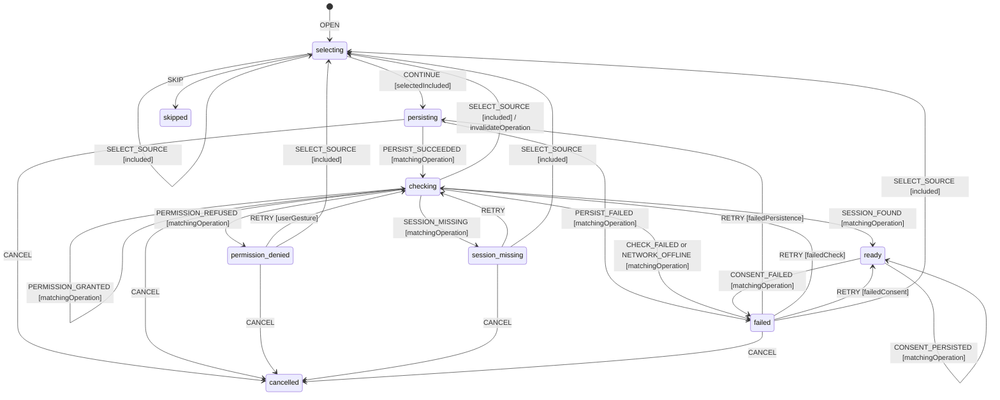

# Onboarding Source Workflow Model

Authoritative behavior for selecting, persisting, and checking a connector in
onboarding, and for projecting the same shipped connector state in Settings.

## Scope and decisions

Both screens derive their source list from `getConnectorsMeta()` and therefore
the build-filtered `INCLUDED_CONNECTOR_IDS`. A connector excluded from the
package cannot appear, be persisted, be checked, or be granted a permission.

The workflow separates three facts that the current UI can otherwise conflate:
the selected connector, its confirmed persisted `enabled` value, and its
runtime permission/session result. Onboarding cannot leave the source step
until all three are valid. Skipping onboarding is explicit and grants no
automatic-scan consent.

## State vocabulary and context

The exact connector check vocabulary consumed by onboarding and Settings is:

```ts
type ConnectorId = 'free-work' | 'lehibou' | 'hiway' | 'collective' | 'cherry-pick' | 'malt';

type ConnectorCheckStatus =
  'checking' | 'ready' | 'permission_denied' | 'session_missing' | 'failed';

type OnboardingSourceState =
  'selecting' | 'persisting' | ConnectorCheckStatus | 'cancelled' | 'skipped';

interface SourceContext {
  state: OnboardingSourceState;
  includedConnectorIds: readonly ConnectorId[];
  selectedConnectorId: ConnectorId | null;
  previousEnabledConnectorIds: readonly ConnectorId[];
  persistedEnabledConnectorIds: readonly ConnectorId[];
  permission: 'unknown' | 'not_required' | 'granted' | 'denied';
  session: 'unknown' | 'present' | 'missing';
  lastSync: string | null;
  operationId: string | null;
  failurePhase: 'persistence' | 'permission' | 'session' | 'offline' | 'consent' | null;
  error: string | null;
  scanConsent: boolean;
}

interface ConnectorSourceProjection {
  id: ConnectorId;
  enabled: boolean;
  status: ConnectorCheckStatus;
  permission: SourceContext['permission'];
  session: SourceContext['session'];
  lastSync: string | null;
  error: string | null;
}
```

`scanConsent` is a persisted, explicit user decision. Selecting or checking a
source does not set it. The source-step confirmation may set it only after the
connector is `ready` and the consent write succeeds.

## Events

```ts
type OnboardingSourceEvent =
  | {
      type: 'OPEN';
      includedConnectorIds: readonly ConnectorId[];
      enabledConnectorIds: readonly ConnectorId[];
      scanConsent: boolean;
    }
  | { type: 'SELECT_SOURCE'; connectorId: ConnectorId }
  | { type: 'CONTINUE'; operationId: string }
  | { type: 'PERSIST_SUCCEEDED'; operationId: string; enabledConnectorIds: readonly ConnectorId[] }
  | { type: 'PERSIST_FAILED'; operationId: string; error: string }
  | { type: 'PERMISSION_GRANTED'; operationId: string; required: boolean }
  | { type: 'PERMISSION_REFUSED'; operationId: string }
  | { type: 'SESSION_FOUND'; operationId: string; lastSync: string | null }
  | { type: 'SESSION_MISSING'; operationId: string }
  | { type: 'CHECK_FAILED'; operationId: string; error: string }
  | { type: 'NETWORK_OFFLINE'; operationId: string }
  | { type: 'CONFIRM_SOURCE'; operationId: string }
  | { type: 'CONSENT_PERSISTED'; operationId: string }
  | { type: 'CONSENT_FAILED'; operationId: string; error: string }
  | { type: 'RETRY'; operationId: string }
  | { type: 'CANCEL'; operationId: string }
  | { type: 'SKIP'; operationId: string }
  | { type: 'SERVICE_WORKER_RESTARTED' }
  | { type: 'HYDRATED'; enabledConnectorIds: readonly ConnectorId[]; scanConsent: boolean };
```

## Statechart



## Guards

| Guard               | Rule                                                                                                          |
| ------------------- | ------------------------------------------------------------------------------------------------------------- |
| `included`          | Connector ID occurs in the current build-filtered catalogue.                                                  |
| `selectedIncluded`  | Selection is non-null, included, and differs from no stale catalogue entry.                                   |
| `matchingOperation` | Response operation ID equals the current operation ID.                                                        |
| `userGesture`       | Optional permission request is directly caused by the user's Continue/Retry action.                           |
| `failedPersistence` | `failurePhase === 'persistence'`.                                                                             |
| `failedCheck`       | Failure phase is permission, session, or offline.                                                             |
| `failedConsent`     | `failurePhase === 'consent'` and connector check facts remain valid.                                          |
| `canConfirm`        | State is `ready`, selection is persisted/enabled, permission is granted/not required, and session is present. |

## Transition table

| From                   | Event                | Guard               | To                         | Effects                                                                         |
| ---------------------- | -------------------- | ------------------- | -------------------------- | ------------------------------------------------------------------------------- |
| `selecting`            | `SELECT_SOURCE`      | `included`          | `selecting`                | Store candidate only; no persistence or permission prompt.                      |
| `selecting`            | `CONTINUE`           | `selectedIncluded`  | `persisting`               | Snapshot previous settings; persist selected connector enabled.                 |
| `persisting`           | `PERSIST_SUCCEEDED`  | `matchingOperation` | `checking`                 | Commit enabled IDs; check/request host permission, then session through worker. |
| `persisting`           | `PERSIST_FAILED`     | `matchingOperation` | `failed`                   | Retain candidate, restore previous projection, expose retry.                    |
| `checking`             | `PERMISSION_GRANTED` | matching            | `checking`                 | Continue deterministic session detection.                                       |
| `checking`             | `PERMISSION_REFUSED` | matching            | `permission_denied`        | Remain on source step; no scan and no success copy.                             |
| `checking`             | `SESSION_FOUND`      | matching            | `ready`                    | Store session and last-sync facts; enable source-step confirmation.             |
| `checking`             | `SESSION_MISSING`    | matching            | `session_missing`          | Remain on source step and offer open-platform/retry action.                     |
| `checking`             | `CHECK_FAILED`       | matching            | `failed`                   | Store typed retryable technical error.                                          |
| `checking`             | `NETWORK_OFFLINE`    | matching            | `failed`                   | Store `failurePhase='offline'`; preserve persisted selection.                   |
| `ready`                | `CONFIRM_SOURCE`     | `canConfirm`        | `ready`                    | Persist scan consent; advance wizard only on `CONSENT_PERSISTED`.               |
| `ready`                | `CONSENT_FAILED`     | matching            | `failed`                   | Set `failurePhase='consent'`; stay in onboarding and never claim consent.       |
| refusal/missing/failed | `RETRY`              | matching phase      | `checking` or `persisting` | New operation ID; repeat only the failed phase and dependencies.                |
| active                 | `CANCEL`             | matching            | `cancelled`                | Abort request, invalidate operation ID, restore previous enabled IDs if needed. |
| `selecting`            | `SKIP`               | —                   | `skipped`                  | Persist no scan consent; preserve prior settings.                               |

Settings uses the same `ConnectorCheckStatus` per included connector. Toggling
an enabled connector reuses the persistence and check guards; Settings may
display multiple connector snapshots but serializes mutations per connector.
The source choice means "enable and verify this connector"; no unsupported
`primarySource` field or display label such as `"Free-Work"` is persisted.
Changing the selected source invalidates the prior operation ID before starting
another persistence/check sequence.

## Side effects and ownership

- **Core:** validates included IDs, reduces events, derives `canContinue`, and
  never imports the connector registry or browser APIs.
- **Side panel:** renders catalogue metadata and emits selection/continue/retry.
  It does not call `chrome.permissions`, `chrome.cookies`, IndexedDB, or storage.
- **Service worker Shell:** persists enabled IDs, owns optional permission and
  cookie/session checks, and returns typed events over the bridge.
- **Connector Shell:** detects session only after permission succeeds. It does
  not decide onboarding completion.

## Persistence boundary

`enabledConnectors` and `scanConsent` are stored in `chrome.storage.local`
through the settings/app-flags facade. Permission grants remain Chrome-owned;
session presence is observed, never persisted as a credential. `lastSync` may
be read from persisted connector status. Candidate selection, operation ID,
failure copy, and in-flight check are ephemeral.

After a restart, `HYDRATED` reloads canonical enabled IDs and consent. A check
that had no confirmed response restarts with a new operation ID; its old result
cannot advance the source step.

## Permissions and offline behavior

Permission requests are limited to the selected shipped connector's declared
host patterns and require a user gesture. Refusal maps only to
`permission_denied`; it is not a technical error and is never retried
automatically. Session detection follows permission and returns
`session_missing` without inventing credentials.

Offline detection maps to `failed` with `failurePhase='offline'`. Persisted
local selection remains intact, but onboarding cannot claim `ready` because a
required live session check was not completed. Retry is manual after network
recovery.

## Retry, cancellation, concurrency, and restart

- Retry repeats persistence only after a persistence failure; otherwise it
  repeats permission/session checking.
- Cancellation is terminal for that operation ID. Every late response is
  ignored, and any temporary settings change is rolled back or reconciled.
- Duplicate Continue/Retry while an operation is active returns a typed busy
  result and leaves the active operation unchanged.
- Different connector status reads may run concurrently in Settings, but only
  the matching connector/operation may update its snapshot.
- Service-worker restart triggers hydration and a fresh check; no in-flight
  permission or session result is presumed successful.

## Terminal states and re-entry

`ready` is terminal for the check operation but remains confirmable;
`permission_denied`, `session_missing`, and `failed` are settled retry states.
`cancelled` and `skipped` are terminal for the current onboarding attempt. A
new `OPEN` creates a new attempt from persisted facts. Settings can explicitly
start a new check from any settled connector state.

## Forbidden transitions

- Selection or persistence of a connector absent from `INCLUDED_CONNECTOR_IDS`.
- Session check before required permission is granted.
- Advance to the next onboarding step before selected source persistence,
  permission/session checks, and consent persistence are confirmed.
- Automatic retry after permission refusal or offline failure.
- Applying a result whose operation ID or connector ID does not match.
- Treating skip, permission refusal, or session absence as scan consent.
- Any implicit transition derived from a connector label, toast, or generated text.

## Invariants

1. Onboarding and Settings show exactly the same build-filtered connector set.
2. `ready` implies selected connector persisted, permission granted/not needed,
   and session present.
3. Continue stays disabled until the state is `ready`; wizard advancement waits
   for persisted consent.
4. No credentials or cookie values are stored by MissionPulse.
5. Permission refusal and missing session are distinct user-recoverable states.
6. A cancelled/stale operation can never publish a success result.
7. The side panel uses facades/messaging for all persistence and permissions.
8. An LLM never decides a transition; it supplies no signal in this workflow.

## Review checklist

- [x] Nominal select, persist, permission, session, confirm flow is explicit.
- [x] Excluded connector, persistence error, permission refusal, and missing session are covered.
- [x] Offline behavior and manual retry are named.
- [x] Skip and cancellation preserve prior settings and grant no consent.
- [x] Duplicate requests and late responses are operation-scoped.
- [x] Service-worker restart hydrates and rechecks instead of assuming success.
- [x] Settled-state re-entry requires Retry, a new check, or a new onboarding attempt.
