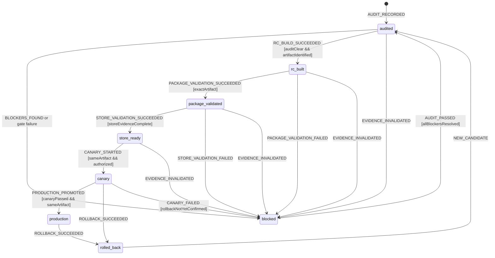

# Release Readiness Workflow Model

Authoritative fail-closed model for moving one MissionPulse release candidate
from audit to production or rollback. State is derived from attached evidence,
not from a mutable label or narrative approval.

## Scope and decisions

The exact ZIP installed in packaged MV3 tests is the only candidate eligible
for Chrome Web Store publication. Commit, committed version, built manifest,
connector catalogue, public metadata, ZIP SHA-256, runtime evidence, Store
configuration, and canary observations must refer to the same `releaseId` and
artifact.

Missing, stale, contradictory, or unverifiable evidence is a blocker. External
Store/canary work remains external until an authorized operator records proof;
local checks cannot claim those gates complete.

## Exact state vocabulary

```ts
type ReleaseReadinessState =
  | 'audited'
  | 'blocked'
  | 'rc_built'
  | 'package_validated'
  | 'store_ready'
  | 'canary'
  | 'production'
  | 'rolled_back';
```

No `ready`, `done`, `approved`, or prose-derived alias may substitute for one
of these states.

## Context and evidence

```ts
interface ReleaseReadinessContext {
  releaseId: string;
  state: ReleaseReadinessState;
  sourceCommit: string;
  committedVersion: string;
  artifactPath: string | null;
  artifactSha256: string | null;
  manifestVersion: string | null;
  manifestConnectorIds: readonly string[];
  auditedAt: string;
  p0Blockers: readonly ReleaseBlocker[];
  p1Blockers: readonly ReleaseBlocker[];
  localGateEvidence: readonly EvidenceRef[];
  mv3ScenarioEvidence: readonly EvidenceRef[];
  storeEvidence: readonly EvidenceRef[];
  canaryEvidence: readonly EvidenceRef[];
  rollbackArtifactSha256: string | null;
  activeAction: ReleaseAction | null;
  resumeFrom: ReleaseReadinessState | null;
  error: ReleaseGateError | null;
}
```

`ReleaseAction` includes an operation ID, actor identity, start time, and one
of `audit | build | validate_package | validate_store | publish_canary |
promote_production | rollback`. Secrets are never part of evidence.

## Events

```ts
type ReleaseReadinessEvent =
  | { type: 'AUDIT_RECORDED'; releaseId: string; evidence: EvidenceRef }
  | { type: 'BLOCKERS_FOUND'; releaseId: string; blockers: readonly ReleaseBlocker[] }
  | { type: 'AUDIT_PASSED'; releaseId: string; evidence: EvidenceRef }
  | { type: 'BUILD_REQUESTED'; releaseId: string; operationId: string }
  | {
      type: 'RC_BUILD_SUCCEEDED';
      releaseId: string;
      operationId: string;
      commit: string;
      version: string;
      artifactPath: string;
      sha256: string;
      manifestVersion: string;
      connectorIds: readonly string[];
    }
  | { type: 'RC_BUILD_FAILED'; releaseId: string; operationId: string; error: ReleaseGateError }
  | {
      type: 'PACKAGE_VALIDATION_SUCCEEDED';
      releaseId: string;
      operationId: string;
      sha256: string;
      evidence: readonly EvidenceRef[];
    }
  | {
      type: 'PACKAGE_VALIDATION_FAILED';
      releaseId: string;
      operationId: string;
      error: ReleaseGateError;
    }
  | {
      type: 'STORE_VALIDATION_SUCCEEDED';
      releaseId: string;
      operationId: string;
      evidence: readonly EvidenceRef[];
    }
  | {
      type: 'STORE_VALIDATION_FAILED';
      releaseId: string;
      operationId: string;
      error: ReleaseGateError;
    }
  | {
      type: 'CANARY_STARTED';
      releaseId: string;
      operationId: string;
      artifactSha256: string;
      evidence: EvidenceRef;
    }
  | {
      type: 'CANARY_PASSED';
      releaseId: string;
      operationId: string;
      evidence: readonly EvidenceRef[];
    }
  | { type: 'CANARY_FAILED'; releaseId: string; operationId: string; error: ReleaseGateError }
  | {
      type: 'PRODUCTION_PROMOTED';
      releaseId: string;
      operationId: string;
      artifactSha256: string;
      evidence: EvidenceRef;
    }
  | { type: 'ROLLBACK_REQUESTED'; releaseId: string; operationId: string; reason: string }
  | {
      type: 'ROLLBACK_SUCCEEDED';
      releaseId: string;
      operationId: string;
      restoredSha256: string;
      evidence: EvidenceRef;
    }
  | { type: 'ROLLBACK_FAILED'; releaseId: string; operationId: string; error: ReleaseGateError }
  | { type: 'EVIDENCE_INVALIDATED'; releaseId: string; reason: string }
  | { type: 'CANCEL_ACTION'; releaseId: string; operationId: string }
  | { type: 'RETRY_GATE'; releaseId: string; operationId: string }
  | { type: 'SERVICE_RESTARTED'; releaseId: string }
  | { type: 'NEW_CANDIDATE'; releaseId: string };
```

## Statechart



Build/validation/publish/rollback actions run while the last stable state
remains visible in `state`; `activeAction` records the in-flight action. Only a
typed success event advances the state.

## Guards

| Guard                      | Rule                                                                                                                             |
| -------------------------- | -------------------------------------------------------------------------------------------------------------------------------- |
| `matchingReleaseAndAction` | Release ID and operation ID match current context/active action.                                                                 |
| `allBlockersResolved`      | Zero open P0 and P1 blockers, each closure linked to fresh evidence.                                                             |
| `auditClear`               | Audit covers workflows, security, permissions, metadata, CI, runtime, and rollback; no P0/P1.                                    |
| `artifactIdentified`       | ZIP exists and commit/version/manifest/SHA-256 are non-empty and mutually consistent.                                            |
| `exactArtifact`            | Validated/installed ZIP SHA equals `artifactSha256`; post-build manifest and committed version match.                            |
| `localGateComplete`        | Format, lint, typecheck, unit/integration tests, build, post-build manifest validation, and packaged MV3 tests passed.           |
| `storeEvidenceComplete`    | CWS credentials/config, listing, privacy disclosures, minimal permissions, package metadata, and rollback artifact are verified. |
| `canaryPassed`             | Defined duration/sample completed with no stop threshold crossed and rollback rehearsal evidenced.                               |
| `authorized`               | Named human/operator is permitted for the external Store action; required credentials exist.                                     |
| `sameArtifact`             | Event SHA equals candidate SHA and no rebuild/repack occurred after validation.                                                  |

## Transition table

| From                  | Event                  | Guard                               | To                  | Required evidence/effects                                              |
| --------------------- | ---------------------- | ----------------------------------- | ------------------- | ---------------------------------------------------------------------- |
| initial               | `AUDIT_RECORDED`       | complete audit                      | `audited`           | Record exact commit, version, findings, owner, timestamp.              |
| `audited`             | `BLOCKERS_FOUND`       | any P0/P1                           | `blocked`           | Attach blocker list; forbid build/publish advancement.                 |
| `blocked`             | `AUDIT_PASSED`         | all resolved                        | `audited`           | Re-run affected audit/gates; do not resume later state directly.       |
| `audited`             | `RC_BUILD_SUCCEEDED`   | matching action, audit clear        | `rc_built`          | Build once from clean commit; record ZIP path/hash/manifest/catalogue. |
| `audited`             | `RC_BUILD_FAILED`      | matching                            | `blocked`           | Attach command/log; retain no candidate artifact claim.                |
| `rc_built`            | package success        | exact artifact, local gate complete | `package_validated` | Install/test `dist`/ZIP in real MV3 runtime; record matrix and hash.   |
| `rc_built`            | package failure        | matching                            | `blocked`           | Record failure; invalidate package evidence.                           |
| `package_validated`   | store success          | complete external evidence          | `store_ready`       | Confirm listing/privacy/permissions/credentials/dashboard fields.      |
| `package_validated`   | store failure          | matching                            | `blocked`           | Record missing/refused credential or metadata mismatch.                |
| `store_ready`         | `CANARY_STARTED`       | same artifact, authorized           | `canary`            | Publish exact candidate to limited group; start measured window.       |
| `canary`              | `PRODUCTION_PROMOTED`  | canary passed, same artifact        | `production`        | Promote without rebuild; record Store version/time/operator.           |
| canary/production     | rollback success       | authorized, restored hash           | `rolled_back`       | Restore known-good artifact and verify availability/health.            |
| any pre-release state | `EVIDENCE_INVALIDATED` | matching release                    | `blocked`           | Record reason (changed commit/artifact/metadata/expired proof).        |

`CANARY_FAILED` requires immediate rollback when a stop threshold is crossed.
Until rollback is confirmed, state is `blocked` with the external canary state
recorded; it is never relabeled as `rolled_back` optimistically.

## Side effects and ownership

- **Core/model:** pure guards over immutable evidence references and artifact
  identity. It cannot build, publish, read secrets, or approve a release.
- **Local/CI Shell:** executes gates, builds the candidate, hashes bytes,
  validates the post-build manifest, stores logs/traces/screenshots, and emits
  typed results.
- **Authorized release operator:** performs CWS dashboard, canary, promotion,
  and rollback actions and records external receipts.
- **Documentation:** `docs/release/<version>-rc-evidence.md` summarizes evidence
  without converting missing external proof into completion.

## Persistence boundary

Release state is recomputed from the committed evidence bundle plus immutable
CI/artifact/external references. The candidate ZIP is retained byte-for-byte;
its SHA-256 and source commit are durable identifiers. Secrets, cookie values,
and access tokens are never written into the bundle.

An in-flight `activeAction`/lock may be stored by CI or the release runner, but
it is not proof of success. After runner/service restart, every referenced file
and hash is revalidated and every unconfirmed external action becomes blocked
until reconciled.

## Permissions and offline behavior

Local audit/build checks use repository permissions only. Store validation,
canary, production, and rollback require an authorized operator, network, 2FA,
and all four CWS credentials: `CHROME_EXTENSION_ID`, `CHROME_CLIENT_ID`,
`CHROME_CLIENT_SECRET`, and `CHROME_REFRESH_TOKEN`. Missing/refused permissions
or credentials transition to/remain `blocked`; they are never warnings in
production mode.

Offline local checks may be recorded, but no state at or beyond `store_ready`
can advance without fresh online external proof. A transient network failure
keeps the stable state, records a failed action, and permits explicit Retry.

## Retry, cancellation, concurrency, and restart

- Gate retries use a new operation ID and attach new evidence; failed/stale
  evidence cannot be relabeled successful.
- Cancelling a local build/validation before side effects complete aborts the
  action and retains the previous stable state. Once CWS publication/canary is
  externally visible, cancellation means modeled rollback, not local abort.
- One release lock exists per `releaseId`; concurrent action returns typed busy
  and does not mutate evidence/state.
- Rebuild, repack, manifest edit, source commit change, or metadata drift after
  validation invalidates downstream evidence and moves to `blocked`.
- Runner/service restart revalidates the bundle. Unknown external outcome is
  blocked until queried; it is never assumed failed or successful.

## Terminal states and re-entry

`production` is the successful terminal state for a candidate but permits the
explicit rollback path. `rolled_back` is terminal for that candidate;
`NEW_CANDIDATE` creates a new release ID and returns to `audited` only after a
fresh audit. `blocked` is settled, not success; it re-enters solely through a
fresh passing audit after blockers are resolved.

## Forbidden transitions

- `audited`/`blocked` directly to package, Store, canary, or production states.
- `rc_built` to later states when hash/version/manifest/commit disagree.
- `package_validated` based on dev-stub Playwright instead of packaged MV3.
- `store_ready` with missing credentials, dashboard fields, metadata alignment,
  permission justification, rollback artifact, or external proof.
- Canary/production publication of rebuilt or repacked bytes.
- `canary`/`production` to `rolled_back` before rollback confirmation.
- Advancement from warnings, free text, branch name, tag, or mutable status flag.
- Any implicit transition from an LLM assessment, narrative approval, or report prose.

## Invariants

1. State vocabulary is exactly the eight values declared above.
2. Every advance has same-release, same-artifact, fresh attached evidence.
3. Zero unresolved P0/P1 is required at and beyond `rc_built`.
4. `package_validated` means the exact ZIP hash passed post-build validation and
   real packaged MV3 scenarios.
5. `store_ready`, `canary`, and `production` require explicit external proof.
6. The committed version, tag/release source commit, manifest, listing, and ZIP
   describe the same product/connectors.
7. Missing production configuration fails closed.
8. Rollback never claims success before the known-good artifact is restored and verified.
9. An LLM never decides a transition; authorized typed events plus guards do.

## Review checklist

- [x] Nominal `audited -> rc_built -> package_validated -> store_ready -> canary -> production` flow is explicit.
- [x] Audit, blocker remediation, build, exact-package validation, Store, canary, production, and rollback are explicit.
- [x] Build/test/manifest/config/metadata/permission failures fail closed.
- [x] Offline and refused/missing external authorization cannot advance release.
- [x] Retry, local cancellation, post-publication rollback, and concurrent action lock are defined.
- [x] Runner/service restart and unknown external outcome force reconciliation.
- [x] Production/rollback terminal behavior and fresh-candidate re-entry are explicit.
