# Release Readiness Evidence Model

Status: approved for implementation on 2026-07-16 after independent container
and transport-authority reviews of content hash
`56871269eb4e124dedcdd1d49dd510f0ee89d774751e868dedad4088458a385c`.
Any semantic change requires a new independent review; tooling and workflow
changes must retain adversarial tests for every fail-closed boundary.

## Scope and non-claims

This model separates deterministic local release work from external Chrome Web
Store facts.

- Local work may advance `audited -> rc_built -> package_validated ->
store_ready` by validating immutable structured receipts.
- This repository never submits, cancels, retries, promotes, or rolls back a
  provider operation. There are no provider command events in this model.
- `submission`, canary, production, and rollback are facts ingested after an
  operator/provider performed them elsewhere. Only the structured signed
  receipts defined here have authority; a generic `EvidenceRef`, dashboard
  label, free text, or LLM assessment has none.
- Task 12's maximum claim is `store_ready`, and only after a valid Store bundle
  plus a valid authorization receipt are ingested. Local Task 12 output alone
  normally stops at `package_validated`. `canary`, `production`, and
  `rolled_back` remain external gates and are not claimed by this task.
- The current candidate version is `0.2.2`, read from committed source rather
  than embedded in the reducer. Every candidate has one canonical SemVer and
  one derived immutable release namespace. After an artifact is published, a
  later candidate requires a strictly greater committed version, a new clean
  build, the complete packaged MV3 gate, a new seal, and a new namespace;
  published bytes are never reused or overwritten.
- Actor construction is itself a controller-global compare-and-swap admission:
  it reserves the release ID and namespace against the durable release catalog,
  derives the version and packaged-MV3 inventory from the named clean commit,
  and publishes neither an actor nor a reservation on conflict.

If a fact cannot be represented by these values and guards, it cannot advance
release readiness.

## Exact states

```ts
type ReleaseReadinessState =
  | 'audited'
  | 'blocked'
  | 'rc_built'
  | 'package_validated'
  | 'store_ready'
  | 'canary'
  | 'production'
  | 'rolled_back';
```

`canary` means the submitted candidate has a valid metrics-and-pass receipt,
not merely that an upload started. `production` requires a promotion receipt.
`rolled_back` requires a rollback receipt with healthy restoration and is
reachable only from `canary` or `production`.

There is no public uninitialized context. The factory validates and atomically
persists `CandidateIdentityV1 + AuditReceiptV1 + candidate_reserved` under the
expected global catalog revision, then publishes the actor directly in
`audited`. Constructor failure publishes neither actor nor catalog record and
introduces no ninth state.

## Canonical primitives and bounds

```ts
type Sha256 = string; // exactly 64 lowercase hexadecimal ASCII characters
type CanonicalUtcTimestamp = string;
type CanonicalSemVer = string;

const RELEASE_LIMITS = {
  maxIdAsciiBytes: 128,
  maxImmutableUriBytes: 2048,
  maxFiles: 20_000,
  maxDirectories: 20_000,
  maxFileBytes: 536_870_912,
  maxZipBytes: 2_147_483_648,
  maxExecutionImageArchiveBytes: 536_870_912,
  maxReleaseControllerBundleBytes: 16_777_216,
  maxSealedCandidateTransportBytes: 1_073_741_824,
  maxAttestationBundleBytes: 16_777_216,
  maxWorkflowBlobBytes: 262_144,
  maxPrivilegedWorkflowUses: 32,
  maxOciLayers: 128,
  maxEffectiveLoadedObjects: 8_192,
  maxControllerSources: 256,
  maxPathUtf8Bytes: 65_535,
  maxTotalPathUtf8Bytes: 16_777_216,
  maxScenarioIds: 512,
  maxSemVerAsciiBytes: 64,
  maxPermissionEntries: 128,
  maxPermissionAsciiBytes: 512,
  maxJournalEntries: 16,
  maxAuthorizationReceipts: 8,
  maxSigningKeysPerPolicy: 16,
  maxGlobalReplayTuples: 16,
  maxGlobalReplayRecordsPerTuple: 64,
  maxReleaseCatalogEntries: 256,
  maxPackageObservationEntries: 40_032,
} as const;

const RELEASE_TOOLCHAIN = {
  nodeVersion: '22.23.1',
  pnpmVersion: '10.32.1',
  pythonVersion: '3.14.5',
  releasePlatform: 'linux/amd64',
  nodeBaseImageManifestSha256: '8607a9064d4a571140998ae9e52a3b3fcf9cff361d04642d5971e6cd76d39e27',
  pythonStandaloneRelease: '20260510',
  pythonArchiveName:
    'cpython-3.14.5+20260510-x86_64-unknown-linux-gnu-install_only_stripped.tar.gz',
  pythonArchiveBytes: 35_955_046,
  pythonArchiveSha256: 'dc10977b0db3bef1ee2275107fde6fe9c148135b556fa352e83c6baa67d17ed6',
  pythonRuntimeEntryCount: 4_758,
  pythonRuntimeFileCount: 3_510,
  pythonRuntimeDirectoryCount: 201,
  pythonRuntimeSymlinkCount: 1_047,
  pythonRuntimeBytes: 100_940_658,
  pythonRuntimeTreeSha256: 'd639663b4675a2cc8b30a0264d797a53a957304f03cf2acacc94816a5bc48d03',
  pythonExecutableSha256: 'a1512f9a07029c4a9b02a1bb63bbd156d36b0dcb26f49cb7f5ee175f19b222da',
  pnpmIntegrity:
    'sha512-pwaTjw6JrBRWtlY+q07fHR+vM2jRGR/FxZeQ6W3JGORFarLmfWE94QQ9LoyB+HMD5rQNT/7KnfFe8a1Wc0jyvg==',
  descriptorScannerProtocol: 'missionpulse.descriptor-scanner.v1',
  descriptorReadProtocol: 'missionpulse.descriptor-read.v1',
  descriptorWriteProtocol: 'missionpulse.descriptor-write.v1',
  safeExtractionProtocol: 'missionpulse.safe-extraction.v1',
  atomicRenameProtocol: 'missionpulse.atomic-rename-no-replace.v1',
  descriptorScannerSha256: 'e440610e7d2c490a7ebb1b70746ae2a9c243eccd7e4e845f95262ef3e4794c1a',
} as const;

const CANONICAL_UTC =
  /^(?:[2-9]\d{3})-(?:0[1-9]|1[0-2])-(?:0[1-9]|[12]\d|3[01])T(?:[01]\d|2[0-3]):[0-5]\d:[0-5]\d\.\d{3}Z$/;
const MIN_RELEASE_INSTANT_MS = 946_684_800_000;
const MAX_RELEASE_INSTANT_MS = 253_402_300_799_999;
const CANONICAL_SEMVER =
  /^(0|[1-9]\d*)\.(0|[1-9]\d*)\.(0|[1-9]\d*)(?:-((?:0|[1-9]\d*|\d*[A-Za-z-][0-9A-Za-z-]*)(?:\.(?:0|[1-9]\d*|\d*[A-Za-z-][0-9A-Za-z-]*))*))?(?:\+([0-9A-Za-z-]+(?:\.[0-9A-Za-z-]+)*))?$/;
```

IDs are 1..128 bytes of canonical ASCII
`[A-Za-z0-9][A-Za-z0-9._:-]*`. Nonces are exactly 32 bytes encoded as 43
unpadded base64url characters. Ed25519 signatures are exactly 64 bytes encoded
as canonical padded base64; Ed25519 public keys are exactly 32 bytes encoded as
canonical padded base64. Counts, byte sizes, and issuer sequences are
non-negative safe integers within the bounds above. Validators reject before
allocation; they never truncate.

Every other field ending in `JcsBase64` is canonical RFC 4648 padded base64 with
no whitespace and round-trips byte-for-byte. Its encoded length is rejected
before decode when it could exceed the applicable decoded bound. The Sigstore
and trusted-root values decode to at most `maxAttestationBundleBytes` RFC 8785
JCS bytes; parsing and reserialization must reproduce those exact decoded bytes.
`workflowBlobUtf8Base64` uses the same canonical padded-base64 rules, is
rejected by encoded length before decode, decodes to at most
`maxWorkflowBlobBytes`, and must round-trip through strict UTF-8 without a BOM.

A `CanonicalSemVer` is 1..64 ASCII bytes, matches `CANONICAL_SEMVER`, parses as
SemVer 2.0.0, and round-trips byte-for-byte through the committed SemVer
serializer. Numeric identifiers have no leading zero, and every numeric
component fits a safe integer. The release namespace is exactly
`"v" + committedVersion`; the grammar makes it one safe path segment. Version
precedence uses SemVer precedence, so a build-metadata-only change is not a
version bump.

Permission names and Chrome match patterns are canonical ASCII within their
declared bound; patterns must parse and reserialize byte-for-byte through the
committed manifest validator. Arrays are bounded, duplicate-free, and sorted by
unsigned bytes.

Every canonical tree or ZIP path is 1..65,535 UTF-8 bytes, contains no NUL,
backslash, empty segment, `.` segment, `..` segment, absolute prefix, or trailing
slash, and round-trips byte-for-byte through the committed UTF-8/POSIX path
validator. This is the exact unsigned 16-bit ZIP filename bound; a longer path
is rejected before ZIP construction, so the non-ZIP64 contract is executable.
The derived set of unique parent directories is bounded by `maxDirectories` and
is validated before snapshot allocation. The sum of UTF-8 bytes across file,
derived-directory, ZIP-receipt and observation paths is at most
`maxTotalPathUtf8Bytes` per value.

Git commit/tree IDs are exactly 40 lowercase hex characters for `sha1` and 64
for `sha256`; both values are read from the clean checked-out candidate, never
relabeled as content SHA-256.

A timestamp is valid only when it is exactly 24 ASCII bytes, matches
`CANONICAL_UTC`, parses to a safe integer inside the inclusive bounds, and
round-trips through `new Date(ms).toISOString()`. Temporal comparisons use
parsed epoch milliseconds only, never lexical comparison. Every field ending
in `At` uses this contract.

Canonical serialization means RFC 8785 JCS UTF-8 bytes. For both
`AuthorizationReceiptV1` and `ExternalReceiptEnvelopeV1`:

```text
canonicalPayloadSha256 = SHA256(JCS(receipt with exactly
  canonicalPayloadSha256 and detachedSignatureBase64 omitted))

authorizationSignedBytes =
  ASCII("missionpulse.release-authorization.v1") || 0x00 ||
  hexDecode(canonicalPayloadSha256)

externalSignedBytes =
  ASCII("missionpulse.external-release-receipt.v1") || 0x00 ||
  hexDecode(canonicalPayloadSha256)
```

`hexDecode` yields exactly 32 bytes. Ed25519 signs the applicable byte string
directly; there is no extra hash, newline, length prefix, BOM, or stringified
hex. The canonical envelope digest used for duplicate/replay checks is
SHA-256 over JCS of the complete descriptor-snapshotted receipt, including
`canonicalPayloadSha256`, the signature, and every nested reference.

## Candidate, manifest, permissions, and local evidence

```ts
interface ImmutableBlobRefV1 {
  schema: 'missionpulse.immutable-blob';
  version: 1;
  kind: string;
  immutableUri: string;
  sha256: Sha256;
  bytes: number;
}

interface SignaturePolicyV1 {
  schema: 'missionpulse.signature-policy';
  version: 1;
  purpose: 'authorization' | 'external_receipt';
  policySha256: Sha256;
  allowedProvider: 'missionpulse_release_authority' | 'chrome_web_store_api';
  keys: readonly {
    issuerId: string;
    issuerKeyId: string;
    signatureAlgorithm: 'ed25519';
    publicKeyBase64: string;
  }[];
}

interface PinnedPrivilegedWorkflowUseV1 {
  stepId: string;
  usesLiteral: string;
  repository: string;
  actionPath: string | null;
  commitSha: string; // exactly 40 lowercase hexadecimal characters
}

interface GitHubTransportAttestationPolicyV1 {
  schema: 'missionpulse.github-transport-attestation-policy';
  version: 1;
  policySha256: Sha256;
  provider: 'github-artifact-attestations';
  oidcIssuer: 'https://token.actions.githubusercontent.com';
  sourceRepository: string;
  sourceRef: 'refs/heads/main';
  workflowPath: '.github/workflows/ci.yml';
  workflowBlobUtf8Base64: string;
  workflowBlobSha256: Sha256;
  privilegedJobId: 'seal-candidate';
  privilegedJobProjectionSha256: Sha256;
  privilegedJobUses: readonly PinnedPrivilegedWorkflowUseV1[];
  predicateType: 'https://slsa.dev/provenance/v1';
  trustedRootJcsBase64: string;
  trustedRootJcsSha256: Sha256;
}

interface ManifestAuthorityV1 {
  schema: 'missionpulse.manifest-authority';
  version: 1;
  manifestVersion: 3;
  extensionVersion: CanonicalSemVer;
  minimumChromeVersion: string;
  manifestSha256: Sha256;
  permissions: readonly string[];
  hostPermissions: readonly string[];
  optionalHostPermissions: readonly string[];
  permissionSetSha256: Sha256;
}

interface CommittedMv3ScenarioInventoryV1 {
  schema: 'missionpulse.packaged-mv3-scenario-inventory';
  version: 1;
  scenarioIds: readonly string[];
}

interface CandidateIdentityV1 {
  schema: 'missionpulse.candidate-identity';
  version: 1;
  releaseId: string;
  sourceCommit: string;
  gitObjectFormat: 'sha1' | 'sha256';
  gitTreeObjectId: string;
  committedVersion: CanonicalSemVer;
  releaseNamespace: string;
  lockfileSha256: Sha256;
  connectorConfigSha256: Sha256;
  includedConnectorIds: readonly string[];
  manifest: ManifestAuthorityV1;
  mv3ScenarioInventoryPath: 'apps/extension/tests/mv3/scenarios.v1.json';
  mv3ScenarioInventoryBlobSha256: Sha256;
  expectedMv3ScenarioIds: readonly string[];
  expectedMv3ScenarioInventorySha256: Sha256;
  transportAttestationPolicy: GitHubTransportAttestationPolicyV1;
  authorizationPolicy: SignaturePolicyV1 & { purpose: 'authorization' };
  externalReceiptPolicy: SignaturePolicyV1 & { purpose: 'external_receipt' };
}

type ReleaseCatalogRecordKind = 'candidate_reserved' | 'candidate_abandoned' | 'artifact_published';

interface GlobalReleaseCatalogRecordV1 {
  catalogSequence: number;
  kind: ReleaseCatalogRecordKind;
  actorId: string;
  releaseId: string;
  sourceCommit: string;
  committedVersion: CanonicalSemVer;
  releaseNamespace: string;
  artifactId: string | null;
  artifactSha256: Sha256 | null;
  recordedAt: CanonicalUtcTimestamp;
}

interface GlobalReleaseCatalogV1 {
  schema: 'missionpulse.global-release-catalog';
  version: 1;
  revision: number;
  catalogSha256: Sha256;
  records: readonly GlobalReleaseCatalogRecordV1[];
}

interface AuditReceiptV1 {
  schema: 'missionpulse.release-audit';
  version: 1;
  receiptId: string;
  releaseId: string;
  sourceCommit: string;
  committedVersion: CanonicalSemVer;
  releaseNamespace: string;
  mv3ScenarioInventoryBlobSha256: Sha256;
  expectedMv3ScenarioInventorySha256: Sha256;
  coveredDomains: readonly (
    | 'workflows'
    | 'security'
    | 'permissions'
    | 'metadata'
    | 'ci'
    | 'runtime'
    | 'artifact'
    | 'store'
    | 'canary'
    | 'rollback'
  )[];
  openP0Count: 0;
  openP1Count: 0;
  recordedAt: CanonicalUtcTimestamp;
  report: ImmutableBlobRefV1;
}

interface LocalGateReceiptV1 {
  schema: 'missionpulse.local-gate';
  version: 1;
  receiptId: string;
  releaseId: string;
  sourceCommit: string;
  startedAt: CanonicalUtcTimestamp;
  completedAt: CanonicalUtcTimestamp;
  format: 'passed';
  lint: 'passed';
  typecheck: 'passed';
  unit: 'passed';
  sourceManifest: 'passed';
  report: ImmutableBlobRefV1;
}

interface CanonicalFileEntryV2 {
  path: string;
  bytes: number;
  sha256: Sha256;
  mode: '0644';
}

interface CanonicalTreeReceiptV2 {
  algorithm: 'missionpulse-tree-sha256-v2';
  fileCount: number;
  treeSha256: Sha256;
  manifestSha256: Sha256;
  entries: readonly CanonicalFileEntryV2[];
}

interface SealedCandidatePayloadInventoryV1 {
  schema: 'missionpulse.sealed-candidate-payload-inventory';
  version: 1;
  inventorySha256: Sha256;
  entries: readonly [
    {
      path: 'build-metadata.json';
      kind: 'blob';
      bytes: number;
      sha256: Sha256;
    },
    {
      path: 'build-provenance.json';
      kind: 'blob';
      bytes: number;
      sha256: Sha256;
    },
    {
      path: 'dist';
      kind: 'tree';
      fileCount: number;
      bytes: number;
      sha256: Sha256;
    },
    {
      path: 'release-controller.bundle.mjs';
      kind: 'blob';
      bytes: number;
      sha256: Sha256;
    },
    {
      path: 'release-execution-authority.json';
      kind: 'blob';
      bytes: number;
      sha256: Sha256;
    },
    {
      path: 'release-execution-image.oci.tar';
      kind: 'blob';
      bytes: number;
      sha256: Sha256;
    },
  ];
}

interface ReleaseExecutionAuthorityV1 {
  schema: 'missionpulse.release-execution-authority';
  version: 1;
  authorityId: string;
  sourceCommit: string;
  platform: 'linux/amd64';
  startedAt: CanonicalUtcTimestamp;
  completedAt: CanonicalUtcTimestamp;
  recipePath: 'apps/extension/release/Dockerfile';
  recipeBlobSha256: Sha256;
  buildContextInventorySha256: Sha256;
  buildMetadata: ImmutableBlobRefV1 & { kind: 'release-execution-buildkit-metadata' };
  buildProvenance: ImmutableBlobRefV1 & { kind: 'release-execution-slsa-provenance' };
  provenancePredicateType: 'https://slsa.dev/provenance/v1';
  provenanceSubjectManifestSha256: Sha256;
  provenanceMaterialsSha256: Sha256;
  nodeBaseImageManifestSha256: Sha256;
  pythonArchive: {
    pythonVersion: '3.14.5';
    release: '20260510';
    name: string;
    bytes: number;
    sha256: Sha256;
  };
  pythonRuntime: {
    entryCount: number;
    fileCount: number;
    directoryCount: number;
    symlinkCount: number;
    regularFileBytes: number;
    treeSha256: Sha256;
    executableSha256: Sha256;
    effectiveLoadedObjectsSha256: Sha256;
  };
  controllerBundle: ImmutableBlobRefV1 & { kind: 'release-controller-bundle' };
  controllerBundleSourceInventorySha256: Sha256;
  descriptorScannerProtocol: 'missionpulse.descriptor-scanner.v1';
  descriptorScannerSha256: Sha256;
  invocationPolicySha256: Sha256;
  image: {
    format: 'oci-image-layout-tar-v1';
    archive: ImmutableBlobRefV1 & { kind: 'release-execution-image-oci' };
    indexSha256: Sha256;
    manifestSha256: Sha256;
    configSha256: Sha256; // canonical executionImageId, no `sha256:` prefix
    layerSha256: readonly Sha256[];
    diffIdSha256: readonly Sha256[];
    finalRootInventorySha256: Sha256;
  };
}

interface GitHubTransportAttestationV1 {
  schema: 'missionpulse.github-transport-attestation';
  version: 1;
  provider: 'github-artifact-attestations';
  attestationId: string;
  subjectName: 'missionpulse-sealed-candidate';
  subjectDigest: Sha256;
  predicateType: 'https://slsa.dev/provenance/v1';
  sigstoreBundleJcsBase64: string;
  sigstoreBundleJcsSha256: Sha256;
  sourceRepository: string;
  sourceRef: 'refs/heads/main';
  workflowPath: '.github/workflows/ci.yml';
  signerWorkflowRef: string;
  signerWorkflowSha: string;
  runId: number;
  runAttempt: number;
  headSha: string;
}

interface SealedCandidateTransportObservationV1 {
  schema: 'missionpulse.sealed-candidate-transport-observation';
  version: 1;
  artifactName: 'missionpulse-sealed-candidate';
  transportFormat: 'missionpulse-canonical-zip-v1';
  transportBytes: number;
  transportSha256: Sha256;
  payloadInventorySha256: Sha256;
  capturedAt: CanonicalUtcTimestamp;
  preUploadAttestation: GitHubTransportAttestationV1;
  uploaderOutputDigest: Sha256;
  artifactId: string;
  artifactDigest: Sha256; // GitHub `sha256:` prefix stripped before validation
  downloadedTransportSha256: Sha256;
  requestedRetentionDays: 30;
  workflowPath: '.github/workflows/ci.yml';
  runId: number;
  runAttempt: number;
  headSha: string;
  conclusion: 'success';
  artifactCreatedAt: CanonicalUtcTimestamp;
  artifactExpiresAt: CanonicalUtcTimestamp;
  observedAt: CanonicalUtcTimestamp;
}

interface ReleaseExecutionPayloadVerificationV1 {
  schema: 'missionpulse.release-execution-payload-verification';
  version: 1;
  verificationId: string;
  verificationSha256: Sha256;
  releaseId: string;
  sealId: string;
  sealSha256: Sha256;
  sourceCommit: string;
  transportSha256: Sha256;
  transportZipReceiptSha256: Sha256;
  payloadInventorySha256: Sha256;
  controllerBundleSha256: Sha256;
  controllerBundleSourceInventorySha256: Sha256;
  buildMetadataSha256: Sha256;
  buildProvenanceSha256: Sha256;
  executionAuthoritySha256: Sha256;
  ociArchiveSha256: Sha256;
  ociIndexSha256: Sha256;
  ociManifestSha256: Sha256;
  ociConfigSha256: Sha256;
  layerSha256: readonly Sha256[];
  diffIdSha256: readonly Sha256[];
  finalRootInventorySha256: Sha256;
  pythonRuntimeTreeSha256: Sha256;
  pythonExecutableSha256: Sha256;
  effectiveLoadedObjectsSha256: Sha256;
  verifiedAt: CanonicalUtcTimestamp;
}

interface BuildReceiptV1 {
  schema: 'missionpulse.candidate-build';
  version: 1;
  receiptId: string;
  buildId: string;
  releaseId: string;
  sourceCommit: string;
  nodeVersion: string;
  pnpmVersion: string;
  pnpmIntegrity: string;
  startedAt: CanonicalUtcTimestamp;
  completedAt: CanonicalUtcTimestamp;
  distTree: CanonicalTreeReceiptV2;
  manifest: ManifestAuthorityV1;
  report: ImmutableBlobRefV1;
}

interface PackagedMv3GateReceiptV1 {
  schema: 'missionpulse.packaged-mv3-gate';
  version: 1;
  receiptId: string;
  releaseId: string;
  sourceCommit: string;
  buildId: string;
  startedAt: CanonicalUtcTimestamp;
  completedAt: CanonicalUtcTimestamp;
  expectedScenarioInventorySha256: Sha256;
  executedScenarioIds: readonly string[];
  passedScenarioCount: number;
  skippedScenarioCount: 0;
  failedScenarioCount: 0;
  runtimeDiagnosticFindingCount: 0;
  treeBeforeSuite: CanonicalTreeReceiptV2;
  treeAfterSuite: CanonicalTreeReceiptV2;
  rawPlaywrightReport: ImmutableBlobRefV1;
  report: ImmutableBlobRefV1;
}

interface TestedDistSealV1 {
  schema: 'missionpulse.tested-dist-seal';
  version: 1;
  sealId: string;
  sealSha256: Sha256;
  releaseId: string;
  sourceCommit: string;
  committedVersion: CanonicalSemVer;
  buildId: string;
  lockfileSha256: Sha256;
  connectorConfigSha256: Sha256;
  includedConnectorIds: readonly string[];
  localGate: LocalGateReceiptV1;
  build: BuildReceiptV1;
  mv3Gate: PackagedMv3GateReceiptV1;
  executionAuthority: ReleaseExecutionAuthorityV1;
  payloadInventory: SealedCandidatePayloadInventoryV1;
  testedTree: CanonicalTreeReceiptV2;
  manifest: ManifestAuthorityV1;
  worktreeCleanBeforeGate: true;
  worktreeCleanAfterGate: true;
  sealedAt: CanonicalUtcTimestamp;
}
```

`transportAttestationPolicy.policySha256` is SHA-256 of JCS of the complete
policy with only `policySha256` omitted. `trustedRootJcsSha256` is SHA-256 of the
decoded exact JCS trust-root bytes. `workflowBlobSha256` is SHA-256 of the exact
bounded UTF-8 workflow Git-blob bytes decoded from `workflowBlobUtf8Base64`.
Actor construction requires those bytes to equal the blob at `workflowPath` in
the candidate's exact source commit and tree. It parses them with the committed
strict workflow inspector, rejects duplicate YAML keys, aliases, merge keys and
unsupported dynamic structures, and derives the named privileged job's exact
permissions and ordered step projection. `privilegedJobProjectionSha256` is
SHA-256 of JCS of that complete derived projection. The projection contains
every step ID, exact `run` bytes or `uses` literal, conditions, inputs and
environment affecting the job; it cannot omit a step. Actor construction
verifies and retains the complete committed policy, not only its hashes;
Sigstore and workflow verification are pure injected primitives parameterized
by those exact bytes, roots and claims. A changed root, issuer, repository, ref,
workflow byte, action pin, permission or predicate requires a new committed
candidate policy and therefore a new candidate identity.

`privilegedJobUses` is nonempty, ordered exactly like the derived job steps,
duplicate-free by step ID, and bounded by `maxPrivilegedWorkflowUses`. Every
`uses` step in `seal-candidate` appears exactly once and every entry must be a
literal GitHub repository action reference of the form
`owner/repository[/action-path]@<40 lowercase hexadecimal commit SHA>` whose
projections match `usesLiteral`; tags, branches, shortened SHAs, expressions,
Docker references, reusable workflows and ambient or local actions are
forbidden. Step IDs, repository and action-path projections are canonical,
bounded ASCII; owner/repository is lowercase, and empty/dot/dot-dot/repeated
path segments are invalid. Conversely, every policy entry must name one actual
step. A `run` step is authorized only as exact bytes inside the bound workflow
blob and may invoke committed source only at `candidate.sourceCommit`;
downloaded or generated executable helpers must already be content-authorized
by the release receipts below. The privileged job has no unprojected service,
container, matrix include or job-level `uses` capability. Any pre/post execution
declared by an admitted action is part of that exact pinned
repository/path/commit capability and no other action version is trusted.

The candidate gate is one clean-checkout CI job. It installs the exact pinned
toolchain with the frozen lockfile, records the local gates, performs exactly
one production build, inspects that build before and after the packaged-MV3
suite, freezes `dist`, bundles the release controller, constructs/proves the
release-execution image, creates the final gate input and seal, then freezes,
attests and uploads the exact seven-element sealed-candidate payload defined
below. No other job or workflow may rebuild bytes later presented as that
candidate.

The local, build, raw Playwright, and derived packaged-MV3 report references are
not declarative booleans. Before creating a seal, the sealer opens each
referenced report with no-follow semantics, enforces its byte bound before
reading, recomputes its byte length and SHA-256, and parses its exact structured
schema. The sealer itself walks the raw Playwright JSON bytes, requires each
executed test to carry exactly one `scenario-id` annotation, derives the exact
scenario result array and runtime diagnostic finding count, and requires the
annotation set to be byte-for-byte equal to the committed nine-ID inventory.
The derived packaged-MV3 report bytes must equal those sealer-derived values;
they cannot substitute for, or outlive, the sealed raw report reference. A
declared pass count, scenario array, skip/failure count, or diagnostic count
that is not derivable from the raw report cannot advance the gate.

`lockfileSha256` is SHA-256 of the exact committed `pnpm-lock.yaml` bytes and
`connectorConfigSha256` is SHA-256 of the exact committed
`apps/extension/connectors.config.json` bytes. `includedConnectorIds` is the
sorted unique build-time connector set derived from that configuration. The
gate input, seal, build report, built manifest filtering, and clean commit must
agree on all three values. Node and pnpm versions equal `RELEASE_TOOLCHAIN`
byte-for-byte; a major-only or minor-only version is invalid.

`ManifestAuthorityV1` contains the exact effective built-manifest permission
arrays after connector build filtering. Arrays are duplicate-free and sorted by
unsigned UTF-8 bytes. `permissionSetSha256` is the SHA-256 of JCS serialization
of the three arrays. Source manifest, built manifest, tree manifest, seal,
package, and every external receipt must agree on version, manifest digest, and
permission-set digest.

`candidate.committedVersion` is read from the exact clean committed extension
package source, byte-equals `candidate.manifest.extensionVersion`, passes the
canonical SemVer round-trip, and derives
`candidate.releaseNamespace = "v" + candidate.committedVersion`. Audit, seal,
artifact, Store receipt and every external envelope must carry that same value;
no runtime input or environment override can choose it.

`GlobalReleaseCatalogV1` is controller-global durable state, separate from
release actors. Its digest is SHA-256 of JCS with only `catalogSha256` omitted.
Records are append-only in exact `catalogSequence` order, start at one, never
fork, truncate, rewrite, evict, or reuse a `releaseId`, and are bounded by
`maxReleaseCatalogEntries`. A reservation is active after
`candidate_reserved` until the same actor/release has exactly one subsequent
`candidate_abandoned` or `artifact_published` record. Published namespaces are
permanently occupied. An abandoned namespace may be reserved again only because
the abandonment guard already proved that no accepted final path or live
package journal remains.

Actor construction receives `actorId`, `expectedCatalogRevision`, a candidate,
its audit, and canonical `admittedAt`. In one durable CAS it validates the exact
clean Git commit/tree,
derives committed version, manifest and scenario inventory, checks the catalog
revision/capacity, rejects a reused release ID or an active/published namespace,
and appends `candidate_reserved`. If any artifact has previously been published,
the candidate SemVer precedence must be strictly greater than the greatest
published SemVer; equality through build metadata is insufficient. It then
persists actor context and audit in the same transaction. A conflict or any
validation failure publishes neither actor nor reservation;
`audit.recordedAt <= admittedAt`. Artifact
publication repeats the version/namespace check against the current catalog and
atomically appends `artifact_published`; a lower candidate that lost a race to a
higher published version fails closed and cannot publish.

Every successful catalog CAS compares one expected revision, appends one or
more consecutive records, increments the catalog revision exactly once, and
recomputes its digest. Factory reservation uses `recordedAt=admittedAt`;
publication uses `recordedAt=artifact.validatedAt`; candidate replacement uses
its single `catalogedAt` for any required abandonment and the new reservation,
after `audit.recordedAt <= catalogedAt`. A conflict/capacity error mutates neither
actor nor catalog. An already accepted exact local duplicate is detected before
CAS and does not consume another revision.

`candidate_reserved` and `candidate_abandoned` have null artifact fields;
`artifact_published` has the exact validated `artifactId` and ZIP SHA-256. Only
an active reservation can be abandoned or published, and those two terminal
record kinds are mutually exclusive for one release.

Each signature policy is frozen in the candidate, has at most 16 unique
issuer/key pairs, and hashes the JCS policy with only `policySha256` omitted.
The reducer therefore has the exact allowlisted public keys needed for pure
signature verification; it never fetches key material.

The only authority for `candidate.expectedMv3ScenarioIds` is the Git blob at
`candidate.mv3ScenarioInventoryPath` in `candidate.sourceCommit` and
`candidate.gitTreeObjectId`. Its bytes are exactly JCS of
`CommittedMv3ScenarioInventoryV1`, with no BOM or trailing newline, and their
SHA-256 equals `candidate.mv3ScenarioInventoryBlobSha256`. The factory parses
that blob, rejects any worktree/environment/runtime override, and copies its
`scenarioIds` byte-for-byte into the candidate. The array is nonempty, contains
at most 512 unique canonical ASCII IDs, and is sorted by unsigned ASCII bytes.
Its binding is exactly:

```text
candidate.expectedMv3ScenarioInventorySha256 =
  SHA256(JCS(candidate.expectedMv3ScenarioIds))
```

The packaged gate is complete only when its expected inventory digest equals
the candidate digest, `executedScenarioIds` is byte-for-byte equal to the
candidate array (same values and order), `passedScenarioCount` equals that
array's length, and skipped, failed, and runtime-diagnostic counts are all zero.
Missing, extra, duplicate, reordered, or silently skipped scenarios fail
closed.

`sealSha256` hashes the JCS serialization of the complete seal with only the
`sealSha256` property omitted. It is not an exit-code claim. The local report,
build report, complete aggregated MV3 report, expected scenario inventory, and
pre/post suite trees are mandatory. Per-test output cannot substitute for the
aggregated gate.

The exact local chronology is:

```text
audit.recordedAt
<= localGate.startedAt <= localGate.completedAt
<= build.startedAt <= build.completedAt
<= mv3Gate.startedAt <= mv3Gate.completedAt
<= executionAuthority.startedAt <= executionAuthority.completedAt
<= seal.sealedAt
```

All receipts name the same release, source commit, build where applicable,
canonical version and namespace, manifest, permission set, configuration, and
scenario inventory. The execution authority is a post-browser receipt owned by
the seal, never by `BuildReceiptV1`; its interval begins only after the complete
packaged-MV3 gate and ends before `sealedAt`.

The transport chronology is separately exact:

```text
seal.sealedAt
<= transport.capturedAt
<= transport.artifactCreatedAt
<= transport.observedAt
<= payloadVerification.verifiedAt
< transport.artifactExpiresAt
```

The attestation precedes upload by exact topological step order in the committed
workflow: the pinned attestation action must complete and expose its attestation
ID before the pinned uploader step is eligible to start. No synthetic signing
wall-clock value is inferred from certificate validity. `artifactCreatedAt` and
`artifactExpiresAt` are GitHub artifact-API facts for the single-file upload;
`observedAt` is the later API observation. The committed uploader input requests
exactly 30 days, while the API expiry is recorded rather than translated back
into a claimed `retention-days` parameter. No transport time is embedded into
the already sealed payload. Payload verification finishes before
`PackageJournalV1.reserved.at` and therefore before the first package-specific
write.
`build.distTree == mv3.treeBeforeSuite == mv3.treeAfterSuite == seal.testedTree`.

## Package-only artifact and journal

After `sealedAt`, the runner is package-only. Install, build, version bump,
manifest edit, connector resolution, `dist` deletion, and any command capable
of rewriting tested bytes are forbidden.

```ts
type PackagePhase =
  | 'reserved'
  | 'staging_created'
  | 'snapshot_verified'
  | 'archive_built'
  | 'archive_verified'
  | 'bundle_renamed'
  | 'published'
  | 'cleaned';

interface PackageJournalEntryV1 {
  phase: PackagePhase;
  at: CanonicalUtcTimestamp;
  renameIntentAt: CanonicalUtcTimestamp | null;
  ownedDirectoryIdentitySha256: Sha256 | null;
  ownershipMarkerSha256: Sha256 | null;
  treeSha256: Sha256 | null;
  archiveSha256: Sha256 | null;
  bundleInventorySha256: Sha256 | null;
}

interface PackageJournalV1 {
  schema: 'missionpulse.package-journal';
  version: 1;
  journalId: string;
  releaseId: string;
  sealId: string;
  artifactId: string;
  releaseNamespace: string;
  ownershipTokenSha256: Sha256;
  stagingBundlePath: string;
  finalBundlePath: string;
  ownershipMarkerRelativePath: '.missionpulse-owner.json';
  workRelativePath: '.missionpulse-work';
  zipRelativePath: 'missionpulse.zip';
  sidecarRelativePath: 'missionpulse.zip.sha256';
  validationRelativePath: 'validation.json';
  verifiedZipReceipt: CanonicalZipReceiptV1 | null;
  history: readonly PackageJournalEntryV1[];
}

interface CanonicalZipEntryReceiptV1 {
  path: string;
  utf8NameSha256: Sha256;
  crc32Hex: string;
  uncompressedBytes: number;
  compressedBytes: number;
  compressionMethod: 0;
  generalPurposeBitFlag: 0x0800;
  versionNeeded: 20;
  versionMadeBy: 0x031e;
  dosTime: 0x0000;
  dosDate: 0x0021;
  internalFileAttributes: 0;
  externalFileAttributes: 0x81a40000;
  localExtraFieldBytes: 0;
  centralExtraFieldBytes: 0;
  entryCommentBytes: 0;
  localHeaderOffset: number;
}

interface CanonicalZipReceiptV1 {
  schema: 'missionpulse.canonical-zip';
  version: 1;
  zipSha256: Sha256;
  zipBytes: number;
  entryCount: number;
  compression: 'store';
  normalizedTimestamp: '1980-01-01T00:00:00.000Z';
  zip64: false;
  dataDescriptor: false;
  archiveCommentBytes: 0;
  diskNumber: 0;
  centralDirectoryStartDisk: 0;
  entriesOnDisk: number;
  entries: readonly CanonicalZipEntryReceiptV1[];
  entryInventorySha256: Sha256;
  localHeaderOrderSha256: Sha256;
  centralDirectoryOrderSha256: Sha256;
  twinBuildSha256: Sha256;
  twinReceiptSha256: Sha256;
}

interface ChecksumSidecarReceiptV1 {
  filename: 'missionpulse.zip.sha256';
  bytes: 83;
  sha256: Sha256;
}

interface PackageValidationRecordV1 {
  schema: 'missionpulse.package-validation';
  version: 1;
  artifactId: string;
  releaseId: string;
  sealId: string;
  sealSha256: Sha256;
  committedVersion: CanonicalSemVer;
  releaseNamespace: string;
  sourceTreeSha256: Sha256;
  extractedTreeSha256: Sha256;
  ownershipMarkerSha256: Sha256;
  zipSha256: Sha256;
  sidecarSha256: Sha256;
  entryInventorySha256: Sha256;
  canonicalZipReceiptSha256: Sha256;
  validatedAt: CanonicalUtcTimestamp;
}

interface ValidatedZipArtifactV1 {
  schema: 'missionpulse.validated-zip-artifact';
  version: 1;
  artifactId: string;
  releaseId: string;
  sealId: string;
  sealSha256: Sha256;
  sourceCommit: string;
  committedVersion: CanonicalSemVer;
  releaseNamespace: string;
  manifest: ManifestAuthorityV1;
  sourceTree: CanonicalTreeReceiptV2;
  snapshotTree: CanonicalTreeReceiptV2;
  extractedTree: CanonicalTreeReceiptV2;
  zip: CanonicalZipReceiptV1;
  checksumSidecar: ChecksumSidecarReceiptV1;
  bundleDirectoryPath: string;
  zipPath: string;
  sidecarPath: string;
  validationPath: string;
  validationRecord: PackageValidationRecordV1;
  validationJsonSha256: Sha256;
  bundleInventorySha256: Sha256;
  journalId: string;
  publishedAt: CanonicalUtcTimestamp;
  validatedAt: CanonicalUtcTimestamp;
}

interface ObservedPackageEntryV1 {
  path: string;
  kind: 'regular' | 'directory' | 'symlink' | 'other';
  bytes: number | null;
  sha256: Sha256 | null;
}

interface ObservedPackagePathV1 {
  kind: 'absent' | 'directory' | 'non_directory';
  directoryIdentitySha256: Sha256 | null;
  ownershipMarkerSha256: Sha256 | null;
  entries: readonly ObservedPackageEntryV1[];
  completeInventorySha256: Sha256 | null;
}

interface LocalReleaseObservationV1 {
  schema: 'missionpulse.local-release-observation';
  version: 1;
  observationId: string;
  restartId: string;
  releaseId: string;
  journalId: string | null;
  observedAt: CanonicalUtcTimestamp;
  sourceTree: CanonicalTreeReceiptV2 | null;
  staging: ObservedPackagePathV1;
  final: ObservedPackagePathV1;
  observationSha256: Sha256;
}
```

The canonical tree accepts regular files only, with no-follow reads. Paths are
relative POSIX UTF-8, unique under byte/case/Unicode comparison, and sorted by
unsigned UTF-8 bytes (`LC_ALL=C`). Symlinks, hard-link aliases, traversal,
backslashes, special files, sparse surprises, and changing file identities are
rejected.

For each sorted entry, tree v2 hashes the exact ASCII/UTF-8 bytes
`path + NUL + decimalByteLength + NUL + lowercaseFileSha256 + LF`; `treeSha256`
is SHA-256 of the concatenation. Decimal length has no sign or leading zero
except the value zero. The complete entry list is always retained.

Package observations are produced only by the no-follow local scanner in
response to a correlated restart request. For a directory, entries are a
complete recursive inventory sorted by unsigned UTF-8 path bytes and bounded by
`maxPackageObservationEntries`; regular files carry exact bytes/SHA-256,
directories carry both nulls, and any symlink or other object makes the
observation non-adoptable. Repeated device/inode pairs or link counts above one
are classified non-adoptable rather than ordinary regular files.
`completeInventorySha256` is SHA-256 of JCS of the
entries. For `absent`, both identity/digests are null and entries are empty; for
`non_directory`, directory identity is null and the observation always fails
closed. The marker digest is null unless the exact marker is one regular entry.
`observationSha256` is SHA-256 of JCS of the complete observation with only that
field omitted; the complete descriptor-snapshotted entries are therefore
directly available to the pure reducer without dereferencing a report.

`completeInventorySha256` is the observation digest and is not confused with
the four-consumer `bundleInventorySha256`. When an exact bundle is expected, the
reducer additionally projects the four observed regular-file entries to the
ordered `{path,bytes,sha256}` array declared below, recomputes
`bundleInventorySha256`, and requires both complete-inventory equality (no extra
object) and bundle-inventory equality.

The path-independent top-directory identity is exactly SHA-256 of JCS of
`{deviceDecimal,inodeDecimal,kind:"directory"}` obtained from `fstat` on an open
directory descriptor acquired with no-follow semantics. Decimal device/inode
strings are canonical non-negative base-10 integers with no leading zero except
zero and at most 32 ASCII bytes. The descriptor stays open across every live
verification/mutation; after restart, the stored digest, exact marker digest and
complete inventory must all match before any owned path can be resumed or
cleaned.

Canonical source scans, snapshots, bundle verification, and extraction anchor
the root and every traversed directory with no-follow directory descriptors.
Child opens are relative to the already-open parent descriptor; pathnames are
never re-resolved from an ambient root after admission. The number of opened
unique directories is bounded by `maxDirectories` before descent. JSON, report,
sidecar, and ZIP sizes are bounded from descriptor metadata before any complete
read or allocation; the canonical per-file limit is exactly 512 MiB.

No release Python process executes an interpreter resolved from host `PATH`, a
host package manager, a mutable tool cache, an operator-provided pathname or a
version-only probe. Python is part of one content-authorized release execution
image. The only supported release platform is `linux/amd64`; every other host or
architecture fails before a candidate-specific read or write.

The host gate and the release-execution image have disjoint responsibilities.
The exact `ubuntu-24.04` gate performs frozen dependency installation, build and
all nine Playwright/Chrome scenarios under `LocalGateReceiptV1`, `BuildReceiptV1`
and `PackagedMv3GateReceiptV1`. Its root `packageManager` field includes the
exact pnpm version plus committed SHA-512 integrity, and Corepack verifies those
bytes. After the browser gate, the host freezes `dist` and uses the lockfile-
bound esbuild binary to produce one standalone ESM release-controller bundle
from an exact committed source inventory. Bundle size, bytes, source-inventory
digest and SHA-256 are recorded. No dependency directory or browser is mounted
into the release image, and that image never installs, builds or runs the
packaged browser scenarios; it performs only post-test tree evidence, sealing,
package-only construction and consumer verification against the frozen inputs.

The image recipe starts from the exact per-platform Node base manifest digest
in `RELEASE_TOOLCHAIN`, never its multi-platform tag. Before the candidate
artifact or controller bundle is mounted, the workflow downloads the literal
immutable-release Python archive name from release `20260510`, requires the
exact byte count and lower-case SHA-256 above, and provides exactly two regular
build-context entries: the reviewed image recipe and that archive. Their
ordered `{path,bytes,sha256}` projection determines
`buildContextInventorySha256`; any extra context object blocks. The recipe
repeats the size/digest proof and extracts only the `python/` tree. Absolute
paths, device/FIFO/socket entries, hard links and symlinks whose normalized
resolution escapes `python/` are rejected. Relative symlink targets may contain
`.` or `..` only when byte-exact normalization remains inside that root. The
archive's repeated path entries use the extractor's reviewed deterministic
last-entry-wins rule, and the final inventory must match the committed digest.
All directory and regular-file write bits are then removed. The archive is the
content authority for the interpreter, standard library, extension modules and
bundled dynamic libraries; self-reporting `3.14.5` is not authority.

The normalized runtime inventory contains every directory, regular file and
symlink below `python/`, sorted by unsigned UTF-8 relative-path bytes. Each
entry is exactly `[path,kind,mode,bytes,content]`: `kind` is `d`, `f` or `l`;
for directories and regular files, `mode` is four lower-case octal permission
digits after synthetic write-bit removal. Symlink mode is the literal `link`
because Linux cannot chmod a symlink itself. Directories use zero/empty content;
regular-file content is lower-case SHA-256; symlink content is the exact UTF-8
target and `bytes` is its UTF-8 length. Entry paths use the canonical safe-path
grammar; link targets use the normalized-inside-root rule above. No final
hard-link/device alias is permitted. SHA-256 of UTF-8
`JSON.stringify(['missionpulse-python-runtime-tree',1,entries])` must equal the
committed tree digest and its file/directory/symlink counts and regular-file
byte total must equal the committed bounds. `python/bin/python3.14` must be one
native regular file with the committed executable SHA-256. This inventory is
verified during image construction and again inside the running image before
any frozen candidate-artifact access.

BuildKit writes one bounded metadata blob and one separate SLSA provenance v1
statement. The controller strictly parses those untrusted raw outputs and emits
their bounded RFC 8785 JCS projections as the literal transport paths
`build-metadata.json` and `build-provenance.json`; raw BuildKit JSON bytes are
never presumed canonical. Their `ImmutableBlobRefV1.immutableUri` values are
exactly those internal paths and contain no artifact ID/digest, attestation,
transport observation, seal or authority reference. The strict projections
bind the recipe blob, two-entry context, exact base manifest, target platform,
resulting OCI manifest/config digests and ordered layer descriptors. The
provenance subject is exactly the OCI image manifest; its ordered JCS material
projection is exactly the base-manifest, recipe, Python-archive and
build-context digests and yields `provenanceMaterialsSha256`. Provenance may
reference the metadata projection, but neither projection references the
authority, seal or GitHub artifact. No network-fetched build material other than
the already captured archive and digest-addressed base image is legal. The host
kernel, local Docker daemon, BuildKit process, GitHub Actions runner
orchestration and GitHub OIDC/Sigstore attestation service are the explicit
trusted computing base; registry tags, build logs and self-declared container
labels are not authority.

The controller also records the final root inventory, ordered config
`rootfs.diff_ids`, and the digest of every effective object mapped after a probe
imports the union of all modules used by release helpers. Python-tree objects
use the runtime inventory; the loader and system-library objects are bound both
by their bytes and by the base manifest/layer chain. Unknown build metadata, an
extra material/layer, a replaced loader/library or a final layer not derivable
from the reviewed recipe/context/provenance blocks.

The successfully proved image is emitted exactly once as an OCI image-layout
tar with at most `maxExecutionImageArchiveBytes`. The tar has exact root entries
`oci-layout`, `index.json` and `blobs/sha256/*`; `oci-layout` declares version
`1.0.0`; `index.json` has schema version 2 and exactly one `linux/amd64` image
manifest, with no tag, ref name, attestation manifest or extra descriptor. Every
blob name equals its bytes' SHA-256. The image manifest has exactly one config
and a nonempty bounded ordered layer array. `configSha256` is the 64 lower-case
hex digest of the config blob without a `sha256:` prefix and is the canonical
`executionImageId`; config OS/architecture and ordered `diff_ids` must match the
authority receipt.

The seal carries an exact six-entry `payloadInventory`, sorted by unsigned UTF-8
path bytes. Blob entries bind the literal bytes of canonical BuildKit metadata,
canonical SLSA provenance, controller bundle, JCS execution-authority file and
OCI tar. The `dist` entry binds `testedTree.treeSha256`, its file-byte sum and
file count. `payloadInventory.inventorySha256` is SHA-256 of JCS of the complete
inventory with only `inventorySha256` omitted. Every entry agrees byte-for-byte
with the corresponding receipt/reference. The seal deliberately does not
inventory its own complete bytes: `sealSha256` remains SHA-256 of JCS of the
complete seal with only `sealSha256` omitted. This makes the graph acyclic:
metadata/provenance bind build inputs and the OCI manifest; authority binds
metadata, provenance, controller and OCI; seal binds the authority plus the six
non-seal components; transport observation binds the post-seal transport.

After `sealedAt`, the controller creates one bounded deterministic ZIP-format
transport blob whose filename and GitHub artifact subject are both exactly
`missionpulse-sealed-candidate`. The transport has seven logical top-level
components: `tested-dist-seal.json`, frozen `dist/`,
`release-controller.bundle.mjs`, `release-execution-authority.json`,
`build-metadata.json`, `build-provenance.json` and
`release-execution-image.oci.tar`. Its complete file inventory uses the same
non-ZIP64 canonical header/order/timestamp/UTF-8 rules defined for package ZIPs,
with paths rooted below those seven names, and validates against the seal's
six-entry inventory plus exact JCS seal bytes. The controller captures the
complete transport bytes once, bounds them by
`maxSealedCandidateTransportBytes`, and emits their SHA-256 as protected runner
step output; a pathname, later rehash or upload result cannot replace that
pre-upload commitment.

Before upload, `actions/attest` at the exact reviewed commit for v4.2.0
(`f7c74d28b9d84cb8768d0b8ca14a4bac6ef463e6`) receives only explicit
`subject-name: missionpulse-sealed-candidate` and
`subject-digest: sha256:<captured digest>`; `subject-path`, checksums discovery
and automatic artifact discovery are forbidden. GitHub OIDC/Sigstore signs that
digest and the workflow/run identity before any artifact pathname is read by an
uploader. The `seal-candidate` job grants exactly `contents: read`,
`id-token: write` and `attestations: write`; no artifact-metadata, package,
release or repository-write permission is present. Before the privileged job is
admitted, its complete workflow blob, exact permission projection and every
remote action step have already matched the candidate policy; every `uses`
literal is a reviewed full SHA40 pin, including setup, checkout, attestation and
upload actions. A mutable action tag or an extra local/dynamic action makes the
candidate invalid before any OIDC-bearing step. The action's bounded Sigstore
bundle is strictly parsed as ordinary detached JSON and verified immediately.
`sigstoreBundleJcsSha256` is SHA-256 of RFC 8785 JCS of that parsed complete
bundle; raw file whitespace, a trailing LF or an API serializer is not its
preimage. Those complete JCS bytes are encoded into
`sigstoreBundleJcsBase64` and carried inside the V event, within the committed
bound; a blob reference or self-hash alone is invalid. The reducer decodes and
verifies the DSSE signature, certificate chain and transparency material through
the pure verifier configured by `candidate.transportAttestationPolicy`, then
derives rather than trusts every projection. Its authenticated claims project exact `sourceRef`,
`signerWorkflowRef` and `signerWorkflowSha`; they must resolve to the committed
main-branch workflow and `headSha`. Only then is it projected into
`GitHubTransportAttestationV1`, and only then does
`actions/upload-artifact` at the exact reviewed v7.0.1 commit
(`043fb46d1a93c77aae656e7c1c64a875d1fc6a0a`) upload the single blob with
`archive:false`, no overwrite and requested retention of exactly 30 days. Its
output digest must equal the captured and attested digest in the same job or the
run fails. A swap before or during upload therefore yields an unsigned artifact
digest and cannot become a successful sealed-candidate observation.

After upload, each consumer obtains the exact
`SealedCandidateTransportObservationV1` from the GitHub Actions and artifact-
attestation APIs. It cryptographically verifies the Sigstore bundle and signer
identity, requires the attestation subject, captured transport digest, uploader
output, REST artifact digest and freshly downloaded single-file digest all to
be equal, and requires artifact name/ID/API expiry, originating run/attempt,
successful conclusion, main source ref, signer workflow ref/SHA and head SHA to
match the requested sealed commit. The
complete committed workflow bytes at that head SHA must equal the candidate's
embedded blob and hash, and the strict re-derived privileged-job projection and
exhaustive SHA40 action inventory must equal its policy byte-for-byte. That job
alone grants the three declared permissions; the GitHub SLSA predicate is not
claimed to contain a job ID. A signature/API ambiguity, missing attestation,
mutable/unlisted action, alternate workflow/ref/blob, path swap or byte mismatch
blocks before ZIP parsing or execution.

Adversarial transport tests replace each privileged `uses` SHA with a tag,
branch, shortened SHA or expression; add, remove and reorder action/run steps;
inject local, Docker, reusable-workflow, service and matrix execution;
change permissions, workflow bytes or projection hashes; and forge every
projected claim while keeping a valid repository/ref/run tuple. Each mutation
must reject before attestation ingestion, transport extraction or controller
execution.

Later package and consumer-verification jobs first verify the GitHub transport
attestation and complete downloaded transport digest, then safely extract the
canonical seven-component transport, validate its seal/payload inventory, and
only then verify the transported BuildKit/SLSA provenance. They open the OCI tar
no-follow, bound its size, capture all bytes once, and verify the archive plus
complete OCI descriptor graph from that captured buffer. They feed those exact
in-memory bytes to `docker load` over stdin; Docker never receives or reopens an
archive pathname. The loaded config ID must equal the receipt before invocation.
Rebuilding an equivalent recipe, resolving a tag, loading unverified bytes or
accepting a different image ID is forbidden.

The content-authorized controller emits one
`ReleaseExecutionPayloadVerificationV1` only after those byte-level checks and
the in-container runtime/effective-object probes pass. Every digest and ordered
layer/diff-ID array must equal both the extracted payload and
`ReleaseExecutionAuthorityV1`; `transportZipReceiptSha256` binds the complete
canonical ZIP receipt. `verificationSha256` is SHA-256 of RFC 8785 JCS of the
whole receipt with only `verificationSha256` omitted. The reducer never opens a
file: `RELEASE_PAYLOAD_VERIFIED_INGESTED` carries this descriptor-snapshotted
signal together with the signed transport observation, and its pure guards
cross-bind both receipts to the seal before any package journal can be admitted.
The signal does not replace the verifier; it is valid only when produced by the
exact transported controller inside the proved image and when all listed
digests can be recomputed from the same captured bytes.

The workflow launches the image by immutable image ID, never by tag, with all
of these controls: read-only root filesystem, network disabled, all Linux
capabilities dropped, `no-new-privileges`, no Docker socket, no host
runtime/tool-cache mount, frozen `dist` and the controller bundle mounted
read-only, and only bounded named output locations writable. Temporary
locations are fresh bounded `tmpfs` mounts. The exact Python runtime and the base-image loader/system libraries
therefore remain in content-addressed read-only image layers. The controller
parses `/proc/self/mountinfo`, proves the runtime path is on the read-only root,
and proves that create, rename, unlink, chmod and same-size in-place write
attempts against the runtime root fail without changing its inventory. A
writable overlay or an unproved mount blocks before candidate access.

The release controller holds one process-global runtime capability after that
proof. Every version probe and protocol helper uses only
`/opt/missionpulse-python/python/bin/python3.14`, reopens it with no-follow
semantics, and requires the committed executable digest/identity. Every call
uses literal `-I -E -S -B`, the fixed allowlisted environment, and no
`PYTHONPATH`, `PYTHONHOME`, `PYTHONSTARTUP`, user-site, `LD_PRELOAD`,
`LD_LIBRARY_PATH`, `DYLD_*` or ambient loader injection. The container image
binds the standard library, extension modules, dynamic loader and system
libraries; a version string cannot substitute for those content proofs.

The committed descriptor-scanner source is read once through a no-follow
descriptor, bounded, UTF-8 round-tripped and matched to the committed digest.
Its captured bytes are passed as the `-c` argument; the child never reopens the
workspace script pathname or descriptor. All other Python helpers are captured
literal source bytes from the reviewed TypeScript module and use the same
runtime capability. Thus a workspace script swap or same-inode rewrite after
capture cannot change executed helper bytes.

Direct invocation of release sealing/packaging outside this exact execution
image, loss of the read-only proof, runtime tree drift, archive drift, image-ID
drift, descriptor reuse, unexpected `CLOEXEC`, or any fallback to an ambient
pathname fails closed before reading frozen `dist`/controller payload bytes or
writing package output. Checkout, frozen install, build and browser execution
belong to the separately receipted host gate above and make no release-image
claim.

Adversarial verification must cover archive/executable/tree digest drift; a
native impostor reporting `3.14.5`; host-path swap/restore, symlink retarget,
wrapper, deletion and rename; same-size interpreter, stdlib, extension-module,
dynamic-library and helper rewrites; a writable runtime overlay; wrong image ID,
platform or mount flags; closed/reused descriptors; missing `/proc` proof; and
`PYTHON*`, user-site, `LD_*` or `DYLD_*` injection. It must also mutate the
workspace scanner immediately after byte capture. Every attack test asserts
that a unique malicious sentinel was never created, not merely that a later
postflight check failed. A Linux integration test builds the exact image, runs
it with the declared Docker restrictions, proves legitimate scanner/read/write/
extraction helpers, then proves the negative mutation and injection cases before
the seal/package controller may consume the already completed host-gate receipts.

Descriptor-relative reads and writes additionally require the literal
`missionpulse.descriptor-read.v1` and `missionpulse.descriptor-write.v1`
protocols. The helper receives the already-open root descriptor, validates the
complete expected inventory, opens every descendant with no-follow `dir_fd`
operations, and rereads or fsyncs the exact admitted objects. Protocol output is
strictly bounded and a missing, extra, reordered, replaced, or drifting object
fails closed.

One exclusive lock covers source verification, no-follow copy into a private
snapshot, normalization, twin archive construction, safe extraction, final
verification, and publication. Snapshot files are `0644`, directories `0755`,
and timestamps fixed as above. The snapshot path is exactly the owned
`.missionpulse-work/snapshot`; there are no package temporary paths outside the
identity-bound staging directory.

The ZIP contract is byte-for-byte, not merely extraction-equivalent. There is
exactly one ZIP entry for every canonical tree file and no directory entry.
Local headers and central-directory records have the same order as
`sourceTree.entries`. For every entry, filename bytes are exactly the canonical
path's 1..65,535 UTF-8 bytes, both unsigned 16-bit filename-length fields equal
that byte length, the name digest and CRC-32 are recomputed, compressed size
equals uncompressed size, the local offset is exact, and the following values
are literal: STORE method `0`, UTF-8 flag `0x0800` with no other flag,
version-needed `20`, version-made-by `0x031e`, DOS time/date `0x0000/0x0021`,
internal attributes `0`, Unix regular-file `0644` external attributes
`0x81a40000`, and zero local extra, central extra, and entry comment bytes.
The archive has zero comment bytes, disk numbers zero, one-disk entry counts,
canonical central-directory offsets/sizes, no ZIP64 structures, no data
descriptor, no prepended/trailing bytes, and no ambient UID/GID. Backslashes,
NUL, invalid UTF-8, traversal and names not byte-equal to the tree are rejected.
`crc32Hex` is exactly eight lowercase hexadecimal ASCII characters;
`localHeaderOffset` is a non-negative safe integer. `entryCount`,
`entriesOnDisk`, the entries array length, and the canonical tree file count are
exactly equal and nonzero.

The inventory and order bindings are exact:

```text
entryInventorySha256 = SHA256(JCS(zip.entries))
framedNames = concat(for each canonical path:
  uint32be(utf8(path).byteLength) || utf8(path))
localHeaderOrderSha256 = SHA256(framedNames)
centralDirectoryOrderSha256 = SHA256(framedNames)
```

Both archives are constructed independently from the sealed snapshot in the
fresh, previously absent owned directories
`.missionpulse-work/zip-a` and `.missionpulse-work/zip-b`; safe extraction uses
`.missionpulse-work/extracted`. No package work path exists outside the
identity-bound staging directory. The complete observation therefore covers
every crash residue. The work root is removed before `archive_verified`, whose
staging inventory contains exactly the marker and three consumer files. Let
`firstZipSha256` be `zip.zipSha256` and `secondZipSha256` be the second build:

```text
zip.twinBuildSha256 = secondZipSha256 = firstZipSha256
zip.twinReceiptSha256 = SHA256(JCS({
  firstZipSha256,
  secondZipSha256,
  entryInventorySha256: zip.entryInventorySha256
}))
validationRecord.canonicalZipReceiptSha256 = SHA256(JCS(zip))
```

Each twin independently reopens and rereads the descriptor-anchored snapshot
into its own build directory, writes its own archive, fsyncs it, rereads the
archive from disk, and validates the reread bytes. Reusing one in-memory entry
array or cloning one archive into the second path is not an independent twin.

Any header, order, offset, CRC, size, inventory, or twin mismatch is
`ZIP_NON_CANONICAL`.

Safe extraction uses the newly created empty owned
`.missionpulse-work/extracted` directory and the same canonical inspector.
The extraction root descriptor remains open; every parent directory is created
and reopened no-follow relative to its admitted parent, and every output file is
created exclusively relative to that descriptor. There is no parent-symlink
window.
Advancement requires:

```text
seal.testedTree == source-before-copy == snapshotTree
== extractedTree == source-after-archive
```

File counts, entry lists, manifest bytes, version, permissions, and SHA-256
must all match. The sidecar bytes are exactly lowercase
`<zipSha256>  missionpulse.zip\n`: two ASCII spaces, one LF, no CR, BOM, or
extra byte; their length is exactly 83 and their SHA-256 is recomputed. The
validation bytes are exactly `JCS(artifact.validationRecord)`, with no BOM or
trailing newline, and `validationJsonSha256` is their SHA-256. The validation
record does not contain its own digest or the bundle inventory digest.

The final bundle contains exactly the immutable ownership marker plus the three
consumer files. Its complete inventory is bound in this order:

```text
bundleInventorySha256 = SHA256(JCS([
  { path: ".missionpulse-owner.json", bytes: byteLength(markerBytes),
    sha256: ownershipMarkerSha256 },
  { path: "missionpulse.zip", bytes: zip.zipBytes, sha256: zip.zipSha256 },
  { path: "missionpulse.zip.sha256", bytes: 83, sha256: checksumSidecar.sha256 },
  { path: "validation.json", bytes: byteLength(JCS(validationRecord)),
    sha256: validationJsonSha256 }
]))
```

`finalBundlePath` is exactly
`apps/extension/releases/${candidate.releaseNamespace}` and must be absent.
`stagingBundlePath` is exactly
`apps/extension/releases/.${candidate.releaseNamespace}.${artifactId}.staging`.
The artifact's bundle path equals the journal final path, and its three consumer
paths are exactly that path joined with the three declared relative filenames.
Publication reopens and rehashes the exact four staged files through the owned
directory descriptor immediately before publication, requires the complete
inventory and ownership marker identity to remain unchanged, fsyncs all four
files and the staging directory, then performs one
same-filesystem atomic **no-replace** directory rename from the staging bundle
to the final bundle and fsyncs the parent. Final rehash, fsync and rename are all
anchored to the already-open staging and releases-parent descriptors; neither
the staging path nor any child pathname is re-resolved from an ambient root.
Immediately before the no-replace syscall, the source basename relative to the
open parent must still identify the held staging descriptor. The syscall must
atomically fail when the destination exists at commit time
(`RENAME_EXCL`/`RENAME_NOREPLACE` semantics); a preceding existence check plus
ordinary replacing rename is forbidden, and lack of this capability fails
closed before packaging. It never installs three independent files.
Accepted namespace directories and their contents are immutable and never
cleanup targets.

The runner proves atomic no-replace support before it creates a release lock,
journal, staging directory, or any candidate-specific byte. The probe uses an
isolated temporary source/destination pair and verifies that a pre-existing
destination is never replaced; failure leaves the release namespace untouched.

Package journal entries are append-only, consecutive, identity-bound, and
strictly ordered:

```text
seal.sealedAt
<= reserved.at < staging_created.at < snapshot_verified.at < archive_built.at
< validationRecord.validatedAt < archive_verified.at
= archive_verified.renameIntentAt = bundle_renamed.at = artifact.publishedAt
< artifact.validatedAt = published.at
```

Every newly sampled protocol timestamp must be strictly greater than the prior
sample and no timestamp may precede `seal.sealedAt`. The equalities above reuse
an already durable timestamp and do not sample a new value.

`renameIntentAt` is null through `archive_built`. The `archive_verified` append
durably chooses it as exactly that entry's `at`; every later non-cleaned entry
carries the same value. Therefore crash adoption after the rename reuses the
already durable intent timestamp and never samples or invents a wall-clock
value. `artifact.publishedAt` is this durable protocol instant, not an inferred
filesystem timestamp.

The `reserved` entry has null directory identity and marker digest. It durably
reserves the exact paths and ownership token before an exclusive, no-follow
staging-directory creation. After appending `reserved`, the runner fsyncs the
release-parent directory and does not attempt the staging `mkdir` until that
parent durability barrier has completed. The runner then writes and fsyncs an ownership
marker whose bytes are exactly JCS of
`{schema:"missionpulse.package-owner",version:1,journalId,releaseId,sealId,artifactId,releaseNamespace,ownershipTokenSha256}`.
It computes the marker digest and the path-independent no-follow directory
object identity, and durably appends `staging_created` with both values **before
the first source-byte copy or any other bundle content mutation**. Every later
non-cleaned entry has those exact values. Cleanup requires them.
If the process dies after mkdir/marker but before that append, `reserved` still
contains null identity/marker fields; restart must treat every present staging
path as ambiguous and cannot adopt or delete it.

The `archive_verified` entry also durably binds the exact four-file
`bundleInventorySha256`, archive digest and non-null `renameIntentAt` before it
authorizes publication. At that same append, `journal.verifiedZipReceipt`
changes exactly once from null to the complete validated receipt, whose JCS
digest equals `validationRecord.canonicalZipReceiptSha256`; every later journal
value preserves it byte-for-byte. Earlier phases have a null receipt and bundle
inventory. A
`bundle_renamed` recovery append is valid only with the identical intent and
inventory.

Allowed progression is `reserved -> staging_created -> snapshot_verified ->
archive_built -> archive_verified -> bundle_renamed -> published`; any phase
from `staging_created` through `archive_verified` may instead terminate at
`cleaned`. `reserved` can become `cleaned` only when the staging path is absent.
No other branch, repetition, or phase skip is valid. `archive_verified`
authorizes only the one directory rename; `bundle_renamed` records that rename;
`published` records post-rename identity and bundle verification.

`cleaned` is allowed only before a rename and accepted artifact. From
`reserved`, a correlated observation must prove both paths absent and all
identity/digest fields remain null. From every later eligible phase, the
journal, marker, ownership token, and no-follow object identity must prove that
the runner owns the temporary output, followed by a second observation proving
both paths absent. Foreign or ambiguous paths are never adopted, mutated, or
deleted.
Its entry preserves every non-null identity/tree/archive/inventory/intent value
from the preceding phase; cleanup never rewrites historical evidence.

## Store and authorization receipts

```ts
type AuthorizedAction =
  | 'mark_store_ready'
  | 'ingest_submission'
  | 'ingest_canary_pass'
  | 'ingest_production_promotion'
  | 'ingest_rollback';

interface AuthorizationReceiptV1 {
  schema: 'missionpulse.release-authorization';
  version: 1;
  receiptId: string;
  provider: 'missionpulse_release_authority';
  releaseId: string;
  artifactId: string;
  actorId: string;
  scope: 'release_readiness';
  action: AuthorizedAction;
  nonce: string;
  issuerId: string;
  issuerKeyId: string;
  issuerSequence: number;
  signatureAlgorithm: 'ed25519';
  policySha256: Sha256;
  authorizedPayloadSha256: Sha256;
  issuedAt: CanonicalUtcTimestamp;
  expiresAt: CanonicalUtcTimestamp;
  canonicalPayloadSha256: Sha256;
  detachedSignatureBase64: string;
}

interface KnownGoodRollbackTargetV1 {
  targetId: string;
  extensionVersion: CanonicalSemVer;
  artifactSha256: Sha256;
  manifestSha256: Sha256;
  permissionSetSha256: Sha256;
  validationReceipt: ImmutableBlobRefV1;
  lastKnownHealthyAt: CanonicalUtcTimestamp;
}

interface StoreReadinessReceiptV1 {
  schema: 'missionpulse.store-readiness';
  version: 1;
  receiptId: string;
  releaseId: string;
  artifactId: string;
  artifactSha256: Sha256;
  sourceCommit: string;
  committedVersion: CanonicalSemVer;
  manifestSha256: Sha256;
  permissionSetSha256: Sha256;
  listingComplete: true;
  privacyDisclosureComplete: true;
  permissionJustificationComplete: true;
  credentialPresence: {
    chromeExtensionId: true;
    chromeClientId: true;
    chromeClientSecret: true;
    chromeRefreshToken: true;
  };
  rollbackTarget: KnownGoodRollbackTargetV1;
  completedAt: CanonicalUtcTimestamp;
  record: ImmutableBlobRefV1;
}
```

An authorization is accepted only when its signature and committed policy
verify, identities match the candidate/artifact, actor and action are allowed,
its exact target digest matches, its global nonce/receipt identity is fresh,
its issuer/key sequence strictly exceeds the controller-global high-water, the
global registry has capacity, and `issuedAt <= ingestedAt < expiresAt`. It and
its replay record are appended atomically with the event it authorizes. It is
required before marking `store_ready` and before accepting each external
receipt. Presence booleans never expose credential values.

`STORE_READINESS_INGESTED` additionally requires
`artifact.validatedAt <= store.completedAt <= event.ingestedAt`. The structured
Store receipt, rollback target, and `mark_store_ready` authorization are all
persisted atomically.

## Structured external receipts

```ts
type ExternalReceiptAction = 'submission' | 'canary_pass' | 'production_promotion' | 'rollback';

interface ExternalReceiptEnvelopeV1<Action extends ExternalReceiptAction, Payload> {
  schema: 'missionpulse.external-release-receipt';
  version: 1;
  receiptId: string;
  provider: 'chrome_web_store_api';
  providerOperationId: string;
  action: Action;
  releaseId: string;
  artifactId: string;
  artifactSha256: Sha256;
  sourceCommit: string;
  extensionVersion: CanonicalSemVer;
  manifestSha256: Sha256;
  permissionSetSha256: Sha256;
  requestNonce: string;
  issuerId: string;
  issuerKeyId: string;
  issuerSequence: number;
  signatureAlgorithm: 'ed25519';
  policySha256: Sha256;
  occurredAt: CanonicalUtcTimestamp;
  issuedAt: CanonicalUtcTimestamp;
  verifiedAt: CanonicalUtcTimestamp;
  canonicalPayloadSha256: Sha256;
  detachedSignatureBase64: string;
  providerRecord: ImmutableBlobRefV1;
  payload: Payload;
}

interface SubmissionPayloadV1 {
  extensionId: string;
  channel: 'trusted_testers';
  uploadedZipSha256: Sha256;
  submittedAt: CanonicalUtcTimestamp;
  acceptedAt: CanonicalUtcTimestamp;
}

interface CanaryPassPayloadV1 {
  submissionReceiptId: string;
  windowStartedAt: CanonicalUtcTimestamp;
  windowEndedAt: CanonicalUtcTimestamp;
  sampleSize: number;
  crashRate: number;
  errorRate: number;
  criticalFindingCount: 0;
  thresholdPolicySha256: Sha256;
  metricsSha256: Sha256;
  passed: true;
  passedAt: CanonicalUtcTimestamp;
}

interface ProductionPromotionPayloadV1 {
  canaryReceiptId: string;
  extensionId: string;
  promotedArtifactSha256: Sha256;
  promotedAt: CanonicalUtcTimestamp;
}

interface RollbackPayloadV1 {
  deploymentReceiptId: string;
  rollbackTargetId: string;
  rollbackTargetArtifactSha256: Sha256;
  rolledBackAt: CanonicalUtcTimestamp;
  restorationHealth: {
    checkedAt: CanonicalUtcTimestamp;
    healthy: true;
    criticalFindingCount: 0;
    metricsSha256: Sha256;
  };
}

type SubmissionReceiptV1 = ExternalReceiptEnvelopeV1<'submission', SubmissionPayloadV1>;
type CanaryPassReceiptV1 = ExternalReceiptEnvelopeV1<'canary_pass', CanaryPassPayloadV1>;
type ProductionPromotionReceiptV1 = ExternalReceiptEnvelopeV1<
  'production_promotion',
  ProductionPromotionPayloadV1
>;
type RollbackReceiptV1 = ExternalReceiptEnvelopeV1<'rollback', RollbackPayloadV1>;

type ReplayProtectedProvider = 'missionpulse_release_authority' | 'chrome_web_store_api';

interface GlobalReplayRecordV1 {
  kind: 'authorization' | 'external_receipt';
  provider: ReplayProtectedProvider;
  issuerId: string;
  issuerKeyId: string;
  providerOperationId: string | null;
  nonceSha256: Sha256;
  receiptId: string;
  action: AuthorizedAction | ExternalReceiptAction;
  issuerSequence: number;
  canonicalEnvelopeSha256: Sha256;
  authorizedPayloadSha256: Sha256;
  releaseId: string;
  artifactId: string;
}

interface GlobalReplayHighWaterTupleV1 {
  provider: ReplayProtectedProvider;
  issuerId: string;
  issuerKeyId: string;
  highestConsumedSequence: number;
  consumed: readonly GlobalReplayRecordV1[];
}

interface GlobalReplayRegistryV1 {
  schema: 'missionpulse.global-replay-registry';
  version: 1;
  revision: number;
  registrySha256: Sha256;
  tuples: readonly GlobalReplayHighWaterTupleV1[];
}
```

The authorization target is exact. For the Store event, `target` is the
complete descriptor-snapshotted `StoreReadinessReceiptV1`; for an external
event, it is the complete descriptor-snapshotted signed external receipt. The
event type is the literal event discriminant shown below:

```text
authorization.authorizedPayloadSha256 = SHA256(JCS({
  eventType,
  releaseId: target.releaseId,
  artifactId: target.artifactId,
  payload: target
}))
```

`authorization`, `ingestedAt`, and `expectedRegistryRevision` are not part of
that target. `mark_store_ready` binds only `STORE_READINESS_INGESTED`; each
other authorization action binds only its correspondingly named external
event. A valid authorization for any other target digest or event type is
powerless.

External validation is pure: schema, bounds, JCS digest, Ed25519 signature,
allowlisted provider/issuer/key policy, exact candidate/artifact/manifest/
permissions identity, nonce, sequence, predecessor, and chronology are checked
without network I/O. A generic local reference cannot fill any external field.

All external receipts require:

```text
artifact.validatedAt <= receipt.occurredAt
receipt.occurredAt <= receipt.issuedAt <= receipt.verifiedAt <= event.ingestedAt
authorization.issuedAt <= event.ingestedAt < authorization.expiresAt
```

Action-specific chronology is:

```text
submission.submittedAt <= submission.acceptedAt
submission.acceptedAt <= canary.windowStartedAt <= canary.windowEndedAt <= canary.passedAt
canary.passedAt <= production.promotedAt
(state == canary ? stored canaryPass.occurredAt : stored productionPromotion.occurredAt)
<= rollback.rolledBackAt <= rollback.restorationHealth.checkedAt
```

The action timestamp is single-source: envelope `occurredAt` must equal
`submission.acceptedAt`, `canary.passedAt`, `production.promotedAt`, or
`rollback.rolledBackAt` respectively. A crossed timestamp is rejected.

The envelope artifact digest always remains the candidate ZIP digest. Rollback
target identity lives only in the rollback payload and must equal the stored
`KnownGoodRollbackTargetV1` exactly.

`GlobalReplayRegistryV1` is durable controller state, separate from every
release actor. Its digest is SHA-256 of JCS with only `registrySha256` omitted;
tuples are sorted by unsigned UTF-8 bytes of
`provider + NUL + issuerId + NUL + issuerKeyId`, and records within each tuple
are sorted by ascending `issuerSequence` (which is unique there). A fresh
authorization or external receipt requires a strictly increasing safe sequence
for its provider/issuer/key tuple. Except during exact-duplicate detection,
across the entire registry provider plus operation ID (when non-null), nonce
digest, receipt ID, canonical envelope digest, and authorization-target digest
must each be unused. An authorization record uses
`providerOperationId=null`, hashes `authorization.nonce`, and records the full
authorization envelope digest. An external record hashes `requestNonce` and
records its provider operation and full external envelope digest. Both record
the exact authorization target digest.

Every protected event carries `expectedRegistryRevision`. Acceptance is one
durable compare-and-swap transaction: compare that revision, append the
authorization record and, for external ingestion, the external record, update
the tuple high-water, mutate actor receipts/state, increment the registry
revision exactly once, and recompute its digest. A CAS conflict mutates nothing
and returns `GLOBAL_REPLAY_CAS_CONFLICT`; the caller may re-read and re-submit
the ingestion event, but the repository never retries a provider operation.
Tuple or record capacity exhaustion returns
`GLOBAL_REPLAY_CAPACITY_EXHAUSTED`. The registry never evicts, truncates,
recycles, or resets records, including across candidates and terminal actors.

An exact external duplicate has the same event type and byte-identical JCS
bytes for the complete external receipt and its complete authorization, and
both exact envelope digests already exist in the global registry and actor. An
exact Store duplicate applies the same rule to the complete Store receipt and
authorization, with its authorization replay record and actor Store value
already present. Only then is the protected event a no-op in every state,
independent of a stale expected revision. It never consumes replay state twice.
Reuse of nonce, sequence, provider operation, receipt ID, or authorization
target with different bytes is crossed/divergent and is rejected with no
advancement. A valid receipt for another candidate, artifact, manifest,
permission set, predecessor, or state is also rejected.

## Context and events

```ts
interface ReleaseReadinessContextV1 {
  state: ReleaseReadinessState;
  actorId: string;
  candidate: CandidateIdentityV1;
  audit: AuditReceiptV1;
  seal: TestedDistSealV1 | null;
  transportObservation: SealedCandidateTransportObservationV1 | null;
  payloadVerification: ReleaseExecutionPayloadVerificationV1 | null;
  packageJournal: PackageJournalV1 | null;
  artifact: ValidatedZipArtifactV1 | null;
  store: StoreReadinessReceiptV1 | null;
  authorizations: readonly AuthorizationReceiptV1[];
  submission: SubmissionReceiptV1 | null;
  canaryPass: CanaryPassReceiptV1 | null;
  productionPromotion: ProductionPromotionReceiptV1 | null;
  rollback: RollbackReceiptV1 | null;
  pendingRestart: {
    restartId: string;
    restartedAt: CanonicalUtcTimestamp;
  } | null;
  lastLocalObservation: LocalReleaseObservationV1 | null;
  lastError: ReleaseReadinessError | null;
}

type ReleaseReadinessEvent =
  | { type: 'BLOCKERS_INGESTED'; releaseId: string; error: ReleaseReadinessError }
  | { type: 'RC_SEAL_INGESTED'; seal: TestedDistSealV1 }
  | {
      type: 'RELEASE_PAYLOAD_VERIFIED_INGESTED';
      transportObservation: SealedCandidateTransportObservationV1;
      payloadVerification: ReleaseExecutionPayloadVerificationV1;
    }
  | {
      type: 'PACKAGE_JOURNAL_INGESTED';
      journal: PackageJournalV1;
      recoveryObservationId: string | null;
    }
  | {
      type: 'PACKAGE_VALIDATED_INGESTED';
      artifact: ValidatedZipArtifactV1;
      expectedCatalogRevision: number;
      recoveryObservationId: string | null;
    }
  | {
      type: 'STORE_READINESS_INGESTED';
      store: StoreReadinessReceiptV1;
      authorization: AuthorizationReceiptV1;
      ingestedAt: CanonicalUtcTimestamp;
      expectedRegistryRevision: number;
    }
  | {
      type: 'SUBMISSION_RECEIPT_INGESTED';
      receipt: SubmissionReceiptV1;
      authorization: AuthorizationReceiptV1;
      ingestedAt: CanonicalUtcTimestamp;
      expectedRegistryRevision: number;
    }
  | {
      type: 'CANARY_PASS_RECEIPT_INGESTED';
      receipt: CanaryPassReceiptV1;
      authorization: AuthorizationReceiptV1;
      ingestedAt: CanonicalUtcTimestamp;
      expectedRegistryRevision: number;
    }
  | {
      type: 'PRODUCTION_PROMOTION_RECEIPT_INGESTED';
      receipt: ProductionPromotionReceiptV1;
      authorization: AuthorizationReceiptV1;
      ingestedAt: CanonicalUtcTimestamp;
      expectedRegistryRevision: number;
    }
  | {
      type: 'ROLLBACK_RECEIPT_INGESTED';
      receipt: RollbackReceiptV1;
      authorization: AuthorizationReceiptV1;
      ingestedAt: CanonicalUtcTimestamp;
      expectedRegistryRevision: number;
    }
  | { type: 'LOCAL_EVIDENCE_INVALIDATED'; error: ReleaseReadinessError }
  | {
      type: 'SERVICE_RESTARTED';
      releaseId: string;
      restartId: string;
      restartedAt: CanonicalUtcTimestamp;
    }
  | { type: 'LOCAL_RELEASE_OBSERVATION_INGESTED'; observation: LocalReleaseObservationV1 }
  | {
      type: 'NEW_CANDIDATE_INGESTED';
      candidate: CandidateIdentityV1;
      audit: AuditReceiptV1;
      catalogedAt: CanonicalUtcTimestamp;
      expectedCatalogRevision: number;
    };

type ReleaseReadinessErrorCode =
  | 'BLOCKERS_OPEN'
  | 'IDENTITY_MISMATCH'
  | 'TIMESTAMP_INVALID'
  | 'TIMESTAMP_ORDER_INVALID'
  | 'LOCAL_GATE_INVALID'
  | 'BUILD_RECEIPT_INVALID'
  | 'MV3_GATE_INVALID'
  | 'SEAL_INVALID'
  | 'PACKAGE_ONLY_VIOLATION'
  | 'ATOMIC_NO_REPLACE_UNAVAILABLE'
  | 'VERSION_NAMESPACE_REUSED'
  | 'RELEASE_CATALOG_CAS_CONFLICT'
  | 'RELEASE_CATALOG_CAPACITY_EXHAUSTED'
  | 'JOURNAL_INVALID'
  | 'JOURNAL_OWNERSHIP_AMBIGUOUS'
  | 'TREE_MISMATCH'
  | 'ZIP_NON_CANONICAL'
  | 'CHECKSUM_MISMATCH'
  | 'RESTART_OBSERVATION_INVALID'
  | 'STORE_RECEIPT_INVALID'
  | 'AUTHORIZATION_INVALID'
  | 'AUTHORIZATION_EXPIRED'
  | 'GLOBAL_REPLAY_CAS_CONFLICT'
  | 'GLOBAL_REPLAY_CAPACITY_EXHAUSTED'
  | 'EXTERNAL_RECEIPT_INVALID'
  | 'EXTERNAL_RECEIPT_REPLAY'
  | 'EXTERNAL_RECEIPT_DIVERGENT'
  | 'LOCAL_RECEIPT_DIVERGENT'
  | 'SUBMISSION_ALREADY_SET'
  | 'EVENT_NOT_PERMITTED_FROM_STATE';

interface ReleaseReadinessError {
  code: ReleaseReadinessErrorCode;
  releaseId: string;
  stage: string;
  occurredAt: CanonicalUtcTimestamp;
  expectedSha256: Sha256 | null;
  observedSha256: Sha256 | null;
}
```

The atomic constructor sets `state='audited'`, stores `actorId` and the validated
candidate/audit, initializes every later receipt/journal to null and the actor's
authorization audit collection to empty, initializes restart/observation state
to null, and appends the exact catalog reservation in the same CAS. The
controller supplies the current durable
`GlobalReplayRegistryV1` to protected-event validation and commits it in the
same transaction; neither global registry/catalog is copied into actor context.
The replay registry may be empty only on first installation and is never reset
by actor creation, candidate replacement, or terminal-state archival.

All payloads are bounded, schema-validated, descriptor-snapshotted, and frozen
before reduction.

For local delivery, the canonical event digest is
`SHA256(JCS({eventType, payload}))`, where `payload` is the entire frozen event
with `type` removed; no field is omitted. Self-digests inside a seal, journal or
artifact are first independently verified, then remain part of these bytes. An
exact local duplicate has the same event type, the same stable release/build/
seal/journal/artifact/receipt IDs that apply, and byte-identical JCS payload to
an already accepted event; it is a no-op. Reusing any stable local ID with a
different event digest returns `LOCAL_RECEIPT_DIVERGENT`. For
`RELEASE_PAYLOAD_VERIFIED_INGESTED`, `verificationId` and attestation ID are
stable single-assignment identities; an exact duplicate is a no-op and any
different receipt after assignment is divergent. For
`PACKAGE_JOURNAL_INGESTED`, byte-identical redelivery is a duplicate, while only
the single valid next append is progress; a fork, rewrite, truncation, phase
skip, or changed prior entry is divergent. For `SERVICE_RESTARTED`, `restartId`
is the stable single-flight identity: exact redelivery is a no-op in every
state, reuse with different bytes is divergent, and a different new restart is
rejected while one is pending. A local observation uses
`observationId` as its stable identity and is accepted only for the exact
pending `restartId` with `restartedAt <= observedAt`.

## Statechart

```mermaid
stateDiagram-v2
  [*] --> audited: atomic constructor(candidate + audit + catalog reservation) [auditClear]
  audited --> blocked: BLOCKERS_INGESTED
  audited --> rc_built: RC_SEAL_INGESTED [validFinalSeal]
  rc_built --> rc_built: PACKAGE_JOURNAL_INGESTED [validJournalProgress]
  rc_built --> package_validated: PACKAGE_VALIDATED_INGESTED [validPackage]
  blocked --> blocked: PACKAGE_JOURNAL_INGESTED [validObservedRecovery]
  blocked --> blocked: PACKAGE_VALIDATED_INGESTED [validObservedRecovery]
  package_validated --> store_ready: STORE_READINESS_INGESTED [validStoreReadiness && validAuthorization(mark_store_ready)]

  store_ready --> store_ready: SUBMISSION_RECEIPT_INGESTED [validFirstSubmission && validAuthorization(ingest_submission)]
  store_ready --> canary: CANARY_PASS_RECEIPT_INGESTED [submission != null && validCanaryPass && validAuthorization(ingest_canary_pass)]
  canary --> production: PRODUCTION_PROMOTION_RECEIPT_INGESTED [validProductionPromotion && validAuthorization(ingest_production_promotion)]
  canary --> rolled_back: ROLLBACK_RECEIPT_INGESTED [validRollback && validAuthorization(ingest_rollback)]
  production --> rolled_back: ROLLBACK_RECEIPT_INGESTED [validRollback && validAuthorization(ingest_rollback)]

  audited --> blocked: LOCAL_EVIDENCE_INVALIDATED
  rc_built --> blocked: BLOCKERS_INGESTED
  rc_built --> blocked: LOCAL_EVIDENCE_INVALIDATED
  package_validated --> blocked: BLOCKERS_INGESTED
  package_validated --> blocked: LOCAL_EVIDENCE_INVALIDATED
  store_ready --> blocked: BLOCKERS_INGESTED
  store_ready --> blocked: LOCAL_EVIDENCE_INVALIDATED
  canary --> canary: BLOCKERS_INGESTED [recordDiagnosticOnly]
  canary --> canary: LOCAL_EVIDENCE_INVALIDATED [recordDiagnosticOnly]
  production --> production: BLOCKERS_INGESTED [recordDiagnosticOnly]
  production --> production: LOCAL_EVIDENCE_INVALIDATED [recordDiagnosticOnly]
  audited --> audited: SERVICE_RESTARTED [requestObservationOnly]
  blocked --> blocked: SERVICE_RESTARTED [requestObservationOnly]
  rc_built --> rc_built: SERVICE_RESTARTED [requestObservationOnly]
  package_validated --> package_validated: SERVICE_RESTARTED [requestObservationOnly]
  store_ready --> store_ready: SERVICE_RESTARTED [requestObservationOnly]
  canary --> canary: SERVICE_RESTARTED [requestObservationOnly]
  production --> production: SERVICE_RESTARTED [requestObservationOnly]
  rolled_back --> rolled_back: SERVICE_RESTARTED [requestObservationOnly]
  audited --> audited: LOCAL_RELEASE_OBSERVATION_INGESTED [validObservation]
  audited --> blocked: LOCAL_RELEASE_OBSERVATION_INGESTED [invalidObservation]
  rc_built --> rc_built: LOCAL_RELEASE_OBSERVATION_INGESTED [validObservation]
  rc_built --> blocked: LOCAL_RELEASE_OBSERVATION_INGESTED [invalidObservation]
  blocked --> blocked: LOCAL_RELEASE_OBSERVATION_INGESTED [validObservation]
  blocked --> blocked: LOCAL_RELEASE_OBSERVATION_INGESTED [invalidObservation; recordDiagnostic]
  package_validated --> package_validated: LOCAL_RELEASE_OBSERVATION_INGESTED [validObservation]
  package_validated --> blocked: LOCAL_RELEASE_OBSERVATION_INGESTED [invalidObservation]
  store_ready --> store_ready: LOCAL_RELEASE_OBSERVATION_INGESTED [validObservation]
  store_ready --> blocked: LOCAL_RELEASE_OBSERVATION_INGESTED [invalidObservation]
  canary --> canary: LOCAL_RELEASE_OBSERVATION_INGESTED [validObservation]
  canary --> canary: LOCAL_RELEASE_OBSERVATION_INGESTED [invalidObservation; recordDiagnostic]
  production --> production: LOCAL_RELEASE_OBSERVATION_INGESTED [validObservation]
  production --> production: LOCAL_RELEASE_OBSERVATION_INGESTED [invalidObservation; recordDiagnostic]
  rolled_back --> rolled_back: LOCAL_RELEASE_OBSERVATION_INGESTED [validObservation]
  rolled_back --> rolled_back: LOCAL_RELEASE_OBSERVATION_INGESTED [invalidObservation; recordDiagnostic]
  blocked --> audited: NEW_CANDIDATE_INGESTED [freshCandidate && auditClear]
```



The following state x event matrices are normative and exhaustive for fresh,
nonduplicate events. Legend: `B`=`BLOCKERS_INGESTED`, `S`=`RC_SEAL_INGESTED`,
`V`=`RELEASE_PAYLOAD_VERIFIED_INGESTED`, `J`=`PACKAGE_JOURNAL_INGESTED`,
`P`=`PACKAGE_VALIDATED_INGESTED`,
`R`=`STORE_READINESS_INGESTED`, `U`=`SUBMISSION_RECEIPT_INGESTED`,
`C`=`CANARY_PASS_RECEIPT_INGESTED`,
`D`=`PRODUCTION_PROMOTION_RECEIPT_INGESTED`,
`K`=`ROLLBACK_RECEIPT_INGESTED`, `I`=`LOCAL_EVIDENCE_INVALIDATED`, and
`N`=`NEW_CANDIDATE_INGESTED`. “Reject” means
`EVENT_NOT_PERMITTED_FROM_STATE` with no actor, catalog, or replay-registry
mutation.

| State               | B                       | S          | V                 | J                            | P                                | R             | U                 | C        | D            | K             | I                       | N                         |
| ------------------- | ----------------------- | ---------- | ----------------- | ---------------------------- | -------------------------------- | ------------- | ----------------- | -------- | ------------ | ------------- | ----------------------- | ------------------------- |
| `audited`           | `blocked`               | `rc_built` | reject            | reject                       | reject                           | reject        | reject            | reject   | reject       | reject        | `blocked`               | reject                    |
| `blocked`           | stay; replace error     | reject     | reject            | stay; observed recovery only | stay; recovered artifact/catalog | reject        | reject            | reject   | reject       | reject        | stay; replace error     | `audited` if fresh/closed |
| `rc_built`          | `blocked`               | reject     | stay; assign once | stay; next only              | `package_validated`              | reject        | reject            | reject   | reject       | reject        | `blocked`               | reject                    |
| `package_validated` | `blocked`               | reject     | reject            | reject                       | reject                           | `store_ready` | reject            | reject   | reject       | reject        | `blocked`               | reject                    |
| `store_ready`       | `blocked`               | reject     | reject            | reject                       | reject                           | reject        | stay; assign once | `canary` | reject       | reject        | `blocked`               | reject                    |
| `canary`            | stay; record diagnostic | reject     | reject            | reject                       | reject                           | reject        | reject            | reject   | `production` | `rolled_back` | stay; record diagnostic | reject                    |
| `production`        | stay; record diagnostic | reject     | reject            | reject                       | reject                           | reject        | reject            | reject   | reject       | `rolled_back` | stay; record diagnostic | reject                    |
| `rolled_back`       | reject                  | reject     | reject            | reject                       | reject                           | reject        | reject            | reject   | reject       | reject        | reject                  | reject                    |

Restart is an explicit two-event protocol: `X`=`SERVICE_RESTARTED` and
`O`=`LOCAL_RELEASE_OBSERVATION_INGESTED`.

| State               | X                                               | O: exact valid observation                          | O: invalid/ambiguous observation |
| ------------------- | ----------------------------------------------- | --------------------------------------------------- | -------------------------------- |
| `audited`           | stay; register request and emit scanner command | stay; persist observation                           | `blocked`; typed error           |
| `blocked`           | stay; register request and emit scanner command | stay; authorize only enumerated recovery J/P events | stay; replace typed error        |
| `rc_built`          | stay; register request and emit scanner command | stay; authorize only enumerated recovery/progress   | `blocked`; typed error           |
| `package_validated` | stay; register request and emit scanner command | stay; verify exact immutable bundle                 | `blocked`; typed error           |
| `store_ready`       | stay; register request and emit scanner command | stay; verify exact immutable bundle                 | `blocked`; typed error           |
| `canary`            | stay; register request and emit scanner command | stay; verify exact immutable bundle                 | stay; record diagnostic          |
| `production`        | stay; register request and emit scanner command | stay; verify exact immutable bundle                 | stay; record diagnostic          |
| `rolled_back`       | stay; register request and emit scanner command | stay; verify exact immutable bundle                 | stay; record diagnostic          |

`X` never reads the filesystem and never changes release readiness. An exact
accepted `restartId` replay is a no-op; a competing ID while pending fails
closed. `O` must
match the pending ID, journal/release identities, numeric chronology, self
digest and no-follow inventory contract. It atomically clears `pendingRestart`;
only an exact valid observation becomes `lastLocalObservation`. Invalid or
ambiguous evidence is retained only in the append-only event/diagnostic history
and cannot authorize recovery. `O` cannot itself invent a journal/artifact.
Every structurally valid, correctly correlated `O` consumes and clears
`pendingRestart` in the same transaction, on both the valid and invalid-content
branches, in all eight states. A malformed or wrongly correlated delivery is
rejected as not being that pending observation.
Any recovery `J` or `P` must name that observation and be derivable
byte-for-byte from it. A blocked recovery `P` persists the exact artifact and
catalog publication but deliberately remains `blocked`; it never claims local
readiness.

The business-event matrix assumes `pendingRestart == null`. While a restart is
pending, only exact duplicates and its correlated `O` are accepted; every other
fresh event fails with `RESTART_OBSERVATION_INVALID` and mutates nothing. This
prevents journal, artifact, catalog, or external-state drift between observation
request and snapshot.

Before this matrix, exact local or protected-event duplicate detection runs.
An exact duplicate is a success/no-op in every state; a reused identity with
different bytes is rejected as divergent and never falls through to the
matrix. Every named target above still requires its guard; guard failure rejects
without taking the displayed transition. Restart is therefore coherent even in
`production`: `X` requests only a local scan and `O` verifies already durable
immutable facts; neither polls, commands, retries, or changes provider state.

`rolled_back` is terminal for the candidate. A later candidate is created as a
new actor by the controller; it never mutates this terminal record. The
in-actor `NEW_CANDIDATE_INGESTED` path exists only for a locally blocked actor.

No event in this vocabulary requests or controls a provider operation.

## Guards

| Guard                        | Deterministic rule                                                                                                                                                                                                                                                                                                                                                                                                                                                                                                                                                                                                                                                                                                                                                                                                                                                                                                                                                                                                                                                                                                                                                                                      |
| ---------------------------- | ------------------------------------------------------------------------------------------------------------------------------------------------------------------------------------------------------------------------------------------------------------------------------------------------------------------------------------------------------------------------------------------------------------------------------------------------------------------------------------------------------------------------------------------------------------------------------------------------------------------------------------------------------------------------------------------------------------------------------------------------------------------------------------------------------------------------------------------------------------------------------------------------------------------------------------------------------------------------------------------------------------------------------------------------------------------------------------------------------------------------------------------------------------------------------------------------------- |
| `auditClear`                 | Audit covers every declared domain, matches candidate release/commit/version/namespace and committed scenario inventory, has zero P0/P1, and is accepted only inside the corresponding factory/replacement catalog CAS.                                                                                                                                                                                                                                                                                                                                                                                                                                                                                                                                                                                                                                                                                                                                                                                                                                                                                                                                                                                 |
| `validExecutionAuthority`    | Receipt-level pure guard: exact post-MV3 chronology, linux/amd64 platform, recipe/context/base/Python constants, canonical metadata/provenance references, materials/subject digests, OCI descriptor/diff-ID/root receipt, runtime/executable/effective-object digests, controller/source-inventory/invocation-policy digests and all bounds are internally consistent. Every referenced blob is one exact payload-inventory entry, no reference reaches the seal/transport, and image/config identity is unique and content-derived. This guard does not claim to have reopened referenced bytes; that mandatory evidence belongs to `validPayloadVerification` before packaging.                                                                                                                                                                                                                                                                                                                                                                                                                                                                                                                      |
| `validFinalSeal`             | `validExecutionAuthority` passes. Local/build/MV3 receipts, SHA-256 seal, exact identity, trees, manifest, permissions and the exact six-entry non-self payload inventory pass. The candidate scenario array is derived from the exact committed inventory blob, is nonempty/canonical, and its JCS digest equals both expected digests; executed IDs equal it byte-for-byte; passed count equals its length; skip/failure/diagnostic counts are zero. Worktree and complete audit/local/build/MV3/authority/seal chronology checks pass.                                                                                                                                                                                                                                                                                                                                                                                                                                                                                                                                                                                                                                                               |
| `validTransportObservation`  | Canonical seven-component transport bytes validate against seal and payload inventory. The complete bounded `sigstoreBundleJcsBase64` decodes to exact JCS bytes whose digest matches; the pure verifier uses the candidate's exact hashed policy and trust roots to verify DSSE, certificate chain and transparency material, then derives rather than trusts certificate/repository/main-ref/signer-workflow-ref+SHA/run/attempt/head-SHA claims and the SLSA predicate. The embedded bounded workflow blob equals the exact source-commit blob and hash; strict parsing re-derives the exact permission/step/input/env projection and exhaustive ordered `uses` inventory, and every remote action is a policy-matching literal SHA40 pin with no dynamic/local/job-level alternative. No job-ID claim is inferred. `transportSha256 == attestation.subjectDigest == uploaderOutputDigest == artifactDigest == downloadedTransportSha256`; the exact pinned uploader used archive=false, no-overwrite and requestedRetentionDays=30, and API creation/expiry plus exact chronology pass. Any unavailable API/signature, mutable action, unverified projection or mismatch rejects before extraction. |
| `validPayloadVerification`   | Verification self-digest, release/seal/source identity and chronology pass; `sealSha256` equals SHA-256 of the extracted JCS seal and the exact context seal. The exact transported controller and proved image produced the signal after safe extraction. Transport/ZIP/payload-inventory, controller/source inventory, canonical metadata/provenance, authority file, OCI archive/index/manifest/config/layers/diff IDs/root, Python runtime/executable and effective-loaded-object digests and ordered arrays equal both the captured downloaded bytes and the seal authority. Any missing byte-level recomputation, alternate verifier/image, extra object or digest mismatch rejects.                                                                                                                                                                                                                                                                                                                                                                                                                                                                                                              |
| `validJournalProgress`       | The single-assignment context transport observation and payload verification are already present, still pass their guards, and name this seal. The initial `reserved.at` is strictly after payload verification; every append preserves those context receipts byte-for-byte. Journal identity/marker/ownership matches seal, namespace and artifact; history is one exact bounded append; every root field is immutable except the single null-to-complete `verifiedZipReceipt` assignment at `archive_verified`. `staging_created` precedes copy; `archive_verified` durably binds ZIP receipt, bundle inventory and `renameIntentAt`; timestamps are exact; rename is no-replace and namespace is single-use. Recovery must name the stored observation; in `blocked`, no ordinary unobserved progress is accepted.                                                                                                                                                                                                                                                                                                                                                                                  |
| `validPackage`               | The context's single-assignment `validTransportObservation` and `validPayloadVerification` still pass and name this seal/candidate and the downloaded bytes consumed by packaging. Journal is `published`; its verified ZIP receipt equals `artifact.zip` byte-for-byte; artifact matches seal/candidate; source/snapshot/extracted trees, counts, manifest/version/permissions match; every ZIP header/order/offset/inventory/twin rule passes; sidecar and exact JCS validation bytes pass; bundle has the exact four-file inventory/path binding; chronology is exact. Catalog CAS still sees this active reservation, absent published namespace, capacity, and a version strictly above the current published maximum.                                                                                                                                                                                                                                                                                                                                                                                                                                                                             |
| `validLocalObservation`      | Pending restart ID/release/journal and numeric chronology match; observation self-digest, path bounds, source tree and complete no-follow staging/final inventories validate. Phase-specific expected absence, directory identity, marker, tree/archive/bundle digests all match. `reserved + staging present`, any non-directory/symlink/special/foreign object, or unexplained bytes fail closed.                                                                                                                                                                                                                                                                                                                                                                                                                                                                                                                                                                                                                                                                                                                                                                                                     |
| `validObservedRecovery`      | State is `blocked`; event `recoveryObservationId` names the stored exact valid observation; proposed J/P is the unique deterministic next value from the recovery table and changes no provider receipt. It cannot start/resume copy, archive, or rename. J may only reconstruct an already observed effect or clean; `cleaned` requires a post-cleanup observation proving both paths absent rather than the observation that merely authorized deletion. P requires the already persisted exact `validTransportObservation` and `validPayloadVerification`, a `published` journal, valid package and catalog CAS. State remains `blocked`.                                                                                                                                                                                                                                                                                                                                                                                                                                                                                                                                                            |
| `validAuthorization(action)` | Signed authorization matches candidate/artifact, committed policy, actor/scope/action and exact event target digest; issue/ingestion/expiry order passes. Unless it is an exact protected duplicate, global nonce/receipt/sequence checks and expected-revision CAS must pass.                                                                                                                                                                                                                                                                                                                                                                                                                                                                                                                                                                                                                                                                                                                                                                                                                                                                                                                          |
| `validStoreReadiness`        | Structured Store receipt matches the artifact and includes listing, privacy, permission justification, four credential-presence booleans, exact rollback target, immutable record, chronology, and an authorization whose target is exactly this Store event.                                                                                                                                                                                                                                                                                                                                                                                                                                                                                                                                                                                                                                                                                                                                                                                                                                                                                                                                           |
| `validExternalEnvelope`      | Pure validation of schema, bounds, canonical payload digest, exact signature domain bytes, provider operation, policy allowlist, candidate/artifact/manifest/permission identity, timestamp order, and immutable provider record.                                                                                                                                                                                                                                                                                                                                                                                                                                                                                                                                                                                                                                                                                                                                                                                                                                                                                                                                                                       |
| `freshExternalReceipt`       | `validExternalEnvelope` passes; all registry identities are unused; sequence strictly increases; capacity exists; exact authorization target matches; the expected registry revision and atomic CAS can commit.                                                                                                                                                                                                                                                                                                                                                                                                                                                                                                                                                                                                                                                                                                                                                                                                                                                                                                                                                                                         |
| `exactProtectedDuplicate`    | Event type and full JCS bytes of receipt plus authorization equal an already accepted actor event, and both matching global replay records exist. Stale expected revision is ignored; no mutation.                                                                                                                                                                                                                                                                                                                                                                                                                                                                                                                                                                                                                                                                                                                                                                                                                                                                                                                                                                                                      |
| `exactLocalDuplicate`        | Event type, applicable stable IDs, and full frozen JCS payload bytes equal an already accepted local event. Journal redelivery is exact, not a competing append. No mutation.                                                                                                                                                                                                                                                                                                                                                                                                                                                                                                                                                                                                                                                                                                                                                                                                                                                                                                                                                                                                                           |
| `crossedOrDivergent`         | Any stable local ID or protected nonce/sequence/receipt/provider-operation/target identity is reused with different canonical content, or external candidate/artifact/predecessor/state differs. Reject without actor or registry mutation.                                                                                                                                                                                                                                                                                                                                                                                                                                                                                                                                                                                                                                                                                                                                                                                                                                                                                                                                                             |
| `validFirstSubmission`       | Context submission is null; fresh envelope action is `submission`; uploaded SHA equals artifact ZIP; trusted-testers channel and exact chronology pass. If submission is non-null, only `exactProtectedDuplicate` succeeds; every other fresh valid submission returns `SUBMISSION_ALREADY_SET` without consuming authorization or registry state.                                                                                                                                                                                                                                                                                                                                                                                                                                                                                                                                                                                                                                                                                                                                                                                                                                                      |
| `validCanaryPass`            | Exact single assigned submission is stored; receipt names it; metrics are bounded, immutable, threshold-policy bound, zero critical findings, `passed=true`, and chronology passes.                                                                                                                                                                                                                                                                                                                                                                                                                                                                                                                                                                                                                                                                                                                                                                                                                                                                                                                                                                                                                     |
| `validProductionPromotion`   | Exact canary pass is stored; promotion names it and the same extension/artifact; chronology passes.                                                                                                                                                                                                                                                                                                                                                                                                                                                                                                                                                                                                                                                                                                                                                                                                                                                                                                                                                                                                                                                                                                     |
| `validRollback`              | Current state is `canary` or `production`. From `canary`, `deploymentReceiptId` equals stored `canaryPass.receiptId`; from `production`, it equals stored `productionPromotion.receiptId`. Target equals stored known-good target; restoration is healthy with zero critical findings; chronology passes.                                                                                                                                                                                                                                                                                                                                                                                                                                                                                                                                                                                                                                                                                                                                                                                                                                                                                               |
| `freshCandidate`             | New release/source identity/audit and committed scenario blob are complete. Namespace equals `v` plus canonical committed version. No replacement is allowed while the old journal is nonterminal: it must be null, or `cleaned` with a correlated exact observation proving both paths absent, or `published` with artifact/catalog already persisted. Reusing the old namespace when the journal is null additionally requires a correlated observation proving its final path absent; no owned staging path exists without a journal. In one catalog CAS, abandon the old reservation only when still active, then reserve the new one; a published record is never abandoned. If any artifact was published globally, version precedence is strictly greater than the greatest published version. Published namespaces are never rebound.                                                                                                                                                                                                                                                                                                                                                           |

Signature verification, Sigstore bundle/DSSE/certificate-chain/transparency
verification and authenticated-claim derivation, strict workflow parsing and
projection, SHA-256, JCS, set comparison, bounds, and time parsing are pure
injected primitives. The reducer performs no fetch, provider lookup, filesystem
operation, or LLM call.

## Effects

| Accepted event                                     | Atomic effect                                                                                                                                                                                                                                                                                                                                                              |
| -------------------------------------------------- | -------------------------------------------------------------------------------------------------------------------------------------------------------------------------------------------------------------------------------------------------------------------------------------------------------------------------------------------------------------------------- |
| `BLOCKERS_INGESTED` / `LOCAL_EVIDENCE_INVALIDATED` | Preserve all identities and receipts needed for diagnosis and store the typed error. Enter `blocked` only from the four local states through `store_ready`; in `canary` or `production`, preserve the externally proven state and record only the diagnostic as the matrix requires. Never synthesize a retry.                                                             |
| `RC_SEAL_INGESTED`                                 | Persist exact seal and local-event digest, then enter `rc_built`; no ZIP authority exists yet.                                                                                                                                                                                                                                                                             |
| `RELEASE_PAYLOAD_VERIFIED_INGESTED`                | Atomically persist the exact signed transport observation, payload-verification receipt and local-event digest as single-assignment context values; remain `rc_built`. No package journal/path exists yet.                                                                                                                                                                 |
| `PACKAGE_JOURNAL_INGESTED`                         | Replace only with the single next exact append-only journal value and persist its local-event digest. Normal progress remains `rc_built`; correlated recovery in `blocked` remains `blocked`.                                                                                                                                                                              |
| `PACKAGE_VALIDATED_INGESTED`                       | Only while the persisted transport/payload receipts remain valid, in one catalog CAS persist the immutable artifact, append `artifact_published`, bind terminal journal/local-event digest, and enter `package_validated`. Correlated recovery from `blocked` performs the same persistence but remains `blocked`.                                                         |
| `STORE_READINESS_INGESTED`                         | In one CAS, persist Store and authorization receipts, authorization replay record, registry revision/digest and actor state; enter `store_ready`; infer no submission.                                                                                                                                                                                                     |
| `SUBMISSION_RECEIPT_INGESTED`                      | Only when unassigned, one CAS persists the single submission, authorization, both replay records, registry revision/digest and actor state; remain `store_ready`.                                                                                                                                                                                                          |
| `CANARY_PASS_RECEIPT_INGESTED`                     | One CAS persists receipt, authorization, both replay records, registry revision/digest and actor state; enter `canary`.                                                                                                                                                                                                                                                    |
| `PRODUCTION_PROMOTION_RECEIPT_INGESTED`            | One CAS persists receipt, authorization, both replay records, registry revision/digest and actor state; enter `production`.                                                                                                                                                                                                                                                |
| `ROLLBACK_RECEIPT_INGESTED`                        | One CAS persists receipt, authorization, both replay records, registry revision/digest and actor state; enter terminal `rolled_back`.                                                                                                                                                                                                                                      |
| exact duplicate                                    | Return success/no-op; do not change state, receipts, authorization, journal, artifact catalog, replay registry revision, or replay digest.                                                                                                                                                                                                                                 |
| crossed/divergent receipt                          | Return typed rejection and no mutation. An authenticated contradiction may additionally trigger a separate explicit local-evidence review event, never a transition from the rejected event itself.                                                                                                                                                                        |
| `SERVICE_RESTARTED`                                | Persist one pending restart correlation and emit only `SCAN_LOCAL_RELEASE_FILES(restartId)`; perform no filesystem read and no release/provider transition. Exact accepted replay emits nothing twice.                                                                                                                                                                     |
| `LOCAL_RELEASE_OBSERVATION_INGESTED`               | Validate the correlated complete observation and clear the pending request. Persist it as `lastLocalObservation` only when exact/valid; otherwise clear that field and retain only typed diagnostics/event history. Valid evidence authorizes only enumerated recovery; invalid evidence never mutates provider facts.                                                     |
| `NEW_CANDIDATE_INGESTED`                           | Only after the closed-journal guard, atomically retain the complete old actor snapshot in append-only history, append `candidate_abandoned` only for an active unpublished reservation, derive/freeze the new candidate/audit, append its reservation under catalog CAS, and clear current candidate-local receipts. Global replay and published records remain unchanged. |

## Crash and restart

`SERVICE_RESTARTED` only emits the correlated scanner command. Every row below
is evaluated after a descriptor-snapshotted
`LOCAL_RELEASE_OBSERVATION_INGESTED`; filesystem classifications are never
invented inside the reducer. In `blocked`, only a `J` or `P` naming the stored
observation may perform the listed recovery, and state remains `blocked`.
In `blocked`, recovery never starts or resumes copy/archive/rename side effects:
it may only clean an exactly owned pre-rename staging path, reconstruct a journal
entry for an effect already proven to have happened, and persist an already
published artifact/catalog record. Forward-resume wording in the table applies
only to `rc_built`.

| Durable local observation                                              | Total recovery                                                                                                                                                                                                       |
| ---------------------------------------------------------------------- | -------------------------------------------------------------------------------------------------------------------------------------------------------------------------------------------------------------------- |
| No journal                                                             | No package output is owned; remain `rc_built` during forward progress or remain `blocked` during correlated recovery.                                                                                                |
| `reserved`, staging absent                                             | Final path must also be absent. The runner may perform the exclusive creation, marker write/fsync, identity capture, and `staging_created` commit.                                                                   |
| `reserved`, staging exists in any form                                 | Crash may have occurred after mkdir/marker but before durable identity. Ownership is unprovable: block, adopt nothing, append nothing, and delete nothing even if the marker bytes look exact.                       |
| `staging_created`                                                      | Re-open only the exact no-follow directory/marker identity, then start or resume copy; any unjournaled unexpected content blocks.                                                                                    |
| `snapshot_verified`                                                    | Revalidate seal/source/snapshot and resume independent canonical archive construction; drift blocks.                                                                                                                 |
| `archive_built`                                                        | Validate both twin archives, exact ZIP structure and safe extraction before bundle validation; invalid owned temporary output may be cleaned.                                                                        |
| `archive_verified`, exact staging present and final absent             | Revalidate the exact four files, ownership and durable bundle inventory, perform the atomic no-replace directory rename, then append `bundle_renamed` with `at=renameIntentAt`.                                      |
| `archive_verified`, staging absent and exact final identity present    | Crash occurred after rename but before journal append. Verify marker, directory object identity, all four files and inventory, then append reconstructed `bundle_renamed` with the already durable `renameIntentAt`. |
| `archive_verified`, both paths present/absent or final is inconsistent | Ambiguous/foreign observation: block and delete nothing.                                                                                                                                                             |
| `bundle_renamed`                                                       | Revalidate final marker/object identity, exact consumer paths and complete bundle inventory, then append `published`; never mutate final bytes.                                                                      |
| `published` with exact artifact                                        | Replay exact `PACKAGE_VALIDATED_INGESTED` with catalog CAS/observation correlation; identical accepted replay is a no-op.                                                                                            |
| `published` without reconstructible exact artifact                     | Block; do not invent fields, repackage, overwrite, or delete output.                                                                                                                                                 |
| `cleaned`                                                              | Proves no accepted final output exists; final namespace must be absent; remain `rc_built` during forward progress or remain `blocked` during correlated recovery.                                                    |
| Any foreign/ambiguous path, marker, identity, namespace or inventory   | Block and delete nothing.                                                                                                                                                                                            |

Each filesystem side effect is authorized by the preceding durable phase:
`reserved` authorizes only exclusive mkdir/marker creation, `staging_created`
authorizes copy, and `archive_verified` authorizes only the atomic no-replace
rename bound to its durable inventory and `renameIntentAt`. The
post-side-effect journal entry is then durably appended. Because filesystem and
actor storage need not share a transaction, restart reconstructs a missing
post-side-effect entry only from exact marker, no-follow object identity and
immutable bytes as enumerated above. Accepted bundles are never removed.

`NEW_CANDIDATE_INGESTED` is rejected throughout `reserved` through
`bundle_renamed`. It becomes eligible only after `cleaned` plus a correlated
observation proving both paths absent, or after `published` plus durable artifact
and catalog publication. Consequently replacement cannot orphan a staging
directory, lose ownership proof, or hide a renamed bundle.

Protected ingestion is one compare-and-swap transaction containing receipt,
authorization, global replay records/high-water/revision/digest, and actor
state. A crash before commit leaves all absent and replay against a refreshed
revision is fresh. A crash after commit leaves all present and exact replay is a
no-op. Partial acceptance is unrepresentable. Restart performs no provider
query, retry, cancellation, or emission.

## Invariants

1. State vocabulary is exactly the eight values declared above.
2. Local automation cannot advance beyond `store_ready`; Task 12 cannot claim
   canary, production, or rollback from local evidence.
3. Every value is bound to one release, source commit, canonical committed
   SemVer, derived namespace, build, seal, manifest digest, effective
   permission-set digest, and artifact SHA. The current value is `0.2.2`, not a
   type-level constant.
4. `rc_built` requires a fresh complete local/build/MV3 chain and SHA-256 seal
   from unchanged tested bytes. The nonempty expected scenario array is derived
   from the exact committed inventory blob, canonical, and exactly equal to the
   executed array with every scenario passed and zero skips/failures/diagnostics.
   It carries no ZIP authority.
5. Task 12 is package-only after sealing. Any rebuild, install, manifest edit,
   connector re-resolution, version bump, or `dist` mutation invalidates it.
6. `package_validated` requires canonical regular-file inventory, private
   snapshot, the exact byte-level twin ZIP contract, safe extraction, exact
   tree/manifest/version/permissions equality, exact sidecar and JCS validation
   bytes, bounded UTF-8 names, and one atomic no-replace rename of a previously
   absent versioned bundle namespace.
7. All local receipt and journal timestamps satisfy the declared numeric UTC
   order. `renameIntentAt` is durable before rename and is the only recovered
   publication timestamp. All external action chronologies and authorization
   expiry do too.
8. `store_ready` requires both structured Store readiness and a signed,
   unexpired, action-specific authorization. It implies no provider submission.
9. External states advance by ingestion only. No action/cancel/retry/reconcile/
   fence/tombstone provider workflow exists in this model.
10. No free-form or generic evidence reference can substitute for submission,
    canary metrics/pass, production promotion, rollback, restoration health, or
    authorization.
11. Every authorization and external receipt is signed over the exact declared
    domain bytes and exact event target, artifact-bound, nonce/sequence
    protected, timestamped, purely validated, and atomically consumed in the
    controller-global replay registry by revision CAS.
12. The global replay registry is separate from actors, survives every
    candidate/terminal state, records provider operation, nonce, receipt,
    sequence, envelope and target digests, and never evicts. Conflict or
    capacity exhaustion fails closed.
13. Submission is single-assignment per candidate. Only byte-identical replay
    of the accepted submission plus authorization is a no-op; another fresh
    submission is rejected without consuming replay state.
14. Exact local and protected duplicate delivery is a no-op under the explicit
    byte definitions. Crossed or divergent identity is rejected and never
    advances state or consumes replay state twice.
15. `rolled_back` is reachable only from `canary` or `production` and only when
    the exact stored known-good target and healthy restoration are proven.
16. Journal recovery is total and ownership-safe. `staging_created` with an
    exact marker/identity is durable before copy; the marker-before-append crash
    window fails closed; crash after rename is adopted only by exact proof.
    Ambiguous/foreign output is never adopted or deleted.
17. Actor factory, publication, and candidate replacement use the durable
    global release-catalog CAS. Namespace reservation is global, published
    records never disappear, and a post-publication candidate/version is
    strictly greater than the greatest published SemVer.
18. `NEW_CANDIDATE_INGESTED` cannot discard a live journal. It requires no
    journal, observed terminal cleanup with both paths absent, or durable
    artifact/catalog publication.
19. Restart is the exact `X -> correlated O` protocol. The pure reducer performs
    no filesystem/provider I/O and `X` never changes readiness state; its
    prescribed Shell effects may atomically persist the pending correlation and
    emit exactly one local `SCAN_LOCAL_RELEASE_FILES(restartId)` command. Only
    bounded no-follow observation data can authorize recovery, including in
    `blocked`, and neither event drives a provider operation.
20. Every release Python helper is bound to the exact content-authorized,
    read-only `linux/amd64` execution image, standalone-runtime inventory,
    executable digest, helper bytes and fixed environment. Host-path,
    version-only, writable-runtime and unsupported-platform execution have no
    release capability.
21. The OIDC-bearing workflow job is bound to the exact committed bounded
    workflow blob, strict permission/step projection and exhaustive ordered
    action inventory. Every remote action is a literal reviewed SHA40 pin;
    mutable, dynamic, local or unlisted execution fails before attestation.
22. An LLM never determines a transition. It may not create, repair, classify,
    or authorize release receipts.

## Task 12 mapping

| Task 12 responsibility                | Model gate/result                                                                                                                                                                                              |
| ------------------------------------- | -------------------------------------------------------------------------------------------------------------------------------------------------------------------------------------------------------------- |
| Approve model before code             | This file is reviewed first; implementation stops on unresolved model findings.                                                                                                                                |
| Authorize release execution           | Exact Linux image/base manifest, Python archive/tree/executable content, pnpm integrity, read-only/no-network container controls, captured helper bytes, bound workflow blob and exhaustive SHA40 action pins. |
| Fresh candidate gate after Tasks 1-11 | Factory/catalog CAS plus `LocalGateReceiptV1 + BuildReceiptV1 + PackagedMv3GateReceiptV1`; expected scenarios come only from the exact committed inventory blob.                                               |
| Seal tested `dist`                    | `TestedDistSealV1` with exact SHA-256, committed nonempty expected/executed MV3 scenario equality, pre/post tree, manifest, permissions, clean commit, and ordered time.                                       |
| Package without rebuild               | Package-only protocol and `PackageJournalV1`; `staging_created` ownership proof precedes copy; no install/build/bump/edit/delete capability.                                                                   |
| Canonical artifact tests              | Regular-file/no-follow tree, exact local/central ZIP headers and order, independent twin build, hostile-entry rejection, safe extraction, exact sidecar/JCS, equality and drift cases.                         |
| Produce verified bundle               | One atomic no-replace rename publishes the immutable version namespace containing ZIP, sidecar and validation JSON; catalog CAS records the validated artifact.                                                |
| Gate Store readiness                  | Ingest `StoreReadinessReceiptV1` plus `AuthorizationReceiptV1(mark_store_ready)`; maximum Task 12 state is `store_ready`.                                                                                      |
| Record evidence                       | Report exact immutable local receipts without claiming submission/canary/production/rollback. Later evidence commit never replaces `sourceCommit`.                                                             |
| External lifecycle                    | Operator/provider later supplies signed structured receipts; repository only validates and ingests them.                                                                                                       |

## Model review matrix

- [x] Local deterministic scope ends at `store_ready`; external states are
      ingestion-only and explicitly unclaimed by Task 12.
- [x] There are no provider request, cancel, retry, reconciliation, fence, or
      tombstone events/effects.
- [x] Candidate commit, canonical SemVer/namespace, manifest, effective
      permissions, build, seal, committed scenario blob/array/hash, tree, and
      artifact digests are exact and cross-bound through factory/catalog CAS.
- [x] LocalGate, build, packaged MV3, seal, package journal, publication, and
      validation have one canonical numeric UTC order.
- [x] Package-only MV3 authority, exact byte-level ZIP, safe extraction,
      bounded path bytes, sidecar/JCS bytes, atomic no-replace version-directory
      rename, durable rename intent, and ownership-safe journal recovery are
      explicit; the pre-identity marker crash window fails closed.
- [x] Store readiness and every external ingestion require structured,
      action-specific, signed, unexpired authorization.
- [x] Submission, canary metrics/pass, promotion, rollback, and restoration
      health have structured signed receipts; generic evidence is powerless.
- [x] Provider operation, exact signature domain/target, global replay CAS,
      nonce, timestamp, predecessor, and artifact digest checks are pure and
      fail closed without eviction.
- [x] Local and protected exact duplicates are byte-defined no-ops;
      crossed/divergent receipts are rejected; submission is single-assignment.
- [x] `rolled_back` has exactly two source states and requires exact healthy
      restoration.
- [x] The exhaustive state/event matrix makes restart coherent in every state,
      including blocked/production, through one correlated local observation
      and never drives a provider.
- [x] Global factory/publication CAS makes a published namespace force a fresh
      strictly greater committed version; accepted bundles are never replaced.
- [x] Candidate replacement is rejected while any package journal is live, so
      ownership evidence and renamed bundles cannot be orphaned.
- [x] Independent review approves the content-authorized read-only release
      image, Python runtime inventory, captured helper bytes, exact privileged
      workflow/action pins and sentinel-based adversarial matrix before
      implementation.
- [x] Task 12 implementation/test/documentation responsibilities map to named
      model values and guards.
