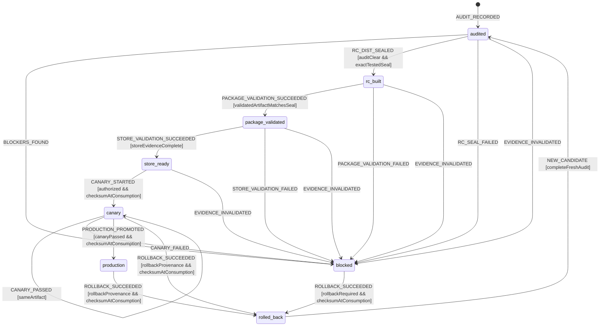

# Release Readiness Workflow Model

Authoritative fail-closed model for moving one MissionPulse release candidate
from audit to production or rollback. State is derived from typed, immutable
evidence; a label, branch, tag, report, or narrative approval has no authority.

## Scope and fixed candidate

The Task 12 packaging phase packages the exact `apps/extension/dist` bytes
already exercised and sealed by the packaged MV3 gate. It is a
**package-only** operation: install, build, version bump, manifest edit,
connector re-resolution, and any write to the tested `dist` are forbidden
after the seal. A command that can rebuild or delete `dist`, including the
current `build:extension`, is not a packaging-phase interface.

The authoritative seal must be created by one fresh, clean build -> local gate
-> packaged MV3 gate after every in-scope production change is committed. The
earlier Task 10/11 artifact is regression evidence only once Tasks 6-9 change
source bytes; its historical digest cannot authorize the final ZIP. The
package-only boundary begins only after the final gate emits the complete
`TestedDistSeal`.

All release tooling, workflow gates and source-controlled production
documentation that can affect the candidate are committed before that clean
build. The human-readable evidence report is generated only after packaging
and may be committed separately as a downstream evidence commit. That later
commit is never substituted for `CandidateSourceIdentity.sourceCommit` and
does not authorize rebuilding or resealing the candidate.

The current candidate version is `0.2.2`, matching the root package, extension
package, source manifest, and tested manifest. Naming an archive or evidence
document `0.2.3` cannot change that identity. A future `0.2.3` requires a
committed bump, a clean unique build, the complete MV3 gate, and a new seal
before packaging.

Only a ZIP whose safely extracted canonical inventory equals the tested seal is
eligible for Chrome Web Store work. Missing, stale, contradictory, unbound, or
unverifiable evidence blocks the candidate. Store, canary, promotion, and
rollback remain external gates until an authorized operator records their
typed receipts.

## Exact state vocabulary

```ts
type ReleaseReadinessState =
  | 'audited'
  | 'blocked'
  | 'rc_built'
  | 'package_validated'
  | 'store_ready'
  | 'canary'
  | 'production'
  | 'rolled_back';
```

`rc_built` means “the unique build passed local and MV3 gates and its `dist` is
sealed”; it does **not** mean that a ZIP exists. `package_validated` is the
first state in which a ZIP has authority.

## Canonical inventory contract

One implementation and algorithm version are shared by seal creation, source
revalidation, snapshot validation, ZIP inspection, and extracted-tree
validation.

```ts
type CanonicalTreeAlgorithm = 'missionpulse-tree-sha256-v2';

interface CanonicalFileEntry {
  path: string; // normalized relative POSIX UTF-8 path
  bytes: number;
  sha256: string;
  mode: '0644';
}

interface CanonicalTreeReceipt {
  algorithm: CanonicalTreeAlgorithm;
  fileCount: number;
  treeSha256: string;
  manifestSha256: string;
  entries: readonly CanonicalFileEntry[];
}
```

The `v2` algorithm applies these rules exactly:

1. Traverse with `lstat`/no-follow semantics. Accept regular files only. Reject
   symlinks, hard-link aliases, sockets, devices, FIFOs, sparse/accessor-like
   filesystem surprises, and entries that change identity while opened.
2. Paths are valid UTF-8, relative POSIX paths. Reject absolute paths,
   backslashes, NUL, empty/`.`/`..` segments, non-canonical encodings,
   duplicates, Unicode-normalization collisions, and case-fold collisions.
3. Sort the UTF-8 path bytes in unsigned bytewise order, equivalent to
   `LC_ALL=C`; `localeCompare` and ambient locale are forbidden.
4. For each sorted file, hash
   `path + NUL + decimalByteLength + NUL + fileSha256 + LF`, using SHA-256.
   Metadata does not alter the content-tree digest, but non-canonical metadata
   is rejected or normalized in the private snapshot before archiving.
5. `manifest.json` is required and its byte digest is recorded separately.
   The complete ordered entry list is part of every receipt.

Any legacy harness digest may be recorded as compatibility evidence, but it is
not substituted for `v2` and never authorizes a candidate after source changes.
A `v2` seal may be added to exact unchanged tested bytes only when the legacy
per-file inventory and digest match evidence emitted by that same final MV3
run. Any inventory difference requires a new clean build and complete MV3 run,
not a “reseal”.

## Immutable evidence values

```ts
interface CandidateSourceIdentity {
  releaseId: string;
  sourceCommit: string;
  gitObjectFormat: 'sha1' | 'sha256';
  committedVersion: '0.2.2';
  gitTreeObjectId: string;
  worktreeCleanBeforeBuild: true;
  worktreeCleanAfterMv3: true;
  nodeVersion: string;
  pnpmVersion: string;
  lockfileSha256: string;
  connectorConfigSha256: string;
  includedConnectorIds: readonly string[];
}

interface LocalGateReceiptV1 {
  version: 1;
  receiptId: string;
  releaseId: string;
  sourceCommit: string;
  gitTreeObjectId: string;
  startedAt: string;
  completedAt: string;
  checks: {
    format: 'passed';
    lint: 'passed';
    typecheck: 'passed';
    unit: 'passed';
    sourceManifest: 'passed';
  };
  commandInventorySha256: string;
  reportBundleSha256: string;
}

interface PackagedMv3GateReceiptV1 {
  version: 1;
  receiptId: string;
  releaseId: string;
  sourceCommit: string;
  buildId: string;
  startedAt: string;
  completedAt: string;
  expectedScenarioInventorySha256: string;
  executedScenarioIds: readonly string[];
  passedScenarioCount: number;
  skippedScenarioCount: 0;
  failedScenarioCount: 0;
  playwrightReportSha256: string;
  runtimeDiagnosticFindingCount: 0;
  treeBeforeLaunch: CanonicalTreeReceipt;
  treeAfterSuite: CanonicalTreeReceipt;
  manifestSha256: string;
}

interface TestedDistSeal {
  sealId: string;
  source: CandidateSourceIdentity;
  distPath: 'apps/extension/dist';
  manifestVersion: '0.2.2';
  manifestConnectorIds: readonly string[];
  manifestValidatedAt: string;
  mv3CompletedAt: string;
  localGate: LocalGateReceiptV1;
  mv3Gate: PackagedMv3GateReceiptV1;
  supportingEvidence: readonly EvidenceRef[];
  legacyHarnessTreeSha256: string;
  canonicalTree: CanonicalTreeReceipt;
  forbiddenDevFindingCount: 0;
}

interface SnapshotReceipt {
  snapshotId: string;
  sealId: string;
  releaseId: string;
  worktreeCleanBeforePackage: true;
  worktreeCleanAfterPackage: true;
  sourceBefore: CanonicalTreeReceipt;
  snapshot: CanonicalTreeReceipt;
  sourceAfterCopy: CanonicalTreeReceipt;
  sourceAfterArchive: CanonicalTreeReceipt;
  lockHeldContinuously: true;
  privateSnapshotReadOnly: true;
  normalizedFileMode: '0644';
  normalizedDirectoryMode: '0755';
  normalizedTimestamp: '1980-01-01T00:00:00Z';
}

interface ZipEntryReceipt {
  path: string;
  uncompressedBytes: number;
  compressedBytes: number; // exactly equal: STORE method, no compression
  crc32: string;
  compressionMethod: 'store';
  generalPurposeBitFlag: '0x0800'; // UTF-8 names, no data descriptor
  versionNeeded: '0x0014';
  versionMadeBy: '0x0314'; // Unix, ZIP 2.0
  externalAttributes: '0x81a40000'; // regular 0100644
  mode: '0644';
  timestamp: '1980-01-01T00:00:00Z';
  extraFieldBytes: 0;
  kind: 'regular_file';
}

interface ArtifactConsumptionReceipt {
  receiptId: string;
  releaseId: string;
  sealId: string;
  artifactSha256: string;
  consumer: 'package_runner' | 'ci_upload' | 'ci_download' | 'cws_upload' | 'rollback';
  verifiedAt: string;
  expectedSha256Source: EvidenceRef;
}

interface ValidatedZipArtifact {
  artifactId: string;
  releaseId: string;
  sealId: string;
  sourceCommit: string;
  version: '0.2.2';
  archivePath: 'apps/extension/releases/missionpulse-0.2.2.zip';
  archiveBytes: number;
  archiveSha256: string;
  checksumPath: 'apps/extension/releases/missionpulse-0.2.2.zip.sha256';
  checksumVerified: true;
  zipIntegrityVerified: true;
  deterministicTwinSha256: string;
  entries: readonly ZipEntryReceipt[];
  snapshotReceipt: SnapshotReceipt;
  extractedTree: CanonicalTreeReceipt;
  extractedManifestVersion: '0.2.2';
  extractedManifestValidated: true;
  validationReceipt: EvidenceRef;
  consumptionReceipts: readonly ArtifactConsumptionReceipt[];
}
```

`sourceCommit` and `gitTreeObjectId` are the exact object IDs reported by Git
for `HEAD` and `HEAD^{tree}` under the recorded `gitObjectFormat`; they are not
mislabelled SHA-256 digests in a SHA-1 repository. Clean-worktree checks include
all tracked and untracked entries reported by
`git status --porcelain=v2 --untracked-files=all`. Ordinary ignored dependency,
build and test-output roots do not make the Git worktree dirty. Release-specific
ignored output paths are nevertheless inspected directly: the temporary and
final ZIP, sidecar and receipt paths must satisfy the exact absence/freshness
rules of the package protocol.

`TestedDistSeal` and `ValidatedZipArtifact` are immutable, single-assignment
values linked by both `releaseId` and `sealId`. The ZIP path/hash cannot appear
in `rc_built`; loose strings supplied by an event are not a package proof.

Historical Task 10/11 evidence is not final-candidate authority after later
source changes. Even for unchanged bytes, it is acceptable only if it satisfies
every field above. In particular, a digest without the exact source commit,
committed version, toolchain/configuration identity, clean-worktree proof and
complete scenario evidence cannot advance this model. Task 12 never invents
that missing provenance.

## Final candidate gate and seal protocol

Seal creation and package creation are separate capabilities. The candidate
gate may build exactly once; the package runner may never build. The candidate
gate executes this closed protocol from a clean committed source:

1. Capture the source/toolchain/configuration identity and require the release
   output paths and prior seal path to be absent.
2. Run the committed format, lint, TypeScript, unit and source-manifest checks.
   Record their exact command inventory and content-addressed report bundle in
   `LocalGateReceiptV1`; a narrative claim or exit-code-only event is invalid.
3. Perform the unique UI/extension build, validate the built manifest and take
   the canonical `treeBeforeLaunch` receipt. No later step may write `dist`.
4. Run the complete packaged MV3 suite with an aggregated machine-readable
   report. Its executed scenario IDs must exactly equal the committed expected
   inventory; zero skipped, unexpected or failed scenarios are allowed. Per-test
   fixture files or the last test's teardown receipt are not suite authority.
5. Settle all runtime diagnostics and cleanup, then recompute
   `treeAfterSuite`. Require exact tree/manifest equality, zero forbidden DEV
   findings and zero runtime diagnostics.
6. Recheck the clean source identity and emit `TestedDistSeal` atomically only
   after both structured receipts validate. A failed/interrupted gate leaves no
   seal. Rerunning requires deleting only failed temporary evidence and starts a
   new build ID; it never blesses the prior `dist` by inspection alone.

`passedScenarioCount` is a safe positive integer equal to
`executedScenarioIds.length`; scenario IDs are unique, sorted canonical IDs.
The expected-inventory digest, Playwright report digest, both canonical trees,
manifest digest, source commit and build ID all belong to the same MV3 run.
Once the seal exists, the candidate-gate capability is closed and only the
package-only protocol below is permitted.

## Package-only TOCTOU protocol

The package runner owns one exclusive release lock from source verification
through final source revalidation. A lock loss is terminal for that operation.
The exact order is mandatory:

1. Refuse any build/install/bump flag or command and refuse a source commit,
   version, release ID, connector set, or worktree state different from the
   seal. Revalidate the current `dist` with the shared `v2` implementation.
2. Create a private empty snapshot directory with exclusive creation. While the
   release lock is held, copy each sealed regular file with no-follow/open-file
   identity checks. Refuse all unsupported entries.
3. Recompute source before copy, snapshot after copy, and source after copy.
   All inventories, file hashes, tree digests, counts, and manifest digests must
   equal the seal. Normalize only the private snapshot to file mode `0644`,
   directory mode `0755`, and timestamp `1980-01-01T00:00:00Z`; then remove
   write permissions and retain no writable handle.
4. Create the archive in a fresh private output directory. Both temporary and
   final archive paths must be absent and opened with exclusive-create
   semantics. An existing archive is an error; update-in-place is forbidden.
5. Archive only the sorted regular-file list from the snapshot, under
   `LC_ALL=C`, using ZIP method `STORE` (0) with compressed size equal to
   uncompressed size. Local and central headers use the same sorted order,
   UTF-8 flag `0x0800`, version-needed `0x0014`, version-made-by `0x0314`, no
   data descriptor, ZIP64, directory entry, UID/GID, extra field, comment,
   encryption, internal attribute or ambient metadata. Build a second
   independent archive from the same snapshot and require equal SHA-256. The
   writer encodes the fixed raw DOS date/time in UTC and external attribute
   `0x81a40000` for Unix regular mode `0100644`; process timezone, compression
   library and umask are not inputs.
6. Verify ZIP integrity and inspect its central/local entries before extraction.
   Reject absolute/traversal paths, duplicates, case/Unicode collisions,
   symlinks, specials, unexpected directories, extra fields, ZIP64, header
   flags/versions/method/attributes, modes/timestamps, encrypted entries,
   inconsistent stored sizes/CRC, or an entry list different from the sealed
   inventory.
7. Extract through the validating extractor into a newly and exclusively
   created empty directory. Never extract over an existing path. Recompute the
   `v2` tree receipt and manifest digest with the same implementation, then run
   post-build manifest validation against expected version `0.2.2` on the
   extracted manifest.
8. Recompute the private snapshot and locked source after archive creation.
   Every receipt must still equal the seal. Any drift before, during, or after
   copy/archive invalidates the operation and the snapshot; it is never blindly
   retried with the same seal.
9. Hash the validated temporary archive, write the UTF-8 sidecar as exactly
   `<64 lowercase hex>  missionpulse-0.2.2.zip\n`, verify it, atomically rename
   both to their previously absent final paths, and verify again. Emit
   `ValidatedZipArtifact` only after all comparisons pass, then release the
   lock.

The required equality is:

```text
seal.canonicalTree
  == sourceBefore
  == snapshot
  == sourceAfterCopy
  == extractedTree
  == sourceAfterArchive

seal.manifestSha256 == extractedTree.manifestSha256
seal.manifestVersion == extractedManifestVersion == 0.2.2
archiveSha256 == deterministicTwinSha256 == verified sidecar SHA-256
```

## Actions, context, and events

```ts
interface EvidenceRef {
  evidenceId: string;
  kind: string;
  sha256: string;
  immutableUri: string;
  recordedAt: string;
}

interface ReleaseBlocker {
  blockerId: string;
  severity: 'P0' | 'P1';
  code: string;
  openedBy: EvidenceRef;
  closedBy: EvidenceRef | null;
}

interface CompleteAuditEvidence {
  ref: EvidenceRef;
  releaseId: string;
  sourceCommit: string;
  committedVersion: '0.2.2';
  coveredGates: readonly (
    | 'workflows'
    | 'security'
    | 'permissions'
    | 'metadata'
    | 'ci'
    | 'runtime'
    | 'artifact_provenance'
    | 'cws'
    | 'canary'
    | 'rollback'
  )[];
  openP0Count: 0;
  openP1Count: 0;
}

type ReleaseActionKind =
  | 'audit'
  | 'seal_build'
  | 'validate_package'
  | 'validate_store'
  | 'publish_canary'
  | 'observe_canary'
  | 'promote_production'
  | 'rollback';

interface ReleaseAction {
  kind: ReleaseActionKind;
  operationId: string;
  actorId: string;
  phase: 'requested' | 'running' | 'cancelling' | 'reconciling';
  requestedAt: string;
  startedAt: string | null;
  retryOfOperationId: string | null;
}

interface FailedReleaseAction {
  kind: ReleaseActionKind;
  operationId: string;
  sourceState: ReleaseReadinessState;
  retryable: boolean;
}

interface ReleaseGateError {
  code: ReleaseGateErrorCode;
  releaseId: string;
  operationId: string;
  action: ReleaseActionKind;
  stage: string;
  occurredAt: string;
  retryable: boolean;
  expectedEvidence: EvidenceRef | null;
  observedEvidence: EvidenceRef | null;
}

interface ReleaseReadinessContext {
  releaseId: string;
  state: ReleaseReadinessState;
  source: CandidateSourceIdentity;
  testedDistSeal: TestedDistSeal | null;
  validatedZipArtifact: ValidatedZipArtifact | null;
  auditedAt: string;
  p0Blockers: readonly ReleaseBlocker[];
  p1Blockers: readonly ReleaseBlocker[];
  storeEvidence: readonly EvidenceRef[];
  canaryEvidence: readonly EvidenceRef[];
  canaryOutcome: 'not_started' | 'running' | 'passed' | 'failed';
  rollbackRequired: boolean;
  rollbackArtifactSha256: string | null;
  activeAction: ReleaseAction | null;
  lastFailedAction: FailedReleaseAction | null;
  resumeFrom: ReleaseReadinessState | null;
  error: ReleaseGateError | null;
}

type ReleaseReadinessEvent =
  | { type: 'AUDIT_RECORDED'; releaseId: string; evidence: CompleteAuditEvidence }
  | {
      type: 'BLOCKERS_FOUND';
      releaseId: string;
      operationId: string;
      blockers: readonly ReleaseBlocker[];
    }
  | { type: 'ACTION_REQUESTED'; releaseId: string; action: ReleaseAction }
  | { type: 'ACTION_STARTED'; releaseId: string; operationId: string; startedAt: string }
  | { type: 'RC_DIST_SEALED'; releaseId: string; operationId: string; seal: TestedDistSeal }
  | { type: 'RC_SEAL_FAILED'; releaseId: string; operationId: string; error: ReleaseGateError }
  | {
      type: 'PACKAGE_VALIDATION_SUCCEEDED';
      releaseId: string;
      operationId: string;
      artifact: ValidatedZipArtifact;
    }
  | {
      type: 'PACKAGE_VALIDATION_FAILED';
      releaseId: string;
      operationId: string;
      error: ReleaseGateError;
    }
  | {
      type: 'STORE_VALIDATION_SUCCEEDED';
      releaseId: string;
      operationId: string;
      evidence: readonly EvidenceRef[];
    }
  | {
      type: 'STORE_VALIDATION_FAILED';
      releaseId: string;
      operationId: string;
      error: ReleaseGateError;
    }
  | {
      type: 'CANARY_STARTED';
      releaseId: string;
      operationId: string;
      receipt: ArtifactConsumptionReceipt;
      evidence: EvidenceRef;
    }
  | {
      type: 'CANARY_PASSED';
      releaseId: string;
      operationId: string;
      artifactSha256: string;
      evidence: readonly EvidenceRef[];
    }
  | {
      type: 'CANARY_FAILED';
      releaseId: string;
      operationId: string;
      error: ReleaseGateError;
      evidence: readonly EvidenceRef[];
    }
  | {
      type: 'PRODUCTION_PROMOTED';
      releaseId: string;
      operationId: string;
      receipt: ArtifactConsumptionReceipt;
      evidence: EvidenceRef;
    }
  | {
      type: 'ROLLBACK_SUCCEEDED';
      releaseId: string;
      operationId: string;
      receipt: ArtifactConsumptionReceipt;
      evidence: EvidenceRef;
    }
  | { type: 'TYPED_ACTION_FAILED'; releaseId: string; operationId: string; error: ReleaseGateError }
  | { type: 'EVIDENCE_INVALIDATED'; releaseId: string; error: ReleaseGateError }
  | { type: 'CANCEL_ACTION'; releaseId: string; operationId: string }
  | { type: 'ACTION_CANCELLED'; releaseId: string; operationId: string }
  | {
      type: 'ACTION_CANCEL_FAILED';
      releaseId: string;
      operationId: string;
      error: ReleaseGateError;
    }
  | { type: 'RETRY_GATE'; releaseId: string; failedOperationId: string; action: ReleaseAction }
  | { type: 'SERVICE_RESTARTED'; releaseId: string }
  | {
      type: 'ACTION_RECONCILED';
      releaseId: string;
      operationId: string;
      outcome: 'not_applied' | 'applied' | 'unknown';
      evidence: EvidenceRef | null;
    }
  | {
      type: 'NEW_CANDIDATE';
      previousReleaseId: string;
      source: CandidateSourceIdentity;
      audit: CompleteAuditEvidence;
    };
```

All event payloads are descriptor-snapshotted, schema-validated, and frozen at
the Shell boundary before Core reduction. Success events carry structured
receipts, never caller-asserted digest strings.

## Typed failures

```ts
type ReleaseGateErrorCode =
  | 'RELEASE_BUSY'
  | 'SOURCE_WORKTREE_DIRTY'
  | 'SOURCE_COMMIT_MISMATCH'
  | 'VERSION_MISMATCH'
  | 'TOOLCHAIN_OR_CONFIG_MISMATCH'
  | 'TESTED_DIST_SEAL_MISSING'
  | 'DIST_SEAL_MISMATCH'
  | 'REBUILD_AFTER_SEAL_FORBIDDEN'
  | 'RELEASE_LOCK_UNAVAILABLE'
  | 'RELEASE_LOCK_LOST'
  | 'UNSUPPORTED_INVENTORY_ENTRY'
  | 'UNSAFE_OR_COLLIDING_PATH'
  | 'SOURCE_DRIFT_DURING_COPY'
  | 'SNAPSHOT_DIVERGED'
  | 'SNAPSHOT_NOT_IMMUTABLE'
  | 'ARCHIVE_ALREADY_EXISTS'
  | 'ARCHIVE_NON_CANONICAL'
  | 'ARCHIVE_NON_DETERMINISTIC'
  | 'ZIP_INTEGRITY_FAILED'
  | 'ZIP_ENTRY_POLICY_FAILED'
  | 'SAFE_EXTRACTION_FAILED'
  | 'EXTRACTED_TREE_DIVERGED'
  | 'EXTRACTED_MANIFEST_DIVERGED'
  | 'EXTRACTED_VERSION_DIVERGED'
  | 'SOURCE_DRIFT_AFTER_ARCHIVE'
  | 'CHECKSUM_SIDECAR_DIVERGED'
  | 'CONSUMER_CHECKSUM_DIVERGED'
  | 'STORE_EVIDENCE_INCOMPLETE'
  | 'CWS_CREDENTIALS_INCOMPLETE'
  | 'EXTERNAL_OUTCOME_UNKNOWN';
```

Every error includes `releaseId`, `operationId`, action kind, stage, timestamp,
retryability, expected identity, and observed non-secret evidence. A drift,
unknown external outcome, or checksum mismatch is not retryable on the same
seal/artifact.

## Statechart



Requests, starts, cancellation, retries, and reconciliation mutate only
`activeAction`; they never advance the stable readiness state. Every typed
success/failure requires the matching release, operation, action kind, and a
running or reconciling action.

## Guards

| Guard                          | Rule                                                                                                                                                                                                                                                                     |
| ------------------------------ | ------------------------------------------------------------------------------------------------------------------------------------------------------------------------------------------------------------------------------------------------------------------------ |
| `auditClear`                   | Audit covers workflows, security, permissions, metadata, CI, runtime, artifact provenance, CWS, canary, and rollback; no open P0/P1.                                                                                                                                     |
| `exactTestedSeal`              | Seal identity equals candidate source/release/version/config/toolchain; structured local gates passed; aggregated MV3 IDs equal the committed inventory with zero skip/failure/diagnostic; pre/post trees and manifest equal; the worktree was clean at both boundaries. |
| `validatedArtifactMatchesSeal` | Structured artifact links the exact release/seal/commit/version; all source/snapshot/extraction receipts equal the seal; archive twin and sidecar checks pass.                                                                                                           |
| `storeEvidenceComplete`        | Listing, privacy, permissions, rollback artifact, all four CWS credentials, and release-surface alignment are proven for the validated ZIP.                                                                                                                              |
| `sameArtifact`                 | Release ID, seal ID, artifact ID, version, source commit, and SHA-256 all equal the validated artifact.                                                                                                                                                                  |
| `checksumAtConsumption`        | A fresh consumer receipt recomputed the SHA-256 from bytes immediately after upload/download or immediately before CWS/rollback use and matched the sidecar/validated artifact.                                                                                          |
| `authorized`                   | The named human/operator is permitted for the external action; credentials are referenced by presence only, never recorded.                                                                                                                                              |
| `canaryPassed`                 | Fresh, measured canary evidence for this exact artifact crossed no stop threshold and includes rollback rehearsal.                                                                                                                                                       |
| `noActiveAction`               | One release lock/action only; a concurrent request returns `RELEASE_BUSY` without mutation.                                                                                                                                                                              |
| `completeFreshAudit`           | New release ID/source/version differ as required, audit is fresh/complete, and all old artifact evidence is atomically cleared.                                                                                                                                          |

## Transition effects

| Transition                                          | Required effect                                                                                                                                           |
| --------------------------------------------------- | --------------------------------------------------------------------------------------------------------------------------------------------------------- |
| `AUDIT_RECORDED -> audited`                         | Record exact candidate source, audit scope, owners, and timestamps.                                                                                       |
| `RC_DIST_SEALED -> rc_built`                        | Attach the immutable tested seal only. ZIP path/hash remain absent.                                                                                       |
| `PACKAGE_VALIDATION_SUCCEEDED -> package_validated` | Attach the single `ValidatedZipArtifact`; consume its package-runner checksum receipt; clear package action.                                              |
| `STORE_VALIDATION_SUCCEEDED -> store_ready`         | Prove dashboard metadata, all four credentials, privacy/permission alignment, rollback target, and the exact artifact SHA. No upload/publish is inferred. |
| `CANARY_STARTED -> canary`                          | Recompute the downloaded/upload candidate SHA immediately at use; attach CWS canary receipt.                                                              |
| `CANARY_PASSED`                                     | Attach observation evidence; retain the same artifact identity.                                                                                           |
| `PRODUCTION_PROMOTED -> production`                 | Recompute SHA immediately before promotion/use and attach external receipt. Never rebuild/repack.                                                         |
| `ROLLBACK_SUCCEEDED -> rolled_back`                 | Verify known-good bytes at consumption, restoration, and health receipt before claiming rollback.                                                         |
| any typed failure                                   | Preserve source state in `resumeFrom`, record provenance/error, clear only the matching action, and block when evidence may be unsafe.                    |
| `EVIDENCE_INVALIDATED -> blocked`                   | Invalidate the seal/artifact and every downstream Store/canary proof.                                                                                     |

## Release workflow and CWS consumption gate

CI/release automation must either create the unique final build and seal in one
clean job after all release-source changes, or consume that already archived
`TestedDistSeal`. After that seal, the job is package-only. A historical or
separate `test-mv3` job that built another commit or another `dist` cannot
authorize the release ZIP.

The package job publishes together, as immutable outputs:

- `releaseId`, `sealId`, source commit, version, toolchain/config digests;
- tested/snapshot/extracted canonical receipts and manifest digests;
- ZIP path, size, SHA-256, checksum sidecar, entry receipt, and validation JSON;
- the structured local/MV3 receipts, expected scenario-inventory digest and
  their supporting content-addressed reports.

The source-controlled runner and workflow definitions used to produce those
outputs must already belong to `sourceCommit`. A later evidence-only commit may
reference the immutable receipts and their original source commit, but cannot
change any receipt identity or become the candidate source retroactively.

An upload step recomputes the checksum and emits a `ci_upload` receipt. A later
job downloads the ZIP, sidecar, seal, and validation receipt as one bundle,
recomputes the checksum, and emits `ci_download`. The CWS boundary recomputes it
again immediately before use and emits `cws_upload`. A missing or mismatched
receipt blocks; no stable publication job may bypass `package_validated`,
`store_ready`, authorized canary, observation, and promotion transitions.

The workflow checks the presence of `CHROME_EXTENSION_ID`,
`CHROME_CLIENT_ID`, `CHROME_CLIENT_SECRET`, and `CHROME_REFRESH_TOKEN` without
persisting their values. Automatic direct stable publication from a tag is
forbidden; the workflow may request/record modeled external actions only.

## Retry, cancellation, restart, and persistence

- Local package cancellation retains the lock until cleanup acknowledgement;
  it never leaves a partial final archive.
- A drift or checksum error destroys the private snapshot/output, invalidates
  the seal for that operation, and requires explicit investigation/new
  candidate proof. Blind retry with the same snapshot is forbidden.
- Runner restart enters reconciliation, verifies the lock/receipts and all
  referenced bytes, then emits `not_applied`, `applied`, or `unknown`.
  `unknown` becomes `blocked`; it is never inferred as success or failure.
- Release state is recomputed from committed model evidence plus immutable CI,
  artifact, and external references. Secrets and mutable dashboard labels are
  never evidence.

## Forbidden transitions

- MV3 green on `dist A` followed by rebuild/delete/install/version bump and ZIP
  from `dist B`.
- Seal creation from a per-test/last-test fixture file, an exit code without the
  aggregated report, or a suite with missing, skipped, duplicate or unexpected
  scenario IDs.
- `rc_built` carrying a ZIP path/hash, or `package_validated` consuming loose
  digest strings instead of `ValidatedZipArtifact`.
- Packaging from a mutable/unlocked source, following/ignoring a symlink, or
  archiving an existing ZIP in update mode.
- Locale-dependent ordering, compression, ZIP64, ambient mode/mtime/UID/GID,
  noncanonical flags/versions/attributes, nonzero extra fields, or an archive
  whose independent twin has another SHA-256.
- Validation without fresh safe extraction, exact tree/manifest/count equality,
  post-build manifest validation, and expected version `0.2.2`.
- Renaming `0.2.2` bytes as `0.2.3`, or binding them to another commit/release.
- Upload, CWS use, production promotion, or rollback without a fresh checksum
  receipt at that consumption boundary.
- Store readiness with fewer than all four credentials or missing external
  evidence; direct automatic stable publication that bypasses canary.
- Any advancement from warnings, free text, an LLM assessment, or narrative
  approval.

## Invariants

1. State vocabulary is exactly the eight values declared above.
2. Every advancement is bound to one release ID, seal ID, source commit,
   committed version, connector resolution, manifest, and immutable artifact.
3. Zero unresolved P0/P1 is required at and beyond `rc_built`.
4. `rc_built` owns the tested `dist` seal and no ZIP authority.
5. `package_validated` means package-only under a continuous lock; regular-only
   canonical inventory; immutable normalized snapshot; deterministic STORE-only ZIP;
   fresh safe extraction; equal tree/count/manifest/version; and verified
   checksum sidecar.
6. The source, snapshot, extracted tree, manifest, and current version are
   exactly equal as specified; a rebuild cannot repair a mismatch.
7. Every consumer verifies the ZIP SHA from bytes immediately at its boundary.
8. `store_ready`, `canary`, and `production` require explicit external proof
   for this exact artifact and all four CWS credential presences.
9. Rollback never claims success before known-good bytes and restored health are
   verified.
10. An LLM never decides a transition; typed events and deterministic guards do.
11. One action/lock prevents concurrent or cross-operation acknowledgement.
12. `NEW_CANDIDATE` atomically clears every prior seal, artifact, Store, canary,
    rollback, receipt, action, and error reference.
13. Release tooling is committed before the candidate build; a later
    evidence-only commit is downstream metadata and never changes the sealed
    `sourceCommit`.
14. A seal requires structured local and aggregated suite receipts from one
    build ID; per-test output, skipped/missing scenarios or exit-code-only claims
    have zero authority.

## Model review matrix

- [x] Nominal audit → seal → deterministic package → Store → canary → production is explicit.
- [x] Rebuild after seal is unrepresentable as success and fails typed.
- [x] Source commit/version/toolchain/config/worktree provenance is part of the seal.
- [x] Lock, no-follow copy, source-before/after and immutable snapshot close TOCTOU.
- [x] Bytewise ordering, fixed modes/timestamps, absent archive, twin build and no extra fields are explicit.
- [x] ZIP integrity, hostile entry policy, fresh extraction, manifest validation and exact digest equality are explicit.
- [x] Sidecar and package/upload/download/CWS/rollback checksum receipts are explicit.
- [x] Store/canary/promotion remain external typed gates and direct stable publication is forbidden.
- [x] Current candidate is `0.2.2`; a future version requires a complete new sealed candidate.
- [x] The final seal is produced only after all in-scope source changes; historical Task 10/11 bytes cannot authorize a later candidate.
- [x] Candidate/tooling and evidence commits are ordered without circularly changing the sealed source commit.
- [x] The complete expected MV3 scenario inventory, zero skips/failures/diagnostics and unchanged pre/post suite tree are sealed structurally.
