# Release Readiness Evidence Model

Status: **PENDING INDEPENDENT REVIEW — CLARIFICATION 11; IMPLEMENTATION FORBIDDEN**.

Clarification revision: `11`

Pending behavior SHA-256: `9afa97e0848b6c5c6540d33f38e29a409112a531f9ff2cd7124e50ef96511080`

The pending behavior hash is SHA-256 of the complete raw UTF-8/LF bytes of
this file after replacing only the value on the
`Pending behavior SHA-256` line with the literal
`__PENDING_BEHAVIOR_SHA256__`. Any semantic edit requires a new hash and an
independent review.

Clarification 5 pending behavior hash
`045781b6e27afb334664b608fb62450610f0dd6645bd906a951ef62198f9329b`
was independently rejected because its aggregate decoded-byte limit exceeded
the sum of all thirteen field limits, the producer still selected the V1
scenario inventory, and the consumer redeclared stale snapshot authority.
Clarification 6 preserved the closed clarification-5 byte-verification
algorithm while making the aggregate boundary reachable, cutting every
producer dependency over to the thirteen-entry V2 inventory, and making the
consumer import rather than mirror the parent snapshot authority. No approval
transfers from clarification 5.

Clarification 6 was independently rejected at normalized UTF-8/LF behavior hash
`2fc6a80c2d525358b37b00c6d42a1b445f178123882bc1d7ffb9c6e69edd92bf`.
It named no complete path/revision/behavior/review/implementation/verification
authority tuple for the MV3 harness or packaged-tab model, read only one of
those two committed model blobs, still pinned rejected packaged-tab revision 2,
and formed an implementation cycle with the child scenario model. Clarification
7 resolves those findings with two exact model identities, three distinct
receipts per model, both committed model blobs, a closed joint implementation
phase and one atomic activation CAS. No approval transfers from clarification 6.

Clarification 7 was independently rejected at normalized UTF-8/LF behavior hash
`68fcad275f84b07f050cef96e01d4dc8402be06123d4509ad792e3dd5cd7d9df`.
Its verification sandbox required an already complete
`ReviewedImplementedVerifiedModelAuthorityV1`, creating a bootstrap cycle in
which verification authority was needed to produce verification evidence. It
also left the ordered review, implementation and verification sets and their
JCS digest preimages implicit, while the Git/activation gate proved only two of
the six authoritative model blobs. Clarification 8 separates the three
authority stages, makes verification evidence an explicit intermediate value,
and requires clean Git-object materialization plus six-blob activation
recomputation. No approval transfers from clarification 7.

Clarification 8 was independently rejected at normalized UTF-8/LF behavior hash
`59291b22722dbf67117f32a5ff6153da9d3885aa13e4e3574cad6898c238624f`.
Its Git workspace receipts compared tracked bytes before and after execution,
but the materialized files and parents remained owner-writable while commands
ran. A hostile child could therefore mutate, shadow or replace authoritative
source temporarily, produce `dist`, and restore the Git bytes before recapture.
Clarification 9 makes OS-enforced recursive read-only source mounts, closed
separate output mounts and inherited mount/capability restrictions prerequisites
for every command and activation receipt. No approval transfers from
clarification 8.

Clarification 9 was withdrawn at normalized UTF-8/LF behavior hash
`8df2c60e71c02c279a167b78a4fb3b24931f069327d0137d26d461451418a9a5`.
Although it closed the transient source-mutation TOCTOU, its ordered six-model
authority still pinned the CV accessible-anchor model at obsolete revision 1
and packaged tabs revision 6. It also did not state the three concrete
release-workflow failures found by the full unit pass: no content-authorized
Python 3.14.5 in CI, no required local-gate sequence in `seal-candidate`, and a
workflow inspector that rejected the exact non-candidate `test:mv3` diagnostic
upload. The initially drafted clarification 10 dependency on CV revision 3 and
packaged tabs revision 7 was itself withdrawn after CV review found missing
callback-capability and save-payload/form-to-draft rules. A second provisional
clarification 10 candidate required CV revision 4, packaged tabs revision 8 and
fail-closed resolution of all three workflow gaps.

That second clarification 10 candidate was withdrawn at normalized UTF-8/LF
behavior hash
`371f1fd8d9ef83b3840aaecb860808b0ba54a44b66508153a566e35042588425`.
CV revision 4 still omitted live transition rows for stale, unknown and
mismatched callback settlements; its wildcard transition was restricted to UI
intents. Therefore packaged tabs revision 8 and every dependent six-slot
authority were incomplete. The next clarification 10 candidate must bind a
frozen CV revision 5 and packaged tabs revision 9 before receiving a new hash,
while retaining fail-closed closure of the three workflow gaps. No approval
transfers from clarification 9 or either provisional dependency chain.

Clarification 10 was withdrawn at normalized UTF-8/LF behavior hash
`93dbf5768cf76dd25b467fd1d37177d98b736f8a17c6bba699b3687c1b344729`.
Its heading awaited CV revision 5 and packaged tabs revision 9, while its
normative required identities and six-slot activation still selected CV
revision 4 and packaged tabs revision 8. Those bytes therefore could not admit
one internally consistent authority set. Clarification 11 preserves every
closed release, immutable-source, inventory, snapshot, transport and CI-closure
contract, and binds MV3 harness revision 26, CV accessible-anchor revision 6
and packaged tabs revision 11 at their exact normalized behavior hashes. The
packaged-tabs revision-11 source was independently approved and committed as
`ff9164c4`. No approval transfers from clarification 10, any withdrawn
packaged-tabs candidate or any CV predecessor.

An earlier clarification-11 candidate was independently rejected at normalized
UTF-8/LF behavior hash
`c684d808d1827f5cc7d5f688547c7da0feca30935956dcb16dc197301a461287`.
Its raw model blob was 267,797 bytes, but `RELEASE_LIMITS` bounded every one of
the six joint-model slots to 262,144 bytes through the packaged-tab-specific
`maxPackagedTabScenariosModelBytes` name. The activation factory therefore
could not authenticate the release-readiness model that defined it. The revised
clarification 11 replaces that accidental limit with one explicit independent
512 KiB bound for each joint-model blob. No approval transfers from the
rejected clarification-11 candidate.

This author revision preserves clarification 4 and supersedes approved
clarification-3 content hash
`9bc53cfc1e7936fb80b16f6ecdb68a49216d7140d365cc1e17899d9901352635`;
no approval transfers to the edited bytes. Clarification 2 hash
`0fe91ce1d3bbd80ecf504fb6e14a9dfa827977ed0ff9933d119a15faa4605ea7`
was rejected because `verificationId` and `authoritySha256` formed a digest
cycle. Clarification 3 derived that ID from an independent authenticated
preimage before computing the authority self-digest. Clarification 4 closes the
producer constructor/seal-ingestion path, durable producer-terminal authority,
canonical run-ID representation, and the non-candidate MV3 diagnostic upload.
Clarification 5 made the reducer-required `ReleasePayloadByteSnapshotV1` and
`VerifiedReleasePayloadProjectionV1` parent-model authority, closed every
byte-source/projection/error/duplicate rule, and left the producer transport
component count and consumer state topology unchanged. Clarification 6 exported
that exact authority, types and limits for direct consumer import, forbade any
consumer mirror, and records only the stable snapshot/verification/attestation
IDs plus the complete accepted-event hash after the transient snapshot is
consumed. Clarification 11 preserves those byte and lifetime contracts unchanged
while replacing the cross-model admission boundary. Formatting and independent
approval of the exact pending behavior hash are required before implementation.

## Scope and non-claims

This model separates deterministic local release work from external Chrome Web
Store facts.

- Local work may advance `audited -> rc_built -> package_validated ->
store_ready` by validating immutable structured receipts.
- This repository never submits, cancels, retries, promotes, or rolls back a
  provider operation. There are no provider command events in this model.
- `submission`, canary, production, and rollback are facts ingested after an
  operator/provider performed them elsewhere. Only the structured signed
  receipts defined here have authority; a generic `EvidenceRef`, dashboard
  label, free text, or LLM assessment has none.
- Task 12's maximum claim is `store_ready`, and only after a valid Store bundle
  plus a valid authorization receipt are ingested. Local Task 12 output alone
  normally stops at `package_validated`. `canary`, `production`, and
  `rolled_back` remain external gates and are not claimed by this task.
- The current candidate version is `0.2.2`, read from committed source rather
  than embedded in the reducer. Every candidate has one canonical SemVer and
  one derived immutable release namespace. After an artifact is published, a
  later candidate requires a strictly greater committed version, a new clean
  build, the complete packaged MV3 gate, a new seal, and a new namespace;
  published bytes are never reused or overwritten.
- Actor construction is itself a controller-global compare-and-swap admission:
  it reserves the release ID and namespace against the durable release catalog,
  derives the version and packaged-MV3 inventory from the named clean commit,
  and publishes neither an actor nor a reservation on conflict.
- Clarification 11 can enter only the closed joint implementation phase after
  independent review approves both the exact
  `mv3-packaged-harness.model.md` behavior hash governing the production MV3
  process and the exact `packaged-tab-scenarios.model.md` behavior hash
  governing the thirteen-ID V2 inventory. Review permits candidate
  implementation, not release use. The V1 inventory remains operative until one
  reviewed implementation has produced explicit verification evidence, six
  verification receipts and one atomically activated verified set; after
  activation V1 is non-authority and cannot be combined with V2 evidence.
  Approval of this file
  alone transfers no authority from either dependency.

If a fact cannot be represented by these values and guards, it cannot advance
release readiness.

## Exact states

```ts
type ReleaseReadinessState =
  | 'audited'
  | 'blocked'
  | 'rc_built'
  | 'package_validated'
  | 'store_ready'
  | 'canary'
  | 'production'
  | 'rolled_back';
```

`canary` means the submitted candidate has a valid metrics-and-pass receipt,
not merely that an upload started. `production` requires a promotion receipt.
`rolled_back` requires a rollback receipt with healthy restoration and is
reachable only from `canary` or `production`.

There is no public uninitialized context. The factory validates and atomically
persists `CandidateIdentityV1 + AuditReceiptV1 + candidate_reserved` under the
expected global catalog revision, then publishes the actor directly in
`audited`. Constructor failure publishes neither actor nor catalog record and
introduces no ninth state.

## Canonical primitives and bounds

````ts
type Sha256 = string; // exactly 64 lowercase hexadecimal ASCII characters
type CanonicalUtcTimestamp = string;
type CanonicalSemVer = string;
type CanonicalPositiveDecimalString = string; // /^(?:[1-9]\d*)$/, no coercion

const RELEASE_LIMITS = {
  maxIdAsciiBytes: 128,
  maxImmutableUriBytes: 2048,
  maxFiles: 20_000,
  maxDirectories: 20_000,
  maxFileBytes: 536_870_912,
  maxZipBytes: 2_147_483_648,
  maxExecutionImageArchiveBytes: 536_870_912,
  maxReleaseControllerBundleBytes: 16_777_216,
  maxControllerExecutionAuthorityBytes: 1_048_576,
  maxSealedCandidateTransportBytes: 1_073_741_824,
  maxAttestationBundleBytes: 16_777_216,
  maxTrustedRootJcsBytes: 262_144,
  maxCandidateIdentityJcsBytes: 2_097_152,
  maxAuditReceiptJcsBytes: 1_048_576,
  maxWorkflowBlobBytes: 262_144,
  maxJointModelBlobBytes: 524_288,
  maxPrivilegedWorkflowUses: 32,
  maxOciLayers: 128,
  maxEffectiveLoadedObjects: 8_192,
  maxControllerSources: 256,
  maxPathUtf8Bytes: 65_535,
  maxTotalPathUtf8Bytes: 16_777_216,
  maxScenarioIds: 512,
  maxSemVerAsciiBytes: 64,
  maxPermissionEntries: 128,
  maxPermissionAsciiBytes: 512,
  maxJournalEntries: 16,
  maxAuthorizationReceipts: 8,
  maxSigningKeysPerPolicy: 16,
  maxGlobalReplayTuples: 16,
  maxGlobalReplayRecordsPerTuple: 64,
  maxReleaseCatalogEntries: 256,
  maxPackageObservationEntries: 40_032,
} as const;

export const RELEASE_PAYLOAD_SNAPSHOT_LIMITS = Object.freeze({
  maxTotalDecodedBytes: 1_610_612_736,
  fieldDecodedBytes: Object.freeze({
    transportBytesBase64: 1_073_741_824,
    testedDistSealJcsBase64: 4_194_304,
    buildMetadataJcsBase64: 4_194_304,
    buildProvenanceJcsBase64: 4_194_304,
    controllerBundleBase64: 16_777_216,
    executionAuthorityJcsBase64: 4_194_304,
    ociArchiveBase64: 536_870_912,
    transportZipReceiptJcsBase64: 4_194_304,
    distTreeReceiptJcsBase64: 4_194_304,
    controllerSourceInventoryJcsBase64: 4_194_304,
    ociDescriptorGraphJcsBase64: 16_777_216,
    pythonRuntimeInventoryJcsBase64: 16_777_216,
    effectiveLoadedObjectsJcsBase64: 16_777_216,
  }),
});

export const RELEASE_PAYLOAD_SNAPSHOT_FIELD_LIMIT_SUM = 1_707_081_728;
export const RELEASE_PAYLOAD_SNAPSHOT_AGGREGATE_WITNESS = Object.freeze({
  decodedBytes: Object.freeze({
    transportBytesBase64: 977_272_832,
    testedDistSealJcsBase64: 4_194_304,
    buildMetadataJcsBase64: 4_194_304,
    buildProvenanceJcsBase64: 4_194_304,
    controllerBundleBase64: 16_777_216,
    executionAuthorityJcsBase64: 4_194_304,
    ociArchiveBase64: 536_870_912,
    transportZipReceiptJcsBase64: 4_194_304,
    distTreeReceiptJcsBase64: 4_194_304,
    controllerSourceInventoryJcsBase64: 4_194_304,
    ociDescriptorGraphJcsBase64: 16_777_216,
    pythonRuntimeInventoryJcsBase64: 16_777_216,
    effectiveLoadedObjectsJcsBase64: 16_777_216,
  }),
  totalDecodedBytes: 1_610_612_736,
});

export const PACKAGED_MV3_SCENARIO_INVENTORY_V2 = Object.freeze({
  path: 'apps/extension/tests/mv3/scenarios.v2.json',
  schema: 'missionpulse.packaged-mv3-scenario-inventory',
  version: 2,
  scenarioIds: Object.freeze([
    'harness.bootstrap-diagnostics',
    'harness.late-diagnostic',
    'harness.page-console',
    'harness.page-error',
    'harness.worker-rejection',
    'navigation.all-tabs',
    'navigation.cold-onboarding',
    'navigation.shortcuts-focus',
    'packaged-tabs.applications-tjm-settings-persistence',
    'packaged-tabs.feed-profile-cv-persistence',
    'packaged-tabs.offline-recovery',
    'packaged-tabs.onboarding-completion',
    'runtime.service-worker-reload',
  ]),
  blobSha256: 'b386a936abad72ccd4fe2b0dd5cdf2390a6762e3d2ce3e0b0e07635f16f6a1ef',
  scenarioIdsSha256: '2a9c9f67e0c19a0dae126f7db15c25a0c1411b0753e63ecad6eaa0824720f79a',
  modelPath: 'apps/extension/src/models/packaged-tab-scenarios.model.md',
} as const);

export interface RequiredModelIdentityV1 {
  modelPath: string;
  modelRevision: number;
  behaviorSha256: Sha256;
}

export const REQUIRED_MV3_HARNESS_MODEL_V26 = Object.freeze({
  modelPath: 'apps/extension/src/models/mv3-packaged-harness.model.md',
  modelRevision: 26,
  behaviorSha256: 'da2440b21f2c901b6afe1a309121e405844d73b3bf7d679d66b3154d1208c32b',
} as const satisfies RequiredModelIdentityV1);

export const REQUIRED_PACKAGED_TAB_MODEL_V11 = Object.freeze({
  modelPath: 'apps/extension/src/models/packaged-tab-scenarios.model.md',
  modelRevision: 11,
  behaviorSha256: '30b628046132da3222a7affb19044ed92d46ea71bf31192509f10a98e400ddb9',
} as const satisfies RequiredModelIdentityV1);

export const REQUIRED_CV_ACCESSIBLE_ANCHOR_MODEL_V6 = Object.freeze({
  modelPath: 'apps/extension/src/models/cv-experience-card-accessibility.model.md',
  modelRevision: 6,
  behaviorSha256: 'd9fbcd1c8af1d806692cefe19c7e877d82a6c1807da6a64c48eaedd402dc9b98',
} as const satisfies RequiredModelIdentityV1);

export const JOINT_MODEL_BLOB_RULES_V1 = Object.freeze([
  Object.freeze({
    slot: 'release_readiness',
    modelPath: 'apps/extension/src/models/release-readiness.model.md',
    modelRevision: 11,
    hashLineLabel: 'Pending behavior SHA-256:',
    placeholder: '__PENDING_BEHAVIOR_SHA256__',
  }),
  Object.freeze({
    slot: 'mv3_harness',
    modelPath: 'apps/extension/src/models/mv3-packaged-harness.model.md',
    modelRevision: 26,
    hashLineLabel: 'Pending behaviour SHA-256:',
    placeholder: '__PENDING_BEHAVIOUR_SHA256__',
  }),
  Object.freeze({
    slot: 'packaged_tabs',
    modelPath: 'apps/extension/src/models/packaged-tab-scenarios.model.md',
    modelRevision: 11,
    hashLineLabel: 'Pending behavior SHA-256:',
    placeholder: '__PENDING_BEHAVIOR_SHA256__',
  }),
  Object.freeze({
    slot: 'cv_accessible_anchor',
    modelPath: 'apps/extension/src/models/cv-experience-card-accessibility.model.md',
    modelRevision: 6,
    hashLineLabel: 'Pending behavior SHA-256:',
    placeholder: '__PENDING_BEHAVIOR_SHA256__',
  }),
  Object.freeze({
    slot: 'producer',
    modelPath: 'apps/extension/src/models/sealed-candidate-transport-producer.model.md',
    modelRevision: 11,
    hashLineLabel: 'Pending content SHA-256:',
    placeholder: '__PENDING_SHA256__',
  }),
  Object.freeze({
    slot: 'consumer',
    modelPath: 'apps/extension/src/models/sealed-candidate-transport-consumer.model.md',
    modelRevision: 12,
    hashLineLabel: 'Pending content SHA-256:',
    placeholder: '__PENDING_SHA256__',
  }),
] as const);

export interface ModelReviewReceiptV1 {
  schema: 'missionpulse.model-review-receipt';
  version: 1;
  receiptSha256: Sha256;
  model: RequiredModelIdentityV1;
  verdict: 'approved';
  reviewedRawBlobSha256: Sha256;
  reviewerIdentitySha256: Sha256;
  reviewedAt: CanonicalUtcTimestamp;
  signedPayloadSha256: Sha256;
  signatureAlgorithm: 'ed25519';
  signatureBase64: string;
}

export interface ModelImplementationReceiptV1 {
  schema: 'missionpulse.model-implementation-receipt';
  version: 1;
  receiptSha256: Sha256;
  model: RequiredModelIdentityV1;
  reviewReceiptSha256: Sha256;
  implementationCommit: string;
  implementationGitTreeObjectId: string;
  implementationSha256: Sha256;
  implementedAt: CanonicalUtcTimestamp;
  signedPayloadSha256: Sha256;
  signatureAlgorithm: 'ed25519';
  signatureBase64: string;
}

export interface ModelVerificationReceiptV1 {
  schema: 'missionpulse.model-verification-receipt';
  version: 1;
  receiptSha256: Sha256;
  model: RequiredModelIdentityV1;
  reviewReceiptSha256: Sha256;
  implementationReceiptSha256: Sha256;
  implementationCommit: string;
  implementationGitTreeObjectId: string;
  verificationEvidenceSha256: Sha256;
  verificationMatrixSha256: Sha256;
  result: 'passed';
  verifiedAt: CanonicalUtcTimestamp;
  signedPayloadSha256: Sha256;
  signatureAlgorithm: 'ed25519';
  signatureBase64: string;
}

export interface ReviewedModelAuthorityV1 {
  model: RequiredModelIdentityV1;
  reviewReceiptSha256: Sha256;
}

export interface ReviewedImplementedModelAuthorityV1 extends ReviewedModelAuthorityV1 {
  implementationReceiptSha256: Sha256;
}

export interface ReviewedImplementedVerifiedModelAuthorityV1
  extends ReviewedImplementedModelAuthorityV1 {
  verificationReceiptSha256: Sha256;
}

type ReleaseReadinessModelIdentityV11 = RequiredModelIdentityV1 & {
  modelPath: 'apps/extension/src/models/release-readiness.model.md';
  modelRevision: 11;
};
type Mv3HarnessModelIdentityV26 = typeof REQUIRED_MV3_HARNESS_MODEL_V26;
type PackagedTabModelIdentityV11 = typeof REQUIRED_PACKAGED_TAB_MODEL_V11;
type CvAccessibleAnchorModelIdentityV6 = typeof REQUIRED_CV_ACCESSIBLE_ANCHOR_MODEL_V6;
type ProducerModelIdentityV11 = RequiredModelIdentityV1 & {
  modelPath: 'apps/extension/src/models/sealed-candidate-transport-producer.model.md';
  modelRevision: 11;
};
type ConsumerModelIdentityV12 = RequiredModelIdentityV1 & {
  modelPath: 'apps/extension/src/models/sealed-candidate-transport-consumer.model.md';
  modelRevision: 12;
};

type AuthorityFor<
  TAuthority extends ReviewedModelAuthorityV1,
  TModel extends RequiredModelIdentityV1,
> = Omit<TAuthority, 'model'> & { model: TModel };

export type OrderedReviewedModelAuthorityTupleV1 = readonly [
  AuthorityFor<ReviewedModelAuthorityV1, ReleaseReadinessModelIdentityV11>,
  AuthorityFor<ReviewedModelAuthorityV1, Mv3HarnessModelIdentityV26>,
  AuthorityFor<ReviewedModelAuthorityV1, PackagedTabModelIdentityV11>,
  AuthorityFor<ReviewedModelAuthorityV1, CvAccessibleAnchorModelIdentityV6>,
  AuthorityFor<ReviewedModelAuthorityV1, ProducerModelIdentityV11>,
  AuthorityFor<ReviewedModelAuthorityV1, ConsumerModelIdentityV12>,
];

export type OrderedReviewedImplementedModelAuthorityTupleV1 = readonly [
  AuthorityFor<ReviewedImplementedModelAuthorityV1, ReleaseReadinessModelIdentityV11>,
  AuthorityFor<ReviewedImplementedModelAuthorityV1, Mv3HarnessModelIdentityV26>,
  AuthorityFor<ReviewedImplementedModelAuthorityV1, PackagedTabModelIdentityV11>,
  AuthorityFor<ReviewedImplementedModelAuthorityV1, CvAccessibleAnchorModelIdentityV6>,
  AuthorityFor<ReviewedImplementedModelAuthorityV1, ProducerModelIdentityV11>,
  AuthorityFor<ReviewedImplementedModelAuthorityV1, ConsumerModelIdentityV12>,
];

export type OrderedReviewedImplementedVerifiedModelAuthorityTupleV1 = readonly [
  AuthorityFor<ReviewedImplementedVerifiedModelAuthorityV1, ReleaseReadinessModelIdentityV11>,
  AuthorityFor<ReviewedImplementedVerifiedModelAuthorityV1, Mv3HarnessModelIdentityV26>,
  AuthorityFor<ReviewedImplementedVerifiedModelAuthorityV1, PackagedTabModelIdentityV11>,
  AuthorityFor<ReviewedImplementedVerifiedModelAuthorityV1, CvAccessibleAnchorModelIdentityV6>,
  AuthorityFor<ReviewedImplementedVerifiedModelAuthorityV1, ProducerModelIdentityV11>,
  AuthorityFor<ReviewedImplementedVerifiedModelAuthorityV1, ConsumerModelIdentityV12>,
];

export interface OrderedReviewedModelAuthoritySetV1 {
  schema: 'missionpulse.ordered-reviewed-model-authority-set';
  version: 1;
  setSha256: Sha256;
  phaseId: string;
  modelAuthorityReceiptPolicySha256: Sha256;
  authorities: OrderedReviewedModelAuthorityTupleV1;
}

export interface OrderedReviewedImplementedModelAuthoritySetV1 {
  schema: 'missionpulse.ordered-reviewed-implemented-model-authority-set';
  version: 1;
  setSha256: Sha256;
  phaseId: string;
  modelAuthorityReceiptPolicySha256: Sha256;
  sourceCommit: string;
  gitTreeObjectId: string;
  reviewedModelAuthoritySetSha256: Sha256;
  authorities: OrderedReviewedImplementedModelAuthorityTupleV1;
}

export interface OrderedReviewedImplementedVerifiedModelAuthoritySetV1 {
  schema: 'missionpulse.ordered-reviewed-implemented-verified-model-authority-set';
  version: 1;
  setSha256: Sha256;
  phaseId: string;
  modelAuthorityReceiptPolicySha256: Sha256;
  sourceCommit: string;
  gitTreeObjectId: string;
  implementedModelAuthoritySetSha256: Sha256;
  verificationEvidenceSetSha256: Sha256;
  authorities: OrderedReviewedImplementedVerifiedModelAuthorityTupleV1;
}

export interface JointModelVerificationEvidenceV1 {
  schema: 'missionpulse.joint-model-verification-evidence';
  version: 1;
  evidenceSha256: Sha256;
  phaseId: string;
  model: RequiredModelIdentityV1;
  reviewReceiptSha256: Sha256;
  implementationReceiptSha256: Sha256;
  sourceCommit: string;
  gitTreeObjectId: string;
  sandboxSha256: Sha256;
  immutableSourceExecutionAuthoritySha256: Sha256;
  commandReceiptSetSha256: Sha256;
  verificationMatrixSha256: Sha256;
  matrixEvidenceSha256: Sha256;
  result: 'passed';
  verifiedAt: CanonicalUtcTimestamp;
}

type VerificationEvidenceFor<TModel extends RequiredModelIdentityV1> = Omit<
  JointModelVerificationEvidenceV1,
  'model'
> & { model: TModel };

export type OrderedJointModelVerificationEvidenceTupleV1 = readonly [
  VerificationEvidenceFor<ReleaseReadinessModelIdentityV11>,
  VerificationEvidenceFor<Mv3HarnessModelIdentityV26>,
  VerificationEvidenceFor<PackagedTabModelIdentityV11>,
  VerificationEvidenceFor<CvAccessibleAnchorModelIdentityV6>,
  VerificationEvidenceFor<ProducerModelIdentityV11>,
  VerificationEvidenceFor<ConsumerModelIdentityV12>,
];

export interface JointModelVerificationEvidenceSetV1 {
  schema: 'missionpulse.joint-model-verification-evidence-set';
  version: 1;
  evidenceSetSha256: Sha256;
  phaseId: string;
  implementedModelAuthoritySetSha256: Sha256;
  sourceCommit: string;
  gitTreeObjectId: string;
  sandboxSha256: Sha256;
  immutableSourceExecutionAuthority: ImmutableGitSourceExecutionAuthorityV1;
  immutableSourceExecutionAuthoritySha256: Sha256;
  commandReceiptSetSha256: Sha256;
  commandReceipts: readonly [
    ImmutableGitSourceCommandReceiptV1,
    ...ImmutableGitSourceCommandReceiptV1[],
  ];
  evidence: OrderedJointModelVerificationEvidenceTupleV1;
}

export type ImmutableSourceWritableMountKindV1 =
  | 'dependencies'
  | 'cache'
  | 'dist'
  | 'browser_profile'
  | 'report';

export interface ImmutableSourceWritableMountV1 {
  kind: ImmutableSourceWritableMountKindV1;
  externalRootIdentitySha256: Sha256;
  executionMountPath: string;
  mountId: string;
  parentMountId: string;
  mountFlags: readonly ['rw', 'nodev', 'nosuid'];
  sourceMountPointKind: 'outside_source' | 'empty_untracked_mountpoint';
  gitTreeAbsenceProofSha256: Sha256;
  emptyPreMountObservationSha256: Sha256;
  trackedPathShadowCount: 0;
}

export interface ImmutableGitSourceExecutionAuthorityV1 {
  schema: 'missionpulse.immutable-git-source-execution-authority';
  version: 1;
  authoritySha256: Sha256;
  sourceCommit: string;
  gitTreeObjectId: string;
  materializationSha256: Sha256;
  mountNamespaceIdentitySha256: Sha256;
  executionRootMountId: string;
  executionSourceRoot: string;
  sourceMountId: string;
  sourceMountFlags: readonly ['ro', 'nodev', 'nosuid', 'noexec'];
  sourceAncestorMountIds: readonly [string, ...string[]];
  sourceAncestorMountsReadOnly: true;
  recursiveReadOnlyApplied: true;
  sourceFilesystemKind: 'bind';
  overlayMountCount: 0;
  writableMounts: readonly ImmutableSourceWritableMountV1[];
  mountTopologySha256: Sha256;
  seccompPolicySha256: Sha256;
  filesystemWritePolicySha256: Sha256;
  noNewPrivileges: true;
  effectiveCapabilities: readonly [];
  permittedCapabilities: readonly [];
  inheritableCapabilities: readonly [];
  ambientCapabilities: readonly [];
  capabilityBoundingSet: readonly [];
  inheritedDescriptorInventorySha256: Sha256;
  privilegedServiceSocketCount: 0;
  setuidOrFileCapabilityGainDisabled: true;
  installedAt: CanonicalUtcTimestamp;
}

export interface ImmutableGitSourceCommandReceiptV1 {
  schema: 'missionpulse.immutable-git-source-command-receipt';
  version: 1;
  receiptSha256: Sha256;
  immutableSourceExecutionAuthoritySha256: Sha256;
  commandId: string;
  commandPlanSha256: Sha256;
  executableSha256: Sha256;
  argvSha256: Sha256;
  environmentSha256: Sha256;
  cwd: string;
  processTreeSha256: Sha256;
  preExecMountTopologySha256: Sha256;
  postExitMountTopologySha256: Sha256;
  preExecCapabilityStateSha256: Sha256;
  postExitCapabilityStateSha256: Sha256;
  writableOutputInventorySha256: Sha256;
  deniedSourceMutationAttemptCount: number;
  result: 'passed';
  startedAt: CanonicalUtcTimestamp;
  completedAt: CanonicalUtcTimestamp;
}

export type JointReleaseModelImplementationStateV1 =
  | 'review_waiting'
  | 'implementing'
  | 'verification_pending'
  | 'evidence_frozen'
  | 'verified'
  | 'activated'
  | 'blocked';

export type JointReleaseModelImplementationEventV1 =
  | {
      type: 'JOINT_IMPLEMENTATION_STARTED';
      reviewedModelAuthoritySet: OrderedReviewedModelAuthoritySetV1;
    }
  | {
      type: 'JOINT_IMPLEMENTATION_COMPLETED';
      implementedModelAuthoritySet: OrderedReviewedImplementedModelAuthoritySetV1;
      sandbox: JointImplementationVerificationSandboxV1;
    }
  | {
      type: 'JOINT_VERIFICATION_EVIDENCE_FROZEN';
      evidenceSet: JointModelVerificationEvidenceSetV1;
    }
  | {
      type: 'JOINT_VERIFICATION_PASSED';
      verifiedModelAuthoritySet: OrderedReviewedImplementedVerifiedModelAuthoritySetV1;
    }
  | { type: 'JOINT_AUTHORITY_ACTIVATED'; activation: JointReleaseModelActivationV1 }
  | { type: 'JOINT_PHASE_FAILED'; phaseId: string; blockerSha256: Sha256 };

export interface JointImplementationVerificationSandboxV1 {
  schema: 'missionpulse.joint-implementation-verification-sandbox';
  version: 1;
  sandboxSha256: Sha256;
  phaseId: string;
  authorityMode: 'verification_only';
  sourceCommit: string;
  gitTreeObjectId: string;
  implementedModelAuthoritySet: OrderedReviewedImplementedModelAuthoritySetV1;
  immutableSourceExecutionAuthority: ImmutableGitSourceExecutionAuthorityV1;
  verificationCommandPlanSha256: Sha256;
  inventoryPath: 'apps/extension/tests/mv3/scenarios.v2.json';
  inventoryBlobSha256: Sha256;
  scenarioIdsSha256: Sha256;
  catalogKind: 'verification_only';
  namespace: string;
  capabilities: {
    executeClosedVerificationPlan: true;
    globalCatalogWrite: false;
    publishReadinessActor: false;
    exposeConsumerEndpoint: false;
    providerRequest: false;
    publishTransport: false;
    mintActivation: false;
  };
}

export interface JointReleaseModelActivationV1 {
  schema: 'missionpulse.joint-release-model-activation';
  version: 1;
  activationSha256: Sha256;
  activationId: string;
  phaseId: string;
  sourceCommit: string;
  gitTreeObjectId: string;
  modelAuthorityReceiptPolicySha256: Sha256;
  verifiedModelAuthoritySet: OrderedReviewedImplementedVerifiedModelAuthoritySetV1;
  verificationSourceExecutionAuthority: ImmutableGitSourceExecutionAuthorityV1;
  verificationSourceExecutionAuthoritySha256: Sha256;
  verificationCommandReceiptSetSha256: Sha256;
  verificationCommandReceipts: readonly [
    ImmutableGitSourceCommandReceiptV1,
    ...ImmutableGitSourceCommandReceiptV1[],
  ];
  inventoryPath: 'apps/extension/tests/mv3/scenarios.v2.json';
  inventoryBlobSha256: Sha256;
  scenarioIdsSha256: Sha256;
  priorCatalogRevision: number;
  activatedCatalogRevision: number;
  activatedAt: CanonicalUtcTimestamp;
}

The three receipt schemas and authority stages are distinct. Their signing keys
come only from one controller-global immutable `SignaturePolicyV1` with purpose
`external_receipt`; its policy digest is retained in every set and activation.
A model tuple, receipt, candidate, audit or caller cannot supply or replace that
policy. Each receipt self-digest is SHA-256 of RFC 8785 JCS with only
`receiptSha256` omitted; each signed payload uses its schema name as an
ASCII/zero-byte domain separator and omits only the signature fields. The review
receipt's raw blob digest must equal the exact committed model bytes. An
implementation receipt may be issued only from a reviewed authority and binds
one clean commit/tree. A verification receipt may be issued only after accepted
`JointModelVerificationEvidenceV1`; it names the same reviewed and implemented
authority, commit/tree and closed passing matrix. A receipt cannot be reused
across a model, role, revision, behavior hash, commit or tree.

Every ordered authority set has one exact digest preimage:

```text
reviewedSet.setSha256 =
  SHA256(JCS(complete OrderedReviewedModelAuthoritySetV1
             with only setSha256 omitted))

implementedSet.setSha256 =
  SHA256(JCS(complete OrderedReviewedImplementedModelAuthoritySetV1
             with only setSha256 omitted))

verifiedSet.setSha256 =
  SHA256(JCS(complete OrderedReviewedImplementedVerifiedModelAuthoritySetV1
             with only setSha256 omitted))
```

The six-element array order is exactly release readiness, MV3 harness, packaged
tabs, CV accessible anchor, producer, consumer. There is no sorting,
deduplication, map/object substitution or order-insensitive comparison. The
implemented set must be the exact ordered projection of the reviewed set with
only one valid implementation digest added per entry and common commit/tree
fields added at set level. The verified set must be the exact ordered projection
of the implemented set with only one valid verification digest added per entry
and the accepted evidence-set digest added at set level. Every unchanged field,
including `phaseId`, policy digest, model identity, review digest,
implementation digest, source commit and tree, compares byte-for-byte.

Each `evidenceSha256` is SHA-256 of JCS of the complete
`JointModelVerificationEvidenceV1` with only `evidenceSha256` omitted.
`evidenceSetSha256` is SHA-256 of JCS of the complete
`JointModelVerificationEvidenceSetV1` with only `evidenceSetSha256` omitted.
The evidence array has the same six-slot order and must be an exact projection
of the implemented set. Each matrix digest is model-specific; no aggregate pass
or exit code can substitute for one missing slot. The verifier loads each
matrix-evidence blob, validates `result:'passed'`, and only then issues that
slot's signed verification receipt.

Every implementation, verification, activation and release command executes
under one validated `ImmutableGitSourceExecutionAuthorityV1`. Its
`authoritySha256` is SHA-256 of RFC 8785 JCS of the complete authority with only
`authoritySha256` omitted. The authority is constructed in a fresh private Linux
mount namespace before any untrusted child exists. The controller materializes
the complete Git commit/tree in a controller-only backing directory, opens the
required descriptors, and makes that backing pathname and every backing
descriptor inaccessible to children. It then creates a new execution root,
recursively bind-mounts the complete materialization as `executionSourceRoot`,
and atomically applies recursive `ro,nodev,nosuid,noexec` semantics to that
source mount. The execution root mount and every mount ancestor through which a
child can address the source are read-only. The command `cwd` is always a
descriptor-resolved directory inside this read-only source view.

Overlay filesystems are forbidden. No mount, bind, overlay, symlink, hard link,
rename, package-manager virtual store or generated path may cover, replace or
precede a tracked source, module, test, fixture, harness, script, model, policy,
manifest, lockfile or configuration path. Writable mounts are a closed list of
`dependencies`, `cache`, `dist`, `browser_profile` and `report` roots. Each
backing root is controller-owned and outside the source materialization. Its
execution target is either outside `executionSourceRoot` or an exact mountpoint
proven absent from the complete Git tree and empty immediately before the mount.
No writable mountpoint may be an ancestor of a tracked path or introduce a
tracked-path shadow. Unknown, duplicate, nested, overlapping or late-added
writable mounts reject. All command outputs are explicit command-plan values and
must resolve beneath one of those roots; source-side output, implicit temp/cache
fallback and an unlisted descriptor reject before spawn.

The controller removes every effective, permitted, inheritable, ambient and
bounding-set capability, including `CAP_SYS_ADMIN`, sets `no_new_privs`, and
installs an inherited seccomp/filesystem policy before releasing any child to
`exec`. The policy denies `mount`, `umount2`, `move_mount`, `open_tree`,
`mount_setattr`, `fsopen`, `fsmount`, `fspick`, `pivot_root`, `chroot`, `unshare`
and `setns`, and forbids a user-namespace or helper-mediated escape. Writes,
truncation, mode/ownership changes, hard links, symlinks, renames and replacement
of any source path fail at the OS boundary. All descendants inherit the same
namespace, capability bound, policy and closed descriptor set; a pidfd/cgroup
join prevents detached descendants from outliving receipt capture.

The child view contains no Docker/containerd/buildkit/systemd socket, FUSE
device, privileged broker, sudo credential, setuid gain or file-capability gain
through which it could ask another process to mutate or remount source.
Controller-owned build/image adapters that genuinely require a privileged
service are outside the project child boundary, accept only a fixed
content-authorized request, receive a separately captured read-only build
context rather than source/backing paths, expose no callback/socket to the
child, and return only a typed receipt into an explicit output mount. Their own
processes and descendants still receive immutable source only if any source is
mounted.

Every child uses a stop-before-exec handshake. While it is stopped, the trusted
parent validates its namespace identity, `/proc/{pid}/mountinfo`, source and
ancestor mount flags, exact writable-mount list, `/proc/{pid}/status` capability
sets, `no_new_privs`, seccomp state, cwd and inherited descriptors. Only that
validated process may execute. After the complete descendant tree has exited,
the parent repeats the mount, capability, descriptor and output checks. Each
`ImmutableGitSourceCommandReceiptV1.receiptSha256` is SHA-256 of RFC 8785 JCS of
the complete receipt with only `receiptSha256` omitted. Its pre-exec and
post-exit mount topology must equal the authority's `mountTopologySha256`; both
capability observations must prove the same empty sets and inherited policy.
The ordered command-receipt-set digest is SHA-256 of JCS of the complete ordered
receipt array. A missing child, topology/capability change, unexpected output or
unjoined descendant rejects.

Pre/post Git recapture remains defense in depth, but has no prevention
authority: an attacker restoring bytes after a temporary mutation still fails
because the mutation, chmod, link, symlink, rename, mount and remount operations
were impossible while any command ran. The sandbox embeds the full source
authority and command plan. Its evidence binds the identical authority digest;
the evidence set embeds the byte-identical full authority, the complete
nonempty ordered command-receipt array and its set digest. Activation embeds
that same full authority and receipt array, repeats both digests and validates
every receipt before its catalog CAS; neither a post-hoc clean tree nor a
same-byte restoration can mint authority.

The required identities and blob-normalization rules are closed by
`JOINT_MODEL_BLOB_RULES_V1`:

- release readiness is this exact path, clarification revision `11`;
- MV3 harness equals `REQUIRED_MV3_HARNESS_MODEL_V26` exactly;
- packaged tabs equals `REQUIRED_PACKAGED_TAB_MODEL_V11` exactly;
- CV anchor equals `REQUIRED_CV_ACCESSIBLE_ANCHOR_MODEL_V6` exactly;
- producer is its exact path at revision `11`; and
- consumer is its exact path at revision `12`.

The controller-global joint implementation machine is independent from a
release-readiness actor. Its only transitions are:

| State                  | Event / guard                                                                                        | Next                   | Effect                                                                                       |
| ---------------------- | ---------------------------------------------------------------------------------------------------- | ---------------------- | -------------------------------------------------------------------------------------------- |
| `review_waiting`       | `JOINT_IMPLEMENTATION_STARTED`; exact ordered reviewed set                                           | `implementing`         | reserve its phase ID and immutable six review-only authorities; publish no release authority |
| `implementing`         | `JOINT_IMPLEMENTATION_COMPLETED`; exact ordered implemented set, immutable-source sandbox and one clean commit/tree | `verification_pending` | retain six implementation authorities; validate the OS execution boundary; start only the verification sandbox |
| `verification_pending` | `JOINT_VERIFICATION_EVIDENCE_FROZEN`; exact ordered evidence plus source-authority/command-receipt set from that sandbox | `evidence_frozen`      | retain bounded evidence; invoke fixed six-slot verification receipt verifier/signers; issue no release authority |
| `evidence_frozen`      | `JOINT_VERIFICATION_PASSED`; six verification receipts and exact ordered verified set                | `verified`             | retain the complete verified set; publish no release authority                               |
| `verified`             | `JOINT_AUTHORITY_ACTIVATED`; activation embeds that exact verified set, source/command authority and expected catalog revision | `activated`            | one durable catalog CAS records activation and switches every inventory consumer to V2       |
| any nonterminal state  | `JOINT_PHASE_FAILED`; current phase                                                                  | `blocked`              | freeze the first blocker; publish no activation                                              |

`activated` and `blocked` are final for that phase ID. Review approval permits
candidate implementation only. While state is `implementing`,
`verification_pending`, `evidence_frozen` or `verified`, V2 code and tests may
coexist in the candidate tree, but candidate construction, sealing and release
transitions must reject it. The activation CAS validates every set and receipt
byte, recomputes **all six** committed model blobs under their distinct rules,
validates the exact V2 inventory blob/array, annotation parity and shared tree,
then increments the catalog revision exactly once. It either publishes the
complete activation or nothing; no parent-first, child-first, producer-only,
consumer-only, dual V1/V2 or repair-by-receipt-edit path exists.

Pre-activation verification uses one phase-scoped
`JointImplementationVerificationSandboxV1`. It consumes the complete
`OrderedReviewedImplementedModelAuthoritySetV1`; it cannot accept a verified
authority set or any verification receipt digest. It may invoke the same pure
guards, machines and adapters against the frozen candidate tree, but its catalog
kind is `verification_only`, its namespace is derived from `phaseId`, and it
cannot write `GlobalReleaseCatalogV1`, publish a readiness actor, expose a
consumer endpoint, upload candidate transport or mint an activation. Its sole
successful authority output is the bounded ordered evidence set consumed by the
verification-receipt signers. The nominal production constructor is therefore
testable before activation without creating production authority; an
implementation that needs a real release catalog mutation to verify is invalid.

`sandboxSha256` is SHA-256 of RFC 8785 JCS with only `sandboxSha256` omitted.
The sandbox's embedded implemented set must validate independently and match its
phase/commit/tree. Its full immutable-source authority must validate its own JCS
digest, the same commit/tree/materialization, the complete mount topology,
read-only source and ancestors, zero overlays, closed output roots, empty
capability sets, inherited seccomp/filesystem policy and closed descriptor
inventory before the first child is released. The command plan names every
executable, cwd and output root; later evidence must bind the exact ordered
command receipts from that plan and the same authority digest. The namespace is
the canonical `verification:{phaseId}` projection and cannot overlap a release
namespace. Every capability key is mandatory; an extra key, one widened
boolean, wrong phase/tree/model set, writable source/ancestor, tracked-path
shadow or digest mismatch rejects before the first verification effect.

The packaged scenario sandbox has `authorityMode:'verification_only'` and may
terminate only at `verified_only`; that result is sufficient for joint model
verification but is structurally forbidden from `PackagedMv3GateReceiptV1`.
After activation, every actual release candidate reruns all thirteen scenarios
under `authorityMode:'activated_release'`. No sandbox result, report or receipt
is promoted into candidate evidence.

`activationSha256` is SHA-256 of RFC 8785 JCS of the complete activation with
only `activationSha256` omitted. Its embedded verified set is the sole model
authority source; named per-model projections in candidate, audit and packaged
gate are derived from fixed tuple indexes and cannot be supplied separately.
`verificationSourceExecutionAuthoritySha256` and
`verificationCommandReceiptSetSha256` must equal the accepted sandbox/evidence
values, and every command receipt is revalidated against the authority before
the activation catalog transaction begins.
`activatedCatalogRevision` must equal
`priorCatalogRevision + 1`. An exact replay returns the byte-identical activation
without another revision; a divergent replay, conflict or partially valid tuple
blocks without mutation.

const RELEASE_TOOLCHAIN = {
nodeVersion: '22.23.1',
pnpmVersion: '10.32.1',
pythonVersion: '3.14.5',
releasePlatform: 'linux/amd64',
nodeBaseImageManifestSha256: '8607a9064d4a571140998ae9e52a3b3fcf9cff361d04642d5971e6cd76d39e27',
pythonStandaloneRelease: '20260510',
pythonArchiveName:
'cpython-3.14.5+20260510-x86_64-unknown-linux-gnu-install_only_stripped.tar.gz',
pythonArchiveBytes: 35_955_046,
pythonArchiveSha256: 'dc10977b0db3bef1ee2275107fde6fe9c148135b556fa352e83c6baa67d17ed6',
pythonRuntimeEntryCount: 4_758,
pythonRuntimeFileCount: 3_510,
pythonRuntimeDirectoryCount: 201,
pythonRuntimeSymlinkCount: 1_047,
pythonRuntimeBytes: 100_940_658,
pythonRuntimeTreeSha256: '82db8156fbb2fb988df9b609747e3e07b125133e702b55d076dd73419da10ba8',
pythonExecutableSha256: 'a1512f9a07029c4a9b02a1bb63bbd156d36b0dcb26f49cb7f5ee175f19b222da',
executionImageLocalRepository: 'missionpulse-release-runtime',
executionImageLocalRefName: 'sealed-candidate',
executionImageIndexName:
'docker.io/library/missionpulse-release-runtime:sealed-candidate',
pnpmIntegrity:
'sha512-pwaTjw6JrBRWtlY+q07fHR+vM2jRGR/FxZeQ6W3JGORFarLmfWE94QQ9LoyB+HMD5rQNT/7KnfFe8a1Wc0jyvg==',
descriptorScannerProtocol: 'missionpulse.descriptor-scanner.v1',
descriptorReadProtocol: 'missionpulse.descriptor-read.v1',
descriptorWriteProtocol: 'missionpulse.descriptor-write.v1',
safeExtractionProtocol: 'missionpulse.safe-extraction.v1',
atomicRenameProtocol: 'missionpulse.atomic-rename-no-replace.v1',
descriptorScannerSha256: 'e440610e7d2c490a7ebb1b70746ae2a9c243eccd7e4e845f95262ef3e4794c1a',
} as const;

The sum of the thirteen individual decoded-field ceilings is exactly
`1_707_081_728`. The aggregate ceiling is the strictly smaller
`1_610_612_736`, so simultaneous individual maxima fail closed. Its boundary
is nevertheless reachable at the decoded-length admission layer: set
`transportBytesBase64` to `977_272_832` decoded bytes and each of the other
twelve fields to its declared individual ceiling; the exact sum is
`1_610_612_736`. Increasing `transportBytesBase64` by one decoded byte then
reaches `1_610_612_737` and is rejected by the aggregate guard while that field
remains below its own ceiling. These constants and this witness arithmetic are
parent authority; a consumer may import them but may not recompute a different
aggregate policy.

`pythonRuntimeTreeSha256` is the SHA-256 of UTF-8
`JSON.stringify(['missionpulse-python-runtime-tree', 1, entries])`. `entries`
is the final extracted filesystem inventory after `chmod -R a-w`, excluding
only the synthetic root directory `/opt/missionpulse-python/python` itself and
including every descendant. Entries are sorted by unsigned UTF-8 path bytes and
have exactly one of these shapes:

- directory: `[relativePath, 'd', fourDigitOctalMode, 0, '']`;
- regular file: `[relativePath, 'f', fourDigitOctalMode, byteCount, sha256]`;
- symbolic link: `[relativePath, 'l', 'link', utf8TargetBytes, target]`.

Paths are relative to `/opt/missionpulse-python`, so every entry begins with
`python/`. The exact content-authorized archive, extracted and made read-only in
the pinned `linux/amd64` base image, produced 4,758 entries, 3,510 files, 201
directories, 1,047 symbolic links, 100,940,658 regular-file bytes, executable
SHA-256 `a1512f9a07029c4a9b02a1bb63bbd156d36b0dcb26f49cb7f5ee175f19b222da`,
and tree SHA-256
`82db8156fbb2fb988df9b609747e3e07b125133e702b55d076dd73419da10ba8`.
Build-time and in-container probes implement this same byte definition; a
different root-inclusion rule, mode normalization, ordering or serialization
is a mismatch rather than an equivalent receipt.

const CANONICAL_UTC =
/^(?:[2-9]\d{3})-(?:0[1-9]|1[0-2])-(?:0[1-9]|[12]\d|3[01])T(?:[01]\d|2[0-3]):[0-5]\d:[0-5]\d\.\d{3}Z$/;
const MIN_RELEASE_INSTANT_MS = 946_684_800_000;
const MAX_RELEASE_INSTANT_MS = 253_402_300_799_999;
const CANONICAL_SEMVER =
  /^(0|[1-9]\d*)\.(0|[1-9]\d*)\.(0|[1-9]\d*)(?:-((?:0|[1-9]\d*|\d*[A-Za-z-][0-9A-Za-z-]*)(?:\.(?:0|[1-9]\d*|\d*[A-Za-z-][0-9A-Za-z-]*))*))?(?:\+([0-9A-Za-z-]+(?:\.[0-9A-Za-z-]+)*))?$/;

````

IDs are 1..128 bytes of canonical ASCII
`[A-Za-z0-9][A-Za-z0-9._:-]*`. Nonces are exactly 32 bytes encoded as 43
unpadded base64url characters. Ed25519 signatures are exactly 64 bytes encoded
as canonical padded base64; Ed25519 public keys are exactly 32 bytes encoded as
canonical padded base64. Counts, byte sizes, and issuer sequences are
non-negative safe integers within the bounds above. Validators reject before
allocation; they never truncate.

Every `runId` and `workflowRunId` is a
`CanonicalPositiveDecimalString`: 1..32 ASCII bytes, matches
`/^(?:[1-9]\d*)$/`, and is compared byte-for-byte. A provider JSON integer
token is parsed by the duplicate-key-rejecting lossless parser directly from
its raw canonical decimal lexeme into this string; it is never materialized as
a JavaScript number. A provider JSON string must round-trip to the same grammar.
Fractions, exponents, signs, zero and leading zeros reject. This deliberately
preserves identifiers beyond JavaScript's safe-integer range. `runAttempt`
remains a positive safe integer.

Every other field ending in `JcsBase64` is canonical RFC 4648 padded base64 with
no whitespace and round-trips byte-for-byte. Its encoded length is rejected
before decode when it could exceed the applicable decoded bound. The Sigstore
bundle decodes to at most `maxAttestationBundleBytes`; the trusted root decodes
to at most `maxTrustedRootJcsBytes`. Both are RFC 8785 JCS bytes, and parsing and
reserialization must reproduce those exact decoded bytes.
`workflowBlobUtf8Base64` uses the same canonical padded-base64 rules, is
rejected by encoded length before decode, decodes to at most
`maxWorkflowBlobBytes`, and must round-trip through strict UTF-8 without a BOM.

A `CanonicalSemVer` is 1..64 ASCII bytes, matches `CANONICAL_SEMVER`, parses as
SemVer 2.0.0, and round-trips byte-for-byte through the committed SemVer
serializer. Numeric identifiers have no leading zero, and every numeric
component fits a safe integer. The release namespace is exactly
`"v" + committedVersion`; the grammar makes it one safe path segment. Version
precedence uses SemVer precedence, so a build-metadata-only change is not a
version bump.

Permission names and Chrome match patterns are canonical ASCII within their
declared bound; patterns must parse and reserialize byte-for-byte through the
committed manifest validator. Arrays are bounded, duplicate-free, and sorted by
unsigned bytes.

Every canonical tree or ZIP path is 1..65,535 UTF-8 bytes, contains no ASCII C0
control byte, DEL, double quote, backslash, empty segment, `.` segment, `..`
segment, absolute prefix, or trailing slash, and round-trips byte-for-byte
through the committed UTF-8/POSIX path validator. This printable/no-JSON-escape
rule makes the JCS receipt bounds constructive as well as preventing ambiguous
log/control names. This is the exact unsigned 16-bit ZIP filename bound; a
longer path is rejected before ZIP construction, so the non-ZIP64 contract is
executable.
The derived set of unique parent directories is bounded by `maxDirectories` and
is validated before snapshot allocation. The sum of UTF-8 bytes across file,
derived-directory, ZIP-receipt and observation paths is at most
`maxTotalPathUtf8Bytes` per value.

Git commit/tree IDs are exactly 40 lowercase hex characters for `sha1` and 64
for `sha256`; both values are read from the clean checked-out candidate, never
relabeled as content SHA-256.

A timestamp is valid only when it is exactly 24 ASCII bytes, matches
`CANONICAL_UTC`, parses to a safe integer inside the inclusive bounds, and
round-trips through `new Date(ms).toISOString()`. Temporal comparisons use
parsed epoch milliseconds only, never lexical comparison. Every field ending
in `At` uses this contract.

Canonical serialization means RFC 8785 JCS UTF-8 bytes. For both
`AuthorizationReceiptV1` and `ExternalReceiptEnvelopeV1`:

```text
canonicalPayloadSha256 = SHA256(JCS(receipt with exactly
  canonicalPayloadSha256 and detachedSignatureBase64 omitted))

authorizationSignedBytes =
  ASCII("missionpulse.release-authorization.v1") || 0x00 ||
  hexDecode(canonicalPayloadSha256)

externalSignedBytes =
  ASCII("missionpulse.external-release-receipt.v1") || 0x00 ||
  hexDecode(canonicalPayloadSha256)
```

`hexDecode` yields exactly 32 bytes. Ed25519 signs the applicable byte string
directly; there is no extra hash, newline, length prefix, BOM, or stringified
hex. The canonical envelope digest used for duplicate/replay checks is
SHA-256 over JCS of the complete descriptor-snapshotted receipt, including
`canonicalPayloadSha256`, the signature, and every nested reference.

## Candidate, manifest, permissions, and local evidence

```ts
interface ImmutableBlobRefV1 {
  schema: 'missionpulse.immutable-blob';
  version: 1;
  kind: string;
  immutableUri: string;
  sha256: Sha256;
  bytes: number;
}

interface SignaturePolicyV1 {
  schema: 'missionpulse.signature-policy';
  version: 1;
  purpose: 'authorization' | 'external_receipt';
  policySha256: Sha256;
  allowedProvider: 'missionpulse_release_authority' | 'chrome_web_store_api';
  keys: readonly {
    issuerId: string;
    issuerKeyId: string;
    signatureAlgorithm: 'ed25519';
    publicKeyBase64: string;
  }[];
}

interface PinnedPrivilegedWorkflowUseV1 {
  stepId: string;
  usesLiteral: string;
  repository: string;
  actionPath: string | null;
  commitSha: string; // exactly 40 lowercase hexadecimal characters
}

interface Mv3DiagnosticArtifactPolicyV1 {
  schema: 'missionpulse.mv3-diagnostic-artifact-policy';
  version: 1;
  purpose: 'diagnostic_only';
  jobId: 'test-mv3';
  permissions: { contents: 'read' };
  jobProjectionSha256: Sha256;
  stepId: 'upload-mv3-evidence';
  ifExpression: 'always()';
  usesLiteral: 'actions/upload-artifact@043fb46d1a93c77aae656e7c1c64a875d1fc6a0a';
  inputs: {
    nameExpression: 'missionpulse-mv3-evidence-${{ github.run_id }}-${{ github.run_attempt }}';
    path: 'output/playwright/';
    ifNoFilesFound: 'error';
    overwrite: false;
    retentionDays: 14;
  };
  candidateAuthority: false;
}

type SealCandidateHostGateCommandIdV1 =
  | 'format'
  | 'lint'
  | 'typecheck'
  | 'unit'
  | 'verify-source-manifest'
  | 'build-ui'
  | 'build-extension'
  | 'verify-built-manifest-before-mv3'
  | 'playwright-packaged-mv3'
  | 'verify-built-manifest-after-mv3';

interface SealCandidateWorkflowClosurePolicyV1 {
  schema: 'missionpulse.seal-candidate-workflow-closure-policy';
  version: 1;
  privilegedJobId: 'seal-candidate';
  python: {
    version: '3.14.5';
    platform: 'linux/amd64';
    standaloneRelease: '20260510';
    archiveName: 'cpython-3.14.5+20260510-x86_64-unknown-linux-gnu-install_only_stripped.tar.gz';
    archiveBytes: 35_955_046;
    archiveSha256: 'dc10977b0db3bef1ee2275107fde6fe9c148135b556fa352e83c6baa67d17ed6';
    runtimeTreeSha256: '82db8156fbb2fb988df9b609747e3e07b125133e702b55d076dd73419da10ba8';
    executableSha256: 'a1512f9a07029c4a9b02a1bb63bbd156d36b0dcb26f49cb7f5ee175f19b222da';
  };
  pythonMaterialReceiptRequiredBeforeExecutionImageBuild: true;
  orderedHostGateCommandIds: readonly [
    'format',
    'lint',
    'typecheck',
    'unit',
    'verify-source-manifest',
    'build-ui',
    'build-extension',
    'verify-built-manifest-before-mv3',
    'playwright-packaged-mv3',
    'verify-built-manifest-after-mv3',
  ];
  commandPlanSha256: Sha256;
  extensionProductionBuildCount: 1;
  mv3DiagnosticPurpose: 'diagnostic_only';
  mv3DiagnosticJobProjectionSha256: Sha256;
}

interface GitHubTransportAttestationPolicyV1 {
  schema: 'missionpulse.github-transport-attestation-policy';
  version: 1;
  policySha256: Sha256;
  provider: 'github-artifact-attestations';
  oidcIssuer: 'https://token.actions.githubusercontent.com';
  sourceRepository: string;
  sourceRef: 'refs/heads/main';
  workflowPath: '.github/workflows/ci.yml';
  workflowBlobUtf8Base64: string;
  workflowBlobSha256: Sha256;
  privilegedJobId: 'seal-candidate';
  privilegedJobProjectionSha256: Sha256;
  privilegedJobUses: readonly PinnedPrivilegedWorkflowUseV1[];
  mv3DiagnosticArtifact: Mv3DiagnosticArtifactPolicyV1;
  ciClosure: SealCandidateWorkflowClosurePolicyV1;
  predicateType: 'https://slsa.dev/provenance/v1';
  trustedRootJcsBase64: string;
  trustedRootJcsSha256: Sha256;
}

interface ProducerTerminalReadAuthorityV1 {
  schema: 'missionpulse.producer-terminal-read-authority';
  version: 1;
  authoritySha256: Sha256;
  catalogPortPolicySha256: Sha256;
  origin: 'https://release-control.missionpulse.app';
  pathTemplate: '/v1/catalog/producer-terminals/{actorId}/{runId}/{runAttempt}';
  pathEncoding: 'rfc3986-uppercase-percent-v1';
  method: 'GET';
  credentials: 'omit';
  redirects: 'forbidden';
  responseMediaType: 'application/vnd.missionpulse.producer-terminal.v1+json';
  tlsSpkiSha256: readonly [Sha256, ...Sha256[]];
  receiptKeys: readonly [
    {
      issuer: 'missionpulse-release-catalog';
      keyId: string;
      algorithm: 'ed25519';
      publicKeyBase64: string;
    },
    ...{
      issuer: 'missionpulse-release-catalog';
      keyId: string;
      algorithm: 'ed25519';
      publicKeyBase64: string;
    }[],
  ];
  maxResponseBytes: 25_165_824;
}

interface ManifestAuthorityV1 {
  schema: 'missionpulse.manifest-authority';
  version: 1;
  manifestVersion: 3;
  extensionVersion: CanonicalSemVer;
  minimumChromeVersion: string;
  manifestSha256: Sha256;
  permissions: readonly string[];
  hostPermissions: readonly string[];
  optionalHostPermissions: readonly string[];
  permissionSetSha256: Sha256;
}

interface CommittedMv3ScenarioInventoryV2 {
  schema: 'missionpulse.packaged-mv3-scenario-inventory';
  version: 2;
  scenarioIds: readonly string[];
}

interface CandidateIdentityV1 {
  schema: 'missionpulse.candidate-identity';
  version: 1;
  releaseId: string;
  sourceCommit: string;
  gitObjectFormat: 'sha1' | 'sha256';
  gitTreeObjectId: string;
  committedVersion: CanonicalSemVer;
  releaseNamespace: string;
  lockfileSha256: Sha256;
  connectorConfigSha256: Sha256;
  includedConnectorIds: readonly string[];
  manifest: ManifestAuthorityV1;
  mv3ScenarioInventoryPath: 'apps/extension/tests/mv3/scenarios.v2.json';
  mv3ScenarioInventoryBlobSha256: Sha256;
  expectedMv3ScenarioIds: readonly string[];
  expectedMv3ScenarioInventorySha256: Sha256;
  mv3HarnessModelAuthority: ReviewedImplementedVerifiedModelAuthorityV1;
  packagedTabScenariosModelAuthority: ReviewedImplementedVerifiedModelAuthorityV1;
  jointModelActivationSha256: Sha256;
  transportAttestationPolicy: GitHubTransportAttestationPolicyV1;
  producerTerminalReadAuthority: ProducerTerminalReadAuthorityV1;
  authorizationPolicy: SignaturePolicyV1 & { purpose: 'authorization' };
  externalReceiptPolicy: SignaturePolicyV1 & { purpose: 'external_receipt' };
}

type ReleaseCatalogRecordKind = 'candidate_reserved' | 'candidate_abandoned' | 'artifact_published';

interface GlobalReleaseCatalogRecordV1 {
  catalogSequence: number;
  kind: ReleaseCatalogRecordKind;
  actorId: string;
  releaseId: string;
  sourceCommit: string;
  committedVersion: CanonicalSemVer;
  releaseNamespace: string;
  artifactId: string | null;
  artifactSha256: Sha256 | null;
  recordedAt: CanonicalUtcTimestamp;
}

interface GlobalReleaseCatalogV1 {
  schema: 'missionpulse.global-release-catalog';
  version: 1;
  revision: number;
  catalogSha256: Sha256;
  records: readonly GlobalReleaseCatalogRecordV1[];
}

interface ReleaseReadinessProducerCorrelationV1 {
  repository: string;
  workflowPath: '.github/workflows/ci.yml';
  workflowJobId: 'seal-candidate';
  sourceRef: 'refs/heads/main';
  headSha: string;
  runId: CanonicalPositiveDecimalString;
  runAttempt: number;
  actorId: string;
  releaseId: string;
}

interface CreateReleaseReadinessActorRequestV1 {
  schema: 'missionpulse.create-release-readiness-actor-request';
  version: 1;
  requestSha256: Sha256;
  idempotencyKey: string; // exactly `sha256:${requestSha256}`
  expectedCatalogRevision: number;
  candidateJcsBase64: string;
  candidateJcsSha256: Sha256;
  auditReceiptJcsBase64: string;
  auditReceiptJcsSha256: Sha256;
  admittedAt: CanonicalUtcTimestamp;
  correlation: ReleaseReadinessProducerCorrelationV1;
}

interface ReleaseReadinessActorConstructionReceiptV1 {
  schema: 'missionpulse.release-readiness-actor-construction-receipt';
  version: 1;
  receiptSha256: Sha256;
  requestSha256: Sha256;
  idempotencyKey: string;
  priorCatalogRevision: number;
  resultingCatalogRevision: number;
  reservationCatalogSequence: number;
  reservationRecordSha256: Sha256;
  candidateJcsSha256: Sha256;
  auditReceiptJcsSha256: Sha256;
  actorId: string;
  resultingState: 'audited';
  releaseContextSha256: Sha256;
  correlation: ReleaseReadinessProducerCorrelationV1;
  committedAt: CanonicalUtcTimestamp;
  issuer: 'missionpulse-release-catalog';
  keyId: string;
  signedPayloadSha256: Sha256;
  signatureAlgorithm: 'ed25519';
  signatureBase64: string;
}

interface IngestReleaseCandidateSealRequestV1 {
  schema: 'missionpulse.ingest-release-candidate-seal-request';
  version: 1;
  requestSha256: Sha256;
  idempotencyKey: string; // exactly `sha256:${requestSha256}`
  expectedContextSha256: Sha256;
  sealJcsBase64: string;
  sealJcsSha256: Sha256;
  eventSha256: Sha256;
  ingestedAt: CanonicalUtcTimestamp;
  correlation: ReleaseReadinessProducerCorrelationV1;
}

interface ReleaseReadinessRcSealIngestionReceiptV1 {
  schema: 'missionpulse.release-readiness-rc-seal-ingestion-receipt';
  version: 1;
  receiptSha256: Sha256;
  requestSha256: Sha256;
  idempotencyKey: string;
  actorId: string;
  releaseId: string;
  expectedContextSha256: Sha256;
  resultingContextSha256: Sha256;
  priorState: 'audited';
  resultingState: 'rc_built';
  sealJcsSha256: Sha256;
  eventSha256: Sha256;
  catalogRevision: number;
  correlation: ReleaseReadinessProducerCorrelationV1;
  committedAt: CanonicalUtcTimestamp;
  issuer: 'missionpulse-release-catalog';
  keyId: string;
  signedPayloadSha256: Sha256;
  signatureAlgorithm: 'ed25519';
  signatureBase64: string;
}

interface AuditReceiptV1 {
  schema: 'missionpulse.release-audit';
  version: 1;
  receiptId: string;
  releaseId: string;
  sourceCommit: string;
  committedVersion: CanonicalSemVer;
  releaseNamespace: string;
  mv3ScenarioInventoryBlobSha256: Sha256;
  expectedMv3ScenarioInventorySha256: Sha256;
  mv3HarnessModelAuthority: ReviewedImplementedVerifiedModelAuthorityV1;
  packagedTabScenariosModelAuthority: ReviewedImplementedVerifiedModelAuthorityV1;
  jointModelActivationSha256: Sha256;
  coveredDomains: readonly (
    | 'workflows'
    | 'security'
    | 'permissions'
    | 'metadata'
    | 'ci'
    | 'runtime'
    | 'artifact'
    | 'store'
    | 'canary'
    | 'rollback'
  )[];
  openP0Count: 0;
  openP1Count: 0;
  recordedAt: CanonicalUtcTimestamp;
  report: ImmutableBlobRefV1;
}

interface LocalGateReceiptV1 {
  schema: 'missionpulse.local-gate';
  version: 1;
  receiptId: string;
  releaseId: string;
  sourceCommit: string;
  immutableSourceExecutionAuthoritySha256: Sha256;
  commandReceiptSetSha256: Sha256;
  startedAt: CanonicalUtcTimestamp;
  completedAt: CanonicalUtcTimestamp;
  format: 'passed';
  lint: 'passed';
  typecheck: 'passed';
  unit: 'passed';
  sourceManifest: 'passed';
  report: ImmutableBlobRefV1;
}

interface CanonicalFileEntryV2 {
  path: string;
  bytes: number;
  sha256: Sha256;
  mode: '0644';
}

interface CanonicalTreeReceiptV2 {
  algorithm: 'missionpulse-tree-sha256-v2';
  fileCount: number;
  treeSha256: Sha256;
  manifestSha256: Sha256;
  entries: readonly CanonicalFileEntryV2[];
}

interface SealedCandidatePayloadInventoryV1 {
  schema: 'missionpulse.sealed-candidate-payload-inventory';
  version: 1;
  inventorySha256: Sha256;
  entries: readonly [
    {
      path: 'build-metadata.json';
      kind: 'blob';
      bytes: number;
      sha256: Sha256;
    },
    {
      path: 'build-provenance.json';
      kind: 'blob';
      bytes: number;
      sha256: Sha256;
    },
    {
      path: 'dist';
      kind: 'tree';
      fileCount: number;
      bytes: number;
      sha256: Sha256;
    },
    {
      path: 'release-controller.bundle.mjs';
      kind: 'blob';
      bytes: number;
      sha256: Sha256;
    },
    {
      path: 'release-execution-authority.json';
      kind: 'blob';
      bytes: number;
      sha256: Sha256;
    },
    {
      path: 'release-execution-image.oci.tar';
      kind: 'blob';
      bytes: number;
      sha256: Sha256;
    },
  ];
}

interface ReleaseExecutionAuthorityV1 {
  schema: 'missionpulse.release-execution-authority';
  version: 1;
  authorityId: string;
  sourceCommit: string;
  platform: 'linux/amd64';
  startedAt: CanonicalUtcTimestamp;
  completedAt: CanonicalUtcTimestamp;
  recipePath: 'apps/extension/release/Dockerfile';
  recipeBlobSha256: Sha256;
  buildContextInventorySha256: Sha256;
  buildMetadata: ImmutableBlobRefV1 & { kind: 'release-execution-buildkit-metadata' };
  buildProvenance: ImmutableBlobRefV1 & { kind: 'release-execution-slsa-provenance' };
  provenancePredicateType: 'https://slsa.dev/provenance/v1';
  provenanceSubjectManifestSha256: Sha256;
  provenanceMaterialsSha256: Sha256;
  nodeBaseImageManifestSha256: Sha256;
  pythonArchive: {
    pythonVersion: '3.14.5';
    release: '20260510';
    name: string;
    bytes: number;
    sha256: Sha256;
  };
  pythonRuntime: {
    entryCount: number;
    fileCount: number;
    directoryCount: number;
    symlinkCount: number;
    regularFileBytes: number;
    treeSha256: Sha256;
    executableSha256: Sha256;
    effectiveLoadedObjectsSha256: Sha256;
  };
  controllerBundle: ImmutableBlobRefV1 & { kind: 'release-controller-bundle' };
  controllerBundleSourceInventorySha256: Sha256;
  descriptorScannerProtocol: 'missionpulse.descriptor-scanner.v1';
  descriptorScannerSha256: Sha256;
  invocationPolicySha256: Sha256;
  image: {
    format: 'oci-image-layout-tar-v1';
    archive: ImmutableBlobRefV1 & { kind: 'release-execution-image-oci' };
    indexSha256: Sha256;
    manifestSha256: Sha256;
    configSha256: Sha256;
    layerSha256: readonly Sha256[];
    diffIdSha256: readonly Sha256[];
    finalRootInventorySha256: Sha256;
  };
}

interface RuntimeEvidenceFileAuthorityV1 {
  path:
    | 'build-metadata.json'
    | 'build-provenance.json'
    | 'release-execution-authority.json'
    | 'tested-dist-seal.json'
    | 'transport-zip-receipt.json';
  bytes: number;
  sha256: Sha256;
}

interface VerifiedExecutionImageAuthorityV1 {
  schema: 'missionpulse.verified-execution-image-authority';
  version: 1;
  platform: 'linux/amd64';
  indexSha256: Sha256;
  manifestSha256: Sha256;
  configSha256: Sha256;
  layerSha256: readonly Sha256[];
  diffIdSha256: readonly Sha256[];
  finalRootInventorySha256: Sha256;
  baseImageObjects: readonly {
    path: string;
    bytes: number;
    sha256: Sha256;
  }[];
  baseImageObjectsSha256: Sha256;
}

interface ReleaseControllerExecutionAuthorityV1 {
  schema: 'missionpulse.release-controller-execution-authority';
  version: 1;
  authoritySha256: Sha256;
  executionImage: VerifiedExecutionImageAuthorityV1;
  controllerBundleSha256: Sha256;
  controllerSourceInventorySha256: Sha256;
  candidateArtifactTree: CanonicalTreeReceiptV2;
  evidenceInventory: readonly [
    RuntimeEvidenceFileAuthorityV1 & { path: 'build-metadata.json' },
    RuntimeEvidenceFileAuthorityV1 & { path: 'build-provenance.json' },
    RuntimeEvidenceFileAuthorityV1 & { path: 'release-execution-authority.json' },
    RuntimeEvidenceFileAuthorityV1 & { path: 'tested-dist-seal.json' },
    RuntimeEvidenceFileAuthorityV1 & { path: 'transport-zip-receipt.json' },
  ];
  payload: {
    verificationId: string;
    releaseId: string;
    sealId: string;
    sealSha256: Sha256;
    sourceCommit: string;
    transportSha256: Sha256;
    transportZipReceiptSha256: Sha256;
    payloadInventorySha256: Sha256;
    ociArchiveSha256: Sha256;
    verifiedAt: CanonicalUtcTimestamp;
  };
  invocationPolicySha256: Sha256;
  effectiveLoadedObjectsSha256: Sha256;
}

interface ReleaseRuntimeLogicalInvocationPolicyV2 {
  schema: 'missionpulse.release-runtime-logical-invocation-policy';
  version: 2;
  policySha256: Sha256;
  executable: 'docker';
  argv: readonly [
    'run',
    '--rm',
    '--pull=never',
    '--platform=linux/amd64',
    '--read-only',
    '--network=none',
    '--cap-drop=ALL',
    '--security-opt=no-new-privileges:true',
    '--user=65532:65532',
    '--pids-limit=64',
    '--mount',
    'type=bind,src={DIST_DESCRIPTOR},dst=/inputs/dist,readonly',
    '--mount',
    'type=bind,src={CONTROLLER_DESCRIPTOR},dst=/inputs/release-controller.bundle.mjs,readonly',
    '--mount',
    'type=bind,src={EVIDENCE_DESCRIPTOR},dst=/inputs/evidence,readonly',
    '--tmpfs',
    '/outputs:rw,noexec,nosuid,nodev,size=67108864,mode=0700,uid=65532,gid=65532',
    '--tmpfs',
    '/tmp:rw,noexec,nosuid,nodev,size=67108864,mode=0700,uid=65532,gid=65532',
    `missionpulse-release-runtime@sha256:${string}`,
  ];
}

declare const verifiedTransportPayloadBrand: unique symbol; // module-private
declare const releaseRuntimeHostAdmissionBrand: unique symbol; // module-private

interface VerifiedTransportPayloadCapabilityV1 {
  readonly [verifiedTransportPayloadBrand]: true;
}

interface ReleaseRuntimeHostAdmissionCapabilityV1 {
  readonly [releaseRuntimeHostAdmissionBrand]: true;
}

declare function authorizeReleaseRuntimeHostAdmission(
  verifiedPayload: VerifiedTransportPayloadCapabilityV1
): Promise<ReleaseRuntimeHostAdmissionCapabilityV1>;

declare function executeVerifiedOciRuntime(
  admission: ReleaseRuntimeHostAdmissionCapabilityV1
): Promise<ReleaseExecutionPayloadVerificationV1>;

interface GitHubTransportAttestationV1 {
  schema: 'missionpulse.github-transport-attestation';
  version: 1;
  provider: 'github-artifact-attestations';
  attestationId: string;
  subjectName: 'missionpulse-sealed-candidate';
  subjectDigest: Sha256;
  predicateType: 'https://slsa.dev/provenance/v1';
  sigstoreBundleJcsBase64: string;
  sigstoreBundleJcsSha256: Sha256;
  sourceRepository: string;
  sourceRef: 'refs/heads/main';
  workflowPath: '.github/workflows/ci.yml';
  signerWorkflowRef: string;
  signerWorkflowSha: string;
  runId: CanonicalPositiveDecimalString;
  runAttempt: number;
  headSha: string;
}

interface SealedCandidateTransportObservationV1 {
  schema: 'missionpulse.sealed-candidate-transport-observation';
  version: 1;
  artifactName: 'missionpulse-sealed-candidate';
  transportFormat: 'missionpulse-canonical-zip-v1';
  transportBytes: number;
  transportSha256: Sha256;
  payloadInventorySha256: Sha256;
  capturedAt: CanonicalUtcTimestamp;
  preUploadAttestation: GitHubTransportAttestationV1;
  uploaderOutputDigest: Sha256;
  artifactId: string;
  artifactDigest: Sha256; // GitHub `sha256:` prefix stripped before validation
  downloadedTransportSha256: Sha256;
  requestedRetentionDays: 30;
  workflowPath: '.github/workflows/ci.yml';
  runId: CanonicalPositiveDecimalString;
  runAttempt: number;
  headSha: string;
  conclusion: 'success';
  artifactCreatedAt: CanonicalUtcTimestamp;
  artifactExpiresAt: CanonicalUtcTimestamp;
  observedAt: CanonicalUtcTimestamp;
}

interface ReleaseExecutionPayloadVerificationV1 {
  schema: 'missionpulse.release-execution-payload-verification';
  version: 1;
  verificationId: string;
  verificationSha256: Sha256;
  releaseId: string;
  sealId: string;
  sealSha256: Sha256;
  sourceCommit: string;
  transportSha256: Sha256;
  transportZipReceiptSha256: Sha256;
  payloadInventorySha256: Sha256;
  controllerBundleSha256: Sha256;
  controllerBundleSourceInventorySha256: Sha256;
  buildMetadataSha256: Sha256;
  buildProvenanceSha256: Sha256;
  executionAuthoritySha256: Sha256;
  controllerExecutionAuthoritySha256: Sha256;
  ociArchiveSha256: Sha256;
  ociIndexSha256: Sha256;
  ociManifestSha256: Sha256;
  ociConfigSha256: Sha256;
  layerSha256: readonly Sha256[];
  diffIdSha256: readonly Sha256[];
  finalRootInventorySha256: Sha256;
  pythonRuntimeTreeSha256: Sha256;
  pythonExecutableSha256: Sha256;
  effectiveLoadedObjectsSha256: Sha256;
  verifiedAt: CanonicalUtcTimestamp;
}

export interface VerifiedReleasePayloadProjectionV1 {
  readonly transportSha256: Sha256;
  readonly transportZipReceiptSha256: Sha256;
  readonly sealSha256: Sha256;
  readonly payloadInventorySha256: Sha256;
  readonly controllerBundleSha256: Sha256;
  readonly controllerBundleSourceInventorySha256: Sha256;
  readonly buildMetadataSha256: Sha256;
  readonly buildProvenanceSha256: Sha256;
  readonly executionAuthoritySha256: Sha256;
  readonly controllerExecutionAuthoritySha256: Sha256;
  readonly ociArchiveSha256: Sha256;
  readonly ociIndexSha256: Sha256;
  readonly ociManifestSha256: Sha256;
  readonly ociConfigSha256: Sha256;
  readonly layerSha256: readonly Sha256[];
  readonly diffIdSha256: readonly Sha256[];
  readonly finalRootInventorySha256: Sha256;
  readonly pythonRuntimeTreeSha256: Sha256;
  readonly pythonExecutableSha256: Sha256;
  readonly effectiveLoadedObjectsSha256: Sha256;
}

export interface ReleasePayloadByteSnapshotV1 {
  readonly schema: 'missionpulse.release-payload-byte-snapshot';
  readonly version: 1;
  readonly snapshotId: string;
  readonly transportBytesBase64: string;
  readonly testedDistSealJcsBase64: string;
  readonly buildMetadataJcsBase64: string;
  readonly buildProvenanceJcsBase64: string;
  readonly controllerBundleBase64: string;
  readonly executionAuthorityJcsBase64: string;
  readonly ociArchiveBase64: string;
  readonly transportZipReceiptJcsBase64: string;
  readonly distTreeReceiptJcsBase64: string;
  readonly controllerSourceInventoryJcsBase64: string;
  readonly ociDescriptorGraphJcsBase64: string;
  readonly pythonRuntimeInventoryJcsBase64: string;
  readonly effectiveLoadedObjectsJcsBase64: string;
}

interface ReleaseControllerSourceInventoryEntryV1 {
  readonly repositoryPath: string;
  readonly gitBlobObjectId: string;
  readonly bytes: number;
  readonly sha256: Sha256;
}

type ReleaseControllerSourceInventoryV1 = readonly ReleaseControllerSourceInventoryEntryV1[];

type ReleasePythonRuntimeInventoryEntryV1 =
  | readonly [path: string, kind: 'd', mode: string, bytes: 0, content: '']
  | readonly [path: string, kind: 'f', mode: string, bytes: number, content: Sha256]
  | readonly [path: string, kind: 'l', mode: 'link', bytes: number, content: string];

type ReleasePythonRuntimeInventoryV1 = readonly ReleasePythonRuntimeInventoryEntryV1[];

interface ReleaseEffectiveLoadedObjectV1 {
  readonly path: string;
  readonly authority: 'python-runtime' | 'base-image';
  readonly bytes: number;
  readonly sha256: Sha256;
}

type ReleaseEffectiveLoadedObjectsV1 = readonly ReleaseEffectiveLoadedObjectV1[];

interface BuildReceiptV1 {
  schema: 'missionpulse.candidate-build';
  version: 1;
  receiptId: string;
  buildId: string;
  releaseId: string;
  sourceCommit: string;
  immutableSourceExecutionAuthoritySha256: Sha256;
  commandReceiptSetSha256: Sha256;
  producingCommandReceiptSha256: Sha256;
  nodeVersion: string;
  pnpmVersion: string;
  pnpmIntegrity: string;
  startedAt: CanonicalUtcTimestamp;
  completedAt: CanonicalUtcTimestamp;
  distTree: CanonicalTreeReceiptV2;
  manifest: ManifestAuthorityV1;
  report: ImmutableBlobRefV1;
}

interface PackagedMv3GateReceiptV1 {
  schema: 'missionpulse.packaged-mv3-gate';
  version: 1;
  receiptId: string;
  releaseId: string;
  sourceCommit: string;
  immutableSourceExecutionAuthoritySha256: Sha256;
  commandReceiptSetSha256: Sha256;
  buildId: string;
  startedAt: CanonicalUtcTimestamp;
  completedAt: CanonicalUtcTimestamp;
  expectedScenarioInventoryBlobSha256: Sha256;
  expectedScenarioInventorySha256: Sha256;
  mv3HarnessModelAuthority: ReviewedImplementedVerifiedModelAuthorityV1;
  packagedTabScenariosModelAuthority: ReviewedImplementedVerifiedModelAuthorityV1;
  jointModelActivationSha256: Sha256;
  executedScenarioIds: readonly string[];
  passedScenarioCount: number;
  skippedScenarioCount: 0;
  failedScenarioCount: 0;
  retriedScenarioCount: 0;
  runtimeDiagnosticFindingCount: 0;
  treeBeforeSuite: CanonicalTreeReceiptV2;
  treeAfterSuite: CanonicalTreeReceiptV2;
  rawPlaywrightReport: ImmutableBlobRefV1;
  report: ImmutableBlobRefV1;
}

interface TestedDistSealV1 {
  schema: 'missionpulse.tested-dist-seal';
  version: 1;
  sealId: string;
  sealSha256: Sha256;
  releaseId: string;
  sourceCommit: string;
  committedVersion: CanonicalSemVer;
  buildId: string;
  lockfileSha256: Sha256;
  connectorConfigSha256: Sha256;
  includedConnectorIds: readonly string[];
  immutableSourceExecutionAuthority: ImmutableGitSourceExecutionAuthorityV1;
  releaseCommandReceiptSetSha256: Sha256;
  releaseCommandReceipts: readonly [
    ImmutableGitSourceCommandReceiptV1,
    ...ImmutableGitSourceCommandReceiptV1[],
  ];
  localGate: LocalGateReceiptV1;
  build: BuildReceiptV1;
  mv3Gate: PackagedMv3GateReceiptV1;
  executionAuthority: ReleaseExecutionAuthorityV1;
  payloadInventory: SealedCandidatePayloadInventoryV1;
  testedTree: CanonicalTreeReceiptV2;
  manifest: ManifestAuthorityV1;
  worktreeCleanBeforeGate: true;
  worktreeCleanAfterGate: true;
  sealedAt: CanonicalUtcTimestamp;
}

export declare function verifyPayloadByteSnapshot(
  snapshot: ReleasePayloadByteSnapshotV1,
  authority: Readonly<{
    candidate: CandidateIdentityV1;
    seal: TestedDistSealV1;
    observation: SealedCandidateTransportObservationV1;
    verification: ReleaseExecutionPayloadVerificationV1;
  }>
): VerifiedReleasePayloadProjectionV1;
```

The seal's full `immutableSourceExecutionAuthority` validates independently and
its digest must equal every nested local, build and packaged-MV3 receipt. The
three ordered command-receipt arrays are independently validated and their
closed concatenated JCS digest equals `releaseCommandReceiptSetSha256`.
`BuildReceiptV1.producingCommandReceiptSha256` selects exactly one receipt in
that set whose explicit output is the separately mounted `dist` root; no other
command may claim to have produced those bytes. Every nested pre/post mount and
capability observation matches the sealed authority. The two worktree-clean
booleans remain defense-in-depth observations and have no power to compensate
for a missing immutable-source authority, writable source or ancestor, overlay,
tracked-path shadow, capability escape or command receipt.

### Normative payload byte snapshot and verified projection

The parent-exported symbols `RELEASE_PAYLOAD_SNAPSHOT_LIMITS`,
`RELEASE_PAYLOAD_SNAPSHOT_FIELD_LIMIT_SUM`,
`RELEASE_PAYLOAD_SNAPSHOT_AGGREGATE_WITNESS`,
`ReleasePayloadByteSnapshotV1`, `VerifiedReleasePayloadProjectionV1` and
`verifyPayloadByteSnapshot` are the
only downstream byte-verification authority. The same module also exports
`ReleasePayloadVerifiedIngestedV1` and
`AcceptedPayloadVerificationLocalEventV1` as the transient ingestion envelope
and durable acceptance projection respectively. A consumer imports them from
the parent release-readiness authority module. It must not copy their fields,
numeric limits, derivation, parser, verifier, event or projection into a
compatibility mirror. The exported verifier is the pure algorithm specified
below; replacing it with a structurally similar local function is not an import
and has no authority.

`ReleasePayloadByteSnapshotV1` is the complete, closed byte input to the pure
`validPayloadVerification` guard. It has exactly the sixteen keys declared
above. Before freezing, `Object.getPrototypeOf(snapshot)` is exactly
`Object.prototype`, `Reflect.ownKeys(snapshot)` is exactly those sixteen string
keys, and every own descriptor is a data descriptor; null/custom prototypes,
unknown, optional, inherited custom, accessor, symbol or duplicate wire keys
are invalid. `snapshotId` is exactly:

```text
"payload:" + SHA256(JCS([
  "missionpulse.release-payload-byte-snapshot-id",
  1,
  candidate.releaseId,
  seal.sealSha256,
  observation.preUploadAttestation.attestationId,
  verification.verificationId,
  verification.verificationSha256
]))
```

The result is 72 canonical ASCII bytes and satisfies the common ID grammar.
It is an identity derived from already authenticated values, not a self-digest
of the snapshot. Reusing it with different event bytes is therefore a
divergent local receipt rather than a second snapshot.

Every Base64 value is nonempty canonical padded RFC 4648 with no whitespace.
Before decode its length must be divisible by four and no greater than
`4 * ceil(fieldDecodedBytes[field] / 3)`. The canonical decoder must reproduce
the exact input on re-encoding, the decoded length must not exceed that field's
bound, and the incrementally checked sum of decoded lengths must not exceed
`RELEASE_PAYLOAD_SNAPSHOT_LIMITS.maxTotalDecodedBytes`. Validation is
fail-fast and never truncates. Every field whose name contains `JcsBase64`
decodes as strict UTF-8 without BOM or trailing bytes, rejects duplicate JSON
keys and lossy numbers, parses as exactly one value, and must reserialize
byte-for-byte through RFC 8785 JCS. A generic JSON value, semantically
equivalent reformatting, pathname, immutable-blob reference or digest-only
substitute is invalid.

The authoritative decoded source of every field is closed:

| Snapshot field                       | Sole byte source                                                                                                                                                                                                                            |
| ------------------------------------ | ------------------------------------------------------------------------------------------------------------------------------------------------------------------------------------------------------------------------------------------- |
| `transportBytesBase64`               | The one complete bounded credentialless GitHub download buffer whose SHA-256 equals the signed attestation subject, producer publication join, uploader output, provider artifact digest and `observation.downloadedTransportSha256`.       |
| `testedDistSealJcsBase64`            | Exact `tested-dist-seal.json` entry bytes from that transport; they are exact JCS, pass the self-digest rule and are byte-for-byte the context's already accepted `TestedDistSealV1`.                                                       |
| `buildMetadataJcsBase64`             | Exact `build-metadata.json` entry bytes from that transport.                                                                                                                                                                                |
| `buildProvenanceJcsBase64`           | Exact `build-provenance.json` entry bytes from that transport.                                                                                                                                                                              |
| `controllerBundleBase64`             | Exact `release-controller.bundle.mjs` entry bytes from that transport.                                                                                                                                                                      |
| `executionAuthorityJcsBase64`        | Exact `release-execution-authority.json` entry bytes from that transport.                                                                                                                                                                   |
| `ociArchiveBase64`                   | Exact `release-execution-image.oci.tar` entry bytes from that transport.                                                                                                                                                                    |
| `transportZipReceiptJcsBase64`       | Exact JCS of the complete `CanonicalZipReceiptV1` deterministically recomputed from `transportBytesBase64`; it is not an eighth transport component.                                                                                        |
| `distTreeReceiptJcsBase64`           | Exact JCS of the complete `CanonicalTreeReceiptV2` recomputed descriptor-relatively from the safely extracted `dist/` bytes; it must equal the accepted seal's `testedTree` byte-for-byte.                                                  |
| `controllerSourceInventoryJcsBase64` | Exact JCS of the complete `ReleaseControllerSourceInventoryV1` embedded as immutable reviewed data in the transported standalone controller and retained by the producer/controller proof that set `controllerBundleSourceInventorySha256`. |
| `ociDescriptorGraphJcsBase64`        | Exact JCS of the `VerifiedExecutionImageAuthorityV1` derived by traversing the captured OCI archive buffer, including the unique index/manifest/config/layer graph, root inventory and base-image objects.                                  |
| `pythonRuntimeInventoryJcsBase64`    | Exact JCS of the complete `ReleasePythonRuntimeInventoryV1` derived from the captured OCI root, after the approved read-only normalization and with the exact 4,758-entry counts and modes.                                                 |
| `effectiveLoadedObjectsJcsBase64`    | Exact JCS of the complete `ReleaseEffectiveLoadedObjectsV1` retained in the private runtime result that produced the accepted verification receipt; it is never reconstructed from a log, pathname, module name or caller-provided list.    |

The producer still publishes exactly the seven-component transport and never
publishes this snapshot as another component. Its content-authorized controller
embeds the complete sorted controller-source inventory as inert reviewed data,
and its producer proof cross-binds that inventory's JCS digest before sealing.
The consumer alone assembles the snapshot after transport verification, safe
extraction, controller-authority derivation and successful OCI runtime
postflight. It copies only bytes held by its private descriptor/buffer record.
The runtime authority module retains the effective-loaded-object JCS in that
same private one-shot record before returning the public receipt; there is no
exported getter, path fallback, second result channel or structurally forgeable
snapshot issuer.

`ReleaseControllerSourceInventoryV1` is nonempty, bounded by
`maxControllerSources`, sorted by unsigned UTF-8 `repositoryPath`, and unique
under byte/case/Unicode comparison. Paths satisfy the canonical repository-path
grammar, each Git blob ID has the candidate's exact object format and width,
and byte counts/digests are recomputed from the reviewed source bytes embedded
by the controller build. Its binding is:

```text
controllerBundleSourceInventorySha256 =
  SHA256(JCS(controllerSourceInventory))
```

`ReleasePythonRuntimeInventoryV1` is the exact sorted tuple array defined by
the standalone-runtime contract above. Counts, modes, paths, regular-file byte
sum, link targets and executable entry are rederived from the OCI root. Its
tree digest uses the already frozen non-JCS domain preimage:

```text
pythonRuntimeTreeSha256 = SHA256(UTF8(JSON.stringify([
  "missionpulse-python-runtime-tree",
  1,
  pythonRuntimeInventory
])))
```

`ReleaseEffectiveLoadedObjectsV1` is nonempty, bounded by
`maxEffectiveLoadedObjects`, sorted by unsigned UTF-8 path bytes and
duplicate-free. Every entry is one exact regular object from either the proved
Python-runtime inventory or the proved base-image object set; its authority,
byte count and SHA-256 must equal that source. No ambient host, bind mount,
writable layer or unproved loader object is legal. Its binding is:

```text
effectiveLoadedObjectsSha256 = SHA256(JCS(effectiveLoadedObjects))
```

The pure `verifyPayloadByteSnapshot` algorithm receives only the frozen
snapshot plus the exact candidate, accepted seal, signed transport observation
and runtime verification receipt. It performs no I/O and, in this order:

1. validates the exact object shape, derived `snapshotId`, canonical Base64,
   per-field/aggregate bounds and exact JCS round trips;
2. verifies the canonical transport directly from the decoded transport bytes,
   derives its complete ZIP receipt and exact seven components, and requires
   every transported snapshot field to equal its component bytes;
3. rederives the seal, six-entry payload inventory, extracted dist tree,
   controller source inventory, normalized metadata/provenance, execution
   authority, OCI graph, Python inventory and effective-loaded-object
   inventory from the decoded fields, and requires every derived digest to
   equal its independently authenticated seal/controller/runtime parent;
4. rederives the acyclic `verificationId` and complete
   `ReleaseControllerExecutionAuthorityV1`, including its self-digest, from the
   same values; neither is accepted from the snapshot;
5. returns one frozen ordinary object with exactly the twenty keys of
   `VerifiedReleasePayloadProjectionV1`, no prototype extension, accessors,
   symbols or additional field.

The returned projection is exact-JCS-equal to this projection of the parsed
`ReleaseExecutionPayloadVerificationV1`:

```text
{
  transportSha256,
  transportZipReceiptSha256,
  sealSha256,
  payloadInventorySha256,
  controllerBundleSha256,
  controllerBundleSourceInventorySha256,
  buildMetadataSha256,
  buildProvenanceSha256,
  executionAuthoritySha256,
  controllerExecutionAuthoritySha256,
  ociArchiveSha256,
  ociIndexSha256,
  ociManifestSha256,
  ociConfigSha256,
  layerSha256,
  diffIdSha256,
  finalRootInventorySha256,
  pythonRuntimeTreeSha256,
  pythonExecutableSha256,
  effectiveLoadedObjectsSha256
}
```

Removing exactly `transportSha256`, `transportZipReceiptSha256`, `sealSha256`
and `controllerExecutionAuthoritySha256` from that proof must yield an
exact-JCS-equal sixteen-field payload projection from the accepted seal's
payload inventory and `ReleaseExecutionAuthorityV1`. Arrays compare in their
declared order. `sealSha256` is the seal's one-field-omission self-digest;
`transportZipReceiptSha256` hashes the complete derived receipt JCS; and
`controllerExecutionAuthoritySha256` is the controller authority's
one-field-omission self-digest. These distinct preimages must never be
interchanged.

The snapshot is deliberately transient validation input. The complete V event
digest includes every Base64 byte and `snapshotId`; the durable actor context
stores the accepted observation, verification receipt and that accepted-event
digest, but stores neither the multi-gigabyte snapshot nor a duplicate verified
projection. `snapshotId`, `verificationId` and attestation ID are all stable
single-assignment identities and the accepted event records them in exact order
`[attestationId, verificationId, snapshotId]` through exactly one
`AcceptedPayloadVerificationLocalEventV1`. That three-ID tuple and
`eventSha256` are the complete durable snapshot-verification acceptance
projection; none of the sixteen snapshot fields or twenty verified-projection
fields is durable actor context. An exact full-event replay is a no-op; reuse
of any stable identity with different canonical event bytes is
`LOCAL_RECEIPT_DIVERGENT`. Later journal/package guards use the durable receipts
and event digest and never pretend to rerun byte verification from absent
snapshot bytes. A crash after V with no journal follows the consumer model's
mandatory post-V abandonment/fresh-candidate protocol; a nonnull journal is
recoverable only from the existing bounded local-observation protocol, never by
reconstructing this snapshot.

Byte-snapshot or projection failure is terminal for the current consumer
attempt and never mutates release readiness:

| Failure class                                                                                                | Readiness result                                                                                                              |
| ------------------------------------------------------------------------------------------------------------ | ----------------------------------------------------------------------------------------------------------------------------- |
| shape, key, Base64, bound, UTF-8/JCS, `snapshotId` or authoritative-source mismatch                          | reject `PAYLOAD_VERIFICATION_INVALID`; preserve the exact pre-V actor context                                                 |
| missing/extra projection key, changed scalar, reordered/changed array, seal/verification projection mismatch | reject `PAYLOAD_VERIFICATION_INVALID`; persist no partial observation, verification or event identity                         |
| stable snapshot/verification/attestation identity reused with different event bytes                          | reject `LOCAL_RECEIPT_DIVERGENT`; never fall through to the state/event matrix                                                |
| descriptor/private-byte authority lost before V commit                                                       | emit no V event; the consumer applies its typed non-authoritative `EPHEMERAL_AUTHORITY_LOST`/restart rule                     |
| actor-context CAS conflict                                                                                   | mutate nothing; permit only the consumer model's exact reread plus byte-identical resubmission or byte-identical accepted ack |

No retry may reinterpret the same invalid captured bytes, and no
`BLOCKERS_INGESTED`, free text or LLM output can repair a rejected snapshot.

`transportAttestationPolicy.policySha256` is SHA-256 of JCS of the complete
policy with only `policySha256` omitted. `trustedRootJcsSha256` is SHA-256 of the
decoded exact JCS trust-root bytes. `workflowBlobSha256` is SHA-256 of the exact
bounded UTF-8 workflow Git-blob bytes decoded from `workflowBlobUtf8Base64`.
`producerTerminalReadAuthority.authoritySha256` is SHA-256 of JCS of that
complete authority with only `authoritySha256` omitted. Its origin, literal GET
path template, uppercase RFC 3986 path encoding, no-credential/no-redirect
policy, TLS pins, response bound and receipt keys are frozen in the candidate;
a terminal envelope cannot supply or
replace them.
Actor construction requires those bytes to equal the blob at `workflowPath` in
the candidate's exact source commit and tree. It parses them with the committed
strict workflow inspector, rejects duplicate YAML keys, aliases, merge keys and
unsupported dynamic structures, and derives the named privileged job's exact
permissions and ordered step projection. `privilegedJobProjectionSha256` is
SHA-256 of JCS of that complete derived projection. The projection contains
every step ID, exact `run` bytes or `uses` literal, conditions, inputs and
environment affecting the job; it cannot omit a step. Actor construction
verifies and retains the complete committed policy, not only its hashes;
Sigstore and workflow verification are pure injected primitives parameterized
by those exact bytes, roots and claims. A changed root, issuer, repository, ref,
workflow byte, action pin, permission or predicate requires a new committed
candidate policy and therefore a new candidate identity.

`privilegedJobUses` is nonempty, ordered exactly like the derived job steps,
duplicate-free by step ID, and bounded by `maxPrivilegedWorkflowUses`. Every
`uses` step in `seal-candidate` appears exactly once and every entry must be a
literal GitHub repository action reference of the form
`owner/repository[/action-path]@<40 lowercase hexadecimal commit SHA>` whose
projections match `usesLiteral`; tags, branches, shortened SHAs, expressions,
Docker references, reusable workflows and ambient or local actions are
forbidden. Step IDs, repository and action-path projections are canonical,
bounded ASCII; owner/repository is lowercase, and empty/dot/dot-dot/repeated
path segments are invalid. Conversely, every policy entry must name one actual
step. A `run` step is authorized only as exact bytes inside the bound workflow
blob and may invoke committed source only at `candidate.sourceCommit`;
downloaded or generated executable helpers must already be content-authorized
by the release receipts below. The privileged job has no unprojected service,
container, matrix include or job-level `uses` capability. Any pre/post execution
declared by an admitted action is part of that exact pinned
repository/path/commit capability and no other action version is trusted.

Clarification 11 additionally makes `ciClosure` a mandatory, fail-closed
candidate-factory policy bound to that same committed workflow blob. It is
invalid unless all of the following are true before sealing:

1. `seal-candidate` content-authorizes CPython `3.14.5` for `linux/amd64` from
   the exact standalone-release archive, byte count, archive digest, runtime
   tree digest and executable digest in `ciClosure.python`, using the reviewed
   release Dockerfile and closed two-file BuildKit context; it emits a bounded
   material/image receipt and revalidates that receipt before execution-image
   construction or any Python-dependent controller effect. A runner `PATH`
   interpreter, setup-action cache, YAML version string, version-only probe or
   unreceipted download has no authority.
2. The privileged workflow invokes the closed producer controller exactly once
   with the reviewed `ciClosure.commandPlanSha256`; it does not spell or
   independently own ten raw YAML commands. Inside that producer boundary, the
   host-gate plan executes once and in this order: `format`, `lint`, `typecheck`, `unit`,
   `verify-source-manifest`, `build-ui`, `build-extension`,
   `verify-built-manifest-before-mv3`, `playwright-packaged-mv3`, then
   `verify-built-manifest-after-mv3`. The exact argv/cwd/environment/output
   policy remains owned by the independently approved aligned producer model;
   the workflow's inspected controller invocation, the producer's decoded plan
   and the ordered immutable-source command receipts must all equal that
   policy.
   Omission, reorder, alias, aggregate-script substitution, a second extension
   build or a receipt not produced by the inspected job blocks actor
   construction or seal ingestion.
3. The separately projected `test-mv3` uploader has
   `purpose:'diagnostic_only'`, matches `mv3DiagnosticArtifact` exactly and is
   absent from the privileged command plan, candidate inventory, seal,
   attestation subject, transport and every release-transition preimage. The
   policy decoder, candidate factory and inspector accept that one exact pinned
   bounded diagnostic step and reject
   any other uploader, mutable pin, wider path, changed retention, candidate
   name/shape or diagnostic receipt offered as candidate authority.

The current workflow lacks the content-authorized Python receipt and exact
ten-command `seal-candidate` execution, and the current inspector rejects the
otherwise valid bounded diagnostic uploader. These are three independent
implementation blockers. A green unrelated unit pass, removal of the
diagnostic evidence step, or relabeling it as candidate transport cannot repair
any of them. In particular, the current `seal-candidate` workflow names
`scripts/build-sealed-candidate-transport.ts`, which does not exist, so the
closed producer controller is not executable. The legacy release path's
CPython `3.14.6`, `setup-python` and `PULSE_RELEASE_PYTHON` mechanisms must be
migrated or retired; they cannot coexist as fallback authority beside the
content-authorized `3.14.5` Dockerfile/material proof. Conversely, the current
`test-mv3` upload step already matches the intended bounded diagnostic shape;
the required implementation change is its separate strict policy/contracts/
factory projection, not a YAML edit or deletion that hides diagnostics.

The same workflow inspector separately derives the exact read-only `test-mv3`
job projection and requires equality with `mv3DiagnosticArtifact`. That job has
only `contents: read`. Its sole evidence publication is step
`upload-mv3-evidence`, condition `always()`, the pinned uploader literal above,
and exactly the bounded name/path/error/overwrite/14-day inputs in
`Mv3DiagnosticArtifactPolicyV1`. `output/playwright/` is diagnostic evidence
from that job; it is never named `missionpulse-sealed-candidate`, never uses
`archive:false`, never supplies a seal, handoff, attestation subject, producer
join, transport observation, package input, or readiness transition. Missing
diagnostics fail that CI job because `if-no-files-found` is `error`, but neither
success nor failure changes candidate state. No other non-privileged job may
upload an artifact. This explicit diagnostic capability does not add a step,
permission, input or output to `seal-candidate` and cannot satisfy any of that
privileged job's guards.

The candidate gate is one clean-checkout CI job. It installs the exact pinned
toolchain with the frozen lockfile, records the local gates, performs exactly
one production build, inspects that build before and after the packaged-MV3
suite, freezes `dist`, bundles the release controller, constructs/proves the
release-execution image, creates the final gate input and seal, then freezes,
attests and uploads the exact seven-element sealed-candidate payload defined
below. No other job or workflow may rebuild bytes later presented as that
candidate.

The local, build, raw Playwright, and derived packaged-MV3 report references are
not declarative booleans. Before creating a seal, the sealer opens each
referenced report with no-follow semantics, enforces its byte bound before
reading, recomputes its byte length and SHA-256, and parses its exact structured
schema. The sealer itself walks the raw Playwright JSON bytes, requires each
executed test to carry exactly one `scenario-id` annotation, derives the exact
scenario result array and runtime diagnostic finding count, and requires the
annotation set to be byte-for-byte equal to the committed thirteen-ID V2 inventory.
The derived packaged-MV3 report bytes must equal those sealer-derived values;
they cannot substitute for, or outlive, the sealed raw report reference. A
declared pass count, scenario array, retry/skip/failure count, or diagnostic count
that is not derivable from the raw report cannot advance the gate.

`lockfileSha256` is SHA-256 of the exact committed `pnpm-lock.yaml` bytes and
`connectorConfigSha256` is SHA-256 of the exact committed
`apps/extension/connectors.config.json` bytes. `includedConnectorIds` is the
sorted unique build-time connector set derived from that configuration. The
gate input, seal, build report, built manifest filtering, and clean commit must
agree on all three values. Node and pnpm versions equal `RELEASE_TOOLCHAIN`
byte-for-byte; a major-only or minor-only version is invalid.

`ManifestAuthorityV1` contains the exact effective built-manifest permission
arrays after connector build filtering. Arrays are duplicate-free and sorted by
unsigned UTF-8 bytes. `permissionSetSha256` is the SHA-256 of JCS serialization
of the three arrays. Source manifest, built manifest, tree manifest, seal,
package, and every external receipt must agree on version, manifest digest, and
permission-set digest.

`candidate.committedVersion` is read from the exact clean committed extension
package source, byte-equals `candidate.manifest.extensionVersion`, passes the
canonical SemVer round-trip, and derives
`candidate.releaseNamespace = "v" + candidate.committedVersion`. Audit, seal,
artifact, Store receipt and every external envelope must carry that same value;
no runtime input or environment override can choose it.

`GlobalReleaseCatalogV1` is controller-global durable state, separate from
release actors. Its digest is SHA-256 of JCS with only `catalogSha256` omitted.
Records are append-only in exact `catalogSequence` order, start at one, never
fork, truncate, rewrite, evict, or reuse a `releaseId`, and are bounded by
`maxReleaseCatalogEntries`. A reservation is active after
`candidate_reserved` until the same actor/release has exactly one subsequent
`candidate_abandoned` or `artifact_published` record. Published namespaces are
permanently occupied. An abandoned namespace may be reserved again only because
the abandonment guard already proved that no accepted final path or live
package journal remains.

The only producer construction wire command is
`CreateReleaseReadinessActorRequestV1`. Its two Base64 fields decode to bounded,
already-JCS bytes that parse as exactly one `CandidateIdentityV1` and one
`AuditReceiptV1`; candidate bytes are at most
`maxCandidateIdentityJcsBytes`, audit bytes at most
`maxAuditReceiptJcsBytes`, and their recomputed digests must match the request. The
`requestSha256` preimage is RFC 8785 JCS of the complete request with exactly
`requestSha256` and `idempotencyKey` omitted, and `idempotencyKey` is exactly
`sha256:{requestSha256}`. No public constructor accepts a candidate object,
reservation receipt, actor context, state or catalog record outside that closed
request.

Actor construction receives the request's actor ID, expected catalog revision,
candidate, audit, canonical `admittedAt`, and authenticated producer
correlation. In one durable controller CAS it validates the exact clean Git
commit/tree,
derives committed version, manifest and scenario inventory, checks the catalog
revision/capacity, rejects a reused release ID or an active/published namespace,
loads the exact already committed `JointReleaseModelActivationV1`, requires the
candidate and audit to repeat its exact MV3-harness and packaged-tab authority
tuples plus activation digest, requires the V2 blob/array constants and proves
that every release inventory consumer uses only V2, then appends
`candidate_reserved`. A reviewed, implemented or verified but not activated
joint phase is rejected before this CAS. If any artifact has previously been published,
the candidate SemVer precedence must be strictly greater than the greatest
published SemVer; equality through build metadata is insufficient. It then
persists actor context and audit in the same transaction. A conflict or any
validation failure publishes neither actor nor reservation;
`audit.recordedAt <= admittedAt`. Artifact
publication repeats the version/namespace check against the current catalog and
atomically appends `artifact_published`; a lower candidate that lost a race to a
higher published version fails closed and cannot publish.

Every successful catalog CAS compares one expected revision, appends one or
more consecutive records, increments the catalog revision exactly once, and
recomputes its digest. Factory reservation uses `recordedAt=admittedAt`;
publication uses `recordedAt=artifact.validatedAt`; candidate replacement uses
its single `catalogedAt` for any required abandonment and the new reservation,
after `audit.recordedAt <= catalogedAt`. A conflict/capacity error mutates neither
actor nor catalog. An already accepted exact local duplicate is detected before
CAS and does not consume another revision.

`candidate_reserved` and `candidate_abandoned` have null artifact fields;
`artifact_published` has the exact validated `artifactId` and ZIP SHA-256. Only
an active reservation can be abandoned or published, and those two terminal
record kinds are mutually exclusive for one release.

The same transaction emits one
`ReleaseReadinessActorConstructionReceiptV1`. `resultingCatalogRevision` is
exactly `priorCatalogRevision + 1`, the reservation is that transaction's sole
new record, `resultingState` is `audited`, and `releaseContextSha256` is SHA-256
of RFC 8785 JCS of the complete persisted actor context after construction.
The receipt is externally durable before success returns. Its `receiptSha256`
omits only itself. `signedPayloadSha256` is SHA-256 over
`ASCII("missionpulse.release-readiness-controller-receipt.v1") || 0x00 ||
JCS(receipt with receiptSha256, signedPayloadSha256, signatureAlgorithm and
signatureBase64 omitted)`, and Ed25519 signs those same domain-separated bytes.
The issuer/key must be one exact key frozen in the candidate's producer-terminal
read authority.

After the producer has built the exact final `TestedDistSealV1`, the only seal
wire command is `IngestReleaseCandidateSealRequestV1`. The seal Base64 must
decode to its exact bounded JCS bytes, reproduce `sealJcsSha256`, and
`eventSha256` must equal
`SHA256(JCS({eventType:"RC_SEAL_INGESTED",payload:{seal}}))`. The request digest
and idempotency preimages use the same two-field omission rule as construction.
One durable actor-context CAS requires the current context digest to equal
`expectedContextSha256`, current state `audited`, all later candidate-local
fields null, and the exact constructor identity. It runs `validFinalSeal`,
persists the seal and event digest, and changes the state to `rc_built` without
changing the global catalog revision. Success emits one signed
`ReleaseReadinessRcSealIngestionReceiptV1` under the same receipt domain and key
rules. Its `resultingContextSha256` is recomputed from the complete persisted
post-event context. Exact replay returns byte-identical receipt bytes; a
different seal/event under the same actor, a context mismatch, or any other
state fails without mutation. There is no route from producer-local storage,
an event exit code, or a handoff field directly to `rc_built`.

Before remote attestation/upload authority exists, a producer failure with
proved zero remote effects may close the candidate only through one combined
controller transaction: it context-CASes the exact audited or rc-built actor,
applies the canonical `BLOCKERS_INGESTED` event and persists state `blocked`,
while the same catalog CAS appends `candidate_abandoned`. The signed disposition
receipt binds both context digests, the event digest and the catalog
revision/sequence. Neither actor blocking nor abandonment may commit alone. A
possible/confirmed remote effect instead leaves the actor and reservation
unchanged under reconciliation-required classification; an exact durable
producer terminal leaves it rc-built for the consumer. This closes constructor
failure paths without orphaning an apparently usable actor over an abandoned
namespace.

Each signature policy is frozen in the candidate, has at most 16 unique
issuer/key pairs, and hashes the JCS policy with only `policySha256` omitted.
The reducer therefore has the exact allowlisted public keys needed for pure
signature verification; it never fetches key material.

The only authority for `candidate.expectedMv3ScenarioIds` is the V2 Git blob at
`PACKAGED_MV3_SCENARIO_INVENTORY_V2.path` in `candidate.sourceCommit` and
`candidate.gitTreeObjectId`. Its bytes are exactly the following RFC 8785 JCS
UTF-8 bytes, with no BOM or trailing newline:

```text
{"scenarioIds":["harness.bootstrap-diagnostics","harness.late-diagnostic","harness.page-console","harness.page-error","harness.worker-rejection","navigation.all-tabs","navigation.cold-onboarding","navigation.shortcuts-focus","packaged-tabs.applications-tjm-settings-persistence","packaged-tabs.feed-profile-cv-persistence","packaged-tabs.offline-recovery","packaged-tabs.onboarding-completion","runtime.service-worker-reload"],"schema":"missionpulse.packaged-mv3-scenario-inventory","version":2}
```

Those bytes parse as exactly one `CommittedMv3ScenarioInventoryV2`; their
SHA-256 is
`b386a936abad72ccd4fe2b0dd5cdf2390a6762e3d2ce3e0b0e07635f16f6a1ef`
and must equal `candidate.mv3ScenarioInventoryBlobSha256`. The exact thirteen
IDs are the frozen tuple in `PACKAGED_MV3_SCENARIO_INVENTORY_V2`, are strictly
increasing by unsigned ASCII bytes and are copied byte-for-byte into the
candidate. The exact array binding is:

```text
candidate.expectedMv3ScenarioInventorySha256 =
  SHA256(JCS(candidate.expectedMv3ScenarioIds)) =
  2a9c9f67e0c19a0dae126f7db15c25a0c1411b0753e63ecad6eaa0824720f79a
```

The factory reads **all six** exact committed model blobs in the fixed
`JOINT_MODEL_BLOB_RULES_V1` order. Before parsing or normalization, each raw
blob is independently bounded by `RELEASE_LIMITS.maxJointModelBlobBytes`,
exactly 524,288 bytes (512 KiB). This per-slot bound applies separately and
identically to release readiness, MV3 harness, packaged tabs, CV accessible
anchor, producer and consumer. It is neither a shared six-blob aggregate nor a
packaged-tab-specific allowance: every one of the six blobs may occupy up to
the full 512 KiB, and unused capacity in one slot cannot authorize an oversized
blob in another. Every blob comes from the activation's `sourceCommit` and
`gitTreeObjectId`, requires strict UTF-8 with LF line endings and no BOM, and has
exactly one line whose prefix and placeholder rule equal its slot. The decoder
requires one recorded lowercase 64-hex value between backticks, replaces only
those 64 bytes with the rule's literal placeholder and leaves every other byte
unchanged before SHA-256. An absent, duplicated, wrongly cased or ambiguous
hash line, CRLF, BOM, placeholder still recorded, path/revision mismatch, a raw
blob larger than its independent 512 KiB bound or extra authority slot rejects.

For every slot, the raw Git-blob SHA-256 must equal the corresponding review
receipt's `reviewedRawBlobSha256`; the recomputed normalized behavior/content
digest must equal the model identity in the same ordered verified-set entry.
MV3, packaged tabs and CV must additionally equal their frozen required
constants. The factory loads all eighteen receipt blobs named by the six
verified entries, decodes exactly one review, one implementation and one
verification receipt per slot, and applies the exact cross-receipt,
evidence-set, commit and tree rules above. Candidate, audit and packaged gate
carry byte-identical fixed-index projections from the activation's verified set
plus its activation digest; none may supply an alternate tuple.

The activation must name this clarification-11 behavior hash, the same source
commit/tree, both scenario digests, the exact immutable-source and command
receipt-set digests, and the exact ordered producer/consumer authorities.
Admission is forbidden for a placeholder, older revision, cross-role receipt,
unactivated phase, receipt mismatch, omitted model blob, differently hashed
implementation, writable source/ancestor or unverified mount/capability
receipt. Neither the actor-construction request, worktree, environment nor a
generated file may select or approve a model hash.

The V2 activation is atomic across the committed scenario loader, Playwright
annotation collector, sealer, candidate factory, workflow-policy projection,
packaged gate and release tests. Every one must name
`apps/extension/tests/mv3/scenarios.v2.json`, require schema version `2`, the
exact blob digest, the exact array digest and all thirteen IDs. A
`scenarios.v1.json` pathname, `CommittedMv3ScenarioInventoryV1`, schema version
`1`, the prior nine-ID digest, a V1/V2 union, a V2 path with V1 bytes, or two
simultaneously authoritative inventory consumers is
`MV3_SCENARIO_INVENTORY_INVALID` before joint activation, actor publication or
catalog reservation. Keeping an inert historical V1 fixture is permitted only when the
closed committed consumer projection proves that no release-relevant code,
workflow or test reads it.

The packaged gate is complete only when its expected blob and array digests
equal the candidate digests; both embedded model authority tuples and
`jointModelActivationSha256` equal candidate and audit; `executedScenarioIds` is byte-for-byte equal to the
candidate array (same values and order), `passedScenarioCount` equals that
array's length, and retried, skipped, failed, and runtime-diagnostic counts are all zero.
Missing, extra, duplicate, reordered, or silently skipped scenarios fail
closed. Each of the four new `packaged-tabs.*` scenarios executes exactly once;
a Playwright retry under the same or another annotation is a failed gate, not a
second proof.

`sealSha256` hashes the JCS serialization of the complete seal with only the
`sealSha256` property omitted. It is not an exit-code claim. The local report,
build report, complete aggregated MV3 report, expected scenario inventory, and
pre/post suite trees are mandatory. Per-test output cannot substitute for the
aggregated gate.

The exact local chronology is:

```text
audit.recordedAt
<= localGate.startedAt <= localGate.completedAt
<= build.startedAt <= build.completedAt
<= mv3Gate.startedAt <= mv3Gate.completedAt
<= executionAuthority.startedAt <= executionAuthority.completedAt
<= seal.sealedAt
```

All receipts name the same release, source commit, build where applicable,
canonical version and namespace, manifest, permission set, configuration, and
scenario inventory. The execution authority is a post-browser receipt owned by
the seal, never by `BuildReceiptV1`; its interval begins only after the complete
packaged-MV3 gate and ends before `sealedAt`.

The transport chronology is separately exact:

```text
seal.sealedAt
<= transport.capturedAt
<= transport.artifactCreatedAt
<= transport.observedAt
<= payloadVerification.verifiedAt
< transport.artifactExpiresAt
```

The attestation precedes upload by exact topological step order in the committed
workflow: the pinned attestation action must complete and expose its attestation
ID before the pinned uploader step is eligible to start. No synthetic signing
wall-clock value is inferred from certificate validity. `artifactCreatedAt` and
`artifactExpiresAt` are GitHub artifact-API facts for the single-file upload;
`observedAt` is the later API observation. The committed uploader input requests
exactly 30 days, while the API expiry is recorded rather than translated back
into a claimed `retention-days` parameter. No transport time is embedded into
the already sealed payload. Payload verification finishes before
`PackageJournalV1.reserved.at` and therefore before the first package-specific
write.
`build.distTree == mv3.treeBeforeSuite == mv3.treeAfterSuite == seal.testedTree`.

## Package-only artifact and journal

After `sealedAt`, the runner is package-only. Install, build, version bump,
manifest edit, connector resolution, `dist` deletion, and any command capable
of rewriting tested bytes are forbidden.

```ts
type PackagePhase =
  | 'reserved'
  | 'staging_created'
  | 'snapshot_verified'
  | 'archive_built'
  | 'archive_verified'
  | 'bundle_renamed'
  | 'published'
  | 'cleaned';

interface PackageJournalEntryV1 {
  phase: PackagePhase;
  at: CanonicalUtcTimestamp;
  renameIntentAt: CanonicalUtcTimestamp | null;
  ownedDirectoryIdentitySha256: Sha256 | null;
  ownershipMarkerSha256: Sha256 | null;
  treeSha256: Sha256 | null;
  archiveSha256: Sha256 | null;
  bundleInventorySha256: Sha256 | null;
}

interface PackageJournalV1 {
  schema: 'missionpulse.package-journal';
  version: 1;
  journalId: string;
  releaseId: string;
  sealId: string;
  artifactId: string;
  releaseNamespace: string;
  ownershipTokenSha256: Sha256;
  stagingBundlePath: string;
  finalBundlePath: string;
  ownershipMarkerRelativePath: '.missionpulse-owner.json';
  workRelativePath: '.missionpulse-work';
  zipRelativePath: 'missionpulse.zip';
  sidecarRelativePath: 'missionpulse.zip.sha256';
  validationRelativePath: 'validation.json';
  verifiedZipReceipt: CanonicalZipReceiptV1 | null;
  history: readonly PackageJournalEntryV1[];
}

interface CanonicalZipEntryReceiptV1 {
  path: string;
  utf8NameSha256: Sha256;
  crc32Hex: string;
  uncompressedBytes: number;
  compressedBytes: number;
  compressionMethod: 0;
  generalPurposeBitFlag: 0x0800;
  versionNeeded: 20;
  versionMadeBy: 0x031e;
  dosTime: 0x0000;
  dosDate: 0x0021;
  internalFileAttributes: 0;
  externalFileAttributes: 0x81a40000;
  localExtraFieldBytes: 0;
  centralExtraFieldBytes: 0;
  entryCommentBytes: 0;
  localHeaderOffset: number;
}

interface CanonicalZipReceiptV1 {
  schema: 'missionpulse.canonical-zip';
  version: 1;
  zipSha256: Sha256;
  zipBytes: number;
  entryCount: number;
  compression: 'store';
  normalizedTimestamp: '1980-01-01T00:00:00.000Z';
  zip64: false;
  dataDescriptor: false;
  archiveCommentBytes: 0;
  diskNumber: 0;
  centralDirectoryStartDisk: 0;
  entriesOnDisk: number;
  entries: readonly CanonicalZipEntryReceiptV1[];
  entryInventorySha256: Sha256;
  localHeaderOrderSha256: Sha256;
  centralDirectoryOrderSha256: Sha256;
  twinBuildSha256: Sha256;
  twinReceiptSha256: Sha256;
}

interface ChecksumSidecarReceiptV1 {
  filename: 'missionpulse.zip.sha256';
  bytes: 83;
  sha256: Sha256;
}

interface PackageValidationRecordV1 {
  schema: 'missionpulse.package-validation';
  version: 1;
  artifactId: string;
  releaseId: string;
  sealId: string;
  sealSha256: Sha256;
  committedVersion: CanonicalSemVer;
  releaseNamespace: string;
  sourceTreeSha256: Sha256;
  extractedTreeSha256: Sha256;
  ownershipMarkerSha256: Sha256;
  zipSha256: Sha256;
  sidecarSha256: Sha256;
  entryInventorySha256: Sha256;
  canonicalZipReceiptSha256: Sha256;
  validatedAt: CanonicalUtcTimestamp;
}

interface ValidatedZipArtifactV1 {
  schema: 'missionpulse.validated-zip-artifact';
  version: 1;
  artifactId: string;
  releaseId: string;
  sealId: string;
  sealSha256: Sha256;
  sourceCommit: string;
  committedVersion: CanonicalSemVer;
  releaseNamespace: string;
  manifest: ManifestAuthorityV1;
  sourceTree: CanonicalTreeReceiptV2;
  snapshotTree: CanonicalTreeReceiptV2;
  extractedTree: CanonicalTreeReceiptV2;
  zip: CanonicalZipReceiptV1;
  checksumSidecar: ChecksumSidecarReceiptV1;
  bundleDirectoryPath: string;
  zipPath: string;
  sidecarPath: string;
  validationPath: string;
  validationRecord: PackageValidationRecordV1;
  validationJsonSha256: Sha256;
  bundleInventorySha256: Sha256;
  journalId: string;
  publishedAt: CanonicalUtcTimestamp;
  validatedAt: CanonicalUtcTimestamp;
}

interface ObservedPackageEntryV1 {
  path: string;
  kind: 'regular' | 'directory' | 'symlink' | 'other';
  bytes: number | null;
  sha256: Sha256 | null;
}

interface ObservedPackagePathV1 {
  kind: 'absent' | 'directory' | 'non_directory';
  directoryIdentitySha256: Sha256 | null;
  ownershipMarkerSha256: Sha256 | null;
  entries: readonly ObservedPackageEntryV1[];
  completeInventorySha256: Sha256 | null;
}

interface LocalReleaseObservationV1 {
  schema: 'missionpulse.local-release-observation';
  version: 1;
  observationId: string;
  restartId: string;
  releaseId: string;
  journalId: string | null;
  observedAt: CanonicalUtcTimestamp;
  sourceTree: CanonicalTreeReceiptV2 | null;
  staging: ObservedPackagePathV1;
  final: ObservedPackagePathV1;
  observationSha256: Sha256;
}
```

The canonical tree accepts regular files only, with no-follow reads. Paths are
relative POSIX UTF-8, unique under byte/case/Unicode comparison, and sorted by
unsigned UTF-8 bytes (`LC_ALL=C`). Symlinks, hard-link aliases, traversal,
backslashes, special files, sparse surprises, and changing file identities are
rejected.

For each sorted entry, tree v2 hashes the exact ASCII/UTF-8 bytes
`path + NUL + decimalByteLength + NUL + lowercaseFileSha256 + LF`; `treeSha256`
is SHA-256 of the concatenation. Decimal length has no sign or leading zero
except the value zero. The complete entry list is always retained.

Package observations are produced only by the no-follow local scanner in
response to a correlated restart request. For a directory, entries are a
complete recursive inventory sorted by unsigned UTF-8 path bytes and bounded by
`maxPackageObservationEntries`; regular files carry exact bytes/SHA-256,
directories carry both nulls, and any symlink or other object makes the
observation non-adoptable. Repeated device/inode pairs or link counts above one
are classified non-adoptable rather than ordinary regular files.
`completeInventorySha256` is SHA-256 of JCS of the
entries. For `absent`, both identity/digests are null and entries are empty; for
`non_directory`, directory identity is null and the observation always fails
closed. The marker digest is null unless the exact marker is one regular entry.
`observationSha256` is SHA-256 of JCS of the complete observation with only that
field omitted; the complete descriptor-snapshotted entries are therefore
directly available to the pure reducer without dereferencing a report.

`completeInventorySha256` is the observation digest and is not confused with
the four-consumer `bundleInventorySha256`. When an exact bundle is expected, the
reducer additionally projects the four observed regular-file entries to the
ordered `{path,bytes,sha256}` array declared below, recomputes
`bundleInventorySha256`, and requires both complete-inventory equality (no extra
object) and bundle-inventory equality.

The path-independent top-directory identity is exactly SHA-256 of JCS of
`{deviceDecimal,inodeDecimal,kind:"directory"}` obtained from `fstat` on an open
directory descriptor acquired with no-follow semantics. Decimal device/inode
strings are canonical non-negative base-10 integers with no leading zero except
zero and at most 32 ASCII bytes. The descriptor stays open across every live
verification/mutation; after restart, the stored digest, exact marker digest and
complete inventory must all match before any owned path can be resumed or
cleaned.

Canonical source scans, snapshots, bundle verification, and extraction anchor
the root and every traversed directory with no-follow directory descriptors.
Child opens are relative to the already-open parent descriptor; pathnames are
never re-resolved from an ambient root after admission. The number of opened
unique directories is bounded by `maxDirectories` before descent. JSON, report,
sidecar, and ZIP sizes are bounded from descriptor metadata before any complete
read or allocation; the canonical per-file limit is exactly 512 MiB.

No release Python process executes an interpreter resolved from host `PATH`, a
host package manager, a mutable tool cache, an operator-provided pathname or a
version-only probe. Python is part of one content-authorized release execution
image. The only supported release platform is `linux/amd64`; every other host or
architecture fails before a candidate-specific read or write.

The host gate and the release-execution image have disjoint responsibilities.
The exact `ubuntu-24.04` gate performs frozen dependency installation, build and
all thirteen V2 Playwright/Chrome scenarios under `LocalGateReceiptV1`, `BuildReceiptV1`
and `PackagedMv3GateReceiptV1`. Its root `packageManager` field includes the
exact pnpm version plus committed SHA-512 integrity, and Corepack verifies those
bytes. After the browser gate, the host freezes `dist` and uses the lockfile-
bound esbuild binary to produce one standalone ESM release-controller bundle
from an exact committed source inventory. Bundle size, bytes, source-inventory
digest and SHA-256 are recorded. No dependency directory or browser is mounted
into the release image, and that image never installs, builds or runs the
packaged browser scenarios; it performs only post-test tree evidence, sealing,
package-only construction and consumer verification against the frozen inputs.

The image recipe starts from the exact per-platform Node base manifest digest
in `RELEASE_TOOLCHAIN`, never its multi-platform tag. Before the candidate
artifact or controller bundle is mounted, the workflow downloads the literal
immutable-release Python archive name from release `20260510`, requires the
exact byte count and lower-case SHA-256 above, and provides exactly two regular
build-context entries: the reviewed image recipe and that archive. Their
ordered `{path,bytes,sha256}` projection determines
`buildContextInventorySha256`; any extra context object blocks. The recipe
repeats the size/digest proof and extracts only the `python/` tree. Absolute
paths, repeated canonical paths, device/FIFO/socket entries, hard links and
symlinks whose normalized resolution escapes `python/` are rejected before
extraction. Relative symlink targets may contain `.` or `..` only when
byte-exact normalization remains inside that root. The final inventory must
match the committed digest. All directory and regular-file write bits are then
removed. The archive is the
content authority for the interpreter, standard library, extension modules and
bundled dynamic libraries; self-reporting `3.14.5` is not authority.

The normalized runtime inventory contains every directory, regular file and
symlink below `python/`, sorted by unsigned UTF-8 relative-path bytes. Each
entry is exactly `[path,kind,mode,bytes,content]`: `kind` is `d`, `f` or `l`;
for directories and regular files, `mode` is `stats.mode & 0o7777` observed on
the final extracted Linux filesystem after `chmod -R a-w` completed
successfully, rendered as four lower-case octal permission digits. No further
synthetic masking or normalization is permitted. Symlink mode is the literal
`link` because Linux cannot chmod a symlink itself. Directories use zero/empty content;
regular-file content is lower-case SHA-256; symlink content is the exact UTF-8
target and `bytes` is its UTF-8 length. Entry paths use the canonical safe-path
grammar; link targets use the normalized-inside-root rule above. No final
hard-link/device alias is permitted. SHA-256 of UTF-8
`JSON.stringify(['missionpulse-python-runtime-tree',1,entries])` must equal the
committed tree digest and its file/directory/symlink counts and regular-file
byte total must equal the committed bounds. `python/bin/python3.14` must be one
native regular file with the committed executable SHA-256. This inventory is
verified during image construction and again inside the running image before
any frozen candidate-artifact access.

BuildKit writes one bounded metadata blob and one separate SLSA provenance v1
statement. The controller strictly parses those untrusted raw outputs and emits
their bounded RFC 8785 JCS projections as the literal transport paths
`build-metadata.json` and `build-provenance.json`; raw BuildKit JSON bytes are
never presumed canonical. Their `ImmutableBlobRefV1.immutableUri` values are
exactly those internal paths and contain no artifact ID/digest, attestation,
transport observation, seal or authority reference. The strict projections
bind the recipe blob, two-entry context, exact base manifest, target platform,
resulting OCI manifest/config digests and ordered layer descriptors. The
provenance subject is exactly the OCI image manifest; its ordered JCS material
projection is exactly the base-manifest, recipe, Python-archive and
build-context digests and yields `provenanceMaterialsSha256`. Provenance may
reference the metadata projection, but neither projection references the
authority, seal or GitHub artifact. No network-fetched build material other than
the already captured archive and digest-addressed base image is legal. The host
kernel, local Docker daemon, BuildKit process, GitHub Actions runner
orchestration and GitHub OIDC/Sigstore attestation service are the explicit
trusted computing base; registry tags, build logs and self-declared container
labels are not authority.

The controller also records the final root inventory, ordered config
`rootfs.diff_ids`, and the digest of every effective object mapped after a probe
imports the union of all modules used by release helpers. Python-tree objects
use the runtime inventory; the loader and system-library objects are bound both
by their bytes and by the base manifest/layer chain. Unknown build metadata, an
extra material/layer, a replaced loader/library or a final layer not derivable
from the reviewed recipe/context/provenance blocks.

The successfully proved image is emitted exactly once as an OCI image-layout
tar with at most `maxExecutionImageArchiveBytes`. The tar has exact root entries
`oci-layout`, `index.json` and `blobs/sha256/*`; `oci-layout` declares version
`1.0.0`; `index.json` has schema version 2 and exactly one `linux/amd64` image
manifest, with no attestation manifest or extra descriptor. That one descriptor
has exactly the two load-only annotations
`io.containerd.image.name = docker.io/library/missionpulse-release-runtime:sealed-candidate`
and `org.opencontainers.image.ref.name = sealed-candidate`; it has no created
timestamp or other annotation. Every blob name equals its bytes' SHA-256. The
image manifest has exactly one config and a nonempty bounded ordered layer
array. `manifestSha256` is the 64 lower-case hex digest used by the only
authorized local execution reference, while `configSha256` is the distinct
64 lower-case hex digest of the config blob; both omit the `sha256:` prefix.
Config OS/architecture and ordered `diff_ids` must match the authority receipt.
The load annotations create a deterministic local namespace but grant no image
authority by themselves.

The seal carries an exact six-entry `payloadInventory`, sorted by unsigned UTF-8
path bytes. Blob entries bind the literal bytes of canonical BuildKit metadata,
canonical SLSA provenance, controller bundle, JCS execution-authority file and
OCI tar. The `dist` entry binds `testedTree.treeSha256`, its file-byte sum and
file count. `payloadInventory.inventorySha256` is SHA-256 of JCS of the complete
inventory with only `inventorySha256` omitted. Every entry agrees byte-for-byte
with the corresponding receipt/reference. The seal deliberately does not
inventory its own complete bytes: `sealSha256` remains SHA-256 of JCS of the
complete seal with only `sealSha256` omitted. This makes the graph acyclic:
metadata/provenance bind build inputs and the OCI manifest; authority binds
metadata, provenance, controller and OCI; seal binds the authority plus the six
non-seal components; transport observation binds the post-seal transport.

After `sealedAt`, the controller creates one bounded deterministic ZIP-format
transport blob whose filename and GitHub artifact subject are both exactly
`missionpulse-sealed-candidate`. The transport has seven logical top-level
components: `tested-dist-seal.json`, frozen `dist/`,
`release-controller.bundle.mjs`, `release-execution-authority.json`,
`build-metadata.json`, `build-provenance.json` and
`release-execution-image.oci.tar`. Its complete file inventory uses the same
non-ZIP64 canonical header/order/timestamp/UTF-8 rules defined for package ZIPs,
with paths rooted below those seven names, and validates against the seal's
six-entry inventory plus exact JCS seal bytes. The controller captures the
complete transport bytes once, bounds them by
`maxSealedCandidateTransportBytes`, and emits their SHA-256 as protected runner
step output; a pathname, later rehash or upload result cannot replace that
pre-upload commitment.

Before upload, `actions/attest` at the exact reviewed commit for v4.2.0
(`f7c74d28b9d84cb8768d0b8ca14a4bac6ef463e6`) receives only explicit
`subject-name: missionpulse-sealed-candidate` and
`subject-digest: sha256:<captured digest>`; `subject-path`, checksums discovery
and automatic artifact discovery are forbidden. GitHub OIDC/Sigstore signs that
digest and the workflow/run identity before any artifact pathname is read by an
uploader. The pinned action's only permitted OIDC audiences are its reviewed
`nobody` and `sigstore` requests. They are disjoint from the producer catalog
broker's sole `missionpulse-release-catalog` audience: no token, audience,
request URL or bearer value is shared or forwarded between these capabilities.
The `seal-candidate` job grants exactly `contents: read`,
`id-token: write` and `attestations: write`; no artifact-metadata, package,
release or repository-write permission is present. Before the privileged job is
admitted, its complete workflow blob, exact permission projection and every
remote action step have already matched the candidate policy; every `uses`
literal is a reviewed full SHA40 pin, including setup, checkout, attestation and
upload actions. A mutable action tag or an extra local/dynamic action makes the
candidate invalid before any OIDC-bearing step. The action's bounded Sigstore
bundle is strictly parsed as ordinary detached JSON and verified immediately.
`sigstoreBundleJcsSha256` is SHA-256 of RFC 8785 JCS of that parsed complete
bundle; raw file whitespace, a trailing LF or an API serializer is not its
preimage. Those complete JCS bytes are encoded into
`sigstoreBundleJcsBase64` and carried inside the V event, within the committed
bound; a blob reference or self-hash alone is invalid. The reducer decodes and
verifies the DSSE signature, certificate chain and transparency material through
the pure verifier configured by `candidate.transportAttestationPolicy`, then
derives rather than trusts every projection. Its authenticated claims project exact `sourceRef`,
`signerWorkflowRef` and `signerWorkflowSha`; they must resolve to the committed
main-branch workflow and `headSha`. Only then is it projected into
`GitHubTransportAttestationV1`, and only then does
`actions/upload-artifact` at the exact reviewed v7.0.1 commit
(`043fb46d1a93c77aae656e7c1c64a875d1fc6a0a`) upload the single blob with
`archive:false`, no overwrite and requested retention of exactly 30 days. Its
output digest must equal the captured and attested digest in the same job or the
run fails. A swap before or during upload therefore yields an unsigned artifact
digest and cannot become a successful sealed-candidate observation.

After upload, the producer first commits the complete terminal saga
chain/publication join as the immutable signed record governed by
`producerTerminalReadAuthority`; a runner-local chain or action output alone is
not durable readiness evidence. Each consumer derives the authority's exact GET
path from the loaded actor plus canonical run ID/attempt, fetches that one
credentialless no-redirect record, verifies TLS, JCS, record/envelope/chain
digests and the allowlisted catalog signature, then independently obtains the
exact
`SealedCandidateTransportObservationV1` from the GitHub Actions and artifact-
attestation APIs. It cryptographically verifies the Sigstore bundle and signer
identity, requires the attestation subject, captured transport digest, uploader
output, REST artifact digest and freshly downloaded single-file digest all to
be equal, and requires artifact name/ID/API expiry, originating run/attempt,
successful conclusion, main source ref, signer workflow ref/SHA and head SHA to
match the requested sealed commit. The
complete committed workflow bytes at that head SHA must equal the candidate's
embedded blob and hash, and the strict re-derived privileged-job projection and
exhaustive SHA40 action inventory must equal its policy byte-for-byte. That job
alone grants the three declared permissions; the GitHub SLSA predicate is not
claimed to contain a job ID. A signature/API ambiguity, missing attestation,
mutable/unlisted action, alternate workflow/ref/blob, path swap or byte mismatch
blocks before ZIP parsing or execution.

Adversarial transport tests replace each privileged `uses` SHA with a tag,
branch, shortened SHA or expression; add, remove and reorder action/run steps;
inject local, Docker, reusable-workflow, service and matrix execution;
change permissions, workflow bytes or projection hashes; and forge every
projected claim while keeping a valid repository/ref/run tuple. Each mutation
must reject before attestation ingestion, transport extraction or controller
execution.

Later package and consumer-verification jobs first verify the GitHub transport
attestation and complete downloaded transport digest, then safely extract the
canonical seven-component transport, validate its seal/payload inventory, and
only then verify the transported BuildKit/SLSA provenance. They open the OCI tar
no-follow, bound its size, capture all bytes once, and verify the archive plus
complete OCI descriptor graph from that captured buffer. They do not invoke
Docker yet. Only after the capability, controller authority and descriptor
admission below succeed do they feed those exact in-memory bytes to
`docker load` over stdin; Docker never receives or reopens an archive pathname.
Load must create exactly the local name
`missionpulse-release-runtime:sealed-candidate`. The verifier then requires the
local `linux/amd64` selection for that name to equal the captured
`manifestSha256`, and that manifest to name the captured `configSha256`, layers
and platform. The only executable reference is derived, never accepted as
input: `missionpulse-release-runtime@sha256:<manifestSha256>`. Immediately
before invocation it is re-inspected with the explicit `linux/amd64` platform,
must still resolve to the same manifest/config graph, and Docker is called with
`--pull=never`. Rebuilding an equivalent recipe, invoking the tag alone or a
raw config digest, permitting a registry pull, loading unverified bytes or
accepting a different index/manifest/config is forbidden.

After those checks, the transport consumer alone may create a
`VerifiedTransportPayloadCapabilityV1`. The capability is an opaque frozen
token registered in a module-private `WeakSet` and associated module-private
`WeakMap`; its record is not a public DTO
and no exported constructor, cast, brand property, getter, proxy, pathname,
digest or environment variable can create or populate it. Registration occurs
only after the signed transport observation, complete ZIP receipt, strict safe
extraction, seal and six-entry payload inventory all verify. The record owns or
copies the exact authenticated bytes for the seal JCS, transport ZIP receipt,
release execution authority, build metadata, build provenance, OCI archive,
controller bundle and signed transport observation. It also retains the
already-open descriptors and complete snapshots for the safely extracted
`dist` tree and every extracted regular file; no later pathname reopens an
input. The token is one-shot: successful or failed admission deletes it from
both private registries before returning.

The consumer deterministically derives one bounded
`ReleaseControllerExecutionAuthorityV1` from that private record. The exact
five-entry `evidenceInventory`, in the tuple order declared by the interface,
contains `build-metadata.json`, `build-provenance.json`,
`release-execution-authority.json`, `tested-dist-seal.json` and
`transport-zip-receipt.json`; every byte count and SHA-256 is recomputed from
the owned bytes. These five entries are pairwise distinct and are the only
authenticated evidence-file inputs. `candidateArtifactTree` equals the seal's
complete `testedTree` byte-for-byte, not only by tree digest.
`controllerBundleSha256`, `controllerSourceInventorySha256`, the complete OCI
archive/descriptor graph, source commit, release/seal/transport identities,
payload inventory, execution-image authority, invocation policy and effective
loaded-object digest must each equal every corresponding seal, payload,
transport, build-metadata, provenance and `ReleaseExecutionAuthorityV1` value.
Any absent, extra or merely internally coherent replacement blocks derivation.

`authoritySha256` is SHA-256 of RFC 8785 JCS of the complete
`ReleaseControllerExecutionAuthorityV1` with only `authoritySha256` omitted.
The complete object including that digest is then serialized exactly once as
RFC 8785 JCS, must be at most
`RELEASE_LIMITS.maxControllerExecutionAuthorityBytes`, and those exact bytes
are the only bytes written as
`release-controller-execution-authority.json`. This is a derived sixth file in
the private evidence snapshot mounted at `/inputs/evidence`; it is deliberately
not added to the authenticated five-entry `evidenceInventory`. The complete
six-file evidence-directory inventory is recomputed after its exclusive
descriptor-relative creation and must contain exactly those six regular files.
The authority file is captured no-follow and must equal the consumer-owned JCS
bytes byte-for-byte before Docker load and run.

The authority payload's `verificationId` is derived before the authority
self-digest and is deterministic and bounded: `"payload:" +
sha256(JCS(["missionpulse.release-payload-verification-id", 1, releaseId,
sealSha256, transportSha256, payloadInventorySha256,
executionAuthoritySha256]))`. Every preimage member is already authenticated
and independently recomputed from the private transport record;
`executionAuthoritySha256` is the exact SHA-256 of the transported
`release-execution-authority.json` bytes. Neither `authoritySha256` nor any
field derived from it is in this ID preimage. The ID therefore conforms to the
canonical grammar, cannot be supplied by a runtime caller, and introduces no
digest cycle. The finalized controller receipt must repeat this exact ID and
the subsequently computed authority digest as
`controllerExecutionAuthoritySha256`; its transported
`executionAuthoritySha256` remains a separate field.

The production runtime API has exactly one path. It checks
`process.platform === "linux"` and `process.arch === "x64"` before inspecting
the token or its private record, then
`authorizeReleaseRuntimeHostAdmission(verifiedPayload)` accepts only a live
token present in that module-private `WeakSet` with an associated private
record. It consumes the token once,
derives and verifies the authority above, and returns an opaque frozen
`ReleaseRuntimeHostAdmissionCapabilityV1` stored in a second private `WeakSet`
and `WeakMap`.
`executeVerifiedOciRuntime(admission)` likewise accepts and consumes only that
one-shot admission record. Neither API accepts raw DTOs, paths, byte buffers,
optional ports, overloads, test hooks or structurally similar objects. No
environment variable or ambient fallback can bypass either capability.

All production input descriptors are opened on Linux with
`O_RDONLY|O_NOFOLLOW`; directory roots additionally use `O_DIRECTORY` and all
descendant opens are relative to an already-held directory descriptor. Before
authority derivation, every existing source descriptor is snapshotted as exact
`dev`, `ino`, `mode`, `size`, `mtimeNs` and `ctimeNs` values plus complete file
bytes/SHA-256 or complete canonical directory tree. Those descriptors remain
open through authority derivation, Docker load, Docker child completion and
postflight. The newly derived authority file and six-file evidence directory
are opened and snapshotted immediately after exclusive descriptor-relative
creation and remain open for the same remaining interval. Immediately before
Docker child start and again after child completion, `fstat` identity and the
complete snapshot are recomputed for every retained descriptor; any drift,
closure, descriptor-number reuse, missing object or byte/tree mismatch fails
closed. Docker mount sources are derived only from those retained handles as
`/proc/<hostPid>/fd/<fd>`; no original or reconstructed ambient pathname is
ever reopened.

Test doubles live behind a separate test-only module boundary that production
source and workflows are statically forbidden to import. Production capability
brands, private registries and descriptor traversal are not exported through
that boundary; production descriptor traversal is always `/proc/self/fd` or
the exact descriptor-relative operation described above.

The content-authorized controller emits one
`ReleaseExecutionPayloadVerificationV1` only after those byte-level checks and
the in-container runtime/effective-object probes pass. Every digest and ordered
layer/diff-ID array must equal both the extracted payload and
`ReleaseExecutionAuthorityV1`; `transportZipReceiptSha256` binds the complete
canonical ZIP receipt. `verificationSha256` is SHA-256 of RFC 8785 JCS of the
whole receipt with only `verificationSha256` omitted. The reducer never opens a
file: `RELEASE_PAYLOAD_VERIFIED_INGESTED` carries this descriptor-snapshotted
signal together with the signed transport observation, and its pure guards
cross-bind both receipts to the seal before any package journal can be admitted.
The signal does not replace the verifier; it is valid only when produced by the
exact transported controller inside the proved image and when all listed
digests can be recomputed from the same captured bytes.

The workflow launches the image by the exact local repository-plus-manifest
digest reference derived above, never by a tag or raw config digest, with
`--pull=never` and all
of these controls: read-only root filesystem, network disabled, all Linux
capabilities dropped, `no-new-privileges`, no Docker socket, no host
runtime/tool-cache mount, frozen `dist` and the controller bundle mounted
read-only, and only bounded named output locations writable. Temporary
locations are fresh bounded `tmpfs` mounts. The exact Python runtime and the base-image loader/system libraries
therefore remain in content-addressed read-only image layers. The controller
parses `/proc/self/mountinfo`, proves the runtime path is on the read-only root,
and proves that create, rename, unlink, chmod and same-size in-place write
attempts against the runtime root fail without changing its inventory. A
writable overlay or an unproved mount blocks before candidate access.

`ReleaseRuntimeLogicalInvocationPolicyV2.policySha256` is SHA-256 of RFC 8785
JCS of the complete policy object with only `policySha256` omitted. Its last
`argv` member is not a wildcard: it must be exactly
`missionpulse-release-runtime@sha256:<executionImage.manifestSha256>`, using the
64 lower-case hex manifest digest already proved by the controller authority.
Every other tuple member is the literal byte sequence and order declared by the
interface. The three `{DIST_DESCRIPTOR}`, `{CONTROLLER_DESCRIPTOR}` and
`{EVIDENCE_DESCRIPTOR}` tokens are the only symbolic values; they do not accept
caller-supplied pathnames or descriptor numbers.

The production command builder derives the canonical positive decimal host PID
and three canonical non-negative decimal retained descriptor numbers from the
admitted private record. It substitutes exactly the source fragment of each
corresponding mount argument with `/proc/<hostPid>/fd/<fd>` and changes no other
byte or argument position. To validate the effective command, the verifier
requires the executable to be the literal `docker`, the argument count to be
exact, and each of the three mount arguments to match its single expected
`/proc/<hostPid>/fd/<fd>` source and retained handle. It replaces only those
three exact source fragments back with the corresponding symbolic tokens; a
second occurrence, alternate `/proc` spelling, relative path, leading zero,
different PID/FD, reordered flag, extra argument, changed destination or changed
mount option rejects. JCS hashing that normalized object must reproduce the
authenticated `policySha256` before `docker run`. The returned effective policy
digest is that same logical digest; no digest over ambient pathnames or
process-specific numbers has authority.

The release controller holds one process-global runtime capability after that
proof. Every version probe and protocol helper uses only
`/opt/missionpulse-python/python/bin/python3.14`, reopens it with no-follow
semantics, and requires the committed executable digest/identity. Every call
uses literal `-I -E -S -B`, the fixed allowlisted environment, and no
`PYTHONPATH`, `PYTHONHOME`, `PYTHONSTARTUP`, user-site, `LD_PRELOAD`,
`LD_LIBRARY_PATH`, `DYLD_*` or ambient loader injection. The container image
binds the standard library, extension modules, dynamic loader and system
libraries; a version string cannot substitute for those content proofs.

The committed descriptor-scanner source is read once through a no-follow
descriptor, bounded, UTF-8 round-tripped and matched to the committed digest.
Its captured bytes are passed as the `-c` argument; the child never reopens the
workspace script pathname or descriptor. All other Python helpers are captured
literal source bytes from the reviewed TypeScript module and use the same
runtime capability. Thus a workspace script swap or same-inode rewrite after
capture cannot change executed helper bytes.

Direct invocation of release sealing/packaging outside this exact execution
image, loss of the read-only proof, runtime tree drift, archive drift,
index/manifest/config/reference drift, descriptor reuse, unexpected `CLOEXEC`,
or any fallback to an ambient
pathname fails closed before reading frozen `dist`/controller payload bytes or
writing package output. Checkout, frozen install, build and browser execution
belong to the separately receipted host gate above and make no release-image
claim.

Adversarial verification must cover archive/executable/tree digest drift; a
native impostor reporting `3.14.5`; host-path swap/restore, symlink retarget,
wrapper, deletion and rename; same-size interpreter, stdlib, extension-module,
dynamic-library and helper rewrites; a writable runtime overlay; wrong OCI
index, manifest, config, local repository, tag-only/config-digest reference,
pull policy, platform or mount flags; closed/reused descriptors; missing `/proc`
proof; and `PYTHON*`, user-site, `LD_*` or `DYLD_*` injection. It must also
attempt a raw DTO, structural cast, forged brand, proxy, getter, second token
use, second admission use, environment bypass and non-Linux admission; mutate
each of the five authenticated evidence files and the derived sixth authority
file before start and during execution; supply a self-consistent alternate
authority; change every descriptor identity field; and exercise alternate,
duplicated and reordered `/proc` mount fragments. It must mutate the workspace
scanner immediately after byte capture. Every attack test asserts that a unique
malicious sentinel was never created, not merely that a later postflight check
failed. A Linux integration test builds the exact image, runs it with the
declared Docker restrictions, proves legitimate scanner/read/write/extraction
helpers, then proves the negative mutation and injection cases before the
seal/package controller may consume the already completed host-gate receipts.

Descriptor-relative reads and writes additionally require the literal
`missionpulse.descriptor-read.v1` and `missionpulse.descriptor-write.v1`
protocols. The helper receives the already-open root descriptor, validates the
complete expected inventory, opens every descendant with no-follow `dir_fd`
operations, and rereads or fsyncs the exact admitted objects. Protocol output is
strictly bounded and a missing, extra, reordered, replaced, or drifting object
fails closed.

One exclusive lock covers source verification, no-follow copy into a private
snapshot, normalization, twin archive construction, safe extraction, final
verification, and publication. Snapshot files are `0644`, directories `0755`,
and timestamps fixed as above. The snapshot path is exactly the owned
`.missionpulse-work/snapshot`; there are no package temporary paths outside the
identity-bound staging directory.

The ZIP contract is byte-for-byte, not merely extraction-equivalent. There is
exactly one ZIP entry for every canonical tree file and no directory entry.
Local headers and central-directory records have the same order as
`sourceTree.entries`. For every entry, filename bytes are exactly the canonical
path's 1..65,535 UTF-8 bytes, both unsigned 16-bit filename-length fields equal
that byte length, the name digest and CRC-32 are recomputed, compressed size
equals uncompressed size, the local offset is exact, and the following values
are literal: STORE method `0`, UTF-8 flag `0x0800` with no other flag,
version-needed `20`, version-made-by `0x031e`, DOS time/date `0x0000/0x0021`,
internal attributes `0`, Unix regular-file `0644` external attributes
`0x81a40000`, and zero local extra, central extra, and entry comment bytes.
The archive has zero comment bytes, disk numbers zero, one-disk entry counts,
canonical central-directory offsets/sizes, no ZIP64 structures, no data
descriptor, no prepended/trailing bytes, and no ambient UID/GID. Backslashes,
NUL, invalid UTF-8, traversal and names not byte-equal to the tree are rejected.
`crc32Hex` is exactly eight lowercase hexadecimal ASCII characters;
`localHeaderOffset` is a non-negative safe integer. `entryCount`,
`entriesOnDisk`, the entries array length, and the canonical tree file count are
exactly equal and nonzero.

The inventory and order bindings are exact:

```text
entryInventorySha256 = SHA256(JCS(zip.entries))
framedNames = concat(for each canonical path:
  uint32be(utf8(path).byteLength) || utf8(path))
localHeaderOrderSha256 = SHA256(framedNames)
centralDirectoryOrderSha256 = SHA256(framedNames)
```

Both archives are constructed independently from the sealed snapshot in the
fresh, previously absent owned directories
`.missionpulse-work/zip-a` and `.missionpulse-work/zip-b`; safe extraction uses
`.missionpulse-work/extracted`. No package work path exists outside the
identity-bound staging directory. The complete observation therefore covers
every crash residue. The work root is removed before `archive_verified`, whose
staging inventory contains exactly the marker and three consumer files. Let
`firstZipSha256` be `zip.zipSha256` and `secondZipSha256` be the second build:

```text
zip.twinBuildSha256 = secondZipSha256 = firstZipSha256
zip.twinReceiptSha256 = SHA256(JCS({
  firstZipSha256,
  secondZipSha256,
  entryInventorySha256: zip.entryInventorySha256
}))
validationRecord.canonicalZipReceiptSha256 = SHA256(JCS(zip))
```

Each twin independently reopens and rereads the descriptor-anchored snapshot
into its own build directory, writes its own archive, fsyncs it, rereads the
archive from disk, and validates the reread bytes. Reusing one in-memory entry
array or cloning one archive into the second path is not an independent twin.

Any header, order, offset, CRC, size, inventory, or twin mismatch is
`ZIP_NON_CANONICAL`.

Safe extraction uses the newly created empty owned
`.missionpulse-work/extracted` directory and the same canonical inspector.
The extraction root descriptor remains open; every parent directory is created
and reopened no-follow relative to its admitted parent, and every output file is
created exclusively relative to that descriptor. There is no parent-symlink
window.
Advancement requires:

```text
seal.testedTree == source-before-copy == snapshotTree
== extractedTree == source-after-archive
```

File counts, entry lists, manifest bytes, version, permissions, and SHA-256
must all match. The sidecar bytes are exactly lowercase
`<zipSha256>  missionpulse.zip\n`: two ASCII spaces, one LF, no CR, BOM, or
extra byte; their length is exactly 83 and their SHA-256 is recomputed. The
validation bytes are exactly `JCS(artifact.validationRecord)`, with no BOM or
trailing newline, and `validationJsonSha256` is their SHA-256. The validation
record does not contain its own digest or the bundle inventory digest.

The final bundle contains exactly the immutable ownership marker plus the three
consumer files. Its complete inventory is bound in this order:

```text
bundleInventorySha256 = SHA256(JCS([
  { path: ".missionpulse-owner.json", bytes: byteLength(markerBytes),
    sha256: ownershipMarkerSha256 },
  { path: "missionpulse.zip", bytes: zip.zipBytes, sha256: zip.zipSha256 },
  { path: "missionpulse.zip.sha256", bytes: 83, sha256: checksumSidecar.sha256 },
  { path: "validation.json", bytes: byteLength(JCS(validationRecord)),
    sha256: validationJsonSha256 }
]))
```

`finalBundlePath` is exactly
`apps/extension/releases/${candidate.releaseNamespace}` and must be absent.
`stagingBundlePath` is exactly
`apps/extension/releases/.${candidate.releaseNamespace}.${artifactId}.staging`.
The artifact's bundle path equals the journal final path, and its three consumer
paths are exactly that path joined with the three declared relative filenames.
Publication reopens and rehashes the exact four staged files through the owned
directory descriptor immediately before publication, requires the complete
inventory and ownership marker identity to remain unchanged, fsyncs all four
files and the staging directory, then performs one
same-filesystem atomic **no-replace** directory rename from the staging bundle
to the final bundle and fsyncs the parent. Final rehash, fsync and rename are all
anchored to the already-open staging and releases-parent descriptors; neither
the staging path nor any child pathname is re-resolved from an ambient root.
Immediately before the no-replace syscall, the source basename relative to the
open parent must still identify the held staging descriptor. The syscall must
atomically fail when the destination exists at commit time
(`RENAME_EXCL`/`RENAME_NOREPLACE` semantics); a preceding existence check plus
ordinary replacing rename is forbidden, and lack of this capability fails
closed before packaging. It never installs three independent files.
Accepted namespace directories and their contents are immutable and never
cleanup targets.

The runner proves atomic no-replace support before it creates a release lock,
journal, staging directory, or any candidate-specific byte. The probe uses an
isolated temporary source/destination pair and verifies that a pre-existing
destination is never replaced; failure leaves the release namespace untouched.

Package journal entries are append-only, consecutive, identity-bound, and
strictly ordered:

```text
seal.sealedAt
<= reserved.at < staging_created.at < snapshot_verified.at < archive_built.at
< validationRecord.validatedAt < archive_verified.at
= archive_verified.renameIntentAt = bundle_renamed.at = artifact.publishedAt
< artifact.validatedAt = published.at
```

Every newly sampled protocol timestamp must be strictly greater than the prior
sample and no timestamp may precede `seal.sealedAt`. The equalities above reuse
an already durable timestamp and do not sample a new value.

`renameIntentAt` is null through `archive_built`. The `archive_verified` append
durably chooses it as exactly that entry's `at`; every later non-cleaned entry
carries the same value. Therefore crash adoption after the rename reuses the
already durable intent timestamp and never samples or invents a wall-clock
value. `artifact.publishedAt` is this durable protocol instant, not an inferred
filesystem timestamp.

The `reserved` entry has null directory identity and marker digest. It durably
reserves the exact paths and ownership token before an exclusive, no-follow
staging-directory creation. After appending `reserved`, the runner fsyncs the
release-parent directory and does not attempt the staging `mkdir` until that
parent durability barrier has completed. The runner then writes and fsyncs an ownership
marker whose bytes are exactly JCS of
`{schema:"missionpulse.package-owner",version:1,journalId,releaseId,sealId,artifactId,releaseNamespace,ownershipTokenSha256}`.
It computes the marker digest and the path-independent no-follow directory
object identity, and durably appends `staging_created` with both values **before
the first source-byte copy or any other bundle content mutation**. Every later
non-cleaned entry has those exact values. Cleanup requires them.
If the process dies after mkdir/marker but before that append, `reserved` still
contains null identity/marker fields; restart must treat every present staging
path as ambiguous and cannot adopt or delete it.

The `archive_verified` entry also durably binds the exact four-file
`bundleInventorySha256`, archive digest and non-null `renameIntentAt` before it
authorizes publication. At that same append, `journal.verifiedZipReceipt`
changes exactly once from null to the complete validated receipt, whose JCS
digest equals `validationRecord.canonicalZipReceiptSha256`; every later journal
value preserves it byte-for-byte. Earlier phases have a null receipt and bundle
inventory. A
`bundle_renamed` recovery append is valid only with the identical intent and
inventory.

Allowed progression is `reserved -> staging_created -> snapshot_verified ->
archive_built -> archive_verified -> bundle_renamed -> published`; any phase
from `staging_created` through `archive_verified` may instead terminate at
`cleaned`. `reserved` can become `cleaned` only when the staging path is absent.
No other branch, repetition, or phase skip is valid. `archive_verified`
authorizes only the one directory rename; `bundle_renamed` records that rename;
`published` records post-rename identity and bundle verification.

`cleaned` is allowed only before a rename and accepted artifact. From
`reserved`, a correlated observation must prove both paths absent and all
identity/digest fields remain null. From every later eligible phase, the
journal, marker, ownership token, and no-follow object identity must prove that
the runner owns the temporary output, followed by a second observation proving
both paths absent. Foreign or ambiguous paths are never adopted, mutated, or
deleted.
Its entry preserves every non-null identity/tree/archive/inventory/intent value
from the preceding phase; cleanup never rewrites historical evidence.

## Store and authorization receipts

```ts
type AuthorizedAction =
  | 'mark_store_ready'
  | 'ingest_submission'
  | 'ingest_canary_pass'
  | 'ingest_production_promotion'
  | 'ingest_rollback';

interface AuthorizationReceiptV1 {
  schema: 'missionpulse.release-authorization';
  version: 1;
  receiptId: string;
  provider: 'missionpulse_release_authority';
  releaseId: string;
  artifactId: string;
  actorId: string;
  scope: 'release_readiness';
  action: AuthorizedAction;
  nonce: string;
  issuerId: string;
  issuerKeyId: string;
  issuerSequence: number;
  signatureAlgorithm: 'ed25519';
  policySha256: Sha256;
  authorizedPayloadSha256: Sha256;
  issuedAt: CanonicalUtcTimestamp;
  expiresAt: CanonicalUtcTimestamp;
  canonicalPayloadSha256: Sha256;
  detachedSignatureBase64: string;
}

interface KnownGoodRollbackTargetV1 {
  targetId: string;
  extensionVersion: CanonicalSemVer;
  artifactSha256: Sha256;
  manifestSha256: Sha256;
  permissionSetSha256: Sha256;
  validationReceipt: ImmutableBlobRefV1;
  lastKnownHealthyAt: CanonicalUtcTimestamp;
}

interface StoreReadinessReceiptV1 {
  schema: 'missionpulse.store-readiness';
  version: 1;
  receiptId: string;
  releaseId: string;
  artifactId: string;
  artifactSha256: Sha256;
  sourceCommit: string;
  committedVersion: CanonicalSemVer;
  manifestSha256: Sha256;
  permissionSetSha256: Sha256;
  listingComplete: true;
  privacyDisclosureComplete: true;
  permissionJustificationComplete: true;
  credentialPresence: {
    chromeExtensionId: true;
    chromeClientId: true;
    chromeClientSecret: true;
    chromeRefreshToken: true;
  };
  rollbackTarget: KnownGoodRollbackTargetV1;
  completedAt: CanonicalUtcTimestamp;
  record: ImmutableBlobRefV1;
}
```

An authorization is accepted only when its signature and committed policy
verify, identities match the candidate/artifact, actor and action are allowed,
its exact target digest matches, its global nonce/receipt identity is fresh,
its issuer/key sequence strictly exceeds the controller-global high-water, the
global registry has capacity, and `issuedAt <= ingestedAt < expiresAt`. It and
its replay record are appended atomically with the event it authorizes. It is
required before marking `store_ready` and before accepting each external
receipt. Presence booleans never expose credential values.

`STORE_READINESS_INGESTED` additionally requires
`artifact.validatedAt <= store.completedAt <= event.ingestedAt`. The structured
Store receipt, rollback target, and `mark_store_ready` authorization are all
persisted atomically.

## Structured external receipts

```ts
type ExternalReceiptAction = 'submission' | 'canary_pass' | 'production_promotion' | 'rollback';

interface ExternalReceiptEnvelopeV1<Action extends ExternalReceiptAction, Payload> {
  schema: 'missionpulse.external-release-receipt';
  version: 1;
  receiptId: string;
  provider: 'chrome_web_store_api';
  providerOperationId: string;
  action: Action;
  releaseId: string;
  artifactId: string;
  artifactSha256: Sha256;
  sourceCommit: string;
  extensionVersion: CanonicalSemVer;
  manifestSha256: Sha256;
  permissionSetSha256: Sha256;
  requestNonce: string;
  issuerId: string;
  issuerKeyId: string;
  issuerSequence: number;
  signatureAlgorithm: 'ed25519';
  policySha256: Sha256;
  occurredAt: CanonicalUtcTimestamp;
  issuedAt: CanonicalUtcTimestamp;
  verifiedAt: CanonicalUtcTimestamp;
  canonicalPayloadSha256: Sha256;
  detachedSignatureBase64: string;
  providerRecord: ImmutableBlobRefV1;
  payload: Payload;
}

interface SubmissionPayloadV1 {
  extensionId: string;
  channel: 'trusted_testers';
  uploadedZipSha256: Sha256;
  submittedAt: CanonicalUtcTimestamp;
  acceptedAt: CanonicalUtcTimestamp;
}

interface CanaryPassPayloadV1 {
  submissionReceiptId: string;
  windowStartedAt: CanonicalUtcTimestamp;
  windowEndedAt: CanonicalUtcTimestamp;
  sampleSize: number;
  crashRate: number;
  errorRate: number;
  criticalFindingCount: 0;
  thresholdPolicySha256: Sha256;
  metricsSha256: Sha256;
  passed: true;
  passedAt: CanonicalUtcTimestamp;
}

interface ProductionPromotionPayloadV1 {
  canaryReceiptId: string;
  extensionId: string;
  promotedArtifactSha256: Sha256;
  promotedAt: CanonicalUtcTimestamp;
}

interface RollbackPayloadV1 {
  deploymentReceiptId: string;
  rollbackTargetId: string;
  rollbackTargetArtifactSha256: Sha256;
  rolledBackAt: CanonicalUtcTimestamp;
  restorationHealth: {
    checkedAt: CanonicalUtcTimestamp;
    healthy: true;
    criticalFindingCount: 0;
    metricsSha256: Sha256;
  };
}

type SubmissionReceiptV1 = ExternalReceiptEnvelopeV1<'submission', SubmissionPayloadV1>;
type CanaryPassReceiptV1 = ExternalReceiptEnvelopeV1<'canary_pass', CanaryPassPayloadV1>;
type ProductionPromotionReceiptV1 = ExternalReceiptEnvelopeV1<
  'production_promotion',
  ProductionPromotionPayloadV1
>;
type RollbackReceiptV1 = ExternalReceiptEnvelopeV1<'rollback', RollbackPayloadV1>;

type ReplayProtectedProvider = 'missionpulse_release_authority' | 'chrome_web_store_api';

interface GlobalReplayRecordV1 {
  kind: 'authorization' | 'external_receipt';
  provider: ReplayProtectedProvider;
  issuerId: string;
  issuerKeyId: string;
  providerOperationId: string | null;
  nonceSha256: Sha256;
  receiptId: string;
  action: AuthorizedAction | ExternalReceiptAction;
  issuerSequence: number;
  canonicalEnvelopeSha256: Sha256;
  authorizedPayloadSha256: Sha256;
  releaseId: string;
  artifactId: string;
}

interface GlobalReplayHighWaterTupleV1 {
  provider: ReplayProtectedProvider;
  issuerId: string;
  issuerKeyId: string;
  highestConsumedSequence: number;
  consumed: readonly GlobalReplayRecordV1[];
}

interface GlobalReplayRegistryV1 {
  schema: 'missionpulse.global-replay-registry';
  version: 1;
  revision: number;
  registrySha256: Sha256;
  tuples: readonly GlobalReplayHighWaterTupleV1[];
}
```

The authorization target is exact. For the Store event, `target` is the
complete descriptor-snapshotted `StoreReadinessReceiptV1`; for an external
event, it is the complete descriptor-snapshotted signed external receipt. The
event type is the literal event discriminant shown below:

```text
authorization.authorizedPayloadSha256 = SHA256(JCS({
  eventType,
  releaseId: target.releaseId,
  artifactId: target.artifactId,
  payload: target
}))
```

`authorization`, `ingestedAt`, and `expectedRegistryRevision` are not part of
that target. `mark_store_ready` binds only `STORE_READINESS_INGESTED`; each
other authorization action binds only its correspondingly named external
event. A valid authorization for any other target digest or event type is
powerless.

External validation is pure: schema, bounds, JCS digest, Ed25519 signature,
allowlisted provider/issuer/key policy, exact candidate/artifact/manifest/
permissions identity, nonce, sequence, predecessor, and chronology are checked
without network I/O. A generic local reference cannot fill any external field.

All external receipts require:

```text
artifact.validatedAt <= receipt.occurredAt
receipt.occurredAt <= receipt.issuedAt <= receipt.verifiedAt <= event.ingestedAt
authorization.issuedAt <= event.ingestedAt < authorization.expiresAt
```

Action-specific chronology is:

```text
submission.submittedAt <= submission.acceptedAt
submission.acceptedAt <= canary.windowStartedAt <= canary.windowEndedAt <= canary.passedAt
canary.passedAt <= production.promotedAt
(state == canary ? stored canaryPass.occurredAt : stored productionPromotion.occurredAt)
<= rollback.rolledBackAt <= rollback.restorationHealth.checkedAt
```

The action timestamp is single-source: envelope `occurredAt` must equal
`submission.acceptedAt`, `canary.passedAt`, `production.promotedAt`, or
`rollback.rolledBackAt` respectively. A crossed timestamp is rejected.

The envelope artifact digest always remains the candidate ZIP digest. Rollback
target identity lives only in the rollback payload and must equal the stored
`KnownGoodRollbackTargetV1` exactly.

`GlobalReplayRegistryV1` is durable controller state, separate from every
release actor. Its digest is SHA-256 of JCS with only `registrySha256` omitted;
tuples are sorted by unsigned UTF-8 bytes of
`provider + NUL + issuerId + NUL + issuerKeyId`, and records within each tuple
are sorted by ascending `issuerSequence` (which is unique there). A fresh
authorization or external receipt requires a strictly increasing safe sequence
for its provider/issuer/key tuple. Except during exact-duplicate detection,
across the entire registry provider plus operation ID (when non-null), nonce
digest, receipt ID, canonical envelope digest, and authorization-target digest
must each be unused. An authorization record uses
`providerOperationId=null`, hashes `authorization.nonce`, and records the full
authorization envelope digest. An external record hashes `requestNonce` and
records its provider operation and full external envelope digest. Both record
the exact authorization target digest.

Every protected event carries `expectedRegistryRevision`. Acceptance is one
durable compare-and-swap transaction: compare that revision, append the
authorization record and, for external ingestion, the external record, update
the tuple high-water, mutate actor receipts/state, increment the registry
revision exactly once, and recompute its digest. A CAS conflict mutates nothing
and returns `GLOBAL_REPLAY_CAS_CONFLICT`; the caller may re-read and re-submit
the ingestion event, but the repository never retries a provider operation.
Tuple or record capacity exhaustion returns
`GLOBAL_REPLAY_CAPACITY_EXHAUSTED`. The registry never evicts, truncates,
recycles, or resets records, including across candidates and terminal actors.

An exact external duplicate has the same event type and byte-identical JCS
bytes for the complete external receipt and its complete authorization, and
both exact envelope digests already exist in the global registry and actor. An
exact Store duplicate applies the same rule to the complete Store receipt and
authorization, with its authorization replay record and actor Store value
already present. Only then is the protected event a no-op in every state,
independent of a stale expected revision. It never consumes replay state twice.
Reuse of nonce, sequence, provider operation, receipt ID, or authorization
target with different bytes is crossed/divergent and is rejected with no
advancement. A valid receipt for another candidate, artifact, manifest,
permission set, predecessor, or state is also rejected.

## Context and events

```ts
export interface AcceptedPayloadVerificationLocalEventV1 {
  eventType: 'RELEASE_PAYLOAD_VERIFIED_INGESTED';
  stableIds: readonly [attestationId: string, verificationId: string, snapshotId: string];
  eventSha256: Sha256;
}

interface AcceptedOtherLocalReleaseEventV1 {
  eventType: Exclude<ReleaseReadinessEvent['type'], 'RELEASE_PAYLOAD_VERIFIED_INGESTED'>;
  stableIds: readonly string[];
  eventSha256: Sha256;
}

type AcceptedLocalReleaseEventV1 =
  AcceptedPayloadVerificationLocalEventV1 | AcceptedOtherLocalReleaseEventV1;

interface ReleaseReadinessContextV1 {
  state: ReleaseReadinessState;
  actorId: string;
  candidate: CandidateIdentityV1;
  audit: AuditReceiptV1;
  seal: TestedDistSealV1 | null;
  transportObservation: SealedCandidateTransportObservationV1 | null;
  payloadVerification: ReleaseExecutionPayloadVerificationV1 | null;
  packageJournal: PackageJournalV1 | null;
  artifact: ValidatedZipArtifactV1 | null;
  store: StoreReadinessReceiptV1 | null;
  authorizations: readonly AuthorizationReceiptV1[];
  submission: SubmissionReceiptV1 | null;
  canaryPass: CanaryPassReceiptV1 | null;
  productionPromotion: ProductionPromotionReceiptV1 | null;
  rollback: RollbackReceiptV1 | null;
  pendingRestart: {
    restartId: string;
    restartedAt: CanonicalUtcTimestamp;
  } | null;
  lastLocalObservation: LocalReleaseObservationV1 | null;
  acceptedLocalEvents: readonly AcceptedLocalReleaseEventV1[];
  lastError: ReleaseReadinessError | null;
}

export interface ReleasePayloadVerifiedIngestedV1 {
  readonly type: 'RELEASE_PAYLOAD_VERIFIED_INGESTED';
  readonly transportObservation: SealedCandidateTransportObservationV1;
  readonly payloadVerification: ReleaseExecutionPayloadVerificationV1;
  readonly payloadByteSnapshot: ReleasePayloadByteSnapshotV1;
}

type ReleaseReadinessEvent =
  | { type: 'BLOCKERS_INGESTED'; releaseId: string; error: ReleaseReadinessError }
  | { type: 'RC_SEAL_INGESTED'; seal: TestedDistSealV1 }
  | ReleasePayloadVerifiedIngestedV1
  | {
      type: 'PACKAGE_JOURNAL_INGESTED';
      journal: PackageJournalV1;
      recoveryObservationId: string | null;
    }
  | {
      type: 'PACKAGE_VALIDATED_INGESTED';
      artifact: ValidatedZipArtifactV1;
      expectedCatalogRevision: number;
      recoveryObservationId: string | null;
    }
  | {
      type: 'STORE_READINESS_INGESTED';
      store: StoreReadinessReceiptV1;
      authorization: AuthorizationReceiptV1;
      ingestedAt: CanonicalUtcTimestamp;
      expectedRegistryRevision: number;
    }
  | {
      type: 'SUBMISSION_RECEIPT_INGESTED';
      receipt: SubmissionReceiptV1;
      authorization: AuthorizationReceiptV1;
      ingestedAt: CanonicalUtcTimestamp;
      expectedRegistryRevision: number;
    }
  | {
      type: 'CANARY_PASS_RECEIPT_INGESTED';
      receipt: CanaryPassReceiptV1;
      authorization: AuthorizationReceiptV1;
      ingestedAt: CanonicalUtcTimestamp;
      expectedRegistryRevision: number;
    }
  | {
      type: 'PRODUCTION_PROMOTION_RECEIPT_INGESTED';
      receipt: ProductionPromotionReceiptV1;
      authorization: AuthorizationReceiptV1;
      ingestedAt: CanonicalUtcTimestamp;
      expectedRegistryRevision: number;
    }
  | {
      type: 'ROLLBACK_RECEIPT_INGESTED';
      receipt: RollbackReceiptV1;
      authorization: AuthorizationReceiptV1;
      ingestedAt: CanonicalUtcTimestamp;
      expectedRegistryRevision: number;
    }
  | { type: 'LOCAL_EVIDENCE_INVALIDATED'; error: ReleaseReadinessError }
  | {
      type: 'SERVICE_RESTARTED';
      releaseId: string;
      restartId: string;
      restartedAt: CanonicalUtcTimestamp;
    }
  | { type: 'LOCAL_RELEASE_OBSERVATION_INGESTED'; observation: LocalReleaseObservationV1 }
  | {
      type: 'NEW_CANDIDATE_INGESTED';
      candidate: CandidateIdentityV1;
      audit: AuditReceiptV1;
      catalogedAt: CanonicalUtcTimestamp;
      expectedCatalogRevision: number;
    };

type ReleaseReadinessErrorCode =
  | 'BLOCKERS_OPEN'
  | 'IDENTITY_MISMATCH'
  | 'TIMESTAMP_INVALID'
  | 'TIMESTAMP_ORDER_INVALID'
  | 'LOCAL_GATE_INVALID'
  | 'BUILD_RECEIPT_INVALID'
  | 'MV3_GATE_INVALID'
  | 'MV3_SCENARIO_INVENTORY_INVALID'
  | 'SEAL_INVALID'
  | 'PAYLOAD_VERIFICATION_INVALID'
  | 'PACKAGE_ONLY_VIOLATION'
  | 'ATOMIC_NO_REPLACE_UNAVAILABLE'
  | 'VERSION_NAMESPACE_REUSED'
  | 'RELEASE_CATALOG_CAS_CONFLICT'
  | 'RELEASE_CATALOG_CAPACITY_EXHAUSTED'
  | 'JOURNAL_INVALID'
  | 'JOURNAL_OWNERSHIP_AMBIGUOUS'
  | 'TREE_MISMATCH'
  | 'ZIP_NON_CANONICAL'
  | 'CHECKSUM_MISMATCH'
  | 'RESTART_OBSERVATION_INVALID'
  | 'STORE_RECEIPT_INVALID'
  | 'AUTHORIZATION_INVALID'
  | 'AUTHORIZATION_EXPIRED'
  | 'GLOBAL_REPLAY_CAS_CONFLICT'
  | 'GLOBAL_REPLAY_CAPACITY_EXHAUSTED'
  | 'EXTERNAL_RECEIPT_INVALID'
  | 'EXTERNAL_RECEIPT_REPLAY'
  | 'EXTERNAL_RECEIPT_DIVERGENT'
  | 'LOCAL_RECEIPT_DIVERGENT'
  | 'SUBMISSION_ALREADY_SET'
  | 'EVENT_NOT_PERMITTED_FROM_STATE';

interface ReleaseReadinessError {
  code: ReleaseReadinessErrorCode;
  releaseId: string;
  stage: string;
  occurredAt: CanonicalUtcTimestamp;
  expectedSha256: Sha256 | null;
  observedSha256: Sha256 | null;
}
```

The atomic constructor sets `state='audited'`, stores `actorId` and the validated
candidate/audit, initializes every later receipt/journal to null and the actor's
authorization audit and accepted-local-event collections to empty, initializes
restart/observation state to null, and appends the exact catalog reservation in
the same CAS. The
controller supplies the current durable
`GlobalReplayRegistryV1` to protected-event validation and commits it in the
same transaction; neither global registry/catalog is copied into actor context.
The replay registry may be empty only on first installation and is never reset
by actor creation, candidate replacement, or terminal-state archival.

All payloads are bounded, schema-validated, descriptor-snapshotted, and frozen
before reduction.

For local delivery, the canonical event digest is
`SHA256(JCS({eventType, payload}))`, where `payload` is the entire frozen event
with `type` removed; no field is omitted. Self-digests inside a seal, journal or
artifact are first independently verified, then remain part of these bytes. An
exact local duplicate has the same event type, the same stable release/build/
seal/journal/artifact/receipt IDs that apply, and byte-identical JCS payload to
an already accepted event; it is a no-op. Reusing any stable local ID with a
different event digest returns `LOCAL_RECEIPT_DIVERGENT`. For
`RELEASE_PAYLOAD_VERIFIED_INGESTED`, `snapshotId`, `verificationId` and
attestation ID are stable single-assignment identities; the canonical event
digest covers the complete `payloadByteSnapshot` as well as both receipts. An
exact duplicate is a no-op and any different receipt or snapshot after
assignment is divergent. The snapshot bytes themselves are not copied into
actor context. For
`PACKAGE_JOURNAL_INGESTED`, byte-identical redelivery is a duplicate, while only
the single valid next append is progress; a fork, rewrite, truncation, phase
skip, or changed prior entry is divergent. For `SERVICE_RESTARTED`, `restartId`
is the stable single-flight identity: exact redelivery is a no-op in every
state, reuse with different bytes is divergent, and a different new restart is
rejected while one is pending. A local observation uses
`observationId` as its stable identity and is accepted only for the exact
pending `restartId` with `restartedAt <= observedAt`.

## Statechart

```mermaid
stateDiagram-v2
  [*] --> audited: atomic constructor(candidate + audit + catalog reservation) [auditClear]
  audited --> blocked: BLOCKERS_INGESTED
  audited --> rc_built: RC_SEAL_INGESTED [validFinalSeal]
  rc_built --> rc_built: PACKAGE_JOURNAL_INGESTED [validJournalProgress]
  rc_built --> package_validated: PACKAGE_VALIDATED_INGESTED [validPackage]
  blocked --> blocked: PACKAGE_JOURNAL_INGESTED [validObservedRecovery]
  blocked --> blocked: PACKAGE_VALIDATED_INGESTED [validObservedRecovery]
  package_validated --> store_ready: STORE_READINESS_INGESTED [validStoreReadiness && validAuthorization(mark_store_ready)]

  store_ready --> store_ready: SUBMISSION_RECEIPT_INGESTED [validFirstSubmission && validAuthorization(ingest_submission)]
  store_ready --> canary: CANARY_PASS_RECEIPT_INGESTED [submission != null && validCanaryPass && validAuthorization(ingest_canary_pass)]
  canary --> production: PRODUCTION_PROMOTION_RECEIPT_INGESTED [validProductionPromotion && validAuthorization(ingest_production_promotion)]
  canary --> rolled_back: ROLLBACK_RECEIPT_INGESTED [validRollback && validAuthorization(ingest_rollback)]
  production --> rolled_back: ROLLBACK_RECEIPT_INGESTED [validRollback && validAuthorization(ingest_rollback)]

  audited --> blocked: LOCAL_EVIDENCE_INVALIDATED
  rc_built --> blocked: BLOCKERS_INGESTED
  rc_built --> blocked: LOCAL_EVIDENCE_INVALIDATED
  package_validated --> blocked: BLOCKERS_INGESTED
  package_validated --> blocked: LOCAL_EVIDENCE_INVALIDATED
  store_ready --> blocked: BLOCKERS_INGESTED
  store_ready --> blocked: LOCAL_EVIDENCE_INVALIDATED
  canary --> canary: BLOCKERS_INGESTED [recordDiagnosticOnly]
  canary --> canary: LOCAL_EVIDENCE_INVALIDATED [recordDiagnosticOnly]
  production --> production: BLOCKERS_INGESTED [recordDiagnosticOnly]
  production --> production: LOCAL_EVIDENCE_INVALIDATED [recordDiagnosticOnly]
  audited --> audited: SERVICE_RESTARTED [requestObservationOnly]
  blocked --> blocked: SERVICE_RESTARTED [requestObservationOnly]
  rc_built --> rc_built: SERVICE_RESTARTED [requestObservationOnly]
  package_validated --> package_validated: SERVICE_RESTARTED [requestObservationOnly]
  store_ready --> store_ready: SERVICE_RESTARTED [requestObservationOnly]
  canary --> canary: SERVICE_RESTARTED [requestObservationOnly]
  production --> production: SERVICE_RESTARTED [requestObservationOnly]
  rolled_back --> rolled_back: SERVICE_RESTARTED [requestObservationOnly]
  audited --> audited: LOCAL_RELEASE_OBSERVATION_INGESTED [validObservation]
  audited --> blocked: LOCAL_RELEASE_OBSERVATION_INGESTED [invalidObservation]
  rc_built --> rc_built: LOCAL_RELEASE_OBSERVATION_INGESTED [validObservation]
  rc_built --> blocked: LOCAL_RELEASE_OBSERVATION_INGESTED [invalidObservation]
  blocked --> blocked: LOCAL_RELEASE_OBSERVATION_INGESTED [validObservation]
  blocked --> blocked: LOCAL_RELEASE_OBSERVATION_INGESTED [invalidObservation; recordDiagnostic]
  package_validated --> package_validated: LOCAL_RELEASE_OBSERVATION_INGESTED [validObservation]
  package_validated --> blocked: LOCAL_RELEASE_OBSERVATION_INGESTED [invalidObservation]
  store_ready --> store_ready: LOCAL_RELEASE_OBSERVATION_INGESTED [validObservation]
  store_ready --> blocked: LOCAL_RELEASE_OBSERVATION_INGESTED [invalidObservation]
  canary --> canary: LOCAL_RELEASE_OBSERVATION_INGESTED [validObservation]
  canary --> canary: LOCAL_RELEASE_OBSERVATION_INGESTED [invalidObservation; recordDiagnostic]
  production --> production: LOCAL_RELEASE_OBSERVATION_INGESTED [validObservation]
  production --> production: LOCAL_RELEASE_OBSERVATION_INGESTED [invalidObservation; recordDiagnostic]
  rolled_back --> rolled_back: LOCAL_RELEASE_OBSERVATION_INGESTED [validObservation]
  rolled_back --> rolled_back: LOCAL_RELEASE_OBSERVATION_INGESTED [invalidObservation; recordDiagnostic]
  blocked --> audited: NEW_CANDIDATE_INGESTED [freshCandidate && auditClear]
```



The following state x event matrices are normative and exhaustive for fresh,
nonduplicate events. Legend: `B`=`BLOCKERS_INGESTED`, `S`=`RC_SEAL_INGESTED`,
`V`=`RELEASE_PAYLOAD_VERIFIED_INGESTED`, `J`=`PACKAGE_JOURNAL_INGESTED`,
`P`=`PACKAGE_VALIDATED_INGESTED`,
`R`=`STORE_READINESS_INGESTED`, `U`=`SUBMISSION_RECEIPT_INGESTED`,
`C`=`CANARY_PASS_RECEIPT_INGESTED`,
`D`=`PRODUCTION_PROMOTION_RECEIPT_INGESTED`,
`K`=`ROLLBACK_RECEIPT_INGESTED`, `I`=`LOCAL_EVIDENCE_INVALIDATED`, and
`N`=`NEW_CANDIDATE_INGESTED`. “Reject” means
`EVENT_NOT_PERMITTED_FROM_STATE` with no actor, catalog, or replay-registry
mutation.

| State               | B                       | S          | V                 | J                            | P                                | R             | U                 | C        | D            | K             | I                       | N                         |
| ------------------- | ----------------------- | ---------- | ----------------- | ---------------------------- | -------------------------------- | ------------- | ----------------- | -------- | ------------ | ------------- | ----------------------- | ------------------------- |
| `audited`           | `blocked`               | `rc_built` | reject            | reject                       | reject                           | reject        | reject            | reject   | reject       | reject        | `blocked`               | reject                    |
| `blocked`           | stay; replace error     | reject     | reject            | stay; observed recovery only | stay; recovered artifact/catalog | reject        | reject            | reject   | reject       | reject        | stay; replace error     | `audited` if fresh/closed |
| `rc_built`          | `blocked`               | reject     | stay; assign once | stay; next only              | `package_validated`              | reject        | reject            | reject   | reject       | reject        | `blocked`               | reject                    |
| `package_validated` | `blocked`               | reject     | reject            | reject                       | reject                           | `store_ready` | reject            | reject   | reject       | reject        | `blocked`               | reject                    |
| `store_ready`       | `blocked`               | reject     | reject            | reject                       | reject                           | reject        | stay; assign once | `canary` | reject       | reject        | `blocked`               | reject                    |
| `canary`            | stay; record diagnostic | reject     | reject            | reject                       | reject                           | reject        | reject            | reject   | `production` | `rolled_back` | stay; record diagnostic | reject                    |
| `production`        | stay; record diagnostic | reject     | reject            | reject                       | reject                           | reject        | reject            | reject   | reject       | `rolled_back` | stay; record diagnostic | reject                    |
| `rolled_back`       | reject                  | reject     | reject            | reject                       | reject                           | reject        | reject            | reject   | reject       | reject        | reject                  | reject                    |

Restart is an explicit two-event protocol: `X`=`SERVICE_RESTARTED` and
`O`=`LOCAL_RELEASE_OBSERVATION_INGESTED`.

| State               | X                                               | O: exact valid observation                          | O: invalid/ambiguous observation |
| ------------------- | ----------------------------------------------- | --------------------------------------------------- | -------------------------------- |
| `audited`           | stay; register request and emit scanner command | stay; persist observation                           | `blocked`; typed error           |
| `blocked`           | stay; register request and emit scanner command | stay; authorize only enumerated recovery J/P events | stay; replace typed error        |
| `rc_built`          | stay; register request and emit scanner command | stay; authorize only enumerated recovery/progress   | `blocked`; typed error           |
| `package_validated` | stay; register request and emit scanner command | stay; verify exact immutable bundle                 | `blocked`; typed error           |
| `store_ready`       | stay; register request and emit scanner command | stay; verify exact immutable bundle                 | `blocked`; typed error           |
| `canary`            | stay; register request and emit scanner command | stay; verify exact immutable bundle                 | stay; record diagnostic          |
| `production`        | stay; register request and emit scanner command | stay; verify exact immutable bundle                 | stay; record diagnostic          |
| `rolled_back`       | stay; register request and emit scanner command | stay; verify exact immutable bundle                 | stay; record diagnostic          |

`X` never reads the filesystem and never changes release readiness. An exact
accepted `restartId` replay is a no-op; a competing ID while pending fails
closed. `O` must
match the pending ID, journal/release identities, numeric chronology, self
digest and no-follow inventory contract. It atomically clears `pendingRestart`;
only an exact valid observation becomes `lastLocalObservation`. Invalid or
ambiguous evidence is retained only in the append-only event/diagnostic history
and cannot authorize recovery. `O` cannot itself invent a journal/artifact.
Every structurally valid, correctly correlated `O` consumes and clears
`pendingRestart` in the same transaction, on both the valid and invalid-content
branches, in all eight states. A malformed or wrongly correlated delivery is
rejected as not being that pending observation.
Any recovery `J` or `P` must name that observation and be derivable
byte-for-byte from it. A blocked recovery `P` persists the exact artifact and
catalog publication but deliberately remains `blocked`; it never claims local
readiness.

The business-event matrix assumes `pendingRestart == null`. While a restart is
pending, only exact duplicates and its correlated `O` are accepted; every other
fresh event fails with `RESTART_OBSERVATION_INVALID` and mutates nothing. This
prevents journal, artifact, catalog, or external-state drift between observation
request and snapshot.

Before this matrix, exact local or protected-event duplicate detection runs.
An exact duplicate is a success/no-op in every state; a reused identity with
different bytes is rejected as divergent and never falls through to the
matrix. Every named target above still requires its guard; guard failure rejects
without taking the displayed transition. Restart is therefore coherent even in
`production`: `X` requests only a local scan and `O` verifies already durable
immutable facts; neither polls, commands, retries, or changes provider state.

`rolled_back` is terminal for the candidate. A later candidate is created as a
new actor by the controller; it never mutates this terminal record. The
in-actor `NEW_CANDIDATE_INGESTED` path exists only for a locally blocked actor.

No event in this vocabulary requests or controls a provider operation.

## Guards

| Guard                        | Deterministic rule                                                                                                                                                                                                                                                                                                                                                                                                                                                                                                                                                                                                                                                                                                                                                                                                                                                                                                                                                                                                                                                                                                                                                                                                                                                                                                                                                                                                                    |
| ---------------------------- | ------------------------------------------------------------------------------------------------------------------------------------------------------------------------------------------------------------------------------------------------------------------------------------------------------------------------------------------------------------------------------------------------------------------------------------------------------------------------------------------------------------------------------------------------------------------------------------------------------------------------------------------------------------------------------------------------------------------------------------------------------------------------------------------------------------------------------------------------------------------------------------------------------------------------------------------------------------------------------------------------------------------------------------------------------------------------------------------------------------------------------------------------------------------------------------------------------------------------------------------------------------------------------------------------------------------------------------------------------------------------------------------------------------------------------------- |
| `auditClear`                 | Audit covers every declared domain, matches candidate release/commit/version/namespace, repeats the exact MV3-revision-26 and packaged-tab-revision-11 projections from the ordered verified set plus committed joint-activation digest, matches both exact V2 scenario hashes, has zero P0/P1, and is accepted only inside the corresponding factory/replacement catalog CAS. Missing/cross-role receipts, an unactivated phase, V1 or mixed inventory authority reject before reservation.                                                                                                                                                                                                                                                                                                                                                                                                                                                                                                                                                                                                                                                                                                                                                                                                                                                                                                                                          |
| `validExecutionAuthority`    | Receipt-level pure guard: exact post-MV3 chronology, linux/amd64 platform, recipe/context/base/Python constants, canonical metadata/provenance references, materials/subject digests, OCI index/manifest/config/diff-ID/root receipt, exact load annotations, runtime/executable/effective-object digests, controller/source-inventory/invocation-policy digests and all bounds are internally consistent. Every referenced blob is one exact payload-inventory entry, no reference reaches the seal/transport, and index/manifest/config identity is unique and content-derived. This guard does not claim to have reopened referenced bytes; that mandatory evidence belongs to `validPayloadVerification` before packaging.                                                                                                                                                                                                                                                                                                                                                                                                                                                                                                                                                                                                                                                                                                        |
| `validFinalSeal`             | `validExecutionAuthority` passes. The full immutable-source authority self-digest, recursive read-only source and ancestors, zero overlays/shadows, closed output mounts, empty capability sets, inherited seccomp/filesystem policy and every ordered pre/post command receipt validate; all local/build/MV3 authority digests equal the seal and the build-producing receipt names the separate dist mount. Local/build/MV3 receipts, SHA-256 seal, exact identity, trees, manifest, permissions and the exact six-entry non-self payload inventory pass. Candidate, audit and packaged gate carry byte-identical fixed-index MV3-revision-26 and packaged-tab-revision-11 projections from the joint activation's ordered verified set, each with distinct valid review/implementation/verification receipts. The candidate scenario array is the exact activated thirteen-ID V2 tuple; its blob and JCS-array digests equal both frozen constants and every receipt. Executed IDs equal it byte-for-byte and once each; passed count is thirteen; retry/skip/failure/diagnostic counts are zero. A writable source/ancestor, unexpected writable/output mount, overlay, tracked-path bind/symlink shadow, mount/capability drift, missing receipt or source-target mutation attempt invalidates the seal even if the post-run Git bytes match. Worktree and complete audit/local/build/MV3/authority/seal chronology checks pass. |
| `validTransportObservation`  | Canonical seven-component transport bytes validate against seal and payload inventory. The complete bounded `sigstoreBundleJcsBase64` decodes to exact JCS bytes whose digest matches; the pure verifier uses the candidate's exact hashed policy and trust roots to verify DSSE, certificate chain and transparency material, then derives rather than trusts certificate/repository/main-ref/signer-workflow-ref+SHA/run/attempt/head-SHA claims and the SLSA predicate. The embedded bounded workflow blob equals the exact source-commit blob and hash; strict parsing re-derives the exact permission/step/input/env projection and exhaustive ordered `uses` inventory, and every remote action is a policy-matching literal SHA40 pin with no dynamic/local/job-level alternative. No job-ID claim is inferred. `transportSha256 == attestation.subjectDigest == uploaderOutputDigest == artifactDigest == downloadedTransportSha256`; the exact pinned uploader used archive=false, no-overwrite and requestedRetentionDays=30, and API creation/expiry plus exact chronology pass. Any unavailable API/signature, mutable action, unverified projection or mismatch rejects before extraction.                                                                                                                                                                                                                               |
| `validPayloadVerification`   | The exact `ReleasePayloadByteSnapshotV1` shape, derived ID, Base64/JCS/bounds and thirteen byte-source rules pass. The pure verifier returns exactly one twenty-key `VerifiedReleasePayloadProjectionV1`; it is exact-JCS-equal to the verification projection, and its sixteen payload-only fields are exact-JCS-equal to the accepted seal projection. Verification self-digest, release/seal/source identity and chronology pass. Transport/ZIP/payload-inventory, controller/source inventory, canonical metadata/provenance, authority file, OCI archive/index/manifest/config/layers/diff IDs/root, Python runtime/executable and effective-loaded-object digests and ordered arrays equal the captured downloaded bytes, derived controller authority, runtime proof and seal authority. Any missing byte-level recomputation, alternate source/verifier/image, extra object, reordered array or digest mismatch rejects `PAYLOAD_VERIFICATION_INVALID` without mutation.                                                                                                                                                                                                                                                                                                                                                                                                                                                      |
| `validJournalProgress`       | The single-assignment context transport observation and payload verification are already present, are named by the accepted V event whose durable digest covered the complete transient snapshot, and name this seal. Receipt-level identity/self-digest checks may be repeated; the byte verifier is never rerun without snapshot bytes. The initial `reserved.at` is strictly after payload verification; every append preserves those context receipts byte-for-byte. Journal identity/marker/ownership matches seal, namespace and artifact; history is one exact bounded append; every root field is immutable except the single null-to-complete `verifiedZipReceipt` assignment at `archive_verified`. `staging_created` precedes copy; `archive_verified` durably binds ZIP receipt, bundle inventory and `renameIntentAt`; timestamps are exact; rename is no-replace and namespace is single-use. Recovery must name the stored observation; in `blocked`, no ordinary unobserved progress is accepted.                                                                                                                                                                                                                                                                                                                                                                                                                     |
| `validPackage`               | The context's single-assignment transport observation and payload verification plus the accepted V event digest prove the completed transient byte verification and name this seal/candidate and the downloaded bytes consumed by packaging; only their durable receipt-level bindings are rechecked. Journal is `published`; its verified ZIP receipt equals `artifact.zip` byte-for-byte; artifact matches seal/candidate; source/snapshot/extracted trees, counts, manifest/version/permissions match; every ZIP header/order/offset/inventory/twin rule passes; sidecar and exact JCS validation bytes pass; bundle has the exact four-file inventory/path binding; chronology is exact. Catalog CAS still sees this active reservation, absent published namespace, capacity, and a version strictly above the current published maximum.                                                                                                                                                                                                                                                                                                                                                                                                                                                                                                                                                                                        |
| `validLocalObservation`      | Pending restart ID/release/journal and numeric chronology match; observation self-digest, path bounds, source tree and complete no-follow staging/final inventories validate. Phase-specific expected absence, directory identity, marker, tree/archive/bundle digests all match. `reserved + staging present`, any non-directory/symlink/special/foreign object, or unexplained bytes fail closed.                                                                                                                                                                                                                                                                                                                                                                                                                                                                                                                                                                                                                                                                                                                                                                                                                                                                                                                                                                                                                                   |
| `validObservedRecovery`      | State is `blocked`; event `recoveryObservationId` names the stored exact valid observation; proposed J/P is the unique deterministic next value from the recovery table and changes no provider receipt. It cannot start/resume copy, archive, or rename. J may only reconstruct an already observed effect or clean; `cleaned` requires a post-cleanup observation proving both paths absent rather than the observation that merely authorized deletion. P requires the already persisted transport observation and payload verification, their accepted V event digest, a `published` journal, valid package and catalog CAS. Snapshot verification is not reconstructed or rerun. State remains `blocked`.                                                                                                                                                                                                                                                                                                                                                                                                                                                                                                                                                                                                                                                                                                                        |
| `validAuthorization(action)` | Signed authorization matches candidate/artifact, committed policy, actor/scope/action and exact event target digest; issue/ingestion/expiry order passes. Unless it is an exact protected duplicate, global nonce/receipt/sequence checks and expected-revision CAS must pass.                                                                                                                                                                                                                                                                                                                                                                                                                                                                                                                                                                                                                                                                                                                                                                                                                                                                                                                                                                                                                                                                                                                                                        |
| `validStoreReadiness`        | Structured Store receipt matches the artifact and includes listing, privacy, permission justification, four credential-presence booleans, exact rollback target, immutable record, chronology, and an authorization whose target is exactly this Store event.                                                                                                                                                                                                                                                                                                                                                                                                                                                                                                                                                                                                                                                                                                                                                                                                                                                                                                                                                                                                                                                                                                                                                                         |
| `validExternalEnvelope`      | Pure validation of schema, bounds, canonical payload digest, exact signature domain bytes, provider operation, policy allowlist, candidate/artifact/manifest/permission identity, timestamp order, and immutable provider record.                                                                                                                                                                                                                                                                                                                                                                                                                                                                                                                                                                                                                                                                                                                                                                                                                                                                                                                                                                                                                                                                                                                                                                                                     |
| `freshExternalReceipt`       | `validExternalEnvelope` passes; all registry identities are unused; sequence strictly increases; capacity exists; exact authorization target matches; the expected registry revision and atomic CAS can commit.                                                                                                                                                                                                                                                                                                                                                                                                                                                                                                                                                                                                                                                                                                                                                                                                                                                                                                                                                                                                                                                                                                                                                                                                                       |
| `exactProtectedDuplicate`    | Event type and full JCS bytes of receipt plus authorization equal an already accepted actor event, and both matching global replay records exist. Stale expected revision is ignored; no mutation.                                                                                                                                                                                                                                                                                                                                                                                                                                                                                                                                                                                                                                                                                                                                                                                                                                                                                                                                                                                                                                                                                                                                                                                                                                    |
| `exactLocalDuplicate`        | Event type, applicable stable IDs, and full frozen JCS payload bytes equal an already accepted local event. Journal redelivery is exact, not a competing append. No mutation.                                                                                                                                                                                                                                                                                                                                                                                                                                                                                                                                                                                                                                                                                                                                                                                                                                                                                                                                                                                                                                                                                                                                                                                                                                                         |
| `crossedOrDivergent`         | Any stable local ID or protected nonce/sequence/receipt/provider-operation/target identity is reused with different canonical content, or external candidate/artifact/predecessor/state differs. Reject without actor or registry mutation.                                                                                                                                                                                                                                                                                                                                                                                                                                                                                                                                                                                                                                                                                                                                                                                                                                                                                                                                                                                                                                                                                                                                                                                           |
| `validFirstSubmission`       | Context submission is null; fresh envelope action is `submission`; uploaded SHA equals artifact ZIP; trusted-testers channel and exact chronology pass. If submission is non-null, only `exactProtectedDuplicate` succeeds; every other fresh valid submission returns `SUBMISSION_ALREADY_SET` without consuming authorization or registry state.                                                                                                                                                                                                                                                                                                                                                                                                                                                                                                                                                                                                                                                                                                                                                                                                                                                                                                                                                                                                                                                                                    |
| `validCanaryPass`            | Exact single assigned submission is stored; receipt names it; metrics are bounded, immutable, threshold-policy bound, zero critical findings, `passed=true`, and chronology passes.                                                                                                                                                                                                                                                                                                                                                                                                                                                                                                                                                                                                                                                                                                                                                                                                                                                                                                                                                                                                                                                                                                                                                                                                                                                   |
| `validProductionPromotion`   | Exact canary pass is stored; promotion names it and the same extension/artifact; chronology passes.                                                                                                                                                                                                                                                                                                                                                                                                                                                                                                                                                                                                                                                                                                                                                                                                                                                                                                                                                                                                                                                                                                                                                                                                                                                                                                                                   |
| `validRollback`              | Current state is `canary` or `production`. From `canary`, `deploymentReceiptId` equals stored `canaryPass.receiptId`; from `production`, it equals stored `productionPromotion.receiptId`. Target equals stored known-good target; restoration is healthy with zero critical findings; chronology passes.                                                                                                                                                                                                                                                                                                                                                                                                                                                                                                                                                                                                                                                                                                                                                                                                                                                                                                                                                                                                                                                                                                                             |
| `freshCandidate`             | New release/source identity/audit and committed scenario blob are complete. Namespace equals `v` plus canonical committed version. No replacement is allowed while the old journal is nonterminal: it must be null, or `cleaned` with a correlated exact observation proving both paths absent, or `published` with artifact/catalog already persisted. Reusing the old namespace when the journal is null additionally requires a correlated observation proving its final path absent; no owned staging path exists without a journal. In one catalog CAS, abandon the old reservation only when still active, then reserve the new one; a published record is never abandoned. If any artifact was published globally, version precedence is strictly greater than the greatest published version. Published namespaces are never rebound.                                                                                                                                                                                                                                                                                                                                                                                                                                                                                                                                                                                         |

Signature verification, Sigstore bundle/DSSE/certificate-chain/transparency
verification and authenticated-claim derivation, strict workflow parsing and
projection, SHA-256, JCS, set comparison, bounds, and time parsing are pure
injected primitives. The reducer performs no fetch, provider lookup, filesystem
operation, or LLM call.

## Effects

| Accepted event                                     | Atomic effect                                                                                                                                                                                                                                                                                                                                                              |
| -------------------------------------------------- | -------------------------------------------------------------------------------------------------------------------------------------------------------------------------------------------------------------------------------------------------------------------------------------------------------------------------------------------------------------------------- |
| `BLOCKERS_INGESTED` / `LOCAL_EVIDENCE_INVALIDATED` | Preserve all identities and receipts needed for diagnosis and store the typed error. Enter `blocked` only from the four local states through `store_ready`; in `canary` or `production`, preserve the externally proven state and record only the diagnostic as the matrix requires. Never synthesize a retry.                                                             |
| `RC_SEAL_INGESTED`                                 | Persist exact seal and local-event digest, then enter `rc_built`; no ZIP authority exists yet.                                                                                                                                                                                                                                                                             |
| `RELEASE_PAYLOAD_VERIFIED_INGESTED`                | Validate the complete transient byte snapshot and exact verified projection, then atomically persist the signed transport observation, payload-verification receipt and full local-event digest as single-assignment context values; remain `rc_built`. Do not persist the snapshot/projection themselves. No package journal/path exists yet.                             |
| `PACKAGE_JOURNAL_INGESTED`                         | Replace only with the single next exact append-only journal value and persist its local-event digest. Normal progress remains `rc_built`; correlated recovery in `blocked` remains `blocked`.                                                                                                                                                                              |
| `PACKAGE_VALIDATED_INGESTED`                       | Only while the persisted transport/payload receipts remain valid, in one catalog CAS persist the immutable artifact, append `artifact_published`, bind terminal journal/local-event digest, and enter `package_validated`. Correlated recovery from `blocked` performs the same persistence but remains `blocked`.                                                         |
| `STORE_READINESS_INGESTED`                         | In one CAS, persist Store and authorization receipts, authorization replay record, registry revision/digest and actor state; enter `store_ready`; infer no submission.                                                                                                                                                                                                     |
| `SUBMISSION_RECEIPT_INGESTED`                      | Only when unassigned, one CAS persists the single submission, authorization, both replay records, registry revision/digest and actor state; remain `store_ready`.                                                                                                                                                                                                          |
| `CANARY_PASS_RECEIPT_INGESTED`                     | One CAS persists receipt, authorization, both replay records, registry revision/digest and actor state; enter `canary`.                                                                                                                                                                                                                                                    |
| `PRODUCTION_PROMOTION_RECEIPT_INGESTED`            | One CAS persists receipt, authorization, both replay records, registry revision/digest and actor state; enter `production`.                                                                                                                                                                                                                                                |
| `ROLLBACK_RECEIPT_INGESTED`                        | One CAS persists receipt, authorization, both replay records, registry revision/digest and actor state; enter terminal `rolled_back`.                                                                                                                                                                                                                                      |
| exact duplicate                                    | Return success/no-op; do not change state, receipts, authorization, journal, artifact catalog, replay registry revision, or replay digest.                                                                                                                                                                                                                                 |
| crossed/divergent receipt                          | Return typed rejection and no mutation. An authenticated contradiction may additionally trigger a separate explicit local-evidence review event, never a transition from the rejected event itself.                                                                                                                                                                        |
| `SERVICE_RESTARTED`                                | Persist one pending restart correlation and emit only `SCAN_LOCAL_RELEASE_FILES(restartId)`; perform no filesystem read and no release/provider transition. Exact accepted replay emits nothing twice.                                                                                                                                                                     |
| `LOCAL_RELEASE_OBSERVATION_INGESTED`               | Validate the correlated complete observation and clear the pending request. Persist it as `lastLocalObservation` only when exact/valid; otherwise clear that field and retain only typed diagnostics/event history. Valid evidence authorizes only enumerated recovery; invalid evidence never mutates provider facts.                                                     |
| `NEW_CANDIDATE_INGESTED`                           | Only after the closed-journal guard, atomically retain the complete old actor snapshot in append-only history, append `candidate_abandoned` only for an active unpublished reservation, derive/freeze the new candidate/audit, append its reservation under catalog CAS, and clear current candidate-local receipts. Global replay and published records remain unchanged. |

## Crash and restart

`SERVICE_RESTARTED` only emits the correlated scanner command. Every row below
is evaluated after a descriptor-snapshotted
`LOCAL_RELEASE_OBSERVATION_INGESTED`; filesystem classifications are never
invented inside the reducer. In `blocked`, only a `J` or `P` naming the stored
observation may perform the listed recovery, and state remains `blocked`.
In `blocked`, recovery never starts or resumes copy/archive/rename side effects:
it may only clean an exactly owned pre-rename staging path, reconstruct a journal
entry for an effect already proven to have happened, and persist an already
published artifact/catalog record. Forward-resume wording in the table applies
only to `rc_built`.

| Durable local observation                                              | Total recovery                                                                                                                                                                                                       |
| ---------------------------------------------------------------------- | -------------------------------------------------------------------------------------------------------------------------------------------------------------------------------------------------------------------- |
| No journal                                                             | No package output is owned; remain `rc_built` during forward progress or remain `blocked` during correlated recovery.                                                                                                |
| `reserved`, staging absent                                             | Final path must also be absent. The runner may perform the exclusive creation, marker write/fsync, identity capture, and `staging_created` commit.                                                                   |
| `reserved`, staging exists in any form                                 | Crash may have occurred after mkdir/marker but before durable identity. Ownership is unprovable: block, adopt nothing, append nothing, and delete nothing even if the marker bytes look exact.                       |
| `staging_created`                                                      | Re-open only the exact no-follow directory/marker identity, then start or resume copy; any unjournaled unexpected content blocks.                                                                                    |
| `snapshot_verified`                                                    | Revalidate seal/source/snapshot and resume independent canonical archive construction; drift blocks.                                                                                                                 |
| `archive_built`                                                        | Validate both twin archives, exact ZIP structure and safe extraction before bundle validation; invalid owned temporary output may be cleaned.                                                                        |
| `archive_verified`, exact staging present and final absent             | Revalidate the exact four files, ownership and durable bundle inventory, perform the atomic no-replace directory rename, then append `bundle_renamed` with `at=renameIntentAt`.                                      |
| `archive_verified`, staging absent and exact final identity present    | Crash occurred after rename but before journal append. Verify marker, directory object identity, all four files and inventory, then append reconstructed `bundle_renamed` with the already durable `renameIntentAt`. |
| `archive_verified`, both paths present/absent or final is inconsistent | Ambiguous/foreign observation: block and delete nothing.                                                                                                                                                             |
| `bundle_renamed`                                                       | Revalidate final marker/object identity, exact consumer paths and complete bundle inventory, then append `published`; never mutate final bytes.                                                                      |
| `published` with exact artifact                                        | Replay exact `PACKAGE_VALIDATED_INGESTED` with catalog CAS/observation correlation; identical accepted replay is a no-op.                                                                                            |
| `published` without reconstructible exact artifact                     | Block; do not invent fields, repackage, overwrite, or delete output.                                                                                                                                                 |
| `cleaned`                                                              | Proves no accepted final output exists; final namespace must be absent; remain `rc_built` during forward progress or remain `blocked` during correlated recovery.                                                    |
| Any foreign/ambiguous path, marker, identity, namespace or inventory   | Block and delete nothing.                                                                                                                                                                                            |

Each filesystem side effect is authorized by the preceding durable phase:
`reserved` authorizes only exclusive mkdir/marker creation, `staging_created`
authorizes copy, and `archive_verified` authorizes only the atomic no-replace
rename bound to its durable inventory and `renameIntentAt`. The
post-side-effect journal entry is then durably appended. Because filesystem and
actor storage need not share a transaction, restart reconstructs a missing
post-side-effect entry only from exact marker, no-follow object identity and
immutable bytes as enumerated above. Accepted bundles are never removed.

`NEW_CANDIDATE_INGESTED` is rejected throughout `reserved` through
`bundle_renamed`. It becomes eligible only after `cleaned` plus a correlated
observation proving both paths absent, or after `published` plus durable artifact
and catalog publication. Consequently replacement cannot orphan a staging
directory, lose ownership proof, or hide a renamed bundle.

Protected ingestion is one compare-and-swap transaction containing receipt,
authorization, global replay records/high-water/revision/digest, and actor
state. A crash before commit leaves all absent and replay against a refreshed
revision is fresh. A crash after commit leaves all present and exact replay is a
no-op. Partial acceptance is unrepresentable. Restart performs no provider
query, retry, cancellation, or emission.

## Invariants

1. State vocabulary is exactly the eight values declared above.
2. Local automation cannot advance beyond `store_ready`; Task 12 cannot claim
   canary, production, or rollback from local evidence.
3. Every value is bound to one release, source commit, canonical committed
   SemVer, derived namespace, build, seal, manifest digest, effective
   permission-set digest, and artifact SHA. The current value is `0.2.2`, not a
   type-level constant.
4. `rc_built` requires a fresh complete local/build/MV3 chain and SHA-256 seal
   from unchanged tested bytes. The expected scenario authority is exclusively
   the approved-model-bound V2 blob at `scenarios.v2.json`, exact blob SHA-256
   `b386a936abad72ccd4fe2b0dd5cdf2390a6762e3d2ce3e0b0e07635f16f6a1ef`
   and exact thirteen-ID JCS digest
   `2a9c9f67e0c19a0dae126f7db15c25a0c1411b0753e63ecad6eaa0824720f79a`.
   It equals the executed array with every scenario passed once and zero
   skips/failures/retries/diagnostics. V1 or mixed authority is invalid. It
   carries no ZIP authority.
5. Task 12 is package-only after sealing. Any rebuild, install, manifest edit,
   connector re-resolution, version bump, or `dist` mutation invalidates it.
6. `package_validated` requires canonical regular-file inventory, private
   snapshot, the exact byte-level twin ZIP contract, safe extraction, exact
   tree/manifest/version/permissions equality, exact sidecar and JCS validation
   bytes, bounded UTF-8 names, and one atomic no-replace rename of a previously
   absent versioned bundle namespace.
7. All local receipt and journal timestamps satisfy the declared numeric UTC
   order. `renameIntentAt` is durable before rename and is the only recovered
   publication timestamp. All external action chronologies and authorization
   expiry do too.
8. `store_ready` requires both structured Store readiness and a signed,
   unexpired, action-specific authorization. It implies no provider submission.
9. External states advance by ingestion only. No action/cancel/retry/reconcile/
   fence/tombstone provider workflow exists in this model.
10. No free-form or generic evidence reference can substitute for submission,
    canary metrics/pass, production promotion, rollback, restoration health, or
    authorization.
11. Every authorization and external receipt is signed over the exact declared
    domain bytes and exact event target, artifact-bound, nonce/sequence
    protected, timestamped, purely validated, and atomically consumed in the
    controller-global replay registry by revision CAS.
12. The global replay registry is separate from actors, survives every
    candidate/terminal state, records provider operation, nonce, receipt,
    sequence, envelope and target digests, and never evicts. Conflict or
    capacity exhaustion fails closed.
13. Submission is single-assignment per candidate. Only byte-identical replay
    of the accepted submission plus authorization is a no-op; another fresh
    submission is rejected without consuming replay state.
14. Exact local and protected duplicate delivery is a no-op under the explicit
    byte definitions. Crossed or divergent identity is rejected and never
    advances state or consumes replay state twice.
15. `rolled_back` is reachable only from `canary` or `production` and only when
    the exact stored known-good target and healthy restoration are proven.
16. Journal recovery is total and ownership-safe. `staging_created` with an
    exact marker/identity is durable before copy; the marker-before-append crash
    window fails closed; crash after rename is adopted only by exact proof.
    Ambiguous/foreign output is never adopted or deleted.
17. Actor factory, publication, and candidate replacement use the durable
    global release-catalog CAS. Namespace reservation is global, published
    records never disappear, and a post-publication candidate/version is
    strictly greater than the greatest published SemVer.
18. `NEW_CANDIDATE_INGESTED` cannot discard a live journal. It requires no
    journal, observed terminal cleanup with both paths absent, or durable
    artifact/catalog publication.
19. Restart is the exact `X -> correlated O` protocol. The pure reducer performs
    no filesystem/provider I/O and `X` never changes readiness state; its
    prescribed Shell effects may atomically persist the pending correlation and
    emit exactly one local `SCAN_LOCAL_RELEASE_FILES(restartId)` command. Only
    bounded no-follow observation data can authorize recovery, including in
    `blocked`, and neither event drives a provider operation.
20. Every release Python helper is bound to the exact content-authorized,
    read-only `linux/amd64` execution image, standalone-runtime inventory,
    executable digest, helper bytes and fixed environment. Host-path,
    version-only, writable-runtime and unsupported-platform execution have no
    release capability.
21. The OIDC-bearing workflow job is bound to the exact committed bounded
    workflow blob, strict permission/step projection and exhaustive ordered
    action inventory. Every remote action is a literal reviewed SHA40 pin;
    mutable, dynamic, local or unlisted execution fails before attestation.
22. An LLM never determines a transition. It may not create, repair, classify,
    or authorize release receipts.
23. V ingestion requires the exact transient sixteen-key
    `ReleasePayloadByteSnapshotV1` and exact twenty-key
    `VerifiedReleasePayloadProjectionV1`. All thirteen decoded sources,
    per-field/aggregate bounds, derived ID, transport/seal/receipt projection
    equalities and ordered arrays pass before the observation and verification
    can be assigned.
24. The producer still emits only seven transport components. The consumer
    alone assembles the snapshot from retained authenticated bytes; the actor
    persists the full V-event digest but not the snapshot/projection. Snapshot
    loss can never be repaired from a path, receipt digest, log or LLM, and
    post-V/no-journal restart abandons that candidate.
25. The thirteen field ceilings sum to `1_707_081_728`; the reachable aggregate
    ceiling is exactly `1_610_612_736`, strictly below that sum. No downstream
    component may widen, mirror or reinterpret either value.
26. Independent approval of the exact MV3-harness revision-26 and packaged-tab
    revision-11 bytes authorizes only their closed joint implementation phase;
    it does not authorize candidate construction or release use.
27. Review-only, review-plus-implementation and complete verified authorities
    are separate ordered six-entry sets with exact JCS preimages. The sandbox
    consumes only the implemented set and produces ordered evidence; receipt
    issuance consumes evidence; activation consumes only the verified set.
28. Candidate, audit and packaged-MV3 gate repeat byte-identical fixed-index
    projections from one verified set plus one joint activation digest. Each
    projected tuple has distinct review, implementation and verification
    receipts, and only the atomic activation CAS can make the V2
    thirteen-scenario authority operative.
29. Every child that can influence verification, `dist`, release evidence or
    activation executes with the complete Git source and all its addressable
    ancestors recursively read-only at the OS boundary. Only the five closed
    output-root kinds may be writable; no overlay, tracked-path shadow,
    capability, namespace/remount syscall, inherited descriptor or post-hoc
    byte restoration can bypass that boundary. Every command and final seal
    bind matching pre/post mount and capability receipts.

## Clarification 11 contract verification

Release activation and candidate admission are forbidden until focused tests
prove all of the following in addition to the existing release suite. Approved
models may be implemented only inside the inactive joint phase while those
tests are being built:

1. The exact V2 inventory bytes hash to
   `b386a936abad72ccd4fe2b0dd5cdf2390a6762e3d2ce3e0b0e07635f16f6a1ef`,
   the exact thirteen-ID array hashes to
   `2a9c9f67e0c19a0dae126f7db15c25a0c1411b0753e63ecad6eaa0824720f79a`,
   and both equal the candidate, audit, raw Playwright derivation, build gate
   and seal.
2. V1 path/schema/hash, V1/V2 union or intersection, one stale consumer, a V2
   path containing V1 bytes, missing/extra/reordered/duplicate IDs, a retry,
   wrong MV3/package path/revision/hash, cross-role/missing receipt and an
   unactivated joint phase each fail before actor construction or catalog
   reservation.
3. The snapshot parser accepts exactly the sixteen declared own data keys and
   rejects a missing/extra/custom-inherited/accessor/symbol key,
   array/null/null-prototype/class instance, wrong schema/version and every
   invalid `snapshotId` derivation.
4. Each Base64 field independently exercises empty, bad alphabet, whitespace,
   padding, noncanonical round trip, encoded-length precheck, exact decoded
   boundary and one-byte overflow. A separate arithmetic contract test proves
   the individual-ceiling sum `1_707_081_728`, the strict aggregate inequality
   `1_610_612_736 < 1_707_081_728`, the exact declared boundary witness, its
   acceptance by the decoded-length guard, and rejection after the witness's
   transport field increases one byte to
   `1_610_612_737` without truncation or oversized speculative allocation.
5. Every JCS field rejects BOM, malformed UTF-8, duplicate keys, trailing byte,
   lossy number and byte-different equivalent JSON. Every raw field remains raw
   and cannot be replaced by a JCS wrapper, path or reference.
6. Mutating one byte in each of the thirteen authoritative decoded sources,
   swapping two fields, providing an internally coherent alternate transport,
   seal, metadata/provenance, controller, source inventory, OCI graph, Python
   inventory or effective-object inventory, and adding any eighth transport
   component each reject before readiness mutation.
7. Controller-source inventory path/order/object-ID/content drift, every Python
   tuple/count/mode/link/executable mutation and every effective-object
   source/order/byte/digest mutation fail their exact digest and parent
   authority joins.
8. The verifier result has exactly the twenty declared plain-object keys.
   Adding/removing one, mutating every scalar in turn, changing/reordering each
   layer or diff-ID entry, changing one of the four transport/controller-only
   fields, or changing one of the sixteen seal fields rejects exact-JCS
   equality.
9. A nominal event persists exactly observation, verification and the full
   event digest, but neither snapshot nor duplicate projection. Exact full
   replay is a no-op; same snapshot, verification or attestation identity with
   one changed byte returns `LOCAL_RECEIPT_DIVERGENT` and changes no actor,
   catalog, journal or replay registry value.
10. Structural/provenance/projection failure returns
    `PAYLOAD_VERIFICATION_INVALID` with the byte-identical pre-V context. Actor
    CAS conflict permits only byte-identical acknowledgement/resubmission;
    private-byte loss emits no V event; restart with durable V and null journal
    follows the modeled abandonment path instead of reconstructing a snapshot.
11. Type/contract tests import the parent limits, snapshot/projection types,
    ingestion/acceptance event types and parent verifier directly; source/AST
    checks prove the consumer contains no
    snapshot/projection/limit/verifier/event redeclaration or compatibility mirror.
    They also prove the producer still has exactly seven transport components
    and no snapshot publication capability.
12. Producer and consumer dependency tests accept only
    `scenarios.v2.json`, schema version `2`, the exact ordered thirteen IDs and
    both frozen V2 hashes. V1/mixed authority remains rejected.
13. The producer Git object port resolves the exact commit/tree, exhaustively
    enumerates the complete tree with NUL-delimited records, rejects an
    unsupported mode, unsafe/duplicate path or object mismatch, and materializes
    every tracked byte into a controller-only backing tree. No command can read
    the caller checkout or backing pathname/descriptor. Every command cwd is in
    the separate complete execution view whose source mount and all addressable
    ancestors are recursively `ro,nodev,nosuid,noexec` before the child is
    released.
14. Every install, build, unit, contract and Playwright command has a
    stop-before-exec mount/capability/descriptor receipt and a matching post-exit
    receipt after its full descendant tree joins. Tests make temporary
    source-byte rewrite-and-restore, same-byte rewrite, chmod-and-restore, hard
    link, symlink, rename, tracked-path bind mount, overlay, remount, new mount
    namespace, `setns`, user-namespace and detached-child attempts fail at the
    OS boundary. No attacker-derived `dist` sentinel may exist even when final
    source bytes would have matched Git.
15. Activation reads all six committed model blobs, independently enforces
    `RELEASE_LIMITS.maxJointModelBlobBytes` for each slot, applies each exact
    `JOINT_MODEL_BLOB_RULES_V1` convention and rejects a missing, extra,
    worktree-sourced, older-revision or byte-drifted model. Boundary tests cover
    each of the six slots separately: 524,288 raw bytes may proceed to the
    remaining validation rules, while 524,289 raw bytes reject before parsing,
    normalization, receipt verification or catalog CAS. Mutating any of the six
    raw or normalized digests blocks before catalog CAS.
16. Contract tests reproduce each authority-set and evidence/evidence-set JCS
    digest, reject a reorder/duplicate/omission/extra field, and prove exact
    reviewed -> implemented -> evidence -> verified projections. A sandbox
    supplied with a verification receipt or verified set must reject before its
    first effect.
17. Candidate, audit and packaged gate must repeat fixed-index MV3/package
    projections from the same verified set and the same activation digest.
    Mutating any path, revision, behavior hash, receipt-policy digest or one of
    the six role-specific receipt digests rejects before state mutation.
18. The joint machine exercises every allowed/forbidden transition, review-only
    implementation, implemented-set sandbox admission, evidence freeze,
    verification-receipt issuance, shared clean-tree verification, failure at
    each state, CAS conflict, exact replay and partial V2 activation. Only one
    complete `verified -> activated` CAS can publish V2 authority.
19. The phase-scoped verification sandbox exercises nominal constructors and
    gates while proving it cannot mutate the global catalog, publish an actor or
    transport, expose a consumer endpoint or mint an activation. Packaged
    scenarios reach only `verified_only` and emit evidence; release gate decoding
    rejects that evidence and requires a fresh post-activation run.
20. Writable-mount tests accept only dependencies, cache, dist, browser profile
    and report roots backed outside the source. An in-source target must be
    absent from the complete Git tree, have no tracked descendant and be empty
    immediately before mounting. Unknown/late/nested/overlapping mounts, a
    writable source ancestor, module/test/config shadow, backing-path or
    descriptor exposure, Docker/containerd/buildkit/systemd socket, FUSE or
    privileged helper exposure, `CAP_SYS_ADMIN`, any nonempty capability set,
    setuid/file-capability gain, absent `no_new_privs`, widened seccomp policy,
    pre/post topology drift or output outside the declared roots rejects before
    evidence, seal or activation.
21. Evidence, evidence set, activation, local gate, build, packaged gate and
    seal each bind the expected immutable-source authority and exact ordered
    command-receipt-set digests. Omission, reorder, duplicate, wrong command
    plan/cwd/executable/output mount, missing producing-build receipt or a clean
    Git recapture without OS authority rejects before catalog mutation.
22. Material, Dockerfile and image-policy tests reject the current missing-Python proof and
    accept only a `seal-candidate` Python material receipt whose archive,
    runtime tree, executable, platform and version equal `ciClosure.python`.
    Host `PATH`, a version-spoofing executable, YAML version text,
    archive/tree/Dockerfile/context drift, late construction and receipt
    omission each reject before execution-image or Python-dependent effects.
23. Workflow tests prove only the exact closed producer-controller invocation
    and plan hash; producer plan and receipt tests then reject until all ten
    producer-owned host-gate commands occur exactly once in the frozen order.
    Every raw-command YAML mirror, omission, reorder, aggregate alias,
    argv/environment/cwd/output drift, extra command, second extension build and
    command receipt not belonging to that exact producer attempt fails before
    seal or terminal authority. The referenced closed controller entrypoint
    must exist in the exact Git tree and match its source-inventory digest; the
    current missing script is a RED case, not a skippable step.
24. Workflow-inspector tests accept the exact pinned bounded `test-mv3`
    `diagnostic_only` uploader through the policy decoder, candidate factory and
    workflow inspector while proving it is disjoint from
    `seal-candidate`. A second uploader, mutable action, changed inputs,
    candidate-shaped name/path/archive, diagnostic-to-candidate relabel or any
    diagnostic receipt in a candidate/seal/transition preimage rejects. The
    pre-fix blanket inspector rejection remains RED evidence, not an acceptable
    production result.
25. Repository authority tests reject any active release path that still admits
    CPython `3.14.6`, `setup-python`, `PULSE_RELEASE_PYTHON`, host `PATH` or a
    mutable tool cache. Migration/removal must leave the single `3.14.5`
    archive/Dockerfile/runtime receipt authority; deleting an obsolete test or
    leaving a second dormant-but-invocable release workflow is not closure.

The final clarification gate runs the focused joint-authority,
reducer/consumer/producer
contract tests, packaged MV3 inventory/annotation tests, the complete
release-readiness suite, format check, typecheck and `git diff --check`. A green
test cannot override a missing model approval, receipt or activation.

## Task 12 mapping

| Task 12 responsibility                | Model gate/result                                                                                                                                                                                                                             |
| ------------------------------------- | --------------------------------------------------------------------------------------------------------------------------------------------------------------------------------------------------------------------------------------------- |
| Approve model before code             | This file is reviewed first; implementation stops on unresolved model findings.                                                                                                                                                               |
| Authorize release execution           | Exact Linux image/base manifest, Python archive/tree/executable content, pnpm integrity, read-only/no-network container controls, captured helper bytes, bound workflow blob and exhaustive SHA40 action pins.                                |
| Fresh candidate gate after Tasks 1-11 | Factory/catalog CAS plus the committed joint activation and `LocalGateReceiptV1 + BuildReceiptV1 + PackagedMv3GateReceiptV1`; expected scenarios come only from the exact activated model tuples, thirteen-ID V2 blob and both frozen hashes. |
| Seal tested `dist`                    | `TestedDistSealV1` with exact SHA-256, committed nonempty expected/executed MV3 scenario equality, pre/post tree, manifest, permissions, clean commit, and ordered time.                                                                      |
| Verify transported payload bytes      | Transient exact `ReleasePayloadByteSnapshotV1` plus pure exact `VerifiedReleasePayloadProjectionV1`; durable V event retains receipts/digest only and every mismatch is terminal for that consumer attempt.                                   |
| Package without rebuild               | Package-only protocol and `PackageJournalV1`; `staging_created` ownership proof precedes copy; no install/build/bump/edit/delete capability.                                                                                                  |
| Canonical artifact tests              | Regular-file/no-follow tree, exact local/central ZIP headers and order, independent twin build, hostile-entry rejection, safe extraction, exact sidecar/JCS, equality and drift cases.                                                        |
| Produce verified bundle               | One atomic no-replace rename publishes the immutable version namespace containing ZIP, sidecar and validation JSON; catalog CAS records the validated artifact.                                                                               |
| Gate Store readiness                  | Ingest `StoreReadinessReceiptV1` plus `AuthorizationReceiptV1(mark_store_ready)`; maximum Task 12 state is `store_ready`.                                                                                                                     |
| Record evidence                       | Report exact immutable local receipts without claiming submission/canary/production/rollback. Later evidence commit never replaces `sourceCommit`.                                                                                            |
| External lifecycle                    | Operator/provider later supplies signed structured receipts; repository only validates and ingests them.                                                                                                                                      |

## Model review matrix

- [x] Local deterministic scope ends at `store_ready`; external states are
      ingestion-only and explicitly unclaimed by Task 12.
- [x] There are no provider request, cancel, retry, reconciliation, fence, or
      tombstone events/effects.
- [x] Candidate commit, canonical SemVer/namespace, manifest, effective
      permissions, build, seal, committed scenario blob/array/hash, tree, and
      artifact digests are exact and cross-bound through factory/catalog CAS.
- [x] The inventory cutover is exclusively V2 after one atomic joint activation
      with thirteen exact IDs, exact blob/array hashes and complete MV3/package
      model authority tuples; V1, mixed and partial consumers fail before
      admission.
- [x] Snapshot shape, decoded-byte provenance, bounds, pure verified projection,
      transient retention, duplicate semantics and terminal error mapping are
      closed and agree with the producer/consumer boundary.
- [x] The aggregate decoded-byte ceiling is reachable and strictly below the
      exact sum of all thirteen per-field ceilings.
- [x] LocalGate, build, packaged MV3, seal, package journal, publication, and
      validation have one canonical numeric UTC order.
- [x] Package-only MV3 authority, exact byte-level ZIP, safe extraction,
      bounded path bytes, sidecar/JCS bytes, atomic no-replace version-directory
      rename, durable rename intent, and ownership-safe journal recovery are
      explicit; the pre-identity marker crash window fails closed.
- [x] Store readiness and every external ingestion require structured,
      action-specific, signed, unexpired authorization.
- [x] Submission, canary metrics/pass, promotion, rollback, and restoration
      health have structured signed receipts; generic evidence is powerless.
- [x] Provider operation, exact signature domain/target, global replay CAS,
      nonce, timestamp, predecessor, and artifact digest checks are pure and
      fail closed without eviction.
- [x] Local and protected exact duplicates are byte-defined no-ops;
      crossed/divergent receipts are rejected; submission is single-assignment.
- [x] `rolled_back` has exactly two source states and requires exact healthy
      restoration.
- [x] The exhaustive state/event matrix makes restart coherent in every state,
      including blocked/production, through one correlated local observation
      and never drives a provider.
- [x] Global factory/publication CAS makes a published namespace force a fresh
      strictly greater committed version; accepted bundles are never replaced.
- [x] Candidate replacement is rejected while any package journal is live, so
      ownership evidence and renamed bundles cannot be orphaned.
- [x] Clarification 3's independent review approved the corrected
      content-authorized read-only release image, Python runtime inventory,
      captured helper bytes, exact privileged workflow/action pins and
      sentinel-based adversarial matrix.
- [x] Task 12 implementation/test/documentation responsibilities map to named
      model values and guards.
- [x] Review-only, review-plus-implementation and complete verified authorities
      are role-distinct ordered sets with exact JCS preimages; sandbox evidence
      sits between implementation and verification-receipt issuance.
- [x] All six committed model blobs and the complete Git tree are read from the
      producer Git-object port; every command executes from the recursively
      read-only execution view with closed writable mounts, inherited
      capability/seccomp restrictions and pre/post mount receipts, and no
      pre-activation value grants release authority.
- [x] Packaged-tabs revision 11 is bound at normalized behavior hash
      `30b628046132da3222a7affb19044ed92d46ea71bf31192509f10a98e400ddb9`
      and its approved source is committed as `ff9164c4`.
- [ ] Independent review approves the exact MV3 packaged harness model hash
      required by the V2 packaged scenario gate.
- [ ] Independent review approves the exact CV accessible-anchor revision-6
      hash required by the six-slot joint authority.
- [ ] The content-authorized Python archive, reviewed Dockerfile/two-file
      context, runtime tree and executable produce the exact material/image
      receipts; no runner-PATH or YAML-version substitute remains.
- [ ] The inspected workflow invokes only the closed producer controller, and
      the producer emits the exact ordered ten-command host-gate receipt set
      with one extension build; no raw-command YAML mirror remains authoritative.
- [ ] The policy decoder, candidate factory and workflow inspector accept only
      the exact `diagnostic_only` `test-mv3` uploader and prove it cannot enter
      candidate, seal, transport or transition authority.
- [ ] Independent review approves the aligned producer revision 11 and consumer
      revision 12 before the six-slot authority can activate.
- [ ] Independent review recomputes and approves this clarification-11 pending
      behavior hash with no blocking finding before implementation.
