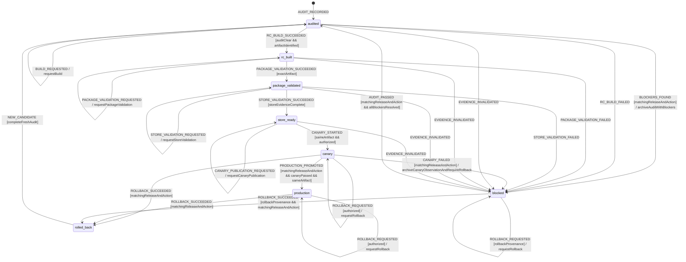

# Release Readiness Workflow Model

Authoritative fail-closed model for moving one MissionPulse release candidate
from audit to production or rollback. State is derived from attached evidence,
not from a mutable label or narrative approval.

## Scope and decisions

The exact ZIP installed in packaged MV3 tests is the only candidate eligible
for Chrome Web Store publication. Commit, committed version, built manifest,
connector catalogue, public metadata, ZIP SHA-256, runtime evidence, Store
configuration, and canary observations must refer to the same `releaseId` and
artifact.

Missing, stale, contradictory, or unverifiable evidence is a blocker. External
Store/canary work remains external until an authorized operator records proof;
local checks cannot claim those gates complete.

## Exact state vocabulary

```ts
type ReleaseReadinessState =
  | 'audited'
  | 'blocked'
  | 'rc_built'
  | 'package_validated'
  | 'store_ready'
  | 'canary'
  | 'production'
  | 'rolled_back';
```

No `ready`, `done`, `approved`, or prose-derived alias may substitute for one
of these states.

## Context and evidence

```ts
type ReleaseActionKind =
  | 'audit'
  | 'build'
  | 'validate_package'
  | 'validate_store'
  | 'publish_canary'
  | 'observe_canary'
  | 'promote_production'
  | 'rollback';

interface ReleaseAction {
  kind: ReleaseActionKind;
  operationId: string;
  actorId: string;
  phase: 'requested' | 'running' | 'cancelling' | 'reconciling';
  requestedAt: string;
  startedAt: string | null;
  retryOfOperationId: string | null;
}

interface FailedReleaseAction {
  kind: ReleaseActionKind;
  operationId: string;
  sourceState: ReleaseReadinessState;
  retryable: boolean;
}

interface CompleteAuditEvidence {
  ref: EvidenceRef;
  releaseId: string;
  sourceCommit: string;
  committedVersion: string;
  auditedAt: string;
  coveredGates: readonly (
    'workflows' | 'security' | 'permissions' | 'metadata' | 'ci' | 'runtime' | 'rollback'
  )[];
  openP0Count: 0;
  openP1Count: 0;
}

interface ReleaseReadinessContext {
  releaseId: string;
  state: ReleaseReadinessState;
  sourceCommit: string;
  committedVersion: string;
  artifactPath: string | null;
  artifactSha256: string | null;
  manifestVersion: string | null;
  manifestConnectorIds: readonly string[];
  auditedAt: string;
  p0Blockers: readonly ReleaseBlocker[];
  p1Blockers: readonly ReleaseBlocker[];
  localGateEvidence: readonly EvidenceRef[];
  mv3ScenarioEvidence: readonly EvidenceRef[];
  storeEvidence: readonly EvidenceRef[];
  canaryEvidence: readonly EvidenceRef[];
  canaryOutcome: 'not_started' | 'running' | 'passed' | 'failed';
  rollbackRequired: boolean;
  rollbackArtifactSha256: string | null;
  activeAction: ReleaseAction | null;
  lastFailedAction: FailedReleaseAction | null;
  resumeFrom: ReleaseReadinessState | null;
  error: ReleaseGateError | null;
}
```

Every action is requested before it starts and remains orthogonal to the eight
readiness states. `ReleaseGateError` records action kind, failed operation ID,
and retryability. Secrets are never part of evidence.

## Events

```ts
type ReleaseReadinessEvent =
  | { type: 'AUDIT_RECORDED'; releaseId: string; evidence: EvidenceRef }
  | {
      type: 'BLOCKERS_FOUND';
      releaseId: string;
      operationId: string;
      blockers: readonly ReleaseBlocker[];
    }
  | {
      type: 'AUDIT_REQUESTED';
      releaseId: string;
      operationId: string;
      actorId: string;
      requestedAt: string;
    }
  | { type: 'AUDIT_PASSED'; releaseId: string; operationId: string; evidence: EvidenceRef }
  | {
      type: 'BUILD_REQUESTED';
      releaseId: string;
      operationId: string;
      actorId: string;
      requestedAt: string;
    }
  | {
      type: 'PACKAGE_VALIDATION_REQUESTED';
      releaseId: string;
      operationId: string;
      actorId: string;
      requestedAt: string;
    }
  | {
      type: 'STORE_VALIDATION_REQUESTED';
      releaseId: string;
      operationId: string;
      actorId: string;
      requestedAt: string;
    }
  | {
      type: 'CANARY_PUBLICATION_REQUESTED';
      releaseId: string;
      operationId: string;
      actorId: string;
      requestedAt: string;
    }
  | {
      type: 'CANARY_OBSERVATION_REQUESTED';
      releaseId: string;
      operationId: string;
      actorId: string;
      requestedAt: string;
    }
  | {
      type: 'PRODUCTION_PROMOTION_REQUESTED';
      releaseId: string;
      operationId: string;
      actorId: string;
      requestedAt: string;
    }
  | { type: 'ACTION_STARTED'; releaseId: string; operationId: string; startedAt: string }
  | {
      type: 'RC_BUILD_SUCCEEDED';
      releaseId: string;
      operationId: string;
      commit: string;
      version: string;
      artifactPath: string;
      sha256: string;
      manifestVersion: string;
      connectorIds: readonly string[];
    }
  | { type: 'RC_BUILD_FAILED'; releaseId: string; operationId: string; error: ReleaseGateError }
  | {
      type: 'PACKAGE_VALIDATION_SUCCEEDED';
      releaseId: string;
      operationId: string;
      sha256: string;
      evidence: readonly EvidenceRef[];
    }
  | {
      type: 'PACKAGE_VALIDATION_FAILED';
      releaseId: string;
      operationId: string;
      error: ReleaseGateError;
    }
  | {
      type: 'STORE_VALIDATION_SUCCEEDED';
      releaseId: string;
      operationId: string;
      evidence: readonly EvidenceRef[];
    }
  | {
      type: 'STORE_VALIDATION_FAILED';
      releaseId: string;
      operationId: string;
      error: ReleaseGateError;
    }
  | {
      type: 'CANARY_STARTED';
      releaseId: string;
      operationId: string;
      artifactSha256: string;
      evidence: EvidenceRef;
    }
  | {
      type: 'CANARY_PUBLICATION_FAILED';
      releaseId: string;
      operationId: string;
      error: ReleaseGateError;
    }
  | {
      type: 'CANARY_PASSED';
      releaseId: string;
      operationId: string;
      artifactSha256: string;
      evidence: readonly EvidenceRef[];
    }
  | {
      type: 'CANARY_FAILED';
      releaseId: string;
      operationId: string;
      error: ReleaseGateError;
      evidence: readonly EvidenceRef[];
    }
  | {
      type: 'PRODUCTION_PROMOTED';
      releaseId: string;
      operationId: string;
      artifactSha256: string;
      evidence: EvidenceRef;
    }
  | {
      type: 'PRODUCTION_PROMOTION_FAILED';
      releaseId: string;
      operationId: string;
      error: ReleaseGateError;
    }
  | {
      type: 'ROLLBACK_REQUESTED';
      releaseId: string;
      operationId: string;
      actorId: string;
      requestedAt: string;
      reason: string;
    }
  | {
      type: 'ROLLBACK_SUCCEEDED';
      releaseId: string;
      operationId: string;
      restoredSha256: string;
      evidence: EvidenceRef;
    }
  | { type: 'ROLLBACK_FAILED'; releaseId: string; operationId: string; error: ReleaseGateError }
  | { type: 'EVIDENCE_INVALIDATED'; releaseId: string; reason: string }
  | { type: 'CANCEL_ACTION'; releaseId: string; operationId: string }
  | { type: 'ACTION_CANCELLED'; releaseId: string; operationId: string }
  | {
      type: 'ACTION_CANCEL_FAILED';
      releaseId: string;
      operationId: string;
      error: ReleaseGateError;
    }
  | {
      type: 'RETRY_GATE';
      releaseId: string;
      failedOperationId: string;
      operationId: string;
      actorId: string;
      requestedAt: string;
    }
  | { type: 'SERVICE_RESTARTED'; releaseId: string }
  | {
      type: 'ACTION_RECONCILED';
      releaseId: string;
      operationId: string;
      outcome: 'not_applied' | 'applied' | 'unknown';
      evidence: EvidenceRef | null;
    }
  | {
      type: 'NEW_CANDIDATE';
      previousReleaseId: string;
      releaseId: string;
      sourceCommit: string;
      committedVersion: string;
      audit: CompleteAuditEvidence;
    };
```

## Statechart



Build/validation/publish/rollback actions run while the last stable state
remains visible in `state`; `activeAction` records the in-flight action. Only a
typed guarded success or external milestone (`CANARY_STARTED`) advances the
state; request, start, cancel, retry, and reconciliation events do not
optimistically advance it.

## Guards

| Guard                      | Rule                                                                                                                                                     |
| -------------------------- | -------------------------------------------------------------------------------------------------------------------------------------------------------- |
| `matchingReleaseAndAction` | Release ID, operation ID, and expected action kind match current context/active action.                                                                  |
| `settleableAction`         | Matching action phase is `running` or `reconciling`; a result cannot settle a merely requested or cancelling action.                                     |
| `noActiveAction`           | No action lock exists; otherwise request returns typed `RELEASE_BUSY` without mutation.                                                                  |
| `legalActionSource`        | Requested kind is allowed from the current state, or from `blocked` with matching `resumeFrom`/failed-action provenance.                                 |
| `allBlockersResolved`      | Zero open P0 and P1 blockers, each closure linked to fresh evidence.                                                                                     |
| `auditClear`               | Audit covers workflows, security, permissions, metadata, CI, runtime, and rollback; no P0/P1.                                                            |
| `artifactIdentified`       | ZIP exists and commit/version/manifest/SHA-256 are non-empty and mutually consistent.                                                                    |
| `exactArtifact`            | Validated/installed ZIP SHA equals `artifactSha256`; post-build manifest and committed version match.                                                    |
| `localGateComplete`        | Format, lint, typecheck, unit/integration tests, build, post-build manifest validation, and packaged MV3 tests passed.                                   |
| `storeEvidenceComplete`    | CWS credentials/config, listing, privacy disclosures, minimal permissions, package metadata, and rollback artifact are verified.                         |
| `canaryPassed`             | Fresh typed pass evidence is attached for this release/artifact, duration/sample completed, no stop threshold crossed, and rollback rehearsal evidenced. |
| `authorized`               | Named human/operator is permitted for the external Store action; required credentials exist.                                                             |
| `sameArtifact`             | Event SHA equals candidate SHA and no rebuild/repack occurred after validation.                                                                          |
| `rollbackProvenance`       | Current state is canary/production, or state is `blocked` with `rollbackRequired` and `resumeFrom` equal to canary/production.                           |
| `cancellableAction`        | Action has no externally visible/committed side effect; canary publication, promotion, and rollback after external receipt are not locally cancellable.  |
| `retryableFailedAction`    | `failedOperationId` matches `lastFailedAction`, error is retryable, rollback is not required, and the new operation ID differs.                          |
| `completeFreshAudit`       | Previous ID matches current candidate; new ID differs; audit is fresh, complete, bound to new ID/commit/version, and has zero P0/P1.                     |

## Transition table

`S*` below means either stable state `S`, or `blocked` with
`resumeFrom === S` while a matching retry/reconciliation action is active.

| From                                            | Event                            | Guard                                                 | To                  | Required evidence/effects                                                                                                                                            |
| ----------------------------------------------- | -------------------------------- | ----------------------------------------------------- | ------------------- | -------------------------------------------------------------------------------------------------------------------------------------------------------------------- |
| initial                                         | `AUDIT_RECORDED`                 | complete audit                                        | `audited`           | Record exact commit, version, findings, owner, and timestamp.                                                                                                        |
| audited/blocked                                 | `AUDIT_REQUESTED`                | no action, legal source                               | same                | Create requested `audit` action; no blocker is cleared yet.                                                                                                          |
| audited/blocked                                 | `BLOCKERS_FOUND`                 | matching audit release/operation/action               | `blocked`           | Attach remaining/new blockers, archive the matching audit as failed, and clear the action while preserving source provenance.                                        |
| `audited`                                       | `AUDIT_PASSED`                   | matching audit release/operation/action               | `audited`           | Attach fresh passing audit evidence, update `auditedAt`, archive the action as passed, and clear `activeAction`/error.                                               |
| `audited`                                       | `BUILD_REQUESTED`                | no action, audit clear                                | `audited`           | Create requested `build` action.                                                                                                                                     |
| `rc_built`                                      | `PACKAGE_VALIDATION_REQUESTED`   | no action, artifact identified                        | `rc_built`          | Create requested `validate_package` action for the exact hash.                                                                                                       |
| `package_validated`                             | `STORE_VALIDATION_REQUESTED`     | no action, exact artifact                             | `package_validated` | Create requested `validate_store` action.                                                                                                                            |
| `store_ready`                                   | `CANARY_PUBLICATION_REQUESTED`   | no action, authorized                                 | `store_ready`       | Create requested `publish_canary` action for the exact hash.                                                                                                         |
| `canary`                                        | `CANARY_OBSERVATION_REQUESTED`   | no action, outcome running                            | `canary`            | Create requested `observe_canary` action and measured window.                                                                                                        |
| `canary`                                        | `PRODUCTION_PROMOTION_REQUESTED` | no action, `canaryPassed`                             | `canary`            | Create requested `promote_production` action.                                                                                                                        |
| canary/production/rollback-provenance `blocked` | `ROLLBACK_REQUESTED`             | no action, authorized, provenance                     | same                | Create requested `rollback` action; never claim restoration yet.                                                                                                     |
| any stable source                               | `ACTION_STARTED`                 | matching requested action                             | same                | Change only action phase to `running`; attach no gate evidence.                                                                                                      |
| `blocked`                                       | `AUDIT_PASSED`                   | matching audit, all resolved                          | `audited`           | Attach fresh closure/audit evidence; clear action/error/resume and invalidate all later-stage evidence.                                                              |
| `audited*`                                      | `RC_BUILD_SUCCEEDED`             | matching build, audit clear, identified               | `rc_built`          | Record ZIP path/hash/manifest/catalogue; clear action/error/resume.                                                                                                  |
| `rc_built*`                                     | `PACKAGE_VALIDATION_SUCCEEDED`   | matching package action, exact artifact, local gates  | `package_validated` | Attach packaged MV3 evidence for the exact ZIP.                                                                                                                      |
| `package_validated*`                            | `STORE_VALIDATION_SUCCEEDED`     | matching Store action, complete evidence              | `store_ready`       | Attach listing/privacy/permissions/configuration evidence.                                                                                                           |
| `store_ready*`                                  | `CANARY_STARTED`                 | matching publication, same artifact, authorized       | `canary`            | Attach publication receipt, set `canaryOutcome='running'`, clear publication action.                                                                                 |
| `canary*`                                       | `CANARY_PASSED`                  | matching observation, same artifact                   | `canary`            | Append typed pass evidence, set outcome `passed`, and clear action.                                                                                                  |
| `canary*`                                       | `CANARY_FAILED`                  | matching observation                                  | `blocked`           | Append threshold evidence, archive the observation action as failed, clear `activeAction`, set outcome `failed`, `resumeFrom='canary'`, and `rollbackRequired=true`. |
| `canary*`                                       | `PRODUCTION_PROMOTED`            | matching promotion, canary passed, same artifact      | `production`        | Attach receipt, clear action/error/resume; never rebuild/repack.                                                                                                     |
| canary/production/provenance `blocked`          | `ROLLBACK_SUCCEEDED`             | matching rollback, authorized, restored hash verified | `rolled_back`       | Attach restoration/health proof and clear `rollbackRequired`, action, and error.                                                                                     |
| build/package/Store/promotion action source     | matching typed failure           | matching action                                       | `blocked`           | Preserve logical source in `resumeFrom`, record failed kind/operation/retryability, clear action, and attach error evidence.                                         |
| canary/production                               | `ROLLBACK_FAILED`                | matching rollback                                     | `blocked`           | Preserve source in `resumeFrom`, set `rollbackRequired=true`, clear action, and attach failure evidence.                                                             |
| rollback-provenance `blocked`                   | `ROLLBACK_FAILED`                | matching rollback                                     | `blocked`           | Preserve original canary/production `resumeFrom` and `rollbackRequired`; attach failure and permit only rollback retry.                                              |
| any stable source                               | `CANCEL_ACTION`                  | matching cancellable action                           | same                | Set action phase `cancelling`; do not clear lock or evidence.                                                                                                        |
| any stable source                               | `ACTION_CANCELLED`               | matching cancelling action                            | same                | Clear only the action; retain prior stable state/evidence.                                                                                                           |
| any stable source                               | `ACTION_CANCEL_FAILED`           | matching cancelling action                            | same                | Set action phase `reconciling`; keep lock and record error.                                                                                                          |
| `blocked`                                       | `RETRY_GATE`                     | retryable failed action, fresh operation              | `blocked`           | Recreate the same action kind with `retryOfOperationId`; preserve `resumeFrom`.                                                                                      |
| any stable source                               | `SERVICE_RESTARTED`              | active action                                         | same                | Set phase `reconciling`, preserve operation/provenance, and query durable/external receipts.                                                                         |
| any stable source                               | `SERVICE_RESTARTED`              | no active action                                      | same                | Revalidate the full evidence bundle; raise `EVIDENCE_INVALIDATED` if any proof drifted.                                                                              |
| any stable source                               | `ACTION_RECONCILED(not_applied)` | matching reconciling action, receipt                  | same                | Clear action; retain stable state and allow a fresh request.                                                                                                         |
| any stable source                               | `ACTION_RECONCILED(applied)`     | matching reconciling action, receipt                  | same                | Return phase to `running`; require the matching typed success/failure event to settle.                                                                               |
| any stable source                               | `ACTION_RECONCILED(unknown)`     | matching reconciling action                           | `blocked`           | Preserve local source; for unknown publish/promote/rollback set canary/production provenance and `rollbackRequired`; clear action and forbid blind retry.            |
| any pre-release state                           | `EVIDENCE_INVALIDATED`           | matching release                                      | `blocked`           | Record drift reason, source state, and invalidate all downstream evidence.                                                                                           |
| `rolled_back`                                   | `NEW_CANDIDATE`                  | `completeFreshAudit`                                  | `audited`           | Atomically replace identity/audit and clear all artifact, Store, canary, rollback, action, error, and resume evidence.                                               |

`CANARY_FAILED` makes confirmed rollback reachable from `blocked`: a matching
`ROLLBACK_REQUESTED` creates the action there, and its matching
`ROLLBACK_SUCCEEDED` alone reaches `rolled_back`. Until that acknowledgement,
the candidate remains `blocked` with `rollbackRequired=true`; Retry cannot
re-run canary observation or bypass rollback.

Archiving `CANARY_FAILED` stores the completed observation operation in the
release audit trail and sets `activeAction=null`. The subsequent
`ROLLBACK_REQUESTED` can therefore satisfy `noActiveAction`; it never overwrites
the observation lock implicitly.

The generic failure row is an exhaustive shorthand:
`RC_BUILD_FAILED -> build`, `PACKAGE_VALIDATION_FAILED -> validate_package`,
`STORE_VALIDATION_FAILED -> validate_store`, and
`CANARY_PUBLICATION_FAILED -> publish_canary`, and
`PRODUCTION_PROMOTION_FAILED -> promote_production`. `CANARY_FAILED` and
`ROLLBACK_FAILED` use their dedicated rows. A failure without the matching
kind/release/operation is stale and cannot mutate context.

Every typed success/failure row also requires `settleableAction`; requests must
first receive `ACTION_STARTED`, while an applied reconciliation may restore the
phase to `running`. A result received while action phase is `requested` or
`cancelling` is stale and cannot advance or block the candidate.

## Side effects and ownership

- **Core/model:** pure guards over immutable evidence references and artifact
  identity. It cannot build, publish, read secrets, or approve a release.
- **Local/CI Shell:** executes gates, builds the candidate, hashes bytes,
  validates the post-build manifest, stores logs/traces/screenshots, and emits
  typed results.
- **Authorized release operator:** performs CWS dashboard, canary, promotion,
  and rollback actions and records external receipts.
- **Documentation:** `docs/release/<version>-rc-evidence.md` summarizes evidence
  without converting missing external proof into completion.

## Persistence boundary

Release state is recomputed from the committed evidence bundle plus immutable
CI/artifact/external references. The candidate ZIP is retained byte-for-byte;
its SHA-256 and source commit are durable identifiers. Secrets, cookie values,
and access tokens are never written into the bundle.

An in-flight `activeAction`/lock is stored by CI or the release runner, but it
is not proof of success. After runner/service restart, every referenced file
and hash is revalidated and the action enters `reconciling`. A matching receipt
classifies it as not applied, applied-awaiting-typed-result, or unknown; unknown
becomes `blocked` and is never assumed failed or successful.

## Permissions and offline behavior

Local audit/build checks use repository permissions only. Store validation,
canary, production, and rollback require an authorized operator, network, 2FA,
and all four CWS credentials: `CHROME_EXTENSION_ID`, `CHROME_CLIENT_ID`,
`CHROME_CLIENT_SECRET`, and `CHROME_REFRESH_TOKEN`. Missing/refused permissions
or credentials transition to/remain `blocked`; they are never warnings in
production mode.

Offline local checks may be recorded, but no state at or beyond `store_ready`
can advance without fresh online external proof. A transient network failure
keeps the stable state, records a failed action, and permits explicit Retry.

## Retry, cancellation, concurrency, and restart

- Gate retries name the failed operation and use a distinct new operation ID;
  they recreate only that action kind and attach new evidence. When
  `rollbackRequired`, only rollback may be retried.
- Cancelling a local build/validation first enters action phase `cancelling`;
  only `ACTION_CANCELLED` clears it. Once CWS publication/canary is externally
  visible, cancellation is rejected and requires modeled rollback or receipt
  reconciliation.
- One release lock exists per `releaseId`; concurrent action returns typed busy
  and does not mutate evidence/state.
- Rebuild, repack, manifest edit, source commit change, or metadata drift after
  validation invalidates downstream evidence and moves to `blocked`.
- Runner/service restart revalidates the bundle and reduces through the three
  explicit `ACTION_RECONCILED` outcomes. Unknown external outcome is blocked;
  applied outcome still needs the original typed gate result.

## Terminal states and re-entry

`production` is the successful terminal state for a candidate but permits the
explicit rollback path. `rolled_back` is terminal for that candidate;
`NEW_CANDIDATE` creates a new release ID and returns to `audited` only after a
complete fresh audit bound to the new ID/commit/version. `blocked` is settled,
not success; it exits only through the action matching its provenance: fresh
audit, matching gate retry success, or confirmed rollback.

## Forbidden transitions

- `audited`/`blocked` directly to package, Store, canary, or production states.
- `rc_built` to later states when hash/version/manifest/commit disagree.
- `package_validated` based on dev-stub Playwright instead of packaged MV3.
- `store_ready` with missing credentials, dashboard fields, metadata alignment,
  permission justification, rollback artifact, or external proof.
- Canary/production publication of rebuilt or repacked bytes.
- `canary`/`production` to `rolled_back` before rollback confirmation.
- Gate success/failure with no matching requested/running/reconciling action.
- `CANARY_PASSED` without fresh evidence bound to the current artifact, or
  production promotion while canary outcome is not `passed`.
- Retrying with the failed operation ID, retrying canary while rollback is
  required, or clearing an action before cancellation/reconciliation proof.
- `rolled_back -> audited` by changing only a release ID or label; complete
  fresh audit evidence for the new identity is mandatory.
- Advancement from warnings, free text, branch name, tag, or mutable status flag.
- Any implicit transition from an LLM assessment, narrative approval, or report prose.

## Invariants

1. State vocabulary is exactly the eight values declared above.
2. Every advance has same-release, same-artifact, fresh attached evidence.
3. Zero unresolved P0/P1 is required at and beyond `rc_built`.
4. `package_validated` means the exact ZIP hash passed post-build validation and
   real packaged MV3 scenarios.
5. `store_ready`, `canary`, and `production` require explicit external proof.
6. The committed version, tag/release source commit, manifest, listing, and ZIP
   describe the same product/connectors.
7. Missing production configuration fails closed.
8. Rollback never claims success before the known-good artifact is restored and verified.
9. An LLM never decides a transition; authorized typed events plus guards do.
10. Every gate has an explicit request and matching result protocol; one action
    lock prevents concurrent or cross-kind acknowledgements.
11. `CANARY_FAILED` retains canary provenance until matching confirmed rollback
    reaches `rolled_back`.
12. `NEW_CANDIDATE` atomically clears all prior downstream evidence and cannot
    reach `audited` without a complete fresh audit.

## Review checklist

- [x] Nominal `audited -> rc_built -> package_validated -> store_ready -> canary -> production` flow is explicit.
- [x] Audit, blocker remediation, build, exact-package validation, Store, canary, production, and rollback are explicit.
- [x] Build/test/manifest/config/metadata/permission failures fail closed.
- [x] Offline and refused/missing external authorization cannot advance release.
- [x] Retry, local cancellation, post-publication rollback, and concurrent action lock are defined.
- [x] Runner/service restart and unknown external outcome force reconciliation.
- [x] Package/Store/canary/promotion requests, canary evidence, cancel acknowledgements, and retry semantics are reducible.
- [x] Confirmed rollback remains reachable after canary failure in `blocked`.
- [x] Production/rollback terminal behavior and fresh-candidate re-entry are explicit.
