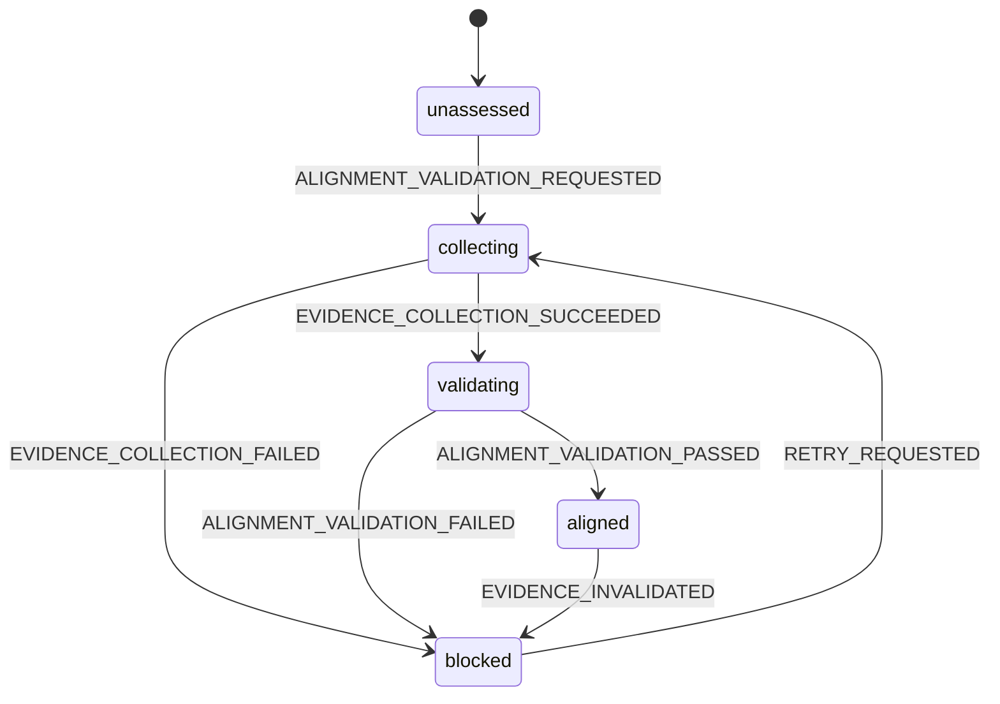

# Release Surface Alignment Model

Source de vérité pour la barrière de release qui aligne le package MV3, le
catalogue de connecteurs publié, les déclarations de confidentialité, les
permissions d'hôte et la politique de cache HTML des surfaces web
MissionPulse.

Ce modèle affine le guard `storeEvidenceComplete` de
`release-readiness.model.md`. Une validation Store ne peut réussir que si ce
modèle est dans l'état `aligned` pour le SHA-256 exact du candidat.

Le modèle décide uniquement à partir de preuves structurées. Un LLM peut
signaler une divergence, mais ne peut ni classer une requête comme anonyme, ni
justifier une permission, ni faire avancer la release.

## Portée et hors portée

Ce modèle couvre :

- le catalogue exact du package de production et toutes les surfaces publiques
  qui décrivent ce package ;
- la nécessité, le champ et la propriété de chaque pattern de
  `host_permissions` et `optional_host_permissions` ;
- la classification de cache des réponses HTML de `landing` et `dashboard` ;
- le protocole de validation, les erreurs bloquantes et les preuves attendues.

Il ne choisit pas quels connecteurs seront commercialisés, ne modifie pas le
contenu marketing et ne réalise aucun appel réseau. La sélection des
connecteurs reste définie par `connector-build-config.model.md`.

## Sources et précédence

Pour un candidat donné, les sources sont lues dans cet ordre :

1. le SHA-256 du ZIP et son `dist/manifest.json` ;
2. le résultat capturé de `resolveIncludedConnectors` pour ce build, y compris
   les overrides d'environnement ;
3. les métadonnées de `meta.ts` correspondant aux IDs inclus ;
4. les déclarations Store, privacy et landing liées au même candidat ;
5. les preuves de besoin runtime des permissions non possédées par un
   connecteur ;
6. les tests de politique de cache des deux applications web.

Le catalogue complet de développement, le manifest source seul, un ancien ZIP
ou une documentation narrative ne remplacent jamais les preuves 1 à 3.
Cette barrière ne considère l'artefact exact qu'après satisfaction du guard
`exactArtifact` de `release-readiness.model.md` : le digest canonique du `dist`
chargé par le harnais MV3 doit égaler celui de l'arborescence extraite du ZIP,
et le packaging ne doit déclencher aucun rebuild ou repack intermédiaire.

## Snapshot du package de production actuel

Avec `connectors.config.json` qui exclut `malt` et `collective`, sans override
d'environnement, le catalogue canonique ordonné est :

| ID            | Nom public  | Permissions d'hôte possédées par le connecteur                              |
| ------------- | ----------- | --------------------------------------------------------------------------- |
| `free-work`   | Free-Work   | `https://www.free-work.com/*`                                               |
| `lehibou`     | LeHibou     | `https://*.lehibou.com/*`                                                   |
| `hiway`       | Hiway       | `https://hiway-missions.fr/*`, `https://jhgjtlkfewuiiofxfrvh.supabase.co/*` |
| `cherry-pick` | Cherry Pick | `https://app.cherry-pick.io/*`                                              |

Le domaine Supabase ci-dessus est une infrastructure possédée par le
connecteur Hiway, pas un cinquième connecteur public.

Un build avec un override différent doit produire un nouveau snapshot de
preuve et réaligner les déclarations avant publication. Les noms, le nombre et
les IDs ne sont jamais codés en dur comme vérité parallèle dans le validateur.

## Types conceptuels

```ts
type SurfaceId = 'cws_listing' | 'repository_privacy' | 'landing_privacy' | 'landing_marketing';

type ConnectorDisclosure = {
  surface: SurfaceId;
  connectorIds: readonly string[];
  connectorNames: readonly string[];
  declaredCount: number | null;
  contentDigest: string;
};

type ManifestPermissionField = 'host_permissions' | 'optional_host_permissions';

type HostPermissionOwnership =
  | { kind: 'connector'; connectorId: string }
  | { kind: 'product_feature'; featureId: 'linkedin_profile_import' }
  | { kind: 'product_owned'; product: 'missionpulse' }
  | { kind: 'unowned' };

type HostPermissionNeed =
  | { kind: 'required'; callsites: readonly EvidenceRef[]; contractTests: readonly EvidenceRef[] }
  | { kind: 'unused' }
  | { kind: 'unknown' };

type HostPermissionClaim = {
  manifestField: ManifestPermissionField;
  pattern: string;
  ownership: HostPermissionOwnership;
  need: HostPermissionNeed;
};

type ReleaseSurfaceEvidence = {
  releaseId: string;
  artifactSha256: string;
  manifestDigest: string;
  buildResolutionDigest: string;
  packageConnectors: readonly ConnectorMetaSnapshot[];
  disclosures: readonly ConnectorDisclosure[];
  hostPermissionClaims: readonly HostPermissionClaim[];
  cachePolicyEvidence: readonly EvidenceRef[];
  collectedAt: string;
};
```

`EvidenceRef` contient au minimum un chemin ou identifiant immuable, un digest,
un horodatage et le `artifactSha256` associé. Une URL mutable ou un commentaire
sans digest ne constitue pas une preuve.

## Règle d'égalité du catalogue

Après normalisation structurée, chaque surface de release doit satisfaire :

```text
surface.connectorIds   === package.connectorIds
surface.connectorNames === package.connectorNames
surface.declaredCount  === package.connectorIds.length, lorsqu'un compte est affiché
```

L'égalité est exacte, sans éléments manquants ou supplémentaires. L'ordre
canonique vient de `meta.ts`. Les variantes de ponctuation dans la prose sont
tolérées uniquement si les IDs et noms extraits restent exacts.

Sont des surfaces de release obligatoires :

- `docs/store-listing.md`, y compris résumé, description, fonctionnalités,
  liste des plateformes et justifications de permissions ;
- `docs/privacy-policy.md` ;
- `apps/landing/src/routes/privacy/+page.svelte` ;
- toute page landing qui affirme le nombre ou les noms des connecteurs du
  package, actuellement `apps/landing/src/routes/+page.svelte`.

Les ADR et documents explicitement historiques ne sont pas des disclosures de
release. Ils ne peuvent cependant pas être utilisés comme preuve Store.

## Règle des permissions d'hôte

L'inventaire est l'union de `manifest.host_permissions` et de
`manifest.optional_host_permissions`. Chaque entrée des deux champs possède
exactement un `HostPermissionClaim` avec le même `manifestField` et le même
pattern, et chaque claim correspond à exactement une entrée du manifest.

Les permissions obligatoires des connecteurs restent dérivées de `meta.ts` et
vivent dans `host_permissions`. Une permission optionnelle de fonctionnalité ne
peut pas satisfaire la couverture d'un connecteur obligatoire et un host de
connecteur ne peut pas être rétrogradé en `optional_host_permissions`. Cette
séparation préserve le contrat de build des connecteurs défini par
`connector-build-config.model.md`.

Une permission est valide si et seulement si :

1. son champ de manifest est explicite et exact ;
2. son propriétaire est identifié ;
3. son besoin runtime est `required` ;
4. au moins un callsite exact démontre une opération Chrome cross-origin qui
   exige cette permission ;
5. un test de contrat échoue si la permission requise disparaît, change de
   champ ou est demandée hors du geste utilisateur prévu ;
6. sa finalité est cohérente avec les disclosures privacy et Store.

Être propriétaire du domaine ne prouve pas le besoin. Ouvrir une URL dans un
onglet par action utilisateur ne requiert pas une `host_permission`.

### Décision actuelle pour `https://missionpulse.app/*`

| Dimension              | Décision                                                                                    |
| ---------------------- | ------------------------------------------------------------------------------------------- |
| Champ manifest         | `host_permissions`                                                                          |
| Propriété              | `product_owned`                                                                             |
| Callsite observé       | Navigation externe vers `https://missionpulse.app/dashboard`                                |
| Besoin Chrome démontré | Aucun fetch, accès cookie, injection ou autre opération cross-origin exigeant la permission |
| Classification         | `unused`                                                                                    |
| Effet requis           | Absente du manifest source et du manifest packagé                                           |

La permission ne peut être réintroduite qu'avec un nouveau claim `required`,
un callsite et un test de contrat. Le comportement de build qui conserve toute
permission « non possédée par un connecteur » n'est pas une justification.

### Claim actuel pour `https://www.linkedin.com/*`

| Dimension              | Décision                                                                                                                                                  |
| ---------------------- | --------------------------------------------------------------------------------------------------------------------------------------------------------- |
| Champ manifest         | `optional_host_permissions`                                                                                                                               |
| Propriété              | `product_feature { featureId: 'linkedin_profile_import' }`                                                                                                |
| Besoin                 | `required`                                                                                                                                                |
| Callsites              | `ensureLinkedInHostPermission()` (`permissions.contains/request`) et l'extracteur de profil LinkedIn après octroi                                         |
| Contrats               | `profile-sync-facade.test.ts`, `linkedin-extractor.test.ts`, `verify-manifest.test.ts`                                                                    |
| Justification du champ | Accès demandé depuis le side panel pendant le geste explicite d'import ; il n'est ni accordé au premier install ni assimilé aux hosts obligatoires Task 6 |

Le validateur doit accepter ce claim optionnel prouvé. Il ne doit ni l'ignorer
comme hors inventaire, ni le rejeter comme pattern « unowned », ni le déplacer
vers `host_permissions`.

## Classification du cache HTML

La décision est une fonction pure. Le Shell SvelteKit collecte les faits,
appelle la fonction et applique l'effet. Il ne déduit jamais la sécurité depuis
le seul `content-type`.

### Faits d'entrée

```ts
type WebSurface = 'landing' | 'dashboard';
type RouteClass = 'anonymous_allowlisted' | 'private' | 'unknown';
type AuthClass = 'anonymous' | 'private' | 'unknown';
type PerformanceCacheMode = 'enabled' | 'disabled' | 'unknown';

type CacheRequestFacts = {
  surface: WebSurface;
  method: string;
  routeId: string | null;
  performanceCacheMode: PerformanceCacheMode;
  hasAuthorizationHeader: boolean;
  hasAnyCookieHeader: boolean;
  hasVerifiedUser: boolean;
};

type CacheResponseFacts = {
  status: number;
  contentType: string | null;
  hasSetCookie: boolean;
  existingCacheControl: string | null;
  existingVary: string | null;
};

type CacheDecision =
  | {
      kind: 'public';
      cacheControl:
        | { action: 'set'; value: 'public, max-age=300' }
        | { action: 'preserve_exact'; value: string };
      vary: { action: 'set'; value: string } | { action: 'preserve_exact'; value: string };
    }
  | {
      kind: 'private';
      cacheControl:
        | { action: 'set'; value: 'private, no-store' }
        | { action: 'preserve_stricter'; value: string };
      vary: { action: 'preserve'; value: string | null };
    }
  | { kind: 'non_html'; cacheControl: null; vary: null };

declare function classifyReleaseCache(
  request: Readonly<CacheRequestFacts>,
  response: Readonly<CacheResponseFacts>
): CacheDecision;
```

Le Shell convertit la valeur brute d'environnement avant l'appel : valeur
exacte `"1"` → `enabled`, absence ou valeur exacte `"0"` → `disabled`, toute
autre valeur → `unknown`. `disabled` et `unknown` suivent tous deux le chemin
privé pour une réponse HTML ; le Core ne lit jamais l'environnement.

`hasAnyCookieHeader` signifie que le header de requête `Cookie` existe, quel
que soit son nom, sa valeur ou sa validité. Tout cookie, même fonctionnel,
préférentiel, vide ou sans rapport avec Supabase, rend la réponse privée. Le
hook ne parse, ne lit et ne journalise jamais sa valeur. Une exception future
exige une nouvelle version explicite de ce modèle et ses tests.

`contentType` est classé en trois catégories :

- `html` uniquement si l'essence MIME explicite valide est exactement
  `text/html`, sans tenir compte de la casse ; les paramètres éventuels doivent
  eux aussi être syntaxiquement valides (`nom=valeur` ou quoted-string) ;
- `non_html` uniquement si un MIME explicite valide est présent et que son
  essence n'est pas exactement `text/html` ; `text/htmlx` appartient donc à
  cette catégorie, jamais à `html` ;
- `unknown` si le header est absent, vide, invalide ou non analysable.

`application/text/html` est invalide car une essence MIME contient exactement
un seul `/`. Il est donc `unknown` et suit le chemin privé fail-closed.

`unknown` suit toujours le chemin privé `private, no-store`. L'absence de
header n'est jamais une preuve permettant de préserver un cache public
existant.

### Allowlist initiale

L'allowlist utilise `event.route.id`, pas un préfixe de chemin ni une regex :

| Surface     | Route IDs anonymes autorisées au cache public |
| ----------- | --------------------------------------------- |
| `landing`   | `/`, `/privacy`, `/login`                     |
| `dashboard` | aucune                                        |

`/register`, `/register/passkey`, `/dashboard`, les routes API et toute route
inconnue sont privées. Ajouter une route demande une modification explicite du
modèle et ses tests RED/GREEN.

### Détermination de `AuthClass`

Dans cet ordre :

1. si la route est `private`, si un utilisateur est vérifié, si un header
   `Authorization` existe ou si n'importe quel header `Cookie` existe :
   `private` ;
2. si la route est `anonymous_allowlisted` et qu'aucun signal de session ou
   d'autorisation et aucun header `Cookie` n'existent : `anonymous` ;
3. sinon : `unknown`.

Une absence d'information n'est jamais assimilée à un utilisateur anonyme.

### Normalisation de `Cache-Control` et `Vary`

Le Core classe le `Cache-Control` existant avant toute décision publique :

- `absent` : le header public exact pourra être ajouté ;
- `exact_public_300` : après normalisation case-insensitive et des espaces, le
  set de directives est exactement `{ public, max-age=300 }`, sans doublon ni
  autre directive ; le header peut rester inchangé (`preserve_exact`) ;
- `conflict` : toute autre valeur, y compris `private`, `no-store`, `no-cache`,
  un autre `max-age`, une directive additionnelle, dupliquée ou ambiguë.

Un conflit interdit la décision publique. La décision privée conserve un
header existant qui contient déjà au minimum `private` et `no-store` ; sinon
elle le remplace par `private, no-store`. Cette opération est plus stricte :
elle ne retire jamais une protection `private`/`no-store` et n'augmente jamais
un TTL existant.

Le Core parse `Vary` case-insensitivement comme une liste de tokens HTTP :

- header absent ou tokens valides : `mergeable` ;
- `*`, token vide/invalide, représentation non analysable ou ambiguë :
  `conflict`.

Pour une réponse publique, `mergeVary` préserve les autres tokens valides dans
leur ordre, retire les doublons case-insensitifs, puis garantit les tokens
canoniques `Cookie` et `Authorization`. Exemples :

```text
null                              -> Cookie, Authorization
Accept-Encoding                   -> Accept-Encoding, Cookie, Authorization
authorization, Accept-Encoding    -> Accept-Encoding, Cookie, Authorization
Cookie, Authorization             -> preserve_exact
*                                 -> conflict -> private
```

Le Shell applique `Cache-Control` et `Vary` comme un seul effet public. Il ne
peut pas envoyer l'un sans l'autre. `Vary: Cookie, Authorization` empêche un
cache partagé de réutiliser une représentation anonyme pour une requête qui
porte ultérieurement un cookie ou une autorisation.

### Guards d'une réponse publique

`mayUsePublicCache` est vrai seulement si tous les guards sont vrais :

- `performanceCacheMode === 'enabled'` ;
- méthode `GET` ou `HEAD` ;
- `routeId` exactement allowlisté sur la bonne surface ;
- `AuthClass === 'anonymous'` ;
- aucun header de requête `Cookie` ou `Authorization` ;
- statut `200` ;
- `content-type` est explicitement classé `html` ;
- aucun header `Set-Cookie` dans la réponse ;
- `Cache-Control` existant classé `absent` ou `exact_public_300` ;
- `Vary` existant classé `mergeable`.

Tous les guards sont conjunctifs. L'échec ou l'incertitude d'un seul guard
interdit le cache public.

### Transitions par requête

| État           | Événement               | Guard                                                      | État suivant | Effet                                                                                        |
| -------------- | ----------------------- | ---------------------------------------------------------- | ------------ | -------------------------------------------------------------------------------------------- |
| `unclassified` | `RESPONSE_RESOLVED`     | MIME explicite valide classé `non_html`                    | `non_html`   | préserver `Cache-Control` et `Vary`                                                          |
| `unclassified` | `RESPONSE_RESOLVED`     | `mayUsePublicCache`                                        | `public`     | appliquer atomiquement `public, max-age=300` et le merge exact `Vary: Cookie, Authorization` |
| `unclassified` | `RESPONSE_RESOLVED`     | contenu `html`/`unknown` et `!mayUsePublicCache`           | `private`    | préserver un header déjà plus strict ou définir `private, no-store`; préserver `Vary`        |
| `public`       | `AUTH_EVIDENCE_CHANGED` | tout Cookie/Authorization, signal privé/inconnu/Set-Cookie | `private`    | annuler l'effet public avant envoi et renforcer `Cache-Control`                              |
| état terminal  | second résultat         | toujours faux                                              | inchangé     | signaler `DUPLICATE_RESPONSE_CLASSIFICATION`                                                 |

La classification est normalement synchrone et terminale par réponse. La
transition `AUTH_EVIDENCE_CHANGED` représente une détection tardive avant
l'envoi des headers ; après envoi, elle devient une erreur de validation et
interdit la release.

## Machine de validation de release



### Requêtes et résultats

Chaque événement contient `releaseId`, `validationId`, `artifactSha256` et un
horodatage. Un seul `validationId` est actif par release.

| Depuis       | Événement                        | Guard                                               | Vers         | Effet                                                     |
| ------------ | -------------------------------- | --------------------------------------------------- | ------------ | --------------------------------------------------------- |
| `unassessed` | `ALIGNMENT_VALIDATION_REQUESTED` | aucun run actif, artefact identifié                 | `collecting` | verrouiller le run et demander les preuves                |
| `collecting` | `EVIDENCE_COLLECTION_SUCCEEDED`  | IDs correspondants, bundle complet et frais         | `validating` | attacher le bundle immuable                               |
| `collecting` | `EVIDENCE_COLLECTION_FAILED`     | IDs correspondants                                  | `blocked`    | attacher l'erreur typée, libérer le verrou                |
| `validating` | `ALIGNMENT_VALIDATION_PASSED`    | tous les invariants vrais                           | `aligned`    | émettre la preuve consommable par `storeEvidenceComplete` |
| `validating` | `ALIGNMENT_VALIDATION_FAILED`    | au moins une erreur typée                           | `blocked`    | conserver toutes les divergences, libérer le verrou       |
| `aligned`    | `EVIDENCE_INVALIDATED`           | manifest, build, disclosure, hook ou test modifié   | `blocked`    | invalider le résultat et la preuve Store                  |
| `blocked`    | `RETRY_REQUESTED`                | nouveau `validationId`, artefact toujours identifié | `collecting` | collecter un bundle entièrement frais                     |

Un résultat avec un mauvais ID, un ancien SHA ou sans requête active est
`STALE_VALIDATION_RESULT` et ne modifie pas l'état.

## Effets de bord et responsabilités

- **Core/model pur :** normalise les catalogues, classe ownership/need,
  calcule `RouteClass`, `AuthClass`, `CacheDecision` et réduit la machine.
- **Shell build/release :** lit le ZIP, le manifest, les fichiers de disclosure,
  les callsites et les résultats de tests ; calcule les digests ; émet les
  événements typés.
- **Hooks SvelteKit :** collectent les faits de requête/réponse et appliquent
  uniquement le header retourné. Ils ne contiennent pas de règle métier
  parallèle.
- **Opérateur de release :** corrige les surfaces et lance une nouvelle
  validation ; il ne peut pas forcer `aligned` par une approbation narrative.

## Erreurs typées

| Code                                       | Quand                                                       | Retryable | Effet release                       |
| ------------------------------------------ | ----------------------------------------------------------- | --------- | ----------------------------------- |
| `PACKAGE_CATALOGUE_MISMATCH`               | manifest/build/runtime ne décrivent pas le même catalogue   | non       | `blocked`                           |
| `DISCLOSURE_MISSING_CONNECTOR`             | une surface omet un connecteur packagé                      | non       | `blocked`                           |
| `DISCLOSURE_UNKNOWN_CONNECTOR`             | une surface annonce un connecteur non packagé               | non       | `blocked`                           |
| `DISCLOSURE_COUNT_MISMATCH`                | un nombre public diffère du catalogue                       | non       | `blocked`                           |
| `PRIVACY_PLACEHOLDER_PRESENT`              | un champ obligatoire de privacy reste incomplet             | non       | `blocked`                           |
| `HOST_PERMISSION_CLAIM_MISSING`            | pattern d'un des deux champs sans claim                     | non       | `blocked`                           |
| `HOST_PERMISSION_CLAIM_DUPLICATE`          | plusieurs claims pour le même champ/pattern                 | non       | `blocked`                           |
| `HOST_PERMISSION_FIELD_MISMATCH`           | claim requis dans un autre champ que le manifest            | non       | `blocked`                           |
| `HOST_PERMISSION_OWNER_UNKNOWN`            | aucune ownership structurée                                 | non       | `blocked`                           |
| `HOST_PERMISSION_NEED_UNKNOWN`             | besoin absent ou narratif                                   | non       | `blocked`                           |
| `OPTIONAL_PERMISSION_CONNECTOR_CONFLATION` | permission optionnelle utilisée comme couverture connecteur | non       | `blocked`                           |
| `UNUSED_HOST_PERMISSION`                   | permission présente avec `need=unused`                      | non       | `blocked`                           |
| `AUTH_CLASSIFICATION_UNKNOWN`              | le hook ne peut prouver `anonymous` ou `private`            | oui       | réponse privée ; validation bloquée |
| `ROUTE_NOT_ALLOWLISTED`                    | tentative de cache public hors allowlist                    | non       | réponse privée ; validation bloquée |
| `RESPONSE_NOT_PUBLIC_CACHEABLE`            | statut, contenu, cookie ou header viole un guard            | oui       | réponse privée                      |
| `CONTENT_TYPE_UNKNOWN`                     | content-type absent, vide, invalide ou non analysable       | oui       | réponse privée                      |
| `PUBLIC_CACHE_PRIVATE_REQUEST`             | réponse avec Cookie/Authorization/auth reçoit `public`      | non       | incident et release `blocked`       |
| `PUBLIC_CACHE_MISSING_VARY`                | effet public sans les deux clés `Vary`                      | non       | incident et release `blocked`       |
| `CACHE_CONTROL_CONFLICT`                   | cache-control existant n'est ni absent ni public exact      | non       | réponse privée ; validation bloquée |
| `VARY_HEADER_CONFLICT`                     | `Vary:*` ou valeur ambiguë empêche le merge exact           | non       | réponse privée ; validation bloquée |
| `STALE_VALIDATION_RESULT`                  | résultat sans run/IDs/SHA correspondants                    | oui       | ignorer sans mutation               |
| `EVIDENCE_INVALIDATED`                     | un input change après `aligned`                             | oui       | revenir à `blocked`                 |

## Invariants

1. Le set et l'ordre des connecteurs de chaque disclosure sont exactement ceux
   du package identifié par SHA-256.
2. Un compte public de plateformes égale toujours la taille du catalogue
   packagé.
3. Chaque pattern de `host_permissions` et `optional_host_permissions` a
   exactement un claim avec champ, ownership et besoin runtime prouvé ;
   propriété seule ne suffit jamais.
4. `https://missionpulse.app/*` est absente tant qu'aucun besoin Chrome
   cross-origin n'est prouvé par callsite et test.
5. `https://www.linkedin.com/*` reste un claim de fonctionnalité requis dans
   `optional_host_permissions` ; il n'est jamais confondu avec les hosts
   obligatoires des connecteurs.
6. Une réponse avec utilisateur, n'importe quel header `Cookie`, authorization,
   route privée ou classification inconnue n'a jamais un cache public.
7. Seules les routes anonymes explicitement allowlistées peuvent recevoir
   l'effet public atomique `Cache-Control: public, max-age=300` et
   `Vary: Cookie, Authorization` fusionné avec les tokens sûrs existants.
8. Une erreur, redirection, réponse avec `Set-Cookie` ou header plus strict
   n'est jamais rendue publiquement cacheable.
9. Un `Cache-Control` existant n'est jamais affaibli ; seul le public exact peut
   être préservé, tout conflit devient privé.
10. `Vary:*` ou un `Vary` ambigu interdit le cache public ; les autres tokens
    sont préservés pendant le merge de `Cookie` et `Authorization`.
11. Les réponses HTML non admissibles sont explicitement `private, no-store` ;
    le flag de performance ne contourne aucun guard.
12. Les réponses non HTML conservent leur politique propre.
13. Seul un MIME explicite valide peut être `non_html`; un content-type absent,
    vide ou invalide devient `private, no-store`.
14. Modifier le manifest, le build, une disclosure, une allowlist, un hook ou un
    test invalide la preuve `aligned`.
15. `storeEvidenceComplete` exige `aligned` pour le même `releaseId` et le même
    `artifactSha256`.
16. Aucun texte libre, LLM ou approbation humaine ne décide d'une transition.

## Matrice de tests RED exigée avant implémentation

| Domaine                | Scénario RED                                                                           | Résultat attendu                              |
| ---------------------- | -------------------------------------------------------------------------------------- | --------------------------------------------- |
| Catalogue              | Store annonce Collective alors que le build l'exclut                                   | `DISCLOSURE_UNKNOWN_CONNECTOR`                |
| Catalogue              | Privacy, landing ou compte « 5 » ne correspond pas aux quatre IDs                      | mismatch bloquant                             |
| Catalogue              | les quatre surfaces contiennent exactement Free-Work, LeHibou, Hiway, Cherry Pick      | preuve d'égalité exacte                       |
| Permission obligatoire | le manifest contient `https://missionpulse.app/*` sans claim `required`                | `UNUSED_HOST_PERMISSION`                      |
| Permission optionnelle | LinkedIn manque, est ignoré, rejeté « unowned » ou déplacé dans `host_permissions`     | claim/field mismatch bloquant                 |
| Permission optionnelle | LinkedIn reste optionnel, lié aux callsites d'import et aux trois contrats             | claim `required` valide                       |
| Cache landing anonyme  | `GET /`, HTML 200, flag actif, aucun Cookie/Authorization                              | cache public + `Vary: Cookie, Authorization`  |
| Réutilisation cache    | réponse anonyme stockée puis requête identique avec cookie quelconque ou Authorization | clé `Vary` distincte et réponse origin privée |
| Cache landing privée   | même route avec `Cookie: theme=dark`, cookie auth ou user vérifié                      | `private, no-store`                           |
| Merge `Vary`           | `Vary: Accept-Encoding` sur réponse publique admissible                                | `Accept-Encoding, Cookie, Authorization`      |
| Conflit `Vary`         | `Vary:*`, token vide ou invalide                                                       | `VARY_HEADER_CONFLICT`, privé                 |
| Cache-Control exact    | valeur normalisée exactement `public, max-age=300`                                     | no-op, jamais réécrit                         |
| Cache-Control conflit  | `private`, `no-store`, autre max-age ou directive additionnelle                        | jamais affaibli ; privé                       |
| Cache route sensible   | `/register`, `/dashboard`, route inconnue ou route API HTML                            | jamais public                                 |
| Cache réponse sensible | redirection, erreur ou `Set-Cookie`                                                    | privé                                         |
| Cache dashboard        | tout HTML dashboard, avec ou sans config/session                                       | `private, no-store`                           |
| Flag désactivé/inconnu | HTML autrement admissible avec mode `disabled` ou `unknown`                            | `private, no-store`                           |
| Content-Type inconnu   | header absent, vide, MIME invalide ou paramètres malformés                             | `CONTENT_TYPE_UNKNOWN`, privé                 |
| Essence HTML exacte    | `TEXT/HTML; charset=UTF-8`                                                             | admissible comme `html`                       |
| Faux positif HTML      | `text/htmlx`                                                                           | `non_html`, jamais public                     |
| Essence MIME invalide  | `application/text/html`                                                                | `CONTENT_TYPE_UNKNOWN`, privé                 |
| Cache non HTML         | JSON, asset ou autre contenu                                                           | `Cache-Control` et `Vary` existants préservés |
| Preuve release         | résultat valide mais mauvais SHA/validation ID                                         | ignoré, état inchangé                         |
| Invalidation           | disclosure ou hook modifié après `aligned`                                             | `blocked`, preuve Store invalidée             |

## Revue Model → Review

- [x] Cas nominal d'alignement exact défini.
- [x] Catalogue manquant, supplémentaire, mauvais compte et stale evidence
      définis.
- [x] Ownership, besoin, permission inutilisée et réintroduction sont définis.
- [x] `host_permissions` et `optional_host_permissions` sont inventoriés sans
      confondre LinkedIn avec les connecteurs obligatoires.
- [x] Authentifié, session invalide, route inconnue, redirection, erreur,
      `Set-Cookie` et header strict sont fail-closed.
- [x] Tout Cookie est privé ; `Vary`, réutilisation de cache et conflits de
      headers sont explicites.
- [x] Le flag de performance est un input typé ; `disabled` et `unknown` sont
      privés.
- [x] Un Content-Type absent/invalide ou à paramètres malformés est privé ;
      seule l'essence exacte `text/html` est HTML, et seul un autre MIME
      explicite valide peut suivre `non_html`.
- [x] Retry, concurrence, IDs et invalidation sont explicites.
- [x] Effets de bord séparés des décisions pures.
- [x] Transitions implicites et décisions LLM interdites.
- [x] Revue indépendante renouvelée dans
      `.superpowers/sdd/task-11-model-final-rereview.md` après la correction
      fail-closed de `application/text/html`.

L'implémentation et les tests GREEN sont interdits avant approbation de cette
revue indépendante.
