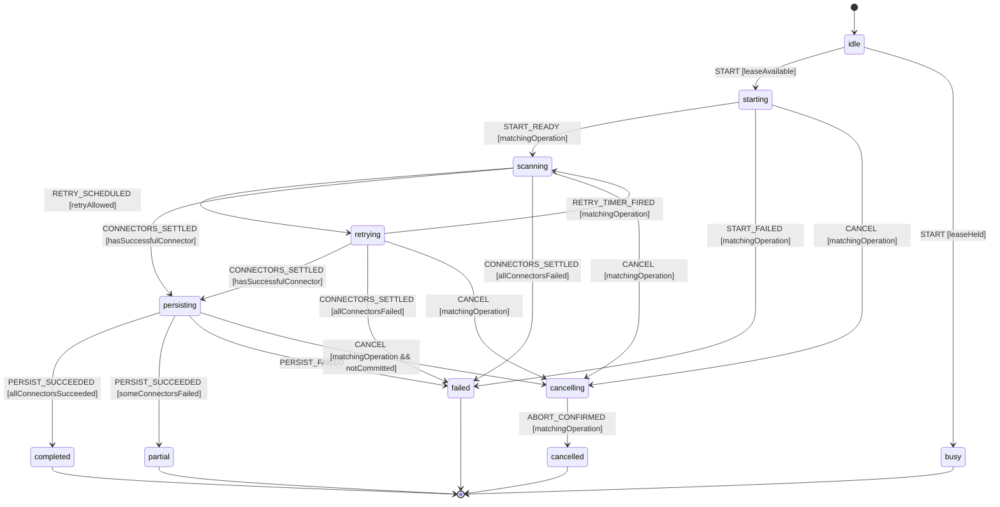

# Scan Lifecycle Workflow Model

Authoritative XState specification for a MissionPulse scan from request to
persisted result. `scan-lifecycle.machine.ts` must implement this document; the
service worker, scanner Shell, and Feed controller consume its snapshots.

## Scope and decisions

Each accepted scan owns an immutable `operationId`, one `AbortController`, and
one machine actor. The singleton service worker owns the active-operation
lease. A concurrent start is represented by a separate rejected request actor
whose terminal state is `busy`; it never replaces the active scan actor.

Connector fetches and retry delays are abortable. Scoring/deduplication is pure
Core work. Persisting and browser messaging are Shell effects. Once
cancellation wins event ordering, the operation can only settle as
`cancelled`; no mission, status, notification, arrival item, or completion
message from that operation may be committed.

## Exact state vocabulary

```ts
type ScanLifecycleState =
  | 'idle'
  | 'starting'
  | 'scanning'
  | 'retrying'
  | 'cancelling'
  | 'cancelled'
  | 'persisting'
  | 'completed'
  | 'partial'
  | 'failed'
  | 'busy';
```

No implementation alias or UI-only state may replace these values.

## Context

```ts
interface ScanLifecycleContext {
  operationId: string | null;
  trigger: 'manual' | 'alarm' | 'first_scan' | null;
  startedAt: number | null;
  connectorIds: readonly string[];
  pendingConnectorIds: readonly string[];
  connectorResults: Readonly<Record<string, 'pending' | 'running' | 'succeeded' | 'failed'>>;
  retryCountByConnector: Readonly<Record<string, number>>;
  maxRetries: number;
  missions: readonly Mission[];
  errors: readonly ConnectorScanError[];
  persistenceStarted: boolean;
  persistenceCommitted: boolean;
  cancellationRequested: boolean;
  activeLeaseOperationId: string | null;
  error: ScanLifecycleError | null;
}
```

`now`, operation IDs, retry delays, connector results, and connectivity are
Shell inputs. Core guards never call time, randomness, network, or storage.

## Events and emitted bridge messages

```ts
type ScanLifecycleEvent =
  | { type: 'START'; operationId: string; trigger: 'manual' | 'alarm' | 'first_scan' }
  | { type: 'START_READY'; operationId: string; connectorIds: readonly string[] }
  | { type: 'START_FAILED'; operationId: string; error: ScanLifecycleError }
  | { type: 'CONNECTOR_STARTED'; operationId: string; connectorId: string }
  | {
      type: 'CONNECTOR_SUCCEEDED';
      operationId: string;
      connectorId: string;
      missions: readonly Mission[];
    }
  | {
      type: 'CONNECTOR_FAILED';
      operationId: string;
      connectorId: string;
      error: ConnectorScanError;
      retryable: boolean;
    }
  | { type: 'RETRY_SCHEDULED'; operationId: string; connectorId: string }
  | { type: 'RETRY_TIMER_FIRED'; operationId: string; connectorId: string }
  | { type: 'CONNECTORS_SETTLED'; operationId: string }
  | { type: 'PERSIST_SUCCEEDED'; operationId: string }
  | { type: 'PERSIST_FAILED'; operationId: string; error: ScanLifecycleError }
  | { type: 'CANCEL'; operationId: string }
  | { type: 'ABORT_CONFIRMED'; operationId: string }
  | { type: 'NETWORK_OFFLINE'; operationId: string }
  | { type: 'SERVICE_WORKER_RESTARTED'; checkpoint: ScanCheckpoint | null }
  | { type: 'RESET' };
```

The Shell projects snapshots as typed bridge messages carrying the same
`operationId`: `SCAN_STATUS`, `SCAN_PARTIAL_RESULT`, `SCAN_COMPLETE`,
`SCAN_FAILED`, `SCAN_BUSY`, and `SCAN_CANCELLED`. The UI accepts only the ID it
currently owns.

The scanner contract consumed by the Shell is
`runScan(..., signal?: AbortSignal): Promise<ScanResult>`. When aborted it
rejects with a typed cancelled result; it never returns a successful empty
result and never performs persistence itself after cancellation.

## Statechart



## Guards

| Guard                    | Rule                                                                                                                       |
| ------------------------ | -------------------------------------------------------------------------------------------------------------------------- |
| `leaseAvailable`         | No live active-operation lease exists when `START` is reduced.                                                             |
| `leaseHeld`              | Another operation ID owns the live lease.                                                                                  |
| `matchingOperation`      | Event operation ID equals the actor context operation ID.                                                                  |
| `retryAllowed`           | Failure is typed retryable, connector retry count is below `maxRetries`, network permits retry, and cancellation is false. |
| `hasSuccessfulConnector` | At least one connector settled successfully, including a valid zero-mission result.                                        |
| `allConnectorsFailed`    | Every configured connector has a typed failure; an unknown connector also counts as failure.                               |
| `allConnectorsSucceeded` | Every configured connector settled successfully and persistence committed.                                                 |
| `someConnectorsFailed`   | At least one connector succeeded and at least one failed after retry exhaustion.                                           |
| `notCommitted`           | Persistence transaction has not emitted its commit acknowledgement.                                                        |

A successful connector returning zero missions is not a failure. Parser-health
rules may later classify that result, but they cannot rewrite this transition.

## Transition table

| From              | Event               | Guard                      | To                    | Effects                                                                     |
| ----------------- | ------------------- | -------------------------- | --------------------- | --------------------------------------------------------------------------- |
| `idle`            | `START`             | `leaseAvailable`           | `starting`            | Acquire lease, create controller, checkpoint, load config/profile.          |
| `idle`            | `START`             | `leaseHeld`                | `busy`                | Emit `SCAN_BUSY`; do not touch active actor or return an empty success.     |
| `starting`        | `START_READY`       | matching                   | `scanning`            | Start included/enabled connectors with shared abort signal.                 |
| `starting`        | `START_FAILED`      | matching                   | `failed`              | Release lease, persist terminal error, emit `SCAN_FAILED`.                  |
| `starting`        | `CANCEL`            | matching                   | `cancelling`          | Abort setup and invalidate all downstream effect tokens.                    |
| `scanning`        | connector success   | matching                   | `scanning`            | Record result, emit progress/partial result only for current ID.            |
| `scanning`        | retryable failure   | `retryAllowed`             | `retrying`            | Record error attempt and schedule abortable backoff.                        |
| `retrying`        | timer fired         | matching                   | `scanning`            | Start only the failed connector's next attempt.                             |
| scanning/retrying | settled             | success exists             | `persisting`          | Purely score/deduplicate, then begin one abortable persistence transaction. |
| scanning/retrying | settled             | all failed                 | `failed`              | Release lease; retain typed connector errors; do not persist success.       |
| `persisting`      | `PERSIST_SUCCEEDED` | matching, event wins first | `completed`/`partial` | Mark commit, release lease, then emit terminal completion.                  |
| active            | `CANCEL`            | matching                   | `cancelling`          | Abort fetch/backoff/transaction; clear pending Feed arrival state.          |
| `cancelling`      | `ABORT_CONFIRMED`   | matching                   | `cancelled`           | Release lease/checkpoint and emit exactly one `SCAN_CANCELLED`.             |
| `persisting`      | `PERSIST_FAILED`    | matching                   | `failed`              | Abort/rollback transaction, release lease, emit typed error.                |

The service-worker event mailbox determines the race between `CANCEL` and
`PERSIST_SUCCEEDED`. Whichever matching event is reduced first wins. If cancel
wins, the transaction must abort and later commit/completion events are stale;
if commit wins, the operation is already terminal and later cancel is rejected.

## Side effects and ownership

- **Core:** XState guards/actions that update immutable context; scoring,
  ranking, validation, and deduplication. No I/O, promises, browser globals, or
  generated timestamps.
- **Scanner Shell:** connector I/O, abortable retry delay, injected clock, and
  typed error conversion. It never persists independently of `persisting`.
- **Service worker Shell:** actor/lease/controller ownership, checkpoints,
  persistence transaction, alarms, notifications, and bridge messages.
- **Feed controller:** owns the current UI operation ID, projects state, clears
  cold Feed to `empty` after cancellation, and ignores stale messages.

Semantic scoring may enrich a mission as a non-blocking signal. Its output can
affect a deterministic score but cannot choose lifecycle state or terminal
classification.

## Persistence boundary

- A minimal `ScanCheckpoint` (`operationId`, lifecycle state, trigger,
  connector outcomes, cancellation flag) is written to
  `chrome.storage.session` at state boundaries so a service-worker wake-up can
  classify the interrupted operation.
- Missions, duplicate relations, connector statuses, badge inputs, and seen/
  notification facts commit only inside the `persisting` transaction boundary.
- Ephemeral controller, promises, backoff timers, and partial uncommitted
  missions are never treated as durable.
- The terminal checkpoint is cleared only after terminal messaging/lease
  release; retrying terminal messaging is idempotent by operation ID.

## Permissions and offline behavior

Startup validates each selected connector's build inclusion and host
permission. Permission/session failures become connector failures and do not
stop other connectors. A globally unavailable required browser capability can
fail `starting`.

Offline at startup produces `failed` without launching connectors. Offline
during a connector attempt follows its retry policy; after retry exhaustion,
the scan becomes `partial` when another connector succeeded or `failed` when
all failed. Network recovery never auto-starts a new completed operation.

## Retry, cancellation, concurrency, and restart

- Retry count is per connector, capped, and cleared only by a new operation.
- Backoff and fetch consume the same `AbortSignal`; cancellation never waits
  for an unabortable sleep.
- One active lease means one scan. A concurrent request settles as `busy` and
  observes the active operation; it does not alter it.
- On service-worker recovery, a checkpoint in `starting`, `scanning`,
  `retrying`, or `persisting` settles the old ID as `failed` with
  `worker_restarted`; effects are never resumed from partial memory. A
  checkpoint in `cancelling` settles as `cancelled`. Terminal checkpoints are
  replayed idempotently, then cleared.
- A browser restart with no session checkpoint starts at `idle`; durable
  mission data remains the last committed snapshot.

## Terminal states and re-entry

`completed`, `partial`, `failed`, `cancelled`, and `busy` are terminal for
their actor and operation ID. `busy` belongs only to the rejected start actor.
`RESET` may dispose a terminal actor for testing/UI acknowledgement, but a new
scan always creates a new actor and ID from `idle`; no terminal actor re-enters
`starting`.

## Forbidden transitions

- Active scan actor to `busy` because of another request; only the rejected
  request actor may become `busy`.
- `cancelling` or `cancelled` to `persisting`, `completed`, or `partial`.
- `completed`, `partial`, `failed`, `cancelled`, or `busy` back into an active
  state for the same operation ID.
- Persistence or completion when every connector failed.
- Empty mission array used as a proxy for mutex/busy success.
- Retry beyond budget, after cancellation, or after a non-retryable error.
- Processing any connector, persistence, or UI message for a stale operation.
- Any implicit transition from error copy, progress text, toast, or AI output.

## Invariants

1. The exact state set is the union declared above; aliases are forbidden.
2. At most one live operation owns the service-worker lease/controller.
3. Every event, bridge message, checkpoint, and persistence effect is scoped by
   `operationId`.
4. Cancellation is terminal and invalidates every late result.
5. `completed`/`partial` require confirmed persistence; UI never leads storage.
6. A partial scan requires at least one successful and one failed connector.
7. Zero missions from a valid connector is successful, not `busy` or `failed`.
8. An LLM never decides a transition; deterministic guards classify signals.
9. Core remains pure and Shell owns every side effect.

## Review checklist

- [x] Nominal scan, zero-result success, partial result, all-failed result, and persistence failure are explicit.
- [x] Permission/session refusal and offline exhaustion are connector/global failures as appropriate.
- [x] Retry budget, abortable delay, cancellation at every active state, and late result rejection are explicit.
- [x] Concurrent start returns `busy` without disturbing the active scan.
- [x] Service-worker/browser restart behavior and checkpoint ownership are defined.
- [x] Every terminal state rejects same-operation re-entry.
