# Scan Lifecycle Workflow Model

Authoritative XState specification for a MissionPulse scan from request to
persisted result. `scan-lifecycle.machine.ts` must implement this document; the
service worker, scanner Shell, and Feed controller consume its snapshots.

## Scope and decisions

Each accepted scan owns an immutable `operationId`, one `AbortController`, and
one machine actor. The singleton service worker owns the active-operation
lease. A concurrent start is represented by a separate rejected request actor
whose terminal state is `busy`; it never replaces the active scan actor.

Connector fetches and retry delays are abortable. Scoring/deduplication is pure
Core work. Persisting and browser messaging are Shell effects. Once
cancellation wins event ordering, the operation can only settle as
`cancelled`; no mission, status, notification, arrival item, or completion
message from that operation may be committed.

## Exact state vocabulary

```ts
type ScanLifecycleState =
  | 'idle'
  | 'starting'
  | 'scanning'
  | 'retrying'
  | 'cancelling'
  | 'cancelled'
  | 'persisting'
  | 'completed'
  | 'partial'
  | 'failed'
  | 'busy';
```

No implementation alias or UI-only state may replace these values.

## Context

```ts
interface ScanLifecycleContext {
  operationId: string | null;
  trigger: 'manual' | 'alarm' | 'first_scan' | null;
  startedAt: number | null;
  connectorIds: readonly string[];
  pendingConnectorIds: readonly string[];
  retryPendingConnectorIds: readonly string[];
  connectorResults: Readonly<Record<string, 'pending' | 'running' | 'succeeded' | 'failed'>>;
  retryCountByConnector: Readonly<Record<string, number>>;
  maxRetries: number;
  missions: readonly Mission[];
  errors: readonly ConnectorScanError[];
  persistenceStarted: boolean;
  persistenceCommitted: boolean;
  cancellationRequested: boolean;
  networkOnline: boolean;
  activeLeaseOperationId: string | null;
  error: ScanLifecycleError | null;
}
```

`now`, operation IDs, retry delays, connector results, and connectivity are
Shell inputs. Core guards never call time, randomness, network, or storage.

## Events and emitted bridge messages

```ts
type ScanLifecycleEvent =
  | { type: 'START'; operationId: string; trigger: 'manual' | 'alarm' | 'first_scan' }
  | { type: 'START_READY'; operationId: string; connectorIds: readonly string[] }
  | { type: 'START_FAILED'; operationId: string; error: ScanLifecycleError }
  | { type: 'CONNECTOR_STARTED'; operationId: string; connectorId: string }
  | {
      type: 'CONNECTOR_SUCCEEDED';
      operationId: string;
      connectorId: string;
      missions: readonly Mission[];
    }
  | {
      type: 'CONNECTOR_FAILED';
      operationId: string;
      connectorId: string;
      error: ConnectorScanError;
      retryable: boolean;
    }
  | { type: 'RETRY_SCHEDULED'; operationId: string; connectorId: string }
  | { type: 'RETRY_TIMER_FIRED'; operationId: string; connectorId: string }
  | { type: 'CONNECTORS_SETTLED'; operationId: string }
  | { type: 'PERSIST_SUCCEEDED'; operationId: string }
  | { type: 'PERSIST_FAILED'; operationId: string; error: ScanLifecycleError }
  | { type: 'RUNTIME_FAILED'; operationId: string; error: ScanLifecycleError }
  | { type: 'CANCEL'; operationId: string }
  | { type: 'ABORT_CONFIRMED'; operationId: string }
  | { type: 'NETWORK_OFFLINE'; operationId: string }
  | { type: 'NETWORK_ONLINE'; operationId: string }
  | { type: 'SERVICE_WORKER_RESTARTED'; checkpoint: ScanCheckpoint | null }
  | { type: 'RESET' };
```

The Shell projects snapshots as typed bridge messages carrying the same
`operationId`. An accepted command receives exactly one non-terminal
acknowledgement: `SCAN_STARTED` for `SCAN_START`, and `SCAN_CANCEL_REQUESTED`
after `CANCEL` has been reduced and abort requested. `SCAN_PROGRESS` and
`SCAN_PARTIAL_RESULT` are non-terminal broadcasts. `SCAN_COMPLETE`,
`SCAN_ERROR`, and `SCAN_CANCELLED` use one canonical terminal broadcast channel
and are never also returned as command responses. `SCAN_BUSY` is the immediate
terminal response of the separate rejected-start actor. The UI accepts scan
lifecycle messages only for the ID it currently owns.

After an `alarm` operation commits, the Shell also broadcasts the existing
durable `MISSIONS_UPDATED` projection so an open Feed adopts the committed
missions without claiming the alarm operation as its manual lifecycle. This
projection is emitted after the canonical commit even when a secondary
post-commit effect later fails.

The scanner contract consumed by the Shell is
`runScan(..., signal?: AbortSignal): Promise<ScanResult>`. When aborted it
rejects with a typed cancelled result; it never returns a successful empty
result and never performs persistence itself after cancellation.

## Statechart

```mermaid
stateDiagram-v2
  [*] --> idle
  idle --> starting: START [leaseAvailable]
  idle --> busy: START [leaseHeld]
  idle --> idle: SERVICE_WORKER_RESTARTED [noCheckpoint]
  idle --> failed: SERVICE_WORKER_RESTARTED [recoverableCheckpoint]
  idle --> cancelled: SERVICE_WORKER_RESTARTED [cancellingCheckpoint]
  idle --> completed: SERVICE_WORKER_RESTARTED [completedCheckpoint]
  idle --> partial: SERVICE_WORKER_RESTARTED [partialCheckpoint]
  idle --> failed: SERVICE_WORKER_RESTARTED [failedCheckpoint]
  idle --> cancelled: SERVICE_WORKER_RESTARTED [cancelledCheckpoint]
  starting --> scanning: START_READY [matchingOperation]
  starting --> failed: START_FAILED [matchingOperation]
  starting --> failed: NETWORK_OFFLINE [matchingOperation]
  starting --> failed: RUNTIME_FAILED [matchingOperation]
  starting --> cancelling: CANCEL [matchingOperation]
  scanning --> scanning: CONNECTOR_STARTED [matchingOperation && connectorUnsettled]
  retrying --> retrying: CONNECTOR_STARTED [matchingOperation && connectorUnsettled]
  scanning --> scanning: CONNECTOR_SUCCEEDED [matchingOperation && connectorUnsettled]
  retrying --> retrying: CONNECTOR_SUCCEEDED [matchingOperation && connectorUnsettled]
  scanning --> scanning: CONNECTOR_FAILED [retryAllowed] / raiseRetryScheduled
  retrying --> retrying: CONNECTOR_FAILED [retryAllowed] / raiseRetryScheduled
  scanning --> scanning: CONNECTOR_FAILED [terminalConnectorFailure] / settleConnectorFailure
  retrying --> retrying: CONNECTOR_FAILED [terminalConnectorFailure] / settleConnectorFailure
  scanning --> retrying: RETRY_SCHEDULED [retryScheduledForPendingFailure]
  retrying --> retrying: RETRY_SCHEDULED [retryScheduledForPendingFailure]
  retrying --> retrying: RETRY_TIMER_FIRED [otherRetriesPending]
  retrying --> scanning: RETRY_TIMER_FIRED [lastRetryPending]
  scanning --> scanning: NETWORK_OFFLINE [matchingOperation] / settleUnfinishedOffline
  retrying --> retrying: NETWORK_OFFLINE [matchingOperation] / settleUnfinishedOffline
  scanning --> scanning: NETWORK_ONLINE [matchingOperation]
  retrying --> retrying: NETWORK_ONLINE [matchingOperation]
  scanning --> failed: RUNTIME_FAILED [matchingOperation]
  retrying --> failed: RUNTIME_FAILED [matchingOperation]
  scanning --> persisting: CONNECTORS_SETTLED [allConnectorsSettled && hasSuccessfulConnector]
  retrying --> persisting: CONNECTORS_SETTLED [allConnectorsSettled && hasSuccessfulConnector]
  scanning --> failed: CONNECTORS_SETTLED [allConnectorsSettled && allConnectorsFailed]
  retrying --> failed: CONNECTORS_SETTLED [allConnectorsSettled && allConnectorsFailed]
  persisting --> completed: PERSIST_SUCCEEDED [allConnectorsSucceeded]
  persisting --> partial: PERSIST_SUCCEEDED [matchingOperation && someConnectorsFailed]
  persisting --> failed: PERSIST_FAILED [matchingOperation]
  scanning --> cancelling: CANCEL [matchingOperation]
  retrying --> cancelling: CANCEL [matchingOperation]
  persisting --> cancelling: CANCEL [matchingOperation && notCommitted]
  cancelling --> cancelled: ABORT_CONFIRMED [matchingOperation]
  completed --> [*]
  partial --> [*]
  failed --> [*]
  cancelled --> [*]
  busy --> [*]
```



## Guards

| Guard                             | Rule                                                                                                                                                          |
| --------------------------------- | ------------------------------------------------------------------------------------------------------------------------------------------------------------- |
| `leaseAvailable`                  | No live active-operation lease exists when `START` is reduced.                                                                                                |
| `leaseHeld`                       | Another operation ID owns the live lease.                                                                                                                     |
| `matchingOperation`               | Event operation ID equals the actor context operation ID.                                                                                                     |
| `connectorUnsettled`              | Named configured connector is currently `pending` or `running`; duplicate terminal results are stale.                                                         |
| `retryAllowed`                    | Operation/connector match, connector is unsettled, failure is retryable, retry count is below `maxRetries`, network permits retry, and cancellation is false. |
| `terminalConnectorFailure`        | Operation/connector match and unsettled, and failure is non-retryable, exhausted `maxRetries`, or retry became impossible; it must settle as `failed`.        |
| `retryScheduledForPendingFailure` | Matching internal event names a non-terminal connector whose recorded retryable failure still has budget while online.                                        |
| `otherRetriesPending`             | Matching event names a queued connector and, after consuming its timer, another connector remains in `retryPendingConnectorIds`.                              |
| `lastRetryPending`                | Matching event names the final queued connector and no other retry timer remains after consumption.                                                           |
| `hasSuccessfulConnector`          | At least one connector settled successfully, including a valid zero-mission result.                                                                           |
| `allConnectorsFailed`             | Every configured connector has a typed failure; an unknown connector also counts as failure.                                                                  |
| `allConnectorsSettled`            | Every configured connector is exactly `succeeded` or `failed`; no pending/running/retry entry remains.                                                        |
| `allConnectorsSucceeded`          | Matching persistence acknowledgement arrived and every configured connector had settled successfully.                                                         |
| `someConnectorsFailed`            | Matching persistence acknowledgement arrived, with at least one connector succeeded and at least one failed after retry exhaustion.                           |
| `notCommitted`                    | Persistence transaction has not emitted its commit acknowledgement.                                                                                           |
| `noCheckpoint`                    | Recovery input has no session checkpoint.                                                                                                                     |
| `recoverableCheckpoint`           | Checkpoint state is `starting`, `scanning`, `retrying`, or `persisting`.                                                                                      |
| `cancellingCheckpoint`            | Checkpoint state is `cancelling`.                                                                                                                             |
| `completedCheckpoint`             | Checkpoint is terminal `completed`; analogous exact guards exist for `partial`, `failed`, and `cancelled`.                                                    |

A successful connector returning zero missions is not a failure. Parser-health
rules may later classify that result, but they cannot rewrite this transition.

## Transition table

| From               | Event                      | Guard                       | To                | Effects                                                                                                                                                |
| ------------------ | -------------------------- | --------------------------- | ----------------- | ------------------------------------------------------------------------------------------------------------------------------------------------------ |
| `idle`             | `START`                    | `leaseAvailable`            | `starting`        | Acquire lease, create controller, checkpoint, return `SCAN_STARTED`, then load config/profile.                                                         |
| `idle`             | `START`                    | `leaseHeld`                 | `busy`            | Emit `SCAN_BUSY`; do not touch active actor or return an empty success.                                                                                |
| `starting`         | `START_READY`              | matching                    | `scanning`        | Start included/enabled connectors with shared abort signal.                                                                                            |
| `starting`         | `START_FAILED`             | matching                    | `failed`          | Release lease, persist terminal error, emit `SCAN_ERROR`.                                                                                              |
| `starting`         | `NETWORK_OFFLINE`          | matching                    | `failed`          | Release lease and emit typed global `OFFLINE` failure before any connector.                                                                            |
| `starting`         | `RUNTIME_FAILED`           | matching                    | `failed`          | Record a typed runtime failure, release the lease, and emit one terminal error after quiescence.                                                       |
| `starting`         | `CANCEL`                   | matching                    | `cancelling`      | Request abort and return `SCAN_CANCEL_REQUESTED`; do not confirm cancellation yet.                                                                     |
| scanning/retrying  | `CONNECTOR_STARTED`        | matching                    | same              | Mark this pending connector `running`; reject duplicate/stale start.                                                                                   |
| scanning/retrying  | `CONNECTOR_SUCCEEDED`      | matching                    | same              | Consume the live result, mark `succeeded`, remove pending/retry entries, and internally raise `CONNECTORS_SETTLED`; guards reject it until all settle. |
| scanning/retrying  | `CONNECTOR_FAILED`         | `retryAllowed`              | same              | Consume the live failed attempt, increment its count, and internally raise one `RETRY_SCHEDULED` before Shell backoff.                                 |
| scanning/retrying  | `CONNECTOR_FAILED`         | terminal failure            | same              | Consume the live terminal failure, mark `failed`, remove pending/retry entries, and internally raise `CONNECTORS_SETTLED`.                             |
| `scanning`         | `RETRY_SCHEDULED`          | pending failure             | `retrying`        | Add connector once to retry queue and start one abortable backoff.                                                                                     |
| `retrying`         | `RETRY_SCHEDULED`          | pending failure             | `retrying`        | Add another connector once; preserve all existing backoffs.                                                                                            |
| `retrying`         | `RETRY_TIMER_FIRED`        | other retries remain        | `retrying`        | Remove this timer and start only that connector's next attempt.                                                                                        |
| `retrying`         | `RETRY_TIMER_FIRED`        | last retry                  | `scanning`        | Remove final timer and start only that connector's next attempt.                                                                                       |
| scanning/retrying  | `NETWORK_OFFLINE`          | matching                    | same              | Consume the live network signal, mark offline, settle every unfinished connector as typed `OFFLINE`, and internally raise `CONNECTORS_SETTLED`.        |
| scanning/retrying  | `NETWORK_ONLINE`           | matching                    | same              | Update connectivity only; never resurrect a connector or auto-start a scan.                                                                            |
| scanning/retrying  | `RUNTIME_FAILED`           | matching                    | `failed`          | Record a typed unexpected/offline runtime failure, release the lease, emit one terminal error after quiescence, and stop the actor.                    |
| scanning/retrying  | `CONNECTORS_SETTLED`       | all settled, success exists | `persisting`      | Purely score/deduplicate, then begin one abortable persistence transaction.                                                                            |
| scanning/retrying  | `CONNECTORS_SETTLED`       | all settled, all failed     | `failed`          | Release lease; retain typed connector errors; do not persist success.                                                                                  |
| `persisting`       | `PERSIST_SUCCEEDED`        | matching, all succeeded     | `completed`       | Mark commit, release lease, then emit terminal completion.                                                                                             |
| `persisting`       | `PERSIST_SUCCEEDED`        | matching, some failed       | `partial`         | Mark commit, release lease, then emit terminal partial completion.                                                                                     |
| active             | `CANCEL`                   | matching                    | `cancelling`      | Request abort of fetch/backoff/transaction and return non-terminal `SCAN_CANCEL_REQUESTED`; preserve Feed state.                                       |
| `cancelling`       | `ABORT_CONFIRMED`          | matching                    | `cancelled`       | Only after scanner/transaction quiescence, release lease/checkpoint, emit exactly one `SCAN_CANCELLED`, and stop actor.                                |
| `persisting`       | `PERSIST_FAILED`           | matching                    | `failed`          | Abort/rollback transaction, release lease, emit typed error.                                                                                           |
| recovery `idle`    | `SERVICE_WORKER_RESTARTED` | no checkpoint               | `idle`            | Start no actor and retain last durable missions.                                                                                                       |
| recovery `idle`    | `SERVICE_WORKER_RESTARTED` | active checkpoint           | `failed`          | Rehydrate old ID, settle `worker_restarted`, release stale lease, emit once, then clear checkpoint.                                                    |
| recovery `idle`    | `SERVICE_WORKER_RESTARTED` | cancelling checkpoint       | `cancelled`       | Rehydrate old ID, emit cancellation once, release lease, then clear checkpoint.                                                                        |
| recovery `idle`    | `SERVICE_WORKER_RESTARTED` | terminal checkpoint         | matching terminal | Replay the matching terminal message idempotently, then clear checkpoint.                                                                              |
| any terminal actor | `RESET`                    | same operation settled      | actor disposed    | Dispose that actor for acknowledgement/testing; a later scan creates a new actor/ID from `idle`.                                                       |

The service-worker event mailbox determines the race between `CANCEL` and
`PERSIST_SUCCEEDED`. Whichever matching event is reduced first wins. If cancel
wins, the transaction must abort and later commit/completion events are stale;
if commit wins, the operation is already terminal and later cancel is rejected.

## Side effects and ownership

- **Core:** XState guards/actions that update immutable context; scoring,
  ranking, validation, and deduplication. No I/O, promises, browser globals, or
  generated timestamps.
- **Scanner Shell:** connector I/O, abortable retry delay, injected clock,
  typed error conversion, and live connector/retry/network events delivered to
  the active actor when they occur. It never persists independently of
  `persisting`, and its result is not replayed post-hoc to reconstruct state.
- **Service worker Shell:** actor/lease/controller ownership, checkpoints,
  persistence transaction, alarms, notifications, and bridge messages.
- **Feed controller:** owns the current UI operation ID, projects state, clears
  cold Feed to `empty` after cancellation, and ignores stale messages.

Semantic scoring may enrich a mission as a non-blocking signal. Its output can
affect a deterministic score but cannot choose lifecycle state or terminal
classification.

## Persistence boundary

- A minimal `ScanCheckpoint` (`operationId`, lifecycle state, trigger,
  connector outcomes, cancellation flag) is written to
  `chrome.storage.session` at state boundaries so a service-worker wake-up can
  classify the interrupted operation.
- The canonical mission write is one abortable IndexedDB transaction owned by
  the `persisting` operation. Its Promise resolves only from `tx.oncomplete`.
  A winning cancel calls `tx.abort()`, and `ABORT_CONFIRMED` is forbidden until
  `tx.onabort` (or an equivalent quiescent scanner rejection) proves rollback.
  If `tx.oncomplete` wins first, `PERSIST_SUCCEEDED` is reduced synchronously
  before another mailbox command can cancel that operation.
- TJM history, connector status, badge, seen/notification facts, and purge are
  post-commit projections. They run only after `PERSIST_SUCCEEDED`; a later
  cancel is stale and cannot suppress them. Their failure cannot rewrite the
  already committed terminal decision. Purge itself resolves only after its
  IndexedDB transaction `oncomplete`.
- Ephemeral controller, promises, backoff timers, and partial uncommitted
  missions are never treated as durable.
- The terminal checkpoint is cleared only after terminal messaging/lease
  release; retrying terminal messaging is idempotent by operation ID.

## Permissions and offline behavior

Startup validates each selected connector's build inclusion and host
permission. Permission/session failures become connector failures and do not
stop other connectors. A globally unavailable required browser capability can
fail `starting`.

Offline at startup produces `failed` without launching connectors. A global
offline event during scanning cancels all in-flight/backoff work and settles
each unfinished connector with typed `OFFLINE`; already successful connectors
remain successful. The resulting all-settled reduction becomes `partial` when
any connector succeeded or `failed` when all failed. A connector failure while
still online follows its explicit retry budget. Network recovery never
resurrects a settled connector or auto-starts a new operation.

## Retry, cancellation, concurrency, and restart

- Retry count is per connector, capped, and cleared only by a new operation.
- Non-retryable and exhausted failures settle immediately and can never emit a
  retry timer. Multiple connector timers remain independently represented by
  `retryPendingConnectorIds`.
- Backoff and fetch consume the same `AbortSignal`; cancellation never waits
  for an unabortable sleep. Retryable failures, retry scheduling, timer firing,
  connector settlement, and network failure are observed by the actor live,
  before the corresponding Shell step continues.
- One active lease means one scan. A concurrent request settles as `busy` and
  observes the active operation; it does not alter it.
- On service-worker recovery, a checkpoint in `starting`, `scanning`,
  `retrying`, or `persisting` settles the old ID as `failed` with
  `worker_restarted`; effects are never resumed from partial memory. A
  checkpoint in `cancelling` settles as `cancelled`. Terminal checkpoints are
  replayed idempotently, then cleared.
- A browser restart with no session checkpoint starts at `idle`; durable
  mission data remains the last committed snapshot.

## Terminal states and re-entry

`completed`, `partial`, `failed`, `cancelled`, and `busy` are terminal for
their actor and operation ID. `busy` belongs only to the rejected start actor.
`RESET` may dispose a terminal actor for testing/UI acknowledgement, but a new
scan always creates a new actor and ID from `idle`; no terminal actor re-enters
`starting`. The service worker stops every accepted actor after its canonical
terminal broadcast; every accepted terminal transition releases the modeled
lease.

## Forbidden transitions

- Active scan actor to `busy` because of another request; only the rejected
  request actor may become `busy`.
- `cancelling` or `cancelled` to `persisting`, `completed`, or `partial`.
- `completed`, `partial`, `failed`, `cancelled`, or `busy` back into an active
  state for the same operation ID.
- Persistence or completion when every connector failed.
- Empty mission array used as a proxy for mutex/busy success.
- Retry beyond budget, after cancellation, or after a non-retryable error.
- Processing any connector, persistence, or UI message for a stale operation.
- `CONNECTORS_SETTLED` while any connector is pending, running, or queued for
  retry.
- Any implicit transition from error copy, progress text, toast, or AI output.
- Returning `SCAN_COMPLETE`, `SCAN_ERROR`, or `SCAN_CANCELLED` as a
  `SCAN_START`/`SCAN_CANCEL` command response in addition to broadcasting it.
- Emitting `SCAN_CANCELLED` before scanner rejection or IndexedDB `onabort`
  proves all cancel-sensitive work is quiescent.

## Invariants

1. The exact state set is the union declared above; aliases are forbidden.
2. At most one live operation owns the service-worker lease/controller.
3. Every event, bridge message, checkpoint, and persistence effect is scoped by
   `operationId`.
4. Cancellation is terminal and invalidates every late result.
5. `completed`/`partial` require confirmed persistence; UI never leads storage.
6. A partial scan requires at least one successful and one failed connector.
7. Zero missions from a valid connector is successful, not `busy` or `failed`.
8. An LLM never decides a transition; deterministic guards classify signals.
9. Core remains pure and Shell owns every side effect.
10. Every declared lifecycle event has an explicit reduction above or is
    rejected as stale/invalid; result classification never depends on prose.
11. Every configured connector settles exactly once as `succeeded` or
    `failed` before persistence or terminal all-failed classification.
12. An accepted operation emits exactly one canonical terminal broadcast; its
    start/cancel command responses are non-terminal acknowledgements only.
13. `cancelled` is observable only after abort quiescence. If the mission
    transaction `oncomplete` wins first, commit is terminal and cancellation is
    stale.

## Review checklist

- [x] Nominal scan, zero-result success, partial result, all-failed result, and persistence failure are explicit.
- [x] Permission/session refusal and offline exhaustion are connector/global failures as appropriate.
- [x] Retry budget, abortable delay, cancellation at every active state, and late result rejection are explicit.
- [x] Concurrent start returns `busy` without disturbing the active scan.
- [x] Service-worker/browser restart behavior and checkpoint ownership are defined.
- [x] Non-retryable/exhausted failures, multi-connector retries, offline settlement, and every restart checkpoint are reducible.
- [x] Every terminal state rejects same-operation re-entry.
