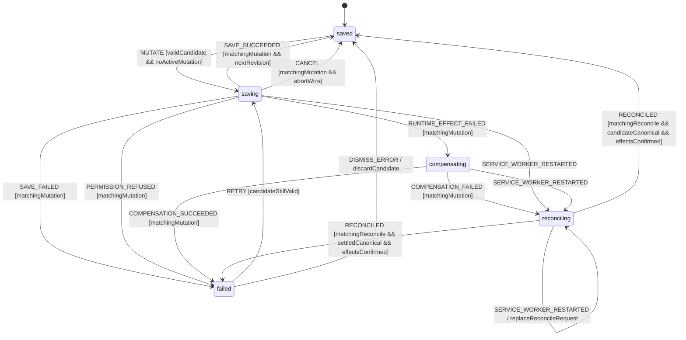

# Settings Persistence Workflow Model

Authoritative transactional model for every user-visible persistent setting,
including auto-scan, interval, notifications, theme, and enabled connectors.

## Scope and decisions

The UI may optimistically project a candidate while showing `saving`, but the
canonical setting and success copy change only after the service worker
confirms persistence and any required browser effect. Failure restores the
exact `previous` value only when the write never committed or compensation is
confirmed. An unknown/failed compensation stays visibly pending until a
canonical read proves the actual value and effects.

All mutations use one helper and one compare/write contract. This prevents
field-specific fire-and-forget behavior and whole-object lost updates.

## State vocabulary and context

```ts
type PersistentSettingKey =
  'autoScan' | 'scanIntervalMinutes' | 'notifications' | 'theme' | 'enabledConnectors';

type SaveStatus = 'saved' | 'saving' | 'failed';
type SettingsLoadStatus = 'loading' | 'ready' | 'error';
type SettingsTransactionState = 'saved' | 'saving' | 'compensating' | 'reconciling' | 'failed';

interface SettingMutation<T> {
  key: PersistentSettingKey;
  previous: T;
  candidate: T;
  status: SaveStatus;
  mutationId: string;
  baseRevision: number;
  error: SettingsPersistenceError | null;
}

interface SettingsPersistenceContext {
  loadStatus: SettingsLoadStatus;
  transactionState: SettingsTransactionState;
  confirmed: AppSettings;
  projected: AppSettings;
  revision: number;
  mutation: SettingMutation<unknown> | null;
  commitKnowledge: 'previous' | 'candidate' | 'unknown';
  reconcileRequestId: string | null;
  effectError: SettingsPersistenceError | null;
  loadError: SettingsPersistenceError | null;
  online: boolean;
}
```

When no mutation exists, every field is `saved` and
`projected === confirmed`. During `saving`, only the mutated projected field
may differ. During ordinary `failed`, projection has rolled back to `previous`;
after a reconciled conflict/failure, it instead equals the actual canonical
snapshot. In both cases `candidate` and error remain for Retry.

The page-facing `saveStatus` remains exactly `saved | saving | failed`:
`compensating` and `reconciling` project as `saving`, because neither may claim
a settled value. Otherwise it is derived from `mutation?.status ?? 'saved'`. A single typed
`mutateSetting(key, candidate): Promise<AppSettings>` helper drives every
field; it resolves only with the confirmed full settings snapshot and rejects
with `SettingsPersistenceError`.

## Events

```ts
type SettingsPersistenceEvent =
  | { type: 'LOAD'; requestId: string }
  | { type: 'LOAD_SUCCEEDED'; requestId: string; settings: AppSettings; revision: number }
  | { type: 'LOAD_FAILED'; requestId: string; error: SettingsPersistenceError }
  | { type: 'MUTATE'; key: PersistentSettingKey; candidate: unknown; mutationId: string }
  | { type: 'PERMISSION_GRANTED'; mutationId: string }
  | { type: 'PERMISSION_REFUSED'; mutationId: string }
  | { type: 'SAVE_SUCCEEDED'; mutationId: string; settings: AppSettings; revision: number }
  | { type: 'SAVE_FAILED'; mutationId: string; error: SettingsPersistenceError }
  | {
      type: 'RUNTIME_EFFECT_FAILED';
      mutationId: string;
      settings: AppSettings;
      revision: number;
      error: SettingsPersistenceError;
    }
  | {
      type: 'COMPENSATION_SUCCEEDED';
      mutationId: string;
      settings: AppSettings;
      revision: number;
      effectsConfirmed: true;
    }
  | { type: 'COMPENSATION_FAILED'; mutationId: string; error: SettingsPersistenceError }
  | { type: 'RETRY'; mutationId: string }
  | { type: 'CANCEL'; mutationId: string }
  | { type: 'DISMISS_ERROR'; mutationId: string }
  | { type: 'NETWORK_CHANGED'; online: boolean }
  | { type: 'SERVICE_WORKER_RESTARTED' }
  | {
      type: 'RECONCILED';
      requestId: string;
      settings: AppSettings;
      revision: number;
      effectsConfirmed: boolean;
    }
  | { type: 'RECONCILE_FAILED'; requestId: string; error: SettingsPersistenceError }
  | { type: 'RETRY_RECONCILIATION'; requestId: string };
```

## Statechart for one mutation



Load state (`loading | ready | error`) is orthogonal. Mutation events are
accepted only while load status is `ready`. `compensating` and `reconciling`
are internal transaction states, not additions to the exact `SaveStatus`
projection.

## Guards

| Guard                 | Rule                                                                                                                  |
| --------------------- | --------------------------------------------------------------------------------------------------------------------- |
| `validCandidate`      | Pure schema validates key/value and cross-field invariants.                                                           |
| `noActiveMutation`    | Transaction state is `saved` or settled `failed`; `saving`/`compensating`/`reconciling` return typed `SETTINGS_BUSY`. |
| `matchingMutation`    | Event mutation ID equals active mutation ID.                                                                          |
| `nextRevision`        | Response revision is exactly the committed successor of `baseRevision`.                                               |
| `candidateStillValid` | Candidate validates against the latest confirmed settings/catalogue.                                                  |
| `permissionSatisfied` | Required optional Chrome permission is granted before persistence.                                                    |
| `abortWins`           | Cancel event is reduced before the storage/effect commit acknowledgement.                                             |
| `matchingReconcile`   | Event request ID equals `reconcileRequestId`; earlier reads are discarded.                                            |
| `candidateCanonical`  | Canonical reread equals the validated candidate at its confirmed revision.                                            |
| `settledCanonical`    | Canonical reread is schema-valid but differs from the candidate (including previous or a newer concurrent value).     |
| `effectsConfirmed`    | Required alarms/theme/notification effects match the reread canonical settings.                                       |
| `effectsUnconfirmed`  | Canonical storage is known but at least one required browser effect is not yet aligned.                               |

Cross-field invariants include a valid scan interval, notification threshold,
and `enabledConnectors` limited to build-included connector IDs. A connector
enable mutation requests only that connector's declared host patterns.

## Transition table

| From                | Event                      | Guard                    | To             | Effects                                                                                                           |
| ------------------- | -------------------------- | ------------------------ | -------------- | ----------------------------------------------------------------------------------------------------------------- |
| load `loading`      | `LOAD_SUCCEEDED`           | matching request         | `ready`        | Validate, set confirmed/projected/revision, clear errors.                                                         |
| load `loading`      | `LOAD_FAILED`              | matching request         | `error`        | Keep safe previous/default projection and expose Retry.                                                           |
| `saved`             | `MUTATE`                   | valid, no active write   | `saving`       | Snapshot `previous`, project candidate, request permission if needed, then compare/write via facade.              |
| `saving`            | `PERMISSION_GRANTED`       | matching                 | `saving`       | Continue persistence; do not show success.                                                                        |
| `saving`            | `PERMISSION_REFUSED`       | matching                 | `failed`       | Roll back projected field to `previous`; keep candidate/error.                                                    |
| `saving`            | `SAVE_SUCCEEDED`           | matching, next revision  | `saved`        | Replace full confirmed/projected snapshot; clear mutation; show success.                                          |
| `saving`            | `SAVE_FAILED`              | matching                 | `failed`       | Roll back to `previous`; retain candidate and typed error.                                                        |
| `saving`            | `RUNTIME_EFFECT_FAILED`    | matching                 | `compensating` | Record that candidate storage committed, keep UI `saving`, and restore previous storage/effects.                  |
| `compensating`      | `COMPENSATION_SUCCEEDED`   | matching                 | `failed`       | Accept returned previous canonical snapshot/revision, align projection/effects, retain candidate/error for Retry. |
| `compensating`      | `COMPENSATION_FAILED`      | matching                 | `reconciling`  | Set commit knowledge unknown; do not project a guessed previous value; start canonical read.                      |
| saving/compensating | `SERVICE_WORKER_RESTARTED` | —                        | `reconciling`  | Treat write/effect outcome as unknown and start a fresh canonical read; emit no success.                          |
| `reconciling`       | `SERVICE_WORKER_RESTARTED` | —                        | `reconciling`  | Invalidate old read ID and start a fresh canonical/effect reconciliation request.                                 |
| `reconciling`       | `RECONCILED`               | candidate + effects      | `saved`        | Publish candidate only after canonical storage and required effects are both confirmed.                           |
| `reconciling`       | `RECONCILED`               | other snapshot + effects | `failed`       | Replace confirmed/projected with the actual canonical snapshot; retain attempted candidate/error.                 |
| `reconciling`       | `RECONCILED`               | effects unconfirmed      | `reconciling`  | Project no settled result; reconcile effects to the canonical snapshot and reread with a new ID.                  |
| `reconciling`       | `RECONCILE_FAILED`         | matching                 | `reconciling`  | Keep visible pending/unknown error; do not enable mutation Retry or Dismiss.                                      |
| `reconciling`       | `RETRY_RECONCILIATION`     | fresh request            | `reconciling`  | Repeat only canonical/effect reconciliation; never replay the candidate write.                                    |
| `failed`            | `RETRY`                    | candidate valid          | `saving`       | Rebase on latest revision, reapply candidate, retry required phases.                                              |
| `failed`            | `DISMISS_ERROR`            | matching                 | `saved`        | Discard candidate/error; retain confirmed settings.                                                               |
| `saving`            | `CANCEL`                   | abort wins               | `saved`        | Abort worker operation and roll back projection; ignore late response.                                            |
| any                 | `NETWORK_CHANGED`          | —                        | same           | Update availability; local persistence remains usable.                                                            |

If a compare/write reports a revision conflict, it is `SAVE_FAILED` with
`SETTINGS_CONFLICT`. Retry first reloads/rebases; it never overwrites newer
settings blindly.

## Side effects and ownership

- **Core:** candidate validation, build-catalogue filtering, immutable patch,
  revision comparison, and rollback derivation.
- **Side-panel state/UI:** holds projected value and mutation status, renders
  saving/failure/retry, and applies/rolls back theme presentation.
- **Service worker Shell:** owns `chrome.storage.local`, optional permission
  requests, and settings-derived alarms/notifications. It returns success only
  after required effects are confirmed.
- **Facades/bridge:** transport the full typed result/error. No UI component
  accesses Chrome storage, permissions, cookies, or alarms directly.

For `autoScan`/`scanIntervalMinutes`, the worker persists the new settings and
reconciles only MissionPulse-owned alarm names. If alarm reconciliation fails,
it enters `compensating` and restores both previous storage and effects before
returning settled failure. If compensation itself fails or its acknowledgement
is lost, it enters `reconciling`; neither the UI nor worker may claim
`previous` until a canonical read and effect check prove the actual state. For
theme, the same protocol covers canonical storage and projected DOM theme.

## Persistence boundary

The validated `AppSettings` object and monotonically increasing revision are
written atomically under the settings key in `chrome.storage.local`. Browser
permissions remain Chrome-owned. Alarm state is derived from the confirmed
settings and reconciled idempotently; it is not a second settings database.

`previous`, candidate, mutation ID, error, transaction/reconciliation state,
and saving projection are ephemeral.
After panel reload or service-worker restart, a facade read restores the
canonical persisted object. Defaults are used only when no valid record exists,
never to hide a failed write.

## Permissions and offline behavior

Most settings require no optional permission. Enabling a connector or feature
that does require one must obtain it from a direct user gesture before writing
the enabled value. Refusal becomes visible `failed` and restores `previous`.

Local settings remain writable offline. A network-dependent connector/session
check may separately show offline/failed status, but cannot turn a confirmed
local settings write into fabricated runtime readiness. Auto-scan may be
configured offline and will execute only when its modeled scan preconditions
later pass.

## Retry, cancellation, concurrency, and restart

- Retry retains the failed candidate but rebases it onto freshly confirmed
  settings and repeats permission/effect checks as needed.
- While reconciling, normal Retry, Dismiss, Cancel, and new mutations are
  rejected with `SETTINGS_BUSY`; only `RETRY_RECONCILIATION` may repeat the
  canonical/effect read.
- Cancel before commit restores `previous`; after commit acknowledgement it is
  rejected and a new mutation is required to change the value back.
- All settings writes are globally serialized because they replace one object.
  Concurrent `MUTATE` returns `SETTINGS_BUSY`; it is not silently dropped.
- Stale success/failure IDs and non-successor revisions are ignored and trigger
  reconciliation.
- On service-worker restart, a saving/compensating mutation enters
  `reconciling` until canonical storage and browser effects are confirmed. No
  success/failure projection or toast is emitted from a guessed outcome.

## Terminal states and re-entry

`saved` is the stable successful state; `failed` is terminal for that attempt
until Retry, Dismiss, or a new mutation. Cancel is terminal for its mutation ID
and returns the field to stable `saved(previous)` only when abort wins before
commit. `compensating`/`reconciling` are pending and cannot be treated as
terminal. A new mutation always gets a new ID/revision base.

## Forbidden transitions

- `saving` to `saved` without confirmed storage and required browser effects.
- Persistence of invalid settings or a connector excluded from the build.
- UI success toast while projection differs from confirmed storage.
- Swallowing a facade/storage/permission error or leaving the optimistic value.
- Concurrent whole-object writes without revision/serialization guards.
- Applying a stale mutation response or revision.
- Projecting `previous`, `candidate`, `saved`, or `failed` after a compensation
  failure before canonical storage and browser effects are reconciled.
- Starting/retrying a mutation while transaction state is `reconciling`.
- Any implicit transition from toggle appearance, toast copy, or generated text.

## Invariants

1. Every mutation records `previous`, candidate, mutation ID, and base revision.
2. Status vocabulary is exactly `saving`, `saved`, or `failed` per mutation.
3. A pre-commit failure or confirmed compensation restores the exact previous
   field. Failed compensation remains `reconciling` until the actual canonical
   snapshot and effects are known.
4. Confirmed settings are always schema-valid and build-catalogue-valid.
5. Success follows persistence/effect acknowledgement, never optimistic UI.
6. Side-panel components use facade/messaging, not direct browser persistence.
7. Settings-derived alarms cannot clear unrelated or probe alarms.
8. An LLM never decides a transition; settings events and guards are deterministic.
9. Core is pure; storage, permissions, alarms, and DOM projection live in Shell/UI.
10. Both settled transaction states (`saved` and `failed`) imply
    `projected === confirmed` and required browser effects aligned with it.
11. Compensation failure never projects a guessed rollback and blocks all new
    mutations until reconciliation succeeds.

## Review checklist

- [x] Load and nominal writes for auto-scan, interval, notifications, theme, and connectors are explicit.
- [x] Schema, storage, permission, alarm, quota, and revision failures roll back visibly.
- [x] Offline local writes and network-dependent readiness are separated.
- [x] Retry, cancellation race, stale response, and global write concurrency are defined.
- [x] Service-worker/panel restart reloads canonical state without false success.
- [x] Runtime-effect failure, compensation failure, canonical reread, and reconciliation retry are explicit.
- [x] Failed/saved re-entry requires a named event and new mutation ID where applicable.
