# Settings Persistence Workflow Model

Status: **R0A/R0B/R0D executable model implemented; R0E Shell authority contracts reviewed, runtime cutover still incomplete**.

The executable model is split by responsibility:

- [`settings-persistence.contract.ts`](./settings-persistence.contract.ts) owns exact types, canonicalization, storage/wire decoders, and the error matrix;
- [`settings-persistence.logic.ts`](./settings-persistence.logic.ts) owns pure guards and actions;
- [`settings-persistence.machine.ts`](./settings-persistence.machine.ts) owns the XState statechart and UI selectors.

This document is normative for the Shell protocol that will eventually consume
those pure model files. It is not a production implementation or a
production-readiness proof.

## R0E review record — 2026-07-16

The Shell gap review covered the nominal path, malformed boundaries, retries,
permission refusal, cancellation, worker restart, reset fencing, capacity
exhaustion and ambiguous I/O. The following decisions are normative:

1. The worker-local activation registry issues a detached token and consumes it
   exactly once. Its clock and result-ID allocator are injected; it has no
   eviction, fallback allocator or implicit ID synthesis.
2. The extension-global storage reservation authority acquires and releases
   reservations through the DatasetEpoch gate. Revalidation during an already
   gated Settings write consumes the caller's exact live gate capability and
   must not recursively acquire another Dataset lease.
3. A negative `permissions.contains` result is not a terminal fact by itself.
   The transaction repository repeats the contains-only check inside its live
   gate and atomically appends the causal `not_committed` outcome before it may
   return the correlated settled snapshot.
4. `ABORT_SETTINGS_MUTATION` is a repository transaction. It either observes an
   existing exact outcome, or atomically appends `cancelled`; it never infers
   cancellation from the current settings value.
5. An admitted mutation with neither journal nor outcome returns an exact
   settled snapshot together with `kind:'outcome_missing'`. The executor emits
   `RECONCILED` with that snapshot, allowing the model's existing fatal branch
   to install `SETTINGS_OUTCOME_MISSING` without fabricating an outcome or an
   alarm proof.
6. Coordinator-generated recovery IDs use one bounded allocator source for at
   most 128 attempts. Exhaustion emits no event and retains the exact command
   for `resume()` or handoff. Every successfully admitted event is first
   descriptor-captured into a detached graph; all UUIDs in that exact graph and
   in the resulting public view are retained before a later allocation.

Review conclusion: all five runtime gaps and the coordinator allocator gap are
representable without an implicit transition. Implementation may proceed only
against these contracts and the hostile tests derived from them.

The 2026-07-16 writer inventory found direct `chrome.storage.local` mutations
outside this authority in connector sync metadata, analytics, parser and
connector health, alerts, profile/preferences caches, DB migration metadata,
favorites/hidden/seen state, onboarding flags, semantic cache and TJM history.
Until those writers are cut over, `allLocalWritersFenced:true` cannot be emitted
honestly. The concrete authority therefore requires an exact writer-fence port
and fails with `global_writer_cutover_incomplete` before allocating a proof when
that port cannot prove the cutover. This remains a production blocker outside
the bounded R0E repository implementation.

## Scope and authority

One protocol owns the persistent settings editable in the extension:
`autoScan`, `scanIntervalMinutes`, `notifications`, `theme`, and
`enabledConnectors`. The remaining `AppSettings` fields travel in every
whole-object snapshot and write, so a field edit can never erase them.

The service worker is the sole settings coordinator. The side panel uses the
typed bridge and never directly owns storage, permissions, alarms, or reset
admission. The coordinator serializes every settings command through one queue
and consumes the central `DatasetEpochAuthority` and commit gate defined by the
DB/reset model. Immediately before every durable write it revalidates the
operation lease, `dataEpoch`, envelope `revision`, envelope `generation`,
authority revision, and reset-journal state inside that gate. It holds the gate
until the Chrome-storage Promise settles. The only exception to ordinary reset
journal absence is the explicitly correlated post-commit Load described below;
that Load joins the reset finalizer and cannot write concurrently with it.

A UI candidate may be projected while its status is `saving`. The UI may say
`saved` only from a settled snapshot that proves all of the following together:

1. the current `dataEpoch` still owns the dataset;
2. the settings envelope has no pending transaction journal;
3. the local-data-reset journal is absent;
4. the MissionPulse auto-scan alarm matches that envelope; and
5. the response is correlated to the exact request and command.

Free text, visual state, toast state, and LLM output never select a transition.
Typed events and pure guards do.

## Epochs, IDs, and correlation

`dataEpoch`, `workerEpoch`, `mutationId`, `requestId`, `permissionCheckId`,
`activationId`, `activationResultId`, `storageReservationId`, `transactionId`,
`broadcastId`, `resetId`, and proof IDs are canonical lowercase UUID v4 strings.
Uppercase UUIDs, other UUID versions, empty strings, and reused IDs are invalid.

This uniqueness rule is structural and fail-closed at every durable boundary.
For a mutation, the five base identities (`mutationId`, `permissionCheckId`,
`activationId`, `activationResultId`, `storageReservationId`) plus any active
`requestId` form its six-identity command set. Neither `dataEpoch` nor
`originWorkerEpoch` may equal any member of that set, any prior failed-mutation
identity retained by a retry, or each other. Consequently `command/v2`
rejects a `dataEpoch` present in `baseCorrelationIds`; mutation and compare
descriptors repeat that check; and the pending-intent decoder additionally
rejects its `originWorkerEpoch` when it appears in mutation, retry, request,
terminal-settlement, reservation-lease, or reservation-proof identities. No
self-consistent digest may legitimize a crossed identity.

The allocator never reuses an ID during one `dataEpoch`. A `mutationId` is the
durable at-most-once identity and is unique by itself, not by
`(mutationId, digest)`. Reusing one mutation ID with a different digest is a
protocol violation. Every terminal mutation ID remains in the append-only
outcome ledger for the whole epoch.

Each admitted mutation carries a sorted, unique `correlationIds` set (maximum
32 UUIDs). It starts with mutation, permission, activation, activation-result
and reservation IDs and acquires rebase, recovery, cancellation, and
reconciliation request IDs before the corresponding command is emitted. The
journal and terminal outcome retain those IDs, so a request ID already present
in current or historical durable state
cannot be reused as a later mutation/retry identity. Every response must match
the command object currently stored in machine context, not merely a
self-consistent event tuple.

Command IDs are deterministic and bounded:

```text
settings/<load|persist_intent|clear_intent|reserve|permission_check|write|recover|rebase|abort|reconcile>/<lowercase UUID v4>
```

For `PERSIST_SETTINGS_PENDING_INTENT`, the UUID suffix is the exact identity of
the deferred command stored by that revision. Distinct revisions therefore
have distinct command IDs; an ambiguous retry of the same physical revision
retains the same command ID byte-for-byte. Every deferred identity is fresh
within the epoch before it may become a pending revision.

## Durable pending intent and cold-controller recovery

The model owns one strict `SettingsPendingIntentV1` record under the logical key
`missionpulse.settingsPendingIntent.v1`. The eventual Shell may store that record
only in session-scoped extension storage; the model itself performs no I/O. It
emits exactly two storage-boundary commands:

- `PERSIST_SETTINGS_PENDING_INTENT`, followed only by an exact
  `SETTINGS_PENDING_INTENT_PERSISTED` proof with `readBackVerified:true`;
- `CLEAR_SETTINGS_PENDING_INTENT`, followed only by an exact
  `SETTINGS_PENDING_INTENT_CLEARED` proof with
  `absenceReadBackVerified:true`.

The pending record contains the complete mutation, original worker epoch,
monotone safe-integer `intentRevision`, retry identity when present, exact phase,
next command type and ID, request ID when the command is request-scoped, proofs
already obtained, and a canonical bounded digest over every field. Exact keys,
ordinary JSON descriptors, UUIDs, base revisions/generations, settings digests,
origin digest, correlation IDs, command prefixes and record digest are all
validated. No missing field is reconstructed from a value that merely looks
equivalent.

An ambiguous persist/read-back emits
`SETTINGS_PENDING_INTENT_PERSIST_OUTCOME_UNKNOWN`; the state and exact command
identity remain unchanged so the executor can retry idempotently. Only revision
1 may fail before admission, and only an exact
`SETTINGS_PENDING_INTENT_ABSENT` proof with absence read-back may produce the
typed recoverable `SETTINGS_STORAGE_FAILED/pending_intent` terminal. No
reservation, permission check or Settings write has occurred in that branch.

`MUTATE` enters `persistingIntent`. Until the exact persist/read-back proof is
admitted, reservation is impossible. Every causal rotation creates the next
intent revision and returns to `persistingIntent` before reservation,
host-permission verification, write, rebase, recovery, abort or reconciliation.
The deferred command is private context and cannot become the public command
until the matching durable proof arrives.

| Current durable identity  | Event / decision                               | Required intermediate state     | Command allowed only after proof                       |
| ------------------------- | ---------------------------------------------- | ------------------------------- | ------------------------------------------------------ |
| none                      | valid non-no-op mutation                       | `persistingIntent`, revision 1  | `RESERVE_SETTINGS_STORAGE`                             |
| reservation identity      | exact reservation proof                        | `persistingIntent`, revision +1 | contains-only verification or candidate write          |
| permission-check identity | exact contains proof                           | `persistingIntent`, revision +1 | candidate write                                        |
| any active identity       | Cancel / retry / recovery / reconcile rotation | `persistingIntent`, revision +1 | matching abort, rebase, recovery or reconcile command  |
| terminal causal outcome   | exact settled snapshot                         | `clearingIntent`                | no further transactional command; clear only           |
| admitted outcome missing  | exact reconciled snapshot with no causal entry | `failed`, pending intent intact | no command; explicit reset may clear the durable fence |

Terminal publication is two-phase. A causal terminal outcome is first retained
as `pendingTerminalSettlement` while the public view remains
`terminalSettlement:null`, `saveStatus:'saving'`, and editing remains disabled.
Only exact removal plus absence read-back publishes the cloned, deeply frozen
`SettingsTerminalSettlementV1` and enters `saved` or `failed`. A stale revision,
digest, worker epoch, mutation ID, command ID or proof ID cannot clear the
record. An ambiguous cleanup may only retry the same idempotent clear; it never
replays the candidate or changes the durable outcome.

`SettingsTerminalSettlementV1` contains the exact mutation, request and command
identity, the complete ledger outcome and its optional exact error. External
canonical convergence, an equal candidate from another mutation, broadcast,
reload, or reset never fabricates caller-specific settlement.

At controller creation, a non-null cold-start input must parse as an exact
`SettingsColdStartRecoverySeedV1`. It binds the serialized pending record,
recovery worker epoch, fresh recovery request ID and same-epoch envelope. The
new worker and recovery request must differ from each other and from the data
epoch, origin worker, mutation/retry/correlation identities, proof/lease IDs,
journal transaction/correlations and ledger correlations. Journal/outcome
identity must match mutation bases and digests. A stored reservation proof is
accepted only when its epoch equals the command and seed epoch and its bounded
capacity arithmetic is internally exact. An accessor, inherited property,
symbol, wrong epoch, stale digest, reused identity, foreign outcome or divergent
journal fails closed in `modelError`.

A valid cold controller first enters `persistingIntent`. It removes every old
reservation proof/lease from the recovered mutation, appends the injected
recovery request, increments `intentRevision`, and persists/read-backs that
exact `nextCommandType:'RECONCILE_SETTINGS'` record. Only then may it enter
`reconciling` with `RECONCILE_SETTINGS(reason:'worker_restart')`. It never emits
reservation, permission verification or `COMPARE_AND_SETTLE_SETTINGS` from the
seed and never replays the candidate. A crash before this rotation read-back
leaves the previous durable revision authoritative for worker C. An exhausted
revision fails closed before emitting a record that the cold parser cannot
accept. Recovery may converge the global snapshot, but caller-specific
publication still requires the exact outcome and pending-intent cleanup.

### Crash-window matrix

| Crash window                                             | Durable observation by worker B        | Only legal B behavior                                  |
| -------------------------------------------------------- | -------------------------------------- | ------------------------------------------------------ |
| before first session write                               | no exact record                        | no mutation admission and no caller terminal           |
| after write, before read-back                            | unacknowledged record                  | validate/recover; never reserve from A's memory        |
| after read-back, before deferred command                 | exact revision                         | reconcile that identity; never replay candidate write  |
| after an in-memory causal rotation, before its read-back | previous exact revision                | resume previous durable identity, not newer memory IDs |
| after terminal outcome, before clear                     | outcome plus pending record            | reconcile outcome, then cleanup only                   |
| after remove, before absence read-back                   | clear outcome unknown                  | retry exact clear idempotently; no public terminal yet |
| after absence read-back, before observer publication     | no pending record plus durable outcome | publish at most the exact causal terminal; no effects  |

The journal crash matrix is also executable against two distinct controller
instances. For each of: before candidate journal, `effects_pending`, candidate
alarm before outcome, `compensation_pending`,
`compensation_effects_pending`, previous alarm before outcome, and durable
outcome before acknowledgement, worker A is stopped and all references are
dropped. Serialized worker B may emit only the durable recovery rotation,
reconcile and cleanup commands. It must reach exactly one causal
`not_committed`, `committed` or `compensated` ledger outcome and may emit zero
reservation, permission-check or candidate-write commands.

Absence of session storage after a full browser restart does not identify a
caller. Startup recovery may settle or fence the local journal and ledger, but
must not invent a toast, Promise resolution or candidate replay for a vanished
caller.

Every response echoes `dataEpoch`, `commandId`, and the command's request or
mutation ID. A matching-ID malformed transaction response becomes
`PROTOCOL_UNCERTAIN` with a fresh reconciliation request; a malformed Load
response becomes exact `LOAD_FAILED(SETTINGS_PROTOCOL_ERROR)`. A genuinely
stale ID or stale epoch is ignored.

Every external Settings event first exists as an untrusted
`SettingsPersistenceRawEvent`. Shell owns only a
`SettingsPersistenceController`; it never receives the XState actor, machine or
an internal `.send`. Its sole write API is synchronous `dispatch(raw: unknown)`.
The controller is created already started and exposes only an explicitly
projected public view, public-view subscription, and `stop()`.

The public view is a domain DTO, never an XState snapshot:

```ts
type SettingsPersistencePublicState =
  | 'boot'
  | 'modelError'
  | 'resetPending'
  | 'loading'
  | 'loadError'
  | 'saved'
  | 'persistingIntent'
  | 'reserving'
  | 'permissionCheck'
  | 'rebasing'
  | 'writing'
  | 'compensating'
  | 'cancelling'
  | 'reconciling'
  | 'clearingIntent'
  | 'failed';

interface SettingsPersistencePublicView {
  readonly lifecycle: 'active' | 'stopped';
  readonly state: SettingsPersistencePublicState;
  readonly dataEpoch: string;
  readonly loadStatus: SettingsPersistenceContext['loadStatus'];
  readonly saveStatus: SaveStatus;
  readonly editingDisabled: boolean;
  readonly confirmedSettings: DeepReadonly<AppSettings> | null;
  readonly projectedSettings: DeepReadonly<AppSettings>;
  readonly command: DeepReadonly<SettingsPersistenceCommand> | null;
  readonly error: DeepReadonly<SettingsPersistenceError> | null;
  readonly lastRejection: DeepReadonly<SettingsPersistenceError> | null;
  readonly runtimeEffectError: DeepReadonly<SettingsPersistenceError> | null;
  readonly terminalSettlement: DeepReadonly<SettingsTerminalSettlementV1> | null;
}
```

`getSnapshot()` keeps its consumer-facing name but returns a newly projected,
recursively cloned and deeply frozen `SettingsPersistencePublicView`.
`subscribe(listener)` supplies the same safe DTO contract for its initial and
subsequent notifications and returns a frozen wrapper containing only an
idempotent `unsubscribe()`. No native subscription object escapes. The view has
no `context`, `machine`, `_nodes`, `children`, `historyValue`, `tags`, `toJSON`,
XState method, collection, or other actor reference. It copies only the listed
domain fields; it never spreads or serializes the native snapshot itself.
Consequently a consumer cannot reconstruct a rogue actor, replace or wrap the
shared `admittedEvent` implementation, capture the normalized event during its
live WeakSet window, or send that capability through a second actor.

Every view creation recursively copies its selected settings, command and error
graphs before freezing them. No view field aliases actor context, commands,
envelopes, errors, arrays, or a prior public view. JSON serialization therefore
operates on detached values and cannot recover an internal reference. Listener
exceptions are isolated from the actor and other listeners. Listener-triggered
dispatch during an actor notification is rejected as `reentrant`; unsubscribe
prevents later callbacks; `stop()` is idempotent, ends future notification and
makes later dispatch return `inactive`. The private actor snapshot remains
available only lexically inside controller methods, including dispatch
normalization against the exact current context.

Within one non-reentrant `dispatch` call, the controller reads the actor's exact
current context, recursively descriptor-captures the raw graph once, validates
it structurally and semantically, and deep-freezes the detached normalized
event. Only after all those steps succeed does it add that exact object identity
to a module-private `WeakSet`, call the private active actor's `send`
synchronously, and delete membership in `finally`. The capability therefore
exists only on the dynamic extent of that one send, including when an action,
observer or send callback throws. Invalid/revoked raw input returns a rejected
result before XState sees any event; stopped or reentrant dispatch is rejected
without queueing.

`normalizeSettingsPersistenceEvent(raw, context)` remains an inspectable
capture/validation helper, but it grants no capability and never sends. A
normalized object retained from context C, a second object normalized before a
C -> B transition, a replay after send, a clone, Proxy, structurally identical
object or directly fabricated `SETTINGS_CAPTURED/*` value has no live
membership and cannot enter the actor. The machine and its actor are
module-private. Every transition branch begins with the ephemeral membership
predicate, including duplicate/no-op branches, fallback rejections and
transitions that otherwise have no business guard. The predicate short-circuits
before any business guard or action reads the alleged payload.

Guards and actions consume the same normalized event object. They never parse,
reflect over, or otherwise revisit the original source. In particular, a
snapshot, error, reservation/permission/journal/fence proof, and reset payload
is semantically decoded once at admission and the exact immutable result is
shared by the guard and its action. A changing-descriptor Proxy can therefore
contribute at most one coherent value: proof/snapshot A can never authorize an
action that installs payload/snapshot B. Normalization, temporary grant and
send form one controller call; no normalized value can be queued across an
unrelated context transition.

`RESET_EPOCH_COMMITTED` has two canonical raw shapes. The two-key shape omits
`resetFenceProof`; the three-key shape contains a defined proof that must parse
exactly against the captured committed payload. An own
`resetFenceProof:undefined` key is neither absence nor a proof and is rejected
before provenance registration.

Reset imports the strict, replayable two-stage payload and its only parser from
[`local-data-reset-epoch.contract.ts`](./local-data-reset-epoch.contract.ts).
Settings neither redeclares that interface nor implements a second validator.
The bridge wrapper is exactly `{type,payload,resetFenceProof?}`; `payload`
passes the shared neutral parser inside the single event normalizer before a
guard may inspect the returned immutable payload.

`RESET_EPOCH_READY_TO_COMMIT` invalidates the old projection, stores the full
payload in `pendingReset`, and sets `loadStatus:'reset_pending'`. With no durable
Settings intent it enters `resetPending` and emits no command. With an active
intent it first enters `clearingIntent`, clears the exact old-epoch record, and
enters `resetPending` only after absence read-back. It never starts a Load while
the reset journal is pre-commit.

Only a byte-for-byte matching `RESET_EPOCH_COMMITTED` may leave that state. A
panel opened between broadcasts may accept `committed` without prior readiness
only when `previousDataEpoch` matches its current epoch. The direct
`previousDataEpoch:null` form additionally requires an exact
`ResetFenceProofV1` issued by the trusted dataset-epoch/bootstrap boundary for
the same durable `committed` reset and live fence. It emits exactly one Load with
the stable `settingsBootstrapRequestId` plus
`resetCorrelation:{resetId,nextDataEpoch}`. A duplicate readiness is a no-op; a
duplicate committed event during that Load neither rotates the request ID nor
emits a second command. The actor retains its previous `dataEpoch` until the
settled E2 Load succeeds; only that terminal proof installs `nextDataEpoch`.
If committed reset arrives directly while an old intent exists, the same exact
clear/absence gate runs before that stable Load command is exposed.
Ordinary Load and fresh-ID restart requests cannot replace the committed reset
Load. A restart may only reissue the same bootstrap command in both `loading`
and `loadError`.
The Load joins a reset journal already checkpointed `committed`, waits for its
final clear/admission opening, then applies the normal recovery barrier. Its
terminal success still proves `resetJournalAbsent:true`. A matching
`SETTINGS_RESET_IN_PROGRESS` from that same committed correlation is a protocol
failure, not an ordinary recoverable reset error.

## Canonical storage envelope

Chrome local storage contains one atomic settings value:

```ts
interface SettingsEnvelopeV2 {
  version: 2;
  dataEpoch: string;
  revision: number;
  generation: number;
  settings: AppSettings;
  journal: SettingsDurableJournalV1 | null;
  outcomes: SettingsMutationOutcomeV1[];
}
```

This is the same `SettingsEnvelopeV2` consumed by DB migration and local reset.
Reset initializes it exactly as:

```ts
{
  version: 2,
  dataEpoch: nextDataEpoch,
  revision: 0,
  generation: 0,
  settings: validatedDefaults,
  journal: null,
  outcomes: []
}
```

`revision` and `generation` are independent safe integers in
`[0, Number.MAX_SAFE_INTEGER]`, monotonic inside one epoch only. `revision`
advances only when the canonical settings value changes: candidate commit uses
`baseRevision + 1`, and compensation uses `baseRevision + 2`. `generation`
advances by exactly one on **every atomic envelope mutation**, including journal
installation/phase changes, outcome append, journal clear, and system repair.
Consequently a committed outcome settles at `baseGeneration + 2`, while the
full compensation path settles at `baseGeneration + 4`.

Admission reserves the worst case before any write: two revisions and four
generations must remain. Otherwise it fails closed with
`SETTINGS_REVISION_EXHAUSTED` or `SETTINGS_GENERATION_EXHAUSTED`; no overflow,
wraparound, partially admitted transaction, or best-effort fallback exists.
Reset and every legacy migration initialize `generation:0`; reset-owned or
startup alarm repair may subsequently advance generation without changing
revision. This shared-shape change requires DB migration and local reset model
re-review before implementation.

Only a settled envelope (`journal === null`) may be broadcast or returned in a
success snapshot. Intermediate envelopes remain durable but are hidden behind
the recovery barrier.

## Canonical settings and digest

A V2 `AppSettings` object has exactly these nine keys and no others:

| Field                        | Canonical constraint                                   |
| ---------------------------- | ------------------------------------------------------ |
| `scanIntervalMinutes`        | integer `1..1440`                                      |
| `enabledConnectors`          | sorted, unique IDs, all present in the build catalogue |
| `notifications`              | boolean                                                |
| `autoScan`                   | boolean                                                |
| `maxSemanticPerScan`         | integer `0..100`                                       |
| `notificationScoreThreshold` | integer `0..100`                                       |
| `respectRateLimits`          | boolean                                                |
| `customDelayMs`              | integer `0..60000`                                     |
| `theme`                      | exactly `light`, `dark`, or `system`                   |

`normalizeSettings` copies the object, deduplicates connector IDs, and sorts
them. `settingsDigest` is not object-insertion-order dependent. It is the
versioned JSON encoding of this ordered tuple:

```text
settings/v1:[
  scanIntervalMinutes,
  sortedEnabledConnectors,
  notifications,
  autoScan,
  maxSemanticPerScan,
  notificationScoreThreshold,
  respectRateLimits,
  customDelayMs,
  theme
]
```

The command digest is likewise canonical:

```text
command/v2:[
  dataEpoch,
  mutationId,
  baseRevision,
  baseGeneration,
  previousDigest,
  candidateDigest,
  origins/v1:<sorted unique origins>,
  <sorted immutable base correlation IDs>
]
```

Digest equality classifies a canonical value as `previous`, `candidate`, or
`other`; it never proves which mutation committed. Only the outcome ledger does
that.

Settings digests are limited to 1024 UTF-8 bytes and command digests to 4096
UTF-8 bytes. Decoding validates those bounds and the complete versioned tuple;
an oversized or partially parseable digest is invalid, never truncated.

Every `unknown` boundary uses descriptor snapshots before reading a field. An
accepted object has exactly the expected own string keys, prototype
`Object.prototype` or `null`, enumerable data descriptors only, no Symbol,
accessor, inherited, extra, or non-enumerable property. An accepted array has
exact `Array.prototype`, the ordinary own `length`, every dense numeric index
from `0` to `length - 1`, data descriptors only, and no hole, Symbol, accessor,
or extra property. Decoders then consume the safe snapshot, never the source.
A transparent Proxy can therefore contribute copied descriptor values without
triggering its `get` trap; revoked or throwing reflection traps fail closed.
This rule applies recursively to settings, connector/origin/correlation arrays,
journals, outcomes, reset/permission/alarm/quota proofs, errors, and snapshots.
Canonical digests are accepted only when the full tuple parses and re-encodes
byte-for-byte to the original value.

## Exact legacy migration

`decodeSettingsStorage(unknown, epoch, catalogue, defaults, legacyPolicy)` is
the pure storage boundary. Unknown keys are rejected in every variant.

| Physical value                            | Accepted transformation                                                                  |
| ----------------------------------------- | ---------------------------------------------------------------------------------------- |
| Missing and policy `allow_migration`      | Validated defaults, revision `0`, generation `0`                                         |
| Exact V2 with current epoch               | Use as-is after full journal/outcome/settings validation                                 |
| Exact `{version:1, revision, settings}`   | Retain safe revision, generation `0`; nested settings must already satisfy strict rules  |
| Exact bare nine-field current settings    | Revision/generation `0`; legacy-only connector filtering/deduplication/canonical sorting |
| Exact bare eight-field pre-theme settings | Same transformation and `theme = system`                                                 |
| Anything else                             | `SETTINGS_INVALID`; never substitute defaults                                            |

Only the `theme` field may be defaulted, and only for the exact pre-theme bare
shape. No other missing field is accepted. Legacy connector arrays may contain
duplicates or IDs excluded from the current build: migration keeps first
occurrences of included IDs, drops excluded IDs, then stores canonical sorted
order. The strict V1/V2 forms do not receive that repair; excluded, duplicate,
or unsorted IDs make them corrupt.

Migration runs under the settings queue and central reset commit gate. It wraps
V2 atomically with the canonical epoch, `generation:0`, `journal: null`, and `outcomes: []`, then
passes the normal alarm-alignment barrier. If the alarm differs, that barrier
installs a system recovery journal before changing it. The data-v3 cutover
selects `v2_only`; after cutover, a missing, bare, or V1 replacement is
corruption from a forbidden legacy writer. A V2 envelope with a different epoch
is never remapped: reset state determines `SETTINGS_RESET_IN_PROGRESS` versus
corruption.

## Durable causal outcome ledger

Every admitted non-no-op mutation settles to one atomic proof:

```ts
interface SettingsMutationOutcomeV1 {
  version: 1;
  dataEpoch: string;
  mutationId: string;
  commandDigest: string;
  previousDigest: string;
  candidateDigest: string;
  baseRevision: number;
  baseGeneration: number;
  settledRevision: number;
  settledGeneration: number;
  correlationIds: string[];
  outcome: 'committed' | 'not_committed' | 'compensated' | 'cancelled';
}
```

The ledger is ordered by strictly increasing `settledGeneration`, contains at
most 4096 entries, and is append-only for the entire epoch. It has no FIFO, TTL,
LRU, or manual eviction path. Explicit local-data reset is the only operation
that reclaims it by creating a new epoch.

Count alone is not the quota. The exact UTF-8 byte length of the physical
`JSON.stringify(SettingsEnvelopeV2)` value may never exceed 1,048,576 bytes,
and every settled envelope must remain at or below 983,040 bytes, reserving
65,536 bytes for the largest legal journal and terminal outcome. Before
admission the coordinator projects both worst cases using 32 correlation IDs,
bounded digests, maximum safe counters, full previous/candidate settings, and
the prospective outcome. It repeats that preflight inside the generation CAS
immediately before every journal/outcome write. Count exhaustion, byte
exhaustion, or insufficient headroom fails closed with
`SETTINGS_LEDGER_QUOTA_EXHAUSTED`; editing remains frozen until explicit reset.

Envelope headroom is only the inner bound. Before permission check or write, every
non-no-op mutation enters `reserving` and emits `RESERVE_SETTINGS_STORAGE`.
Under the central DatasetEpoch gate, the Shell measures the complete physical
`chrome.storage.local` area (keys plus serialized values), rechecks the exact
projected `settings` entry, and registers one active reservation bound to epoch,
mutation, command digest, both base counters, reservation ID, and gate lease.
An accepted `SettingsGlobalStorageReservationProofV1` proves that the remaining
global bytes cover the worst journal/settlement entry plus the 65,536-byte
system reserve. Every later permission-check/write/recovery/abort/reconcile command
carries that proof, and the gate revalidates that its authority reservation is
still active before any write.

All `chrome.storage.local` writers, not only Settings, must use the same gate
and preserve active reservations. A writer is admitted only if its exact
post-write physical projection still leaves the system reserve plus every
active Settings reservation. This includes the reset-owned latest-only receipt
at `missionpulse.localDataResetReceipt.v1`. Its exact schema remains owned by
the reset contract; Settings reserves 8,192 bytes for its physical key/value
inside the 65,536-byte system reserve. The reset writer writes that receipt
after readiness and before the durable `committed` checkpoint under the same
fence, and the next reset may replace it only after its selective clear.

If the reservation cannot be acquired, the Shell returns the exact denial
proof plus
`SETTINGS_GLOBAL_STORAGE_QUOTA_EXHAUSTED/mutate/recoverable/previous/known`.
That result is pre-admission: no journal, outcome, permission, alarm, or value
write occurred. Retry allocates a new reservation ID and repeats the full
rebase/reservation protocol. Once granted, other writers must preserve the
reserved terminal capacity until the mutation settles or the epoch authority
revokes it during reset/restart recovery. No best-effort terminal write is
allowed after a successful reservation.

The concrete reservation authority exposes `acquire`, capability-bound
`isActive`, `release`, and `assertWriteAllowed`. `acquire` runs inside
`SettingsAtomicCommitGatePort.runExclusive(purpose:'reservation')`, proves reset
journal absence and the exact global writer-fence capability, then reads
`chrome.storage.local.getBytesInUse(null)` and
`getBytesInUse('settings')`. The latter must equal the command projection's
current Settings entry bytes. The grant equation is exact:

```text
quotaBytes - bytesInUse - requiredAdditionalBytes >= 65_536
```

Only one distinct Settings reservation may be active in the serialized
coordinator; an exact repeat is idempotent and a crossed reuse fails closed.
`isActive(proof, capability)` never nests a Dataset gate: it validates the
proof against the active registry, the caller's live capability and fresh byte
counts. `release` uses the reservation ID as its gated operation and is
idempotent. Worker restart drops the in-memory registry, making old proofs
inactive; recovery must reconcile rather than recreate them. Every Settings or
non-Settings local writer must call the same authority capacity check so its
post-write projection preserves the active reservation and system reserve.

The uniqueness key is `mutationId` alone. A duplicate command with the same
complete identity returns its recorded settlement after recovery. The same ID
with a different command/value/base identity, or any historical correlation ID
reused by a new mutation/retry, is `SETTINGS_PROTOCOL_ERROR`. An active journal
and a terminal outcome may never contain the same mutation ID, and correlation
IDs are globally unique across active journal and outcomes.

Reconciliation looks up the original mutation ID and requires all three
digests (`command`, `previous`, `candidate`) to match. Value equality cannot
manufacture an outcome. Under the queue/generation gate, reconciliation first
returns a matching outcome, otherwise recovers a matching journal. If neither
exists and the original write was provably never durably admitted, it atomically
appends `not_committed` at the next generation; all late permission-check/write/abort
commands check that outcome first and become terminal no-ops. This covers
permission ambiguity, restart, rebase failure, and cancellation before
admission without inventing causality. Only after that recovery-or-fence
procedure proves that an admitted mutation has lost both journal and outcome may
the machine produce non-recoverable `SETTINGS_OUTCOME_MISSING`. It never
attributes success or failure from the current value. This branch does not enter
`clearingIntent`, does not emit `CLEAR_SETTINGS_PENDING_INTENT`, and does not
publish a terminal settlement. It keeps the exact last read-back-verified
`SettingsPendingIntentV1` in session storage as the durable corruption fence,
while the in-memory controller enters commandless `failed` with
`SETTINGS_OUTCOME_MISSING`. A new worker must reload that strict pending record,
rotate it durably with its fresh worker/request identities, and reconcile again;
it can never bootstrap to `saved` merely because the previous worker died. Only
an exact explicit reset transition may clear this pending fence, after which the
normal reset absence proof and committed bootstrap gates still apply.

While that exact fatal context is installed — non-null pending intent and
mutation, `SETTINGS_OUTCOME_MISSING/reconcile/recoverable:false`, and no command
— it is contextually immutable. `RETRY`, `MUTATE`, `DISMISS_ERROR`, every late
transactional callback, `CANONICAL_UPDATED`, and `SERVICE_WORKER_RESTARTED` on
that same controller are absorbed without action: no activation or
activation-result identity is consumed, no canonical projection,
rejection/error field or correlation changes, no command is exposed, and every
detached public snapshot remains deeply equal to the fatal snapshot. In
particular, the fatal guards are evaluated before replay, capacity,
rejected-activation, valid-retry, consumed-invalid, broadcast, restart and
fallback branches. Only the exact reset protocol may mutate this controller.
A genuinely new worker still creates a new controller from the strict durable
pending seed, rotates that seed and reconciles it; a restart event cannot thaw
the already-fatal controller. After its E2 Load settles, an activation result
issued for E1 remains invalid by epoch, while a fresh E2 activation may start a
new mutation normally.

## Durable journal and recovery barrier

One serialized transaction journal lives inside the same atomic envelope:

```ts
interface SettingsDurableJournalV1 {
  version: 1;
  phase: 'effects_pending' | 'compensation_pending' | 'compensation_effects_pending';
  transactionId: string;
  mutationId: string | null;
  commandDigest: string | null;
  baseRevision: number;
  baseGeneration: number;
  previousSettings: AppSettings | null;
  candidateSettings: AppSettings;
  previousDigest: string | null;
  candidateDigest: string;
  correlationIds: string[];
  expectedAlarm: AutoScanAlarmExpectationV1;
}
```

The phase invariants are exact:

| Phase                                       | Revision           | Generation           | Recovery target                                 |
| ------------------------------------------- | ------------------ | -------------------- | ----------------------------------------------- |
| `effects_pending` (user)                    | `baseRevision + 1` | `baseGeneration + 1` | align candidate alarm, then append `committed`  |
| `effects_pending` (system migration/repair) | unchanged          | `baseGeneration + 1` | align candidate alarm; no mutation outcome      |
| `compensation_pending`                      | `baseRevision + 1` | `baseGeneration + 2` | CAS the exact previous snapshot                 |
| `compensation_effects_pending`              | `baseRevision + 2` | `baseGeneration + 3` | align previous alarm, then append `compensated` |

A user journal has non-null, matching mutation/command/previous/candidate
identity. A system journal has `mutationId`, `commandDigest`, `previousSettings`,
and `previousDigest` all null and may only be `effects_pending`. Compensation
phases require the exact full previous snapshot. The alarm expectation always
matches the phase's recovery target. Each phase validator binds the decoded
`command/v2` tuple to both base counters, both settings digests, the exact
envelope settings/revision/generation, and an exact five-key alarm expectation.
`RUNTIME_EFFECT_FAILED` is accepted only with a strict journal proof that the
durable phase is already `compensation_pending` and contains its fresh
`recoveryRequestId`.

`RECOVER_AND_LOAD_SETTINGS` is a barrier, not a storage read:

1. acquire the settings queue plus a current central epoch lease;
2. prove reset-journal absence, or join the exactly correlated
   `phase:'committed'` reset finalizer, then decode/migrate the physical value;
3. recover any durable journal idempotently;
4. if no journal exists but the owned alarm differs, atomically install a
   system `effects_pending` journal and repair it;
5. reread the exact V2 envelope and alarm under the same revision/generation;
6. return `LOAD_SUCCEEDED` only with `journal === null`, reset journal absent,
   and a correlated alarm proof.

Startup, manual Load, service-worker restart during Load, Retry rebase,
reconciliation, permission refusal, cancellation, compensation, and every
canonical broadcast pass through this barrier before exposing a snapshot.
Recovery commands are idempotent. A crash at any journal phase resumes that
phase or a later one; it never exposes the intermediate revision as settled.

Local reset does not depend on a panel Load to perform this recovery. After DB
reinitialization, the reset owner invokes the shared Settings recovery engine
under its live fence, aligns and proves the exact alarm for the reset-initialized
envelope at its final settled generation (`0` when already aligned, or a higher
safe generation after durable recovery), then checkpoints reset phase
`settings_aligned`. The alarm proof binds exactly that generation; the earlier
`DATABASE_REINITIALIZED` proof remains strictly generation `0`. Only after that may it deliver
readiness, checkpoint phase `committed`, and deliver the replayable post-commit
event. The reset journal remains until that delivery is accepted. Similarly,
startup DB/migration must run shared Settings journal recovery plus alarm proof
before opening admission. These requirements are cross-model signals: the DB
migration and local reset documents/contracts must be patched and independently
re-reviewed; this Settings model does not silently redefine their authority.

## Real runtime effect contract

The only independently persisted runtime effect is the MissionPulse auto-scan
alarm:

```ts
interface AutoScanAlarmExpectationV1 {
  version: 1;
  kind: 'AUTO_SCAN_ALARM';
  alarmName: 'auto-scan';
  enabled: boolean;
  periodInMinutes: number | null;
}
```

- `autoScan === true` requires the named alarm to exist with
  `periodInMinutes === scanIntervalMinutes`;
- `autoScan === false` requires that named alarm to be absent and therefore
  `periodInMinutes === null`;
- reconciliation may create, replace, or clear only `auto-scan`; it never calls
  `chrome.alarms.clearAll()` and never touches another alarm.

`AutoScanAlarmProofV1` repeats the expectation and binds it to `dataEpoch`,
envelope revision, envelope generation, settings digest, request ID, command
ID, and a fresh proof ID. A settled `SettingsSnapshotV1` contains that proof,
the exact V2 envelope, and `resetJournalAbsent: true`.

Notifications have no separate effect: each sender reads the current settled
canonical settings immediately before deciding to send. Theme has no durable
transaction effect or acknowledgement: each panel derives theme from its
validated snapshot and converges through the monotonic broadcast protocol.
Connector permissions are a pre-write proof, not a post-write effect. The old
fictitious `NOTIFICATION_POLICY` and `THEME_PROJECTION` effects are removed.

## Activation registry contract

`MUTATE` and `RETRY` do not accept a bare UI gesture flag. They require one
exact `SettingsActivationRegistryResultV1` emitted by the worker-local
activation registry. The result binds, as one indivisible tuple, `dataEpoch`,
`workerEpoch`, mutation, permission-check, activation and reservation IDs, plus
a distinct `activationResultId`. Its issuance/observation timestamps are safe
non-negative integers, its lifetime is at most five minutes, and the consumed
form must be observed no later than expiry.

The registry returns either `SETTINGS_ACTIVATION_CONSUMED/oneShotConsumed:true`
or the closed rejection reasons `expired | replayed | crossed`. Both forms are
typed signals: Settings never infers expiry or crossing from free text. Exact
descriptor capture rejects inherited properties, symbols, accessors, sparse
arrays, revoked proxies, mixed worker epochs and mixed correlation tuples before
dispatch.

The concrete Shell API is synchronous and worker-local:

```ts
interface SettingsActivationRegistry {
  issue(input: SettingsActivationIssueV1): SettingsActivationTokenV1;
  consume(token: unknown): SettingsActivationRegistryResultV1;
}
```

`issue` reads the injected clock exactly once, accepts a safe integer `ttlMs`
in `1..300000`, and returns a deeply frozen token bound to the registry's
`dataEpoch` and `workerEpoch`. `consume` descriptor-captures the supplied token,
reads the clock once, allocates one fresh result UUID, and burns that activation
attempt whether it is consumed, expired or crossed. A second observation is
`replayed`. Unknown or tuple-crossed tokens are rejection-only signals and can
never authorize a mutation. The registry retains at most 4096 issued activation
IDs and 4096 result IDs for the worker lifetime, without TTL cleanup or LRU.
Invalid clocks, allocator throws, non-v4/colliding result IDs and either
capacity exhaustion fail closed with a typed registry error; no fallback ID is
invented.

The controller keeps paired, append-only activation/result registries for its
worker epoch, bounded to 4096 attempts without eviction. Every admitted result
is consumed exactly once, including no-op, excluded/invalid candidates,
revision/generation/ledger exhaustion and rejected retry attempts. Reuse of
either identity is `SETTINGS_ACTIVATION_REJECTED`; reaching capacity is the
fatal `SETTINGS_ACTIVATION_CAPACITY_EXHAUSTED` and requires a fresh worker. A
consumed identity is durably included in the mutation command digest,
pending-intent recovery seed, journal and outcome. Therefore a crash, retry,
Cancel or late contains result cannot transfer it to another mutation.

## Permission proof and policy

The model input requires an exact, deeply copied map: its sorted keys equal the
included connector catalogue, and every value is a sorted, unique, non-empty
origin list. Enabling connectors checks only the newly required origin set.

`VERIFY_SETTINGS_HOST_PERMISSIONS` carries the full mutation identity,
`permissionCheckId`, `activationId`, `activationResultId`, exact sorted origins,
origin digest and storage-reservation proof. `activationId` remains a causal
one-shot identity for the initiating UI intent; it is not transferable browser
activation and does not authorize a prompt.

The only allowed browser observation is a contains-only check over mandatory
host origins. There is no interactive request command, port, dormant branch or
fallback in this protocol. `HOST_PERMISSIONS_VERIFIED` is accepted only with
an exact `SettingsHostPermissionContainsProofV1` that echoes every identity and
digest, contains the exact sorted origins, and has `containsVerified:true`.

A negative contains result must already be durably settled as
`not_committed`; `HOST_PERMISSIONS_MISSING` then enters pending-intent cleanup
with `SETTINGS_HOST_PERMISSION_MISSING/permission_check` and can never emit a
candidate write. A thrown or otherwise ambiguous contains observation emits
`HOST_PERMISSIONS_OUTCOME_UNKNOWN`, rotates and persists a fresh reconcile
request, and never prompts. Future optional permission UX requires a distinct
model and review.

## Commands and Shell obligations

The pure machine emits one immutable command; it performs no I/O.

| Command                            | Shell obligation                                                                                              |
| ---------------------------------- | ------------------------------------------------------------------------------------------------------------- |
| `PERSIST_SETTINGS_PENDING_INTENT`  | Set the exact session record, read it back, and return only the matching persisted proof                      |
| `CLEAR_SETTINGS_PENDING_INTENT`    | Remove that exact session identity, prove absence by read-back, and never change its outcome                  |
| `RECOVER_AND_LOAD_SETTINGS`        | Strict decode/migrate, journal recovery, reset join/absence proof, alarm alignment, settled snapshot          |
| `RESERVE_SETTINGS_STORAGE`         | Under DatasetEpoch gate, reserve exact global local-storage headroom or return the typed pre-admission denial |
| `VERIFY_SETTINGS_HOST_PERMISSIONS` | Execute mandatory-host contains-only verification; never open an interactive permission prompt                |
| `COMPARE_AND_SETTLE_SETTINGS`      | Validate full identity/proof, deduplicate, CAS whole settings, journal effect, settle outcome                 |
| `RECOVER_SETTINGS_TRANSACTION`     | Resume durable compensation/effect work and return its terminal proof                                         |
| `REBASE_SETTINGS_MUTATION`         | Pass the recovery barrier, read latest settled canonical, and reapply no write                                |
| `ABORT_SETTINGS_MUTATION`          | Serialize against permission check/write/recovery and append `cancelled` only if this mutation cannot commit  |
| `RECONCILE_SETTINGS`               | Recover, fence the mutation, return its exact ledger outcome plus latest settled canonical                    |

Every mutation-settling command carries `mutationId`, command digest,
`baseRevision`, `baseGeneration`, both settings digests, and the exact sorted
correlation IDs. After reservation, every command also carries the exact active
global-storage reservation proof and revalidates it under the gate. Commands
that carry full settings require those values to
recompute exactly. `RECONCILE_SETTINGS`, `ABORT_SETTINGS_MUTATION`, and
`RECOVER_SETTINGS_TRANSACTION` also carry and durably consume their request
IDs. Every response is checked against the currently emitted command and both
counters. The executor never replays an ambiguous write after restart.

### Compare, effect, and compensation order

Inside the serialized gate, `COMPARE_AND_SETTLE_SETTINGS`:

1. rejects a stale epoch/lease or malformed identity;
2. returns an existing matching outcome, or fails on any identity/correlation
   collision;
3. recovers an existing journal before admitting another transaction;
4. repeats exact byte/headroom and overflow preflight, then requires an exact
   current `(baseRevision, baseGeneration)`;
5. re-verifies required permissions immediately before commit;
6. atomically writes the full candidate at revision `base + 1`, generation
   `base + 1`, with `effects_pending`;
7. applies and verifies the alarm expectation idempotently;
8. on success, atomically appends `committed` and clears the journal at
   generation `base + 2`;
9. on effect failure, atomically changes the journal to
   `compensation_pending` at generation `base + 2` before emitting a strictly
   proved `RUNTIME_EFFECT_FAILED`;
10. compensation CAS-writes the full previous snapshot with
    `compensation_effects_pending` at generation `base + 3`, restores its
    alarm, appends `compensated`, and clears the journal at generation
    `base + 4`.

A revision conflict appends `not_committed` but still forces reconciliation so
the panel adopts the newer canonical snapshot. Storage/transport ambiguity also
forces reconciliation. No error action guesses from the old panel snapshot.

## State, outcome, and canonical knowledge

The statechart states are:

```text
boot | modelError | resetPending | loading | loadError | saved |
persistingIntent | reserving | permissionCheck | rebasing | writing |
compensating | cancelling | reconciling | clearingIntent | failed
```

The context deliberately separates:

- `mutationOutcome`: `previous | candidate | unknown` — what this mutation's
  durable outcome proves;
- `canonicalKnowledge`: `known | stale | unknown` — whether a settled current
  snapshot is known;
- `canonicalRelation`: `previous | candidate | other | unknown` — how the
  current value compares, without claiming causality;
- `reconcileReason` — why recovery was entered;
- immutable `retryIntent` — only reserved IDs before `RETRY_READY`;
- strict `pendingIntent` plus private `deferredCommand` — the durable identity
  and the next command blocked behind exact read-back;
- private `pendingTerminalSettlement` and target — never projected before
  exact absence read-back;
- public `terminalSettlement` — cloned/frozen caller-specific settlement only
  after cleanup;
- `runtimeEffectError` — the original user-visible runtime failure retained
  through compensation/restart/reconciliation;
- full `pendingReset` — stable reset and bootstrap correlation.

Conflict sets mutation outcome to previous but canonical knowledge to unknown
and enters reconciliation. It cannot be dismissed, converted into a no-op, or
used as the base of a new mutation before a settled canonical snapshot arrives.

```mermaid
stateDiagram-v2
  [*] --> loading
  loading --> resetPending: SETTINGS_CAPTURED/RESET_EPOCH_READY_TO_COMMIT [no command]
  saved --> resetPending: SETTINGS_CAPTURED/RESET_EPOCH_READY_TO_COMMIT [no command]
  resetPending --> loading: SETTINGS_CAPTURED/RESET_EPOCH_COMMITTED [stable correlated Load]
  loading --> saved: LOAD_SUCCEEDED [settled proof]
  loading --> loadError: LOAD_FAILED
  loadError --> loading: LOAD / stable reset or fresh normal restart
  saved --> persistingIntent: MUTATE [valid non-no-op]
  persistingIntent --> reserving: PERSISTED [next reserve]
  reserving --> persistingIntent: STORAGE_RESERVATION_GRANTED [rotate]
  persistingIntent --> permissionCheck: PERSISTED [next contains-only check]
  persistingIntent --> writing: PERSISTED [next candidate write]
  permissionCheck --> persistingIntent: HOST_PERMISSIONS_VERIFIED [rotate]
  permissionCheck --> clearingIntent: HOST_PERMISSIONS_MISSING [not_committed]
  permissionCheck --> persistingIntent: HOST_PERMISSIONS_OUTCOME_UNKNOWN [reconcile rotation]
  failed --> persistingIntent: RETRY [recoverable failure; fresh IDs and rebase rotation]
  persistingIntent --> rebasing: PERSISTED [next rebase]
  rebasing --> persistingIntent: RETRY_READY [rebuilt identity]
  writing --> clearingIntent: SAVE_SUCCEEDED [committed outcome]
  writing --> persistingIntent: RUNTIME_EFFECT_FAILED [recovery rotation]
  persistingIntent --> compensating: PERSISTED [next recovery]
  compensating --> clearingIntent: COMPENSATION_SUCCEEDED [compensated outcome]
  permissionCheck --> persistingIntent: CANCEL [abort rotation]
  writing --> persistingIntent: CANCEL [abort rotation]
  persistingIntent --> cancelling: PERSISTED [next abort]
  cancelling --> clearingIntent: CANCEL_CONFIRMED [cancelled outcome]
  cancelling --> persistingIntent: CANCEL_OUTCOME_UNKNOWN [reconcile rotation]
  writing --> persistingIntent: SAVE_FAILED [reconcile rotation]
  persistingIntent --> reconciling: PERSISTED [next reconcile]
  reconciling --> clearingIntent: RECONCILED [exact terminal outcome]
  reconciling --> failed: RECONCILED [outcome missing; retain durable pending fence]
  failed --> failed: RETRY / MUTATE / DISMISS / late callback [outcome missing; no action]
  clearingIntent --> saved: CLEARED [exact absence, saved target]
  clearingIntent --> failed: CLEARED [exact absence, failed target]
  reconciling --> reconciling: RECONCILE_FAILED
```



A no-op remains `saved` and issues no command. Mutations during a nonterminal
transaction are rejected as busy. A non-recoverable failed state is frozen and
editing-disabled until explicit reset. Equal-generation divergent canonical
data with an active mutation enters transaction reconciliation; with no
mutation identity (for example numeric/quota pre-admission failure), it starts a
correlated recovery Load and can never enter commandless `reconciling`.

## Retry and exact cancellation

Retry allocates a fresh mutation ID, permission check ID, activation ID,
activation-result ID, storage reservation ID, and rebase request ID into an
immutable `RetryIntent`. It must first consume the exact worker-bound activation
result; rejected results and invalid verified batches are consumed without
emitting a rebase command. The failed mutation object
and all of its base/digests remain unchanged while rebasing. `RETRY_READY` must
match the current rebase command and a settled snapshot. Only then does the
model construct a complete new `SettingMutation` from that exact snapshot,
reapply only the retained field candidate, recompute permissions and every
digest, and run numeric/byte admission again. The rebuilt mutation always
returns to `persistingIntent` before reservation, permission check or write. No field from the failed
attempt is spread into the new identity. It never writes against the failed
base.

A matching-ID malformed rebase response emits `PROTOCOL_UNCERTAIN` for the
current retry mutation ID. The machine correlates it to the exact
`REBASE_SETTINGS_MUTATION` command, discards the unadmitted `RetryIntent`, and
reconciles the retained prior failed mutation with the fresh recovery request.
A stale prior-mutation ID or late rebase response is ignored and cannot replace
that recovery command.

Cancel before `RETRY_READY` clears the persisted rebase intent, then returns to
the settled snapshot; no abort is sent because the new mutation was never admitted.
Late `RETRY_READY` is ignored. Once permission-check/write begins, Cancel instead
uses the durable handshake below.

Cancel is a durable handshake. `ABORT_SETTINGS_MUTATION` serializes against the
same mutation ID and digest. If abort wins, it appends `cancelled`; all later
rebase/write commands with that ID are terminal no-ops. `CANCEL_CONFIRMED`
requires that ledger proof but may adopt any newer settled canonical snapshot.
It does not require the global revision/value to equal the mutation's original
base. Thus Cancel during rebase remains exact even when another actor committed.

If write may have won, Cancel enters reconciliation. A later canonical value
equal to the candidate does not prove the cancelled mutation committed. The
ledger outcome decides under every reconciliation reason, including
`worker_restart`; `canonicalRelation` reports value comparison separately.

## Multi-panel convergence

After every settled envelope generation change — including outcome-ledger-only
growth and system alarm repair — the coordinator broadcasts
`CANONICAL_UPDATED` with a validated settled snapshot, fresh `broadcastId`, and
fresh fallback request ID.

- a stable panel adopts only a strictly higher generation, without a success
  toast;
- a lower generation or an identical envelope at equal generation is ignored;
- any different canonical envelope digest at the same epoch/generation is a
  protocol error; without a mutation it forces a correlated recovery Load,
  while an active mutation enters reconciliation;
- an active mutation receiving a newer or equal-divergent record enters
  reconciliation rather than losing its projection silently;
- a different epoch is ignored unless delivered through the strict reset
  readiness/committed protocol.

Theme and toggles therefore converge monotonically across open panels. Global
write serialization is not treated as a broadcast substitute.

## Exhaustive error protocol

Every error is an exact seven-key V1 object. `message` is bounded display/debug
text and never controls a transition. The decoder accepts only these tuples:

| Code                                      | Operation(s)                                                                      | Recoverable | Mutation outcome      | Canonical knowledge |
| ----------------------------------------- | --------------------------------------------------------------------------------- | ----------- | --------------------- | ------------------- |
| `SETTINGS_LOAD_FAILED`                    | `load`, `rebase`                                                                  | yes         | unknown               | unknown             |
| `SETTINGS_INVALID`                        | `load`                                                                            | no          | unknown               | unknown             |
| `SETTINGS_INVALID`                        | `mutate`                                                                          | yes         | previous              | known               |
| `SETTINGS_BUSY`                           | `mutate`                                                                          | yes         | unknown               | known               |
| `SETTINGS_HOST_PERMISSION_MISSING`        | `permission_check`                                                                | yes         | previous              | known               |
| `SETTINGS_STORAGE_FAILED`                 | `pending_intent`                                                                  | yes         | previous              | known               |
| `SETTINGS_STORAGE_FAILED`                 | `load`, `permission_check`, `rebase`, `save`, `compensate`, `cancel`, `reconcile` | yes         | unknown               | unknown             |
| `SETTINGS_CONFLICT`                       | `permission_check`, `save`                                                        | yes         | previous              | unknown             |
| `SETTINGS_RUNTIME_EFFECT_FAILED`          | `effect`                                                                          | yes         | candidate             | known               |
| `SETTINGS_RUNTIME_EFFECT_FAILED`          | `compensate`                                                                      | yes         | previous              | known               |
| `SETTINGS_COMPENSATION_FAILED`            | `compensate`                                                                      | yes         | unknown               | unknown             |
| `SETTINGS_RECONCILE_FAILED`               | `reconcile`                                                                       | yes         | unknown               | unknown             |
| `SETTINGS_TRANSPORT_ERROR`                | `pending_intent`                                                                  | yes         | unknown               | known               |
| `SETTINGS_TRANSPORT_ERROR`                | `load`, `permission_check`, `rebase`, `save`, `compensate`, `cancel`, `reconcile` | yes         | unknown               | unknown             |
| `SETTINGS_PROTOCOL_ERROR`                 | `load`, `reconcile`                                                               | yes         | unknown               | unknown             |
| `SETTINGS_WORKER_RESTARTED`               | `reconcile`                                                                       | yes         | unknown               | unknown             |
| `SETTINGS_RESET_IN_PROGRESS`              | `load`                                                                            | yes         | unknown               | unknown             |
| `SETTINGS_NOT_COMMITTED`                  | `reconcile`                                                                       | yes         | previous              | known               |
| `SETTINGS_SUPERSEDED`                     | `reconcile`                                                                       | yes         | previous or candidate | known               |
| `SETTINGS_OUTCOME_MISSING`                | `reconcile`                                                                       | no          | unknown               | known               |
| `SETTINGS_LEDGER_QUOTA_EXHAUSTED`         | `mutate`                                                                          | no          | previous              | known               |
| `SETTINGS_GLOBAL_STORAGE_QUOTA_EXHAUSTED` | `mutate`                                                                          | yes         | previous              | known               |
| `SETTINGS_GENERATION_EXHAUSTED`           | `save`                                                                            | no          | previous              | known               |
| `SETTINGS_REVISION_EXHAUSTED`             | `save`                                                                            | no          | previous              | known               |

Phase guards also constrain allowed codes and operations, so sharing a code
across operations does not broaden acceptance. `PROTOCOL_UNCERTAIN` while
rebasing must match the active retry command and reconciles the retained prior
mutation; while already reconciling it rotates only the matching mutation to a
fresh request. Normal restart during `loading` or `loadError` rotates to a
fresh recovery Load. A committed-reset Load instead permits only its same
stable bootstrap identity. Restart during an active transaction rotates to
reconciliation. A runtime-effect failure that is
successfully compensated retains its original message and becomes the exact
recoverable `SETTINGS_RUNTIME_EFFECT_FAILED/compensate/previous/known` tuple;
it is never overwritten by generic `SETTINGS_NOT_COMMITTED`.
`SETTINGS_CANCELLED` does not
exist because cancellation is a positive durable outcome, not an error label.

## UI selector and invariants

`selectSettingsUiStatus` is the only page-facing composition:

- `loading`, `reset_pending`, or load error always yields
  `editingDisabled: true`, regardless of transaction phase;
- settled `saved` yields `saved`;
- recoverable terminal `failed` yields `failed`;
- every active transaction yields `saving`;
- unknown canonical knowledge, a non-recoverable failure, numeric exhaustion,
  or full outcome ledger disables editing.

Inputs are deep-copied at construction: default settings, connector IDs, the
permission-origin map object, and each origin array. External mutation cannot alter a
guard without an event. Every adopted snapshot is recursively copied, including
settings, journal, outcome correlation arrays, and alarm proof; later mutation
of an event object cannot alter canonical context. Successful Load, Dismiss,
external adoption, and reset cutover clear stale rejection metadata. Dead
online/offline context is absent.

The core invariants are:

1. Shell commands and responses never cross `dataEpoch`; every settling CAS
   binds both revision and generation.
2. A settled snapshot has strict V2 storage, no transaction/reset journal, and
   a correlated alarm proof.
3. Mutation outcome comes only from the matching durable ledger entry.
4. Outcome entries are unique by mutation ID, append-only, generation-ordered,
   byte-bounded, and never evicted.
5. Conflict, ambiguous failure, restart, and active external revision reconcile.
6. Compensation uses the complete previous snapshot and its exact digest.
7. Cancel answers whether this mutation committed independently from what is
   canonical now.
8. Reconciliation never replays the candidate write.
9. Every envelope mutation increments generation exactly once; overflow is
   impossible by pre-admission reservation.
10. Every non-no-op mutation acquires and retains exact extension-global local
    storage capacity under the DatasetEpoch gate before permission check or write.
11. Reset readiness emits no Load; only exact committed correlation starts one,
    and actor epoch changes only after its settled terminal Load.
12. Same-reset `SETTINGS_RESET_IN_PROGRESS`, ordinary Load replacement, and
    fresh-ID restart are forbidden during a committed reset Load.
13. Every unknown object/array boundary is descriptor-snapshotted without
    invoking property getters; each source node is captured once, the detached
    graph is frozen, and every digest round-trips canonically.
14. No stale/malformed payload or free text causes an implicit transition.
15. Core remains pure; all I/O, time, UUID allocation, permissions, alarms,
    leases, and storage stay in Shell.
16. Only `SETTINGS_CAPTURED/*` events reach the statechart; every guard/action
    pair consumes the same normalized payload and never reparses the raw event.
17. Every captured-event transition branch requires an ephemeral
    module-private identity capability before its business guard; that
    capability exists only during the controller's synchronous private send and
    is revoked in `finally`.
18. Shell cannot obtain an actor, machine or `.send`; raw unknown values,
    revoked Proxies, pre-normalized values, delayed events and replays never
    reach XState outside atomic `dispatch(raw)`.
19. `getSnapshot()` and `subscribe()` expose only the explicit public-view DTO;
    no native XState snapshot, method, collection, machine, actor, context or
    native subscription crosses the controller boundary.
20. Every public view recursively clones selected domain values and is deeply
    frozen. It has no mutable alias to actor context, command, settings, error,
    envelope, array, previous view or serialization result.
21. Observer exceptions and hostile mutation/reflection attempts cannot change
    actor state, interrupt capability cleanup, or suppress other observers.
22. Unsubscribe and stop are idempotent; unsubscribed/stopped observers receive
    no later notification, nested observer dispatch is rejected, and stopped
    dispatch is inactive.
23. No public reference can construct another actor from the private machine or
    wrap a shared guard to steal and consume an event during its ephemeral
    WeakSet membership window.
24. A non-no-op mutation cannot emit reservation before exact pending-intent
    set plus read-back; every later causal command rotation obeys the same gate.
25. `intentRevision` is a monotone safe integer within one pending lifecycle;
    every emitted revision remains parseable, and stale/gapped identity,
    digest, epoch or proof cannot advance the machine.
26. A fresh worker durably rotates a strict cold seed before reconciliation;
    it strips old leases and never emits a candidate write, reservation or
    permission check from recovered memory.
27. A caller-specific terminal stays private during `clearingIntent` and is
    published only after exact remove plus absence read-back.
28. External convergence may update the global canonical projection but never
    creates `terminalSettlement` for a mutation that this controller did not
    causally settle.
29. Mandatory host permissions use contains-only verification. The model has
    no interactive request command or fallback, and a negative proof produces
    durable `not_committed` plus zero candidate write.
30. The public terminal graph is detached, JSON-only and deeply frozen exactly
    like every other public-view field.
31. `SETTINGS_OUTCOME_MISSING` retains the exact durable pending intent, emits
    no clear command or terminal settlement, survives worker recreation, and
    can lose that fence only through the explicit reset/absence protocol. Its
    fatal context is action-free for retry, mutate, dismiss, late callbacks,
    `CANONICAL_UPDATED` and `SERVICE_WORKER_RESTARTED`; no activation registry
    or public field changes before reset.

Forbidden transitions include `loading -> saved` without recovery proof,
`writing -> saved` without `committed`, `cancelling -> saved` without
`cancelled`, conflict/Dismiss to stale `saved`, value-equality attribution,
journal eviction, old-epoch acceptance, readiness-triggered Load, committed
payload mismatch, direct-null committed without exact fence proof,
equal-generation divergence into commandless reconciliation, reservation or
write before pending-intent read-back, terminal publication before absence
read-back, cold-seed candidate replay, an interactive permission request, and
any mutation from a frozen fatal state.

## Review finding closure matrix

| Finding | Model correction                                                                                                                                                          |
| ------- | ------------------------------------------------------------------------------------------------------------------------------------------------------------------------- |
| C1      | Atomic append-only ledger records mutation ID, full digests, revision, and outcome; reconciliation never attributes by value.                                             |
| C2      | Durable phase journal plus startup/every-Load recovery barrier and correlated alarm proof prevent unaligned `saved`.                                                      |
| C3      | Mutation outcome, canonical knowledge, and relation are separate; every conflict forces reconciliation before Dismiss/no-op/new mutation.                                 |
| I1      | Cancel accepts a durable `cancelled` outcome with any newer settled canonical snapshot and invalidates late retry/write work.                                             |
| I2      | Explicit candidate/previous/other relation, durable outcome, and stored reconciliation reason produce exact terminal knowledge.                                           |
| I3      | Exact V2/V1/bare schemas, one permitted pre-theme default, legacy-only connector migration, safe revisions, atomic cutover, and V2-only policy are specified and decoded. |
| I4      | Lowercase UUID v4 freshness, deterministic command IDs, exact response correlation, durable mutation deduplication, and idempotent read/recovery commands are modeled.    |
| I5      | Exact catalogue-origin input, causal activation ID, origin digest, positive contains-only proof, and zero interactive request branch are explicit.                        |
| I6      | Only the exact auto-scan alarm is transactional; notification/theme pseudo-effects are removed; proof and multi-panel theme convergence are typed.                        |
| I7      | One exhaustive error tuple decoder, phase-specific operation checks, reconciliation rotation, and no orphan `SETTINGS_CANCELLED` code.                                    |
| I8      | Worker restart rotates both initial/error Load and active transaction recovery with fresh IDs.                                                                            |
| I9      | Validated monotonic canonical broadcasts update stable panels and reconcile active ones.                                                                                  |
| M1      | Versioned ordered tuple digests replace representation-order-dependent equality.                                                                                          |
| M2      | Input settings, IDs, permission map, and nested arrays are copied before use.                                                                                             |
| M3      | Settled actions clear rejection metadata; dead `online` context is removed.                                                                                               |
| M4      | Combined selector makes Load dominant and disables editing for unknown/fatal/quota states.                                                                                |

Review 2 closure:

| Finding | Model correction                                                                                                                                               |
| ------- | -------------------------------------------------------------------------------------------------------------------------------------------------------------- |
| R2.1    | `RetryIntent` reserves IDs only; the full immutable identity is rebuilt from the exact `RETRY_READY` snapshot, and pre-ready Cancel is local.                  |
| R2.2    | Durable `cancelled` wins under every reconciliation reason, including worker restart.                                                                          |
| R2.3    | Exact UTF-8 envelope budget, 64 KiB headroom, bounded digests/correlations, and in-gate preflight replace count-only quota.                                    |
| R2.4    | Monotone generation covers metadata/outcome changes and drives CAS, proof, reconciliation, and broadcast convergence.                                          |
| R2.5    | Retry permission-check origins are recomputed against the installed rebase snapshot.                                                                           |
| R2.6    | Recovery/cancel IDs enter durable correlation sets; current-command matching and historical collision checks are explicit.                                     |
| R2.7    | Reconciliation appends causal `not_committed` when no write was admitted; missing outcome is fatal only after recovery/fencing.                                |
| R2.8    | Outcome decoding binds command, bases, digests, settlement counters, correlations, and exact alarm shape.                                                      |
| R2.9    | Readiness enters `resetPending` with no Load; exact post-commit broadcast starts the stable correlated Load.                                                   |
| R2.10   | Reset-owned recovery aligns/proves alarm before `settings_aligned`/`committed`; startup Settings recovery precedes admission. DB/reset re-review is mandatory. |
| R2.11   | Runtime failure requires an exact `compensation_pending` journal proof containing the recovery ID.                                                             |
| R2.12   | Successful compensation preserves the original retryable runtime cause.                                                                                        |
| R2.13   | Snapshot adoption recursively clones nested settings, journal, outcomes, correlations, and alarm proof.                                                        |
| R2.14   | New mutations begin with canonical relation `previous`; the canonical snapshot remains the previous settled base.                                              |

Review 3 closure:

| Finding       | Model correction                                                                                                                                                                                                        |
| ------------- | ----------------------------------------------------------------------------------------------------------------------------------------------------------------------------------------------------------------------- |
| C1-R3         | The committed reset Load is non-replaceable, restart-stable in `loading` and `loadError`, clears correlation only after settled E2 success, and classifies same-reset `SETTINGS_RESET_IN_PROGRESS` as protocol failure. |
| I3-R3         | Settings imports the single neutral reset payload parser; wrapper fields remain separate and the two consumers share identity-distinctness rules.                                                                       |
| I4-R3         | Rebase `PROTOCOL_UNCERTAIN` correlates to the active retry command, then reconciles the retained prior mutation; stale/late IDs are ignored.                                                                            |
| I5-R3         | A DatasetEpoch-gated extension-global reservation covers physical key/value bytes, all local writers, terminal Settings capacity, the reset receipt, and an exact typed pre-admission denial.                           |
| I6-R3         | Settings/origin/command digests parse their complete tuple and must canonically round-trip; journal/outcome decoders consume those parsers.                                                                             |
| I7-R3         | Direct committed with null previous epoch requires exact live `ResetFenceProofV1`; the actor installs the next epoch only from settled Load proof.                                                                      |
| I8-R3         | Equal-generation divergence without a mutation starts a correlated Load instead of entering transaction reconciliation.                                                                                                 |
| Strict-schema | Exact own data descriptors and dense ordinary arrays reject inherited, accessor, Symbol, non-enumerable, sparse, extra-key, and hostile-prototype shapes without reading getters.                                       |

Review 4 closure:

| Finding | Model correction                                                                                                                                                                                                                           |
| ------- | ------------------------------------------------------------------------------------------------------------------------------------------------------------------------------------------------------------------------------------------ |
| C1-R4   | One context-aware raw-event normalizer captures every source descriptor graph once, deep-freezes it, and emits only `SETTINGS_CAPTURED/*`; guards/actions share that immutable event, closing reset fence A/payload B and Load A/B TOCTOU. |
| I2-R4   | Reset-owned alignment accepts a safe settled generation after alarm recovery while physical `DATABASE_REINITIALIZED` remains fixed at generation `0`.                                                                                      |
| I3-R4   | The obsolete no-receipt cross-model proposal is explicitly superseded by the latest-only durable receipt protocol.                                                                                                                         |

Review 5 attempted closure (superseded by Review 6):

| Finding | Model correction                                                                                                                                                                                    |
| ------- | --------------------------------------------------------------------------------------------------------------------------------------------------------------------------------------------------- |
| C1-R5   | A durable normalizer-granted WeakSet blocked direct forged prefixes/clones but left delayed/replayed normalized objects authorized; Review 6 replaces it with an atomic dispatch-scoped capability. |
| I1-R5   | Committed reset has exactly an absent-proof shape or a defined, exactly parsed proof shape; an own `resetFenceProof:undefined` key is rejected before the event can receive provenance.             |

Review 6 closure:

| Finding | Model correction                                                                                                                                                                                                                                             |
| ------- | ------------------------------------------------------------------------------------------------------------------------------------------------------------------------------------------------------------------------------------------------------------ |
| C1-R6   | A private auto-started controller is the only dispatch authority. It captures current context, normalizes/freezes, grants identity only around private synchronous `actor.send`, and revokes in `finally`; machine, actor and `.send` are not Shell exports. |
| C2-R6   | Pre-normalized C/B events, delayed values, replayed events, clones and failed-send captures have no live capability. Reentrant/stopped dispatch cannot enqueue beyond the grant lifetime.                                                                    |
| I1-R6   | Invalid and revoked raw graphs are rejected before actor dispatch without throwing; the canonical absent/exact reset-proof distinction remains unchanged.                                                                                                    |

Review 7 closure:

| Finding | Model correction                                                                                                                                                                                                                                                                                         |
| ------- | -------------------------------------------------------------------------------------------------------------------------------------------------------------------------------------------------------------------------------------------------------------------------------------------------------- |
| C1-R7   | Native XState snapshots and subscriptions never cross the façade. Each read/notification is an explicit detached deeply frozen domain DTO; machine, context, commands, `_nodes`, methods, collections and serialization aliases remain private, so no rogue actor can steal the live WeakSet capability. |
| I1-R7   | Observer throws and hostile mutation/reflection are isolated; other observers and atomic-dispatch cleanup continue. Reentrant observer dispatch, unsubscribe and idempotent stop have explicit terminal behavior.                                                                                        |

R0A/R0B/R0D closure prepared for final independent review:

| Finding | Model correction                                                                                                                      |
| ------- | ------------------------------------------------------------------------------------------------------------------------------------- |
| R0A-1   | Strict session pending intent, canonical digest and exact set/read-back gate every first admission and causal rotation.               |
| R0A-2   | Cold seed validation binds worker epochs, mutation, envelope, journal/ledger and recovery request; worker B can reconcile only.       |
| R0A-3   | Exact clear plus absence read-back is mandatory after terminal outcome; crash windows forbid effect replay.                           |
| R0B-1   | Caller-specific terminal settlement remains private during cleanup and becomes a detached frozen public DTO only afterward.           |
| R0B-2   | External/global convergence cannot resolve a local caller without the exact mutation outcome and cleanup proof.                       |
| R0D-1   | Mandatory host permission handling is contains-only with `permissionCheckId`; no interactive request command or fallback exists.      |
| R0D-2   | Positive, negative and ambiguous contains outcomes respectively rotate to write, settle `not_committed`, or rotate to reconciliation. |

## Required verification before R0 approval and Shell implementation

Independent re-review must trace the Markdown, contract, logic, and statechart
together. The later implementation phase must first add RED tests for:

- exact V2, V1, both bare legacy variants, unknown keys, connector migration,
  V2-only cutover, epoch mismatch, generation `0` migration, both counter
  maxima, and malformed nested data;
- same-value commit by another mutation, overwritten committed value, missing
  outcome after admission, causal pre-admission `not_committed`, mutation/
  correlation collision, count/envelope/global byte exhaustion, exact
  reservation/denial proofs, concurrent non-Settings writers, reset receipt
  reserve, and no eviction;
- crash/restart at every journal phase and Load never bypassing alarm recovery;
- conflict then Dismiss, permission ambiguity, compensation ambiguity, and
  protocol uncertainty while reconciling and while the current command is a
  rebase;
- Cancel before `RETRY_READY`, late retry response, retry permission computed
  from the installed base, and Cancel/restart after another actor advances the
  canonical generation;
- stale IDs, uppercase/non-v4 UUIDs, old epochs, malformed exact errors, and
  late responses after restart/reset;
- readiness with an open panel emits zero Load; committed with reset journal
  present joins finalization; direct-null requires the fence proof;
  duplicates/restart retain the bootstrap ID; ordinary Load/fresh restart
  cannot replace it; same-reset in-progress is protocol failure; epoch switches
  only after settled E2;
- monotonic ledger-only broadcasts, equal-generation envelope divergence,
  divergence with no mutation, theme convergence, deep-clone resistance, and
  reset/load-dominant UI status;
- hostile prototypes, getters with zero reads, Symbols, non-enumerable and
  extra fields, sparse/custom-prototype arrays, and digest parse/round-trip
  failures across settings/connectors/origins/correlations/journal/outcomes/
  proofs; changing-descriptor Proxies must prove one capture per source field,
  zero `get` reads, reset fence A never installing payload B, and Load snapshot
  A never becoming snapshot B between guard and action; a mechanical inventory
  must cover all 34 captured event types and every transition branch, while
  direct forged `SETTINGS_CAPTURED/*` values, clones, pre-normalized values,
  delayed C/B values and replays remain inert outside atomic dispatch; one
  genuine controller dispatch must remain accepted; send-throw cleanup must
  revoke in `finally`; revoked raw Proxy dispatch must reject without actor
  error; reset proof cases must cover absent, exact defined, and own-undefined
  shapes;
- the controller's exact public key and public-view field inventories; absence
  of native snapshot `context`, `machine`, `_nodes`, `children`, `historyValue`,
  `tags`, `toJSON`, functions and non-domain collections; distinct deeply
  frozen copies from `getSnapshot` and every subscription notification; hostile
  assignment, array mutation, `defineProperty`, reflection and serialized-copy
  mutation must leave private epoch, command and the next transition unchanged;
  a replay of the former leaked-machine exploit must find no actor logic,
  implementations or guard reference from which to create a rogue actor or
  consume the live normalized event cross-actor;
  observer throw must not suppress another observer or capability cleanup;
  observer-triggered nested dispatch, idempotent unsubscribe and idempotent
  stop must follow the explicit controller results;
- first-intent set/read-back, every persisted causal rotation, stale/gapped
  proofs, terminal-before-clear, clear-before-absence, strict cold controller B
  after controller A is destroyed, an exact no-outcome reconciliation that
  destroys B then recreates C from the retained pending record without ever
  reaching `saved` before reset, deep snapshot immutability under valid retry,
  mutate, dismiss and late callbacks, E2 reset completion, rejection of old-E1
  activation results and admission of a fresh E2 activation, zero candidate
  replay, and frozen terminal settlement;
- contains-only positive proof, negative durable `not_committed`, ambiguous
  reconciliation, crossed activation/check/origin identities, retry freshness,
  cancellation and a structural scan proving no interactive Settings
  permission protocol remains.

Only after two independent reviews approve the exact final hashes may Shell or
runtime implementation for Task 6 begin.
