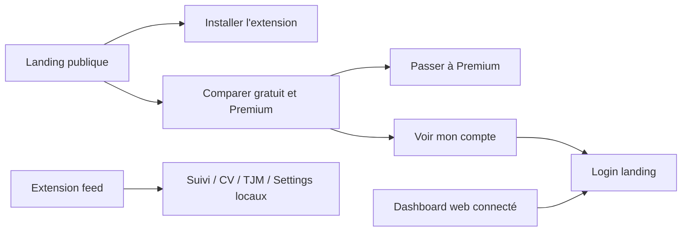
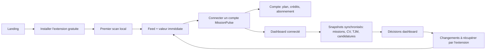

# Audit UX - Cohérence Landing, Extension et Dashboard

Date: 2026-06-18
Produit: MissionPulse
Type: audit UX, produit et cohérence de parcours

## Résumé Décisionnel

MissionPulse est cohérent dans son intention: une extension Chrome local-first qui prouve la valeur avec un feed de missions, puis un plan Premium qui ajoute suivi, CV, TJM, génération IA et dashboard connecté.

L'expérience n'est pas encore optimale parce que le produit ne rend pas assez visible le passage entre ces trois mondes:

- la landing vend "extension gratuite + dashboard connecté";
- l'extension donne la valeur principale mais reste très locale dans son interface;
- le dashboard web existe comme cockpit opérationnel, mais l'utilisateur non connecté voit surtout un écran de login;
- la landing possède aussi une route `/dashboard` orientée compte, abonnement et crédits, ce qui brouille le sens du mot "dashboard".

La priorité produit doit être de clarifier le système:

1. **Extension = point de départ et source de vérité opérationnelle locale.**
2. **Compte = abonnement, crédits et identité MissionPulse.**
3. **Dashboard connecté = cockpit web alimenté par les snapshots synchronisés.**

## Verdict

L'ensemble est conceptuellement cohérent, mais l'expérience utilisateur n'est pas encore la meilleure version possible.

La meilleure surface aujourd'hui est l'extension: elle est immédiate, claire, utile, et elle matérialise la promesse du scan. Le maillon faible est le "pont" entre extension et dashboard connecté. Un utilisateur Premium doit comprendre en quelques secondes:

- s'il est connecté à un compte MissionPulse;
- si ses données restent locales ou sont synchronisées;
- quel appareil extension alimente le dashboard;
- où gérer ses crédits et son abonnement;
- où ouvrir le cockpit web.

Aujourd'hui, ces réponses sont dispersées ou absentes de l'interface.

## Sources Et Preuves

Captures conservées dans ce dossier:

| Fichier | Surface | Ce que la capture prouve |
| --- | --- | --- |
| `01-landing-home.png` | Landing | Hero fort, CTA principal "Installer", pas de point d'entrée compte/dashboard visible au premier écran. |
| `03-landing-login.png` | Landing login | Login générique, sans rappel de l'intention utilisateur. |
| `04-landing-dashboard-route.png` | Landing `/dashboard` | La route dashboard de la landing redirige vers le login. |
| `07-extension-sidepanel.png` | Extension feed | Le feed apporte la valeur principale et affiche le tour du feed. |
| `09-web-dashboard-no-supabase.png` | Dashboard web | Le cockpit web est riche, mais l'état vide expose du langage technique. |
| `10-web-dashboard-no-supabase-full.png` | Dashboard web | Le dashboard couvre feed, TJM, feature access, comparaison, CV et sync. |
| `11-landing-workflow.png` | Landing workflow | Le récit gratuit puis Premium est compréhensible. |
| `12-landing-plans.png` | Landing offres | "Voir mon compte" existe mais arrive tard dans la hiérarchie. |
| `14-extension-settings.png` | Extension settings | Les réglages locaux sont clairs, mais sans compte/sync/dashboard. |
| `16-extension-settings-lower.png` | Extension settings | Export, sauvegarde, IA locale, onboarding et reset existent; pas de compte connecté. |
| `17-extension-suivi.png` | Extension suivi | Le pipeline existe côté extension, sans statut local/synchronisé visible. |

Les captures pleine page `02`, `06`, `08`, `13` sont conservées mais moins fortes comme preuves principales, car certaines longues captures mélangent plusieurs états de scroll ou sont visuellement difficiles à lire.

## Parcours Actuel

Problème principal: le diagramme n'a pas de boucle visible entre `G` et `I`. L'extension et le dashboard partagent le même vocabulaire métier, mais l'utilisateur ne voit pas clairement comment l'un alimente l'autre.

## Parcours Cible

Ce parcours garde la promesse local-first: le compte ne doit pas être requis pour scanner, mais il doit devenir le chemin naturel quand l'utilisateur veut synchroniser, générer, suivre ou travailler sur grand écran.

## Constats Clés

### 1. Le mot "dashboard" porte deux produits

La landing utilise `/dashboard` pour le compte utilisateur. Le monorepo contient aussi `apps/dashboard`, qui est le cockpit opérationnel connecté.

Impact utilisateur:

- "Voir mon compte" peut être compris comme "ouvrir le dashboard".
- "Dashboard connecté" dans la landing peut promettre le cockpit, mais l'utilisateur tombe d'abord sur un login générique.
- Les crédits et l'abonnement sont proches du dashboard dans le discours, mais pas clairement séparés du cockpit métier.

Décision recommandée:

- Réserver **Dashboard connecté** ou **Cockpit** au produit opérationnel.
- Utiliser **Compte** ou **Facturation** pour abonnement, crédits et portail Lemon Squeezy.

### 2. L'extension ne montre pas son état connecté

Dans `14-extension-settings.png` et `16-extension-settings-lower.png`, les paramètres couvrent:

- profil local;
- scan automatique;
- fréquence;
- notifications;
- apparence;
- export local;
- sauvegarde/restauration;
- IA locale;
- onboarding;
- suppression locale.

Ce qui manque:

- état du compte MissionPulse;
- statut Premium;
- solde de crédits;
- appareil extension enregistré;
- dernière synchronisation;
- files upload/download;
- CTA "Connecter le compte";
- CTA "Ouvrir le dashboard connecté".

Impact utilisateur:

Un utilisateur peut payer Premium sans savoir si l'extension qui scanne est reliée au dashboard web.

### 3. Le dashboard web a la bonne profondeur, mais pas le bon empty state produit

Dans `09-web-dashboard-no-supabase.png`, le dashboard montre les bons modules: feed connecté, TJM, fonctionnalités, comparaison, CV, sync.

Mais l'état vide dit:

- `PUBLIC_SUPABASE_URL`;
- `PUBLIC_SUPABASE_ANON_KEY`;
- "Configuration Supabase absente".

Impact utilisateur:

Cette copie est utile pour le développeur, pas pour un utilisateur final. Elle doit être remplacée en production par une explication orientée action.

### 4. Le login ne confirme pas la destination

Le login affiche "Accédez à votre compte MissionPulse", peu importe l'origine.

Origines possibles:

- ouvrir le dashboard connecté;
- gérer l'abonnement;
- acheter des crédits;
- exporter les données connectées;
- activer la synchronisation CV.

Impact utilisateur:

Le login ne rassure pas. Il interrompt le parcours au lieu de confirmer "vous êtes au bon endroit".

### 5. Le pipeline existe en double sans statut de synchronisation

`17-extension-suivi.png` montre un pipeline extension. Le dashboard web contient aussi candidatures, timeline, conflits et synchronisation.

Impact utilisateur:

Sans libellé "local" ou "synchronisé", l'utilisateur ne sait pas si une candidature modifiée dans l'extension sera visible sur le dashboard, ou inversement.

## Risques UX

| Risque | Sévérité | Surface | Pourquoi ça compte |
| --- | --- | --- | --- |
| Confusion entre compte et dashboard connecté | Haute | Landing, login, dashboard | L'utilisateur ne sait pas où il va après connexion. |
| Absence de statut compte/sync dans l'extension | Haute | Extension settings | Le produit Premium manque de boucle d'activation. |
| Empty state dashboard trop technique | Haute | Dashboard web | Dégrade la confiance et expose de l'implémentation. |
| Pipeline local vs connecté non explicite | Moyenne | Extension suivi, dashboard | Risque de perte de confiance sur les données. |
| Tour du feed qui couvre les missions | Moyenne | Extension feed | Peut gêner le premier moment de valeur. |
| Navigation extension dense par icônes | Moyenne | Extension | Moins lisible quand plusieurs pages Premium sont visibles. |
| Landing sections parfois très pâles pendant animation | Faible à moyenne | Landing | À vérifier avec reduced motion et performance réelle. |

## Recommandations P0

### P0.1 - Ajouter une carte "Compte et synchronisation" dans l'extension

Surface probable:

- `apps/extension/src/ui/pages/SettingsPage.svelte`
- `apps/extension/src/lib/state/settings-page.svelte`
- éventuelles facades shell de compte/sync à créer

États attendus:

| État | Contenu |
| --- | --- |
| Non connecté | "Connecter mon compte MissionPulse", explication des données synchronisées, lien compte. |
| Connecté | Email, plan, crédits, appareil, dernière sync, bouton "Ouvrir le dashboard". |
| Premium absent | Montrer ce qui reste local et ce que Premium déverrouille. |
| Sync pending | Files upload/download, dernière tentative. |
| Sync error | Message court, retry, lien diagnostic. |

Critères d'acceptation:

- L'utilisateur peut distinguer "local" et "connecté" depuis les settings extension.
- Le dashboard connecté est ouvrable depuis l'extension.
- Aucun credential plateforme n'est présenté comme synchronisé.

### P0.2 - Clarifier la route compte de la landing

Surface probable:

- `apps/landing/src/routes/+page.svelte`
- `apps/landing/src/routes/dashboard/+page.svelte`
- `apps/landing/src/routes/dashboard/+page.server.ts`

Décision:

- Garder `/dashboard` si nécessaire pour compatibilité, mais afficher la marque **Mon compte** dans l'UI.
- Éviter "dashboard" pour la facturation/crédits.
- Remplacer "Voir mon compte" tardif par une action plus explicite: "Gérer mon compte et mes crédits".

Critères d'acceptation:

- Le mot "dashboard" ne désigne plus le compte/billing dans la copie visible.
- La landing distingue clairement "Compte" et "Dashboard connecté".

### P0.3 - Contextualiser le login

Surface probable:

- `apps/landing/src/routes/login/+page.svelte`
- `apps/landing/src/routes/login/+page.server.ts`

Comportement:

- Lire `redirectTo`.
- Afficher un titre/sous-titre adapté.
- Après envoi du lien, rappeler la destination.

Exemples de copy:

- `/dashboard`: "Connectez-vous pour ouvrir votre compte MissionPulse."
- cockpit connecté: "Connectez-vous pour ouvrir le dashboard connecté."
- export: "Connectez-vous pour exporter vos données connectées."
- crédits: "Connectez-vous pour gérer vos crédits."

Critères d'acceptation:

- Le login répond à "pourquoi dois-je me connecter maintenant ?"
- Le message post-email reprend cette destination.

## Recommandations P1

### P1.1 - Refaire l'empty state du dashboard connecté

Surface probable:

- `apps/dashboard/src/routes/+page.svelte`

Remplacer la copie technique par:

- état utilisateur: "Aucune extension connectée";
- valeur: "Le dashboard se remplit après un scan depuis l'extension connectée";
- prochaine étape: "Installer l'extension" ou "Connecter l'extension";
- lien secondaire: "Lire ce qui est synchronisé".

Garder les variables Supabase seulement en dev ou diagnostics.

### P1.2 - Marquer les données comme locales ou synchronisées

Surfaces:

- `apps/extension/src/ui/pages/ApplicationsPage.svelte`
- `apps/extension/src/ui/pages/CvPage.svelte`
- `apps/extension/src/ui/pages/TJMPage.svelte`
- `apps/dashboard/src/routes/+page.svelte`

Ajouter des badges courts:

- "Local uniquement";
- "Synchronisé";
- "En attente";
- "Action requise".

### P1.3 - Aligner le showcase landing avec le vrai cockpit

Le showcase de la landing explique bien le workflow, mais il ressemble davantage à une maquette qu'au dashboard réel. Ajouter une section ou un visuel qui montre:

- side panel extension pour scanner;
- dashboard connecté pour piloter;
- compte pour crédits/facturation.

## Recommandations P2

- Déplacer le tour du feed pour ne pas couvrir la première mission.
- Tester `prefers-reduced-motion` sur les fades de la landing.
- Ajouter un microcopy privacy près de la connexion: "Les sessions Free-Work, LeHibou, etc. restent dans Chrome."
- Ajouter une page courte "Données synchronisées" accessible depuis landing, dashboard et extension.

## Backlog Actionnable

| Priorité | Tâche | Fichiers probables | Validation |
| --- | --- | --- | --- |
| P0 | Carte compte/sync extension | `SettingsPage.svelte`, `settings-page.svelte.ts`, facades shell | Capture settings avec état connecté/non connecté. |
| P0 | Renommer compte vs dashboard | landing routes et copy | Recherche texte: pas de "dashboard" pour billing visible. |
| P0 | Login contextualisé | login route | Tests ou captures pour plusieurs `redirectTo`. |
| P1 | Empty state dashboard utilisateur | dashboard page | Capture sans Supabase ne montre plus les env vars en mode prod. |
| P1 | Badges local/sync | extension pages + dashboard | Les pages pipeline/CV/TJM indiquent l'état de données. |
| P1 | CTA connecter extension côté dashboard | dashboard sync section | Empty state donne une prochaine action claire. |
| P2 | Tour feed moins intrusif | `FeedTourOverlay`, `FeedPage` | Première mission reste lisible. |
| P2 | Reduced motion landing | landing CSS | Animations désactivées ou atténuées avec media query. |

## Critères De Sortie Pour Une UX Cohérente

L'expérience pourra être considérée cohérente quand:

1. La landing explique en un seul parcours: installer, scanner, connecter, piloter.
2. Le compte web ne se confond plus avec le dashboard opérationnel.
3. L'extension expose son état de compte et de synchronisation.
4. Le dashboard explique comment recevoir les données de l'extension.
5. Les pages de suivi/CV/TJM disent si leurs données sont locales, synchronisées ou en erreur.
6. Le login confirme la destination et la raison de l'authentification.
7. Les états vides ne parlent pas d'implémentation sauf en mode développeur.

## Questions Produit À Trancher

1. Le dashboard connecté doit-il être accessible comme app publique séparée, ou seulement via le compte MissionPulse ?
2. Le compte Premium est-il vérifié côté extension par session web, token local, ou simple état stocké ?
3. La synchronisation doit-elle être automatique après connexion, ou déclenchée explicitement ?
4. Les crédits IA sont-ils consommés dans l'extension, dans le dashboard, ou les deux ?
5. Quel nom final choisir: "Dashboard connecté", "Cockpit", "Workspace" ou "Pilotage missions" ?

## Limites De L'Audit

- Pas d'authentification Supabase effectuée.
- Pas de paiement Lemon Squeezy testé.
- Pas de test complet clavier ou lecteur d'écran.
- Les états connectés ont été inférés depuis le code et les états non connectés capturés.
- Les captures sont suffisantes pour diagnostiquer la cohérence de parcours, mais pas pour valider la conformité WCAG.
