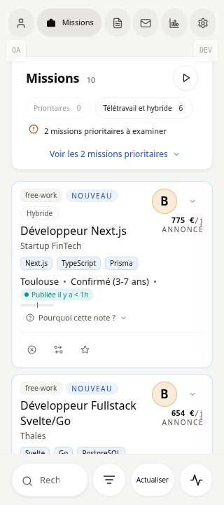
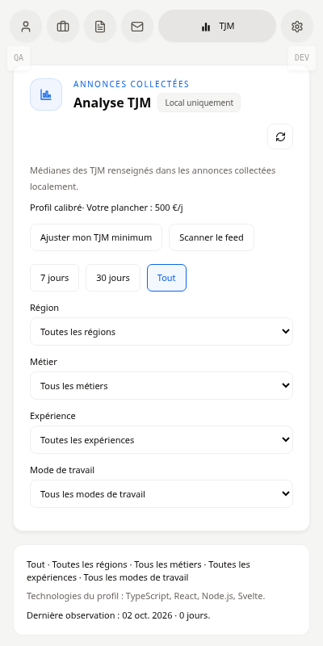

# Captures et QA de l’extension — 2 octobre 2026

La navigation compacte conserve les six destinations. L’onglet actif s’élargit en pastille et révèle son libellé avec une transition de 180 ms ; les onglets inactifs restent en icônes avec un nom accessible et une infobulle. Le focus clavier et la préférence de réduction des animations sont conservés.

La QA ciblée a validé 65 parcours E2E sur le feed, les filtres, le CV, les relances, le TJM, les réglages et l’accessibilité. Après le rétablissement de la navigation, les 8 parcours de navigation et d’entrée UX passent, ainsi que le typecheck de l’extension et le build. Aucun débordement horizontal n’a été observé à 320 ou 400 px.

Les captures utilisent Chromium système, le serveur de développement et des données locales de démonstration. Les pastilles DEV/QA sont réservées au développement. Ces contrôles ne prouvent pas le fonctionnement d’une extension installée, des sessions réelles des plateformes ou des services IA.

## Missions — 320 px

## Missions — 400 px

## TJM sélectionné — 400 px

