# MissionPulse — Phase B Interactive QA: Confirmed Bugs

`reports/qa/qa-runner-bugs.md` — produced by the `qa-runner` agent (Phase B).

Environment: Vite dev server (port 5176, PID 23083), target `http://localhost:5176/src/sidepanel/index.html`, Playwright 1.59.1 (headless Chromium), 400x760 side-panel viewport. Seeded via the DevPanel "Inject QA seed (500)" path (~500 missions, full profile, healthy/degraded/broken connectors, 9 trackings across all statuses), snapshotted to a reusable `storageState`. Each scenario boots an isolated context; failure paths are exercised by wrapping `chrome.runtime.sendMessage` to reject on chosen message types. No destructive actions were executed (the reset confirmation was armed but NOT confirmed), no source changes, no commits/PRs.

## Summary

- Findings: 15
- Confirmed bugs: 13 (HIGH 2, MED 6, LOW 7)
- Dev-masked (code defect real, unreachable in dev): 1
- No-defect (clean sweep): 1

Severity counts among confirmed bugs: HIGH=2, MED=6, LOW=7.

Status legend: CONFIRMED = reproduced live; DEV-MASKED = code defect confirmed but the dev stub hides the symptom; NO DEFECT = swept and clean.

## Confirmed bugs (by severity)

### APP-01 — [HIGH] Terminal-status missions (accepted/rejected) with overdue nextActionAt inflate "Relance à faire"

- Status: **CONFIRMED** · Phase A: **confirms** · Area: Applications
- Note: Default seed only makes application_prepared overdue; terminal missions need the patch to surface the bug.

**Reproduction:**

1. Patch the seed so the "accepted" tracking has a past nextActionAt (now-5h).
2. Open Applications.
3. Relances count rises (was 1) and the accepted terminal mission is recommended as "Relance échue".

**Expected:** Terminal statuses (accepted/rejected/archived) should not be surfaced as actionable relances — they are closed.

**Actual:** RELANCES=2; recommended-dossier "Relance échue"=true.

**Code:** `src/lib/shell/scan/pipeline-summary.ts:61-74`, `src/ui/pages/ApplicationsPage.svelte:76-79`, `src/ui/pages/ApplicationsPage.svelte:105-120`

**Evidence:**

- 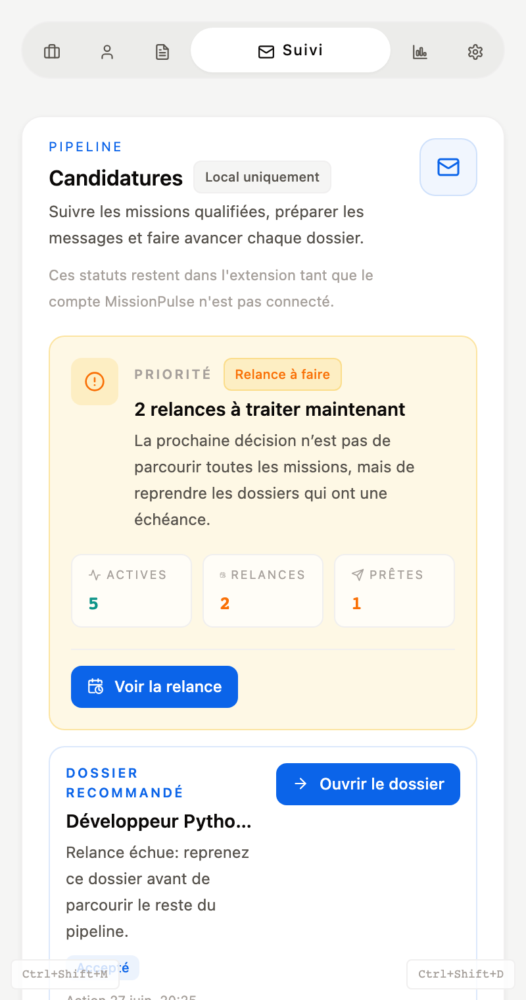 (`screenshots/applications-terminal-relance-inflation.png`)

### CV-01 — [HIGH] LinkedIn preview/import/sync are unstubbed → null deref TypeError (feature fully broken in dev)

- Status: **CONFIRMED** · Phase A: **refines** · Area: CV
- Note: Root cause matches Phase A (LinkedIn unstubbed), but the manifestation is a TypeError, not the intended graceful error object — the facade lacks a null guard.

**Reproduction:**

1. Open CV page.
2. Click the LinkedIn preview button ("Prévisualiser LinkedIn").
3. chrome-stubs has no case for PREVIEW/IMPORT/SYNC_LINKEDIN_PROFILE → default returns null.
4. The facade reads response.type on null → TypeError (unhandled rejection + console error).

**Expected:** Either a graceful "unexpected_response" error card, or a stubbed preview. The CvPage error branch is never reached because the facade throws first.

**Actual:** null-deref TypeError surfaced as an UNHANDLED pageerror (pageFailures) = true; graceful "unexpected_response" card shown=false; console.error count=0. The facade throws before CvPage can render its error branch.

**Code:** `src/dev/chrome-stubs.ts:524-526`, `src/lib/shell/facades/profile-sync.facade.ts:53-65`, `src/ui/pages/CvPage.svelte:379-394`

**Evidence:**

- 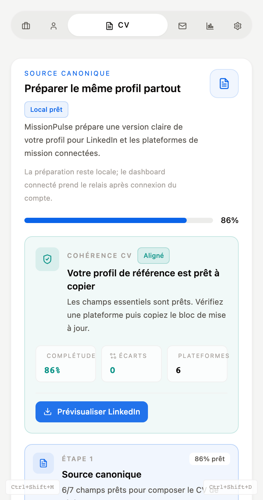 (`screenshots/cv-linkedin-preview-broken.png`)

### FEED-01 — [MED] dashboardSummary.newCount ignores active filters (action queue overstates)

- Status: **CONFIRMED** · Phase A: **confirms** · Area: Feed

**Reproduction:**

1. Boot seeded feed (~95 visible).
2. Note action queue "Qualifier N" (newCount) and visible badge.
3. Click "Prioritaires" preset.
4. Visible badge shrinks but action queue "Qualifier N" stays unchanged.

**Expected:** Action-queue counts should reflect the currently visible (filtered) mission set.

**Actual:** After filter: 26 visible but action queue still says "Qualifier 65".

**Code:** `src/lib/state/feed-page.svelte.ts:317-347`, `src/lib/state/feed-page.svelte.ts:374-381`

**Evidence:**

- 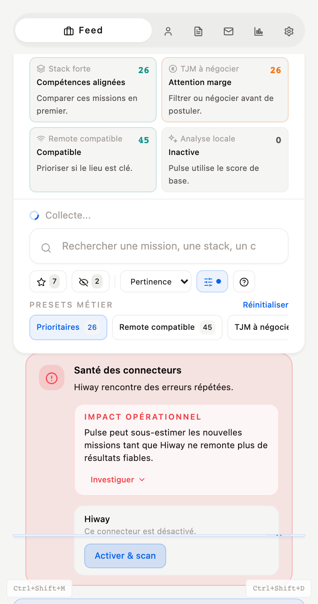 (`screenshots/feed-dashboard-mismatch.png`)

### FEED-03 — [MED] MissionComparison shows divergent scores (table semanticScore vs recommendation total)

- Status: **CONFIRMED** · Phase A: **confirms** · Area: Feed
- Note: Masked in default dev (scanner forces semanticScore=null); reproduced via realistic enriched-state patch.

**Reproduction:**

1. Patch 101 free-work missions to semanticScore=12 (≠ breakdown.total).
2. Select two missions, open Comparison.
3. Table "Score" row shows 12/100 while the recommendation "Score" evidence shows the real total.

**Expected:** A single, consistent score per mission across table and recommendation.

**Actual:** table shows 12/100=true; recommendation shows high total=true. (In default dev the bug is masked because semanticScore is always null.)

**Code:** `src/ui/organisms/MissionComparison.svelte:40-44`, `src/ui/organisms/MissionComparison.svelte:49-51`

**Evidence:**

- 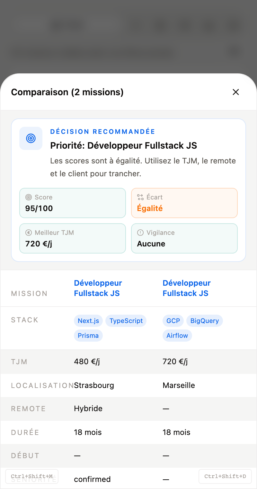 (`screenshots/feed-comparison-score-divergence.png`)

### ONB-01 — [MED] Onboarding advances past the alert step even when the alert save fails

- Status: **CONFIRMED** · Phase A: **confirms** · Area: Onboarding

**Reproduction:**

1. Replay onboarding, walk to the "Créer une alerte" step.
2. Force SAVE_CONNECTED_ALERT_PREFERENCES to fail.
3. Click "Voir le premier insight".
4. handleSaveAlertPreferences catches the error (toast) but never rethrows → saveAlertAndContinue() still calls goNext().

**Expected:** On save failure the wizard should stay on the alert step and let the user retry.

**Actual:** advanced to insight step=true; error toast shown=true.

**Code:** `src/ui/organisms/OnboardingWizard.svelte:151-162`, `src/ui/pages/OnboardingPage.svelte:55-65`, `src/lib/shell/facades/alert-preferences.facade.ts:32-34`

**Evidence:**

- 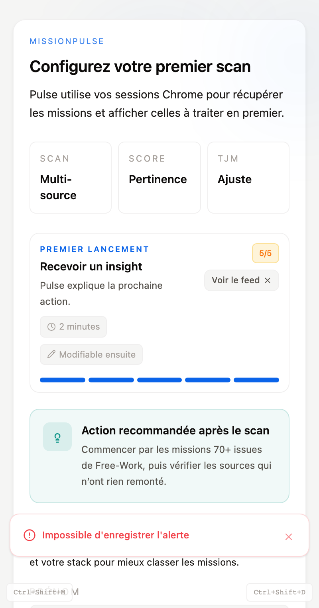 (`screenshots/onboarding-alert-failure-advances.png`)

### SET-01 — [MED] BackupRestoreModal spinner stuck forever when restore persistence fails

- Status: **CONFIRMED** · Phase A: **confirms** · Area: Settings

**Reproduction:**

1. Generate a backup, open the restore modal, type RESTAURER.
2. Force SAVE_PROFILE to fail (inject sendMessage failure).
3. Click "Restaurer ce point".
4. restoreBackup() rejects → modal not closed; the modal-local isRestoring flag is never reset.

**Expected:** On failure the spinner should clear and an inline error should let the user retry/cancel.

**Actual:** modal still open=true; spinner "Restauration..." stuck=true.

**Code:** `src/ui/molecules/BackupRestoreModal.svelte:15-25`, `src/lib/state/settings-page.svelte.ts:651-677`, `src/ui/pages/SettingsPage.svelte:156-164`

**Evidence:**

- 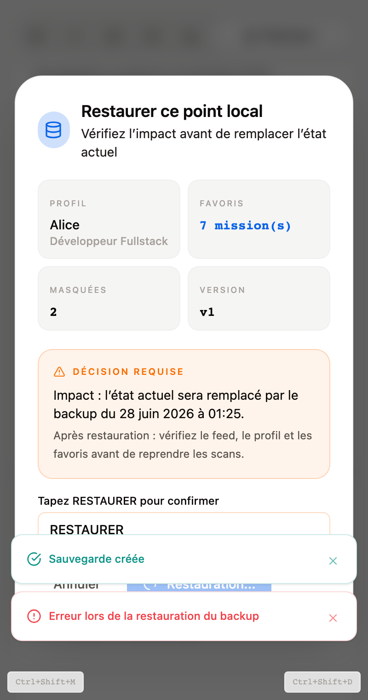 (`screenshots/settings-backup-restore-stuck.png`)

### SET-02 — [MED] RESET_LOCAL_DATA failure is silently swallowed (empty catch, no user feedback)

- Status: **CONFIRMED** · Phase A: **confirms** · Area: Settings
- Note: Final destructive confirm NOT executed (QA constraint). Confirmed statically + via the armed confirmation UI.

**Reproduction:**

1. Open Settings danger zone, click "Réinitialiser tout".
2. Confirmation panel appears; typing SUPPRIMER arms the destructive button.
3. resetAll() catch block (lines 533-535) is empty — on a real failure the user gets NO toast, NO error, and the panel stays.

**Expected:** A failed reset should surface an error toast and keep the user informed.

**Actual:** Confirmation UI armed (destructive button enabled=true); code path has an empty catch (Hors contexte extension).

**Code:** `src/lib/state/settings-page.svelte.ts:521-536`

**Evidence:**

- 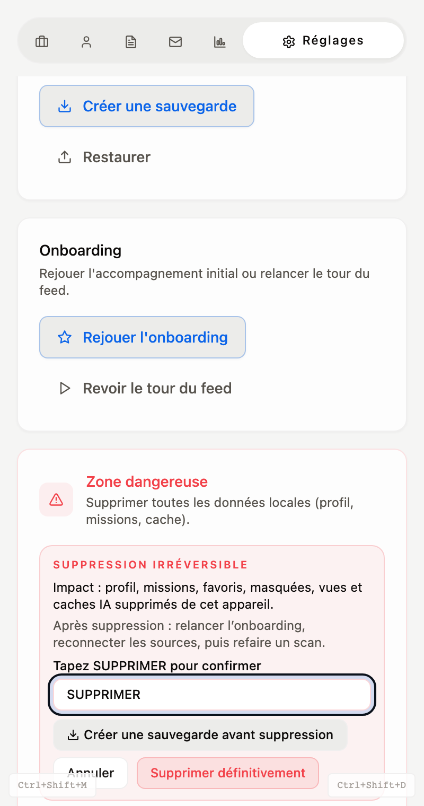 (`screenshots/settings-reset-confirm-ui.png`)

### FEED-02 — [LOW] feedStory renders critical error while cached missions stay visible

- Status: **CONFIRMED** · Phase A: **confirms** · Area: Feed

**Reproduction:**

1. Boot seeded feed (missions present).
2. Force feed error state via DevPanel / dev:feed-state "error".
3. Observe critical story ("Impossible de récupérer...") while the mission list is still rendered.

**Expected:** When cached missions are shown, the story should be degraded/warning, not critical.

**Actual:** critical story text detected=true; feed anchor still rendered=true

**Code:** `src/ui/pages/FeedPage.svelte:317-328`

**Evidence:**

- 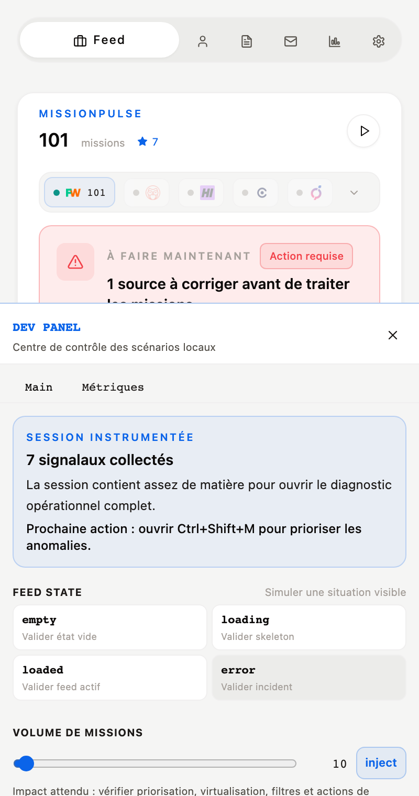 (`screenshots/feed-story-critical-with-missions.png`)

### FEED-04 — [LOW] FeedTourOverlay "Suivant" button uses non-existent text-text-900 token (contrast)

- Status: **CONFIRMED** · Phase A: **confirms** · Area: Feed/Settings

**Reproduction:**

1. Settings → "Revoir le tour du feed".
2. The overlay CTA uses class text-text-900; @theme defines no --color-text-900, so no color utility is generated.
3. Button text falls back to the inherited (near-black) color on a blue button → poor contrast.

**Expected:** An explicit, theme-valid text color (e.g. text-surface-white) on the blue CTA.

**Actual:** overlay rendered=true. The CTA class "text-text-900" has no matching @theme token (@theme defines --color-text-primary/secondary/muted/subtle but NOT --color-text-900), so Tailwind generates no text-color utility and the blue button inherits ambient (near-black) text color -> poor contrast. (Runtime computed-color probe did not resolve; defect is code-confirmed.)

**Code:** `src/ui/molecules/FeedTourOverlay.svelte:65`

**Evidence:**

- 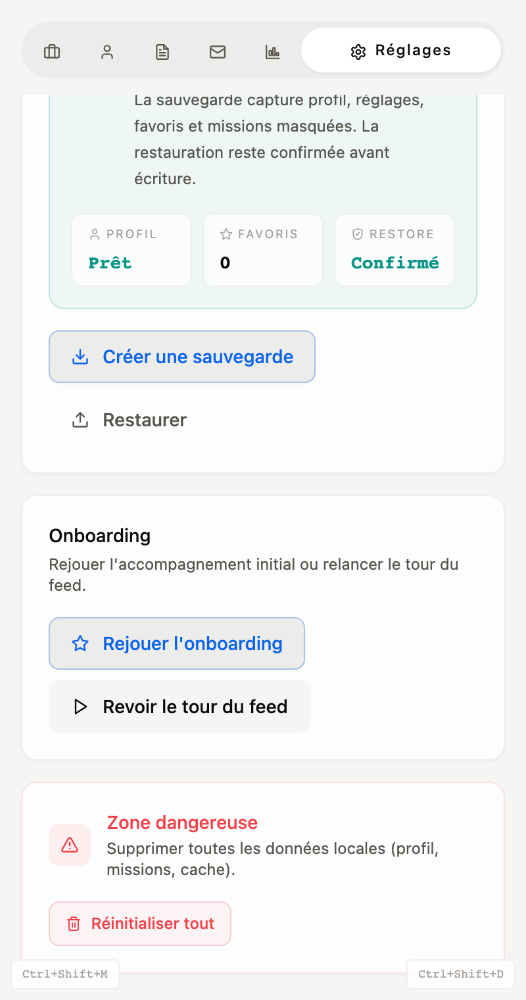 (`screenshots/feed-tour-contrast-text-900.png`)

### SET-03 — [LOW] Scan frequency range is keyboard-operable & persists while autoScan is off

- Status: **CONFIRMED** · Phase A: **confirms** · Area: Settings

**Reproduction:**

1. Settings → toggle "Scan automatique" OFF.
2. Tab to the frequency range (wrapper is pointer-events-none + opacity-40 only).
3. Press ArrowRight — value changes and is persisted (no disabled / aria-disabled on the input).

**Expected:** The range should be truly disabled (disabled/aria-disabled) when autoScan is off.

**Actual:** range value 30 → 40 via keyboard while autoScan off.

**Code:** `src/ui/organisms/ScanSettings.svelte:60-89`

**Evidence:**

- 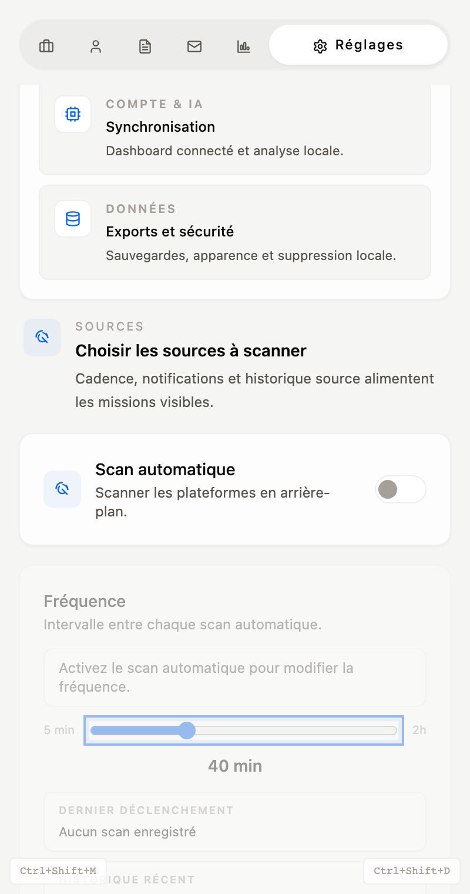 (`screenshots/settings-scan-range-a11y.png`)

### TJM-01 — [LOW] TJM region filter is not exposed as a control (only stack filtering + sort passed through)

- Status: **CONFIRMED** · Phase A: **confirms** · Area: TJM

**Reproduction:**

1. Open TJM page.
2. Inspect all <select> controls: the only one is a SORT control; none filters by region (TJMPage passes only profileStacks).

**Expected:** A region selector when regional TJM insights are shown.

**Actual:** selects=[{"id":"sort-select","aria":null,"opts":"Pertinence|Date|TJM"}]; region filter present=false.

**Code:** `src/ui/pages/TJMPage.svelte:36`, `src/ui/organisms/TJMDashboard.svelte`

**Evidence:**

- 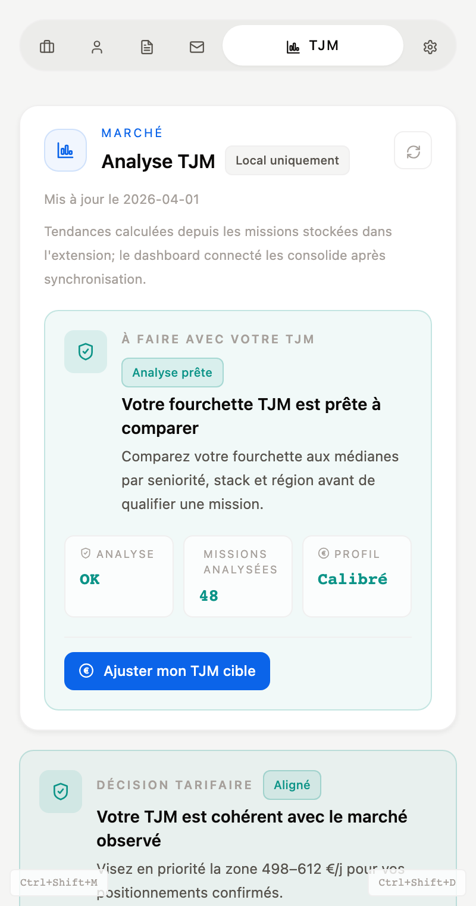 (`screenshots/tjm-region-filter-absent.png`)

### TJM-02 — [LOW] Inverted TJM target (tjmMin>tjmMax) is not validated; positioning still renders

- Status: **CONFIRMED** · Phase A: **confirms** · Area: TJM

**Reproduction:**

1. Patch profile tjmMin=800, tjmMax=400.
2. Open TJM page.
3. Positioning/median renders with no validation error.

**Expected:** A guard/error when tjmMin > tjmMax.

**Actual:** median/positioning rendered=true; validation error shown=false.

**Code:** `src/ui/organisms/TJMDashboard.svelte:53-62`

**Evidence:**

-  (`screenshots/tjm-inverted-target-not-validated.png`)

### TJM-03 — [LOW] TJMGauge.svelte is dead code with literal \u20ac + always-blue statusColor

- Status: **CONFIRMED** · Phase A: **confirms** · Area: TJM
- Note: Static confirmation (no runtime screenshot possible — component is unmounted).

**Reproduction:**

1. grep imports of TJMGauge across src/ → none.
2. Read TJMGauge.svelte: literal "\u20ac" in template; statusColor always bg-blueprint-blue.

**Expected:** Either remove dead code or render it with a real € glyph and dynamic status color.

**Actual:** No component imports TJMGauge; the file ships a literal backslash-u-20ac and a constant color.

**Code:** `src/ui/molecules/TJMGauge.svelte:28-34,47,49,65`

## Dev-masked defect

### ONB-02 — [MED] Onboarding skip does not save a profile (null-profile state unreachable in dev)

- Status: **DEV-MASKED** · Phase A: **confirms** · Area: Onboarding

**Reproduction:**

1. Replay onboarding, click "Passer et voir le feed" (skip).
2. The lifecycle machine does not persist a profile on skip.
3. In dev, GET_PROFILE falls back to mockProfile, so the feed always has a profile — the null state cannot be reproduced.

**Expected:** Either skip still seeds a minimal profile, or the feed degrades gracefully with no profile.

**Actual:** after skip: dev localStorage profile present=true; feed anchor rendered=true (mockProfile fallback hides the null state).

**Code:** `src/lib/shell/machines/app-lifecycle.machine.ts:134-142`, `src/dev/chrome-stubs.ts:108,163-164`

**Evidence:**

- 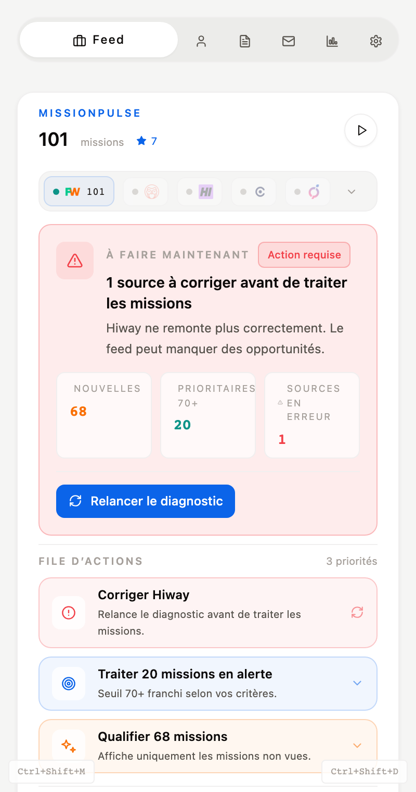 (`screenshots/onboarding-skip-profile-state.png`)

## No-defect sweep

### UI-01 — [LOW] Cross-page sweep: console errors / horizontal overflow at 400px width

- Status: **NO DEFECT** · Phase A: **new** · Area: UI Hunt

**Reproduction:**

1. Visit all 6 pages at the 400px side-panel width; capture console errors and scrollWidth>clientWidth.

**Expected:** No unhandled console errors and no horizontal overflow on any page.

**Actual:** overflow pages=[]; error pages=[] (clean = no defects).

**Evidence:**

- 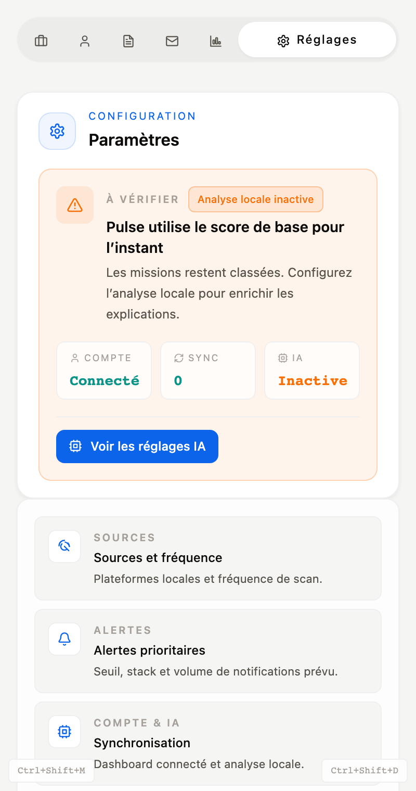 (`screenshots/ui-sweep-settings.png`)

**Per-page sweep:**

- feed: consoleErrors=0, pageErrors=0, horizontalOverflow=false
- profile: consoleErrors=0, pageErrors=0, horizontalOverflow=false
- cv: consoleErrors=0, pageErrors=0, horizontalOverflow=false
- applications: consoleErrors=0, pageErrors=0, horizontalOverflow=false
- tjm: consoleErrors=0, pageErrors=0, horizontalOverflow=false
- settings: consoleErrors=0, pageErrors=0, horizontalOverflow=false

---

## Reproducing this run

```bash
# dev server (strictPort 5176)
cd apps/extension && pnpm dev
# build the QA seed snapshot once (via DevPanel inject + reload), then:
node tests/e2e/qa/smoke.mjs     # boots + builds /tmp/qa-storage-state.json
node tests/e2e/qa/run-qa.mjs    # all scenarios -> /tmp/qa-findings.json + screenshots/
node tests/e2e/qa/generate-report.mjs
```

Harness & scenarios live under `apps/extension/tests/e2e/qa/` (no `*.test.*` suffix, so the Playwright runner ignores them).
